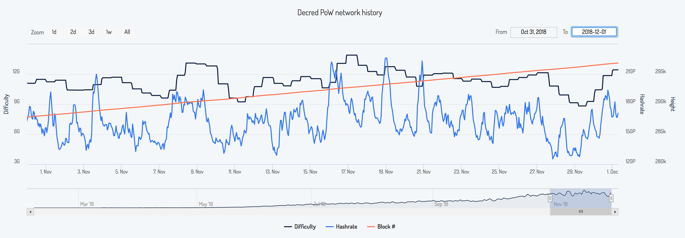
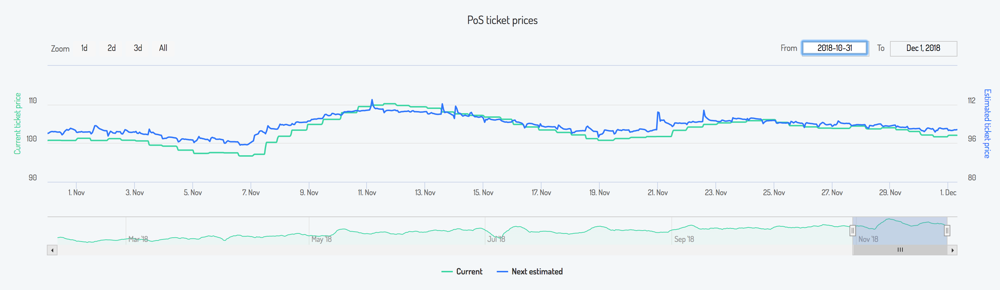
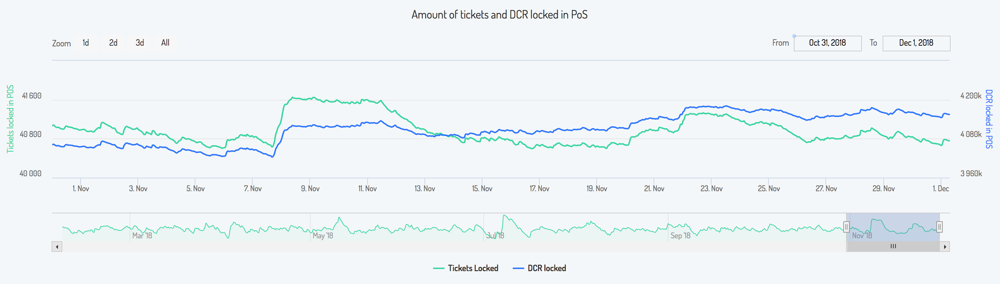
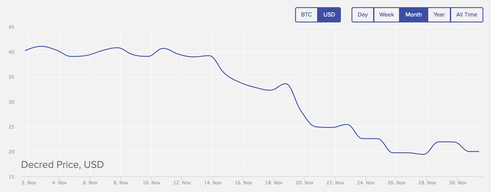
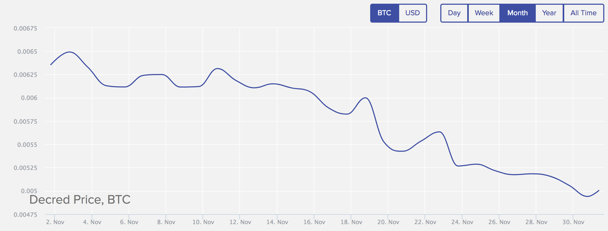
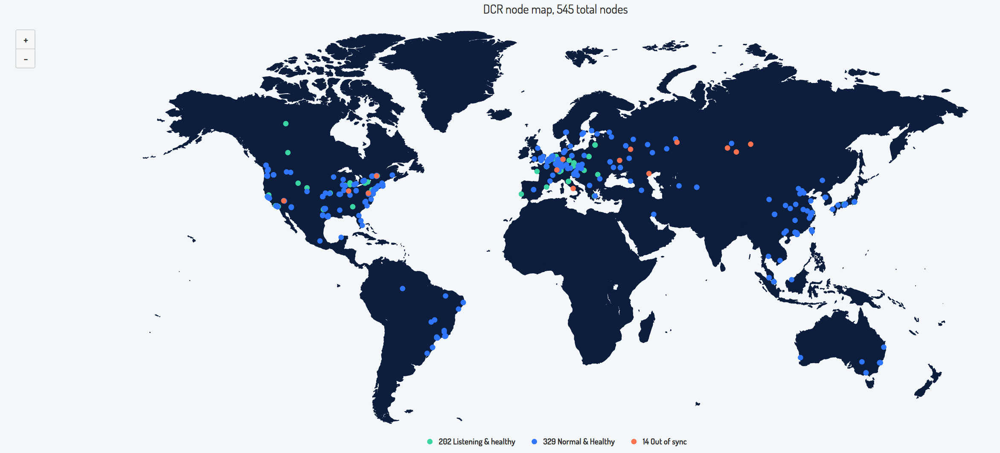

{DRAFT}# Decred月报 - 11月 

Decred在11月取得激动人心的进展。社区开始从Politeia的提案系统获得好处。 利益相关者通过Decred钱包 （Decrediton或dcrcli) 积极表达对于项目未来方向的提案， 包括项目服务商管理，公共关系和区块链研究。

Decred 已进展到可以支持任何利益相关者对Decred的愿景 - 更多公司和贡献者加入Decred生态，而一些长期贡献者则根据兴趣和能力提出议案。

在社区的兴奋，成长和变化中，Decred保持项目的更新步伐。桌面和移动钱包的测试版本表现出Decred一贯对稳定和创新的传统坚持。

### 开发进展总结

[dcrd](https://github.com/decred/dcrd): [UTXO反转的设置语义](https://github.com/decred/dcrd/pull/1471)合并是一项重要的更改，将提供更简单有效率的处理未花费的交易输出。这在区块重组测试运行是速度提高了40％。随附的[数据库迁移](https://github.com/decred/dcrd/pull/1520)将合并，并在下一个主要版本发布中添加。

[dcrwallet](https://github.com/decred/dcrwallet):随着使用量增加，默认监视地址数量变得有限，并且dcrwallet配置文件修改作为解决方案。这个[监视地址问题](https://github.com/decred/dcrwallet/pull/1320)默认本月修改。其他少见的用例修复包括可能[遗漏或双重交易](https://github.com/decred/dcrwallet/pull/1321)及[锁定余额计算的改进](https://github.com/decred/dcrwallet/pull/1330)。

[Decrediton](https://github.com/decred/decrediton):为了确保持续的跨平台稳定性和性能，Decrediton更新到[Electron 3](https://github.com/decred/decrediton/pull/1777)同时添加了Decred[基金会余额的显示](https://github.com/decred/decrediton/pull/1764)。[大钱包](https://github.com/decred/decrediton/pull/1727)的启动性能也得到改善。 自动购票已切换到[自动购票v2](https://github.com/decred/decrediton/pull/1744)。由于票价稳定，它的选项较少，而且比v1更易于使用。现在，用户只需要指定保留余额，账户及使用的选票矿池。Politeia整合也有所改进，包括[优化的](https://github.com/decred/decrediton/pull/1825)提案加载，[新提案和投票的通知](https://github.com/decred/decrediton/pull/1835)。UI/UX本月看到了一些调整，包括[概览设计改进](https://github.com/decred/decrediton/pull/1818)，更新的[账户图标](https://github.com/decred/decrediton/pull/1811)以及[导航图标和微动画](https://github.com/decred/decrediton/pull/1809)的改进。提到的功能已合并到主分支中，并将在下一版Decrediton中体现。

Trezor: Model T已[发布](https://blog.trezor.io/firmware-updates-2-0-9-and-1-7-1-developed-by-the-community-for-the-community-c4b965741ca3) 支持Decred的最新固件 version 2.0.9。感谢 @matheusd。现在Decrediton开发员可以开始整合的工作了。

[Politeia](https://github.com/decred/politeia):感谢@iemlisted的报告，修补了一个[小漏洞](https://github.com/decred/politeia/issues/563)。 [politeiavoter](https://github.com/decred/politeia/tree/master/politeiavoter)获得了隐私改进{try to find a link}。 根据大众需求，创建了一个[电子邮件通知系统](https://github.com/decred/politeiagui/pull/919)，以支持对新提案和评论更新消息{pr 919仅提及评论，是否还有新提案的公关？}。通过[票证功能搜索](https://github.com/decred/politeiagui/pull/899)可以验证投票{与开发者核实并澄清票证搜索是客户端，票证不会发送到服务器以保护隐私}。 请注意，某些功能只会在下次[主网站](https://proposals.decred.org/)下次更新后才能体现。

针对查看提案修订[之间的差异](https://github.com/decred/politeiagui/issues/754)已完成[两个](https://github.com/decred/politeia/pull/613)[步骤](https://github.com/decred/politeiagui/pull/906),[突出显示新评论](https://github.com/decred/politeiagui/pull/897)的工作也已经开启。

[Android](https://github.com/decred/dcrandroid):安卓版Decred钱包开发在本月实现了一次飞跃-在[Google Play商店](https://play.google.com/store/apps/details?id=com.decred.dcrandroid.mainnet)推出了预发布版本。 Play商店版本包括更新的货币转换，以[本地货币显示费用](https://github.com/decred/dcrandroid/issues/192)和[高级密码保护](https://github.com/decred/dcrandroid/issues/134)，能够[锁定所有数据](https://github.com/decred/dcrandroid/issues/187)并使用[访问密码](https://github.com/decred/dcrandroid/issues/180)。此版本还包括一个安全菜单，允许用户[签署](https://github.com/decred/dcrandroid/issues/226)证明地址所有权的消息。 另一个成功实施的社区创新是“[隐藏帐户](https://github.com/decred/dcrandroid/issues/175)”功能。隐藏帐户允许移动用户将资金存放在他们的移动钱包中，但资金将不会显示在主屏幕余额上。在本地聚会交易Decred的社区成员为这项功能提供的额外隐私和安全感到兴奋。账户之间的资金转账在本月也得到了升级，只需简单的[下拉选择](https://github.com/decred/dcrandroid/issues/119)让转账更快速简便。

[iOS](https://github.com/raedahgroup/dcrios):iOS移动钱包目前正处于测试阶段，需要额外的开发周期才能合并Android上提供的功能集。

[dcrdata](https://github.com/decred/dcrdata): 本月集成到基本代码中的新功能包括[网络哈希表](https://github.com/decred/dcrdata/issues/723)，在导航菜单添加[Decred基金会](https://github.com/decred/dcrdata/issues/784)以及更详细的交易信息，例如在[内存池上显示交易输出花费](https://github.com/decred/dcrdata/issues/825)，在[地址视图上显示交易类型](https://github.com/decred/dcrdata/issues/741)和改进的[时间戳信息](https://github.com/decred/dcrdata/issues/776)。

在开发方面，@gozart开始了重构将javascript代码库[转换](https://github.com/decred/dcrdata/pull/805)到ES6模块，添加用于前端开发工具和生产资产捆绑的webpack，强制执行代码样式并将CSS转换为[SCSS partials](https://github.com/decred/dcrdata/pull/839)。

[dcrstakepool](https://github.com/decred/dcrstakepool)：这是大多数(如果不是全部)VSP(选票矿池)使用的软件。自述文件[更新](https://github.com/decred/dcrstakepool/pull/285)了包含Go模块的构建说明。交易链接已从Insight更改为[dcrdata](https://github.com/decred/dcrstakepool/issues/264)。

发现并讨论了几个隐私问题。目前正在测试补丁以[自托管CAPTCHA](https://github.com/decred/dcrstakepool/pull/281)取代Google recaptcha，以避免利益相关者的指纹识别。欢迎VSP(选票矿池)运营商加入测试。[已删除](https://github.com/decred/dcrstakepool/pull/283)对Cloudflare的请求。提出了[让电子邮件可选](https://github.com/decred/dcrstakepool/issues/274)的问题。

[Ticket splitting](https://github.com/matheusd/dcr-split-ticket-matcher)：分票测试版在11月份继续增长，每天都有分票。两个集成了分票的VSP，[decredbrasil.com](https://stake.decredbrasil.com/)和[decredvoting.com](https://decredvoting.com/)，除了他们网站上的指南,还发布了[教程视频](https://www.youtube.com/watch?v=3RGoUQK0g24)(葡萄牙语和英语)以及[分票概述](https://www.reddit.com/r/decred/comments/9vhpby/decred_ticket_splitting_overview/)。该软件已更新，以支持SPV轻钱包模式。请阅读[问题](https://github.com/matheusd/dcr-split-ticket-matcher/issues/29)以考虑隐私问题。

分票支持在[Decred Slack](https://decred.slack.com)和[电报群](https://t.me/dcrticketsplit)中都有[VSP教程](https://t.me/dcrticketsplit/2666)。

design:
* https://medium.com/@firethought/base-iconset18-motion-pack-readme-a96f96e868

[docs](https://github.com/decred/dcrdocs)：11月对于文档来说是一个巨大的月份。这文档包含各种社区支持的更改和更新。[VSP更改语言提案](https://proposals.decred.org/proposals/522652954ea7998f3fca95b9c4ca8907820eb785877dcf7fba92307131818c75)通过，证实了社区希望在所有Decred文档中将“PoS Mining”更改为“PoS投票”，并从“stakepool”更改为“Voting Service Provide(VSP)”。更新包括[一般文档的更改](https://github.com/decred/dcrdocs/pull/590)和[选票矿池页面](https://github.com/decred/dcrdocs/pull/724)。

更新基金会[采用“Decred Treasury”](https://github.com/decred/dcrdocs/pull/690)，该基金会地址持有来自区块奖励10％的资金。对于那些希望更深入了解Politeia的人们，我们创建了一个新的"[Politeia数据导航](https://docs.decred.org/advanced/navigating-politeia-data/)"高级文档。经常被要求和期待已久的[Decred Glossary](https://github.com/decred/dcrdocs/pull/675)(Decred词汇)在本月完成并发布，@s_ben和许多支持这项工作的人付出了巨大努力提供反馈和建议。我们强烈建议使用[词汇表](https://docs.decred.org/glossary/)来改善我们对共享社区的理解。

[decred.org](https://github.com/decred/dcrweb):

* 重命名"mining" 改成 "voting", "stakepool" 改成 "VSP" https://github.com/decred/dcrweb/pull/435

Dev activity stats for {month}: {} active PRs, {} master commits, {} added and {} deleted lines spread across {} repositories. Contributions came from {}-{} developers per repository. ([chart]({}))

### Politeia提案系统总结

#### 本月完成投票 - 6 份 

**1.[Decred Contractor Clearance Process](https://proposals.decred.org/proposals/fa38a3593d9a3f6cb2478a24c25114f5097c572f6dadf24c78bb521ed10992a4)** 

* 投票结束 - 11月21日 **通过**
* 法定票数：13228/8173 票，13206 通过(95.71%) 
* 提案建议设立 Decred Contractor Clearance (DCC) 为服务商作为对项目参与及贡献的条件。获取DCC必需要有 3个合格服务商／贡献者担保有相关工作需要的技能。相同的，撤掉服务商资格也只需要3个合格服务商／贡献者投票撤除。

**2.[Wachsman Communications Proposal for Decred](https://proposals.decred.org/proposals/bc8776180b5ea8f5d19e7d08e9fcc35f0d1e3d16974963e3e5ded65139e7b092)**

* 投票结束 - 11月5日 **不通过**
* 法定票数：13202/8192 票，3646 通过(27.62%) 
* 专业的宣传公司合作提案。要求为期6个月，每月 2万美金的经费。

**3.[Ditto Communications Proposal for Decred](https://proposals.decred.org/proposals/27f87171d98b7923a1bd2bee6affed929fa2d2a6e178b5c80a9971a92a5c7f50)**

* 投票结束 - 11月5日 **通过**
* 法定票数：21191/8192 票，13206 通过(62.32%) 
* 专业的宣传公司合作提案。要求为期6个月，每月 2万5千美金的经费。

**4.[Decred Open Source Research](https://proposals.decred.org/proposals/c68bb790ba0843980bb9695de4628995e75e0d1f36c992951db49eca7b3b4bcd)**

* 投票结束 - 11月5日 **通过**
* 法定票数：13141/8192 票，11854 通过(90.21%) 
* 提案设立一个开源研究项目，要求 一万美金 作为起始经费，投入区块链研究并发布文章。提案通过后，第二个提案可以用来决定研究内容／题材。
 
**5.[Change language: PoS Mining to PoS Voting, Stakepool to Voting Service Provider](https://proposals.decred.org/proposals/522652954ea7998f3fca95b9c4ca8907820eb785877dcf7fba92307131818c75)**

* 投票结束 11月5日 **通过**
* 法定票数：12745/8192 票，11991 通过（94.08%）
* 提案建议把一些Decred专用词更替，并提议以后类似大规模转换专用名词可以通过提案系统做决定

**6.[Premium Listing for Decred on Easyrabbit](https://proposals.decred.org/proposals/34707d34b09c3ebcf0d4aa604e8a08244e8f0f082c0af3f33d85778c93c81434)**

* 投票结束 11月23日 **不通过**
* 法定票数：8756/8156 票，444 通过（5.07%）
* Easyrabbit 交易所已于10月底上线DCR交易。
* 提案要求 30 DCR 将项目升级为高级用户，以获得一些宣传福利 包括将 DCR 标志放到主页面上，低交易费，自媒体宣传DCR 等等。 

### 整合

#### 新的投票矿池

* [decred.staked.us](https://decred.staked.us/) with 5% fee. [Staked](https://staked.us/about/) is a company that provides staking services for [multiple](https://staked.us/yields/) cryptocurrencies and has recently [published](https://medium.com/coinmonks/decred-staking-guide-2e569d0390ff) a guide how to stake Decred using their VSP.
* [dcrpool.dittrex.com](https://dcrpool.dittrex.com) with 1% fee.

#### 交易所

* Bitqist
  * https://www.reddit.com/r/decred/comments/9y5dru/you_can_now_instantly_exchange_decred_on_bitqist/
  * https://bitqist.com/exchange/decred
  * https://support.bitqist.com/hc/en-us/articles/360003566512-About-Us
* Kaiserex 建立Decred OTC 场外交易服务
  * https://twitter.com/kaiserexcom/status/1064494181224206336
  * https://www.kaiserex.com/kaiserex-otc-desk/
  * 最少交易5万欧元
* DragonEx 龙网交易所增加了DCR/BTC交易对 https://twitter.com/Dragonex_io/status/1062613644276428800

### 落地应用

* 英国电商 Flubit 支持Decred付费
  * https://flubit.com/
  * https://twitter.com/monetaryunit/status/1062127668769050626
  * https://www.businesswire.com/news/home/20181108005043/en/Crypto-Coins-Drive-Xmas-Strategy-Largest-eShop
  * [Coinstop](https://coinstop.io/), 澳大利亚的Trezor，Ledger和KeepKey硬件钱包代理，现在已[接受](https://twitter.com/COINSTOPio/status/1067927790320664576)DCR。

### 社区讨论

*  讨论 - @Dante正编写节点教程，希望鼓励更多人运行DCR节点。全节点完全是义务贡献没有任何短期收益，只是如果大家都能搭建全节点，网络的健壮性强。比特币现有10000多节点，所以抗打击性很强。DCR想变更安全更去中心化必需把节点数也拉起来。 
*  讨论 - @Neil 与社区讨论DCR的抗分叉性。翻译文章-[详细分析Decred的分叉抵抗性](https://www.dcr66.com/threads/decred.40/) 重新被分享并讨论。
*  分享 - @Guang 分享翻译文章 - [区块链治理：Decred如何迭代比特币](https://www.dcr66.com/threads/decred.992/) 
*  分享 - @Guang 分享 [微博](https://weibo.com/DecredProject)链接终于上线到[Decred项目网站社区](https://www.decred.org/community/)页面，正式加入社区行列。 
*  讨论 - Copay钱包出现漏洞，slack群里Dev澄清对DCR钱包不影响。
*  讨论 - 多个新提案上线，引起了社区的讨论。提案分别是Dex提案，提款机提案，和电台广播广告提案

### 社区活动
#### 过去 {参考英文月报}

* [Web Summit](https://websummit.com/) 葡萄牙里斯本 11月 5-8.社区成员 @heyvj 和 @jholdstock 提交了[会议报告](https://github.com/heyvj/decred-events/blob/master/reports/20181106-Web-Summit-Lisbon.md)
* [PDX Blockchain Summit & Hackathon](https://pdxblockchainsummit.org) 美国 波特兰(Portland)Nov 11. Raedah Group 分享 Decred 和 去中心化治理。
* [Blockmaster](https://www.blockmaster.com.br/eventos/forum-blockmaster-2018-sao-paulo/)巴西 圣保罗Nov 13. @Rhama 分享 Decred 和 Politeia.
* [BlockchainFiesta](http://blockchainfiesta.io/) 波兰 克拉科夫(Krakow) Nov 16. 社区成员 @artikozel & @donmario在会议后整理提交了一份[会议报告](https://github.com/artikozel/decred-events/blob/patch-1/reports/20181116-Blockchain-Fiesta-Krakow.md)
* [Blockchain Melbourne](https://www.meetup.com/BlockchainMelbourne/events/256295215/)澳大利亚 墨尔本 Nov 20. Henrik Andersson, [Apollo Capital](https://www.apollocap.io/) CIO, 分享对Decred的投资分析

#### 未来 {参考英文月报}
* 活动 1 
* 活动 2 

### DCR网络
#### 算力 

*图片源：https://dcred.eu/powStats*

#### 票价

*图片源：https://dcred.eu/posStats*

#### 锁仓数额 

*图片源：https://dcred.eu/posStats*

#### 币价

*图片源：https://dcrstats.com/*

*图片源：https://dcrstats.com/*

#### 节点数

*图片源：https://dcred.eu/nodeStats*

### Decred 相关新闻
* 标题 1 - 链接 1
* 标题 2 - 链接 2

### 中文媒体／文章链接
* [老胡评测：比特币核心团队开发永不分裂的币DCR](https://www.jinse.com/bitcoin/265836.html)
* [区块链治理：Decred如何迭代比特币](https://www.dcr66.com/threads/decred.992/) 
* [DCR 通过混合共识机制平衡权益分配｜标准共识评级](https://www.aicoin.net.cn/article/54939.html)
* [解析评级 — DCR 通过混合共识机制平衡权益分配](https://medium.com/@guang.dcr/%E8%A7%A3%E6%9E%90%E8%AF%84%E7%BA%A7-dcr-%E9%80%9A%E8%BF%87%E6%B7%B7%E5%90%88%E5%85%B1%E8%AF%86%E6%9C%BA%E5%88%B6%E5%B9%B3%E8%A1%A1%E6%9D%83%E7%9B%8A%E5%88%86%E9%85%8D-%E6%A0%87%E5%87%86%E5%85%B1%E8%AF%86%E8%AF%84%E7%BA%A7-5edc6f03dc1c)
* [扫盲-Decred分票](https://medium.com/@guang.dcr/%E6%89%AB%E7%9B%B2-decred%E5%88%86%E7%A5%A8-ffe3eb2de64d)

### 英文媒体链接

Featured articles:

* {1007} Blockchain forks and chain splits: why we should avoid them by @Haon ([medium](https://blog.goodaudience.com/blockchain-forks-and-chain-splits-why-we-should-avoid-them-f54c693a90f1))
* {1105} https://www.coinbureau.com/interview/marco-peereboom-decred/
* {1109} https://www.reddit.com/r/decred/comments/9vhpby/decred_ticket_splitting_overview/
* {1115} https://medium.com/@dlefebvr/pr-in-politeia-process-progress-and-pitching-in-d88771183dd4
* {1115} https://medium.com/decred/blockchain-governance-how-decred-iterates-upon-bitcoin-3cc7030c655e
* {1117} https://medium.com/decred/dcr-ticket-splitting-all-you-need-to-know-b8edc6b65db3
* {1126} https://medium.com/@richardred/hash-war-theater-67d3fcac3e97

Articles:

* {1103} https://coiniq.com/decred-review/
* {1112} https://medium.com/@info_5576/staking-coins-part-3-decred-83d73f29038d
* {1122} https://captainaltcoin.com/smaller-pow-coins-are-in-constant-danger-of-51-attacks-decred-dcr-governance-model-is-the-solution/

Translations:

* @zubairzia0's [Blockchain governance: how Decred iterates upon Bitcoin](https://medium.com/decred/blockchain-governance-how-decred-iterates-upon-bitcoin-3cc7030c655e) [in Chinese](https://medium.com/@guang.dcr/%E8%AF%91%E6%96%87-%E5%8C%BA%E5%9D%97%E9%93%BE%E6%B2%BB%E7%90%86-decred%E5%A6%82%E4%BD%95%E8%BF%AD%E4%BB%A3%E6%AF%94%E7%89%B9%E5%B8%81-53f434b26105) by @guang
* @thedecreddigest's [Decred: Where did it all begin?](https://thedecreddigest.com/2017/06/10/decred-where-did-it-all-begin/) [in Spanish](https://medium.com/@decred_es/decred-d%C3%B3nde-comenz%C3%B3-todo-aaa49fed0091) by @elian
* @jy-p's [Decred Recruiting](https://blog.decred.org/2017/07/25/Decred-Recruiting/) [in Spanish](https://medium.com/@decred_es/c%C3%B3mo-ser-contratista-en-decred-d0f05386f799) by @elian
* Decred Journal - October 2018 [in Russian](https://medium.com/decred-russia/decred-journal-%D0%BE%D0%BA%D1%82%D1%8F%D0%B1%D1%80%D1%8C-2018-1eeffc65344c) by @DZ

Videos:

* {1105} Decred Semanal 29/10 - 04/11 (Politeia, Votações, Ditto (Marketing Internacional, Exchange) ([youtube](https://www.youtube.com/watch?v=tIvCFk1Prck))
* {1105} https://www.youtube.com/watch?v=MgtBRlAfu2k
* {1106} Decred im Coincheck - Zahlen, Daten und Fakten ([youtube](https://www.youtube.com/watch?v=mHpqDpSd0Fs))
* {1109} Politeia, como funciona Os desenvolvedores Fernando e Tiago Alves explicam ([youtube](https://www.youtube.com/watch?v=usWrs9B2Rm4), featuring @Tiago Alves and @fernandoabolafio)

### 中文社区 

* [微博](https://www.weibo.com/DecredProject)
* 微信群
* [中文电报群](https://t.me/decred_cn)
* QQ群 

月报贡献者 @Guang @Hugo @ 

欢迎同时关注[英文月报](https://github.com/xaur/decred-news)了解更多最新消息

月报相关意见欢迎提交到[Github](https://github.com/Guang168/DecredCNJournal/issues)
