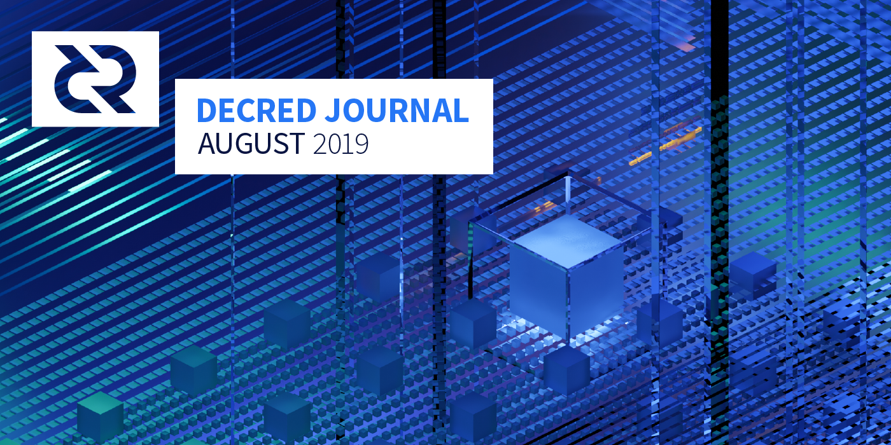

# Decred月报 - 2019年8月

_图片: 对称 by @saender. 当信息对称时，就会发生大事._

八月重点:

* Company 0 秘密开发的的隐私功能披露，初步隐私保护功能已经发布，首次混币在主网上被观察到，请参阅下面的隐私部分。
* 在由@chappjc和@buck54321领导的提案中，90％的选民批准了高达230,000美元的资金后，Decred去中心化交易工具的开发工作已经开始。
* 锁定在PoS选票中的流通DCR百分比在8月15日首次突破50％以上。随着选票价格的上涨，表明Decred持有者的信心随着时间的推移而增加，因为更多持有者选择锁定他们的DCR参与治理。
* Decred利益相关者表示他们希望为做市商提供资金以解决流动性问题（87％的批准）。来自i2 Trading，Grapefruit Trading和Tantra Labs的提案的投票于9月4日开始，他们都非常具有竞争力，因为这3个提案在发布时都有50-62％的支持。有关详细信息，请参阅治理部分。

## 隐私保护

@ jy-p [分析](https://blog.decred.org/2019/08/21/Surveying-the-Privacy-Landscape/)隐私保护领域的博客文章于8月21日发布。本文考虑了与加密货币隐私保护的不同方案相关的权衡，并回顾了Monero，Zcash，Grin，Beam，Dash，Bitcoin的Wasabi钱包所采用的方案的优缺点。

由Company 0秘密开发的隐私功能的首个细节由@jz 于8月27日在一集 Laura Shin的[Unchained Podcast](https://unchainedpodcast.com/after-years-of-secret-work-decred-adds-a-new-feature-privacy/)上公开发布。

8月28日，@ jy-p[发布](https://blog.decred.org/2019/08/28/Iterating-Privacy/)了一篇博客文章，全面介绍了Company 0对隐私保护的态度，并解释了选择这种方案的原因。仅考虑了允许修剪已用完交易的方法，优先选择不复杂的解决方案，以保持DCR底层供应的可审计性。这篇[推文](https://twitter.com/decredproject/status/1166746979160023046)提供了更简洁的介绍，@ Dustorf还撰写了一篇[文章](https://medium.com/@dlefebvr/decred-privacy-taking-the-long-road-62d218223db6)，该文章考虑了隐私的重要性，并提供了关于新方案如何运作的技术复杂性较低的观点。@ jy-p也录制了一个小时的[视频](https://twitter.com/decredproject/status/1168558002867191808)与@anshawblack关注隐私的深度讨论，他讨论了从逃避监视资本主义及怎样的隐私保护方案适合Decred的主题。@anshawblack和GhostWridah还合作了1分钟关于Decred和隐私的[rap](https://soundcloud.com/decredindepth/privacy-flow/s-5ifuN)。

该方法基于CoinShuffle++协议，集成到购买选票流程中，以便利益相关者可以选择在购买选票时混合他们的DCR。较小的面额也可用于常规混合（非POS）交易。该协议解决了底层可追溯性（匿名保护发送者和接收者）但不隐藏金额。该解决方案依赖于集中式服务器来协调混合 - 有关输入地址和更改地址的信息输入到到服务器，并且输出地址是完全匿名的。由于混合发生在链下，因此不需要改变共识规则。所有的开发都是由Company 0资助的，因此也不需要Politeia为此开发提供资金。

初始版本仅适用于命令行界面CLI dcrwallet的用户。将混合集成到decrediton还需要一段时间，并且为了向VSP用户提供混合，需要对dcrstakepool进行重大改进。从长远来看，将考虑保密交易。这些可以用来隐藏金额，这将提高隐私，避免交易中出现大量混合变量的需要。这种方式需要改变共识规则，未来或将通过链上治理途径。

## 开发进展总结

[dcrd](https://github.com/decred/dcrd): 新命名的模块blockchain/standalone[发布](https://github.com/decred/dcrd/pull/1808)，其目的是提供几个目前可用的独立功能 区块链 模块。通过单独的模块提供这些功能的主要目的是减少客户端代码的依赖性。对于需要确保基本安全属性保持并计算适当的选票的轻量级客户端等应用程序也是有益的。我们有机会编写更强大，更高效的函数，这些函数将取代 区块链 下一个主要版本中模块中的函数。新模块将附带全面的测试，完整的文档和基本用法示例。

新的主要版本[`blockchain`](https://github.com/decred/dcrd/pull/1823), [`mining`](https://github.com/decred/dcrd/pull/1831), [`connmgr`](https://github.com/decred/dcrd/pull/1833), [`peer`](https://github.com/decred/dcrd/pull/1834) 和 [`mempool`](https://github.com/decred/dcrd/pull/1835)模块已被引入到使用其它新的主要模块的版本。主要模块也进行了[更新](https://github.com/decred/dcrd/pull/1837)，以便全面使用它们。总体好处是它更新dcrd以利用所有最新的代码更新，并在需要API更改构成主要语义版本控制中断时，显着减少某些模块中所需的未来流失量。

`gcs`模块得到了多项 [改进](https://github.com/decred/dcrd/pulls?q=is%3Apr+is%3Aclosed+merged%3A2019-08-01..2019-08-31+gcs)，使其达到共识代码所要求的质量水平，详细细节在[header commitments](https://proposals.decred.org/proposals/0a1ff846ec271184ea4e3a921a3ccd8d478f69948b984445ee1852f272d54c58)中。[添加](https://github.com/decred/dcrd/pull/1854)了独立的误报率和Golomb译码窗口尺寸。除此之外，这允许更优化的参数以最小化要指定的滤波器尺寸。此功能将用于即将发布的版本2过滤器中，最终将包含在标头承诺中。模块的v2开发周期的开始也标志着在发布周期之间处理模块版本控制的[新方法](https://github.com/decred/dcrd/pull/1843)的开始，以减少维护负担。

Blake256实现已被[复制到](https://github.com/decred/dcrd/pull/1811)dcrd存储库中，因此dcrd不再具有外部依赖性。虽然dcrd所需的优化是在上游[接受](https://github.com/dchest/blake256/pull/3)的，但仍然需要在dcrd维护者的严格控制下使用共识关键代码以避免[此处](https://github.com/decred/dcrd/issues/1810)提到的情况。

自动地址发现已[合并](https://github.com/decred/dcrd/pull/1522)。它允许NAT后面的用户运行可公开发现的完整节点而无需指定`--externalip`。

测试覆盖率在代码库的多个区域中得到增强。

工作[开始](https://github.com/decred/dcrd/pull/1829)根据mempool中的事务链最大化块模板费用。

[dcrwallet](https://github.com/decred/dcrwallet): 添加了一个新的[RPC](https://github.com/decred/dcrwallet/pull/1522)，允许用户从钱包中放弃（或删除）未经证实的事务，以及依赖于其输出的任何其他事务。另一个新的RPC允许在解锁钱包后导出帐户的[扩展私钥](https://github.com/decred/dcrwallet/pull/1533)。

代码维护：更新dcrd中的新模块并[删除](https://github.com/decred/dcrwallet/pull/1531)旧模块的使用，[改进](https://github.com/decred/dcrwallet/pull/1539)了与Go 1.13错误的兼容性。

工作已经开始增加对购买“拆分”交易的门票交易的CoinJoin交易的[支持](https://github.com/decred/dcrwallet/pull/1541)，以及将各个组合变更输出混合成较小的标准数额。

[Decrediton](https://github.com/decred/decrediton): UI调整，BUG修复，代码清理。

初始[夜间模式](https://github.com/decred/decrediton/issues/2089)已完成。继续使用UI[响应](https://github.com/decred/decrediton/pull/2163)，[添加](https://github.com/decred/decrediton/pull/2174)了四个新的响应视图。

[Politeia](https://github.com/decred/politeia): 在Politeia重新设计工作正在进行，在步伐，以[数量](https://github.com/decred/politeiagui/pull/1356) [的](https://github.com/decred/politeiagui/pull/1338) [PRs](https://github.com/decred/politeiagui/pull/1360)合并是增加现有功能的重新设计的界面。在后端，为[DCC流程](https://proposals.decred.org/proposals/fa38a3593d9a3f6cb2478a24c25114f5097c572f6dadf24c78bb521ed10992a4)奠定基础的重要工作已[合并](https://github.com/decred/politeia/pull/980)到CMS中。

关于如何支持关于Politeia的RFP类型提案的[问题](https://github.com/decred/politeia/issues/966)一直是本期和#politeia 讨论的主题（更多细节见治)。

用户名登录后切换回电子邮件以防止有[针对性地锁定](https://github.com/decred/politeia/issues/860#issuecomment-520871500)帐户。[2FA](https://github.com/decred/politeia/issues/544)将解决此问题并无需电子邮件登录。

[dcrdex](https://github.com/decred/dcrdex): dcrdex存储库于7月宣布[收纳](https://twitter.com/decredproject/status/1156652694502817793)DEX[规范](https://github.com/decred/dcrdex/tree/master/spec)，第一批实质性PR已经[开放](https://github.com/decred/dcrdex/pull/17)。还为Matrix上的DEX开发聊天创建了一个新的[#dexdev](https://riot.im/app/#/room/!EzTSRQITaqHuFBDFhM:decred.org)聊天室。

[cspp](https://github.com/decred/cspp): 这个新的存储库提供客户端和服务器实现来执行[CoinShuffle++](https://crypsys.mmci.uni-saarland.de/projects/FastDC/paper.pdf)混合协议。虽然旨在用于创建Decred CoinJoin事务，但客户端和服务器包的通用性足以匿名混合和连接任何其它的元素。

在CoinShuffle ++之前，Company 0开发了TumbleBit协议的Go语言实现。尽管没有将它集成到Decred中，但代码是在[tumblebit](https://github.com/decred/tumblebit)存储库中为公共利益发布的。

[dcrstakepool](https://github.com/decred/dcrstakepool): 从4月份开始的将dcrstakepool与dcrwallet分离的大量[工作](https://github.com/decred/dcrstakepool/issues/227)终于[完成](https://github.com/decred/dcrstakepool/pull/470)了。此次更新降低了代码复杂性并减少了通过网络rpc调用的数量，从而提高了性能和安全性。

VSP运营商获得了对SMTPS的支持，通过加密连接（包括自[自签名证书](https://github.com/decred/dcrstakepool/pull/486)），改进的[状态页面](https://github.com/decred/dcrstakepool/pull/484)和更好的错误报告来发送注册和帐户恢复电子邮件。

添加了tmux[测试工具](https://github.com/decred/dcrstakepool/pull/476)以提高测试效率。

共有[30个PR](https://github.com/decred/dcrstakepool/pulls?q=is%3Apr+is%3Aclosed+merged%3A2019-08-01..2019-08-31)合并。

[dcrlnd](https://github.com/decred/dcrlnd):8月合并的工作涉及改进测试的稳定性和支持使用现有钱包的初始工作（目前仅支持嵌入dcrlnd的钱包）。

在dcrlnd合并之前，更多的上游工作被[移植](https://github.com/decred/dcrlnd/pull/36#issuecomment-526721084)并正在测试。共调整了400多个PR和1700多行代码。

> 为了保持同步，我们需要在1月10日合并点之后调整几乎所有的提交([@matheusd](https://twitter.com/matheusd_tech/status/1169194706636615680))

lightning-faucet获得了[支付发票](https://github.com/decred/lightning-faucet/pull/8)和新配置参数的 [表格](https://github.com/decred/lightning-faucet/pull/14)。

[dcrandroid](https://github.com/decred/dcrandroid): 正在努力实现[新的用户界面](https://github.com/decred/dcrandroid/pull/400)，这将使应用程序与Android的标准应用程序设计建议保持一致。后端的工作也在进行[多钱包](https://github.com/decred/dcrandroid/issues/188)支持，这将使[仅限观察](https://github.com/decred/dcrandroid/issues/393)的钱包用于选票监控。

[dcrios](https://github.com/raedahgroup/dcrios):改进的用户界面和仅限观察的钱包支持工作正在进行，类似于Android应用程序。

[dcrdata](https://github.com/decred/dcrdata):整合了来自dcrd的升级，UI调整，优化和BUG修复。

长期以来，todo列表中的一个重大变化是[删除 SQLite](https://github.com/decred/dcrdata/pull/1480)。这使得数据库体系结构更加简单，只需要postgresql，并构建cgo-free（纯go，没有c）。

重新设计正在加速，但后端开发主要处于维护模式，因为主要贡献者将重点转向dcrdex。dcrdata的改进和扩展仍有很大空间，特别是对于混合交易。

[docs](https://github.com/decred/dcrdocs): [添加](https://github.com/decred/dcrdocs/pull/968)了一个新的页面，详细说明了[原子交换](https://docs.decred.org/advanced/atomic-swap/)，更新了[硬件钱包](https://docs.decred.org/wallets/hardware-wallets/)的支持信息，并清理了部分内容。

工作已经开始在一个长期要求的单独的开发人员文档站点上。最初的工作是在个人存储库中进行，当该网站启动时，该存储库将在主要的Decred GitHub组织下活动。

[decred.org](https://github.com/decred/dcrweb): 路线图已经[更新](https://github.com/decred/dcrweb/pull/695)，[新闻报道页面](https://github.com/decred/dcrweb/pull/706)更新了最近的报道，并在主页和路线图中[添加](https://github.com/decred/dcrweb/pull/712)了隐私。

8月的开发活动统计数据：244个活动PR，274个主要提交，46K添加和24K删除的行分布在15个存储库中。贡献来自每个存储库2-9个开发人员。

## 人员

欢迎来到Decred的首次贡献者：aarcamp([dcrd](https://github.com/decred/dcrd/commits?author=aarcamp))，skipcheru([dcrandroid](https://github.com/decred/dcrandroid/commits?author=skipcheru))，RyanBRiley([politeia](https://github.com/decred/politeia/commits?author=RyanBRiley))，UferePease([dcrstakepool](https://github.com/decred/dcrstakepool/commits?author=UferePease))，fguisso([lightning-faucet](https://github.com/decred/lightning-faucet/commits?author=fguisso))。

社区数据统计:

* Politeia 用户: 174 (+20)
* Twitter 粉丝: 40,597 (+25)
* Reddit 订阅: 9,594 (+38)
* Matrix 用户: 412 (+28)
* Slack 用户: 6,834 (+25)
* Discord 用户: 2,442 (+65), verified to post: 310 (+29)
* Telegram 用户: 3,148 (-142)
* YouTube 订阅: 3,819 (+19)
* Facebook 粉丝: 3,271 (+18), likes: 2,999 (+16)
* LinkedIn 粉丝: 603 (+12)
* GitHub dcrd 星星: 516 (+18), 分叉: 1,383 (+18)

在胡志明市举办的[活动](https://github.com/decredcommunity/events/blob/master/reports/20190725-cointime-summit-ho-chi-minh-city-vietnam.md) 之后，已经创建了越南[Telegram](https://t.me/decredvietnam), [Twitter](https://twitter.com/DecredVietnam) and [Facebook](https://www.facebook.com/Decred-DCR-Vietnam-108991833777572/)帐户。所有Decred社交媒体组的列表都在[这里](https://github.com/decredcommunity/wiki/blob/master/wiki/social-media.md)。

## 治理

8月，[社区开发基金](https://explorer.dcrdata.org/address/Dcur2mcGjmENx4DhNqDctW5wJCVyT3Qeqkx)收到了15,278个DCR，并花费了8,223个DCR。使用8月份的每日平均DCR / USD为26.23美元，约收到的401,000美元。由于这些付款用于7月完成的工作，因此在7月平均每日费率28.97美元的情况下考虑它们也是有用的 - 在这种情况下，美元花费是238,000美元。截至8月9日，财政部余额为638,000 DCR（1580万美元，汇率24.80美元）。

来自@chappjc和@ buck54321（在dcrdata上工作）的DEX开发[提案](https://proposals.decred.org/proposals/417607aaedff2942ff3701cdb4eff76637eca4ed7f7ba816e5c0bd2e971602e1)在Company 0的支持下提交 - 并获得90％赞成票批准。该提议的成本估计为230,000美元，用于提供命令行界面应用程序，可以通过未来的提议进行扩展，以使用Electron框架提供用户界面。

decred社区提案[库](https://github.com/decredcommunity/proposals)具有DEX相关材料的 [索引](https://github.com/decredcommunity/proposals/blob/master/dex/index.md)。

3个做市商的提案于8月7日发布，来自[Altonomy](https://proposals.decred.org/proposals/772d083fef79fa2e443d8424b353deadc3af69c8d8764e473cb200f98f356c60), [i2 Trading](https://proposals.decred.org/proposals/2eb7ddb29f151691ba14ac8c54d53f6692c1f5e8fe06244edf7d3c33fb440bd9) 和 [Grapefruit Trading](https://proposals.decred.org/proposals/4becbe00bd5ae93312426a8cf5eeef78050f5b8b8430b45f3ea54ca89213f82b)。经过几天的讨论，主要议题是社区开发基金是否应该习惯于雇佣做市商。@jz提交了一份[RFP 提案](https://proposals.decred.org/proposals/30822c16533890abc6e243eb6d12264b207c3923c14af42cd9b883e71c7003cd)，以确定利益相关者原则上是否希望雇用指定的做市商。该提案解释了@jz，@ maxbronstein和Chris Burniske在提交提案之前已经采取的流程 - 并提出了批准其中一项提案的案例。RFP提案还澄清了投票条款（最多可以批准1个做市商提案，并且必须符合通常的标准）。

Altonomy提交了一项建议，即10个交易对供5万美元，他们积极参与Politeia并提供许多问题的答案，但在8月16日他们撤回了他们的建议，编辑它说“对不起，由于我们的技术能力，我们决定撤回这个提议。

i2 Trading提交了一项建议，即对6个交易对提供5万美元，他们积极参与Politeia和#proposals聊天室，回答大多数问题。为了回应对透明度的担忧，i2允许在一段有限的时间内允许Decred代表以只读方式访问其交易账户。i2对他们的提案进行了一些编辑，添加了关于提供API访问的说明，澄清借款需求和条款，然后修改他们的提议以放宽差价，将最高交易费用报销减少到10K /月，并且下降提供服务的费用从每月4万美元到每月35,000美元。

Grapefruit在他们的提案中开始提供2个优惠（两个价格均为3对3万美元），其中一个价格较低，每月费用为4万美元，另一个价格较宽松，每月费用为28,000美元。@grapefruittrading于8月8日和20日回答了关于Politeia的问题，在向其他人提供[实质性](https://proposals.decred.org/proposals/4becbe00bd5ae93312426a8cf5eeef78050f5b8b8430b45f3ea54ca89213f82b/comments/6) [回复](https://proposals.decred.org/proposals/4becbe00bd5ae93312426a8cf5eeef78050f5b8b8430b45f3ea54ca89213f82b/comments/5)时忽略了一些问题。在授权投票开始之前，@ grapefruittrading编辑了他们的建议删除了更昂贵的报价，选择运行较便宜的报价，因为他们认为来自利益相关者的需求，无论如何这是他们的首选。

i2 和 Grapefruit 授权8月27日开启提案投票。

Tantra Labs于8月28日提交了一份[提案](https://proposals.decred.org/proposals/82ce113827140caaaf8b5779ab30402d3ed39f1911fdd2e8fa64cf0dc9e09ecb)，提出了一个非常不同的提议，每个交易对3万美元，6个交易对([或 7](https://proposals.decred.org/proposals/82ce113827140caaaf8b5779ab30402d3ed39f1911fdd2e8fa64cf0dc9e09ecb/comments/8))对最高3％的差价，并且向提供给社区开发基金的服务不收取任何费用。相反，社区开发基金只收取借入库存的成本和交易费10,000美元/月的费用。Tantra Labs只允许他们的交换账户访问“当选”的Decred代表，以便可以验证所承诺的流动性可用性。Tantra还为一组开源订单簿透明工具提供了一个Web界面。

关于Tantra的提案的大部分讨论都关注它是否太好而不是真实的，有许多人表达了他们对Tantra可以兑现他们的建议的疑虑，并想知道低成本是否伴随着隐藏的缺点。Tantra一直活跃在#proposals，并回答了有关Politeia的一些问题。社区的一些成员越来越不耐烦等待Tantra授权开始投票，这表明RFP提案被迟交的提议放慢了问题，并强调了明确的时间表的价值。

由@betterfuture提交的关于做市商的第四个[提案](https://proposals.decred.org/proposals/c9604f7879e4b2cd4f2582d238a7ccea210005c63481bec1ddae44ff93e1340f)于8月31日发布。这提出了一个激励做市商在没有坚定承诺的情况下为特定货币对提供流动性的计划。该提案描述了使参与者保持一致的规则和处罚，并且需要代表Decred项目的可信中介来审核做市商的活动。@jz在提案中被提名担任此角色，但他[表示](https://proposals.decred.org/proposals/c9604f7879e4b2cd4f2582d238a7ccea210005c63481bec1ddae44ff93e1340f/comments/5)他不希望接受。对该提案的审议和改进被其支持者视为长期努力，并且不会与其他提案竞争。

9月4日，3个做市商提案开始投票。

有关做市商提案和其他Politeia活动的更详细考虑，请查看Politeia Digest 第[20](https://github.com/RichardRed0x/politeia-digest/blob/master/issue-020.md)期（8月1日至12日）和第 [21](https://github.com/RichardRed0x/politeia-digest/blob/master/issue-021.md)期（8月13 日至31 日）。还有一些社区生产的资源，旨在帮助那些不熟悉市场营销理念的人理解它，并在不同的提案之间进行比较：

* [这里](https://github.com/decredcommunity/proposals/blob/master/market-makers/index.md)保留了所有着名文件的索引以及与做市商相关的讨论。
* [comparison table](https://github.com/decredcommunity/proposals/blob/master/market-makers/comparison.md) 旨在比较其提议和成本方面的建议 - 本表中估计的最高月费为Tantra为17,000美元，i2为$ 53K，Grapefruit为$ 31K（对于Tantra和i2最高交易费为$ 10,000 /假设是月份。
* @bee撰写了关于具体问题和论点的讨论的[全面概述](https://github.com/decredcommunity/proposals/blob/master/market-makers/arguments.md)，并详细解释了该[主题](https://github.com/xaur/writings/blob/master/20190822-dissection-market-makers-for-decred.md)，介绍了相关术语并概述了关键考虑因素。
* @exitus制作了一个相关的[Politeia视频概述](https://www.youtube.com/watch?v=BKSMA-eanoY)。

在#research频道中进行讨论之后，@ richardred开始收集该[存储库](https://github.com/RichardRed0x/exchange-data)中选择的交易对和交换的订单簿数据。目标是更好地了解目前DCR和其他选定加密模块的订单如何看，并在做市商提案投票之前准备了初步报告。如果雇佣了这些数据，这些数据也可用于跟踪订单簿，以观察做市商的影响。订单簿数据可能会在某个阶段添加到dcrdata的外部数据产品中，但这些数据的性质是只能实时记录。历史订单簿数据的唯一来源是专有且[昂贵](https://www.kaiko.com/products/binance-10-order-books)的。

值得一提的是Decred社区提案 [存储库](https://github.com/decredcommunity/proposals)，其中可以找到许多上述资源。创建此存储库是为了收集讨论和分析提案时产生的信息。

处理做市商提案和RFP流程已经产生了很多讨论和见解，并且正在准备Politeia的RFP功能的初始集成。将有一个新的RFP类型提案，候选提案可以链接，投票和确定选项/结果将通过这些RFP提案进行控制。在开启RFP提案之前，将提交并批准一份普通提案，询问“我们是否应该提供此RFP” - 迄今为止Politeia所见的2个“RFP提案”属于此类提案。

关于新的RFP提案类型的讨论主要是围绕这些是否应该作为多项选择提案（选民可以投票选出1-N选项和获得最多选票的选项）或者作为票数可以平行提案对每个提案投赞成票/否，并且获胜者是具有最高投票权的投票总得分（因为MM RFP正在进行）。竞争提案的平行投票似乎是优先考虑的事项，多选投票可能会在以后出现，并用于不同的目的（更像是民意调查）。

提交了一份Reddit [讨论](https://www.reddit.com/r/decred/comments/cutc16/decred_events_meetups_in_the_cis_in_20192020/)以供反馈，该提议旨在作为独立国家联合体（CIS） - 特别是俄罗斯，乌克兰和格鲁吉亚的Decred活动和聚会的筹资预案。

## 网络

全网算力：八月份的哈希值约为563 Ph/s起步，收于约567 P/s，最低时达到374 Ph/s，最高达到671 Ph/s。截至9月5日的池哈希值分布：F2Pool 23％，UUPool 16％，Poolin 16％，lab.antpool.com 4.1％，BTC.com 2.3％，Luxor 1.8％，BeePool 0.10％，Coinmine 0.10％，suprnova 0.01％和其他36％每个[dcrstats.com](https://dcrstats.com/pow)。池分布数是近似值，无法准确确定。

Staking: 每个dcrstats.com的30天平均票价为130.05 DCR（+4.25）。价格在119.9-134.5 DCR之间变化。锁定金额为5.03-5.25百万DCR，相当于现有供应量的49.40-50.93％。

节点: 整个[8月份](https://charts.dcr.farm/d/000000014/nodes?orgId=1&from=1564617600000&to=1567296000000)，每个dcr.farm大约有167个监听节点和445-530个总节点。大约78％运行dcrd v1.4.0,5.7％运行dcrwallet v1.4.0,6.2％运行v1.5.0（预）dev版本。

截至9月5日，DCR[闪电网络测试网](https://charts.dcr.farm/d/DHPdAO4Wz/lightning-network?orgId=1)显示拥有19个节点，32个通道，总容量为253 DCR。

已经检测到使用新隐私协议的第一笔[交易](https://twitter.com/decredproject/status/1167269901293297664)。

## 整合

Exodus [增加了](https://twitter.com/exodus_io/status/1168886493617840131)向他们的移动钱包发送，接收和交换DCR的能力。

Ellipal冷钱包宣布他们即将[推出](https://twitter.com/ellipalwallet/status/1163771448042803201)的硬件钱包Titan将支持Decred。

注意：Decred Journal的作者不知道上述任何服务的可信度。在将您的个人信息或资产信任托管给任何第三方实体之前，请先自行研究。

## 外联活动

由于我们专注于Decred隐私的发布，因此大部分正在进行的Outreach工作被推到一边。8月21日开始努力，@ jy-p发布了“[Surveying the Privacy Landscape](https://blog.decred.org/2019/08/21/Surveying-the-Privacy-Landscape/)”。这项工作得到了一个[tweetstorm](https://twitter.com/decredproject/status/1164245224274767873)的支持，这个[tweet话题](https://twitter.com/decredproject/status/1164245224274767873)吸引了fluffypony（门罗首席开发者），Zooko（Zcash创始人)，MimbleWimble协议开发人员（Girn，Beam）等参与。当@jz继续使用Laura Shin的[Unchained Podcast](https://unchainedpodcast.com/after-years-of-secret-work-decred-adds-a-new-feature-privacy/)谈论Decred及其新功能时，隐私的第一个细节就披露了。

二十四小时后，Decred隐私的第一份书面消息释放，在@ JY-P的文章，出版了迭代隐私，其中深入探讨动机，操作细节，限制和Decred的下一步[隐私](https://blog.decred.org/2019/08/28/Iterating-Privacy/)。这得到了大量[支持](https://twitter.com/decredproject/status/1166746979160023046)，并引起了很多关注和参与。除了CoinDesk之外，Decred的隐私实施已经获得了大量报道，在Media中有详细介绍。

为了继续支持隐私保护功能的发布，@ anshawblack在GhostWridah上发布了[Privacy Flow](https://twitter.com/decredproject/status/1169011789255925762)，并在发布后的几天内发布了一个非常特别的Decred in Depth [音频](https://twitter.com/decredproject/status/1168558002867191808) @ jy-p。在这个音频中，@ jy-p深入研究了监管经济，为什么要保护隐私，以及当前和未来的Decred隐私状态。

在发布时，Ditto团队继续致力于将Decred隐私放在首位。此外，@ Dustorf发布了针对非技术相关人群的[博客概述](https://medium.com/@dlefebvr/decred-privacy-taking-the-long-road-62d218223db6)。

Outreach通过关于Decred的高质量内容和教育，共同努力提高Twitter的参与度。从7月到超过560万，项目印象数增加了一倍以上。获得最多吸引力的消息之一是关于DEX规范公告的4部分[tweet风暴话题](https://twitter.com/decredproject/status/1156652694502817793)。

Decred已于11月4日至7日在葡萄牙里斯本的[网络峰会](https://websummit.com/)上确认其展位，如果您有兴趣帮助我们，请在Matrix的#event_planning会议室与我们联系。我们还计划在亚洲举办路演，但在发布时没有任何细节可供分享。

[基础消息](https://github.com/decredcommunity/pr/blob/release/foundational-messaging.md)已更新为v2。[更改](https://github.com/decredcommunity/pr/commit/fc407b8f037a222db22a4507e4a5ade5b746f4dd)包括使用Decred原则和常见问题解答扩展的Pitch，Tagline和Vision。Tagline稍作调整，以“可持续”取代“自筹资金”。

Ditto八月的成就:

* 到目前为止，在隐私发布方面获得了8项成就 - 这包含在所有顶级加密媒体中：Unchained Podcast，[The Block](https://www.theblockcrypto.com/tiny/crypto-project-decred-adds-privacy-features-to-its-coin/)（也在其时事通讯中提到），[Crypto 简报](https://cryptobriefing.com/decred-struts-privacy-credentials-with-surprisingly-awesome-rap-snippet/)时事通讯专题和关于Privacy Rap的文章（对@anshawblack的赞誉）），[Cointelegraph](https://cointelegraph.com/news/crypto-project-decred-adds-privacy-features-to-its-coin), [Decrypt Media](https://decrypt.co/8796/decred-aims-to-be-a-more-effective-privacy-coin-than-monero-or-zcash), [Modern Consensus](https://modernconsensus.com/cryptocurrencies/alt-coins/decred-cryptocurrency-launches-launches-privacy-mixing-feature/)，俄语新闻网站[Forklog](https://forklog.com/menshe-koda-menshe-vzloma-razrabotchiki-kriptovalyuty-decred-dobavili-optsiyu-privatnosti-tranzaktsij/)，西班牙语新闻网站[Criptonoticias](https://www.criptonoticias.com/redes-protocolos/decred-anade-privacidad-criptomoneda-dcr/)。
* 今年的成就：对Laura Shin's Unchained的独家突破性报道（对于@jz的不可思议的交付感到荣幸） - 我们已经努力确保6个月以上，并且它终于发生了！
* 与感兴趣的社区成员协调，为Decred的教育资源库聚合互联网上的最佳资源。如果你有宝藏，请分享隐藏的宝藏。
* 继续与各社区成员合作，在Twitter上采用富有成效/教育的方式。这包括与7名社区成员通话，讨论社交媒体手册策略，反馈和提问。
* 围绕Decred隐私创造了热门话题，24小时内发布了大约85条推文，上周发布了近400条，包括来自Chris Burniske，Justin Yashoufar（Blockhead Capital），Blockfolio，Max Bronstein（DharmaHQ）和Weiss Reports的对话和推文。
* 围绕隐私新闻进行协调的推特和社区外展活动。
* 预计将在未来几周内再发布另外2个播客采访。
* 获得Decrypt Media项目负责人@ jy-p的深入剖析。
* 发布@ akinsawyerr对[Base Layer Podcast](https://acrabaselayer.podbean.com/e/base-layer-episode-059-akin-sawyerr-decred/)的采访。
* 关于做市商提案的安全加密简报[文章](https://cryptobriefing.com/decentralized-governance-in-action-decred-debates-market-liquidity/)。
* 刷新[消息](https://github.com/decredcommunity/pr/blob/release/foundational-messaging.md)传递。
* 为@matheusd撰写并提交了一份提案，在柏林闪电会议上发言。
* 在多伦多未来主义者大会上获得了@zubair的电视采访。

## 社区活动

出席：

* 7月2 - 3日 - 2019年亚洲区块链峰会 - 台湾台北。穿着Decred Jacket的@morphymore在那里出席，并向那些想要了解该项目的人介绍Decred。
* 月8日 - [Blockchain Bajio](https://www.eventbrite.com/e/blockchain-bajio-2do-meetup-tickets-66510186759) - 墨西哥莱昂。@elian，@ francov_，@victorarubin和@luisantoniocrag 向约60位与会者展示了Decred 的高级[概述](https://matrix.to/#/!aNPTuiryMFmdMQWUzb:decred.org/$156537300012257UWNLZ:decred.org)。（照片：[1](https://twitter.com/Decred_ES/status/1159621068027551744) [2](https://twitter.com/victorarubin/status/1159898002858893313)）
* 8月12日 - [Crypto Mondays](https://www.meetup.com/Bitcoin-Argentina/events/263594472) - 阿根廷布宜诺斯艾利斯。第一次在Espacio比特币，@ pablito和@camilolwi有15分钟的时间向当地比特币社区和其他项目的成员解释 Decred最相关的方面。([照片](https://matrix.to/#/!aNPTuiryMFmdMQWUzb:decred.org/$156570965016592IkfFu:decred.org))
* 8月13日 - 未来主义者会议 - 加拿大多伦多。@ michae2xl，@ zubair和@ammarooni在展位上进行了一些采访，并在“Blockchain Social Impact＆Governance for Good”小组讨论。Decred是一名银牌赞助商。（照片：[1](https://twitter.com/Decred_CA/status/1161466609267105792) [2](https://twitter.com/Ammarooni/status/1161707860822302722) [3](https://twitter.com/Decred_CA/status/1161982417781047297) [4](https://matrix.to/#/!aNPTuiryMFmdMQWUzb:decred.org/$156581155118027SCAXO:decred.org)）
* 8月16日 -  [Campus Party](https://brasil.campus-party.org/campus-party-natal/) - 巴西纳塔尔。@guisso和@claranobre代表Decred。（[照片](https://twitter.com/Decred_BR/status/1163473134676258816)）
* 8月20日 - Bitcoin Embassy - 墨西哥墨西哥城。@elian被邀请到比特币大使馆接受El Financiero（Bloomberg在墨西哥的分支机构）的[采访](https://matrix.to/#/!OfChXgczrIlpEZSFAv:decred.org/$15664995075484PTrhJ:decred.org)，谈论墨西哥的加密货币。（照片：[1](https://twitter.com/LOR_ena_OR/status/1164205626723098630) [2](https://twitter.com/bitcoinemb/status/1164269677381652480)）
* 8月21日 - [Decred Meetup](https://www.meetup.com/Chicago-Decred-Meetup/events/263814807/) - 美国芝加哥。
* 8月22日 - [Binance Meetup](https://www.facebook.com/events/406522099975717/) - 墨西哥蒙特雷。@elian和@francov_代表Decred。（照片：[1](https://twitter.com/binance/status/1166526786525487105) [2](https://matrix.to/#/!aNPTuiryMFmdMQWUzb:decred.org/$15665195371107618foQnv:matrix.org) [3](https://matrix.to/#/!aNPTuiryMFmdMQWUzb:decred.org/$15666946921832943HyclD:matrix.org)）
* 8月24日 - [Decred Live AMA](https://twitter.com/coin98_net/status/1164845587910414337) - 互联网。@Haon和ViệtAnhĐàm在他们的Facebook页面上回答了Coin98组织的越南社区提出的问题。总共有309条评论（包括答案），对于最佳问题，DCR的奖励为50美元。（[获奖名单](https://github.com/noahpierau/articles/blob/master/Decred-Vietnam-AMA.md)）
* 8月25日 - [币印中国行](https://twitter.com/wanbihou/status/1166028812305321985) - 中国上海。@dominic受邀出席主题演讲和圆桌讨论。
* 8月28日 - [Blockchain Bootcamp](https://www.meetup.com/blockchaincentre/events/263601014/) - 澳大利亚Docklands。安永会计师事务所[邀请](https://matrix.to/#/!aNPTuiryMFmdMQWUzb:decred.org/$156739040517633gdQNG:decred.org) @zohand和@eSizeDave为来自学术界，商界，法律界和政府部门的代表举办关于区块链治理的Decred特定演讲。演示文稿和Decred都很受欢迎，导致了许多后续活动。（[照片](https://twitter.com/DecredAustralia/status/1166592295296208896)）
* 8月29日 - [Binance Meetup](https://twitter.com/Decred_ES/status/1166132690342567938) - 墨西哥城，墨西哥。@elian [指出](https://matrix.to/#/!aNPTuiryMFmdMQWUzb:decred.org/$156713369714381PAoax:decred.org)：“我们有大约60名与会者，主要是爱好者和企业家，对Decred的隐私实施和治理即服务的想法很感兴趣。非常感谢@francov_ @luantantoniocrag和@victorarubin的帮助去”。（照片：[1](https://twitter.com/TRADcoinMX/status/1168541349395738624) [2](https://twitter.com/interprocsys/status/1167243076726861824) [3](https://twitter.com/victorarubin/status/1167495971539836928)）

即将到来的:

* 9月10日 - [BlockDAM Co-working Tuesdays](https://twitter.com/NoahPierau/status/1170198038301855745) - 荷兰阿姆斯特丹。@Haon将发表关于加密货币隐私技术和Decred的新隐私功能的演讲。
* Sep 16 - [Decred Special Interest Group](https://www.meetup.com/Philadelphia-Technology-for-Blockchain-and-Cryptocurrency/events/hmqlhryzmbvb/) - Philadelphia, USA. Organized by [@mikeghen](https://twitter.com/mikeghen).
* Sep 20 - [A Framework for Blockchain Governance](https://www.eventbrite.com/e/a-framework-for-blockchain-governance-tickets-70134180221) - Washington DC, USA. Along with Thomas Cox, the Chief Governance Officer of [StrongBlock](https://strongblock.io/), @akinsawyerr be speaking on and taking questions on a Blockchain Governance Framework developed the Wharton Crypto Governance roundtable group of which he is a member.
* Sep 21 - [French Vibes Connection](https://twitter.com/Decred_ES/status/1160669435989856256) - Mexico City, Mexico. Decred will co-host a music concert featuring Telepopmusik, Cherokee and Else. Brand awareness experiment by @elian.
* Sep 21 - [Decred Meetup](https://twitter.com/DecredArabia/status/1171117988461854721) - Casablanca, Morocco. @arij will be talking about her experience as a Decred contractor, Decred's governance and privacy and future plans.
* Sep 25 - [La Conexion Conference](https://la-conexion.com/home/) - Buenos Aires, Argentina. The project will be presented in main stage.
* Sep 26 - [Inaugural Decred Meetup](https://twitter.com/MattDavidKaye/status/1164974520081342464) - Los Angeles, USA. Blockhead Capital and @jy-p will talk about fundamentals behind Decred.
* Sep 27 - [Crypto Fest](https://argentinacryptofest.com/) in Cordoba, Argentina. The project will be presented in main stage.
* Sep 30 - Oct 1 - [Voice of Blockchain](https://twitter.com/BlockchainVoice/status/1154772731575099392) - Chicago, USA. @jy-p will present a keynote "Why Direct Sovereignty & Multi-Stakeholder Inclusive Governance Will Last".
* Oct 29-31 - [World Crypto Conference](https://worldcryptocon.com/) - Las Vegas, USA. @akinsawyerr will be speaking on a panel on "Governance Practices" and will have an opportunity to highlight the Decred governance model and process.
* Nov 4-7 - [Web Summit](https://websummit.com/) - Lisbon, Portugal. Decred will have a booth.

Alex Von Schulze is [looking](https://twitter.com/avonschulze/status/1166026265805172737 ) for people to organize the first Decred [meetup](https://www.meetup.com/Decred-KC/) in Kansas City, USA.

## 媒体

Selected articles:

* Decred | The Power to Think for Oneself by @BlackBearXVII ([medium](https://medium.com/@imagnusholdings/decred-the-power-to-think-for-oneself-46b9aab9ff0e))
* Decred Q&A with @elian for Crypto Hispano ([steemit](https://steemit.com/btc/@cryptohispano01/decred-q-and-a))
* Decred's Ambitious Vision for a Truly Decentralized Exchange by Nate Urbas ([cryptolinks.com](https://cryptolinks.com/news/decreds-ambitious-vision-for-a-truly-decentralized-exchange))
* Decentralized Governance in Action: Decred Debates Market Liquidity by Darren Kleine ([cryptobriefing.com](https://cryptobriefing.com/decentralized-governance-in-action-decred-debates-market-liquidity/))
* Surveying the Privacy Landscape by @jy-p ([blog.decred.org](https://blog.decred.org/2019/08/21/Surveying-the-Privacy-Landscape/))
* Iterating Privacy by @jy-p ([blog.decred.org](https://blog.decred.org/2019/08/28/Iterating-Privacy/))
* Decred Project Lead Jake Yocom-Piatt: Practice What You Preach by Matt Hussey ([decrypt.co](https://decrypt.co/8801/decred-project-lead-jake-yocom-piatt-interview-profile))

Translations:

* Surveying the Privacy Landscape - [in Portuguese](https://stakey.club/translated/privacy-landscape/) by @mm.
* Decred Journal July 2019 was translated to Arabic (@arij) and April-July to Spanish (@francov\_ and @luisantoniocrag). The index of all translations is maintained [here](https://xaur.github.io/decred-news/) and is updated several times a month. Thank you all for spreading DJ all over the world!

Videos:

* Decred's Market Maker Proposals - Crypto Governance In Action! by @Exitus ([youtube](https://www.youtube.com/watch?v=BKSMA-eanoY))
* The Feeless Decred DEX Has Been Approved! by @Exitus ([youtube](https://www.youtube.com/watch?v=An5YCY_q894))
* Futurist 19 interview with @ammarooni ([youtube](https://www.youtube.com/watch?v=YmQce50dfGY))

Audio:

* Decred in Depth Ep. 6 with @jholdstock - Jamie talks about his Decred journey, from an airdrop recipient to a part-time docs contributor to his recent transition to working full-time on Decred as a developer and the reasons why that was an attractive option. ([youtube](https://www.youtube.com/watch?v=A-zcLGSYxbA))
* Decred in Depth Ep. 7 with @jy-p - Jake talks about privacy in the general sense of surveillance capitalism and how to avoid it, why and how Company 0 arrived at CoinShuffle++ as the optimal way to add privacy to Decred, and the importance of privacy to the project. ([player.fm](https://player.fm/series/decred-in-depth/jake-yocom-piatt-dcr-privacy))
* Note that Decred in Depth episodes are mirrored on [SoundCloud](https://soundcloud.com/decredindepth) and [Libsyn](https://decredindepth.libsyn.com/).
* Unchained Podcast Ep. 134 with Laura Shin - @jz gives a comprehensive intoduction to Decred and his involvement with the project, then releases initial information about Decred's new opt-in privacy feature. ([unchainedpodcast.com](https://unchainedpodcast.com/after-years-of-secret-work-decred-adds-a-new-feature-privacy/))
* Inclusionism: Guest Akin Sawyerr on What Money Is ([jamesfeltonkeith.com](https://www.jamesfeltonkeith.com/radioshow/episode/c3b1bb50/inclusionism-guest-akin-sawyerr-on-what-money-is), [soundcloud](https://soundcloud.com/inclusionism/inclusionism-guest-akin-sawyerr-on-what-money-is))
* Base Layer Ep. 59 - Akin Sawyerr (Decred) ([podbean.com](https://acrabaselayer.podbean.com/e/base-layer-episode-059-akin-sawyerr-decred/), [spotify](https://open.spotify.com/episode/6tT4PTA572I1PAbHsZEX6N))
* Decred Struts Privacy Credentials with Surprisingly Awesome Rap Snippet ([cryptobriefing.com](https://cryptobriefing.com/decred-struts-privacy-credentials-with-surprisingly-awesome-rap-snippet/))

> Couple hundred code lines, no errors in my design, off-chain, unbreakable, I'm ahead of time

Since April the Decred Journal has been pushing for greater decentralization of its production. This has involved writing down descriptions of how components of the Journal get made and the reasoning for making them in these ways. The idea is that by formalizing these aspects the Journal becomes less reliant on the individuals who currently contribute and their tacit knowledge. The following documents are available, worth a look to anyone who would like to become a Journal contributor:

* a self-describing [template](https://github.com/xaur/decred-news/blob/docs/journal-template.md) for new issues
* a revamped [contributing](https://github.com/xaur/decred-news/blob/docs/contributing.md) page
* a [content plan](https://github.com/xaur/decred-news/blob/docs/content.md) with ideas for expansion
* an extensive [guidelines](https://github.com/xaur/decred-news/blob/docs/guidelines.md) doc that captures the vision and ways of DJ, and also includes tips for translators.

## 社区讨论

Comm systems news:

* Reddit [thread](https://www.reddit.com/r/decred/comments/coppup/i_did_a_review_of_the_powpos_mechanism_used_in/) was removed by mods where the author tried to get exposure for his project by posting a low effort review of how Decred's hybrid PoW+PoS does not work. Our moderation is [transparent](https://snew.notabug.io/r/decred) thanks to [publicmodlogs](https://www.reddit.com/user/publicmodlogs).
* Reddit [thread](https://www.reddit.com/r/decred/comments/csc0ne/what_is_c0s_role_going_forward_with_the_dcr/) asking about Company 0's role going forward received many substantial replies but then vanished after the author's Reddit account was deleted (coincidentally, on the same day). To bring it back to r/decred feed it was ["undeleted"](https://www.reddit.com/r/decred/comments/csq58r/what_is_c0s_role_going_forward_with_the_dcr/) by resubmitting the link.
* Yet another case where a [question](https://www.reddit.com/r/decred/comments/cvrddy/raising_the_limit_of_coins/) received a proper answer and was quickly deleted. It was "undeleted", but the deletion of the original post caused the answer to lose visibility. This pattern is one of the factors that discourage knowledgeable people from putting in the effort to answer questions on Reddit. In this case the question poster actually [apologized](https://www.reddit.com/r/decred/comments/cvwmsz/raising_the_limit_of_coins_undelete/ey7p6qr) for deleting their post in the "undeleted" thread.
* More impostors were detected in Telegram that promise to help with your technical problem for a modest 0.05 BTC. Beware the scammers.

An AMA with the Vietnamese community was conducted on Facebook by @Haon and Việt Anh Đàm. There were a total of 309 comments (including answers), and a transcript is available [here](https://github.com/noahpierau/articles/blob/master/Decred-Vietnam-AMA.md).

Selected Reddit posts:

* [Questions](https://www.reddit.com/r/decred/comments/cr8u4w/post_politeia_approval_fiat_pairs_integration_on/) to EXMO went unanswered.
* [Why I'm into the Decred project](https://www.reddit.com/r/decred/comments/crci7p/why_im_into_the_decred_project/) by Somebody\_\_Online
* [Collaborative effort](https://www.reddit.com/r/decred/comments/ct7aw9/collaborative_effort_for_mw_tech/) for MimbleWimble tech?
* [Thread](https://www.reddit.com/r/decred/comments/ctp1zf/bitcoin_lighting_network/) with a long reply from @matheusd addressing concerns about contractors dumping DCR and fostering the adoption of LN.
* Privacy: the feature [revealed](https://www.reddit.com/r/decred/comments/cw1wd8/privacy_feature_revealed/), privacy is [already in use](https://www.reddit.com/r/decred/comments/cxrb42/decred_privacy_was_announced_and_its_already_in/) on mainnet, [difference](https://www.reddit.com/r/decred/comments/cwz0ib/in_what_way_is_decreds_mixer_different_to/) from Bitcoin's CoinJoin and background on Decred's privacy idea, [comments](https://www.reddit.com/r/decred/comments/cxdxso/what_does_it_mean_by_12x_increase_of_onchain/) on the 12x transaction storage increase.

Selected Twitter discussions:

* [Quote](https://twitter.com/Ammarooni/status/1161707860822302722) from [@zubair](https://twitter.com/generalsaccount)'s talk - "We need to solve for transparency in blockchain governance now, so that we have a mechanism to make decisions two decades from now".
* Decred privacy [tweetstorm](https://twitter.com/decredproject/status/1166746979160023046).
* @Checkmate on [privacy](https://twitter.com/_Checkmatey_/status/1167502975276933121).
* @richardred on Decred's [open source mentality](https://twitter.com/RichardRed0x/status/1160972879133073409) of "dig in and find something useful to do".
* @DCRtheSoV on [the growth of Politeia](https://twitter.com/DCRtheSOV/status/1165708600410402816) and the role it's playing within the project.
* @DCRtheSoV on [how to stake DCR](https://twitter.com/DCRtheSOV/status/1163514060542894080).
* @Checkmate on the [Treasury](https://twitter.com/_Checkmatey_/status/1157342578787913733).
* Chris Burniske of Placeholder VC [clarified](https://twitter.com/cburniske/status/1163912381598248965 ) that Placeholder are not liquidating their DCR position, after an impersonator was seen on Telegram supposedly looking for buyers for their DCR.

New Twitter account [@DCRtheSOV](https://twitter.com/DCRtheSOV) aims to [become](https://matrix.to/#/!MgQoetFiyjrHAywokv:decred.org/$15650685647545vLtzj:decred.org) a reputable source of news and analysis covering Decred and is looking for feedback.

## 市场表现

8月份DCR的交易价格为22.63-32.17美元/BTC 0.00227-0.00275。每日平均价格为26.23美元。

从bw.com [观察](https://www.reddit.com/r/decred/comments/ctm0rq/whats_with_the_new_trade_volume/)到不切实际的数量激增。

比特币在8月份的大部分时间里再次突破10,000美元大关，短暂触及12,200美元。许多人猜测即将推出[Bakkt](https://cointelegraph.com/news/bitcoin-price-will-bakkts-launch-this-month-take-btc-to-new-highs)将使比特币突破这一周期。

在讨论做市商提案的背景下，[CoinMarketBook](https://coinmarketbook.cc/)认为：“市值是谎言。买入支撑说明真实的故事”。截至8月19日，DCR在该评级中排名第95，只有26万美元的购买支持，距离最高出价10％。具体情况：BTC有3.6亿美元，ETH有5500万美元，LTC 2300万美元，XMR 950万美元，DASH 570万美元，DOGE 460万美元。

## 相关外部信息

Blockstream have [announced](https://blockstream.com/2019/08/08/en-mining-launch/) their Bitcoin mining operations (which started in 2017), with sites in Quebec (Canada) and Georgia (USA) that host their own machines plus those of their clients. Blockstream also announced a new mining pool, the first production mining pool to use the [BetterHash](https://bitcoinmagazine.com/articles/betterhash-protocol-lets-pool-miners-regain-control-over-their-hash-power) protocol. BetterHash allows individual miners to choose which transactions to include in the blocks they find, which would make it significantly more difficult for mining pool operators to use their pool's hashrate maliciously.

Braiins have [announced](https://bitcoinmagazine.com/articles/with-stratum-v2-braiins-plans-big-overhaul-in-pooled-bitcoin-mining) that the open source Stratum mining protocol V2 will incorporate similar functionality inspired by BetterHash, allowing pools to be configured so that miners can choose transactions and version bits for their proposals directly.

The Zcash community continues to wrestle with the decision about how to fund development after the founders' reward ceases to channel 20% of block rewards to the ECC, Zcash Foundation and other beneficiaries. There follow some short descriptions of seemingly relevant posts - following this process is quite effortful, so it is possible that important items have been missed.

The Zcash Foundation (ZF) has [posted](https://www.zfnd.org/blog/dev-fund-guidance-and-timeline/) to make its position clear that their preferred option is mandatory funding of development through block rewards, with the stipulation that all entities receiving these funds must be not-for-profit. The ECC is presently a for-profit corporation, with a fiduciary duty to look out for the profit of its shareholders, whose interests could conflict with the health of the network. This is a common theme to much of the discussion, people are not keen on block rewards going to a for-profit company and possibly enriching the founders/investors.

ZF's less preferred options are opt-in funding by miners (who would choose whether to burn funds or donate them, and who to donate them to) and no dev funding. Zcash Foundation has a projected burn rate of $3.7M/year ($2M being wages), and could operate at this level until 2023, after which point it would need alternative funding.

The Zcash Foundation is organizing a Community Governance Panel for which individuals [could](https://twitter.com/zooko/status/1166819884669341697) sign up on Twitter. Outcomes of the panel are [not binding](https://www.zfnd.org/blog/governance-results/).

The ECC released a [Transparency Report](https://electriccoin.co/wp-content/uploads/2019/08/Transparency-report-Q3-2019-2.pdf) which breaks down the ECC's income and outgoings during Q1 2019. ECC's effective burn rate was $635K/month in Q1, and the company holds $6.4M worth of USD and ZEC. The company had an income of $449K in Q1.

Other proposals include a [grand compromise](https://forum.zcashcommunity.com/t/a-grand-compromise-synthesis-zip-proposal/34812) from Josh Cincinnati of the Zcash Foundation, which would instigate another 4 years of 20% block rewards, shared between EFF and ZF, with the release of 8% (4% for ECC and 4% for ZF) contingent on greater adoption of shielded transactions.

[Strategic Council Proposal](https://forum.zcashcommunity.com/t/dev-fund-proposal-strategic-council-approach/34801), which would see a continued 20% of block rewards and a board of 5 people making decisions about how it is spent. This comes from avichal, a serial entrepreneur and founder of Electric Capital, which invests in a number of layer 1 protocols (but not Zcash).

James Prestwich has a [proposal](https://twitter.com/_prestwich/status/1165390624171986944) (in a Google Doc) which criticizes the management of ECC and takes exception to the ECC using its funds to conduct marketing campaigns which aim to generate support for its continued funding. This document also highlights the power which ownership of the Zcash trademark affords ECC, and argues that no decision-making process should proceed until that issue is resolved.

Zooko has [posted](https://forum.zcashcommunity.com/t/note-about-trademark-strategy/34807) to address disagreement about how the Zcash trademark should be managed. The trademark is the sole property of ECC, but there has been a long-standing agreement to share control of it with a novel legal agreement with Zcash Foundation which would provide a double-veto. ECC has had second thoughts about sharing control in a 2-of-2 multisig type arrangement because this is prone to deadlock and inaction. Ultimately, the post argues that ECC should wait until the decision about funding is made to decide how control of the trademark should be decentralized. This has not been well received by many community members.

Icon announced a [paper](https://m.icon.foundation/download/Contribution_Proposal_Paper_EN.pdf) about how their Contribution Proposal system will work. Proposals will be submitted on-chain (with a security deposit of around $100 minimum), where a majority vote (of "ICONists", people staking ICX) will determine whether the proposal is approved to receive funding. Approved proposals are allowed to receive delegation, and in effect the proposal receives a share of available funding determined by the proportion of staked ICX delegated to it. This is different to how most projects handle funding decisions, with the recipients usually defining and requesting their own budget. Progress reports will be required for all approved proposals every 30 days, ICX stakeholders will read these proposals and can rescind a proposal's approval with a majority vote. It is not clear what the target date is for this system to be completed and in production.

Maker [deployed](https://blog.makerdao.com/an-update-to-maker-governance-polling/) a new [Governance Voting Portal](https://vote.makerdao.com/). The UX has been improved to make voting easier and allow holders of MKR to vote on binding executive decisions (about stability fee) at the same time as voting on governance polls - something which was not previously possible. All of the content associated with governance polls is stored off-chain on "any publicly accessible source". A hash of the poll is committed to the blockchain, and participants can check whether the content in the public source has been edited by checking this hash.

Maker [polled](https://vote.makerdao.com/polling) voters to determine the priority for integrating 7 different assets that were pre-approved by the risk team into multi-collateral DAI. GNT (17% approval, 1.2% participation), ZRX (76% approval, 2.3% participation), OMG (38% approval, 1.2% participation), REP (92% approval, 3.6% participation), BAT (99.8% approval, 2.3% participation), ETH (100% approval, 4.3% participation), DGD (42% approval, 1.3% participation). The maximum number of unique voting wallets per proposal was 50 (for the ETH vote). These votes serve as a signal to the developers about which assets the voters would like to see added first.

Tezos [launched](https://medium.com/@tezosagora/enter-agora-c9e545ce4862) its [Agora](https://www.tezosagora.org/) governance tracker, which presents live information about the current state of the protocol amendment cycle, as well as historical information about past cycles. Discussion does not happen on the Agora site directly, instead each proposal links to a [Discourse forum](https://forum.tezosagora.org/) post. The functionality afforded by Agora is on par with the [voting.decred.org](https://voting.decred.org/) page, as it presents information about consensus rule change votes. Agora has more to do in this regard, as the Tezos voting process is more complex than Decred's, with the process for deploying new consensus rules having more stages.

The Babylon 2.0 proposal is currently in its testing phase, having beaten Babylon 1.0 (a previous version) in [round 1](https://www.tezosagora.org/period/16) (78% to 22%, voter turnout of 49%) and received virtually unanimous support in the [second round](https://www.tezosagora.org/period/17) (voter turnout of 82%, although only 179 of 463 bakers voted). This protocol change makes a number of improvements, adjusts the dynamic quorum rules to cap it, and mints 500 XTZ from inflation so that the developers can buy some drinks.

The Tezos Foundation made a [grant](https://tezos.foundation/news/camlcase-receives-grant-to-develop-decentralized-exchange-protocol-on-tezos) to CamlCase to develop a decentralized exchange protocol, inspired by Uniswap, on the Tezos blockchain. There are no details about the amount of the grant in the announcement, as is standard for Tezos Foundation reporting.

Steemit [announced](https://www.coindesk.com/steemit-to-automate-development-funding-with-new-dao) a hard fork for Aug 27 to enable a [worker proposal system](https://steemit.com/blocktrades/@blocktrades/proposing-a-worker-proposal-system-for-steem) or DAO to administer funding from block rewards - with the intention of speeding up and decentralizing development. Steem users make stake-weighted votes to prioritize funding requests with the top proposals receiving funding until the available budget is spent.

[Sellout DAO](https://devpost.com/software/sellout-dao) was created to demonstrate that members of MolochDAO (or Moloch clones) can sell their right to submit proposals with a smart proxy contract that allows the highest bidder to submit a proposal. This [initial version](https://selloutdao.com/) seems to have been for demo purposes [only](https://twitter.com/nanexcool/status/1168640894947471360), but version 2 is apparently coming.

The /r/ethtrader moderator team and community seems to have undergone a [hard fork](https://www.reddit.com/r/ethtrader/comments/cs84ar/6_of_10_moderators_are_leaving_ethtrader_a/), as 6 moderators resigned to start /r/ethfinance because the lead moderator had been making unilateral decisions and stripping moderator status from mods who disagreed with him. Part of the disagreement was about the Donuts experiment, with the lead moderator having many [more](https://www.reddit.com/r/ethtrader/comments/cs84ar/6_of_10_moderators_are_leaving_ethtrader_a/exe5mo0/) Donuts than anyone else and failing to update other moderators on progress with the Reddit admins.

PIVX is dealing with an issue where some small stakers are receiving much greater rewards than they should be, in a long [post](https://pivx.org/a-response-to-the-article-pivx-and-200-pos-chains-currently-vulnerable-chains-already-under-attack/) about it a PIVX ambassador makes the case that the situation is not as severe as another [article](https://hackernoon.com/pivx-and-all-pivx-forks-vulnerable-in-a-pos-exploit-several-chains-already-under-attack-vx13xf3vqy) implied, and considers the difficult position PIVX developers are in with hundreds of forks relying on their codebase.

A CoinDesk [article](https://www.coindesk.com/despite-ceo-claims-dash-isnt-really-the-most-used-crypto-in-venezuela) explored the reality of Dash adoption in Venezuela, suggesting that it was not being used as widely as claimed by some Dash representatives, and that some of the programs to promote adoption among merchants were ineffective.

Australia is [considering](https://www.abc.net.au/news/2019-08-20/transacting-$10,000-or-more-in-cash-could-make-you-a-criminal/11429230) banning cash payments to businesses larger than $10K, affecting major purchases like cars and housing. This will not apply to individual-to-individual transactions. Commenters noted that this can be abused as a tool to implement negative interest rates, on top of standard surveillance concerns.

The US Treasury Department's Office of Foreign Assets Control (OFAC) has [sanctioned](https://www.coindesk.com/us-treasury-blacklists-bitcoin-litecoin-addresses-of-chinese-drug-kingpins) three Chinese nationals under the Foreign Narcotics Kingpin Designation Act. This involved freezing their US-based assets, publishing details of their email aliases and other identifying information, along with Bitcoin and Litecoin addresses.

## 关于月报

这是Decred月报的第17期。[这里](https://xaur.github.io/decred-news/)提供所有问题，镜像和翻译的索引。

来自第三方的大多数信息在经过小范围的检查后直接转发。Decred月报的作者无法验证所有声明。请注意诈骗并做自己的研究。

我们随时欢迎您的[反馈](https://github.com/xaur/decred-news/blob/docs/contributing.md#feedback)和[贡献](https://github.com/xaur/decred-news/blob/docs/contributing.md)。

感谢(字母排列):

* 编写和编辑： akinsawyerr, bee, cryptoleslie, degeri, Dustorf, elian, kozel, raedah, richardred, s\_ben
* 评论和反馈： arij, chappjc, davecgh, emiliomann, jholdstock, jy-p, lukebp
* 封面图片：saender

## 中文社区

* [社区web](https://blog.dcrclub.org/)
* [微博](https://www.weibo.com/DecredProject)
* [微信公众号](https://mp.weixin.qq.com/mp/profile_ext?action=home&__biz=Mzg2NTExNzc3MA==&scene=124#wechat_redirect)
* [中文电报群](https://t.me/decred_cn)
* [优酷频道](https://i.youku.com/decredproject)
* QQ群号-258412796

欢迎同时关注[英文月报](https://github.com/xaur/decred-news)了解更多最新消息

中文月报相关意见欢迎提交到[Github](https://github.com/Guang168/DecredCNJournal/issues)

