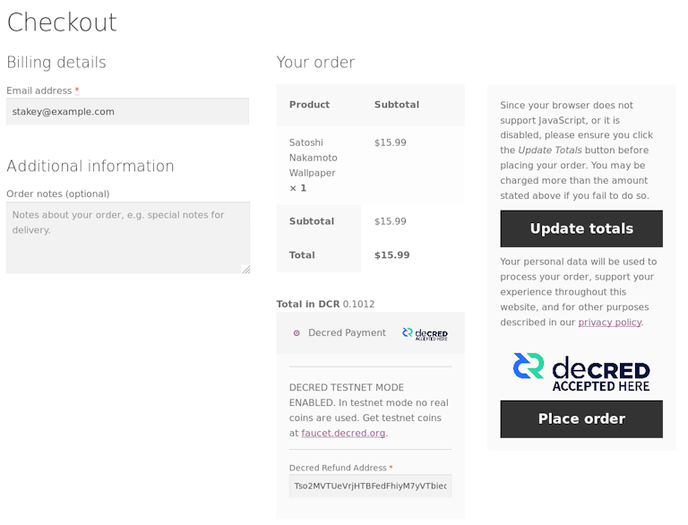

# Decred月报 – 2021年7月

_图片: @saender_

七月重点：

- 现在有3个新的共识升级开发提案，自动撤销选票已经吸引了一些媒体报道。
- dcrd将初始区块链下载时间又缩短了10%，并且 DCRDEX 增加了核心 ETH 集成。
- Decred in Depth 录制了许多知名社区成员的采访，包括一些出版物和播客，包含了对开发人员的采访。

内容：

- [开发进展总结](#development)
- [人员](#people)
- [治理](#governance)
- [网络](#network)
- [生态系统](#ecosystem)
- [外展](#outreach)
- [活动](#events)
- [媒体](#media)
- [社区讨论](#discussions)
- [市场](#markets)
- [相关外部信息](#relevant-external)

## 开发进展总结

除非另有说明，否则此处报告的工作仅限为“合并到主核心存储库”状态。这意味着这项工作已经完成、审查并集成到高级用户可以[构建和运行](https://medium.com/@artikozel/the-decred-node-back-to-the-source-part-one-27d4576e7e1c)的源代码中，但对于普通用户来说，还不能使用。

<a id="dcrd" />

**[dcrd](https://github.com/decred/dcrd)**

- 更新了`UtxoBackend`实现以`leveldb`直接使用而不是使用`database`包。这导致初始区块链下载速度提高约 10%，内存使用量减少约 12%。
- 区块索引更改为使用[short keys](https://github.com/decred/dcrd/pull/2685)，从而节省约 30 MiB 内存
- 增加了 RPC 请求的大小[限制](https://github.com/decred/dcrd/pull/2675)，以帮助进一步加强服务器以防止在配置不当的网络上的非标准配置中的潜在滥用
- 为 WebSocket 连接添加了更严格的[来源检查](https://github.com/decred/dcrd/pull/2676)
- 较小的修复和清理

在这一点上，我们有 3 个即将到来的共识变化：

- 恢复到最初的国库支出政策（以[修复](202106.md#new-treasury-bug)新国库的支出）有一个[DCP](https://github.com/decred/dcps/pull/20)提案和一个提案[拉取请求](https://github.com/decred/dcrd/pull/2680)
- 版本升级[提案](https://github.com/decred/dcrd/pull/2680)已获批准，并且一些支持代码已经合并（就像我们在六月介绍的标准脚本处理）
- 自动选票撤销[提案](https://proposals.decred.org/record/e2d7b7d)得到批准

自动选票撤销的一个好处是它简化了[选票分割](https://www.reddit.com/r/decred/comments/ot8x7o/decred_memelord_13_part_tweet_thread_113_decreds/h6w1vnk/)实施。

<a id="dcrwallet" />

**[dcrwallet](https://github.com/decred/dcrwallet)**

- 添加了一个 RPC 方法，允许 Decrediton 更有效地发现活动地址
- 添加了一个 RPC 方法来[撤销](https://github.com/decred/dcrwallet/pull/2061) SPV 模式下的选票（也适用于 Decrediton）
- 修复了[解锁](https://github.com/decred/dcrwallet/pull/2067)钱包时的并发问题

<a id="decrediton" />

**[Decrediton](https://github.com/decred/decrediton)**

面向用户：

- 在钱包创建流程中添加了[种子确认](https://github.com/decred/decrediton/pull/3521)窗口
- 改进了 LN 钱包[连接](https://github.com/decred/decrediton/pull/3530)页面的UI 设计
- 简化的响应式布局[断点](https://github.com/decred/decrediton/pull/3525)（以简化与 DCRDEX 的集成）
- 禁止在钱包名称中使用一些有问题的[字符](https://github.com/decred/decrediton/pull/3511)
- 修复了在交易历史页面上选择[交易过滤器](https://github.com/decred/decrediton/issues/3528)的问题
- ~7 个其他修复

面向内部开发者：

- 迁移到新的[Politeia API](https://github.com/decred/decrediton/pull/3495)
- [交易](https://github.com/decred/decrediton/pull/3518)页面的自动化测试
- 删除了使用[winston](https://github.com/decred/decrediton/pull/3536)日志库以减少项目的依赖树（和供应链攻击面）

_更新了 Decrediton LN 设置页面_

<a id="politeia" />

**[Politeia](https://github.com/decred/politeia)**

面向用户：

- 捕获额外的提案[元数据](https://github.com/decred/politeiagui/pull/2469)，如美元资金限额、开始日期、预计结束日期和域。这将使我们能够改进和自动化承包商发票验证，并在 Politeia 上生成提案统计数据。
- 添加了电子邮件通知的[速率限制](https://github.com/decred/politeia/pull/1448)以防止恶意行为
- 显示谁[审查](https://github.com/decred/politeiagui/pull/2454)了记录，为什么以及时间
- 改进了下载[提案包](https://github.com/decred/politeiagui/pull/2453)的用户体验
- 禁止评论中的某些[Markdown](https://github.com/decred/politeiagui/pull/2494)元素以防止滥用文字大小
- 在加载提案数据时显示[占位符](https://github.com/decred/politeiagui/pull/2484)
- 保存草稿时显示有关可能丢失数据的[警告](https://github.com/decred/politeiagui/pull/2500)
- ~11 个前端和 ~1 个后端错误修复

内部和开发人员：

- 在[插件设置](https://github.com/decred/politeia/pull/1451)中允许多个值
- 添加了提案[验证](https://github.com/decred/politeia/pull/1453)的测试覆盖率
- [提案列表](https://github.com/decred/politeiagui/pull/2473)的自动化 UI 测试
- 扩展开发者文档
- ~1 个前端和 ~7 个后端错误修复

CMS:

- ~1 个前端和 ~2 个后端错误修复

等待部署的更改`pi-not-deployed`在[politeiagui](https://github.com/decred/politeiagui/issues?q=label%3Api-not-deployed)和[politeia](https://github.com/decred/politeia/pulls?q=label%3Api-not-deployed) repos 中都标有标签。以类似的方式，开发[提案](https://proposals.decred.org/record/91cfcc8)范围的变化被标记为[`91cfcc8`](https://github.com/decred/politeia/issues?q=label%3A91cfcc8)。

<a id="dcrdex" />

**[DCRDEX](https://github.com/decred/dcrdex)**

面向用户：

- 处理[余额不足](https://github.com/decred/dcrdex/pull/1092)的注册尝试
- 记录[退款交易](https://github.com/decred/dcrdex/pull/1110)，以便用户可以在无法访问客户端但日志仍然可用时挽救资金
- 增加CSV文件的订单[出口](https://github.com/decred/dcrdex/pull/1109)
- 将[相同费率](https://github.com/decred/dcrdex/pull/1090)的订单分组到一个表格行中
- 在浏览器窗口[标题](https://github.com/decred/dcrdex/pull/1117)中显示当前价格
- 4+ 错误修复

面向内部开发者：

- 只允许客户端上的一个[原像](https://github.com/decred/dcrdex/pull/1106)请求以防止恶意服务器行为
- 手数和利率步长使[市场参数](https://github.com/decred/dcrdex/pull/1102)而不是资产参数
- 更新了 npm [依赖项](https://github.com/decred/dcrdex/pull/1111)
- 迁移到 dcrd 的[`stdaddr`](https://github.com/decred/dcrdex/pull/1096)包
- 4+ 错误修复

以太坊支持：

- 基础客户端[ETH](https://github.com/decred/dcrdex/pull/1005)基础设施（目前禁用主网）
- 以[gwei](https://github.com/decred/dcrdex/pull/1078)为单位存储 ETH 余额以适合 64 位整数
- 实现了 ETH [同步状态](https://github.com/decred/dcrdex/pull/1082)和费率信息（有一个解决方法，缺少请求的Geth 功能）

一些修复已[向后移植](https://github.com/decred/dcrdex/commits/release-v0.2)到即将发布的 v0.2.1 版本。

工作开始用[暂锁资金](https://github.com/decred/dcrdex/pull/1120)代替注册费，用户锁定资金以使用 DCRDEX（作为对不良行为的[抑制](https://twitter.com/lukebp_/status/1412061031061508098)），但可以在一定时间后赎回。这会产生使用 DCRDEX 的时间成本而不是货币成本。

<a id="dcrandroid" />

**[dcrandroid](https://github.com/planetdecred/dcrandroid)**

@raedah 评论了移动应用程序何时支持买票的问题：

> 对新的 vspd staking 的支持已内置到 Godcr 的 dcrlibwallet 中，目前正在最终测试中。在 Godcr 发布后，开发人员可以轻松地将相同的 staking 功能导入到移动应用程序中。尽管有一个可以与之配对的功能性硬件钱包，但并没有强烈的动机来优先构建移动质押 UI。([2021-07-19](https://www.reddit.com/r/decred/comments/okrlg1/mobile_staking/h5rps6h/))

<a id="dcrios" />

**[dcrios](https://github.com/planetdecred/dcrios)**

- 更新[越南语](https://github.com/planetdecred/dcrios/pull/809)翻译

<a id="godcr" />

**[godcr](https://github.com/planetdecred/godcr)**

- 实现了用于显示样式文本的[HTML渲染器](https://github.com/planetdecred/godcr/pull/469)
- 实现自定义[切换](https://github.com/planetdecred/godcr/pull/487)小部件
- 没有资金时[隐藏](https://github.com/planetdecred/godcr/pull/493)质押余额和导入的帐户
- 添加了[许可证](https://github.com/planetdecred/godcr/pull/516)页面
- UI 更新和大量代码清理：[提案](https://github.com/planetdecred/godcr/pull/513)列表和详细信息、[钱包](https://github.com/planetdecred/godcr/pull/496)、[发送](https://github.com/planetdecred/godcr/pull/524), [StakeShuffle](https://github.com/planetdecred/godcr/pull/534)和[选票](https://github.com/planetdecred/godcr/pull/539)页面
- 页面和模式分组到[packages](https://github.com/planetdecred/godcr/pull/512)中
- 6+ 错误修复

_Godcr 概览页面_

<a id="dcrdata" />

**[dcrdata](https://github.com/decred/dcrdata)**

面向用户：

- 固定更改提案页面上的[投票状态](https://github.com/decred/dcrdata/pull/1838)
- 固定提案议程[法定人数](https://github.com/decred/dcrdata/pull/1813)阈值
- 更改阻止页面以使用[“批准”和“不批准”](https://github.com/decred/dcrdata/pull/1841)条款而不是“有效”/“无效”

内部和开发人员：

- [优化](https://github.com/decred/dcrdata/pull/1840)初始同步、vouts 表、地址缓存和搜索页面性能
- [优化](https://github.com/decred/dcrdata/pull/1844)性能和改进启动
- 从 gob 编码切换到票池的自定义[序列化](https://github.com/decred/dcrdata/pull/1843)，使启动速度加快约 5 秒
- 固定[清除](https://github.com/decred/dcrdata/pull/1842)vouts 表
- 添加了使用 simnet 链而不是 dcrdata 快照的[测试工具](https://github.com/decred/dcrdata/pull/1778)

<a id="dcrdocs" />

**[docs](https://github.com/decred/dcrdocs)**

- 修复断开的[链接](https://github.com/decred/dcrdocs/pull/1177)
- 删除了[gominer](https://github.com/decred/dcrdocs/pull/1178)文档
- [更新](https://github.com/decred/dcrdocs/pull/1174)共识投票档案

<a id="dcrweb" />

**[decred.org](https://github.com/decred/dcrweb)**

- 在 VSP 列表中增加了[已撤销](https://github.com/decred/dcrweb/pull/993)选票的百分比
- 在[decred.org](https://decred.org/)主页上[同时](https://decred.org/)显示新闻稿和最新帖子
- 添加的[新闻稿](https://decred.org/press/2021-05-25_dex_decrediton/)有关Decrediton DCRDEX整合

<a id="woocommerce-plugin" />

**[WooCommerce插件](https://github.com/karamble/decred-woocommerce-plugin)**

@karamble 发布了一个新插件，用于在[WooCommerce](https://en.wikipedia.org/wiki/WooCommerce)商店中接受 DCR 付款。它可以使用钱包账户的 XPUB（扩展公钥）生成支付地址。这样，每次付款都使用一个新的唯一地址，而商店的网络服务器无法访问钱包。

_WooCommerce结帐插件页面_

其他：

- 我们完全错过了两个实现 Decred API 的年轻 [Rust](https://github.com/metaclips/rustdcr) [存储库](https://github.com/metaclips/politeia-rs)，尽管它们自 2020 年 11 月至 12 月以来没有收到新的提交
- Bug 赏金计划在第 3 阶段结束时（6 月 30 日）[报告了](https://bounty.decred.org/2021/07/status-update/)统计数据：总共处理了 193 份提交，其中 18 份符合支付条件。最高赏金金额已增加。

## 人员

欢迎新的首次贡献者，他们的代码已合并到主存储库： @briancolecoinmetrics ([dcrd](https://github.com/decred/dcrd/commits?author=briancolecoinmetrics)), @devchoplife ([godcr](https://github.com/planetdecred/godcr/commits?author=devchoplife)), 和 @jcezetah ([godcr](https://github.com/planetdecred/godcr/commits?author=jcezetah))!

在媒体部分查看对社区成员 @fst_nml、Dominic Frisby 和 Notsofast 的新采访。

截至 8 月 1 日的社区统计数据：

- [Twitter](https://twitter.com/decredproject) 粉丝: 47,586 (+667)
- [Reddit](https://www.reddit.com/r/decred/) 订阅: 11,449 (+127)
- [Matrix](https://chat.decred.org/) #general 用户: 513 (+12)
- [Discord](https://discord.gg/GJ2GXfz) 用户: 1,960 (+27)
- [Telegram](https://t.me/Decred) 用户: 2,833 (+100)
- [YouTube](https://www.youtube.com/decredchannel) 订阅: 4,600 (+30), 观看: 191K (+3K)

## 治理

7 月，新[国库](https://dcrdata.decred.org/treasury)收到了价值 144 万美元的 11,338 DCR，7 月的平均汇率为 127.48 美元。770 DCR 用于支付承包商，按 7 月的费率计算，价值 98,000 美元，或按 6 月的费率 131.52 美元计算，价值 101,000 美元。截至 8 月 2 日，旧国库和新国库的总余额为 703,655 DCR（9630 万美元）。

旧国库收到了来自混合交易的不寻常的约 90 DCR 的["捐赠"](https://explorer.dcrdata.org/tx/2411c14283d5810e0d7f6d1f174e42cb4cf536fb2f7dd51b96d63c9087766e10)。

7 月份发布了 4 项新提案，截至撰写本文时，其中两项仍在讨论中。

- 来自@frizzers 的一项[提案](https://proposals.decred.org/record/ae609f1)，即根据他的书“Daylight Robbery”制作一部可以自由分享的 Copyleft 纪录片，费用为 30 万美元。

- 一项资助人们参加 2021 年 10 月迪拜加密货币博览会的[提案](https://proposals.decred.org/record/51c4128)提出了两种选择，4 名 Decred 代表飞往迪拜参加会议的费用为 21,240 美元，或者还需要支付 26,240 美元的活动费用。@sz1 将根据社区反馈选择一个选项。

- 资助一部由 3 部分组成的科幻迷你剧的提[提议](https://proposals.decred.org/record/a3fa55f)已被其所有者撤回。

- 自动选票撤销共识[变更](https://proposals.decred.org/record/e2d7b7d)（95% 批准，51% 参与）和 Twitter 图表[机器人](https://proposals.decred.org/record/2895755)（85% 批准，46% 投票率）的提案获得批准。

有关本月提案的更多详细信息，请参阅 Politeia Digest第[44](https://blockcommons.red/politeia-digest/issue044/)期和第[45](https://blockcommons.red/politeia-digest/issue045/)期。

## 网络

**全网算力**: 7 月[算力](https://dcrdata.decred.org/charts?chart=hashrate&zoom=kqhwurpw-kru2wj65&scale=linear&bin=block&axis=time)以~71 Ph/s开启，以~316 Ph/s结束，全月最低为70 Ph/s，最高为334 Ph/s。

8 月 1 日矿池[报告](https://miningpoolstats.stream/decred)的算力分布：矿池 58%、F2Pool 23%、AntPool 6%、BTC.com 4%、Easy2Mine 4%、Luxor 2.3%、HuobiPool 1%、ViaBTC 0.4%、CoinMine 0.09%、OKEx 0.08%，UUPool 0.06%。8 月 1 日之前实际开采的 1,000 个区块的分布与报告的哈希率非常匹配。

哈希率正在从 6 月份在中国发生的[事件](https://www.coindesk.com/chinas-bitcoin-mining-crackdown-is-a-boon-for-miners-elsewhere)中恢复，新的矿池正在加入网络。

**Staking**: [票价](https://dcrdata.decred.org/charts?chart=ticket-price&zoom=kqhwurpw-kru2wj65&bin=window&axis=time&visibility=true-true&mode=stepped)在146.3-203.2 DCR之间变化，具有30天的平均在190.7 DCR（6）。

[锁定量](https://dcrdata.decred.org/charts?chart=ticket-pool-value&zoom=kqhwurpw-kru2wj65&scale=linear&bin=block&axis=time)为7.43-7.88百万DCR，这意味着循环供应的56.3-59.8％参加在验证的股权。

票价异常跌破 2020 年低点，但随后在强劲的买入支持下迅速回升。

**VSP**: 在 8 月 1 日，~8,600 (+600) 个现场票由[列出](https://decred.org/vsp/)的vspd 服务器管理，~400 (-200) 个由列出的旧 dcrstakepool 服务器管理。11 个传统 VSP 和 14 个新 VSP 总共管理着 22.9% (+2%) 的票池。未列出但仍处于活动状态的旧版 VSP 管理着 12 张现场票 (-14)。

从绝对值来看，选票收益最大的是 stakey.com (+474)、123.dcr.rocks (+126) 和 ubiqsmart.com (+51)。前两者的费用低于 0.5%。

**Nodes**: 根据[dcrextdata](https://dcrextdata.planetdecred.org/nodes)，整个 7 月大约有 211 个可访问节点。

截至 8 月 1 日[快照](https://nodes.jholdstock.uk/user_agents)的节点版本（250 个 dcrd 节点）：v1.6.2 - 57%、v1.6.0 - 16%、v1.6.1 - 13%、v1.7 dev builds - 7%、v1.6 dev builds - 3 %，v1.5.2 - 2%，v1.5.1 - 1.6%。

截至8 月 1 日，Decred 的[闪电网络](https://ln-map.jholdstock.uk/)已拥有 36 个节点（+2）、66 个通道（+6），总容量为 25.5 DCR（+3.7）。

## 生态系统

欢迎新的 vspd 实例[dcrvsp.dittrex.com](https://dcrvsp.dittrex.com/)来取代他们在 5 月退市并于 7 月关闭的旧 VSP 。

来自@karamble 的旧版 VSP [pool.d3c.red](https://pool.d3c.red)投了最后一张票并被关闭。欢迎用户使用位于[vsp.decredcommunity.org](https://vsp.decredcommunity.org/)的替换服务器。

到目前为止，8 个遗留 VSP 已被除名（3 个关闭，1 个状态未知，4 个仍在投票），9 个仍在列表中。此表总结了迁移到新VSP 系统的状态。这是建议的是传统的VSP用户升级到VSPD，以免错过票的风险时dcrstakepool停止工作（例如，如果一个新的共识升级激活）。

[VSP列表](https://decred.org/vsp/)已更新，以显示取消选票的比例，选择VSP时，这是一个有用的指标。

[ViaBTC](https://www.viabtc.com/)宣布推出DCR 挖矿，并在 8 月 25 日之前举办“免费挖矿嘉年华”。该矿池支持 PPS+、PPLNS 和 SOLO 支付方式。

[OKEx pool](https://www.okex.com/pool)已开采DCR自2020年8月或更早，但在7月，终于挖掘一些块，根据miningpoolstats.stream。

[Bitfinex](https://www.bitfinex.com/)预先宣布了 DCR 上市，并在 8 月初发布了 DCR/USD 交易实时。

警告：Decred 月报的作者不知道上述任何服务的可信度。在将您的个人信息或资产信任给任何实体之前，请自行研究。

加入我们的[#services](https://chat.decred.org/#/room/#services:decred.org)聊天，关注 Decred 生态系统更新。

## 外展

Monde PR 7 月份的成绩：

- 向金融和加密出版物投放了 1 个故事
- 将 Decred 投放到 4 个公关机会
- 获得2次媒体采访

获得以下新闻文章：

- @lukebp 接受了 Geek Insider 的播客[Geek Speak](https://www.youtube.com/watch?v=a9IQyMf_724)的采访，涵盖了 Decred 的所有主要方面
- [The Street](https://www.thestreet.com/personal-finance/should-you-worry-about-crypto-crashing-nw)上的一篇文章来自 @jy-p 关于如何购买加密货币的评论，来自 NerdWallet
- [MarketWatch](https://www.marketwatch.com/story/what-to-do-when-your-digital-assets-take-a-dive-11625258295)上的一篇文章来自 @jy-p 关于如何购买加密货币的评论，由 NerdWallet 联合发布。这篇文章还被联合到 7 个其他出版物，包括MSN。
- [Bankless Times](https://www.banklesstimes.com/2021/07/28/decred-continues-to-evolve-without-contentious-hard-forks/), [Crowdfund Insider](https://www.crowdfundinsider.com/2021/07/178473-decred-dcr-a-virtual-currency-focused-on-security-and-scalability-to-enhance-user-experience/)和[Geek Insider](https://geekinsider.com/no-contentious-hardforks-as-decred-evolves/)都报道了有关 Decred 通过投票对票证撤销达成共识更改的消息。@lukebp 还接受了 Crypto and Cigars 播客的采访，讨论了 Decred 的可升级性。
- Finder.com 发布了其加密货币预测调查的结果，其中引用了 @jz 在一篇关于[比特币价格预测](https://www.finder.com/bitcoin-btc-price-prediction)的文章和一篇关于Doge价格预测的文章中的引述。该消息被The Block News、FinBold、CryptoKnowmics、Bitcoin News、Bitcoin News和The Hack Posts的第二篇文章收录。文章提到，Decred 是完成调查的 42 位专家小组的成员，其中包括来自汤森路透、伦敦大学学院管理学院和西澳大利亚大学的代表。
- @raedah 接受了权威杂志的[The Future is Now](https://medium.com/authority-magazine/the-future-is-now-steven-wagner-of-raedah-group-on-how-their-technological-innovation-will-shake-4f272ced222f)系列采访，谈论了 Decred 和加密的所有事情，包括隐私、治理、Decred 是第一个真正的加密 DAO 以及 Decred 在巴西大选中的使用。

@StakeShuffle_ bot 的作者正在收集有关在下一个开发阶段实施哪些指标的[反馈](https://twitter.com/StakeShuffle_/status/1418895005050155011)。带有生成图表的推文将提供可用于 Twitter 对话的最新内容。

## 活动

参加：

- 7 月 5 日 - [Talent Land Digital](https://github.com/decredcommunity/events/pull/95) - 互联网。@pablito 发表了 25 分钟关于“什么是 Decred”的主题演讲（34K 次观看）和 58 分钟的研讨会“使用 dcrdata API 介绍区块链”（47K 次观看）。Decred 是 Talent Land 的铜牌赞助商。

- 7 月 10 日 - [YOUCATHON: Youth For Change & Action (100 % Digital)](https://decredcommunity.github.io/events/index/20210710.1)） - 摩洛哥优素菲亚。计算机科学学校 YouCode 在 Youssoufia 和 Safi 的两个校区之间组织了一次黑客马拉松，通过视频会议连接。@arij 受邀谈论区块链技术。在她大约 80 分钟的演讲中，她解释了技术并展示了一个 Decred 钱包和 Politeia。问题涉及如何使用它来构建应用程序以及在区块链项目中存在哪些工作机会，因此@arij 解释了她在 Decred 中的角色以及如何加入。

- 自 2021 年初以来，Decred 是阿根廷天主教大学商学院和比特币阿根廷非政府组织组织的有关加密货币和区块链技术[教育计划](https://twitter.com/IECarballo/status/1417491314191519751)的支持者。

## 媒体

精选文章：

- 即将到来的央行数字货币的兴衰 @ammarooni ([bitcoinmagazine.com](https://bitcoinmagazine.com/culture/rise-fall-central-bank-digital-currency))

视频：

- 什么是Decred？| 去中心化自治组织 | Politeia | MarketSquare ([youtube](https://www.youtube.com/watch?v=s8hAwP0JvE4))
- 区块链安全 - Decred Fundamentals @phoenixgreen ([youtube](https://www.youtube.com/watch?v=BsKV7fiWdqE))
- 攻击的代价 - Decred Fundamentals @phoenixgreen ([youtube](https://www.youtube.com/watch?v=RXV8dGZ9HEk))
- 混合安全 - Decred Fundamentals @phoenixgreen ([youtube](https://www.youtube.com/watch?v=QgInCQTbw4s))
- Decred 价格分析 - 2021 年 7 月 1 日 @Brave New Coin ([youtube](https://www.youtube.com/watch?v=rtpCGv63Tm8))
- A ragin' geek speak with... Decred blockchain developer, Luke Powell - 07/05/2021 by Meredith Loughran of GeekInsider ([youtube](https://www.youtube.com/watch?v=VLZRriYx8qM), [periscope](https://www.pscp.tv/w/c7IKyDFQbUtxVmduRHpqb1l8MWt2SnBvb0FaZG9HRadTE0sJ4V5iChp6FerysRgxlLOi8yj07WsN_joUocji))
- 一个疯狂的极客与...... Decred 区块链开发人员 Luke Powell - 07/05/2021 @elima\_iii ([youtube](https://www.youtube.com/watch?v=vGjqqVN4qDs))
- Decred in Depth 39 -Dominic Frisby - 营销 + 电影制作 + DAO @elima\_iii ([youtube](https://www.youtube.com/watch?v=WpMKGsQLxic))
- Decred in Depth 40 -  Notsofast 采访 @elima\_iii ([youtube](https://www.youtube.com/watch?v=ryyJ25EXqKI))

音频：

- 新的 Decred in Depth 播客已上传到 [Libsynn](https://decredindepth.libsyn.com/)

艺术与娱乐：

- @OfficialCryptos的[治理模型](https://twitter.com/OfficialCryptos/status/1410731577546477568)可视化

翻译:

- Decred Journal 2021 年 6 月被[翻译成](https://xaur.github.io/decred-news/) 阿拉伯语（@arij、@abdulrahman4）、中文（@Dominic）和西班牙语（@francov_）。衷心感谢所有翻译人员陪伴我们这么久！

如果您有我们不知道的翻译，请在我们的[#translations](https://chat.decred.org/#/room/#translations:decred.org)聊天中分享。

## 社区讨论

精选的 Reddit 帖子：

- 如何[吸引开发者](https://www.reddit.com/r/decred/comments/ohcr5q/how_attact_developers_to_join_decred_community/)加入 Decred 社区的想法
- 关于购买[ASICs](https://www.reddit.com/r/decred/comments/occ45q/buy_decred_asic_where_when_what_do_you_think_guys/)及其盈利能力的多条评论

精选的 Twitter 讨论：

- @ lukebp的[推文](https://twitter.com/lukebp_/status/1418216538193203200)在自动选票撤销共识变化的亮点是在关键的共识代码更多的工作是由开发商原队外完成在下放项目的一个重要步骤。第二个亮点是这一变化展示了 Decred 的基本价值主张——改进基础层用户体验的能力。
- @decredmemelord总结了过去一年项目的一些[主要成果](https://twitter.com/decredmemelord/status/1420227949970685956)

## 市场

7 月 DCR 的交易价格在 91.70-158.46 美元 / BTC 0.00338-0.00381 之间。平均价格为 127.48 美元。

## 相关外部信息

Thorchain 本月遭受了两次攻击。第一个受影响的 ETH 流动性提供者，其资金池被抽空了 500 万美元，他们将从 Thorchain 国库中获得补偿。在第二攻击声称$ 800万通过欺骗网络的Bifrost协议转换成接收假的资产-它可能显然已如果不是更糟多的黑客似乎白帽倾向。事物可以然而仰视的Thorchain，作为最后的攻击者留下指示他们如何能提高安全性。

Uniswap 投票决定用 100 万个 UNI（价值约 2000 万美元）资助一个“DeFi 教育基金”，其中的一半立即换成了 USDC。该提案最初被称为“政治防御基金”，用于支付可以与监管机构对抗 DeFi 角落的代表。有人批评与提议者有关联的 UNI 鲸鱼在批准该提案时所扮演的角色。

ShapeShift 组织正在关门大吉，以“将自己分散到不存在的地方”。它正在向其用户和许多 DeFi 协议的用户空投 FOX 代币，这些代币将用于管理 DAO（也接收代币分配）。空投很复杂，因为它涵盖了一系列区块链，但用户只有 100 天的时间来领取他们的 FOX 代币，然后这些代币才能恢复到 DAO。

这就是我们七月的全部内容。在我们的[#journal](https://chat.decred.org/#/room/#journal:decred.org)聊天室中分享您对下一期的更新。

## 关于月报

这是Decred Journal的第40期。有关所有问题，镜像和翻译的索引，请参见[这里](https://xaur.github.io/decred-news/).

来自第三方的大多数信息都是在经过最低限度的健全性检查后直接从源中转过来的。Decred 期刊的作者无法验证所有声明。请提防诈骗并自行研究。

感谢 (字母排列):

- 写作和编辑: bee, degeri, l1ndseymm, richardred
- 评论和反馈: davecgh, karamble, lukebp, raedah
- 封面图片：saender
- 资助: Decred stakeholders

## 中文社区

* [社区网址](https://blog.dcrclub.org/)
* [微博](https://www.weibo.com/DecredProject)
* [微信公众号](https://mp.weixin.qq.com/mp/profile_ext?action=home&__biz=Mzg2NTExNzc3MA==&scene=124#wechat_redirect)
* [中文电报群](https://t.me/decred_cn)
* [bilibili频道](https://space.bilibili.com/425519478)
* QQ群号-258412796
