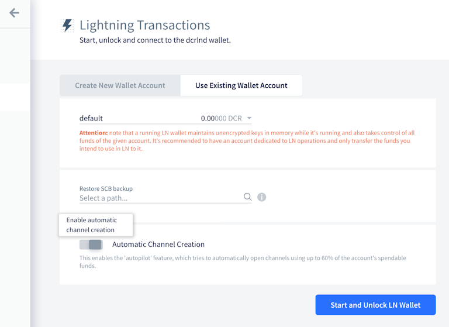

# Decred月报 – 2021年7月

_图片: @saender_

七月重点：

- 现在有3个新的共识升级开发提案，自动撤销选票已经吸引了一些媒体报道。
- dcrd将初始区块链下载时间又缩短了10%，并且 DCRDEX 增加了核心 ETH 集成。
- Decred in Depth 录制了许多知名社区成员的采访，包括一些出版物和播客，包含了对开发人员的采访。

内容：

- [开发进展总结](#development)
- [人员](#people)
- [治理](#governance)
- [网络](#network)
- [生态系统](#ecosystem)
- [外展](#outreach)
- [活动](#events)
- [媒体](#media)
- [社区讨论](#discussions)
- [市场](#markets)
- [相关外部信息](#relevant-external)

## 开发进展总结

除非另有说明，否则此处报告的工作仅限为“合并到主核心存储库”状态。这意味着这项工作已经完成、审查并集成到高级用户可以[构建和运行](https://medium.com/@artikozel/the-decred-node-back-to-the-source-part-one-27d4576e7e1c)的源代码中，但对于普通用户来说，还不能使用。

<a id="dcrd" />

**[dcrd](https://github.com/decred/dcrd)**

- 更新了`UtxoBackend`实现以`leveldb`直接使用而不是使用`database`包。这导致初始区块链下载速度提高约 10%，内存使用量减少约 12%。
- 区块索引更改为使用[short keys](https://github.com/decred/dcrd/pull/2685)，从而节省约 30 MiB 内存
- 增加了 RPC 请求的大小[限制](https://github.com/decred/dcrd/pull/2675)，以帮助进一步加强服务器以防止在配置不当的网络上的非标准配置中的潜在滥用
- 为 WebSocket 连接添加了更严格的[来源检查](https://github.com/decred/dcrd/pull/2676)
- 较小的修复和清理

在这一点上，我们有 3 个即将到来的共识变化：

- 恢复到最初的国库支出政策（以[修复](202106.md#new-treasury-bug)新国库的支出）有一个[DCP](https://github.com/decred/dcps/pull/20)提案和一个提案[拉取请求](https://github.com/decred/dcrd/pull/2680)
- 版本升级[提案](https://github.com/decred/dcrd/pull/2680)已获批准，并且一些支持代码已经合并（就像我们在六月介绍的标准脚本处理）
- 自动选票撤销[提案](https://proposals.decred.org/record/e2d7b7d)得到批准

自动选票撤销的一个好处是它简化了[选票分割](https://www.reddit.com/r/decred/comments/ot8x7o/decred_memelord_13_part_tweet_thread_113_decreds/h6w1vnk/)实施。

<a id="dcrwallet" />

**[dcrwallet](https://github.com/decred/dcrwallet)**

- 添加了一个 RPC 方法，允许 Decrediton 更有效地发现活动地址
- 添加了一个 RPC 方法来[撤销](https://github.com/decred/dcrwallet/pull/2061) SPV 模式下的选票（也适用于 Decrediton）
- 修复了[解锁](https://github.com/decred/dcrwallet/pull/2067)钱包时的并发问题

<a id="decrediton" />

**[Decrediton](https://github.com/decred/decrediton)**

面向用户：

- 在钱包创建流程中添加了[种子确认](https://github.com/decred/decrediton/pull/3521)窗口
- 改进了 LN 钱包[连接](https://github.com/decred/decrediton/pull/3530)页面的UI 设计
- 简化的响应式布局[断点](https://github.com/decred/decrediton/pull/3525)（以简化与 DCRDEX 的集成）
- 禁止在钱包名称中使用一些有问题的[字符](https://github.com/decred/decrediton/pull/3511)
- 修复了在交易历史页面上选择[交易过滤器](https://github.com/decred/decrediton/issues/3528)的问题
- ~7 个其他修复

面向内部开发者：

- 迁移到新的[Politeia API](https://github.com/decred/decrediton/pull/3495)
- [交易](https://github.com/decred/decrediton/pull/3518)页面的自动化测试
- 删除了使用[winston](https://github.com/decred/decrediton/pull/3536)日志库以减少项目的依赖树（和供应链攻击面）

_更新了 Decrediton LN 设置页面_

<a id="politeia" />

**[Politeia](https://github.com/decred/politeia)**

面向用户：

- 捕获额外的提案[元数据](https://github.com/decred/politeiagui/pull/2469)，如美元资金限额、开始日期、预计结束日期和域。这将使我们能够改进和自动化承包商发票验证，并在 Politeia 上生成提案统计数据。
- 添加了电子邮件通知的[速率限制](https://github.com/decred/politeia/pull/1448)以防止恶意行为
- 显示谁[审查](https://github.com/decred/politeiagui/pull/2454)了记录，为什么以及时间
- 改进了下载[提案包](https://github.com/decred/politeiagui/pull/2453)的用户体验
- 禁止评论中的某些[Markdown](https://github.com/decred/politeiagui/pull/2494)元素以防止滥用文字大小
- 在加载提案数据时显示[占位符](https://github.com/decred/politeiagui/pull/2484)
- 保存草稿时显示有关可能丢失数据的[警告](https://github.com/decred/politeiagui/pull/2500)
- ~11 个前端和 ~1 个后端错误修复

内部和开发人员：

- 在[插件设置](https://github.com/decred/politeia/pull/1451)中允许多个值
- 添加了提案[验证](https://github.com/decred/politeia/pull/1453)的测试覆盖率
- [提案列表](https://github.com/decred/politeiagui/pull/2473)的自动化 UI 测试
- 扩展开发者文档
- ~1 个前端和 ~7 个后端错误修复

CMS:

- ~1 个前端和 ~2 个后端错误修复

等待部署的更改`pi-not-deployed`在[politeiagui](https://github.com/decred/politeiagui/issues?q=label%3Api-not-deployed)和[politeia](https://github.com/decred/politeia/pulls?q=label%3Api-not-deployed) repos 中都标有标签。以类似的方式，开发[提案](https://proposals.decred.org/record/91cfcc8)范围的变化被标记为[`91cfcc8`](https://github.com/decred/politeia/issues?q=label%3A91cfcc8)。

<a id="dcrdex" />

**[DCRDEX](https://github.com/decred/dcrdex)**

面向用户：

- 处理[余额不足](https://github.com/decred/dcrdex/pull/1092)的注册尝试
- 记录[退款交易](https://github.com/decred/dcrdex/pull/1110)，以便用户可以在无法访问客户端但日志仍然可用时挽救资金
- 增加CSV文件的订单[出口](https://github.com/decred/dcrdex/pull/1109)
- 将[相同费率](https://github.com/decred/dcrdex/pull/1090)的订单分组到一个表格行中
- 在浏览器窗口[标题](https://github.com/decred/dcrdex/pull/1117)中显示当前价格
- 4+ 错误修复

面向内部开发者：

- 只允许客户端上的一个[原像](https://github.com/decred/dcrdex/pull/1106)请求以防止恶意服务器行为
- 手数和利率步长使[市场参数](https://github.com/decred/dcrdex/pull/1102)而不是资产参数
- 更新了 npm [依赖项](https://github.com/decred/dcrdex/pull/1111)
- 迁移到 dcrd 的[`stdaddr`](https://github.com/decred/dcrdex/pull/1096)包
- 4+ 错误修复

以太坊支持：

- 基础客户端[ETH](https://github.com/decred/dcrdex/pull/1005)基础设施（目前禁用主网）
- 以[gwei](https://github.com/decred/dcrdex/pull/1078)为单位存储 ETH 余额以适合 64 位整数
- 实现了 ETH [同步状态](https://github.com/decred/dcrdex/pull/1082)和费率信息（有一个解决方法，缺少请求的Geth 功能）

一些修复已[向后移植](https://github.com/decred/dcrdex/commits/release-v0.2)到即将发布的 v0.2.1 版本。

工作开始用[暂锁资金](https://github.com/decred/dcrdex/pull/1120)代替注册费，用户锁定资金以使用 DCRDEX（作为对不良行为的[抑制](https://twitter.com/lukebp_/status/1412061031061508098)），但可以在一定时间后赎回。这会产生使用 DCRDEX 的时间成本而不是货币成本。

<a id="dcrandroid" />

**[dcrandroid](https://github.com/planetdecred/dcrandroid)**

@raedah 评论了移动应用程序何时支持买票的问题：

> 对新的 vspd staking 的支持已内置到 Godcr 的 dcrlibwallet 中，目前正在最终测试中。在 Godcr 发布后，开发人员可以轻松地将相同的 staking 功能导入到移动应用程序中。尽管有一个可以与之配对的功能性硬件钱包，但并没有强烈的动机来优先构建移动质押 UI。([2021-07-19](https://www.reddit.com/r/decred/comments/okrlg1/mobile_staking/h5rps6h/))

<a id="dcrios" />

**[dcrios](https://github.com/planetdecred/dcrios)**

- 更新[越南语](https://github.com/planetdecred/dcrios/pull/809)翻译

<a id="godcr" />

**[godcr](https://github.com/planetdecred/godcr)**

- implemented [HTML renderer](https://github.com/planetdecred/godcr/pull/469) for displaying styled text
- implemented custom [toggle](https://github.com/planetdecred/godcr/pull/487) widget
- [hide](https://github.com/planetdecred/godcr/pull/493) staking balances and imported account when they have no funds
- added [License](https://github.com/planetdecred/godcr/pull/516) page
- UI updates and massive code cleanup for: [Proposal](https://github.com/planetdecred/godcr/pull/513) list and details, [Wallet](https://github.com/planetdecred/godcr/pull/496), [Wallets](https://github.com/planetdecred/godcr/pull/493), [Send](https://github.com/planetdecred/godcr/pull/524), [StakeShuffle](https://github.com/planetdecred/godcr/pull/534), and several [Tickets](https://github.com/planetdecred/godcr/pull/539) pages
- pages and modals grouped into [packages](https://github.com/planetdecred/godcr/pull/512)
- 6+ bug fixes

_godcr Overview page_

<a id="dcrdata" />

**[dcrdata](https://github.com/decred/dcrdata)**

User-facing:

- fixed changing of [vote status](https://github.com/decred/dcrdata/pull/1838) on Proposals page
- fixed agenda quorum [threshold](https://github.com/decred/dcrdata/pull/1813)
- changed Block page to use ["approved" and "disapproved"](https://github.com/decred/dcrdata/pull/1841) terms instead of "valid"/"invalid"

Internal and developer:

- [optimized](https://github.com/decred/dcrdata/pull/1840) initial sync, vouts table, address cache, and search page performance
- [optimized](https://github.com/decred/dcrdata/pull/1844) performance and improved startup
- switched from gob encoding to custom [serialization](https://github.com/decred/dcrdata/pull/1843) of the ticket pool, making startup ~5 seconds faster
- fixed [purging](https://github.com/decred/dcrdata/pull/1842) of vouts table
- added a [test harness](https://github.com/decred/dcrdata/pull/1778) using simnet chain instead of a dcrdata snapshot

<a id="dcrdocs" />

**[docs](https://github.com/decred/dcrdocs)**

- fixed broken [links](https://github.com/decred/dcrdocs/pull/1177)
- removed [gominer](https://github.com/decred/dcrdocs/pull/1178) docs
- [updated](https://github.com/decred/dcrdocs/pull/1174) consensus vote [archive](https://docs.decred.org/governance/consensus-rule-voting/consensus-vote-archive/)

<a id="dcrweb" />

**[decred.org](https://github.com/decred/dcrweb)**

- added percentage of [revoked](https://github.com/decred/dcrweb/pull/993) tickets to the VSP list
- show [both](https://decred.org/) press releases and latest posts at [decred.org](https://decred.org/) home page
- added the [press release](https://decred.org/press/2021-05-25_dex_decrediton/) about DCRDEX integration in Decrediton

<a id="woocommerce-plugin" />

**[WooCommerce Plugin](https://github.com/karamble/decred-woocommerce-plugin)**

@karamble released a new plugin for accepting DCR payments in [WooCommerce](https://en.wikipedia.org/wiki/WooCommerce) shops. It can generate payment addresses using the wallet account's XPUB (extended public key). This way each payment uses a new unique address while the shop's web server has no access to the wallet.

_WooCommerce plugin checkout page_

Other:

- we have totally missed two young [Rust](https://github.com/metaclips/rustdcr) [repos](https://github.com/metaclips/politeia-rs) implementing Decred APIs, although they received no new commits since Nov-Dec 2020
- Bug Bounty Program [reported](https://bounty.decred.org/2021/07/status-update/) stats at the end of Phase 3 (June 30): a total of 193 submissions processed, with 18 being eligible for a payout. Maximum bounty amounts have been [increased](https://github.com/decred/dcrbounty/pull/79/files).

## People

Welcome to new first time contributors with code merged to master: @briancolecoinmetrics ([dcrd](https://github.com/decred/dcrd/commits?author=briancolecoinmetrics)), @devchoplife ([godcr](https://github.com/planetdecred/godcr/commits?author=devchoplife)), and @jcezetah ([godcr](https://github.com/planetdecred/godcr/commits?author=jcezetah))!

Check out new interviews with community members @fst\_nml, Dominic Frisby, and Notsofast in the [Media](#media) section.

Community stats as of Aug 1:

- [Twitter](https://twitter.com/decredproject) followers: 47,586 (+667)
- [Reddit](https://www.reddit.com/r/decred/) subscribers: 11,449 (+127)
- [Matrix](https://chat.decred.org/) #general users: 513 (+12)
- [Discord](https://discord.gg/GJ2GXfz) users: 1,960 (+27)
- [Telegram](https://t.me/Decred) users: 2,833 (+100)
- [YouTube](https://www.youtube.com/decredchannel) subscribers: 4,600 (+30), views: 191K (+3K)

## Governance

In July the new [treasury](https://dcrdata.decred.org/treasury) received 11,338 DCR worth $1.44M at July's average rate of $127.48. 770 DCR was spent to pay contractors, worth $98K at July's rate, or $101K at June's billing rate of $131.52. As of Aug 2, the combined balance of [legacy](https://dcrdata.decred.org/address/Dcur2mcGjmENx4DhNqDctW5wJCVyT3Qeqkx) and new treasury is 703,655 DCR (96.3 million USD at $136.80).

The legacy treasury received an unusual ["donation"](https://explorer.dcrdata.org/tx/2411c14283d5810e0d7f6d1f174e42cb4cf536fb2f7dd51b96d63c9087766e10) of ~90 DCR coming out of a mix transaction.

There were 4 new proposals published in July, and two are still under discussion at the time of writing.

- A [proposal](https://proposals.decred.org/record/ae609f1) from @frizzers to make a copyleft documentary film that can be freely shared, based on his book "Daylight Robbery", at a cost of $300K.

- A [proposal](https://proposals.decred.org/record/51c4128) to fund people to attend Crypto Expo Dubai in October 2021 has presented two options, costing $21,240 to fly 4 Decred representatives to Dubai for the conference, or $26,240 to also pay for a presentation slot at the event. @sz1 will choose one option based on community feedback.

- A [proposal](https://proposals.decred.org/record/a3fa55f) to fund a 3-part science fiction miniseries has been withdrawn by its owner.

- Proposals were approved for the Automatic Tickets Revocations Consensus [Change](https://proposals.decred.org/record/e2d7b7d) (95% approval, 51% participation) and a Twitter charts [bot](https://proposals.decred.org/record/2895755) (85% approval, 46% turnout).

See Politeia Digest [issue 44](https://blockcommons.red/politeia-digest/issue044/) and [issue 45](https://blockcommons.red/politeia-digest/issue045/) for more details on the month's proposals.

## Network

**Hashrate**: July's [hashrate](https://dcrdata.decred.org/charts?chart=hashrate&zoom=kqhwurpw-kru2wj65&scale=linear&bin=block&axis=time) opened at ~71 Ph/s and closed ~316 Ph/s, bottoming at 70 Ph/s and peaking at 334 Ph/s throughout the month.

Distribution of hashrate [reported](https://miningpoolstats.stream/decred) by the pools on Aug 1: Poolin 58%, F2Pool 23%, AntPool 6%, BTC.com 4%, Easy2Mine 4%, Luxor 2.3%, HuobiPool 1%, ViaBTC 0.4%, CoinMine 0.09%, OKEx 0.08%, UUPool 0.06%. Distribution of 1,000 blocks actually [mined](https://miningpoolstats.stream/decred) before Aug 1 closely matched the reported hashrate.

Hashrate is recovering from June's [events](https://www.coindesk.com/chinas-bitcoin-mining-crackdown-is-a-boon-for-miners-elsewhere) in China and new mining pools are joining the network.

**Staking**: [Ticket price](https://dcrdata.decred.org/charts?chart=ticket-price&zoom=kqhwurpw-kru2wj65&bin=window&axis=time&visibility=true-true&mode=stepped) varied between 146.3-203.2 DCR, with 30-day [average](https://dcrstats.com/) at 190.7 DCR (+6).

The [locked amount](https://dcrdata.decred.org/charts?chart=ticket-pool-value&zoom=kqhwurpw-kru2wj65&scale=linear&bin=block&axis=time) was 7.43-7.88 million DCR, meaning that 56.3-59.8% of the circulating supply [participated](https://dcrdata.decred.org/charts?chart=stake-participation&zoom=kqhwurpw-kru2wj65&scale=linear&bin=block&axis=time) in proof-of-stake.

Ticket price had an unusual drop below 2020 lows but then quickly recovered with strong buy support.

**VSP**: On Aug 1, ~8,600 (+600) live tickets were managed by [listed](https://decred.org/vsp/) vspd servers and ~400 (-200) by listed legacy dcrstakepool servers. Collectively the 11 legacy and 14 new VSPs managed 22.9% (+2%) of the ticket pool. Unlisted but still active legacy VSPs managed 12 live tickets (-14).

The biggest ticket gainers in absolute terms were stakey.com (+474), 123.dcr.rocks (+126) and ubiqsmart.com (+51). The first two have fees below 0.5%.

**Nodes**: Throughout July there were around 211 reachable nodes according to [dcrextdata](https://dcrextdata.planetdecred.org/nodes).

Node versions as of Aug 1 [snapshot](https://nodes.jholdstock.uk/user_agents) (250 dcrd nodes): v1.6.2 - 57%, v1.6.0 - 16%, v1.6.1 - 13%, v1.7 dev builds - 7%, v1.6 dev builds - 3%, v1.5.2 - 2%, v1.5.1 - 1.6%.

Decred's [Lightning Network](https://ln-map.jholdstock.uk/) has seen 36 nodes (+2), 66 channels (+6) with a total capacity of 25.5 DCR (+3.7), as of Aug 1.

## Ecosystem

Welcome the new vspd instance [dcrvsp.dittrex.com](https://dcrvsp.dittrex.com/), coming to replace their legacy VSP which was [delisted](https://github.com/decred/dcrwebapi/pull/140) in May and shut down in July.

Legacy VSP [pool.d3c.red](https://pool.d3c.red) from @karamble voted its final ticket and was shutdown. Users are welcome to the replacement server at [vsp.decredcommunity.org](https://vsp.decredcommunity.org/).

So far 8 legacy VSPs have been delisted (3 shutdowns, 1 status unknown, 4 still voting) and 9 are still listed. The status of migration to the new [VSP system](https://blog.decred.org/2020/06/02/A-More-Private-Way-to-Stake/) is summarized in [this table](https://github.com/decred/vspd/issues/231#issuecomment-774877129). It is [recommended](https://twitter.com/JamieHoldstock/status/1405069123453784065) that legacy VSP users upgrade to vspd to avoid the risk of missed tickets when dcrstakepool stops working (e.g. if a new consensus upgrade is activated).

The [VSP list](https://decred.org/vsp/) has been updated to show the percentage of revoked tickets, which is a helpful metric when choosing a VSP.

[ViaBTC](https://www.viabtc.com/) announced the [launch](https://viabtc.medium.com/viabtc-pool-unveils-dcr-on-chain-co-governance-under-hybrid-consensus-61fcbd133a55) of DCR mining, celebrated by a "Fee-free Mining Carnival" until Aug 25. The pool supports PPS+, PPLNS, and SOLO payment [methods](https://support.viabtc.com/hc/en-us/articles/4403972374297-DCR-Mining-Pool-Launched-Mine-with-ZERO-Fees-For-30-days).

[OKEx pool](https://www.okex.com/pool) has been mining DCR since [Aug 2020](https://www.okex.com/academy/en/how-to-earn-cryptocurrency-with-okex-pool) or earlier, but in July it has finally mined some blocks, according to [miningpoolstats.stream](https://miningpoolstats.stream/decred).

[Bitfinex](https://www.bitfinex.com/) [pre-announced](https://twitter.com/bitfinex/status/1421032832848302081) a DCR listing and in early Aug [posted](https://twitter.com/bitfinex/status/1423210403774009345) that DCR/USD trading is live.

Warning: the authors of the Decred Journal have no idea about the trustworthiness of any of the services above. Please do your own research before trusting your personal information or assets to any entity.

Join our [#services](https://chat.decred.org/#/room/#services:decred.org) chat to follow Decred ecosystem updates.

## Outreach

Monde PR's achievements for July:

- pitched 1 story to finance and crypto publications
- pitched Decred to 4 PR opportunities
- secured 2 media interviews

Secured the following news articles:

- @lukebp was interviewed by Geek Insider's podcast, [Geek Speak](https://www.youtube.com/watch?v=a9IQyMf_724), covering all major aspects of Decred
- an article in [The Street](https://www.thestreet.com/personal-finance/should-you-worry-about-crypto-crashing-nw) featuring commentary from @jy-p on how to buy crypto, syndicated from NerdWallet
- an article in [MarketWatch](https://www.marketwatch.com/story/what-to-do-when-your-digital-assets-take-a-dive-11625258295) featuring commentary from @jy-p on how to buy crypto, syndicated from NerdWallet. The article was also syndicated to 7 other publications including [MSN](https://www.msn.com/en-us/money/savingandinvesting/what-to-do-when-your-digital-assets-take-a-dive/ar-AALOVNE).
- news about Decred passing a vote to make a consensus change to ticket revocations was covered by [Bankless Times](https://www.banklesstimes.com/2021/07/28/decred-continues-to-evolve-without-contentious-hard-forks/), [Crowdfund Insider](https://www.crowdfundinsider.com/2021/07/178473-decred-dcr-a-virtual-currency-focused-on-security-and-scalability-to-enhance-user-experience/) and [Geek Insider](https://geekinsider.com/no-contentious-hardforks-as-decred-evolves/). @lukebp was also interviewed by the Crypto and Cigars podcast to talk about Decred's upgradability.
- Finder.com published the results of its cryptocurrency predictions survey, featuring quotes from @jz in an article about [Bitcoin price prediction](https://www.finder.com/bitcoin-btc-price-prediction) and an article about [Doge price prediction](https://www.finder.com/hk/dogecoin-doge-price-prediction). The news was picked up by [The Block News](https://theblocknews.io/finders-experts-predict-dogecoin-price-should-hit-1-21-by-2025-and-3-60-by-2030/), [FinBold](https://finbold.com/50-of-crypto-experts-expect-bitcoin-to-overtake-global-finance-by-2040/), [CryptoKnowmics](https://www.cryptoknowmics.com/news/crypto-experts-optimistic-for-bitcoin-believes-btc-will-replace-fiat-currency-by-2040-in-hyperbitcoinisation), [Bitcoin News](https://news.bitcoin.com/crypto-experts-predict-bitcoin-price-rising-to-318417-by-december-2025/), a second article in [Bitcoin News](https://news.bitcoin.com/finders-experts-predict-dogecoin-price-should-hit-1-21-by-2025-and-3-60-by-2030/) and [The Hack Posts](https://thehackposts.com/crypto-experts-predict-bitcoin-price-rising-to-318417-by-december-2025-markets-and-prices-bitcoin-news/). The articles mention that Decred was part of a panel of 42 experts who completed the survey, including representatives from Thomson Reuters, UCL School of Management and the University of Western Australia.
- @raedah was interviewed for Authority Magazine's [The Future is Now](https://medium.com/authority-magazine/the-future-is-now-steven-wagner-of-raedah-group-on-how-their-technological-innovation-will-shake-4f272ced222f) series, talking about all things Decred and crypto, including privacy, governance, Decred being the first true crypto DAO and Decred's use in Brazil's election.

@StakeShuffle\_ bot's author is collecting [feedback](https://twitter.com/StakeShuffle_/status/1418895005050155011) on what metrics to implement in the next development phase. The tweets with generated charts would provide up-to-date content that can be used in Twitter conversations.

## Events

Attended:

- Jul 5 - [Talent Land Digital](https://github.com/decredcommunity/events/pull/95) - Internet. @pablito gave a 25 min keynote on "What is Decred" (34K views) and a 58 min workshop "Blockchain introduction using dcrdata API" (47K views). Decred is a Bronze sponsor of Talent Land.

- Jul 10 - [YOUCATHON: Youth For Change & Action (100 % Digital)](https://decredcommunity.github.io/events/index/20210710.1) - Youssoufia, Morocco. Computer science school YouCode organized a hackathon between two campuses in Youssoufia and Safi, connected over a video conference. @arij was invited to talk about blockchain technology. In her ~80 min talk, she explained the tech and demonstrated a Decred wallet and Politeia. Questions concerned how this can be used to build applications and what opportunities exist to work in blockchain projects, so @arij explained her role in Decred and how to join.

- Since early 2021 Decred is a supporter of the [education program](https://twitter.com/IECarballo/status/1417491314191519751) about cryptocurrency and blockchain tech organized by the Business School of the Catholic University of Argentina and Bitcoin Argentina NGO.

## Media

Selected articles:

- The coming rise and fall of central bank digital currencies by @ammarooni ([bitcoinmagazine.com](https://bitcoinmagazine.com/culture/rise-fall-central-bank-digital-currency))

Videos:

- What is Decred? | Decentralized Autonomous Organization | Politeia | Decred crypto by MarketSquare ([youtube](https://www.youtube.com/watch?v=s8hAwP0JvE4))
- Blockchain security - Decred Fundamentals by @phoenixgreen ([youtube](https://www.youtube.com/watch?v=BsKV7fiWdqE))
- The cost of attack - Decred Fundamentals by @phoenixgreen ([youtube](https://www.youtube.com/watch?v=RXV8dGZ9HEk))
- Hybrid security - Decred Fundamentals by @phoenixgreen ([youtube](https://www.youtube.com/watch?v=QgInCQTbw4s))
- Decred Price Analysis - 1st July 2021 by @Brave New Coin ([youtube](https://www.youtube.com/watch?v=rtpCGv63Tm8))
- A ragin' geek speak with... Decred blockchain developer, Luke Powell - 07/05/2021 by Meredith Loughran of GeekInsider ([youtube](https://www.youtube.com/watch?v=VLZRriYx8qM), [periscope](https://www.pscp.tv/w/c7IKyDFQbUtxVmduRHpqb1l8MWt2SnBvb0FaZG9HRadTE0sJ4V5iChp6FerysRgxlLOi8yj07WsN_joUocji))
- @fst\_nml interview Decred in Depth (live): Decred and Thorchain integration by @elima\_iii ([youtube](https://www.youtube.com/watch?v=vGjqqVN4qDs))
- Decred in Depth 39 - Dominic Frisby - Marketing + filmmaking + DAO by @elima\_iii ([youtube](https://www.youtube.com/watch?v=WpMKGsQLxic))
- Decred in Depth 40 - Notsofast Interview by @elima\_iii ([youtube](https://www.youtube.com/watch?v=ryyJ25EXqKI))

Audio:

- new Decred in Depth episodes have been uploaded to [Libsynn](https://decredindepth.libsyn.com/)

Art and fun:

- visualization of [governance models](https://twitter.com/OfficialCryptos/status/1410731577546477568) by @OfficialCryptos

Translations:

- Decred Journal June 2021 was [translated](https://xaur.github.io/decred-news/) to Arabic (@arij, @abdulrahman4), Chinese (@Dominic), and Spanish (@francov\_). Spanish May issue is available too. A warm thank you to all translators for staying with us for so long!

If you have translations we don't know about please share in our [#translations](https://chat.decred.org/#/room/#translations:decred.org) chat.

## Discussions

Selected Reddit posts:

- ideas how to [attract developers](https://www.reddit.com/r/decred/comments/ohcr5q/how_attact_developers_to_join_decred_community/) to join the Decred community
- multiple comments on buying [ASICs](https://www.reddit.com/r/decred/comments/occ45q/buy_decred_asic_where_when_what_do_you_think_guys/) and their profitability

Selected Twitter discussions:

- @lukebp's [thread](https://twitter.com/lukebp_/status/1418216538193203200) on the automatic ticket revocations consensus change highlights that more work on mission-critical consensus code being done by developers outside of the original team is an important step in decentralizing the project. The second highlight is this change demonstrates Decred's fundamental value proposition - the ability to improve base layer UX.
- @decredmemelord has [summarized](https://twitter.com/decredmemelord/status/1420227949970685956) some of the project's key achievements in the past year

## Markets

In July DCR was trading between USD 91.70-158.46 / BTC 0.00338-0.00381. The average daily rate was $127.48.

## Relevant External

Thorchain has been hit by two attacks this month. The [first](https://decrypt.co/76215/thorchain-tapping-treasury-repay-5m-ethereum-after-attack) affected ETH liquidity providers, whose pools were drained of $5M, and they will be compensated from the Thorchain treasury. The [second](https://www.coindesk.com/thorchain-8-million-exploit-bifrost) attack claimed $8M by tricking the network's Bifrost protocol into receiving fake assets - it could apparently have been much worse if not for the hacker's [seeming](https://twitter.com/THORChain/status/1418360743523618825) whitehat tendencies. Things may be looking up for Thorchain however, as the last attacker left [instructions](https://news.bitcoin.com/thorchain-trolled-by-hacker-after-two-successful-seven-figure-exploits/) for how they can improve security.

Uniswap has voted to [fund](https://www.coindesk.com/defi-gets-proactive-about-policy-thanks-to-a-20m-grant-from-the-uniswap-community) a "DeFi Education Fund" with 1 million UNI (worth around $20 million), half of which they immediately traded for USDC. This proposal was originally billed as a "political defence fund", to pay representatives who can fight DeFi's corner with regulators. There are been some [criticism](https://decrypt.co/75841/uniswap-proposal-sparks-blowback-after-grantees-dump-10m-uni-tokens) of the role that UNI whales who are associated with the proposers played in approving this proposal.

The ShapeShift organization is [closing](https://www.coindesk.com/shapeshift-to-shut-down-airdrop-fox-tokens-to-decentralize-itself-out-of-existence) its doors in an effort to "decentralize itself out of existence". It is airdropping FOX tokens to its users and users of a number of DeFi protocols, and those tokens will be used to govern a DAO (which is also receiving a token allocation). The airdrop is complex as it covers a range of blockchains, but users will only have 100 days to claim their FOX tokens before these revert to the DAO.

That's all we have for July. Share your updates for the next issue in our [#journal](https://chat.decred.org/#/room/#journal:decred.org) chat room.

## About

This is issue 40 of Decred Journal. Index of all issues, mirrors, and translations is available [here](https://xaur.github.io/decred-news/).

Most information from third parties is relayed directly from source after a minimal sanity check. The authors of the Decred Journal have no ability to verify all claims. Please beware of scams and do your own research.

Credits (alphabetical order):

- writing and editing: bee, degeri, l1ndseymm, richardred
- reviews and feedback: davecgh, karamble, lukebp, raedah
- title image: saender
- funding: Decred stakeholders
