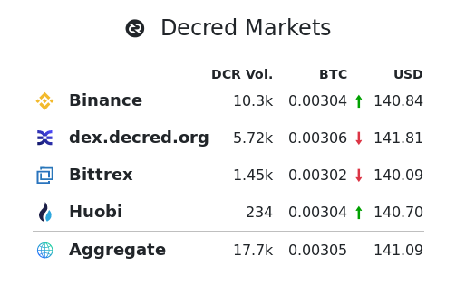
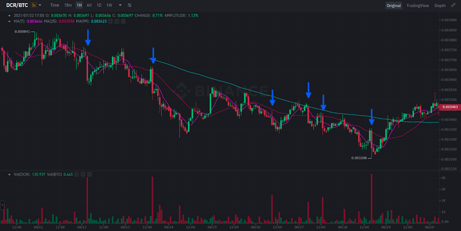

# Decred月报 – 2021年8月

_图片:@saender_

- Politeia v1.1.0 已发布并部署到网页，增加了新功能，包括扩展的元数据和增强的 UI。
- 选票价格最终创下了 321 的历史新高，甚至超过了 Decred 历史上的峰值。
- Decred 软件存储库依旧稳步发展，包括 3 个不同的 DCP（7、8 和 9），关于 DCRDEX，ETH 交易的 Solidity 合约正在测试网上进行审查。

内容：

- [开发进展总结](#development)
- [人员](#people)
- [治理](#governance)
- [网络](#network)
- [生态系统](#ecosystem)
- [外展](#outreach)
- [活动](#events)
- [媒体](#media)
- [市场](#markets)
- [相关外部信息](#relevant-external)

## 开发进展总结

除非另有说明，否则此处报告的工作仅限为“合并到主核心存储库”状态。这意味着这项工作已经完成、审查并集成到高级用户可以[构建和运行](https://medium.com/@artikozel/the-decred-node-back-to-the-source-part-one-27d4576e7e1c)的源代码中，但对于普通用户来说，还不能使用。

<a id="dcrd" />

**[dcrd](https://github.com/decred/dcrd)**

在执行[还原国库支出共识](https://github.com/decred/dcps/blob/master/dcp-0007/dcp-0007.mediawiki)的变化（DCP-7）已经[合并](https://github.com/decred/dcrd/pull/2680)（以下一些[准备工作](https://github.com/decred/dcrd/pull/2679)，以使其更容易审核）。如果投票通过，支出限额将基于国库的历史收入而不是其历史支出，从而解锁使用新的去中心化国库的能力。

[自动选票撤销](https://github.com/decred/dcps/blob/master/dcp-0009/dcp-0009.mediawiki)共识变更 (DCP-9) 的合并工作：

- 添加了一种方法来获取将在下一个区块中[到期](https://github.com/decred/dcrd/pull/2701)的所有选票
- 统一投票和撤销[验证](https://github.com/decred/dcrd/pull/2702)
- 添加了为给定选票创建[撤销](https://github.com/decred/dcrd/pull/2707)tx的功能

其它合并工作：

- [定义](https://github.com/decred/dcrd/pull/2713)为明确的[版本升级](https://github.com/decred/dcps/blob/master/dcp-0008/dcp-0008.mediawiki)的共识变化（DCP-8）
- 优化的[预计算](https://github.com/decred/dcrd/pull/2690)数学值可实现约 10% 的签名验证速度和约 400 KiB 的更小`dcrd`二进制文件
- 重写[NAF 转换](https://github.com/decred/dcrd/pull/2695)以避免所有堆分配并切换到更快的算法，签名验证时间再减少约 1%
- 添加了创建和恢复可花费 coinbase 输出[快照](https://github.com/decred/dcrd/pull/2715)的方法（将允许更有效的测试）
- 在旋转和压缩之前添加了最大[日志文件](https://github.com/decred/dcrd/pull/2711)大小的配置选项

<a id="dcrwallet" />

**[dcrwallet](https://github.com/decred/dcrwallet)**

- 向[`purchaseticket`](https://github.com/decred/dcrwallet/pull/2064)JSON-RPC 请求添加了混合VSP 支持
- 添加了[`processunmanagedticket`](https://github.com/decred/dcrwallet/pull/2075)JSON-RPC 请求以将现有选票分配给用户配置文件中配置的 VSP
- 在钱包数据库中为每张选票添加了 VSP 主机和公钥的[存储](https://github.com/decred/dcrwallet/pull/2068)（允许更有效地检查票费状态）
- 修复了一些重复的地址[监视](https://github.com/decred/dcrwallet/pull/2076)（它在频繁使用的钱包上阻碍了块处理）
- 修复了锁定或关闭钱包时的一些[问题](https://github.com/decred/dcrwallet/pull/2081)
- 修复并改进了 SPV 同步模式下的[重组处理](https://github.com/decred/dcrwallet/pull/2084)

<a id="decrediton" />

**[Decrediton](https://github.com/decred/decrediton)**

- 添加了一个按钮以在 SPV 模式下[撤销](https://github.com/decred/decrediton/pull/3506)选票
- 用一次性[地址发现](https://github.com/decred/decrediton/pull/3532)操作（有自己的间隙限制）替换了间隙限制设置
- [LN 发送](https://github.com/decred/decrediton/pull/3538) 和 [LN 接收](https://github.com/decred/decrediton/pull/3537)页面的新 UI 设计

_Decrediton LN 接收页面_

<a id="politeia" />

**[Politeia](https://github.com/decred/politeia)**

Politeia v1.1.0 已经在 [proposals.decred.org](https://proposals.decred.org/) 上发布和部署。亮点如下：

- 提案作者现在需要在提交提案时填写资金额、开始和结束日期以及域（最近的提案像[这样](https://proposals.decred.org/record/58d9f46)在顶部显示此新数据）
- 合并 `In Discussion` 和 `Voting`标签到一个`Under Review`标签，帮助用户快速查看是否有任何提案正在投票
- 能够看到原始 Markdown
- 能够查看谁审查了提案以及为什么
- 许多 UI/UX 修复和改进
- 电子邮件通知现在受到速率限制，以防止恶意用户触发过多邮件并将 Politeia 标记为垃圾邮件服务器
- 用户数据库移至 MySQL 以删除 CockroachDB 作为依赖项，并且只有一个数据库实例需要管理

有关更多详细信息，请查看[politeia](https://github.com/decred/politeia/releases/tag/v1.1.0) 和 [politeiagui](https://github.com/decred/politeiagui/releases/tag/v1.1.0)存储库中的发行说明。

面向用户的更改合并到 master（v1.1.0 之后）：

- 允许用户[比较](https://github.com/decred/politeiagui/pull/2524)任意两个提案版本
- 立即突出显示评论[投票](https://github.com/decred/politeiagui/pull/2520)但如果服务器请求失败则显示错误
- ~7个错误修复

_Politeia 提案_

后端、内部和命令行更改（v1.1.0 后）：

- 在命令钱包操作之前验证[密码](https://github.com/decred/politeia/pull/1490) `politeiavoter vote`
- 工具输出中可读的[货币](https://github.com/decred/politeia/pull/1488)值`pictl`（例如，当用它提交新提案时）
- 为[登录](https://github.com/decred/politeia/pull/1481)路由添加了 CSRF 保护
- 添加了[计费状态](https://github.com/decred/politeia/pull/1480)（活动、已关闭、已完成）以标记已批准的提案是否可以计费
- 要求在发布或编辑评论时对[额外的数据](https://github.com/decred/politeia/pull/1487)字段进行签名，并且仅允许在`comments`插件中配置的数据（这些字段的目的是`comments`使用新功能扩展插件）
- 允许提案作者发布已批准提案的[更新](https://github.com/decred/politeia/pull/1491)。每次更新都会启动一个新的评论线程，用户可以在其中回复和投票，直到管理员将提案标记为已完成或已关闭。
- 增加测试覆盖率

<a id="vspd" />

**[vspd](https://github.com/decred/vspd)**

- 从其它项目移植[信号](https://github.com/decred/vspd/pull/293)处理改进
- 较小的修复和维护

<a id="dcrlnd" />

**[dcrlnd](https://github.com/decred/dcrlnd)**

- 更新到[最新](https://github.com/decred/dcrlnd/pull/138)的 dcrd 和 dcrwallet
- 添加了一个[脚本](https://github.com/decred/dcrlnd/pull/139)来生成一个用于测试的模拟网络
- 在嵌入式钱包模式中添加了[SPV 支持](https://github.com/decred/dcrlnd/pull/140)（嵌入式钱包模式 + SPV 模式组合允许在没有 dcrd 和 dcrwallet 的情况下运行 dcrlnd）

<a id="dcrdex" />

**[DCRDEX](https://github.com/decred/dcrdex)**

面向用户：

- 彻底改革用户[凭证](https://github.com/decred/dcrdex/pull/1015)系统。每个新的 DEX 帐户的私钥现在来自单个应用程序种子和服务器的公钥。此外，用于加密敏感用户数据的单个应用程序密码被替换为一对密钥，其中“内部”密钥使用“外部”密钥加密。这消除了在更改密码（和外部密钥）时重新加密所有受保护数据的需要。
- 如果提供了正确的应用程序密码，则添加了一个端点以返回[应用程序种子](https://github.com/decred/dcrdex/pull/1149)
- 添加了一个复选框以在会话期间[记住密码](https://github.com/decred/dcrdex/pull/1119)
- 在支付[注册](https://github.com/decred/dcrdex/pull/1135)费之前让用户了解可用的市场和手数
- 允许客户在市场暂停时[取消](https://github.com/decred/dcrdex/pull/1133)订单
- 修复固定[滚动](https://github.com/decred/dcrdex/pull/1142)问题

内部的：

- 在客户端使用[紧凑过滤器](https://github.com/decred/dcrdex/pull/954)来定位交易对手合约赎回，而不是总是拉去区块来检查
- 如果在生成或签署[退款 tx](https://github.com/decred/dcrdex/pull/1166) 时遇到任何问题，请不要广播交易
- 客户端的初始[国际化](https://github.com/decred/dcrdex/pull/1051)支持（在 Go、HTML 和 JS 代码中）
- 自动检查是否需要重新生成[本地化](https://github.com/decred/dcrdex/pull/1167)模板
- 修复了一些关闭[问题](https://github.com/decred/dcrdex/pull/1150)
- 修复和改进的[重组测试](https://github.com/decred/dcrdex/pull/669)

以太坊支持：

- 用于 ETH 交换的 Solidity[智能合约](https://github.com/decred/dcrdex/pull/1019)的初始版本。正如 [自述文件](https://github.com/decred/dcrdex/tree/a7046c670b4f824b7b5e237c9efcecbd8fc5e604/dex/networks/eth/contracts)所说，它在主网上未经测试且不安全，旨在作为ETH 交换概念的证明。这个 PR 产生了很多关于以太坊和合约安全的知识，并带来了重入攻击漏洞的[代码](https://github.com/decred/dcrdex/blob/a7046c670b4f824b7b5e237c9efcecbd8fc5e604/client/asset/eth/rpcclient_harness_test.go#L706)测试。
- 添加交换[gas成本](https://github.com/decred/dcrdex/pull/1157)近似值

这些更改中的大部分是针对 [v0.3 里程碑](https://github.com/decred/dcrdex/milestone/12)的，但有些已向后移植到[v0.2.x](https://github.com/decred/dcrdex/commits/release-v0.2)发布分支。

查看 Depth in Depth [第 42 集](https://www.youtube.com/watch?v=dRjAalxS3r8)，其中 @chappjc 回答了社区关于 DCRDEX 的问题并作为 Decred 开发人员工作。

<a id="dcrandroid" />

**[dcrandroid](https://github.com/planetdecred/dcrandroid)**

合并到[dcrlibwallet](https://github.com/planetdecred/dcrlibwallet)库中（由 dcrandroid、dcrios 和 Godcr 共享）：

- [Politeia](https://github.com/planetdecred/dcrlibwallet/pull/202)投票支持
- 用于获取[未开采](https://github.com/planetdecred/dcrlibwallet/pull/205)选票的过滤器（没有确认的票）
- 获取下一次[票价](https://github.com/planetdecred/dcrlibwallet/pull/204)变化的时间的函数

合并到 dcrandroid:

- 实施[暗模式](https://github.com/planetdecred/dcrandroid/pulls?q=is%3Apr+dark+merged%3A2021-08-01..2021-08-31+sort%3Aupdated-asc)
- 添加了选票的交易[详情](https://github.com/planetdecred/dcrandroid/pull/573)对话框
- 更新[法语](https://github.com/planetdecred/dcrandroid/pull/576)翻译
- [升级](https://github.com/planetdecred/dcrandroid/pull/571)依赖项并迁移到 Kotlin 代码风格
- 修复了“StrandHogg”[漏洞](https://github.com/planetdecred/dcrandroid/pull/581)（恶意应用可能劫持 Android 任务的漏洞）

 

_dcrandroid 隐私和接收暗模式界面_

<a id="dcrios" />

**[dcrios](https://github.com/planetdecred/dcrios)**

- 将最小部署目标提高到[iOS 12](https://github.com/planetdecred/dcrios/pull/816)
- ~2个错误修复

<a id="godcr" />

**[godcr](https://github.com/planetdecred/godcr)**

- 实施[Politeia](https://github.com/planetdecred/godcr/pull/542)投票
- [交易](https://github.com/planetdecred/godcr/pull/582)清单和详细信息的更多信息显示
- 当检测到新的传入交易或提案时添加了桌面[通知](https://github.com/planetdecred/godcr/pull/518)
- 应用内（toast）和操作系统[通知的](https://github.com/planetdecred/godcr/pull/540)新系统
- 显示到下一次[票价](https://github.com/planetdecred/godcr/pull/565)变化的时间
- 定制通知的[stake](https://github.com/planetdecred/godcr/pull/560)交易
- 实现[返回](https://github.com/planetdecred/godcr/pull/557)导航
- 添加了选票数据的[悬停](https://github.com/planetdecred/godcr/pull/488)工具提示
- 引入[LinearLayout](https://github.com/planetdecred/godcr/pull/563)以简化布局代码
- 重构和代码清理
- 约 20 个错误修复

_Godcr 混合过滤器_

<a id="dcrdata" />

**[dcrdata](https://github.com/decred/dcrdata)**

- 迁移到新的[Politeia API](https://github.com/decred/dcrdata/pull/1829)
- 依赖升级和重构，准备发布 v6.0 分支

其它:

- 漏洞赏金计划发布了[更新](https://bounty.decred.org/2021/08/status-update/)：2个漏洞已被修补并公开，其作者已加入[名人堂](https://bounty.decred.org/#hall_of_fame)。
人们

## 人员

祝贺新承包商获得 Decred 承包商许可 (DCC)： [@vibros68](https://github.com/vibros68)!

@raedah接受了权威杂志的有趣[采访](https://medium.com/authority-magazine/the-future-is-now-steven-wagner-of-raedah-group-on-how-their-technological-innovation-will-shake-4f272ced222f)，谈论了各种话题、他的生活经历和 Decred。

> _你能告诉我们你最喜欢的“生活课名言”吗？你能分享一下这与你的生活有什么关系吗？_
> 
> 吉杜克里希那穆提在他的一些书中说，“你不能喝水这个词”，“如果水是干净的，就喝它”。这些是关于现实的简单指示，即单词或想法与事物不同，我们需要能够使用自己的判断来确定事物是否好，而不是寻找一些外部权威来告诉我们什么是真实的、好的或正确的。他讨论了我们是自己生活中权威的来源，而不是将我们的权力交给他人或社会机构。他是最好的上师类型，因为他不想成为任何人的上师。他只是想将他们送走，将他们的权力还给他们。我认识的最好的商业专业人士也这样做。他们的目标不是让公司依赖他们来创​​造工作保障，而是解决问题并使他们的工作自动化，以便不再需要他们的角色。那时，他们可以继续解决下一个挑战。

查看[媒体](#media)部分，了解对 Decred 社区成员的其它新采访。

截至 9 月 1 日的社区统计数据：

- [Twitter](https://twitter.com/decredproject) 粉丝: 48,161 (+575)
- [Reddit](https://www.reddit.com/r/decred/) 订阅: 11,597 (+148)
- [Matrix](https://chat.decred.org/) #general 用户: 522 (+9)
- [Discord](https://discord.gg/GJ2GXfz) 用户: 2,124 (+164)
- [Telegram](https://t.me/Decred) 用户: 2,846 (+13)
- [YouTube](https://www.youtube.com/decredchannel) 订阅: 4,610 (+10), 观看: 194K (+3K)

## 治理

8 月，新[国库](https://dcrdata.decred.org/treasury)收到了价值 176 万美元的 10,942 DCR，8 月的平均汇率为 161.24 美元。845 DCR 用于支付承包商，按 8 月的费率计算价值 136,000 美元，或按 7 月的费率 127.48 美元计算，价值 108,000 美元。截至 9 月 2 日，旧国库和新国库的总余额为 713,371 DCR（1.29 亿美元，合 187.50 美元）。

8 月份发布了两个新提案，它们都在 9 月初开始投票：

- Monde PR提出的第三阶段[提案](https://proposals.decred.org/record/58d9f46)是将 @lindseymmc 的公关工作再延长一年，费用为 42,000 美元。

- 一个[提案](https://proposals.decred.org/record/150cf81)来自 @finstreet21制作一系列有关Decred教育影片在印度市场，$ 9,800拆分三个阶段成本。

7 月份提交的两项提案在 8 月份投票被否决：

- @frizzers 提出 295,000 美元资助一部纪录片的[提案](https://proposals.decred.org/record/ae609f1)被拒绝，批准率为 12.5%，投票率为 67%。

- 资助参与迪拜加密博览会的提案以 37.5% 的批准和 67% 的投票率被拒绝。

有关本月提案的更多详细信息，请参阅 Politeia Digest[第46期](https://blockcommons.red/politeia-digest/issue046/)。

## 网络

**全网算力**: 8月[算力](https://dcrdata.decred.org/charts?chart=hashrate&zoom=krrqjgnz-kt1oo9gz&scale=linear&bin=block&axis=time)以约 316 Ph/s开启，以约 360 Ph/s结束，全月最低为 164 Ph/s，最高为 413 Ph/s。

9 月 1 日矿池[报告](https://miningpoolstats.stream/decred)的算力分布：币印矿池 36%、F2Pool 29%、蚂蚁矿池 16%、BTC.com 8%、Easy2Mine 5%、Luxor 3%、ViaBTC 1.6%、HuobiPool 1.3%、OKEx 0.14%、CoinMine 0.08%，UUPool 0.07%。这些百分比基于已知矿池的 244 Ph/s，不包括来自未知矿工的 ~90 Ph/s。9 月 1 日之前实际开采的 1,000 个区块的分布主要证实了这些数字。

**Staking**: [票价](https://dcrdata.decred.org/charts?chart=ticket-price&zoom=krrqjgnz-kt1oo9gz&axis=time&visibility=true-true&mode=stepped)在120.1-321.6 DCR之间变化，30天的平均价为193.8 DCR（+3.1）。

[锁定量](https://dcrdata.decred.org/charts?chart=ticket-pool-value&zoom=krrqjgnz-kt1oo9gz&scale=linear&bin=block&axis=time)为7.23-8.12百万DCR，这意味着循环供应的54.5-61.1％在参加pos。

票价[下跌](https://www.reddit.com/r/decred/comments/p4drzc/whats_up_with_the_decred_ticket_price/)至 120 DCR，然后飙升至 321.6 DCR 的历史新高。质押参与率也达到了 61.1% 的新 ATH。

**VSP**: 截至 9 月 1 日，~8,100 (-500) 个现场票由[列出](https://decred.org/vsp/)的vspd 服务器管理，~250 (-150) 个由列出的旧 dcrstakepool 服务器管理。11 个旧版 VSP 和 15 个新 VSP 总共管理着 21% (-1.9%) 的票池。未上市但仍处于活动状态的旧版 VSP 管理着 40 张现场票。

**节点**: 根据[dcrextdata](https://dcrextdata.planetdecred.org/nodes)，整个 8 月大约有 205 个可访问节点。

截至 9 月 1 日[快照](https://nodes.jholdstock.uk/user_agents)的节点版本（252 个 dcrd 节点）：v1.6.2 - 56%、v1.6.0 - 14%、v1.6.1 - 12%、v1.7 dev builds - 13%、v1.6 dev builds - 2.4 %，v1.5.2 - 2%，v1.5.1 - 0.4%。

[混合硬币](https://dcrdata.decred.org/charts?chart=coin-supply&zoom=jyefppu5-kub1inpe&bin=day&axis=time&visibility=true-true-true)的份额在 46.1-50.5% 之间变化，并超过了 50% 的里程碑。每日[混合量](https://dcrdata.decred.org/charts?chart=privacy-participation&zoom=krmqf4vr-kt3wbm67&bin=day&axis=time)在200-786K DCR之间变化，也创下新纪录。

在@bochinchero 的最新链上指标[回顾](https://twitter.com/TheBochinchero/status/1433834350353784875)中很好地总结了许多历史新高。

## 生态系统

欢迎使用[synergy-crypto.net](https://vspd.synergy-crypto.net/)的[新](https://github.com/decred/dcrwebapi/pull/147)VSP，收取0.75% 的费用（并额外感谢运行测试网实例）。

以下旧版 VSP 已从公开[列表](https://decred.org/vsp/)中删除：

- [dcr.farm](https://dcr.farm) -自 6 月以来，它的旧版页面一直重定向到[vspd](https://vsp.dcr.farm/)（当时它有32 张现场票）
- [stakey.net](https://stakey.net) - 该页面已替换为 vspd UI，但其[旧 API](https://stakey.net/api/v2/stats)仍在运行并报告剩余的现场票数（截至 9 月 1 日为 38）

raqamiya.net 已关闭其旧版 VSP。关闭程序从 3 月份开始，当时它被退市，并通过电子邮件、网站和March DJ通知用户不要购买任何新门票。随后，Raqamiya 继续对现有门票进行了大约 4 个月的投票，直到 8 月 16 日关闭。一些用户错过了所有通知，并一直将门票分配给这个 VSP，直到最后，导致关闭时有 11 个现场门票。任何旧版 VSP 都可能发生这种情况，因为[dcrstakepool](https://github.com/decred/dcrstakepool)无法拒绝选票注册（与新的 vspd 协议不同）。

对于仍在使用旧版 VSP 的任何人，建议切换到 [vspd](https://decred.org/vsp/) 提供商以避免错过选票的风险，例如由于关闭或 dcrstakepool 停止与即将到来的共识升级合作。截至 9 月 1 日，旧版 VSP 管理的票不到 300 张，占票池的 0.7%。

新的交易所集成：

- Bitfinex[推出](https://twitter.com/bitfinex/status/1423210403774009345)DCR/USD 交易
- Bitcoin.com 交易所[启用](https://twitter.com/BitcoinComExch/status/1423589830672457733)与 BTC、ETH 和 USDT 的DCR 交易

据 @DecredKorea[报道](https://twitter.com/DecredKorea/status/1425751145796956167)，Hotbit Korea 已将其 DCR/KRW 对退市（该对已于2020 年 11 月上线）。

警告：Decred 月报的作者不知道上述任何服务的可信度。在将您的个人信息或资产信任给任何实体之前，请自行研究。

加入我们的[#services](https://chat.decred.org/#/room/#services:decred.org)聊天，关注 Decred 生态系统更新。

## 外展

Monde PR 在其第二个[提案](https://proposals.decred.org/proposals/c81926b)于 7 月结束后缩减了一个月。@l1ndseymm在处理 9 月开始的第三个提案的同时，保持当前的机会向前发展并回应收到的询问。

## E活动

Decred 成为阿根廷天主教大学商学院和比特币阿根廷非政府组织组织的关于加密和区块链技术的教育计划的支持者。由于 Bitcoin Argentina 和我们的[西班牙](https://twitter.com/Decred_ES)外展团队之间过去的联系，Decred 被[邀请](https://matrix.to/#/!clHjlICBEtCtAdTupf:decred.org/$-CkRPUnXB8spWofBTk3nA3UAr2u4ofpCIzaoCJuoUag)，并将包含在营销材料中（以及其它品牌）。在[研讨会](http://uca.edu.ar/es/blockchain-y-criptoactivos)开始于09月08日，将持续10周时间。

## 媒体

精选文章：

- The Suppressor part 1:@tacorevenge 的消耗战([medium](https://medium.com/@tacorevenge/the-suppressor-part-1-war-of-attrition-3081a61b202b))
- 未来就在眼前：Raedah Group 的 Steven Wagner 讲述他们的技术创新将如何改变技术领域 作者 Fotis Georgiadis([medium](https://medium.com/authority-magazine/the-future-is-now-steven-wagner-of-raedah-group-on-how-their-technological-innovation-will-shake-4f272ced222f))
- 您可能从未听说过的最赚钱的加密货币之一，它比 2020 年的低点上涨了 1,300%。Mining-farm 首席执行官 Josh Metnick 解释了加密货币，以及要使用的矿工和矿池。作者：Laila Maidan（[businessinsider.com](https://www.businessinsider.com/profitable-crypto-to-mine-according-to-ceo-mining-farm-navier-2021-8)，付费专区([kind of](https://twitter.com/exitusdcr/status/1429414135582937088))）

> “这是一个高度合法的项目。相对而言，就像在加密时代一样，它已经存在了一段时间。而且有一些聪明、有道德的人参与其中，”梅特尼克说道。

视频：

- Decred in Depth 41 - Stephen Palley + Gabriel Shapiro (Lexnode) + Luke Powell 来自 @elima\_iii ([youtube](https://www.youtube.com/watch?v=9TXoyRv_Z8U))
- Decred in Depth 42 - Jonathan Chappelow + DCRDEX 来自 @elima\_iii ([youtube](https://www.youtube.com/watch?v=dRjAalxS3r8))
- Decred 新闻播报 -  区块链治理在起作用，新的网络高点，令人兴奋的提案等等！来自@Exitus ([youtube](https://www.youtube.com/watch?v=6ifueUAWy_c))
- Decred的票务投票系统 - Decred 基本面 来自 @phoenixgreen ([youtube](https://www.youtube.com/watch?v=LEO0vHdY3gs))
- 税务教育和 Decred 来自 @phoenixgreen ([youtube](https://www.youtube.com/watch?v=-26obfV2e84))
- Decred正在为一件大事热身 来自 @phoenixgreen ([youtube](https://www.youtube.com/watch?v=n6ATfW_vnCg))
- Decred 价格分析 - 2021 年 8 月 4 日 来自 Brave New Coin ([youtube](https://www.youtube.com/watch?v=NOlvAI43VSY))

Chris Burniske 在 7 月份对 Blockworks 的 Jason Yanowitz的《[Original Sins of Crypto](https://www.youtube.com/watch?v=gLbzfZKf_ro&t=1h05m42s)》采访中提到了 Decred：

> Jason:你怎么相信……就像，每个人都是民主的，直到他们获得权力，然后权力腐化。我喜欢 DAO 的概念，我喜欢 DeFi 的概念，但我最大的担忧是，我们是否只是相信这些“DeFi DAO CEO”会去中心化并放弃权力？
> 
> Chris: 这真的取决于 DAO 的起源。并非所有 DAO 都是平等的。这就是我认为 DAO 启动方式的黄金标准仍然是 Decred 的原因。

翻译：

- Decred 月报 2021 年 7 月被[翻译成](https://xaur.github.io/decred-news/)阿拉伯语（@arij、@abdulrahman4）、中文（@Dominic）和西班牙语（@francov_）。感谢所有翻译者！

在我们的[#translations](https://chat.decred.org/#/room/#translations:decred.org)聊天室中分享您的翻译。

## 市场

8 月 DCR 的交易价格在 126.50-181.26 美元 / BTC 0.0032-0.0038 之间。每日平均为 161.24 美元。

dcrdata 现在在 DCRDEX[显示](https://twitter.com/longtermdaily/status/1433148588608004097) BTC/DCR 对的[价格](https://explorer.dcrdata.org/market?chart=candlestick&xc=dcrdex&bin=1d)和[交易量](https://explorer.dcrdata.org/market?chart=volume&xc=dcrdex&bin=1d)历史记录。

_DCRDEX 成交量终于曝光_

一位新的神秘撰稿人@tacorevenge 发表了对 The Suppressor 实体调查的[第一部分](https://medium.com/@tacorevenge/the-suppressor-part-1-war-of-attrition-3081a61b202b)，一些社区成员怀疑实体操纵 DCR 市场。

_奇怪的大批量卖出_

## 相关外部信息

一些美国立法者对共识算法的选择出人意料，并且仅将工作量证明挖掘排除在“经纪人”的定义之外——其中包括“任何（供考虑）负责并定期提供任何实现数字资产转移服务的人” . 这种宽泛的定义受到了批评可能适用于该行业的几乎所有经济参与者，并成为加密游说努力的主题，以用更具体的语言替换该语言，并明确排除所有验证者和软件开发人员。该法案的一个版本得到了一些参议员的支持，以这种方式收紧了措辞，但由于参议院程序，没有考虑任何修正案，具有广泛定义的法案被传递给众议院.

A16Z 是一家在许多加密网络中拥有股份的 VC，已发布其“代币委托计划”。该文件解释了为什么 A16Z 决定委托其投票权（他们持有如此多的代币，否则决策将集中）。它还解释了他们如何选择代表，大约 50% 的代表团是基于大学的组织，其余的则是初创公司和非营利组织。

来自 Flipside 加密的 Uniswap 提案在社区中引起了一些争议，因为它轻松通过了早期的投票，它将使用价值2500 万美元的 UNI 来产生收益，支付给 Flipside 团队以产生“社区支持的分析”。提出的问题之一是，被任命为监督赠款的实体包括将从中受益的人。所有其他分析提供商都对 Flipside 试图让 UNI 为其公司的 8 名全职员工提供资金的尝试不以为然。

NFT 狂热随着LOOT（针对冒险者）下降而达到了新的高度，带有黑色背景的白色文字描述冒险游戏物品的图像很快就以每件 10 ETH 的价格售出。LOOT 背后的想法是，一旦最初确定了物品的范围及其稀缺性，人们就会添加通常与游戏相关的所有方面（物品的视觉表现、统计数据、游戏世界之后使用它）。然而，到目前为止，似乎很少有人注意到激励这项工作，而 LOOT 在现阶段的主要特点似乎是它使持有者有权获得一系列类似的空投。我们是否正在超越“建造它，他们就会来”，“以高价向他们出售一些占位符，一定会有人出现并建造它”？

此外，它看起来就像LOOT降沉重耍花招的人具有专业知识，谁能够保证他们的行李稀有物品。

在涂鸦艺术家的网站显然被黑客入侵以添加一个介绍此 NFT 的页面并链接到其在 Opensea 上的列表后，一个假的 Banksy NFT以 300,000 美元的价格售出。骗子随后出于未说明的原因退还了买家的 ETH。

这就是我们八月的全部内容。在我们的#journal聊天室中分享您对下一期的更新。

## 关于月报

这是Decred Journal的第41期。有关所有问题，镜像和翻译的索引，请参见[这里](https://xaur.github.io/decred-news/)。

来自第三方的大多数信息都是在经过最低限度的健全性检查后直接从源中转过来的。Decred 月报的作者无法验证所有声明。请提防诈骗并自行研究。

感谢 (字母排列):

- 写作和编辑: bee, degeri, richardred
- 评论和反馈: davecgh, l1ndseymm, lukebp, matheusd
- 封面图片: saender
- 资助: Decred stakeholders

## 中文社区

* [社区网址](https://blog.dcrclub.org/)
* [微博](https://www.weibo.com/DecredProject)
* [微信公众号](https://mp.weixin.qq.com/mp/profile_ext?action=home&__biz=Mzg2NTExNzc3MA==&scene=124#wechat_redirect)
* [中文电报群](https://t.me/decred_cn)
* [bilibili频道](https://space.bilibili.com/425519478)
* QQ群号-258412796
