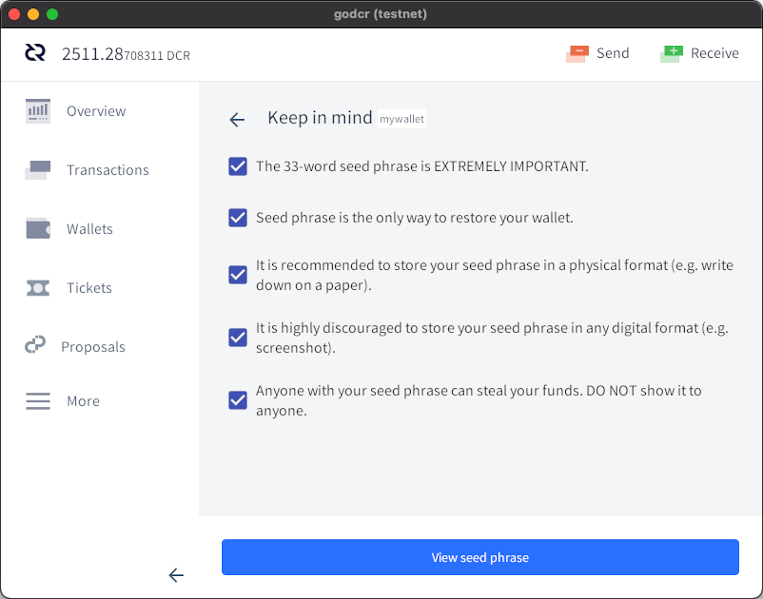
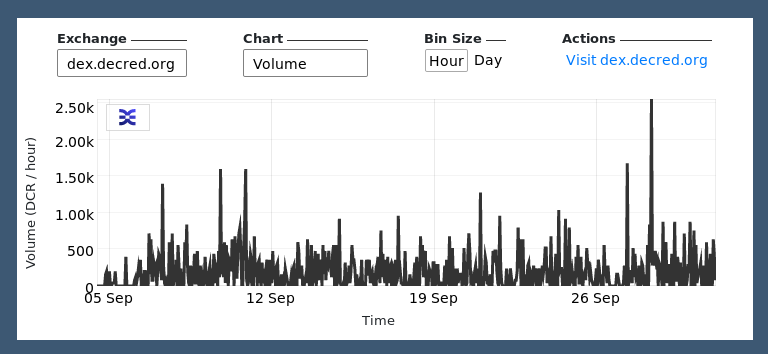

# Decred月报 – 2021 年 9 月

_图片:@saender_

九月亮点：

- DCP-8 和 DCP-9 共识更改的工作已经完成，已准备好等待链上投票。
- Politeia 已更新至 v1.2，添加了在同一个提案的任意两个版本之间进行比较的功能。
- Android 和 iOS 移动钱包在各自的应用商店中推送的新版本。
- GoDCR 达到了第一个功能测试网里程碑，展示了该项目迄今为止取得的成就。

内容：

- [开发进展总结](#development)
- [人员](#people)
- [治理](#governance)
- [网络](#network)
- [生态系统](#ecosystem)
- [外展](#outreach)
- [媒体](#media)
- [市场](#markets)
- [相关外部信息](#relevant-external)

## 开发进展总结

除非另有说明，否则此处报告的工作仅限为“合并到主核心存储库”状态。这意味着这项工作已经完成、审查并集成到高级用户可以[构建和运行](https://medium.com/@artikozel/the-decred-node-back-to-the-source-part-one-27d4576e7e1c)的源代码中，但对于普通用户来说，还不能使用。

<a id="dcrd" />

**[dcrd](https://github.com/decred/dcrd)**

_dcrd 是一个完整的节点实现，为 Decred 的全球点对点网络提供支持。_

版本升级共识更改([DCP-8](https://github.com/decred/dcps/blob/master/dcp-0008/dcp-0008.mediawiki))：

- 新的共识规则已经[部署](https://github.com/decred/dcrd/pull/2716)。一旦激活，未知的交易和脚本版本将被拒绝，直到它们被另一个共识更改明确启用。正如[提案](https://proposals.decred.org/record/3a98861)评论、[DCP-8](https://github.com/decred/dcps/blob/master/dcp-0008/dcp-0008.mediawiki)和最近的[开发讨论](https://github.com/decred/dcrd/pull/2719#issuecomment-909535320)中所解释的那样，此更改将提供更高的网络安全性并允许开发人员编写更多防错代码。
- @davecgh 发布了所有 dcrd 开发工作已完成的[提案更新](https://proposals.decred.org/record/3a98861/comments/21)

自动选票撤销共识更改([DCP-9](https://github.com/decred/dcps/blob/master/dcp-0009/dcp-0009.mediawiki))：

- [准备工作](https://github.com/decred/dcrd/pull/2718)：添加测试、添加议程定义、重新组织代码以适应即将发生的变化。引入了新的事务优先级以确保始终创建自动撤销。优先级的完整列表变为：投票（最高）> 自动撤销> 选票> 常规交易和撤销（最低）。
- [实施](https://github.com/decred/dcrd/pull/2720)了实际的共识变更。一旦激活，区块将需要包含所有在该区块中丢失或过期的选票的撤销。新规则还将允许解锁大约[~200K DCR](https://github.com/decredcommunity/proposals/blob/master/proposals/e2d7b7d/docs/unrevoked-missed-tickets.md)的 DCR，这些DCR卡在未撤销的MISS选票中。
- @rstaudt2 发布了所有 dcrd 开发工作已完成的[提案更新](https://proposals.decred.org/record/e2d7b7d/comments/19)

其它合并工作：

- 实施支出日志[修剪](https://github.com/decred/dcrd/pull/2641)，延迟删除支出日志条目，直到它们不再使用（这是异步索引所需的，这将加快块验证）
- 为地址管理器添加了更多测试并将其从包中[分离](https://github.com/decred/dcrd/pull/2596)出来`wire`，为即将到来的有线协议变化做准备
- 使用散列而不是标签固定[Docker](https://github.com/decred/dcrd/pull/2735)映像和 GitHub[操作](https://github.com/decred/dcrd/pull/2736)，以提高供应链安全性
- 重新设计[Docker](https://github.com/decred/dcrd/pull/2740)支持以提供一个非常注重安全性的图像。它只包含特定于 Decred 的二进制文件（“distroless”）并以非特权用户身份运行它们。新的最终图像大约为 10 MB，而之前版本的大约为 1 GB。
- 代码升级为使用[Go 1.16](https://github.com/decred/dcrd/pull/2722)功能
- 更新的模块[层次](https://github.com/decred/dcrd/pull/2744)图

> 巨大的 dcrd 版本正在酝酿中……包括 3 次共识投票、约 30% 的同步速度等等。([@rstaudt2](https://twitter.com/rstaudt2/status/1443668800679858181))

<a id="dcrwallet" />

**[dcrwallet](https://github.com/decred/dcrwallet)**

_dcrwallet 是命令行和图形钱包应用程序使用的钱包服务器。_

- 允许在购票人下线时处理已购票的[VSP费用](https://github.com/decred/dcrwallet/pull/2058)
- 将默认`ticketbuyer`限制更改为每个区块 1 个最大选票
- 允许[禁用](https://github.com/decred/dcrwallet/pull/2088)帐户发现（允许优化不需要它的客户端，例如 dcrlnd）
- 在轮换之前添加了最大[日志大小](https://github.com/decred/dcrwallet/pull/2077)的配置选项
- 代码升级到[Go 1.16](https://github.com/decred/dcrwallet/pull/2085)和最新的[dcrd](https://github.com/decred/dcrwallet/pull/2087)模块
- 修复了处理和确认VSP 管理的选票的[费用支付](https://github.com/decred/dcrwallet/pull/2083)的一些问题
- 修复多重签名交易的固定[费用计算](https://github.com/decred/dcrwallet/pull/2057)
- 修复了SPV 模式下的潜在[竞赛](https://github.com/decred/dcrwallet/pull/2089)问题

<a id="decrediton" />

**[Decrediton](https://github.com/decred/decrediton)**

_Decrediton 是一款功能齐全的桌面钱包应用程序，集成投票、StakeShuffle 混合、闪电网络、DEX 交易等功能。它可在没有完整区块链的情况下运行（SPV 模式）。_

- 为[LN通道](https://github.com/decred/decrediton/pull/3543)选项卡实施了新的 UI 设计
- 在私人密码更改时更新所有帐户的[密码](https://github.com/decred/decrediton/pull/3546)
- 修复了同步 VSP 费用[支付状态](https://github.com/decred/decrediton/pull/3545)的一些问题
- 修复了[创建](https://github.com/decred/decrediton/pull/3554)钱包时的 3 个错误
- 修复了在新 VSP 模式下显示的旧版 VSP [错误](https://github.com/decred/decrediton/pull/3561)
- 修复了丢失的[导航](https://github.com/decred/decrediton/pull/3558)链接
- 修复了恢复 Trezor 钱包时的[模糊](https://github.com/decred/decrediton/pull/3555)
- 修复了因处理非常大的事务而导致的[崩溃](https://github.com/decred/decrediton/pull/3548)

_Decrediton LN 通道页面_

<a id="politeia" />

**[Politeia](https://github.com/decred/politeia)**

_Politeia 是 Decred 的提案系统。它用于向 Decred 国库申请资金。_

修正版已经登陆上[Politeia](https://proposals.decred.org/)网站！v1.2.0 亮点：

- 已批准提案的提案作者更新
- 比较任意两个提案版本
- 嵌入图像按钮
- 即时评论投票更新
- 提案计费状态，正式确定是否允许计费
- 统一提案状态以简化客户端
- 增加安全性和稳定性

有关更多详细信息，请查看[politeia](https://github.com/decred/politeia/releases/tag/v1.2.0) 和 [politeiagui](https://github.com/decred/politeiagui/releases/tag/v1.2.0)存储库中的发行说明。

面向用户的更改于 9 月合并：

- 集成了新的提案[状态](https://github.com/decred/politeiagui/pull/2609)和设置计费状态的管理能力
- 改进[嵌入图像](https://github.com/decred/politeiagui/pull/2567)的用户体验
- 当用户会话[过期](https://github.com/decred/politeiagui/pull/2541)时显示登录模式
- 添加了[SEO 元标记](https://github.com/decred/politeiagui/pull/2614)以改进搜索结果中的位置并在 Twitter 和 Facebook 上启用漂亮的预览
- 更新的暗模式[切换](https://github.com/decred/politeiagui/pull/2588)设计
- ~18个GUI错误修复和~3个增强功能

后端、内部和命令行更改：

- 添加了统一的[提案状态](https://github.com/decred/politeia/pull/1515)，作为来自不同插件的提案元数据的单一来源，从而消除了客户端的复杂性并减少了服务器的负载。可以通过`pictl proposalsummaries`命令查询新的状态。
- 添加了用于[文件系统检查](https://github.com/decred/politeia/pull/1512)的高级接口，以验证数据完整性并在启动时重建缓存。各个组件的[实现](https://github.com/decred/politeia/issues/1511)将单独完成。
- 启用文件系统检查时为[记录清单](https://github.com/decred/politeia/pull/1520)实现缓存重建`--fsck`
- 添加了将`pictl`投票结果输出保存为 [CSV](https://github.com/decred/politeia/pull/1478) 的选项
- 为服务器和服务器添加了读写[超时](https://github.com/decred/politeia/pull/1505)`politeiad` 和 `politeiawww`
- 重构[`politeiad`](https://github.com/decred/politeia/pull/1507) 和 [`politeiawww`](https://github.com/decred/politeia/pull/1506)服务器中的中间件，并为客户端请求和 WebSocket 消息添加了读取限制
- 将[页面大小](https://github.com/decred/politeia/pull/1518)添加到策略响应中
- 添加文档：[导出API](https://github.com/decred/politeia/pull/1497)文档、[插件](https://github.com/decred/politeia/pull/1519)系统概述和编写[E2E测试](https://github.com/decred/politeiagui/pull/2591)
- 修复了内存[泄漏](https://github.com/decred/politeia/pull/1500)
- ~4 个其它后端错误修复
- 增加后端和端到端 UI 测试覆盖率

_Politeia 暗模式图标。向我们的设计师 @MariaPleshkova 和 @linnutee 致敬！_

<a id="vspd" />

**[vspd](https://github.com/decred/vspd)**

_vspd 是用于运行投票服务提供商的服务器软件。VSP 代表其用户 24/7 投票并且不能窃取资金。_

- 在[部署指南](https://github.com/decred/vspd/blob/master/docs/deployment.md)中添加了[架构图](https://github.com/decred/vspd/pull/296)
- 更新了对 dcrd [错误](https://github.com/decred/vspd/pull/295)的处理
- 测试中更可靠的值[比较](https://github.com/decred/vspd/pull/294)

<a id="dcrpool" />

**[dcrpool](https://github.com/decred/dcrpool)**

_dcrpool 是用于运行矿池的服务器软件。_

- 升级为使用[Go 1.16](https://github.com/decred/dcrpool/pull/335)功能
- 修复了从链上[重组](https://github.com/decred/dcrpool/pull/336)的区块的处理

<a id="dcrlnd" />

**[dcrlnd](https://github.com/decred/dcrlnd)**

_dcrlnd 是 Decred 的闪电网络节点软件。LN 支持即时和低成本的交易。_

- 添加了一个开关来保存[内存配置文件](https://github.com/decred/dcrlnd/pull/144)

<a id="dcrdex" />

**[DCRDEX](https://github.com/decred/dcrdex)**

_DCRDEX 是一个去信任交易的非托管交易所，由原子交换提供支持。_

面向用户：

- 添加了历史[烛台图表](https://github.com/decred/dcrdex/pull/1208)
- 识别[`rpcconnect`](https://github.com/decred/dcrdex/pull/1206)比特币配置参数

_DCRDEX 烛台图。不是投资建议。_

后端和内部变化：

- 添加了用于支付DCR 以外[资产](https://github.com/decred/dcrdex/pull/1202)的注册费的基础设施，在 BTC 中实施了注册费
- 重构以准备[Bitcoin SPV](https://github.com/decred/dcrdex/pull/1089)支持
- 实施[速率限制](https://github.com/decred/dcrdex/pull/1192)以防止网络攻击
- 优化从种子[恢复](https://github.com/decred/dcrdex/pull/1183)帐户
- 简化改变的过程[批量](https://github.com/decred/dcrdex/pull/1212)（最低交易量）
- 在流程中[更早地](https://github.com/decred/dcrdex/pull/1201)发现账户（以支持多资产费用）
- 更改钱包设置时对钱包[所有权](https://github.com/decred/dcrdex/pull/1193)的简化检查
- 添加了[`usermatches`](https://github.com/decred/dcrdex/pull/1213)用于检索匹配数据并将其保存为 CSV 的命令行应用程序

努力实现国际化：

- 向Web 客户端 UI添加了[翻译](https://github.com/decred/dcrdex/pull/1127)支持
- 改进的[通知](https://github.com/decred/dcrdex/pull/1197)翻译系统
- 添加了一个`dexc`开关以即时重新翻译模板（允许更快的迭代）
- 添加了[葡萄牙语](https://github.com/decred/dcrdex/pull/1185)和[中文](https://github.com/decred/dcrdex/pull/1207)翻译

_DCRDEX 中文翻译预览(初始翻译版 最新版已提交)_

对以太坊支持的内部变化：

- 添加了[验证](https://github.com/decred/dcrdex/pull/1203)部署在以太坊网络上的掉期合约的工具（可用于检测合约的意外变化）
- 添加了[交易](https://github.com/decred/dcrdex/pull/1215)在内存池中时的解码和验证（允许在挖掘格式错误的 tx 之前快速失败）
- 实现了对钱包可能放置的[最大订单](https://github.com/decred/dcrdex/pull/1184)的估计

<a id="dcrandroid" />

**[Decred Wallet (Android)](https://github.com/planetdecred/dcrandroid)**

Decred Wallet v1.6.1 已在[Google Play Store](https://play.google.com/store/apps/details?id=com.decred.dcrandroid.mainnet)商店发布！

注重隐私的用户现在还可以直接从[GitHub 版本](https://github.com/planetdecred/dcrandroid/releases/tag/v1.6.1)中获取已签名的 APK 。

9月合并：

- 添加了用于选择应用[主题](https://github.com/planetdecred/dcrandroid/pull/582)的设置选项
- 允许使用[空](https://github.com/planetdecred/dcrandroid/pull/585)密码尝试解锁钱包

合并到[dcrlibwallet](https://github.com/planetdecred/dcrlibwallet)库中（由 Android/iOS 钱包和 GoDCR 共享）：

- 添加了各种数据查询以支持多钱包[抵押](https://github.com/planetdecred/dcrlibwallet/pull/206)概览

查看新的移动钱包[提案](https://proposals.decred.org/record/6db3c4e)，了解 2021-2022 年的发展路线图。

<a id="dcrios" />

**[Decred Wallet (iOS)](https://github.com/planetdecred/dcrios)**

Decred Wallet v1.6.1 已在[App Store](https://apps.apple.com/us/app/decred-wallet/id1462247643)上线！

9月合并：

- 实施[暗模式](https://github.com/planetdecred/dcrios/pull/812)
- [通知](https://github.com/planetdecred/dcrios/pull/853)用户帐户一旦创建就不能删除
- 允许使用[空](https://github.com/planetdecred/dcrios/pull/827)密码尝试解锁钱包
- ~5 个错误修复和 ~2 个 UI 调整

_Decred Wallet (iOS) 暗概览_

<a id="godcr" />

**[GoDCR](https://github.com/planetdecred/godcr)**

_GoDCR 是一款轻量级桌面钱包应用程序，集成了质押、隐私和 Politeia 浏览功能。_

第一个测试网构建[可供](https://twitter.com/planetdecred/status/1441164793470087187)预览！从[GitHub 版本](https://github.com/planetdecred/godcr/releases)下载它并验证签名。如果您打算寻找错误，建议从最新[源](https://github.com/planetdecred/godcr)构建以修复所有最近的错误。

面向用户的更改合并：

- 将种子备份流程拆分为多个[步骤](https://github.com/planetdecred/godcr/pull/587)
- 加入["高级模式"](https://github.com/planetdecred/godcr/pull/614)链接发送页面，允许手动选择币在交易中花（此隐私功能也称为是["硬币控制"](https://bitcoin.design/guide/payments/send/coin-selection/#manual-coin-selection-aka-coin-control)）
- 为众多[小部件](https://github.com/planetdecred/godcr/pull/586)添加了[悬停](https://github.com/planetdecred/godcr/pull/624)效果
- 在概览中显示[重新扫描](https://github.com/planetdecred/godcr/pull/629)进度
- 用于[创建](https://github.com/planetdecred/godcr/pull/622)钱包和帐户的改进 UX
- 允许通过单击外部关闭[下拉菜单](https://github.com/planetdecred/godcr/pull/616)
- 改进了 Markdown [表格](https://github.com/planetdecred/godcr/pull/529)的渲染
- 重构的[选票](https://github.com/planetdecred/godcr/pull/567)获取和显示
- 语言和货币选择[模式](https://github.com/planetdecred/godcr/pull/626)优化用户体验
- 添加了[西班牙](https://github.com/planetdecred/godcr/pull/521)语翻译
- 修复了更高分辨率的[模糊](https://github.com/planetdecred/godcr/pull/618)图标
- ~7 个其他 UX 调整和 ~17 个错误修复

内部和开发人员更改：

- 在[FreeBSD](https://github.com/planetdecred/godcr/pull/627)上固定构建
- 添加了[makefile](https://github.com/planetdecred/godcr/pull/628)来管理目标操作系统构建
- 应用程序二进制文件中的[嵌入](https://github.com/planetdecred/godcr/pull/620)资产

_GoDCR 种子教育_

进行中：

- [DEX](https://github.com/planetdecred/godcr/pull/637)集成（基于dcrlibwallet 中的基础支持）

查看第二个[GoDCR提案](https://proposals.decred.org/record/f7d9fc8)以获取状态更新和 2021-2022 路线图。

<a id="dcrdata" />

**[dcrdata](https://github.com/decred/dcrdata)**

_dcrdata 是 Decred 区块链和链下数据（如 Politeia 提案、市场等）的浏览器。_

面向用户的变化：

- 在[市场](https://github.com/decred/dcrdata/pull/1854)页面上实施 DCRDEX烛台图表
- 在 tx 页面上显示交易和脚本[版本](https://github.com/decred/dcrdata/pull/1863)
- 添加了对[Pay-to-Pubkey](https://github.com/decred/dcrdata/pull/1871) (P2PK)地址类型的支持
- 恢复桌面[通知](https://github.com/decred/dcrdata/pull/1866)
- 为更漂亮的搜索结果和社交媒体预览添加了[SEO元标记](https://github.com/decred/dcrdata/pull/1870)
- ~2个错误修复

内部变化：

- 切换到新的[trylock](https://github.com/decred/dcrdata/pull/1868)实现
- 减少对dcrd 的 RPC 包的[依赖](https://github.com/decred/dcrdata/pull/1855)
- 升级到最新的[dcrd](https://github.com/decred/dcrdata/pull/1849)
- 删除了废弃的[notify.js](https://github.com/decred/dcrdata/pull/1867)依赖项

提示：可以在[tip.dcrdata.org](https://tip.dcrdata.org/)上访问dcrdata的前沿开发版本。

<a id="dcrdevdocs" />

**[dcrdevdocs](https://github.com/decred/dcrdevdocs)**

_dcrdevdocs 是 Decred[开发人员文档](https://devdocs.decred.org/)的源代码。_

- 添加了[暗模式](https://github.com/decred/dcrdevdocs/pull/97) （当然）
- 删除[内联 HTML](https://github.com/decred/dcrdevdocs/pull/98)（有助于检测断开的链接）
- 更新的 MkDocs 和 Python [版本](https://github.com/decred/dcrdevdocs/pull/99)

其它：

- [Bug赏金计划](https://bounty.decred.org/)获得了两个范围 更新：用 vspd 替换了 dcrstakepool，删除了 dcrdocs，并阐明了 atomicswap 的规则。

## 人员

欢迎新的首次贡献者的代码合并到 master：@naveensrinivasan ([dcrd](https://github.com/decred/dcrd/commits?author=naveensrinivasan))！

截至10月2日的社区统计数据：

- [Twitter](https://twitter.com/decredproject)粉丝: 48,673 (+512)
- [Reddit](https://www.reddit.com/r/decred/)订阅: 11,954 (+357)
- [Matrix](https://chat.decred.org/) #general用户: 535 (+13)
- [Discord](https://discord.gg/GJ2GXfz)用户: 2,077 (-47)
- [Telegram](https://t.me/Decred)用户: 2,909 (+63)
- [YouTube](https://www.youtube.com/decredchannel)订阅: 4,610 (+0), 观看量: 196K (+2K)

## 治理

9月份，新[国库](https://dcrdata.decred.org/treasury)收到了价值 140 万美元的 10,274 DCR，9 月份的平均利率为 139.56 美元。590 DCR 用于支付承包商，按 9 月的费率计算价值 82,000 美元，或按8月的 161.24 美元的计费率计算价值 95,000 美元。截至 10 月 2 日，[旧国库](https://dcrdata.decred.org/address/Dcur2mcGjmENx4DhNqDctW5wJCVyT3Qeqkx)和[新国库](https://dcrdata.decred.org/treasury)的总余额为 723,528 DCR（8,350 万美元，合 115.45 美元）。

@raedah 提交了两项新提案，要求为[GoDCR](https://proposals.decred.org/record/f7d9fc8)和[移动钱包](https://proposals.decred.org/record/6db3c4e)重新提供资金。

选民参与度达到了新的高度，本月的两个提案的投票率均高于之前的记录水平。

- Monde的公关[提案](https://proposals.decred.org/record/58d9f46)以 97.5% 的批准率和 75% 的投票率获得批准。
- 针对印度市场的资助的教育视频系列[提案](https://proposals.decred.org/record/150cf81)，从@ finstreet21，有45％的审批和77％的投票率被拒绝。

期待已久的提案[作者更新](https://github.com/decred/politeia/issues/1473)功能现已在 Politeia 上线，并且已被两个开发[提案](https://proposals.decred.org/record/e2d7b7d)用于报告进度。

有关本月提案的更多详细信息，请参阅 Politeia Digest第 [46](https://blockcommons.red/politeia-digest/issue046/) 期和第 [47](https://blockcommons.red/politeia-digest/issue047/) 期。

## 网络

**算力**：9 月份的[算力](https://dcrdata.decred.org/charts?chart=hashrate&zoom=kszlo86g-ku72gu79&scale=linear&bin=block&axis=time)开启为~355 Ph/s，结束为~228 Ph/s，在整个月内最低为 190 Ph/s，最高为 449 Ph/s。

10 月 1 日矿池[报告](https://miningpoolstats.stream/decred)的算力分布：矿池 36%、F2Pool 25%、AntPool 22%、BTC.com 5%、ViaBTC 5%、Luxor 3%、HuobiPool 1%、CoinMine 0.15%、OKEx 0.13%。在 10 月 1 日之前实际开采的 1,000 个区块的分布确认了报告的哈希率。

**Staking**: [票价](https://dcrdata.decred.org/charts?chart=ticket-price&zoom=kszlo86g-ku72gu79&axis=time&visibility=true-true&mode=stepped)192.8-210.8 DCR之间变化，具有30天的平均在199.4 DCR（5.6）。

该[锁定](https://dcrdata.decred.org/charts?chart=ticket-pool-value&zoom=kszlo86g-ku72gu79&scale=linear&bin=block&axis=time)为7.69-8.16百万DCR，这意味着循环供应的57.7-61.1％参加在质押。

票价似乎在两个极端之间达到了一个相对稳定的水平。

**VSP**: 在 10 月 1 日，大约 7,600 (-500) 个现场选票由列出的vspd 服务器管理，大约 220 (-30) 个由列出的旧 dcrstakepool 服务器管理。8 个旧版 VSP 和 15 个新 VSP 总共管理着 19% (-2%) 的选票池。未列出但仍处于活动状态的旧版 VSP 管理着 29 (-11) 张现场选票。

**节点**: 根据[dcrextdata](https://dcrextdata.planetdecred.org/nodes)，整个 9 月大约有 204 个可访问节点。

截至 10 月 1 日[快照的](https://nodes.jholdstock.uk/user_agents)节点版本（257 个 dcrd 节点）：v1.6.2 - 55%、v1.6.0 - 13%、v1.6.1 - 12%、v1.7 dev builds - 14%、v1.6 dev builds - 2.7 %，v1.5.2 - 2%，v1.5.1 - 1.2%。

[混合硬币](https://dcrdata.decred.org/charts?chart=coin-supply&zoom=jza9l4a5-kuoqy2o0&bin=day&axis=time&visibility=true-true-true)的份额在 50.3-52.2% 之间变化，并创下历史新高，而混合未使用币的总和突破了 700 万大关。

每日[混合量](https://dcrdata.decred.org/charts?chart=privacy-participation&zoom=jza9l4a5-kuoqy2o0&bin=day&axis=time)在 240-550K DCR 之间变化。

## 生态系统

建议 Matrix 用户升级他们的客户端（最值得注意的是 Element）以修补9 月 13 日披露的安全[漏洞](https://matrix.org/blog/2021/09/13/vulnerability-disclosure-key-sharing/) 。可以从易受攻击的联系人处读取发送到该帐户的加密消息。该披露指出，“最大的风险是位于包含恶意服务器的加密房间中的用户。恶意服务器的管理员可能会试图冒充用户的设备，以监视该房间内易受攻击的客户端发送的消息。”。作为额外的安全措施，您可以查看活动会话并删除任何过时或可疑的会话。

旧版[decredvoting.com](https://decredvoting.com/)已从[VSP列表](https://decred.org/vsp/)中删除，以方便用户迁移到新的vspd 系统。投票钱包仍然在线投票剩余的票（截至 10 月 1 日为 9 票）。Decred Voting自 2018 年开始服务，以开发高级功能而闻名，例如投票票上的电子邮件通知和自定义票务分析仪表板，并支持小持有者接受票务拆分和功能方面的教育，使其更易于使用。

对于仍在使用旧版 VSP 的任何人，建议切换到[vspd提供商](https://decred.org/vsp/)以避免错过门票的风险，例如，如果旧版 VSP 关闭或停止与即将到来的共识升级一起工作。截至 10 月 1 日，所有旧版 VSP 管理不到 250 张票或票池的 0.6%。

警告：Decred 月报的作者不知道上述任何服务的可信度。在将您的个人信息或资产信任给任何实体之前，请自行研究。

加入我们的[#services](https://chat.decred.org/#/room/#services:decred.org)聊天，关注 Decred 生态系统更新。

## 外展

r/decred 针对新人的置顶帖子已更新：欢迎来到[欢迎来到 Decred：Money Evolved](https://www.reddit.com/r/decred/comments/pqsmgf/welcome_to_decred_money_evolved/)。

@davecgh 为我们提供了一个新的梦幻般的[Decred演讲](https://www.reddit.com/r/decred/comments/ppmkdm/opinions_on_long_term_value_of_decred_not_asking/hd5kvp0/)，回答了 Decred 的长期价值。推特版本在[这里](https://twitter.com/rstaudt2/status/1443257842920734727)。

Monde PR 九月份的成就：

- 公关[提案](https://proposals.decred.org/record/58d9f46)于 9 月 14 日通过
- 更新了公关日历以包括即将发布的公告和公关活动
- 将 Decred 投放到两个公关机会
- 获得两次媒体采访

获得以下新闻文章：

- @lukebp 接受了[Cigars加密播客](https://www.cigarsandcrypto.com/episode-175-luke-powell-of-the-decred-project/)的采访，涵盖了 Decred 的所有内容

## 媒体

精选文章：

- Decred 区块链分析 - @richardred ([blockcommons.red](https://blockcommons.red/post/dcr-on-chain-3/)) 的第 3 部分- 探索通过将地址聚类应用于特定区块高度的池中的所有票证可以找到哪些见解。注意：结果还有几个问题需要解决。
- @richardred ([blockcommons.red](https://blockcommons.red/publication/clustering-deep-dive/))深入研究 Decred 地址集群- 专门针对集群挑战的子报告，包括许多图表，显示不同集群（用户）的投票行为，以及集群出现问题时的情况.
- Andrey Sergeenkov ([coinmarketcap.com](https://coinmarketcap.com/alexandria/article/a-deep-dive-into-how-the-top-daos-work))深入探讨前 10 名 DAO 的运作方式

视频：

- 抗分叉 - Decred Fundamentals 来自 @phoenixgreen ([youtube](https://www.youtube.com/watch?v=P2LrIcF_8qw))
- Decred 分叉如何抵抗？- Decred Fundamentals @phoenixgreen ([youtube](https://www.youtube.com/watch?v=pmQiU3zycU0))
- Decred 深度 Ep。43 - Chris Dannen + 设计思维 + Decred 的未来 @elima_iii ([youtube](https://www.youtube.com/watch?v=Cj6PmMza9RQ))
- Decred 价格分析 - 2021 年 9 月 15 日，Brave New Coin ([youtube](https://www.youtube.com/watch?v=qOpLpdBCMI4))

音频：

- Cigars和加密货币 175 - Decred 项目的Luke Powell ([cigarsandcrypto.com](https://www.cigarsandcrypto.com/episode-175-luke-powell-of-the-decred-project/))
- @phoenixgreen 的 Decred Society 系列已在[Apple播客](https://podcasts.apple.com/us/podcast/decred-society/id1586826872)上上线。

翻译：

- Decred新闻播报 八月-在中国（@Dominic），就像中国的视频平台发布[Bilibili](https://www.bilibili.com/video/BV1QA411c77W)，[Weibo](https://weibo.com/6824123103/KvXMCaDEW)和[WeChat](https://mp.weixin.qq.com/s/l1RO1Mkb9LNQK2Z2x1mkyw)
- Decred Journal 2021 年 8 月已[翻译成](https://xaur.github.io/decred-news/)阿拉伯语（@arij、@abdulrahman4）、中文（@Dominic）和西班牙语（@francov_）。感谢所有翻译人员的陪伴！

在我们的[#translations](https://chat.decred.org/#/room/#translations:decred.org)聊天室中分享您的翻译。

_如果这就是链分析的样子，我想换工作（@bee）_

## 市场

9 月 DCR 的交易价格在 96.14-185.79 美元/BTC 0.0023-0.0038 之间。平均每日交易价格为 139.56 美元。

_DCRDEX 9 月交易量_

## 相关外部信息

Sushi 的 Miso 应用程序被利用来窃取 NFT 降价的收益（Jay Pegs Auto Mart 为 Kia Sedonas 提供 300 万美元）。攻击者（通过使用 ENS 域）被识别为 Sushi 开发人员，他在前端插入了代码，将资金发送到他们自己的地址。资金随后被退回。

Compound DeFi 应用程序部署了新的智能合约，以意想不到的方式赠送了价值 8000 万美元的 COMP 代币。创始人罗伯特·莱什纳（Robert Leshner）在最初暗示不归还代币的人可能会将他们的详细信息传递给税务机关后，要求收件人将代币寄回，并将其描述为道德困境。这个故事的一个有趣方面是问题很快就被发现了，但是由于更改合同需要一个治理过程，因此无法部署快速修复程序，所有易受攻击的资金都被耗尽了。

Coinbase 用户已被利用，在攻击者利用 Coinbase 的 SMS 两因素恢复过程中的漏洞绕过此保护措施并提取受害者的资金后，似乎有大约 6,000 名登录详细信息在其他地方被泄露的用户的 Coinbase 帐户遭受了损失. 在给客户的一封通知信中，Coinbase 表示该漏洞已得到修复，所有受影响的客户都将获得补偿。这是继夏季对Coinbase 客户服务的普遍不满之后产生的。

7 月推出的《数字资产市场结构和投资者保护法》继续受到关注和讨论，表明将得到立法者的认真考虑。拟议的法案是解决数字资产的最广泛的立法之一，将阐明不同类型的资产如何属于不同执法机构的权限。拟议的证券定义将侧重于发行（公司）实体的股权或投票权，不包括对区块创建等区块链事务的投票。还有一个方面，即为未完成的产品销售代币，其生产将由代币销售（即 ICO 模式）提供资金将被视为证券。未经财政部长批准，不得创建或使用稳定币，美联储将获得发行美国中央银行数字货币的权力。

这就是九月的全部。在我们的#journal聊天室中分享您对下一期的更新。

## 关于月报

这是Decred Journal的第41期。有关所有问题，镜像和翻译的索引，请参见[这里](https://xaur.github.io/decred-news/)。

来自第三方的大多数信息都是在经过最低限度的健全性检查后直接从源中转过来的。Decred 月报的作者无法验证所有声明。请提防诈骗并自行研究。

感谢 (字母排列):

写作和编辑：bee、degeri、l1ndseymm、richardred
评论和反馈：davecgh、lukebp
封面图片：saender
资金：Decred 利益相关者

## 中文社区

* [社区网址](https://blog.dcrclub.org/)
* [微博](https://www.weibo.com/DecredProject)
* [微信公众号](https://mp.weixin.qq.com/mp/profile_ext?action=home&__biz=Mzg2NTExNzc3MA==&scene=124#wechat_redirect)
* [中文电报群](https://t.me/decred_cn)
* [bilibili频道](https://space.bilibili.com/425519478)
* QQ群号-258412796
