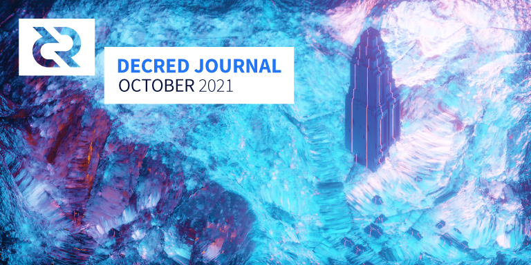
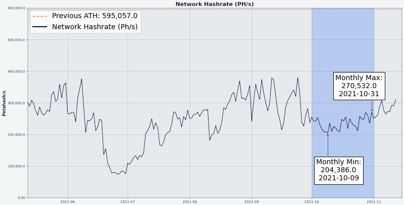

# Decred月报 – 2021 年 10 月

_图片: @saender_

十月亮点：

- 恭喜Politeia 创建的第三个年头，并迎来了又一个繁忙的开发提案月。
- 来自@raedah 的移动钱包提案又获得了一年的资助。
- GoDCR 提案被拒绝，正在准备重新修订提案。开发也正在继续。
- DCRDEX 最新的更改使得可以在 BTC 中支付注册费并使用内置的 SPV 钱包而无需运行比特币全节点。

内容：

- [开发进展总结](#development)
- [人员](#people)
- [治理](#governance)
- [网络](#network)
- [生态系统](#ecosystem)
- [外展](#outreach)
- [媒体](#media)
- [市场](#markets)
- [相关外部信息](#relevant-external)

## 开发进展总结

除非另有说明，否则此处报告的工作仅限为“合并到主核心存储库”状态。这意味着这项工作已经完成、审查并集成到高级用户可以[构建和运行](https://medium.com/@artikozel/the-decred-node-back-to-the-source-part-one-27d4576e7e1c)的源代码中，但对于普通用户来说，还不能使用。

<a id="dcrd" />

**[dcrd](https://github.com/decred/dcrd)**

_dcrd 是一个完整的节点实现，为 Decred 的全球点对点网络提供支持。_

合并更改：

- 索引（交易、地址、存在地址）的更新已[异步进行](https://github.com/decred/dcrd/pull/2219)，以加快区块验证和连接代码的关键路径。它允许更快的投票传播，并有助于为其它优化、同步模型和最终更好的数据损坏恢复机制铺平道路。
- 简化为仅使用一个最新的[检查点](https://github.com/decred/dcrd/pull/2763)，因为标头优先同步不再需要中间检查点
- 提高`txscript`封装[测试](https://github.com/decred/dcrd/pull/2757)的一致性和清晰度
- 修复了在链重组期间当他们的区块[断开](https://github.com/decred/dcrd/pull/2768)时自动撤销票证的处理
- 修复了对等地址管理中的数据[竞争](https://github.com/decred/dcrd/pull/2758)
- 固定[`findcheckpoint`](https://github.com/decred/dcrd/pull/2759)和[`addblock`](https://github.com/decred/dcrd/pull/2760)工具
- [libFuzzer](https://llvm.org/docs/LibFuzzer.html)支持已添加到 dcrd 的[连续模糊](https://github.com/degeri/dcrd-continuous-fuzz)测试套件中

<a id="dcrwallet" />

**[dcrwallet](https://github.com/decred/dcrwallet)**

_dcrwallet 是命令行和图形钱包应用程序使用的钱包服务器。_

- SPV 模式下的实现[`getblockheader`](https://github.com/decred/dcrwallet/pull/2098) 和 [`getcurrentnet`](https://github.com/decred/dcrwallet/pull/2102)方法（供 DCRDEX 使用）
- 添加[`spv`](https://github.com/decred/dcrwallet/pull/2094)字段到`walletinfo`结果以区分同步模式
- 固定SPV 模式下的[同步丢失](https://github.com/decred/dcrwallet/pull/2099)

<a id="decrediton" />

**[Decrediton](https://github.com/decred/decrediton)**

_Decrediton 是一款功能齐全的桌面钱包应用程序，具有集成投票、StakeShuffle 混合、闪电网络、DEX 交易等功能。它在有或没有完整区块链的情况下运行（SPV 模式）。_

面向用户的变化：

- 在[闪电网络概览](https://github.com/decred/decrediton/pull/3551)选项卡上实施了新的 UI 设计。Wallet、Network 和 Watchtowers 选项卡已分组在新引入的高级选项卡下。
- 钱包[模式](https://github.com/decred/decrediton/pull/3534)的新 UI 设计，增加了密码可见性切换
- 添加了在自动购票中使用[随机 VSP](https://github.com/decred/decrediton/pull/3560) 的功能（具有可配置的最高费用）
- 自动为新钱包启用新的[每个账户](https://github.com/decred/decrediton/pull/3579)加密
- 改进了[VSP选择器](https://github.com/decred/decrediton/pull/3563)的可用性
- ~13 个bug修复

内部的：

- 通过[libdexc](https://github.com/decred/decrediton/pull/3549)更新 DEX 集成以利用即将推出的 0.3 功能（本地化 UI、从种子恢复和发现现有帐户）
- 更新到[Electron 15](https://github.com/decred/decrediton/pull/3571)
- 添加了用于[翻译](https://github.com/decred/decrediton/pull/3569)字符串的新 GUI 工具和社区翻译人员[指南](https://github.com/decred/decrediton/blob/master/app/i18n/community_translators.md)
- [帐户](https://github.com/decred/decrediton/pull/3577)视图的自动化测试

_Decrediton 闪电网络概览_

<a id="politeia" />

**[Politeia](https://github.com/decred/politeia)**

_Politeia 是 Decred 的提案系统。它用于向 Decred 国库申请资金。_

面向用户的变化：

- 添加了一种标准方式来显示任何状态更改。审查或放弃提案的管理员与他们给出的状态更改原因一起显示。
- 支持[多种](https://github.com/decred/politeiagui/pull/2629)计费状态更改。默认情况下只允许单个计费状态更改（从活动到已完成或已关闭），但它是一个可配置的设置。如果管理员出错，系统管理员可以临时更新设置以更正错误。也可以暂时[禁用](https://github.com/decred/politeia/pull/1533)状态更改。
- 改进和规范了[身份错误](https://github.com/decred/politeiagui/pull/2623)。现在，只要用户尝试将数据写入 Politeia，而没有在浏览器中加载其活动身份，就会显示相同的错误。错误消息定向到用户详细信息页面以解决问题。
- 修复了多条[评论导航](https://github.com/decred/politeiagui/pull/2638)UX 问题：过滤首选项丢失、返回按钮无法正常工作、单个线程加载缓慢、UI 闪烁
- ~5个其它bug修复

在更改`politeiavoter`命令行工具：

- 改变了[涓流](https://github.com/decred/politeia/pull/1556)方法（缓慢发送选票）的方法。以前它以随机时间间隔按顺序发送选票。这已被证明是脆弱的，因为一个缓慢/失败的发送延迟了所有其他投票。新方法使用独立的并行投票过程，这些过程在随机时间开始并且不会相互影响，使涓流更加稳健。
- 如果在投票结束前有足够的[额外时间](https://github.com/decred/politeia/pull/1542)无法完成投票，则添加了一个中止选项。它会提醒用户调整参数，以便有足够的时间（默认为 12 小时）来重试任何失败的投票，这可能是由于连接不良或 Tor 造成的。

后端和内部变化：

- 添加了用于获取计费[状态更改](https://github.com/decred/politeia/pull/1526)的API
- 允许[批量](https://github.com/decred/politeia/pull/1535)获取账单状态变化
- 对[页面大小](https://github.com/decred/politeiagui/pull/2622)使用服务器策略
- 添加的数据完整性检查[`ticketvote`](https://github.com/decred/politeia/pull/1531) 和 [`comments`](https://github.com/decred/politeia/pull/1544)插件
- 添加了一个新`pictl`命令来测试 [RFP流程](https://github.com/decred/politeia/pull/1551)
- ~4个bug修复

重构以准备[用户层重写](https://github.com/decred/politeia/issues/1479)（[2021 Q3](https://proposals.decred.org/record/91cfcc8)提案的最大工作量）：

- 对politeiawww 代码库进行了重组，将遗留API 移到一个[`legacy`](https://github.com/decred/politeia/pull/1523)包中。这将更容易重写用户层以使用插件架构并允许水平扩展。
- 提取[`logger`](https://github.com/decred/politeia/pull/1527)包以允许插件配置其日志记录并成为独立的
- 提取的[`websockets`](https://github.com/decred/politeia/pull/1529)包（将使扩展服务器更容易）
- 将[配置](https://github.com/decred/politeia/pull/1536)处理提取到自己的包中，并分离出遗留 API 的设置，以便将来更容易删除
- 将[身份](https://github.com/decred/politeia/pull/1530)处理方法移至更合适的位置
- 添加了一个通用[会话存储](https://github.com/decred/politeia/pull/1555)（将替换没有适当关注点分离的[遗留存储](https://github.com/decred/politeia/pull/1554)）

_Politeia 上没有免费资金_

<a id="vspd" />

**[vspd](https://github.com/decred/vspd)**

_vspd 是用于运行投票服务提供商的服务器软件。VSP 代表其用户 24/7 投票并且不能窃取资金。_

- 更新到最新的[dcrd RPC](https://github.com/decred/vspd/pull/297)版本。由于这次提交，vspd 将停止针对 dcrd v1.6 工作并开始定位`master`分支。
- 允许设置[备用](https://github.com/decred/vspd/pull/287)签名地址以支持使用 Trezor 进行 VSP 质押

<a id="dcrlnd" />

**[dcrlnd](https://github.com/decred/dcrlnd)**

_dcrlnd 是 Decred 的闪电网络节点软件。闪电网络支持即时和低成本的交易。_

- 仅对嵌入式钱包执行[一次](https://github.com/decred/dcrlnd/pull/145)帐户发现（不适用于外部控制的远程钱包）
- 改进了快速[入门文档](https://github.com/decred/dcrlnd/pull/146)并添加了一个新文档，总结了 4 种[操作模式](https://github.com/decred/dcrlnd/blob/master/docs/operation_modes.md)（dcrd 或 SPV 同步、远程或嵌入式钱包）

<a id="dcrdex" />

**[DCRDEX](https://github.com/decred/dcrdex)**

_DCRDEX 是一个去信任交易的非托管交易所，由原子交换提供支持。_

面向用户的变化：

- 重新设计的注册流程以接受DCR以外的[资产](https://github.com/decred/dcrdex/pull/1223)
- 在左侧边栏中添加了当前价格和 24 小时变化的[概览](https://github.com/decred/dcrdex/pull/1232)
- 改进[注册](https://github.com/decred/dcrdex/pull/1234)顺序和表单设计/动画
- 添加了[Bitcoin SPV](https://github.com/decred/dcrdex/pull/1230)支持，无需管理完整的比特币区块链即可与 BTC 进行交易。建立在[Neutrino](https://github.com/lightninglabs/neutrino) 和 [btcwallet](https://github.com/btcsuite/btcwallet)之上（旧投资得到回报！）。
- 从某个日期开始 BTC SPV 钱包[扫描](https://github.com/decred/dcrdex/pull/1249)以节省时间
- 需要["zpub"](https://github.com/decred/dcrdex/pull/1255)扩展公钥，但为方便起见提供从“xpub”转换。这适用于愿意接受 BTC 注册费的服务器运营商。
- ~6个bug修复

内部变化：

- 支持同一个应用种子的多个[HD帐户](https://github.com/decred/dcrdex/pull/1210)，如果初始帐户被暂停，允许注册额外的帐户。此更改还会停用具有随机密钥的旧帐户，以确保所有新帐户都可以从应用程序种子派生。
- 重构客户端 DCR 后端以支持替代[钱包](https://github.com/decred/dcrdex/pull/1227)实现。这将用于将 DCRDEX 集成到 GoDCR。

以太坊支持的进展：

- 实现了几种[后端方法](https://github.com/decred/dcrdex/issues/1154)（[交换](https://github.com/decred/dcrdex/pull/1218)和[赎回](https://github.com/decred/dcrdex/pull/1219)估计、订单[资金](https://github.com/decred/dcrdex/pull/1221)、消息签名等）
- 添加了在同一交易中发起[一批](https://github.com/decred/dcrdex/pull/1251)多次掉期的功能（节省gas）
- 从 DEX 应用程序种子[派生](https://github.com/decred/dcrdex/pull/1225)内部以太坊钱包

_DCRDEX 市场概览。显示的数据不是真实的。_

<a id="dcrios" />

**[Decred Wallet (iOS)](https://github.com/planetdecred/dcrios)**

- 显示[8位小数](https://github.com/planetdecred/dcrios/pull/857)的非零余额
- 暗模式的固定颜色和图标

<a id="godcr" />

**[GoDCR](https://github.com/planetdecred/godcr)**

_GoDCR 是一款轻量级桌面钱包应用程序，集成了质押、隐私和 Politeia 浏览功能。_

面向用户的变化：

- 添加了一个按钮来快速[隐藏](https://github.com/planetdecred/godcr/pull/646)钱包余额以增加用户的肩部隐私
- 添加了备份种子词的[提醒](https://github.com/planetdecred/godcr/pull/663)
- 使用[Tab](https://github.com/planetdecred/godcr/pull/640)键循环输入字段
- 关于密码和种子的统一[术语](https://github.com/planetdecred/godcr/pull/645)
- 在 Politeia 提案[工具提示](https://github.com/planetdecred/godcr/pull/638)中显示更多详细信息
- 显示自[上次更新](https://github.com/planetdecred/godcr/pull/642)Politeia 数据以来的时间
- 改进了交易页面上的[时间](https://github.com/planetdecred/godcr/pull/666)信息
- 在长列表上添加了可拖动的[滚动](https://github.com/planetdecred/godcr/pull/664)滑块
- 在某些情况下允许[空](https://github.com/planetdecred/godcr/pull/625)密码
- ~10 个bug修复

内部变化：

- 使用可配置的颜色和边框实现了自定义的可点击[高亮](https://github.com/planetdecred/godcr/pull/630)效果，并在整个应用程序中重复使用
- 更新到最新的[Gio](https://github.com/planetdecred/godcr/pull/665)并删除不再需要的代码
- 支持[输入字段](https://github.com/planetdecred/godcr/pull/677)上的自定义图标

合并到[dcrlibwallet](https://github.com/planetdecred/dcrlibwallet)库中（由 Android/iOS 钱包和 GoDCR 共享）：

- 更新到[最新](https://github.com/planetdecred/dcrlibwallet/pull/209)的dcrd、dcrwallet 和 dcrdata 模块
- 添加了获取与 Politeia 上次同步的[时间戳](https://github.com/planetdecred/dcrlibwallet/pull/208)的功能

_GoDCR 提案视图_

尽管第二个[GoDCR提案](https://proposals.decred.org/record/f7d9fc8)被拒绝（49% 是），但开发仍在继续。期待修订版和新的应用程序构建。

<a id="dcrdata" />

**[dcrdata](https://github.com/decred/dcrdata)**

_dcrdata 是 Decred 区块链和链下数据（如 Politeia 提案、市场等）的浏览器。_

- 更新了Decred [依赖项](https://github.com/decred/dcrdata/pull/1875)
- 升级到[Bootstrap 5](https://github.com/decred/dcrdata/pull/1872)

## 人员

欢迎新的首次贡献者将代码合并到 master：@AdimekweEbuka ([godcr](https://github.com/planetdecred/godcr/commits?author=AdimekweEbuka))！

截至 11 月 2 日的社区统计数据：

- [Twitter](https://twitter.com/decredproject) 粉丝: 49,503 (+830)
- [Reddit](https://www.reddit.com/r/decred/) 订阅: 12,248 (+294)
- [Matrix](https://chat.decred.org/) #general 用户: 551 (+16)
- [Discord](https://discord.gg/GJ2GXfz) 用户: 2,267 (+190)
- [Telegram](https://t.me/Decred) 用户: 2,940 (+31)
- [YouTube](https://www.youtube.com/decredchannel) 订阅: 4,620 (+10), 观看: 197K (+1K)

## 治理

10 月，新[国库](https://dcrdata.decred.org/treasury)收到了价值 130 万美元的 10,678 DCR，当月平均利率为 121.57 美元。974 DCR 用于支付承包商，按 10 月的费率计算，价值 118,000 美元，或按 9 月的费率 139.56 美元计算，价值 136,000 美元。截至 11 月 1 日，[旧国库](https://dcrdata.decred.org/address/Dcur2mcGjmENx4DhNqDctW5wJCVyT3Qeqkx) 和 [新国库](https://dcrdata.decred.org/treasury)的总余额为 733,772 DCR（8250 万美元，合 112.42 美元）。

本月提交了一项提案，@ammarooni 撤回了一项[提案](https://proposals.decred.org/proposals/9e1d644)，该提案修改了早期的书籍提案，以支持源源不断的论文和社交媒体内容、meme和聚会。

来自@raedah 的两项提案于本月投票，一项针对[移动钱包](https://proposals.decred.org/record/6db3c4e)的提案以 97.2% 的赞成票和 66% 的投票率获得批准，而继续资助[GoDCR](https://explorer.dcrdata.org/proposal/f7d9fc852e309b31)的提案以49% 的批准率和 73% 的投票率被拒绝。

有关本月提案的更多详细信息，请参阅 Politeia Digest第 [47](https://blockcommons.red/politeia-digest/issue047/) 和 第[48](https://blockcommons.red/politeia-digest/issue048/)期。

@richardred 发布了 Politeia [第三年](https://blockcommons.red/publication/politeia-at-3/)的数据和图表。几个亮点：

- 发表提案31条，其中通过20条，拒绝11条，放弃2条
- 平均选民参与率在第 3 年显着提高，为 46%，而第 1 年为 31%，第 2 年为 28%
- 软件开发提案在数量、预算和选民支持方面都有所增加
- 营销提案数量减少，不再占主导地位，尤其是批准率很低的营销提案数量减少了
- 已经是承包商的人的提案比例从第 2 年的 48% 上升到第 3 年的 77%
- 混合选票（具有额外隐私的票）的数量一直在增加
- 3 年历史数据：128 项提案发布，其中 66 项通过，42 项拒绝，20 项放弃
- 

_Politeia 第三年_

## 网络

**全网算力**: 10月份[算力](https://dcrdata.decred.org/charts?chart=hashrate&zoom=ku5ml4us-kvgwhe37&scale=linear&bin=block&axis=time)初始为~237 Ph/s，结束时为~284 Ph/s，全月最低为164 Ph/s，最高为323 Ph/s。

11 月 1 日各矿池的[算力](https://miningpoolstats.stream/decred)分布：Poolin 矿池 43%、F2Pool 29%、蚂蚁矿池 10%、BTC.com 6.4%、ViaBTC 6%、Luxor 4.5%、HuobiPool 0.5%、OKEx 0.4%、CoinMine 0.2%

11 月 1 日实际开采的 1,000 个区块的分布：Poolin 矿池 42%，F2Pool 31%，蚂蚁矿池 9%，BTC.com 7%，Luxor 5%，ViaBTC 5%，OKEx 0.7%，未知 0.3%。

_Decred 哈希率 2021 年 5 月至 10 月_

**Staking**: [票价](https://dcrdata.decred.org/charts?chart=ticket-price&zoom=ku5ml4us-kvgwhe37&axis=time&visibility=true-true&mode=stepped) 139.7-209.7 DCR之间变化，30天平均为191.6 DCR（-7.8）。

[锁定量](https://dcrdata.decred.org/charts?chart=ticket-pool-value&zoom=ku5ml4us-kvgwhe37&scale=linear&bin=block&axis=time)为7.65-8.20百万DCR，这意味着循环供应的56.7-61.1％参加在验证。

_Decred 选票池 2021 年 5 月至 10 月_

**VSP**: 在 11 月 1 日，大约 7,400 (-200) 个现场票由列出的vspd 服务器管理，224 (+4) 个由列出的旧版 dcrstakepool 服务器管理。7 个旧版 VSP 和 15 个新 VSP 总共管理着票池的 18.9% (-0.1%)。

**Nodes**: 根据[dcrextdata](https://dcrextdata.planetdecred.org/nodes)，整个 10 月大约有 200 个可访问节点。

截至 11 月 1 日[快照](https://nodes.jholdstock.uk/user_agents)的节点版本（共 245 个，仅 dcrd）：v1.6.2 - 59%，v1.7 dev builds - 13%，v1.6.0 - 12%，v1.6.1 - 9%，v1.6 dev builds - 3%，v1.5.2 - 2%，v1.5.1 - 0.8%。

[混合代币](https://dcrdata.decred.org/charts?chart=coin-supply&zoom=jz3q3lq8-l0s732o6&scale=linear&bin=day&axis=time&visibility=true-true-true)的份额在 52.3-54.4% 之间变化，并创下历史新高，混合的代币总数超过 730 万。

## 生态系统

旧版 VSP stockpool.eu已从[VSP列表](https://decred.org/vsp/)中[删除](https://github.com/decred/dcrwebapi/pull/153)，以方便用户迁移到新的[vspd 系统](https://blog.decred.org/2020/06/02/A-More-Private-Way-to-Stake/)。仍然在线投票剩余的现场选票（截至11月1日有7张）。这个 VSP 于 2016 年 5 月推出，代号为IndiaDecred诞生仅 3 个月后。感谢您的 5 年服务！

来自 99split.com 的旧版 VSP 已处理其最后的现场选票并已关闭。它自 2019 年底开始服务，是少数通过协调会议和创建用户友好的视频教程来积极支持选票拆分的供应商之一。欢迎用户使用其新的[vspd](https://vspd.99split.com/) 实例，收取 0.99% 的费用和 1.7K 票。

对于仍在使用旧版 VSP 的任何人，建议切换到[vspd服务商](https://decred.org/vsp/)以避免错过门票的风险，例如，如果旧版 VSP 关闭或停止与即将到来的共识升级一起工作。截至 11 月 1 日，所有旧版 VSP 管理的门票不足 260 张，占门票池的 0.6%。

警告：Decred 期刊的作者不知道上述任何服务的可信度。在将您的个人信息或资产信任给任何实体之前，请自行研究。

## 外展

Monde PR's achievements for October:

- pitched one story to finance and crypto publications
- secured four media interviews

Secured the following news articles:

- the news about Decred reaching 77% voter participation and marking three years of Politeia was covered by [Crowdfund Insider](https://www.crowdfundinsider.com/2021/10/182204-decentralized-digital-currency-project-decred-dcr-reaches-governance-milestone-of-77-voter-participation/)

In response to a common question "What's up in Decred and where it is heading?" @bee wrote a [summary](https://www.reddit.com/r/decred/comments/q1402a/weekly_many_musings_mondays/hfji878/) of recent developments and mid-term goals.

@cryptotivo congratulates everyone with 600K "boring" blocks milestone:

> 👂Ever heard of the great #Decred hack?
> 
> How about the recent #Decred rug pull?
> 
> Yeah, me neither because they don't exist.
> 
> #Decred has recently produced its 600 000th block.
> 
> That's 600 fucking thousand bullshit free blocks.
> 
> Congrats to the team, stakers and visionaries. 🎖️ ([@cryptotivo](https://twitter.com/cryptotivo/status/1451632443665047557))

## Media

Selected articles:

- Year three of Decred's Politeia in numbers and graphs by @richardred ([blockcommons.red](https://blockcommons.red/publication/politeia-at-3/))
- Decred hits governance milestone of 77% voter participation ([decred.org](https://decred.org/press/2021-10-27_decred_hits_governance_milestone/), altered version published on [crowdfundinsider.com](https://www.crowdfundinsider.com/2021/10/182204-decentralized-digital-currency-project-decred-dcr-reaches-governance-milestone-of-77-voter-participation/))
- The Suppressor part 2: On-chain analysis by @tacorevenge ([medium](https://medium.com/@tacorevenge/the-suppressor-part-2-on-chain-analysis-6561c5a478c4))

Videos:

- GoDCR progress demo of Oct 9 ([twitter](https://twitter.com/planetdecred/status/1446927031887745027))
- Decred in Depth Ep. 44 - with Coin Artist - Decred historical outlook + NFTs + Metaverse + Neon District by @elima\_iii ([youtube](https://www.youtube.com/watch?v=PCcH04oVs18))
- WDYT: Thoughts on Decred? Trending on CoinMarketCap by NFT Daily News ([youtube](https://www.youtube.com/watch?v=f7Q5j22vrCM))
- Decred Price Analysis - 20th October 2021 by Brave New Coin ([youtube](https://www.youtube.com/watch?v=A0o8k1sECEk))

Translations:

- The future is now: Steven Wagner of Raedah Group on how their technological innovation will shake up the tech scene - [in Spanish](https://medium.com/authority-magazine/the-future-is-now-steven-wagner-of-raedah-group-on-how-their-technological-innovation-will-shake-4f272ced222f) by @francov\_
- Politeia Digest 47 - [in Spanish](https://medium.com/decred-es/politeia-digest-47-septiembre-4-octubre-3-2021-3cb3bb3e6c01) by @francov\_
- Decred Journal September 2021 was [translated](https://xaur.github.io/decred-news/) to Arabic (@arij, @abdulrahman4), Chinese (@Dominic), and Spanish (@francov\_). Thank you to all for staying around!

Other non-English content:

- Decred presentation in Spanish by @elian ([youtube](https://www.youtube.com/watch?v=H3Ffr5-kzxY))
- Decred erklärung deutsch - die blockchain mit Lightning Network ([youtube](https://www.youtube.com/watch?v=BG4cUkDmP7g))

## Markets

In October DCR was trading between USD 102.40-140.10 / BTC 0.0018-0.0025. The average daily rate was $121.57.

@tacorevenge published the [second part](https://medium.com/@tacorevenge/the-suppressor-part-2-on-chain-analysis-6561c5a478c4) of an investigation of The Suppressor entity that is suspected of manipulating DCR markets. This time on-chain analysis was used to see how funds have been flowing between miners, centralized exchanges and DCRDEX.

_DCRDEX October trading volume_

## Relevant External

Zcash has been [polling](https://electriccoin.co/blog/coin-holder-poll-results-summary/) its coinholders again, this time on the subject of whether to change the consensus mechanism away from Proof of Work. 85% of the 41,000 ZEC (0.3% of circulating supply) that voted put a switch from PoW as the number one priority for the project. The aim is to move away from Proof of Work entirely, to some form of Proof of Stake or equivalent.

Sam Altman and other Silicon Valley VCs [revealed](https://www.coindesk.com/tech/2021/10/25/why-everyone-is-mad-at-sam-altmans-worldcoin/) their vision for a universal basic income that people must submit unique eyeball hashes to claim, and privacy advocates have piled on to say it's a bad idea. Notable features are the orb-shaped eyeball scanners reminiscent of dystopian science fiction, and the 20% VC premine.

The latest DeFi airdrop farming [controversy](https://www.coindesk.com/tech/2021/10/08/airdrop-ethics-vc-firm-draws-ire-following-25m-ribbon-finance-exploit/) concerns Ribbon Finance, where one researcher from Divergence Ventures successfully met the qualifying criteria with hundreds of different wallets and received tokens worth $2.5 million. An independent researcher noticed the pattern and identified the wallet owner through association with an ENS domain, they [suggested](https://twitter.com/gabagooldoteth/status/1446498569603756033) copytrading them on Twitter, but it blew up and Divergence Ventures ended up giving back all the airdropped tokens.

Cream Finance has been [hacked](https://rekt.news/cream-rekt-2/) for $130 million, which is the second major hack in the last 3 months. This attack used a flash loan to repeatedly lend and borrow funds across two addresses and took advantage of a pricing vulnerability to drain many of Cream's liquidity pools. [Analysis](https://mudit.blog/cream-hack-analysis/) by a DeFi insider suggests that this hack was executed by a skilled DeFi developer, likely working on a rival project. The attacker also left a cryptic message which appeared to taunt a list of projects and blame Yearn developers, and some DeFi developers have started referring to a "[war](https://decrypt.co/84840/behind-defi-war-words-aave-yearn)" in their tweets.

The DeFi protocol Indexed Finance was [hacked](https://decrypt.co/83681/defi-protocol-indexed-finance-hacked-for-16-million-team-finds-hacker) for $16 million, but [identified](https://cryptobriefing.com/inside-the-war-room-how-indexed-finance-traced-its-16m-hacker/) the attacker. The [story](https://cryptobriefing.com/inside-the-war-room-how-indexed-finance-traced-its-16m-hacker/) of how the attacker was identified is an interesting one, involving an edit to Wikipedia which they made to describe themselves as a "notable mathematician". It subsequently transpired that the attacker is a [teenager](https://www.coindesk.com/tech/2021/10/22/after-stealing-16m-this-teen-hacker-seems-intent-on-testing-code-is-law-in-the-courts/), and rather than hand the funds back, or 90%, they have decided to test the "code is law" conjecture in court to see if they can keep their flash loan bounty.

The Creature Toadz NFT community was [scammed](https://cryptobriefing.com/hacker-admits-to-stealing-88-eth-then-returns-it/) by an attacker who posted a fake minting link in their Discord - in the 45 minutes before it was taken down 88 ETH was sent to the attacker. The funds were quickly returned after the hacker's identity was discovered.

In the dog eat dog world of [dog money](https://www.youtube.com/watch?v=cbI31x3FpS0), AnubisDAO executed a speedy [rug pull](https://decrypt.co/84924/anubisdao-investors-lose-60-million-in-alleged-rug-pull) with $60 million of investors' money, 20 hours into the initial token sale for this new dog token with no website. There is some dispute over whether the attack was executed by a project insider or someone who phished a project insider.

A new crypto news wire has launched, and it is run by a DAO, [PubDAO](https://decrypt.co/84755/pubdao-media-dao-decentralized-news-wire).

Popular patronage service Patreon is [considering](https://decrypt.co/84831/patreon-creators-fans-crypto-social-tokens) to drop the ban on its users offering and promoting social tokens on their platform.

The infamous $1 trillion infrastructure bill has returned to the house of representatives and someone has discovered an even more egregious anti-crypto provision: [6050I](https://unchainedpodcast.com/not-reporting-info-on-some-transaction-partners-could-soon-be-a-felony/). This provision would require recipients of digital assets to, in many cases, collect a variety of information about the sender and report this to the IRS within 15 days. This provision has only recently been discovered, but it is [apparently](https://twitter.com/jchervinsky/status/1456275741398683648) already too late to do anything about amending the infrastructure bill on its passage through the house of representatives.

The latest crypto [fad](https://www.wsj.com/articles/tungsten-cubes-bitcoin-gamestop-crypto-investors-11635431036) is not a new blockchain but small blocks of tungsten, which people are buying to touch and hold. It didn't take long for someone to come up with a [Tungsten DAO](https://twitter.com/tungsten_dao) which has minted an NFT representing a very large block of tungsten, and [sold](https://www.theverge.com/2021/11/3/22761305/tungsten-cube-meme-nft-crypto-midwest) this for $250,000, to a holder who is entitled to visit it once a year for looking and touching (it's too heavy to hold or deliver).

That's all for October. Share your updates for the next issue in our [#journal](https://chat.decred.org/#/room/#journal:decred.org) chat room.

## About

This is issue 43 of Decred Journal. Index of all issues, mirrors, and translations is available [here](https://xaur.github.io/decred-news/).

Most information from third parties is relayed directly from the source after a minimal sanity check. The authors of the Decred Journal cannot verify all claims. Please beware of scams and do your own research.

Credits (alphabetical order):

- writing and editing: bee, bochinchero, degeri, l1ndseymm, richardred
- reviews and feedback: davecgh, lukebp
- title image: saender
- funding: Decred stakeholders
