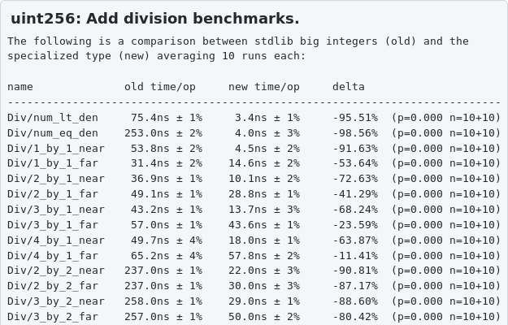
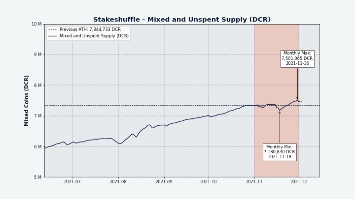

# Decred月报 – 2021 年 11 月

_图片: @saender_

十一月亮点：

- 一项改变 Decred 区块奖励分配的提案经过讨论后，现在已经获得批准。
- 在 Politeia 投票被拒绝后，社区资助了一项外展提案。
- Politeia v1.3.0 已上线，对提案状态的处理、GUI 改进和端到端测试进行了改进。
- dcrd 中开发了两个新的可重用包，一个用于快速整数的通用包，另一个用于构建 Decred 应用程序。

内容：

- [开发进展总结](#development)
- [人员](#people)
- [治理](#governance)
- [网络](#network)
- [生态系统](#ecosystem)
- [外展](#outreach)
- [媒体](#media)
- [市场](#markets)
- [相关外部信息](#relevant-external)

## 开发进展总结

除非另有说明，否则此处报告的工作仅限为“合并到主核心存储库”状态。这意味着这项工作已经完成、审查并集成到高级用户可以[构建和运行](https://medium.com/@artikozel/the-decred-node-back-to-the-source-part-one-27d4576e7e1c)的源代码中，但对于普通用户来说，还不能使用。

<a id="dcrd" />

**[dcrd](https://github.com/decred/dcrd)**

_dcrd 是一个完整的节点实现，为 Decred 的全球点对点网络提供支持。_

共识中的一个小错误已得到修复，即对国库支出投票没有被检测为已投票，并且在某些 RPC 请求中被错误地报告为[遗漏](https://github.com/decred/dcrd/pull/2780)。重要的是，该错误不会导致意外分叉，只会影响通过 RPC 提供的数据。现场票池仍然准确，所有选票和支出不受影响。修复将需要数据库迁移。

欢迎[`uint256`](https://github.com/decred/dcrd/pull/2787)，一个实现高度优化的无分配 256 位整数算法的新包。当使用它代替标准库大整数时，它有可能将初始链同步速度提高 5-10%。该软件包非常注重性能和正确性，并具有算术、布尔比较、按位逻辑、按位移位、相关类型的转换和完整的格式支持——所有这些都具有符合人体工程学的 API、完整的测试覆盖率和基准测试。为了充分享受黑客的乐趣，请在最后的完整自述文件中了解它是如何[在 59 次提交中](https://github.com/decred/dcrd/pull/2787/commits)出现的。

该`uint256`软件包成为开发新模块的[长期计划](https://github.com/decred/dcrd/issues/2786)的第一步primitives。通过整合目前分布在多个包中的交易、区块头、区块和序列锁定义等关键概念，它将成为共识代码的新基础构建块。精致的抽象将通过区分共识原语和数据共享协议来提高清晰度，并允许显着的性能优化。

`stdscript`包的进展（努力将“标准”与“共识”脚本处理分离，以避免对共识的意外更改）：

- 添加了[可证明可修剪](https://github.com/decred/dcrd/pull/2803)的脚本支持。这是一种特殊形式的公钥脚本，无法使用，并且可以安全地从一组未使用的交易输出 (UTXO) 中修剪以节省内存。它们主要用于将数据锚定到区块链中，如[时间戳](https://timestamp.decred.org/)和[Politeia](https://proposals.decred.org/)所使用的那样。
- 添加了对确定脚本所需[签名](https://github.com/decred/dcrd/pull/2805)数量的支持
- 添加了从公共密钥脚本的标准识别形式中提取[地址](https://github.com/decred/dcrd/pull/2807)
- 软件包`stdscript`[移动](https://github.com/decred/dcrd/pull/2810)从内部分段区域的`txscript`模块并准备用于消费
- 所有软件包都[转换](https://github.com/decred/dcrd/pull/2808)为使用新`stdscript`包。为了使审查更容易，更改被分成 50 个小提交，这样每一步都构建并通过所有测试。
- 添加了从权益相关脚本中普遍[提取](https://github.com/decred/dcrd/pull/2816)公钥哈希和脚本哈希的方法，这有助于许多不关心特定脚本类型（购票、投票奖励、撤销、更改等）的应用程序

其它合并更改：

- 填写并检查进入内存池的交易的[欺诈证明](https://github.com/decred/dcrd/pull/2804)数据。该数据包括输入金额、区块高度和该区块中的索引，并允许有效检测试图花费超过其输入提供的金额的欺诈交易。作为奖励，它还允许有效计算费用，而不会降低链数据的加载速度或需要完整的交易哈希索引。
- 升级代码与主代码进一步[解耦](https://github.com/decred/dcrd/pull/2776)，以随着主代码的发展保持更稳定
- 调整[ping](https://github.com/decred/dcrd/pull/2796)间隔以防止在延迟较高的情况下出现不希望的断开连接
- 优化[`netsync`](https://github.com/decred/dcrd/pull/2825)包中的内存使用
- 重新设计用于下载[下一个块](https://github.com/decred/dcrd/pull/2828)的逻辑，以便与来自多个对等点的并行块下载更加兼容
- 修复了 UTXO 数据库[迁移中](https://github.com/decred/dcrd/pull/2798)的边缘情况（不影响发布版本）
- 修复了关闭时的[死锁](https://github.com/decred/dcrd/pull/2806)（不影响发布版本）
- 修复了优化的恒定时间加法操作中的[溢出](https://github.com/decred/dcrd/pull/2778)`ModNScalar`
- 代码清理和季节性模块依赖仪式，为下一个版本做准备

_优化dcrd的又一天_

<a id="dcrwallet" />

**[dcrwallet](https://github.com/decred/dcrwallet)**

_dcrwallet 是命令行和图形钱包应用程序使用的钱包服务器。_

- 修复了与对等节点的[断开连接](https://github.com/decred/dcrwallet/pull/2105)

<a id="decrediton" />

**[Decrediton](https://github.com/decred/decrediton)**

_Decrediton 是一款功能齐全的桌面钱包应用程序，具有集成投票、StakeShuffle 混合、闪电网络、DEX 交易等功能。它在有或没有完整区块链的情况下运行（SPV 模式）。_

面向用户的变化：

- 为[确认种子](https://github.com/decred/decrediton/pull/3594)视图实施了新的 UI 设计，以简化输入种子词的痛苦用户体验
- 添加了从 DEX 种子恢复[DEX 帐户](https://github.com/decred/decrediton/pull/3552)的功能
- 添加了为比特币钱包选择自定义安装[目录](https://github.com/decred/decrediton/pull/3572)的功能。任何更新现有的尝试`bitcoin.conf`都已被删除。
- 隐藏[旧版](https://github.com/decred/decrediton/pull/3587)VSP 购票 UI 作为移除它的第一步
- ~7 bug 修复

内部的：

- 来自 pi-ui 库的重用[Tabs](https://github.com/decred/decrediton/pull/3592)组件
- 添加了以下自动化测试：标签页组件、[主页](https://github.com/decred/decrediton/pull/3598)、隐私和安全[页面](https://github.com/decred/decrediton/pull/3584)

pi-ui 库的变化（由 Decrediton 和 Politeia 共享）：

- 支持[日期选择器](https://github.com/decred/pi-ui/pull/375)值的编程更改
- 改进了[选项卡](https://github.com/decred/pi-ui/pull/376)和[CopyableText](https://github.com/decred/pi-ui/pull/382)组件的可定制性
- 添加了用于[分页](https://github.com/decred/pi-ui/pull/396)和文本[突出显示](https://github.com/decred/pi-ui/pull/404)的组件
- 依赖和 linter[升级](https://github.com/decred/pi-ui/pull/379)
- 更新以匹配新的设计规范
- ~3 bug 修复

<a id="politeia" />

**[Politeia](https://github.com/decred/politeia)**

_Politeia 是 Decred 的提案系统。它用于向 Decred 国库申请资金。_

新的[Politeia](https://proposals.decred.org/)版本上线了！v1.3.0 亮点：

- 计费状态（将改进导航并防止无效计费）
- 指示提案生命周期阶段的提案状态
- 用于更漂亮搜索引擎结果的 SEO 标签
- 各种 GUI UX 改进
- 在politeiavoter中并行涓流以获得更好的隐私和可靠性
- 新的端到端测试基础设施
- 用户层重写的代码库准备

有关更多详细信息，请查看[politeia](https://github.com/decred/politeia/releases/tag/v1.3.0)和[politeiagui](https://github.com/decred/politeiagui/releases/tag/v1.3.0)存储库中的发行说明，或@lukebp的快速推特[讲解](https://twitter.com/lukebp/status/1462881215346880524)。

面向用户的更改于 11 月合并：

- 使用明确的[日期格式](https://github.com/decred/politeiagui/pull/2640)，如`08 Sep 2021`
- 修复[返回](https://github.com/decred/politeiagui/pull/2658)导航
- ~10 个其它bug修复

内部 GUI 更改：

- 添加了用于编写[端到端测试](https://github.com/decred/politeiagui/pull/2624)的可扩展框架，包括模拟 API 响应、生成数据和操作指南的工具
- 添加了更多端到端测试以防止重复错误

后台改动：

- [防止](https://github.com/decred/politeia/pull/1575)RFP 提案的计费状态发生变化（与 RFP 提交不同，它们不能向财务部门计费）
- [`approved`](https://github.com/decred/politeia/pull/1578)为不能向财政部开票的提案（如 RFP）引入了状态，以区别于`active`可以开票的状态
- 在 MySQL 中实现[会话](https://github.com/decred/politeia/pull/1564)存储
- 为[`usermd`](https://github.com/decred/politeia/pull/1581)（“用户元数据”）插件实现了数据完整性检查。这是将遗留 Git 提议导入新 tstore所需的最后检查。
- 允许设置使用命令创建的提案的[状态](https://github.com/decred/politeia/pull/1583)`pictl seedproposals`（有助于测试）
- 在命令中添加了执行[时间统计信息](https://github.com/decred/politeia/pull/1585)的打印，`pictl`以帮助进行性能测试
- ~2个bug修复

`politeiavoter` 命令行工具：

- 允许多达 100 个平行[束](https://github.com/decred/politeia/pull/1565)
- 重新设计的[帮助输出](https://github.com/decred/politeia/pull/1580)更有用和匹配`dcrctl`。此外，仅在命令需要时才连接到钱包。
- 更正了配置文件中的[默认值](https://github.com/decred/politeia/pull/1568)并更新了示例配置

Politeia 开发的一个特点是正式的预发布步骤，用于测试[后端](https://github.com/decred/politeia/issues/1573)和[GUI](https://github.com/decred/politeiagui/issues/2653)中的所有更改。

<a id="vspd" />

**[vspd](https://github.com/decred/vspd)**

_vspd 是用于运行投票服务提供商的服务器软件。VSP 代表其用户 24/7 投票并且不能窃取资金。_

- 报告[状态](https://github.com/decred/vspd/pull/302)管理页面和状态API端点上dcrd实例
- 在选票[搜索结果](https://github.com/decred/vspd/pull/303)中显示备用签名地址
- 澄清了有关“备用签名地址”的[术语](https://github.com/decred/vspd/pull/307)
- 从反向代理服务器设置的标头确定[client IP](https://github.com/decred/vspd/pull/308)
- 支持测试[工具](https://github.com/decred/vspd/pull/309)的自定义目录

_VSP 管理状态页面_

<a id="dcrpool" />

**[dcrpool](https://github.com/decred/dcrpool)**

_dcrpool 是用于运行矿池的服务器软件。_

- 更新到`master`dcrd 和 dcrwallet 版本（这破坏了与 1.6 版本的兼容性）

<a id="dcrlnd" />

**[dcrlnd](https://github.com/decred/dcrlnd)**

_dcrlnd 是 Decred 的闪电网络节点软件。闪电网络支持即时和低成本的交易。_

- [`walletdb`](https://github.com/decred/dcrlnd/pull/149)从 btcwallet更新到最新包

<a id="cspp" />

**[cspp](https://github.com/decred/cspp)**

_cspp 是一个使用 CoinShuffle++ 协议协调硬币混合的服务器。它是非托管的，即不持有任何资金。_

- 混合现在每[15 分钟](https://github.com/decred/dcrdocs/pull/1188)发生一次，从 20 分钟减少到
- 修复了潜在的[DoS 向量](https://github.com/decred/cspp/pull/75)，其中未混合数据的无效（例如由于双花）可能会使混合失败。它尚未被开发人员利用。此更改还使验证并发以减少延迟。

<a id="dcrdex" />

**[DCRDEX](https://github.com/decred/dcrdex)**

_DCRDEX 是一个去信任交易的非托管交易所，由原子交换提供支持。_

面向用户的变化：

- 显示已撤销匹配的详细[状态](https://github.com/decred/dcrdex/pull/1287)（退款待定、已退款、已兑换或已完成）

@chappjc 分享了最近添加了用户友好[概述](https://twitter.com/chappjc/status/1457750847845195777)，例如多资产费用或内置的比特币 SPV 钱包。

内部变化：

- 添加了对[DCR SPV](https://github.com/decred/dcrdex/pull/788)钱包的支持
- 更准确的 BTC 钱包[同步状态](https://github.com/decred/dcrdex/pull/1271)
- 删除了禁令和[取消禁令](https://github.com/decred/dcrdex/pull/1272)端点，因为它已经在其他地方处理，并且因为运营商发起的禁令/取消禁令与网状配置或分层/绑定用户方案不兼容（两个未来概念）
- 将[活动匹配](https://github.com/decred/dcrdex/pull/1263)项存储在单独的存储库中，而不是将它们标记为活动或已停用
- 为新路线增加了速率[限制](https://github.com/decred/dcrdex/pull/1288) 
- ~7 bug 修复

以太坊支持的进展：

- 实现：获取原始[交易数据](https://github.com/decred/dcrdex/pull/1279)、基本合约[验证](https://github.com/decred/dcrdex/pull/1273)、[Swap](https://github.com/decred/dcrdex/pull/1248)函数和[SwapConfirmations](https://github.com/decred/dcrdex/pull/1315)函数
- [打包](https://github.com/decred/dcrdex/pull/1305)Swap 结构（本质上是对其重新排序）以在初始化和兑换交换时节省 5-15% 的 gas
- 删除了[启动](https://github.com/decred/dcrdex/pull/1262)单次交换的功能，支持批量版本，以减少智能合约代码和围绕它的客户端+服务器代码（更少的代码更容易审计）
- 更新掉期合约也可以批量[赎回](https://github.com/decred/dcrdex/pull/1274)交换
- [锁定](https://github.com/decred/dcrdex/pull/1291)资金以获得可能的退款
- 通过考虑待处理的传入和传出交易来计算[待处理余额](https://github.com/decred/dcrdex/pull/1303)
- 对 ETH 客户端进行大量[重构](https://github.com/decred/dcrdex/pull/1301)以更直接地调用方法、实现合约版本、切换到 EIP-1559 交易等

_以其它代币支付注册费以节省更多 DCR_

<a id="dcrandroid" />

**[Decred Wallet (Android)](https://github.com/planetdecred/dcrandroid)**

- 当 Internet连接[不可用时](https://github.com/planetdecred/dcrandroid/pull/604通知用户并暂停同步
- 始终如一地使用术语[“种子词”](https://github.com/planetdecred/dcrandroid/pull/600)
- 更新[法语](https://github.com/planetdecred/dcrandroid/pull/586)翻译
- 固定[链接](https://github.com/planetdecred/dcrandroid/pull/599)到提案网站

<a id="dcrios" />

**[Decred Wallet (iOS)](https://github.com/planetdecred/dcrios)**

- 活动标签的[固定图标](https://github.com/planetdecred/dcrios/pull/874)
- 在外面敲击时固定下拉[关闭](https://github.com/planetdecred/dcrios/pull/872)

<a id="godcr" />

**[GoDCR](https://github.com/planetdecred/godcr)**

_GoDCR 是一款轻量级桌面钱包应用程序，集成了质押、隐私和 Politeia 浏览功能。_

- 为[Staking](https://github.com/planetdecred/godcr/pull/679)页面实现了新的 UI 设计（从 Tickets 重命名）
- 使用新的欢迎页面实现了新的[治理](https://github.com/planetdecred/godcr/pull/691)UI
- 更新的[设置](https://github.com/planetdecred/godcr/pull/684)页面设计
- 在概览页面上显示帐户[混合器](https://github.com/planetdecred/godcr/pull/701)摘要
- 增加了从非[混合](https://github.com/planetdecred/godcr/issues/674)账户消费的能力（对于那些知道自己在做什么的人）
- ~9 bug 修复

合并到[dcrlibwallet](https://github.com/planetdecred/dcrlibwallet)库中（由 Android/iOS 钱包和 GoDCR 共享）：

- 添加[`dexdcr`](https://github.com/planetdecred/dcrlibwallet/pull/210)包以允许客户端应用程序集成 DCRDEX

> 您好，经过慎重考虑，Planet Decred 团队决定推迟 GoDCR 提案 v2，直到我们发布主网。因此，请寻找在一月份某个时候发布的 v2 GoDCR 提案。1.0主网GoDCR应该在年底完成。(@monsa00 于[2021-12-02](https://matrix.to/#/!gruHpujXftcsHcghjx:planetdecred.org/$GJ7PliGPTamNznbE7D82QfK05Hm6wQpogg8x2aQkCmw) )

<a id="dcrros" />

**[dcrros](https://github.com/decred/dcrros)**

_dcrros 是一个中间件服务，通过 Rosetta API 提供对 Decred 网络的访问。_

- v0.1.0 已被标记为 dcrros 的第一个正式版本。它嵌入了核心 Decred 软件 v1.6.0 并实现了 Rosetta 规范 v1.4.10。请参阅[发行说明](https://github.com/decred/dcrros/blob/master/docs/release-notes/release-notes-0.1.0.md)中的完整功能列表。
- 更新为使用[最新](https://github.com/decred/dcrros/pull/23)发布的 Decred v1.6.2 和 Rosetta SDK v0.7.2。还添加了一个--offline标志以简化运行 dcrros 的离线实例（例如，用于 tx 构建和签名，可能在气隙设置上）
- 上述更改已发布为[v0.1.1](https://github.com/decred/dcrros/pull/24)

<a id="dcrdocs" />

**[dcrdocs](https://github.com/decred/dcrdocs)**

_dcrdocs 是 Decred[用户文档](https://docs.decred.org/)的源代码。_

- [更新](https://github.com/decred/dcrdocs/pull/1190)了mkdocs-material 主题和完善的 Markdown 源代码

<a id="dcrweb" />

**[decred.org](https://github.com/decred/dcrweb)**

_dcrweb 是 decred.org 网站的源代码。_

- [添加](https://github.com/decred/dcrweb/pull/1018)了治理里程碑[新闻稿](https://decred.org/press/2021-10-27_decred_hits_governance_milestone/)
- 在新闻报道项目中添加了[作者姓名](https://github.com/decred/dcrweb/pull/1015)
- 更新了[Lottie](https://github.com/decred/dcrweb/pull/1020)动画库，修复了发布和历史页面上的动画

其他：

- 在[timestamp.decred.org](https://timestamp.decred.org/)应用了几个小的[修正](https://github.com/decred/dcrtimegui/pull/122)，并与一致的术语改进的复制
- 来自 dcrd 的零分配脚本标记器被[反向移植](https://twitter.com/roasbeef/status/1460809483714584582)到 btcd，为初始区块链下载产生了约 20% 的加速

## 人员

截至 12 月 1 日的社区统计数据：

- [Twitter](https://twitter.com/decredproject) 粉丝: 50,116 (+613)
- [Reddit](https://www.reddit.com/r/decred/) 订阅: 12,406 (+158)
- [Matrix](https://chat.decred.org/) #general 用户: 585 (+34)
- [Discord](https://discord.gg/GJ2GXfz) 用户: 2,223 (-44)
- [Telegram](https://t.me/Decred) 用户: 3,030 (+90)
- [YouTube](https://www.youtube.com/decredchannel) 订阅: 4,620 (+0), 观看: 198K (+1K)

## 治理

11 月，新[国库](https://dcrdata.decred.org/treasury)收到了价值 110 万美元的 10,206 DCR，当月平均利率为 108.13 美元。1,995 DCR 用于支付承包商，其中 974 DCR 用于 9 月，1,021 DCR 用于 10 月。后者价值 11 万美元（按 11 月的费率计算），或 12.4 万美元（按 10 月的结算费率 121.57 美元计算）。截至 12 月 6 日，[旧国库](https://dcrdata.decred.org/address/Dcur2mcGjmENx4DhNqDctW5wJCVyT3Qeqkx)和[新国库](https://dcrdata.decred.org/treasury)的总余额为 743,661 DCR（7,300 万美元，98.01 美元）。

本月提交了两项新提案：

- @ JY-P提交了[提案](https://proposals.decred.org/record/427e1d4)将块奖励分割从当前设置更改。该提案于 12 月初以 92% 的通过率和 78% 的投票率获得通过，预计工作将在几周内完成，成本不超过 30,000 美元，更改将在提出并投票后生效通过协商一致的变更提案。该提案最终在 Politeia（新记录）上收集了 166 条评论，在Reddit上收集了 60 多条评论。

- 一项[提案](https://proposals.decred.org/record/0ff082d)以 10,600 美元将 Decred Arabia 团队的沟通和内容工作再延长 10-12 个月——在上一时期，面对面的活动被缩减，预算支出不足。该提案于 12 月初获得批准，批准率为 98%，投票率为 61%。

该[提案](https://proposals.decred.org/record/c1f5b5c)由@ammarooni经济教育和宣传，用33.6％的支持和70％的投票率拒绝。然而，这并不是故事的结束，因为 Ammar 提供了一个捐款地址，并且通过 30 笔不同的交易很快达到了 12,000 美元的目标。他现在“像野牛一样充满活力”并准备交付拟议的计划。

任何通过命令行投票的人请升级：

> 如果您使用politeiavoter 进行提案投票，请确保在下一轮投票之前升级到v1.3.0 的politeiavoter。如果不这样做，重试失败的投票可能无法正常工作。([@lukebp](https://twitter.com/lukebp/status/1464627255108419586))

有关本月提案的更多详细信息，请参阅 Politeia Digest第 [49](https://blockcommons.red/politeia-digest/issue049/) 期。

## 网络

**全网算力**: 11 月[算力](https://dcrdata.decred.org/charts?chart=hashrate&zoom=kvddhno1-kwon4zhl&scale=linear&bin=block&axis=time)开始为~278 Ph/s，收盘价为~437 Ph/s，全月最低为221 Ph/s，最高为441 Ph/s。

_Decred全网算力_

12 月 1 日矿池[报告](https://miningpoolstats.stream/decred)的算力分布：蚂蚁矿池 36%、币印矿池 34%、F2Pool 13%、ViaBTC 7%、卢克索 6%、BTC.com 3%、OKEx 0.4%、CoinMine 0.16%。

**Staking**: [票价](https://dcrdata.decred.org/charts?chart=ticket-price&zoom=kvddhno1-kwon4zhl&axis=time&visibility=true-true&mode=stepped)139.1-327.8 DCR之间变化，具有30天的平均在203.6 DCR（12.0）。

[锁定量](https://dcrdata.decred.org/charts?chart=ticket-pool-value&zoom=kvddhno1-kwon4zhl&scale=linear&bin=block&axis=time)为7.42-8.19亿DCR，这意味着循环供应的54.7-60.5％参加在验证的股权。

在股权参与和选票价格大幅下降之后，接下来的选票购买已将价格发送到新高327.8 DCR。

_票价波动_

**VSP**: 在 12 月 1 日，大约 6,800 (-600) 个现场票由列出的vspd 服务器管理，195 (-29) 个由列出的旧 dcrstakepool 服务器管理。7 个遗留 VSP 和 15 个新 VSP 总共管理着 17.5% (-1.4%) 的票池。3 个未上市但仍处于活动状态的旧版 VSP 管理着 45 (+10) 张现场票。

**Nodes**: 根据[dcrextdata](https://dcrextdata.planetdecred.org/nodes)，整个 11 月大约有 186 个可访问节点。

截至 12 月 1 日快照的节点版本（共 208 个，仅 dcrd）：v1.6.2 - 61%，v1.7 dev builds - 13%，v1.6.0 - 12%，v1.6.1 - 7%，v1.6 dev builds - 3.4%，v1.5.2 - 2.4%，v1.5.1 - 0.5%。

[混合代币](https://dcrdata.decred.org/charts?chart=coin-supply&zoom=jz3q3lq8-l0s732o6&scale=linear&bin=day&axis=time&visibility=true-true-true)的份额在 52.9-55.1% 之间变化，并创下历史新高，混合未使用的代币总数超过 750 万。

_StakeShuffled DCR_

## 生态系统

由于互联网审查和DNS 问题，中国矿池经历了中断，一些矿池已启动替代域作为回应。这似乎导致了 Decred 算力的一些重新分配，而总算力并没有受到太大影响。

F2Pool宣布，它将于2021年这的结束后接着几个硬币，包括XMR采矿池关闭关闭在中国大陆的运营，虽然DCR池已在网上与46 PH / S作为12月1日的。

Ledger Live 用户报告了从这个钱包发送 DCR 的问题。由于不正确的费用计算，交易会卡在内存池中并锁定硬币。[找到了](https://www.reddit.com/r/decred/comments/qoe0hu/ledger_live_sending_issues_and_workarounds/)一种解决方法，可以使用硬币控制功能来解锁资金。

有人[报告](https://www.reddit.com/r/decred/comments/qru7vx/decred_is_the_majority_place_holder_of_the/)说，DCR 成为 FTX PRIV 指数的主要组成部分（27%），该指数跟踪 9 个隐私币，尽管这似乎是由于未能重新平衡旨在成为市值加权指数的指标。

警告：Decred 期刊的作者不知道上述任何服务的可信度。在将您的个人信息或资产信任给任何实体之前，请自行研究。

## 外展

Decred 现在有一个[Odysee 频道](https://odysee.com/@Decred)，其中YouTube内容已被镜像，以防万一。作为奖励，它允许在不访问 [YouTube](https://www.youtube.com/c/DecredChannel) 和 Google 的情况下观看 Decred 视频。Odysee 由LBRY提供支持，[LBRY](https://lbry.com)是一种去中心化协议，用于公平和稳健的内容分发（可选择货币化）。如果您使用此平台，请考虑支持 Decred 视频。

除了所有现有频道外，十月 Decred Journal 在 Decred 的[Instagram](https://www.instagram.com/decredproject/p/CWRRcJPp3zr/)页面上还发布了一个实验性的自定义公告。欢迎资深 Instagram 用户支持该帐户或建议如何发展它。

最后但并非最不重要的一点是，有人为 Decred注册了一个[OnlyFans帐户](https://onlyfans.com/decred)。很难再发表评论了。

Monde PR 11 月的成就：

- 向金融和加密出版物投放了 4 个故事/公关项目

获得以下新闻文章：

- @jy-p 在Benzinga 的 [Moon or Bust Show](https://www.youtube.com/watch?v=0My2w4p2-PE)上接受了采访，谈论了 Decred 的所有事情
- @jz就如何成功投资加密货币接受了[Authority Magazine](https://medium.com/authority-magazine/jonathan-zeppettini-on-the-5-things-you-need-to-understand-in-order-to-successfully-invest-in-2f09bff32e48)的采访。这篇文章包含了几个 Decred 的提及。

## 媒体

精选文章：

- Decred: 顶尖加密货币 来自 Andy Hecht ([investing.com](https://www.investing.com/analysis/decred-a-top-tier-cryptocurrency-200609428))
- Decred 的 Jonathan Zeppettini 关于成功投资加密货币需要了解的 5 件事来自Tyler Gallagher ([medium](https://medium.com/authority-magazine/jonathan-zeppettini-on-the-5-things-you-need-to-understand-in-order-to-successfully-invest-in-2f09bff32e48))

> 您需要了解自己，并且旅程将是永无止境的学习体验。在我看来，如果你想有任何成功的机会，你还需要培养三个特质：耐心、纪律和专注。与任何类型的投资一样，这些将决定您的结果。(@jz)

视频：

- 市场更新 - Decred 采访 - Benzinga - @jy-p 谈论 Decred 并回答聊天中的问题，从29 分钟开始

音频：

- 没有顶部。 比特币上链分析 来自Glassnode([bravenewcoin.com](https://bravenewcoin.com/insights/podcasts/there-is-no-top-bitcoin-on-chain-analysis-with-glassnode), [youtube](https://www.youtube.com/watch?v=6LJGaNGw4Us), [mp3](https://traffic.libsyn.com/secure/thecryptoconversation/MATE_FIN.mp3)) 

艺术与娱乐：

- @bochinchero 制作了一系列引人入胜的图像，涉及野牛以及革命将不会是什么样子 ([集中式](https://twitter.com/TheBochinchero/status/1460288794767282187), [监视式](https://twitter.com/TheBochinchero/status/1461030870861549578), [保管式](https://twitter.com/TheBochinchero/status/1461754024508723201), [中央计划式](https://twitter.com/TheBochinchero/status/1462836288982294528), 和 [操纵式](https://twitter.com/TheBochinchero/status/1464335044164698122))

翻译：

- Politeia Digest 48 -[西班牙语](https://medium.com/decred-es/politeia-digest-48-octubre-4-noviembre-1-2021-e361f1c55e70)，@francov_
- Decred Journal 2021 年 10 月已被[翻译成](https://xaur.github.io/decred-news/)阿拉伯语（@arij、@abdulrahman4）、中文（@Dominic）和西班牙语（@francov_）。感谢大家的辛勤工作！

## 市场

11 月 DCR 的交易价格在 91.36-121.75 美元 / BTC 0.0016-0.0019 之间。平均每日价格为 108.13 美元。

来自@bochinchero 的 DCRDEX 交易量图表：

_DCRDEX 日交易量_

_DCRDEX 月交易量_

## 相关外部信息

Binance冻结后DOGE取款明显升级后不小心处理一批旧的提款申请。Binance 用户报告说，他们被要求归还不在他们账户中的 DOGE，并被告知他们在归还 DOGE 之前将无法再提款。埃隆·马斯克通过在 Twitter 上批评币安，为提高对该问题的认识做出了贡献。币安后来发布了他们的故事版本，确认问题是由于升级他们的钱包而导致的旧卡交易，然后成功重播。解释指出，DOGE 的提款被关闭了 17 天，因此他们可以“重建钱包”。

ECC提出了一个新的 Zcash 路线图，该路线图将使该项目在未来三年内转向股权证明共识，重点是跨链互操作性和在钱包中集成治理功能。Zcash 正在探索的另一个领域是“屏蔽资产”，它代表 Zcash 链上的其他资产，但该报告对这是否有益和值得持观望态度。这些优先事项是通过论坛成员和硬币持有者的投票决定的。

Polkadot 举行了一次代币投票来决定他们品牌的未来，它遵循二次投票的方法，减少了鲸鱼投票账户和选民在两个标志和身份方向之间选择的权重。方向的选择纯粹是审美的。修改这些资产的过程开始于2020年12月，有人出资10000欧元的预算。选择一个竞争设计的最终投票是在一个定制页面上进行的，这可能标志着 2,097 个账户中的大多数第一次投票 - 因为资金提案的投票界面不太容易访问。

一个加密投资者社区成立了ConstitutionDAO，试图购买一份罕见的美国宪法副本，筹集了 4000 万美元的 ETH，但随后在拍卖中输给了对冲基金首席执行官 Ken Griffin。这导致了很多关于所贡献资金会发生什么情况的不确定性，新代币被宣布和取消，DAO 贡献者收到的 PEOPLE 代币的价格波动很大。该项目最终决定结束，因为在没有宪法副本的情况下无法就如何推进项目达成一致，贡献者可以收回他们的 ETH（但交易费用将消耗大部分或所有这些较小规模的贡献者）或索取他们的 PEOPLE 代币。

臭名昭著的基础设施法案已签署成为法律，将于 2024 年 1 月 1 日生效。 已经提出了一项两党法案，以解决加密社区对基础设施法案的担忧。

与此同时，欧盟监管加密资产市场的方法似乎正在以更加谨慎的方式进行，并为监管对象和监管对象划定了更清晰的界限。

NFT 概念及其粉丝一直在引起一些在线社区的不良反应——Creative Commons和Discord已与 NFT 相关材料保持距离，而一个针对年轻作家的 NFT 项目在 Twitter 反对后被取消。

Square宣布了一份白皮书，详细介绍了其去中心化交易所 tbDEX 的提议。Square随后更名为Block。

ETH 已被苏富比拍卖行添加为货币选项，在拍卖期间接受实时 ETH 出价并显示在提要上 - 付款也可以以 BTC、USDC 或法定货币进行。

位于怀俄明州的两个“DAO”已被SEC阻止将数字代币注册为证券，因为它们提供的文件不足。

这就是 11 月的全部内容。在我们的#journal聊天室中分享您对下一期的更新。

## 关于月报

这是Decred Journal的第44期。有关所有问题，镜像和翻译的索引，请参见[这里](https://xaur.github.io/decred-news/)。

来自第三方的大多数信息都是在经过最低限度的健全性检查后直接从源中转过来的。Decred 月报的作者无法验证所有声明。请提防诈骗并自行研究。

感谢 (字母排列):

- 写作和编辑： bee, bochinchero, degeri, l1ndseymm, richardred
- 评论和反馈： davecgh, jz, lukebp
- 封面图片： saender
- 资助: Decred stakeholders

## 中文社区

* [社区网址](https://blog.dcrclub.org/)
* [微博](https://www.weibo.com/DecredProject)
* [微信公众号](https://mp.weixin.qq.com/mp/profile_ext?action=home&__biz=Mzg2NTExNzc3MA==&scene=124#wechat_redirect)
* [中文电报群](https://t.me/decred_cn)
* [bilibili频道](https://space.bilibili.com/425519478)
* QQ群号-258412796
