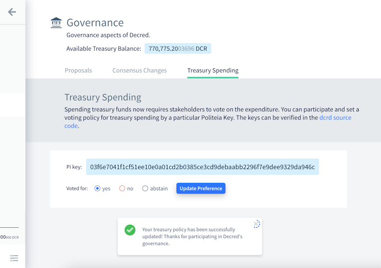
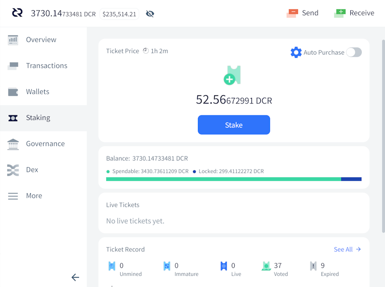
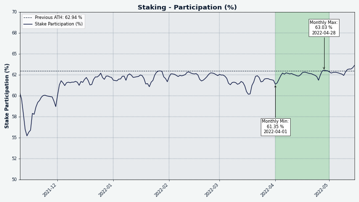
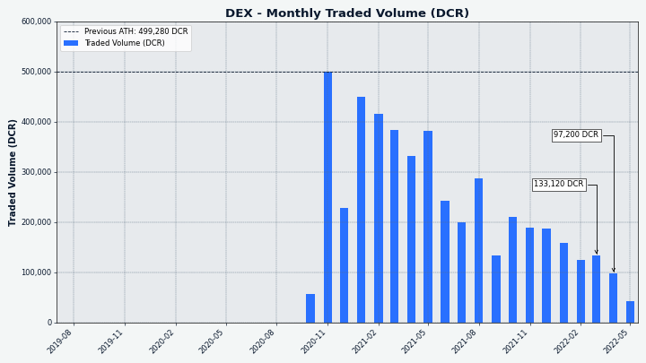

# Decred月报 – 2022 年 4 月

_图片：@saender _

月报回来了! 

近期亮点：

- DCP0007-DCP0010 共四项共识升级均在 4 月份获得了几乎一致支持（~99.7%）的利益相关者投票批准，并都已于 5 月 8 日激活，因此任何运行旧版本的节点/钱包都将被分叉出网络。
- 3 月，旧国库地址中持有的大部分资金（超过 610,000 DCR）被转移到新国库中，这需要利益相关者批准支出。
- Decred 节点和钱包软件的 1.7.2 版本于 5 月 11 日发布，它修复了一些错误并为 Decrediton 用户增加了国库支出投票功能。
- 2022 年到目前为止，已经发布了四份 Politeia 提案，所有提案都获得了 96% 以上的支持：Politeia 和 DCRDEX 的开发周期已得到延长，以及视频制作和@StakeShuffle_ Twitter 机器人。

内容：

- [开发进展总结](#development)
- [人员](#people)
- [治理](#governance)
- [网络](#network)
- [生态系统](#ecosystem)
- [外展](#outreach)
- [活动](#events)
- [媒体](#media)
- [讨论](#discussions)
- [市场](#markets)
- [相关外部信息](#relevant-external)

## 开发进展总结

除非另有说明，否则此处报告的工作仅限为“合并到主核心存储库”状态。这意味着这项工作已经完成、审查并集成到高级用户可以[构建和运行](https://medium.com/@artikozel/the-decred-node-back-to-the-source-part-one-27d4576e7e1c)的源代码中，但对于普通用户来说，还不能使用。

<a id="dcrd" />

**[dcrd](https://github.com/decred/dcrd)**

_dcrd 是一个全节点实现，为 Decred 在全球的点对点网络提供支持。_

- 删除了[错过和过期选票](https://github.com/decred/dcrd/pull/2911)相关的所有 RPC 和相关代码。随着[自动撤销选票](https://github.com/decred/dcps/blob/master/dcp-0009/dcp-0009.mediawiki)共识的升级，钱包将不再需要这些 RPC。除了降低维护成本外，此删除还解锁了选票数据库的性能优化。
- [优化旧区块](https://github.com/decred/dcrd/pull/2912)版本升级检查。
- 添加了有关[向后移植](https://github.com/decred/dcrd/pull/2934)的拉取请求的预期文档。
- 修复了一个[竞态条件](https://github.com/decred/dcrd/pull/2932)并将修复反向移植到 v1.7.2 补丁版本。
- 各种代码优化、清理和其他改进，特别是针对主要[区块奖励共识变更](https://proposals.decred.org/record/427e1d4)。

[`primitives`](https://github.com/decred/dcrd/issues/2786)该模块取得了更多进展：

- 实现了一个[补贴缓存](https://github.com/decred/dcrd/pull/2920)，其中包含计算工作量证明、投票和国库补贴的功能。还包括一整套测试和基准。

<a id="decrediton" />

**[Decrediton](https://github.com/decred/decrediton)**

_Decrediton 是一款功能齐全的桌面钱包应用程序，具有集成投票、StakeShuffle 混合、闪电网络、DEX 交易等功能。它可在有或没有完整区块链的情况下运行（SPV 模式）。_

Decredition v1.7.2 已于 5 月 11 日发布，经过两个多月的改进和修复（包括下面报告的所有内容）。请尽快[升级](https://decred.org/wallets/)。在[此处](https://github.com/decred/decred-binaries/blob/master/release-notes.md#decrediton-v172)查看发行说明。与往常一样，在安装之前[验证下载](https://docs.decred.org/advanced/verifying-binaries/)。

DCRDEX 集成：

- 对于 DCRDEX，SPV 模式[不再是实验性的](https://github.com/decred/decrediton/pull/3739)。目前用户可以在 SPV 模式下运行 Decredition 时访问 DEX 选项卡。
- 首次启动 DEX 后，[将跳过](https://github.com/decred/decrediton/pull/3749)DEX登录。这应该可以更快地加载 DEX 并改善流程。
- DCRDEX 模块更新到[v0.4.3](https://github.com/decred/decrediton/pull/3748)，包含一些新功能和重要的bug修复。详情在DEX部分。

VSP 监督增强功能：

- 增强的投票详细信息页面，如果 VSP 投出的选项与用户钱包中设置的不同，则会显示[警告](https://github.com/decred/decrediton/pull/3732)。该页面还将显示托管选票的 VSP，以及已花费（投票）它的交易。
- 向投票页面添加了[区块投票](https://github.com/decred/decrediton/pull/3733)信息（最后一个区块有效性、投票版本）。
- 现在，在使用任何未升级的 VSP 时，“治理”选项卡中会出现[警报](https://github.com/decred/decrediton/pull/3736)。运行旧软件的 VSP 在用户投票时可能无法使用首选项。

其它变化：

- 添加了[国库支出标签](https://github.com/decred/decrediton/pull/3718)。这是用户将对国库支出进行投票的地方。
- 在设置选项卡下添加了重新设计的[使用教程](https://github.com/decred/decrediton/pull/3669)，涵盖了 Decred 的许多方面。
- Staking 选项卡现在为首次购票者提供[信息图表](https://github.com/decred/decrediton/pull/3740)，提醒用户 Decred 时间锁定的基本信息和投票系统的基础知识。
- [交易历史选项卡](https://github.com/decred/decrediton/pull/3745)性能改进。值得注意的是，现在使用无限滚动逐渐加载行，这将减少瓶颈和迟缓。
- [对于已恢复的钱包](https://github.com/decred/decrediton/pull/3746)，每个帐户的加密现在是自动的。
- 更自动化的 UI 测试覆盖率。
- ~5 bug 修复。

_国库支出投票现已在 Decrediton 中进行！_

_无需离开 Decrediton 的 RTFM！_

<a id="politeia" />

**[Politeia](https://github.com/decred/politeia)**

_Politeia 是 Decred 的提案系统。它用于向 Decred 国库请求资金。_

后端，已合并：

- 修复了迁移代码中的[两](https://github.com/decred/politeia/pull/1633)个[bug](https://github.com/decred/politeia/pull/1635)（不影响 Politeia 的正常运行）。

后端，正在进行中：

- 将[旧提案](https://github.com/decred/politeia/issues/1425)导入新的 Politeia 数据库。将旧数据转换为新格式的新工具已完成。接下来是导入工具，用于将转换后的数据加载到 Politeia 数据库中。

面向用户的 UI 更改：

- 添加了一个用于编辑、渲染和区分[Markdown](https://github.com/decred/politeiagui/pull/2741)的新组件，以替换已弃用的`react-mde`包。这应该会增强编辑 UX 并改善行差异。
- 向提案列表添加了[无限滚动](https://github.com/decred/politeiagui/pull/2750)。
- 修改了提案的[加载占位符](https://github.com/decred/politeiagui/pull/2755)。
- 使用最新组件重新实现[提案](https://github.com/decred/politeiagui/pull/2723)详细信息页面。
- 在[评论插件](https://github.com/decred/politeiagui/pull/2758)中使用了新的 Markdown 渲染和错误处理。

开发者界面变化：

- 在主页上实施了新的[布局系统](https://github.com/decred/politeiagui/pull/2748)。现在可以从 pi-ui 库中重用 Column 和 Row 等布局原语。
- 添加了常用的[模态组件](https://github.com/decred/politeiagui/pull/2749)。
- 在使用CLI 工具生成类似 Politeia 的应用程序时添加了一个[配置插件](https://github.com/decred/politeiagui/pull/2754)的标志。`newapp`
- 共享[pi-ui库](https://github.com/decred/pi-ui)中的新功能和修复（默认主题、按钮工具提示、布局原语等）。

<a id="cspp" />

**[cspp](https://github.com/decred/cspp)**

_cspp 是一个使用 CoinShuffle++ 协议协调的混币的服务器。它是非托管的，即不持有任何资金。_

已宣布研发用点对点模型取代单服务器 CoinShuffle++:

> 我们将很快开始模拟（p2p cspp vs 单服务器）。
> 
> 处理注册和超时会更麻烦，但应该是可行的。事实上，主要的威胁模型是分区攻击，无论是外部的还是内部的。 \[[@behindtext](https://twitter.com/behindtext/status/1506941924585967619), 2022-03-24\]

<a id="dcrdex" />

**[DCRDEX](https://github.com/decred/dcrdex)**

_DCRDEX 是由原子交换提供支持的去信任交易的非托管交易所。_

DCRDEX 开发火热。SPV 模式现已完成，可用于 Decredition。添加了狗狗币。Zcash 和 以太坊在测试网上取得了稳步进展。Tor 隐藏服务支持已准备就绪。对某些人来说有点混乱的注册 UI 已得到改进。

资产支持：

- 莱特币代码已支持并[需要SegWit（隔离验证）](https://github.com/decred/dcrdex/pull/1554)。
- 添加了对[Dogecoin](https://github.com/decred/dcrdex/pull/1558)的支持（包括用于处理合并挖掘块的自定义块解串器）。
- 以太坊交易现在链接到订单页面上的[etherscan](https://github.com/decred/dcrdex/pull/1572)。
- 支持基于以太坊的[代币](https://github.com/decred/dcrdex/pull/1399)的准备工作。

其它变化：

- 添加了Tor[匿名服务](https://github.com/decred/dcrdex/pull/1575)支持。这引入了对具有 .onion 名称的 DEX 主机的特殊处理。
- DEX [注册UI](https://github.com/decred/dcrdex/pull/1589)已更新为 v3 .onion 地址。UI 还明确了注册费流程。
- [隐私增强](https://github.com/decred/dcrdex/pull/1584)功能可防止针对用户密码和种子的内存抓取攻击。
- 在[服务器](https://github.com/decred/dcrdex/pull/1541)和[客户端](https://github.com/decred/dcrdex/pull/1548)上更好地处理合约到期边缘情况。
- 各种bug修复、优化和其它改进。

> v0.5 有许多重大变化。负载已经[合并](https://github.com/decred/dcrdex/milestone/16?closed=1)，但目前正在审查中，包括[CPFP交易](https://github.com/decred/dcrdex/pull/1555)的交换加速、[混合DCR](https://github.com/decred/dcrdex/pull/1498)账户支持、对 LTC 的 MWEB 版本的支持、[Zcash](https://github.com/decred/dcrdex/pull/1570)、[Electrum](https://github.com/decred/dcrdex/pull/1607)钱包支持（SPV 用于具有现有/外部钱包的许多资产）。\[[@chappjc](https://matrix.to/#/!zefvTnlxYHPKvJMThI:decred.org/$sH4VqshHQ7s-yUkldhYG7SGlVpPlyCjExbiLkCoX9Y0), 2022-05-13\]

_很多钱包！_

<a id="dcrandroid" />

**[Decred Wallet (Android)](https://github.com/planetdecred/dcrandroid)**

- 从接收二维码中[删除](https://github.com/planetdecred/dcrandroid/pull/623)DCR logo。
- 添加了一个信息图标，解释如何确定交易[字节大小](https://github.com/planetdecred/dcrandroid/pull/606)以及它如何影响费用。
- 如果[可用磁盘空间不足](https://github.com/planetdecred/dcrandroid/pull/607)，用户会收到通知。
- 添加图标以在概览页面上[隐藏和显示](https://github.com/planetdecred/dcrandroid/pull/601)钱包余额。
- [交易发送页面](https://github.com/planetdecred/dcrandroid/pull/624)已重新设计，为用户提供更多成功交易的上下文。
- 数据库类型信息已添加到[钱包设置页面](https://github.com/planetdecred/dcrandroid/pull/626)。
- 防止用户从[同一个种子](https://github.com/planetdecred/dcrandroid/pull/629)中恢复重复的钱包，也防止用户使用同一个 xpub 导入重复的仅限观察的钱包。
- 种子输入恢复页面现在更能[防止屏幕截图](https://github.com/planetdecred/dcrandroid/pull/614)。此外，应用程序窗口预览不再显示在任务切换器中。
- 更新了[法语](https://github.com/planetdecred/dcrandroid/pull/605)翻译。
- ~4 个bug修复，以及其他调整和优化。

_保持自己的 DCR 余额！_

<a id="dcrios" />

**[Decred Wallet (iOS)](https://github.com/planetdecred/dcrios)**

- 用户可以使用Touch ID/Face ID 等[生物识别技术](https://github.com/planetdecred/dcrios/pull/883)作为他们的消费密码/PIN。
- 添加了信息图标以解释[交易字节大小](https://github.com/planetdecred/dcrios/pull/876)和费用。
- 发送成功[对话框](https://github.com/planetdecred/dcrios/pull/902)已重新设计。
- 从接收[二维码](https://github.com/planetdecred/dcrios/pull/903)中移除 DCR logo。
- [隐私帐户](https://github.com/planetdecred/dcrios/pull/906)设置流程已优化。
- 防止从同一个种子中恢复[重复的钱包](https://github.com/planetdecred/dcrios/pull/905)。
- 各种调整、bug修复和其它优化。

<a id="godcr" />

**[GoDCR](https://github.com/planetdecred/godcr)**

_GoDCR 是一款轻量级桌面钱包应用程序，集成了质押、隐私和 Politeia 浏览功能。_

GoDCR v1.7.0 已于 5 月 11 日发布！这是自 v0.9.0 测试网发布以来经过近 8 个月的开发和完善后的第一个主网版本。获取[下载和发行说明](https://github.com/planetdecred/godcr/releases/tag/v1.7.0)并验证它确实由`release@planetdecred.org`（密钥以 结尾`A3C9EB3218CCC3E8`）签名。

4月合并：

- 在 Staking 页面上[可视化可用/锁定](https://github.com/planetdecred/godcr/pull/826)余额。
- 添加了一个复选框以在设置混合时[移动资金](https://github.com/planetdecred/godcr/pull/890)。
- 防止从同一个种子或同一个 xpub 恢复[重复的钱包](https://github.com/planetdecred/godcr/pull/891)。
- 以[模式](https://github.com/planetdecred/godcr/pull/901)而不是工具提示显示的提案详细信息。
- 防止在[StakeShuffle](https://github.com/planetdecred/godcr/pull/904)中使用默认帐户。
- 修复了接收页面上可能的[地址重用](https://github.com/planetdecred/godcr/pull/899)。此外，在同步完成之前，将阻止访问发送和接收页面。
- 约 14 个bug修复，约 10 个用户体验调整，代码重构。
- 基础[dcrlibwallet](https://github.com/planetdecred/dcrlibwallet)进行了更新，为 Android、iOS 和 GoDCR 钱包带来了新功能和修复。

进行中：

- 初始[DEX集成](https://github.com/planetdecred/godcr/issues/619)，特别是[钱包设置](https://github.com/planetdecred/godcr/pull/798)和[DEX注册](https://github.com/planetdecred/godcr/pull/900)。

_GoDCR 余额概览。不要只看它，按下stake按钮！_

**其它**

- 许多 repos中的[Go 1.18](https://github.com/decred/dcrctl/pull/45)更新。
- [Decred漏洞赏金](https://bounty.decred.org/)计划已更新。到目前为止，共处理了 228 份提交，其中 21 份有资格获得付款。现在可以公开三个漏洞的详细信息。恭喜@Al1ex 和@aditi_singghh 入选名人堂！感谢社区成员[@degeri](https://twitter.com/degeri_crypto)运行bug赏金计划。

## 人员

欢迎新的首次贡献者将代码合并到 master：@Juneezee ([dcrdex](https://github.com/decred/dcrdex/commits?author=Juneezee)) 和 @yaroyazeed ([dcrandroid](https://github.com/planetdecred/dcrandroid/commits?author=yaroyazeed))！

Decred 新闻更新有了新面孔。[@Dajana_DCR](https://twitter.com/DajanaDcr)现在正在帮助 @Exitus 作为新闻主持人，改变现状！她的首张视频获得了超过 1,000 次观看和 101 个赞。

截至 5 月 2 日的社区统计数据（与12月月报的统计数据相比）：

- [Twitter](https://twitter.com/decredproject) 粉丝: 54,862 (+3,946, +987/月)
- [Reddit](https://www.reddit.com/r/decred/) 订阅: 12,621 (+133, +33/月)
- [Matrix](https://chat.decred.org/) #general 用户: 662 (+63, +16/月)
- [Discord](https://discord.gg/GJ2GXfz) 用户: 2,293 (+118, +30/月)
- [Telegram](https://t.me/Decred) 用户: 2,828 (-332, -83/月)
- [YouTube](https://www.youtube.com/decredchannel) 订阅: 4,639 (-1), 观看量: 214K (+14K, +3.4K/月)

## 治理

4 月，新[国库](https://dcrdata.decred.org/treasury)收到 9,481 DCR，价值 57.5 万美元，4 月平均汇率为 60.62 美元。1,152 DCR 从旧国库地址用于支付承包商，按 4 月份的汇率计算价值 70,000 美元，或按 3 月份的 57.22 美元的账单利率计算价值 66,000 美元。

2 月至 3 月，大约 617,000 DCR 从旧资金地址转移到需要利益相关者批准才能使用的新资金账户。

截至 5 月 10 日，[旧国库](https://dcrdata.decred.org/address/Dcur2mcGjmENx4DhNqDctW5wJCVyT3Qeqkx) 和 [新国库](https://dcrdata.decred.org/treasury)的总余额为 788,247 DCR（3270 万美元，41.52 美元）。大约 46,000 DCR 留在旧库中，约占总数的 6%。

自上一期 Decred 月报（2021 年 12 月）以来，已经在 Politeia 上发布了四份提案，均获得批准。

以 138,600 美元继续开发[提案](https://proposals.decred.org/record/4475472)的提案于 3 月获得批准，支持率为 97%，投票率为 55%。这看到 Politeia 的开发资金将持续到 2022 年 7 月。

@Exitus的一项[提案](https://proposals.decred.org/record/6e9b633)以 32,000 美元资助视频内容制作，涵盖 2022 年剩余时间，该提议于 3 月获得批准，支持率为 98%，投票率为 55%。

以 1,684 美元继续推特机器人 @StakeShuffle_ 第 2 阶段的[提案](https://proposals.decred.org/record/1a290d8)获得了 96% 的支持和 55% 的投票率。

以 370,000 美元继续 DCRDEX 开发的第 3 阶段的[提案](https://proposals.decred.org/record/3326c82)于 1 月获得批准，支持率为 97%，投票率达 57%。

作为 v1.7 版本的一部分部署的所有共识更改都得到了投票结果非常相似的选民的批准：60% 的投票获得了 99.9% 的批准（而不是弃权，大约 40%），有只有 61 票反对[区块奖励更改](https://proposals.decred.org/record/427e1d4)（反对票 23,664 票）。

更改于 5 月 8 日生效，因此除了新的区块奖励分配 ([DCP-10](https://github.com/decred/dcps/blob/master/dcp-0010/dcp-0010.mediawiki)) 之外，还有固定的国库支出政策 ([DCP-7](https://github.com/decred/dcps/blob/master/dcp-0007/dcp-0007.mediawiki))、显式版本升级 ([DCP-8](https://github.com/decred/dcps/blob/master/dcp-0008/dcp-0008.mediawiki)) 和自动票据撤销([DCP-9](https://github.com/decred/dcps/blob/master/dcp-0009/dcp-0009.mediawiki))。

## 网络

**全网算力**: 4 月份的[算力](https://dcrdata.decred.org/charts?chart=hashrate&zoom=l1ezonii-l2odxr6y&bin=day&axis=time)以 261 Ph/s开启，结束约为 331 Ph/s，整个月的最低为 212 Ph/s，最高为 370 Ph/s。

5 月 10 日矿池[报告](https://miningpoolstats.stream/decred)的算力分布：Poolin 52%，ViaBTC 24%，F2Pool 8%，AntPool 6%，Luxor 5%，BTC.com 3%，CoinMine 和 OKx 不到 1%。

5 月 10 日之前实际[开采](https://miningpoolstats.stream/decred)的 1,000 个区块分布：Poolin 51%，ViaBTC 16%，DsV1GF7 9%，Luxor 4%，BTC.com 4%，F2Pool 3.6%，CoinmMine 0.4%，DsX51bV 0.1%，未知 12%。

**Staking**: [选票价格](https://dcrdata.decred.org/charts?chart=ticket-price&zoom=l1ezonii-l2odxr6y&bin=window&axis=time&visibility=true-true&mode=stepped)在 195-228 DCR 之间变化，30 天平均价格为 214.2 DCR。

[锁定数量](https://dcrdata.decred.org/charts?chart=ticket-pool-value&zoom=l1ezonii-l2odxr6y&bin=block&axis=time)为 858-889 万 DCR，这意味着 61.4%-63.0% 的流通供应量参与了购买选票。

63.03% 的质押供应量创下 **历史新高！**

_我们只是在staking。_

**VSP**: 在 5 月 10 日，大约 6,780 个现场选票由 15 个[列出](https://decred.org/vsp/)的vspd 服务器管理，占票池的 16.6%。与我们在 1 月 2 日的上一次快照相比，这是一个小幅度的增长，大约为 230 张票或票池的 +0.4%。

自 5 月 8 日新规则以来，旧版 (dcrstakepool) 选票无法再进行投票。5 月 10 日，7 家上市和 1 家未上市的传统 VSP 共报告了 125 张罚单，但这个数字已经过时。其中 5 个 VSP 在 2021 年 5 月至 2022 年 2 月期间停止投票。剩下的 3 个运行到最后的 VSP 在 5 月 8 日有 27 张现场门票。coinmine.pl、decredbrasil.com 和 stakey.net 被证明是最铁杆的.

**节点**: 根据PD Analytics的数据，整个 4 月份有大约 175 个可访问节点。

截至 5 月 10 日快照的节点版本（总共 187 个，仅限 dcrd）：v1.7.1 - 49%、v1.7.0 - 17%、v1.7.0 开发版本 - 9%、v1.6.2 - 5%、v1.8.0 开发版本- 4%，v1.6.0 - 2%，v1.7.2 - 2%，v1.5.2 - 2%，其他 - 7%。

[混币](https://dcrdata.decred.org/charts?chart=coin-supply&zoom=jz3q237o-la8vk000&scale=linear&bin=day&axis=time&visibility=true-true-true)的份额在 57.9%-59.3% 之间变化。每日[混合量](https://dcrdata.decred.org/charts?chart=privacy-participation&zoom=jzuht6o0-l33oao00&bin=day&axis=time)在 290-450K DCR 之间变化。

截至 5 月 10 日， Decred 的[闪电网络](https://ln-map.jholdstock.uk/)已经看到 45 个节点、78 个通道，总容量为 41.5 DCR - 自 1 月份的 36 个节点、66 个通道和 25.5 DCR 容量以来，这是一个不错的增长。

## 生态系统

[@DCR_uncle](https://twitter.com/DCR_Uncle)运行的名为[big.decred.energy](https://github.com/decred/dcrwebapi/pull/161)的新 VSP正在被添加到官方 VSP 列表中。

警告：Decred 月报的作者不知道上述任何服务的可信度。在将您的个人信息或资产信任给任何实体之前，请先进行自己的研究。

## 外展

Monde PR的成就：

- 向金融和加密出版物中的 8 个公关活动投稿。
- 回复了 1 条评论请求。

获得以下新闻文章：

- @jy-p 出现在名为“加密货币是更好的钱吗？”的 ARTE-TV 纪录片中。该纪录片在ARTE TV上以[法语](https://www.arte.tv/fr/videos/101938-007-A/42-la-reponse-a-presque-tout/)和[德语](https://www.arte.tv/de/videos/101938-007-A/sind-kryptowaehrungen-das-bessere-geld/)播出，并出现在网上。这是带有[英文字幕](https://vimeo.com/694783460)的版本（密码 Db9p6ki）。
- @jy-p 接受了[Coin Rivet](https://coinrivet.com/decred-founder-reveals-how-it-bounced-back-from-miner-manipulation/)的采访，谈到了 Decred 自 2018 年以来的进展以及补贴拆分变化。这篇文章被联合到[Yahoo! Finance](https://finance.yahoo.com/news/decred-founder-reveals-bounced-back-135936130.html)。
- [Cryptopolitan](https://www.cryptopolitan.com/20-quotes-about-bitcoin-predictions/#8_Jake_Yocom-Piatt)中的一篇文章，其中包含 @jy-p 对比特币的评论。
- [Finder](https://www.finder.com/litecoin-ltc-price-prediction)中的一篇文章，其中包含 @jz 对莱特币的评论。

## 活动

**出席：**

- @Exitus 参加了在哥伦比亚麦德林的 Hashhouse 举行的[加密货币聚会](https://twitter.com/exitusdcr/status/1506118577035825157)。在那里，他向与会者介绍了 Decred 及其独特功能。
- [Insaf Nori](https://twitter.com/in_insaf/status/1506976446044114944)(@arij) 受邀在摩洛哥 AEFDS Deroua 成员组织的半天培训中谈论[区块链技术](https://decredcommunity.github.io/events/index/20220326.1)和 Decred 技术。

## 媒体

[@Applesaucesome](https://twitter.com/applesaucesome1/status/1517024462222336000)使用 Digital Ocean编写了基于云的 Decred[全节点教程](https://medium.com/@applesaucesome.dcr/decred-full-node-on-digital-ocean-92b904922291)。

> **为什么要运行您可能会问的完整节点？**
> 
> *全节点是 Decred 的骨干。通过在不依赖第三方的情况下验证和广播交易，它们有助于保持网络去中心化。添加到网络中的每个完整节点都会增加其安全性和稳健性。*

还有[Raspberry Pi](https://www.youtube.com/watch?v=B-5O_GBcbV0)教程可用。

认识[decredsociety.com](https://www.decredsociety.com/) - @phoenixgreen 致力于与 Decred 相关的想法、新闻和其它方面的新网站。@Applesaucesome 还将发布与 Decred 市场相关的技术和其他信息。

**精选文章：**

- [币安排名前 10 位的隐私币以及如何购买它们](https://www.binance.com/en/blog/fiat/top-10-privacy-coins--how-to-buy-them-421499824684903655) by Binance (Decred #4)
- 在 Cointelegraph的 Yashu Gola 进行重大硬分叉前三周内，[Decred 价格飙升了 45%](https://cointelegraph.com/news/decred-price-soars-45-in-one-day-three-weeks-before-a-major-hard-fork)
- CoinDesk 的 Lyllah Ledesma 表示[制裁的蔓延使隐私代币成为加密市场的热门赌注](https://www.coindesk.com/markets/2022/04/13/spread-of-sanctions-makes-privacy-tokens-the-hot-bet-in-crypto-markets/) 
- [Decred 价格预测：这就是 DCR 走向垂直的原因](https://www.investingcube.com/decred-price-prediction-heres-why-dcr-is-going-vertical-cryptocurrencies/) InvestingCube 的 Crispus Nyaga

**视频：**

- [Decred 新闻更新 - 正在进行链上投票，dcrd 1.7.1，LN 升级，补贴变更 + 新主机！](https://www.youtube.com/watch?v=BSHywc5qRzU) @Exitus
- [Decred DEX 教程：点对点原子互换交易](https://www.youtube.com/watch?v=XaE_xzGKjeQ)  @Exitus
- [Decred 区块浏览器 - DCRDATA 系列第 1 部分](https://www.youtube.com/watch?v=o4Cye1CRThs)  @phoenixgreen
- [硬分叉与软分叉 - Decred Fundamentals](https://www.youtube.com/watch?v=DmkQrk3OInU)  @phoenixgreen
- [六年的 Decred - 第 1 部分](https://www.youtube.com/watch?v=0Z50aW-RZtw)  @phoenixgreen
- [六年的 Decred - 第 2 部分](https://www.youtube.com/watch?v=CI4yFLfHnqc)  @phoenixgreen
- [什么是 Decred ，它的表现如何？](https://www.youtube.com/watch?v=30waU59s4Jk)  Kalkine Media

@phoenixgreen 和@Exitus 发起了一项新的每月直播计划，称为“Decred 和市场状况”。欢迎任何热心的社区成员加入！

- [制裁、没收和监管](https://www.youtube.com/watch?v=t3KQ4UhNNOI) @Exitus 和 @phoenixgreen
- [稳定币和 DAO](https://www.youtube.com/watch?v=a5W_90nuJQ8) @Exitus 和 @phoenixgreen

**TikTok视频:**

- [谈论 DCR 国库的重要性](https://www.tiktok.com/@decred_crypto/video/7081478628759833861) @Exitus 和 @DCR\_Dajana
- [关于 Cathie Wood 提到Decred](https://twitter.com/DajanaDcr/status/1511162514779914241) @Exitus 和 @DCR\_Dajana

**艺术与乐趣：**

- [Decred 是万事通](https://twitter.com/exitusdcr/status/1513394638446542849) @Exitus
- [DCRDEX原子交换艺术](https://twitter.com/exitusdcr/status/1518466782037745666) @Exitus
- [Decred斋月](https://twitter.com/DecredArabia/status/1509991552382349312) @DecredArabia

`#DCR Memes`请在 Discord 或 Matrix 的频道中发布您的模因！

**非英语内容：**

- [Decred巴西](https://twitter.com/Decred_BR)Twitter 帐户一直在积极发布有关新的 Decred 更新、动画等的信息。

## 讨论

选定的 Reddit 帖子：

- dcrd 首席开发人员@davecgh回应对 [PoW 矿工补贴拆分 10/80 变化的批评](https://www.reddit.com/r/decred/comments/ueaqrt/when_is_the_108010_system_is_gonna_take_place/i6zx6v6/?context=3)

选定的 Twitter 讨论：

- [跟踪 DCR 供应与需求](https://twitter.com/PermabullNino/status/1516441186763952140) @PermaBullNino
- [Decred 去中心化](https://twitter.com/behindtext/status/1520039910350237698) @jy-p
- [学习Decred的内部工作原理](https://twitter.com/DCR_Uncle/status/1515224110682415106) @DCR\_Uncle
- [比较 PoW 与 PoS](https://twitter.com/behindtext/status/1514626081902505985) @jy-p

## 市场

4 月，DCR 的交易价格在 52.40 美元至 86.20 美元 / 比特币 0.00129-0.00216 之间。每日平均为 57.22 美元。

DCR 在 4 月 18 日的一天内上涨了近 45% 至 86 美元以上，为四个月以来的最高水平。不幸的是，这个泵寿命很短。

_DEX 4 月至 5 月交易量，以 DCR 为单位_

_DEX 月交易量，以 DCR 为单位_

## 相关外部信息

正在影响加密市场的最新重大新闻与 LUNA 的崩溃和与其相关的稳定币 (UST) 的脱钩有关 - 有人声称这是由一个卖空代币以从中获利的演员推动的可能性。撰写本文时（5 月 12 日）的最新进展是 Terra 区块链已停止以防止治理攻击，因为 LUNA 的价值下降得太低，整个区块链变得脆弱，验证者将协调重启链。这是迄今为止“稳定币”在维持其价值方面最严重的失败，因为 LUNA 的估值达到了 41B 美元，使其跻身前 10 大加密货币市值之列，但随着 UST de-钉住，它出现了创始人 Do Kwon 一直以假名支持其他几个失败的稳定币。这场灾难仍在继续，但似乎将给投资于 Terra 生态系统并信任其稳定币概念的人们造成重大损失——它也已经引起了对稳定币和 DeFi 领域越来越多的监管关注。

4 月，JUNO 社区投票决定从被指控玩空投的用户钱包中没收数百万美元的代币，以获得所有空投代币的 10%。在 3 月份的初步民意调查支持撤销鲸鱼的代币后，持有者挺身而出，声称这些代币属于他的客户。然而，阻止访问所有用户代币的投票以 74% 的批准通过，他表示，如果代币不归还给拥有它们的客户，他正在考虑采取法律行动。

与 Axie Infinity 游戏相关的 Ronin Bridge 在 3 月份被黑客入侵，损失了 6 亿美元，当时攻击者获得了由 Sky Mavis（游戏创建者）和一个由“Axie DAO”运行的 4 个验证者的私钥，以及这足以让他们控制并窃取资金。似乎攻击者还试图通过做空 RON 和 AXS 代币来从攻击中获利，但由于一周内没有人注意到资金丢失，攻击者的空头头寸在消息传出之前就被清算了。4 月，Chainalysis透露朝鲜的 Lazarus Group 是此次黑客攻击的受益者。

Yuga Labs 在 2022 年一直很忙——获得Cryptopunks NFT 的权利并使其与 BAYC 的使用条款相匹配，并在 3 月推出APE 代币作为其生态系统的货币，然后发行契约以登陆 BAYC 元宇宙（Otherside）在四月份。Otherside 契约的发布成功地为 Yuga Labs 筹集了 2.85 亿美元，但它因糟糕的发布模式和实施而受到广泛批评，用户在优化不佳的智能合约的汽油价格拍卖中花费了 1.8 亿美元的 ETH 费用。

加密货币在俄罗斯和乌克兰之间的冲突中以多种方式出现，在俄罗斯入侵之前，乌克兰已经拥有相当成熟的加密货币政策和立场。在战争初期，乌克兰政府呼吁并接受了加密货币捐款，一个月内通过这种方式收到了超过 1 亿美元的捐款。然而，到 4 月，乌克兰政府对加密货币的态度发生了转变，资本外流削弱本国货币的前景导致政府禁止用当地货币购买加密货币，并将外币购买限制在每月 3,300 美元。

俄罗斯可能使用加密货币来逃避金融制裁的前景得到了广泛报道，但似乎几乎没有迹象表明俄罗斯国家使用加密货币，尽管自 2022 年初以来较小的零售交易数量已大幅增长。

这就是四月的一切。在我们的[#journal](https://chat.decred.org/#/room/#journal:decred.org)聊天室中分享您对下一期的更新。

## 关于月报

这是 Decred Journal 第 46 期。[此处](https://xaur.github.io/decred-news/)提供所有问题、镜像和翻译的索引。

来自第三方的大多数信息都是在经过最低限度的健全性检查后直接从源中转过来的。Decred 月报的作者无法验证所有声明。请提防诈骗并自行研究。

感谢 (字母排列):

- 写作和编辑：bee、bochinchero、Exitus、l1ndseymm、richardred
- 评论和反馈：chappjc、davecgh
- 标题图片：saender
- 资金：Decred 利益相关者

## 中文社区

* [微博](https://www.weibo.com/DecredProject)
* [微信公众号](https://mp.weixin.qq.com/mp/profile_ext?action=home&__biz=Mzg2NTExNzc3MA==&scene=124#wechat_redirect)
* [bilibili频道](https://space.bilibili.com/425519478)
