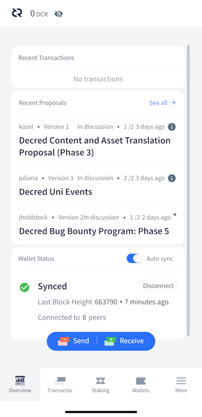
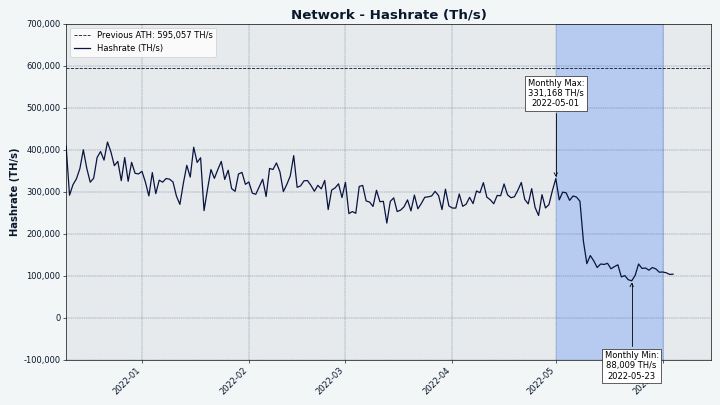

# Decred月报 – 2022 年 5 月

_图片: @saender_

对于 Decred 来说，5月是一个史诗般的月份：

- 获得选民批准的四项共识变更（DCP0007-10）已在主网上激活。
- 核心软件有两个临时bug修复版本，v1.7.2 和 v1.7.3。
- GoDCR v1.7.0 已经发布，这是第一个供主网使用的版本 - 并且已经发布了新的资金提案。
- Decred 杂志推出，这是一个托管和共享 Decred 新闻和其它内容的新平台，由 @phoenixgreen 带头。
- 由于激活了 DCP-0009，所有撤销miss票错误的都已被撤销。
- Politeia 上发布了四项新提案。

内容：

- [激活了四个共识变更](#four-consensus-changes-activated)
- [发布核心软件 v1.7.2 和 v1.7.3](#core-software-v172-and-v173-released)
- [GoDCR v1.7.0 发布](#godcr-v170-released)
- [安卓和iOS钱包v1.7.0发布](#android-and-ios-wallets-v170-released)
- [发展](#development)
- [人员](#people)
- [治理](#governance)
- [网络](#network)
- [生态系统](#ecosystem)
- [外展](#outreach)
- [活动](#events)
- [媒体](#media)
- [讨论](#discussions)
- [市场](#markets)
- [相关外部信息](#relevant-external)

## 激活了四个共识变更

在 v1.7中添加并经利益相关者批准的所有四个[共识升级](https://docs.decred.org/governance/consensus-rule-voting/consensus-vote-archive/)已于 5 月 8 日在[区块657,280](https://dcrdata.decred.org/block/657280)中激活：

- [DCP-0007](https://github.com/decred/dcps/blob/master/dcp-0007/dcp-0007.mediawiki) - 确定新国库每月最大支出的算法已修复。

- [DCP-0008](https://github.com/decred/dcps/blob/master/dcp-0008/dcp-0008.mediawiki) - 现在需要明确的共识升级来定义和允许更新版本。对于 Decred 生态系统中的所有参与者来说，与未来的共识变化整合将更加容易且不易出错。一些工程师甚至会说，完全验证节点拒绝他们无法完全验证的数据是唯一明智的操作方式。通过这次升级，Decred 将硬分叉作为升级共识的最安全和可靠的方式加倍下注，“因为我们可以”。

- [DCP-0009](https://github.com/decred/dcps/blob/master/dcp-0009/dcp-0009.mediawiki) - 矿工现在自动撤销错过和过期的选票。这消除了用户处理撤销的巨大挫败感，尤其是丢失（未备份）赎回脚本的痛苦。钱包代码和 GUI 变得更简单，质押变得更容易。

- [DCP-0010](https://github.com/decred/dcps/blob/master/dcp-0010/dcp-0010.mediawiki) - 每个区块奖励的 50% 从 PoW 矿工重定向到 PoS 选民，将 PoW/PoS/国库的分配比例从 60/30/10 更改为 10/80/10。这有望重新平衡 DCR 的供需，并降低恶意行为者操纵市场的能力。作为副产品，更高的 PoS 奖励使质押 DCR 更具吸引力。

这可能是 Decred 历史上最大的共识升级。

## 发布核心软件 v1.7.2 和 v1.7.3

dcrd 和 dcrwallet v1.7.2于 5 月 11 日[发布](https://twitter.com/decredproject/status/1524430609543831553)- 撰写本文时的最新版本。当启用可选索引时，dcrd 修复了一个罕见且难以命中的情况。dcrwallet 收到了一个修复verifymessage，启用了公共钱包密码的更改，以及一些内部/开发人员的更改。[发行说明](https://github.com/decred/decred-binaries/releases/tag/v1.7.2)。

[Decrediton v1.7.2](https://github.com/decred/decred-binaries/releases/tag/v1.7.2#decrediton-v172)增加了对国库支出投票的支持、更多关于 VSP 质押的信息、更新的 DEX 模块和几个错误修复。v1.7.3于 5 月 18 日紧随其后，修复了 macOS 10.15 并设置了国库支出投票选项。[发行说明](https://github.com/decred/decred-binaries/releases/tag/v1.7.3)。

[验证下载](https://docs.decred.org/advanced/verifying-binaries/)以确保它们未被修改。`6DF634AA7608AF04`这些文件使用以（主键以）结尾的 Decred Release 子密钥进行签名`6DF634AA7608AF04`。

## GoDCR v1.7.0 发布

自 v0.9.0 测试网发布以来，经过近 8 个月的开发，GoDCR 的首次主网版本于 5 月 23 日[宣布](https://www.reddit.com/r/decred/comments/uwa6w2/godcr_desktop_wallet_for_decred_written_purely_in/)。

支持以下功能：

- 基本钱包发送/接收
- 质押（自动购票）
- 通过 StakeShuffle 的钱包隐私
- 提案投票
- 共识规则变更投票
- 消息签名
- 钱包恢复
- 在 Linux、macOS、Windows 和 FreeBSD 上运行

[在此处下载](https://github.com/planetdecred/godcr/releases/tag/v1.7.0)`release@planetdecred.org` 并验证来自（密钥以 结尾）的签名`A3C9EB3218CCC3E8`。

这只是 GoDCR 的开始。接下来是 DEX 交易、硬币选择、国库支出投票，以及从一个统一的代码库构建桌面和移动应用程序的雄心勃勃的目标。检查寻求在 2022-2023 年资助这项工作的提案。

_图片：显示每个子系统摘要的 GoDCR 概览。_

## 安卓和iOS钱包v1.7.0发布

Android 和 iOS 钱包 v1.7.0于 5 月 11 日[发布](https://www.reddit.com/r/decred/comments/umye1t/decred_mobile_wallet_v170_has_been_released_for/)。

自 v1.6.1 以来的更改包括：

- 将 Decred 模块更新到 v1.7.0
- 更新混币服务器证书
- 手动隐私设置改进
- 错误修复和其它小改进

主网 iOS 应用在[App Store](https://apps.apple.com/us/app/decred-wallet/id1462247643)和 [TestFlight](https://testflight.apple.com/join/7KL4VnB2) 上提供测试网版本。

Android 应用程序可在 [Play Store](https://play.google.com/store/apps/details?id=com.decred.dcrandroid.mainnet) 商店中找到。对于高级用户，有一个由 Planet Decred Release 密钥签名的新[APK下载](https://github.com/planetdecred/dcrandroid/releases/tag/v1.7.0)。

## 发展

除非另有说明，否则下面报告的工作具有“合并为主”状态。这意味着该工作已完成、审查并集成到高级用户可以[构建和运行](https://medium.com/@artikozel/the-decred-node-back-to-the-source-part-one-27d4576e7e1c)的源代码中，但在普通用户的发布二进制文件中尚不可用。

<a id="dcrd" />

**[dcrd](https://github.com/decred/dcrd)**

_dcrd 是一个完整的节点实现，为 Decred 在全球的点对点网络提供支持。_

5 月份的总体方向是通过添加优化和删除不需要的代码来进一步利用最近激活的共识更改。

- 通过使用块头而不是检查点来优化[权益节点修剪](https://github.com/decred/dcrd/pull/2943)（减少对后者的依赖）。基于标头的同步操作更有效，并为多对等块下载铺平了道路。
- 追溯修复了撤销[费用限制错误](https://github.com/decred/dcrd/pull/2948)，该错误允许一方在拆分交易中为另一方增加支付给矿工的费用。由于自动撤销议程已激活，因此从未被利用过`mainnet`，也无法被利用。
- 重新设计了[旧块拒绝逻辑](https://github.com/decred/dcrd/pull/2945)，以用块替换检查点的使用assumevalid（在每个版本中都硬编码）。语义已被澄清，以反映“检查点”现在仅用于处理旧分叉，不再用于优化（现在依赖于其他方法）。CLI 选项已--nocheckpoints替换为--allowoldforks. 通过此更改，检查点的作用降至最低，这是可取的，因为它们是一种解决方法。
- 删除了不推荐使用的[地址索引](https://github.com/decred/dcrd/pull/2930)以及相关的 CLI 标志 (--addrindex和--dropaddrindex) 和searchrawtransactionsJSON-RPC。从开发的角度来看，地址索引需要大量维护，它没有被任何值得注意的东西使用，而且无论如何它也不容易提供大多数人想要的地址，这是一个完全平衡，而不是所有个别交易。它提供的所有信息以及更多信息都可以通过 dcrdata 获得。
- 添加了一个对模块进行[基本事务完整性](https://github.com/decred/dcrd/pull/2949)检查的功能blockchain/standalone，这对消费者（例如 DCRDEX）非常有用，因为该模块几乎没有依赖关系。
- 实施了[标头证明存储](https://github.com/decred/dcrd/pull/2938)以及单向数据库升级。这将通过从磁盘存储/加载它们来避免重新计算提交哈希。“区块头承诺”的概念听起来很吓人，但它是一项值得学习的强大技术。提案中对此进行了很好的描述，但简而言之，这些承诺是区块链数据的微小指纹，允许构建快速且安全的轻量级应用程序。目前只有一种类型的承诺——“紧凑型区块过滤器”，它允许轻钱包快速安全地找到用户的交易。未来可能会增加对其他用例的更多承诺。
- 在内部制作[`blockchain`](https://github.com/decred/dcrd/pull/2952)包而不是导出。这是减少导出的包和模块的总数以减少维护负担的持续整体努力的一部分，并最终达到可以遵循根模块的语义版本控制的程度。
- 最近的共识更改启用了持续的[代码](https://github.com/decred/dcrd/pull/2922)[清理](https://github.com/decred/dcrd/pull/2954)。

<a id="dcrwallet" />

**[dcrwallet](https://github.com/decred/dcrwallet)**

随 v1.7.2 补丁发布：

- [修复](https://github.com/decred/dcrwallet/pull/2150) 了签名消息的验证。
- [添加](https://github.com/decred/dcrwallet/pull/2148) `walletpubpassphrasechange`到 JSON-RPC 方法。它允许更改钱包的公共密码。
- 在返回的工单信息中[添加](https://github.com/decred/dcrwallet/pull/2146)了 VSP 主机，使钱包应用可以知道工单是由哪个 VSP 管理的。
- [删除](https://github.com/decred/dcrwallet/pull/2153)了所有选票撤销功能。现在撤销是自动创建的，不需要钱包来处理它。

合并`master`：

- 有关错过和过期票证的最新 dcrd 更改的[兼容性更新](https://github.com/decred/dcrwallet/pull/2158)。
- [修复](https://github.com/decred/dcrwallet/pull/2164)了getstakeinfo命令中的错误（由过期选票的更改引起）。

<a id="decrediton" />

**[Decrediton](https://github.com/decred/decrediton)**

_Decrediton 是一款功能齐全的桌面钱包应用程序，集成了投票、StakeShuffle 混合、闪电网络、DEX 交易等。它在有或没有完整区块链（SPV 模式）的情况下运行。_

v1.7.2 和 v1.7.3 补丁合并并发布：

- 用户现在可以在交易详情中获取[VSP费用交易哈希和费用状态](https://github.com/decred/decrediton/pull/3752)。如果收到的费用交易显示未使用票证的确认状态，但 dcrwallet 认为它尚未确认，则应用程序会在后台处理并更新状态。
- 对[工单状态和工单历史视图进行了改进](https://github.com/decred/decrediton/pull/3751)。现在选项卡在从交易详细信息页面返回后会记住它们的滚动位置。使用无限滚动功能逐渐加载行。
- [删除了撤销](https://github.com/decred/decrediton/pull/3754)选票功能。现在撤销是自动创建的，不需要钱包来处理它。
- 删除了撤销票证功能。现在撤销是自动创建的，不需要钱包来处理它。
- 删除了撤销票证功能。现在撤销是自动创建的，不需要钱包来处理它。
- Electron（Decredtion 所基于的框架）已[升级到 v17.4.2](https://github.com/decred/decrediton/pull/3765)，以修复阻止 dcrwallet/dcrd 在 macOS 10.15 (Catalina) 上启动的问题。
- ~7 个bug修复

_图片：Decrediton 显示每张票的附加 VSP 信息。_

<a id="politeia" />

**[Politeia](https://github.com/decred/politeia)**

_Politeia 是 Decred 的提案系统。它用于向 Decred 国库请求资金。_

后端更改：

- tlog 客户端现在有它[自己的包](https://github.com/decred/politeia/pull/1636)（用于导入遗留提案）。
- Trillian 版本[更新](https://github.com/decred/politeia/pull/1642)到 1.4.1。
- 修复了最小提案[开始日期错误](https://github.com/decred/politeia/pull/1637)。
- 修复[CSRF 错误检查](https://github.com/decred/politeia/pull/1638)。
- 修复了与开始和结束日期相关的[错误消息](https://github.com/decred/politeia/pull/1640)。
- 评论插件[fsck 函数重写](https://github.com/decred/politeia/pull/1641)以修复几个错误。“fsck”是“文件系统检查”的缩写，负责验证数据完整性和重建缓存。

图形用户界面更改：

- 通过替换为修复了[评论表单组件](https://github.com/decred/politeiagui/pull/2760)。formik react-hook-form
- 修复了与[提案开始/结束日期](https://github.com/decred/politeiagui/pull/2771)相关的几个错误。 

pi-ui 库中的更改（Politeia 和 Decrediton 的常见 UI 元素）：

- 支持小部件中的[键盘导航](https://github.com/decred/pi-ui/pull/446)。`DatePicker`
- 在文本输入字段中添加了带有工具提示的[信息图标](https://github.com/decred/pi-ui/pull/447)。

<a id="vspd" />

**[vspd](https://github.com/decred/vspd)**

_vspd 是用于运行投票服务提供商的服务器软件。VSP 24/7 代表其用户投票，不能窃取资金。_

- 12 个提交，代表各种代码优化和重构。

<a id="dcrlnlpd" />

**[dcrlnlpd](https://github.com/decred/dcrlnlpd)**

_dcrlnlpd 代表“DCR LN 流动性提供者守护程序”。_

了解 Decred LN 生态系统中的最新项目：

> 该服务允许在 Decred 网络中运行闪电网络流动性提供者。
> 
> 此 LP 允许远程客户端请求与 LP 关联的节点打开返回请求客户端的 LN 通道。这允许请求客户端有一些入站带宽来接收 LN 付款。
> 
> 为了创建通道，LP 会收取一定的费用，指定为所需通道大小的百分比。 \[[自述文件](https://github.com/decred/dcrlnlpd/blob/941743f09e2d01d5bae36b492de38e49c9565510/README.md)\]

<a id="dcrdex" />

**[DCRDEX](https://github.com/decred/dcrdex)**

_DCRDEX 是由原子交换提供支持的去信任交易的非托管交易所。_

面向用户的变化：

- 添加了对使用[accelerating BTC transactions](https://github.com/decred/dcrdex/pull/1555)收费技术[加速 BTC 交易](https://bitcoinops.org/en/topics/cpfp/)的支持。如果订单能够加速，订单页面将显示一个按钮。单击按钮时，会出现一个弹出窗口，允许用户选择更高的费用。
- 钱包页面添加了一个按钮来[重新创建 BTC SPV 钱包](https://github.com/decred/dcrdex/pull/1507)，因为它仍然有很多可能被破坏的方式。
- 支持使用用户提供的证书更新服务器的[TLS证书](https://github.com/decred/dcrdex/pull/1602)。

内部和开发人员更改：

- 允许在测试网上为 ETH 客户端进行[线束测试](https://github.com/decred/dcrdex/pull/1550)。
- imnet 线束测试[普遍](https://github.com/decred/dcrdex/pull/1603)适用于所有当前支持的资产。
- 实施了签名消息截断修复的[第 3 阶段](https://github.com/decred/dcrdex/pull/1530)。当它被“部署”在许多相互依赖的服务器和客户端上时，修复一个错误是很棘手的，但开发人员有一个聪明的 [4 阶段计划](https://github.com/decred/dcrdex/pull/1526)。
- 现在切换到比特币现金[testnet4](https://github.com/decred/dcrdex/pull/1606)，因为它在 bchd 中是一流的。此外，还为 BCH 的[CashAddr](https://www.reference.cash/protocol/blockchain/encoding/cashaddr/)地址添加了自定义编码器。
- 添加了用于[计算](https://github.com/decred/dcrdex/pull/1597)BTC/DOGE/LTC/BCH 中最近区块的中位数费用的方法。实施了缓存以防止块之间的重复扫描，并在没有足够的数据来估算费用时回退。
- 从[btcsuite 和 go-ethereum](https://github.com/decred/dcrdex/pull/1542)更新到较新的模块。
- 使用[Node.js 18](https://github.com/decred/dcrdex/pull/1617)构建的依赖项更新。
- 编码现在允许超过 65,535 字节的[交易数据](https://github.com/decred/dcrdex/pull/1620)。
- 在几次最初的频繁尝试后，通用[等待和重试功能](https://github.com/decred/dcrdex/pull/1623)被重新设计为逐渐“逐渐减少”（减速）。
- 各种错误修复、依赖项升级和优化。

在 DCRDEX 工作期间，开发人员为上游项目做出了[各种贡献](https://twitter.com/blockchainbuck/status/1532146821300101120)： [btcd](https://github.com/btcsuite/btcd/commits?author=chappjc), [btcwallet](https://github.com/btcsuite/btcwallet/commits?author=chappjc), [go-ethereum](https://github.com/ethereum/go-ethereum/pull/24533), [neutrino](https://github.com/lightninglabs/neutrino/commits?author=chappjc), [zcash](https://github.com/zcash/zcash/commits?author=buck54321)等。

开发团队已经开始讨论[重命名 DCRDEX](https://www.reddit.com/r/decred/comments/v3gxa8/should_we_rebrand_decred_dex/)并正在接受名称和徽标的想法。

> 可能找到了一个供应商来对我们的 Solidity 原子交换合约进行审计。值得注意的是，我们的合同非常简单，我们低于他们的最小订单量。当您不尝试提取交易费用并且没有管理功能时，就会发生这种情况。[[@blockchainbuck](https://twitter.com/blockchainbuck/status/1527105721724190722)\]

_图片：DCRDEX 允许在网络繁忙但您希望尽快进行交易时加速交换。_

<a id="dcrios" />

**[Decred Wallet (iOS)](https://github.com/planetdecred/dcrios)**

- 添加了GitHub 构建[工作流程](https://github.com/planetdecred/dcrios/pull/907)以确保 dcios 构建没有任何错误。
- [更新](https://github.com/planetdecred/dcrios/pull/899)了自动化 UI 测试。

<a id="godcr" />

**[GoDCR](https://github.com/planetdecred/godcr)**

_GoDCR 是一款轻量级桌面 GUI 钱包，集成了质押、隐私、Politeia 投票、共识投票等功能。_

- 现在启用隐私时会过滤掉[默认帐户](https://github.com/planetdecred/godcr/pull/910)。
- 所有[签名的消息](https://github.com/planetdecred/godcr/pull/918)都可以验证，对个人钱包地址的限制已被取消。
- [添加](https://github.com/planetdecred/godcr/pull/923)到调试页面（发送到 docs.decred.org）和交易详情页面（发送到区块浏览器）的重定向模式。
- 重新设计了[关键事件](https://github.com/planetdecred/godcr/pull/907)处理，使其不易出错且更高效。
- 添加到启动画面的[导入仅手表](https://github.com/planetdecred/godcr/pull/943)钱包的选项。
- 创建新钱包时[默认启用](https://github.com/planetdecred/godcr/pull/936)隐私。
- Gio[更新](https://github.com/planetdecred/godcr/pull/934)到最新的稳定版本。
- 底部[导航栏](https://github.com/planetdecred/godcr/pull/948)已取代 479 像素以下屏幕尺寸（移动设备）上的侧栏。
- [修复](https://github.com/planetdecred/godcr/pull/957)了钱包崩溃和提案标题。
- 修复了在 Staking 选项卡中显示[不正确的锁定余额的错误](https://github.com/planetdecred/godcr/pull/956)。
- 修复了[Android](https://github.com/planetdecred/godcr/pull/924)和[FreeBSD](https://github.com/planetdecred/godcr/pull/914)上的构建。
- ~6 个bug修复和一些优化。

GoDCR 的 Android 和 iOS 版本[已经](https://proposals.decred.org/record/0ef42e5/comments/31)在一定程度上发挥了作用，尽管还有很多工作要完善移动/触摸 UX。

_图片：在模拟移动操作系统上运行的 GoDCR_

<a id="dcrdata" />

**[dcrdata](https://github.com/decred/dcrdata)**

_dcrdata 是 Decred 区块链和链下数据（如 Politeia 提案、市场等）的检索工具。_

- 新了使用 Node.js 16 和 18 构建的[依赖项](https://github.com/decred/dcrdata/pull/1913)。

<a id="dcrweb" />

**[decred.org](https://github.com/decred/dcrweb)**

_dcrweb 是 decred.org 网站的源代码。_

- [更新了聊天室](https://github.com/decred/dcrweb/pull/1033)链接。
- [新增](https://github.com/decred/dcrweb/pull/1035)PoW/PoS 奖励共识变更新闻稿。
- [删除了](https://github.com/decred/dcrweb/pull/1037)已失效的交易所。

**其它**

- dcrseeder：DNS 种子终于被[移除](https://github.com/decred/dcrseeder/pull/50)了，并且一个小修复更积极地修剪死节点。

## 人员

欢迎新的首次贡献者在 1 月至 3 月将代码合并为 master：

- arjundashrath ([dcrd](https://github.com/decred/dcrd/commits?author=arjundashrath))
- liukun ([dcrd](https://github.com/decred/dcrd/commits?author=liukun))
- monsa00 ([godcr](https://github.com/planetdecred/godcr/commits?author=monsa00))
- ukane-philemon ([dcrdata](https://github.com/decred/dcrdata/commits?author=ukane-philemon), [dcrdex](https://github.com/decred/dcrdex/commits?author=ukane-philemon), [vspd](https://github.com/decred/vspd/commits?author=ukane-philemon))

这几个月我们没有 Decred Journal，但迎接新的贡献者永远不会太晚。欢迎小伙伴们加入！

截至 6 月 1 日的社区统计数据（与 5 月 2 日相比）：

- [Twitter](https://twitter.com/decredproject) 粉丝: 54,474 (-388)
- [Reddit](https://www.reddit.com/r/decred/) 订阅: 12,631 (+10)
- [Matrix](https://chat.decred.org/) #general 用户: 677 (+15)
- [Discord](https://discord.gg/GJ2GXfz) 用户: 2,305 (+12)
- [Telegram](https://t.me/Decred) 用户: 2,858 (+30)
- [YouTube](https://www.youtube.com/decredchannel) 订阅: ~4,630 (-9), 观看量: 209K (+2K)

请参阅[2022 年 6 月](https://decredcommunity.github.io/social-media-stats/posts/20220604.1)有关 Decred SM 性能的报告，以更深入地了解 2 月与 6 月的数据。

## 治理

5 月份，新[国库](https://dcrdata.decred.org/treasury)收到了 9,407 DCR，价值 39 万美元，本月平均汇率为 41.46 美元。2,950 DCR 从旧国库中用于支付承包商，按 5 月的汇率计算价值 122K 美元，或按 4 月的 60.62 美元计费汇率计算价值 179K 美元。这些款项用于支付 3 月和 4 月的承包商发票。

截至 6 月 12 日，旧国库和新国库的总余额为 795,673 DCR（2390 万美元，30.09 美元）。

Raedah Group 提交了一项新[提案](https://proposals.decred.org/record/0ef42e5)，以资助GoDCR，这是一款内置纯 Go 的桌面 GUI 钱包，随着开发的继续，它还将取代现有的移动钱包。该提案要求为 12 个月提供 25 万美元的资金，比之前在 2021 年 10 月勉强拒绝的提案要多。额外预算是由于工人数量更多、持续时间更长以及用于维护现有 Android/iOS 钱包. 为了回应一些评论，预算从最初的 30 万美元减少了。

5 月份在 Politeia 上发布了四项提案：

- @Exitus[提案](https://proposals.decred.org/record/4fdef29)资助 Decred Journal 和 Politeia Digest 直到 2022 年 12 月。自@bee 宣布停止3 个月以来，DJ 一直处于非活动状态，直到 @Exitus 接管了 4 月刊并最终提出了一个全新的提议。此处发布了有关 2021 年提案的可交付成果和财务的详细报告，其中关键统计数据为 24,800 美元，其中 39,000 美元用于发行 12 期 DJ 和 10 期 PD。新预算的上限为 33,000 美元。

- @kozel[提案](https://proposals.decred.org/record/7057e0b)在 2022 年为 Decred 内容和资产翻译提供资金。关于第 2 阶段的报告显示，在 33,000 美元中仅花费了 8,180 美元，因此第 3 阶段的下限为 20,000 美元。

- 资助 Bug 赏金计划持续到 2023 年 12 月的[提案](https://proposals.decred.org/record/da2f32d)。在过去的 12 个月中，运营成本约为 2,100 美元，并支付了约 1,000 美元作为赏金奖励。新提案的持续时间从 12 个月增加到 18 个月，预算分为 5,000 美元的运营成本和高达 100,000 美元的奖励支付。领导权从@degeri 转移到@jholdstock。

- @juliana的[提案](https://proposals.decred.org/record/6bdffcb)要求 2022 年在乌干达的大学举办 3 场活动，需要 3,575 美元，每次活动预计有 30 人参加。

请参阅 Politeia Digest第 [51](https://blockcommons.red/politeia-digest/issue051/) 期以了解 1 月至 5 月期间的提案活动。

## 网络

**全网算力**: 5 月的[算力](https://dcrdata.decred.org/charts?chart=hashrate&zoom=l2im68kw-l3x1522f&bin=block&axis=time)开始约为 345 Ph/s，结束约为 115 Ph/s，整个月的最低价为 74 Ph/s，最高价为 381 Ph/s。

_图片：挖矿奖励减少后的哈希率下降。_

6 月 1 日矿池[报告](https://miningpoolstats.stream/decred)的算力分布：Poolin 55%、ViaBTC 21%、F2Pool 7%、AntPool 7%、Luxor 5%、BTC.com 4%、CoinMine 0.3%。

6 月 1 日之前实际[开采](https://miningpoolstats.stream/decred)的 1,000 个区块的分布：Poolin 55%、ViaBTC 20%、F2Pool 8%、DsV1GF7 6.5%、BTC.com 6%、Luxor 4%、CoinMin2 0.2%、DsmLNFC 0.1%。

**Staking**: [票价](https://dcrdata.decred.org/charts?chart=ticket-price&zoom=l2im68kw-l3x1522f&axis=time&visibility=true-true&mode=stepped)在217-231 DCR 之间变化，30 天平均价格为 223.6 DCR (+9.4)。

[锁定数量](https://dcrdata.decred.org/charts?chart=ticket-pool-value&zoom=l2im68kw-l3x1522f&scale=linear&bin=block&axis=time)为 8.78-907 万 DCR，这意味着 62.6-63.9% 的流通供应量参与了 Proof of Stake。DCR 和百分比值都是 Decred 的新 ATH。

所有miss和过期的门票已被撤销，从 1,719 张门票中解锁总计 175,957 DCR（平均价格为每张门票 103 DCR）。其中约 45K 的 DCR 已经移动，而剩余的约 131K DCR 可能由于丢失种子和其他原因而丢失。其中一张被撤销的门票来自一个旧街区 767，大约在第一次出现关于高票价的投诉的时候。

所有新miss的选票都将自动撤销，第一个在块657295中被撤销。

**VSP**: 在 6 月 1 日，约 6,900 (+120) 张现场门票由 16台列出的vspd 服务器管理，占门票池的 16.8% (+0.2%)。

自 5 月 8 日链分叉到新规则以来，旧版 (dcrstakepool) 票无法再进行投票。与所有其它关闭/停滞的传统 VSP 不同，6 月 1 日，coinmine.pl 和 decredbrasil.com 报告说它们处于当前区块高度，总共持有 19 张现场门票。我们不确定这是怎么可能的，并且这些选票不包括在上述统计数据中。

**节点**: 根据[PD Analytics](https://analytics.planetdecred.org/nodes)的数据，整个 5 月有大约 185 个可访问节点。

截至 6 月 1 日快照的[节点版本](https://nodes.jholdstock.uk/user_agents)（总共 160 个，仅 dcrd）：v1.7.1 - 41%、v1.7.2 - 20%、v1.7.0 - 12%、v1.7.0 开发版本 - 9%、v1.8.0 开发版本- 4%，v1.6.x - 6%，v1.5.x - 4%。

_图片：混合代币百分比。_

## 生态系统

- 来自[@DCR_Uncle](https://twitter.com/DCR_Uncle)的[big.decred.energy VSP](https://github.com/decred/dcrwebapi/pull/161)现在可在 VSP 列表中使用，费用为 1%。

- Decred Lightning Network Visualizer 的第二个实例在 [decred.lighting](https://decred.lighting/) 中发现，运行与[ln-map.jholdstock.uk](https://ln-map.jholdstock.uk/)相同的代码。

警告：Decred Journal 的作者不知道上述任何服务的可信度。在将您的个人信息或资产信任给任何实体之前，请先进行自己的研究。

## 外展

Monde PR的成就：

- 向加密和金融媒体发布 2 条新闻更新。
- 投出 1 个新闻杰克。
- 回复了 3 个评论请求。
- 获得2次媒体采访。

获得以下新闻文章：

- Invezz 报道了 Decred 向 PoS 共识模型的转变，其中包括来自 @jy-p 的评论。[Invezz](https://invezz.com/news/2022/05/09/decred-shifts-to-majority-proof-of-stake-consensus-model/) 用其他 9 种语言发布了这个故事，包括法语和意大利语。这个故事被联合到 4 家出版物上，包括Bitcoin Insider和Crypto News。
- GoDCR 版本被[CryptoNinjas](https://www.cryptoninjas.net/2022/05/23/decred-blockchain-introduces-new-cross-chain-spv-based-wallet-godcr/) 和 [E-Crypto News](https://e-cryptonews.com/decred-launches-godcr-wallet-with-enhanced-privacy-features/)报道。CryptoNinjas 文章联合了 3 种出版物，包括BitcoinEthereumNews和Global Online Money。

## 活动

**出席：**

- 在摩洛哥卡萨布兰卡举行的为期两天的EMEC EXPO（国际数字化转型展览会）期间，@arij 和 @khalidesi 举办了一个 Decred 展位，并回答了许多关于 Decred 如何工作以及它解决了哪些问题的问题。

- Edson Neto在巴西圣保罗的Bitconf上谈到了Decred 。

**即将到来：**

- 6 月 30 日 -在美国芝加哥举行的 [Decred 聚会](https://www.meetup.com/chicago-decred-meetup/events/286491971/)。消息人士称，至少会有一件 Decred 夹克。

_图片：Edson Neto 在 Bitconf 上的演讲。_

## 媒体

[Decred Magazine](https://www.decredmagazine.com/)由@phoenixgreen [推出](https://twitter.com/DecredSociety/status/1530562659006939136)，旨在将所有 Decred 内容收集到一个地方，为新作家提供一个平台，并存档过去的精彩内容（包括Decred Journal）。后者很有价值，因为网站和博客通常会随着时间的推移“蒸发”其内容，并且变得难以或不可能恢复。截至发稿时，已经导入了大约 300 篇文章，8 位作者明确同意添加他们的内容。Decred 杂志旨在替代之前作为试点项目推出的decredsociety.com 。

**精选文章：**

- [Decred 闪电网络节点设置](https://gist.github.com/dcr-uncle/11b30f44e73b55cc31fb75881f9b4643) @DCR\_Uncle
- [史上最大区块链共识投票上线！](https://www.decredmagazine.com/the-bigest-blockchain-consensus-vote-in-history-goes-live/) @phoenixgreen
- [PoW叛乱](https://www.decredmagazine.com/the-pow-rebellion/) @phoenixgreen

**视频：**

- [Peer to Peer Exchange - Decred 和市场状况](https://www.youtube.com/watch?v=vqzaEdtmCsI) @phoenixgreen @Exitus
- [Decred 每月回顾 - 质押奖励、开发更新、大硬分叉入站增加 2.66 倍！](https://www.youtube.com/watch?v=uOHiDTj9Prs) @Exitus @DajanaDcr
- [DCRDATA 调查一个区块](https://www.youtube.com/watch?v=nsMrdK45cK8)  @phoenixgreen 
- [这个矿工是安静的、盈利的和破碎的 WTF？！](https://www.youtube.com/watch?v=skv8RehpaaU)@VoskCoin
- [Decred 质押奖励刚刚增加了 2.6 倍！让我们传播这个词！](https://twitter.com/DajanaDcr/status/1526306473051045892) (TikTok) @DajanaDcr @Exitus
- [可视化的 Decred 代码历史](https://twitter.com/karamblez/status/1528173850642505728) @karamble

**音频**:

- @phoenixgreen（又名 Decred Society）的视频也可以在anchor.fm 上以[播客格式](https://anchor.fm/decred-society/)提供。

## 讨论

精选的 Reddit 帖子：

- [Weekly Contribution Streaks](https://www.reddit.com/r/decred/comments/v0eus3/weekly_contribution_streaks_tards_unite/) 是 u/ersfbddfgwe 的一项新的每周活动，旨在打破常见的心理障碍“我不能贡献任何东西，因为我不是开发人员 :(”。“规则”很简单：只需出现并写关于你所做的任何事情，无论大小，带有可选的 DCR 地址以获取提示。关于如何更好地对贡献进行排名和奖励的讨论正在进行中。

- 在[Decred Mining Thread](https://www.reddit.com/r/decred/comments/unh7nn/decred_mining/)中，矿工在区块奖励份额从 60% 降至 10% 后，一直在分享挖矿 DCR 的挑战。

精选的 Twitter 讨论：

- 为 DCRDEX实施[SPV交易钱包](https://twitter.com/blockchainbuck/status/1531156971759575040)。这意味着什么以及为什么开发人员专注于 SPV。- @buck54321
- 实施用于创建[以太坊 ERC-20 钱包](https://twitter.com/blockchainbuck/status/1527105720285552641)的自定义工作流程。我们应该做哪些代币，为什么？- @buck54321

## 市场

5 月 DCR 的交易价格在 30.00-58.68 美元 / 比特币 0.00103-0.00190 之间。平均每日价格为 41.46 美元。

@Applesaucesome大约每周一次在新的[Decred Magazine](https://www.decredmagazine.com/author/applesaucesome/)网站上发布对 DCR、加密和更广泛市场的技术分析。

5 月，DCRDEX 促成了约 [~74K DCR](https://github.com/bochinchero/dcrsnapshots/tree/main/2022-05/700)的交易，相当于约 300 万美元。

## 相关外部信息

加密领域的内幕交易越来越受到关注。《华尔街日报》刊登了一篇关于 Binance、Coinbase 和 FTX 交易所上市的可疑内幕交易的文章。该分析由 Argus Inc 根据公共区块链记录进行。

前 OpenSea 产品经理 Nathaniel Chastain 因在 9 月从 OpenSea 头版上的 NFT 上市中获利而失业，现已被纽约南区检察官逮捕并指控内幕交易。尽管有问题的 NFT 不是内幕交易法适用的常见证券，但 DA 声称 Chastain 通过盗用信息伤害了他的雇主（OpenSea）。

演员赛斯格林在一次网络钓鱼事件中失去了他的无聊猿 NFT，由于猿已准备出演他正在开发的新节目白马酒馆这一事实，这一事实变得更加重要。6 月，格林支付了 260,000 美元的赎金以确保猿猴归还，这样节目才能继续进行（没有引发很多关于是否可以使用被盗猿猴图像的版权问题）。

这就是五月的全部内容。在我们的[#journal](https://chat.decred.org/#/room/#journal:decred.org)聊天室中分享您对下一期的更新。

## 关于月报

这是 Decred Journal 第 47 期。[此处](https://xaur.github.io/decred-news/)提供所有问题、镜像和翻译的索引。

来自第三方的大多数信息在经过最低限度的健全性检查后直接从源转发。Decred 月报的作者无法验证所有声明。请提防诈骗并进行自己的研究。

感谢 (字母排列):

- 写作和编辑： bee, bochinchero, Exitus, l1ndseymm, richardred
- 评论和反馈： davecgh, matheusd, phoenixgreen
- 标题图片： saender
- 资助： Decred stakeholders

## 中文社区

* [微博](https://www.weibo.com/DecredProject)
* [微信公众号](https://mp.weixin.qq.com/mp/profile_ext?action=home&__biz=Mzg2NTExNzc3MA==&scene=124#wechat_redirect)
* [bilibili频道](https://space.bilibili.com/425519478)
