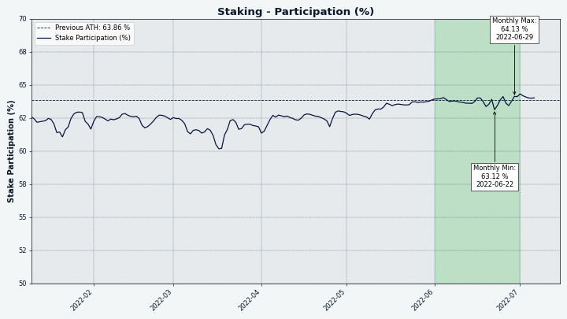

# Decred月报 – 2022 年 6 月

六月亮点：

- DCRDEX 中使用的以太坊合约通过了第一次审计并取得了很好的进展。
- Politeia 忙于处理 3 个批准的提案、1 个被拒绝的提案和 3 个提交的新提案。
- 实现了根据DCP-7 批准的第一笔资金支出交易。
- DCR 在 Guardarian 和 BitPanda 两个交易所上市。

内容:

- [开发进展总结](#development)
- [人员](#people)
- [治理](#governance)
- [网络](#network)
- [生态系统](#ecosystem)
- [外展](#outreach)
- [活动](#events)
- [媒体](#media)
- [讨论](#discussions)
- [市场](#markets)
- [相关外部信息](#relevant-external)

## 开发进展总结

除非另有说明，否则下面报告的工作具有“合并为主”状态。这意味着该工作已完成、审查并集成到高级用户可以[构建和运行](https://medium.com/@artikozel/the-decred-node-back-to-the-source-part-one-27d4576e7e1c)的源代码中，但在普通用户的发布二进制文件中尚不可用。

### dcrd

_[dcrd](https://github.com/decred/dcrd) 是一个完整的节点实现，为 Decred 在全球的点对点网络提供支持。_

- 使用新的零分配[256位整数](https://github.com/decred/dcrd/pull/2787)包优[优化累积工作计算](https://github.com/decred/dcrd/pull/2957)。结果是平均减少了约 100 MiB 的堆使用量，以及约 5% 的初始区块链同步时间。
- 支持更多 Unix 系统和 Windows 上的[干净关闭](https://github.com/decred/dcrd/pull/2958)（由用户注销、关闭终端窗口或系统关闭等事件触发）。
- 在重组期间将交易添加到内存池的[颠倒顺序](https://github.com/decred/dcrd/pull/2956)，以更正特殊情况下交易链统计的计算。这一变化有助于确保矿工最大限度地提高跨重组的大型交易链的费用。到目前为止，旧代码没有任何问题，因为块未满且重组很少见。
- [删除](https://github.com/decred/dcrd/pull/2961)了随着地址索引的删除而变得不需要的支出日志修剪代码。
- 明确[拒绝](https://github.com/decred/dcrd/pull/2963)treasurybase交易。在DCP-6激活时，每个区块都需要有一笔treasurybase交易，向国库支付所需的补贴。“独立”是不属于区块的未经确认的交易。treasurybases作为独立交易没有意义，因为它们仅在块生成过程的一部分时才有效。它们已经被隐含地拒绝了，这种变化只会使其作为一种防御性编码形式更加明确，以防未来的变化违反那些隐含的假设。
- [删除](https://github.com/decred/dcrd/pull/2964)了允许低费用/免费交易被中继和挖掘的策略。它在过去以一些缺点为代价达到了它的目的。现在不需要它了，用户可以使用额外的交易（又名 Child Pays For Parent - CPFP）来提高“卡住”交易的优先级。相关--norelaypriority和--limitfreerelayCLI 标志已弃用。
- 约 5 个较小的改进 PR。

### dcrwallet

_[dcrwallet](https://github.com/decred/dcrwallet)是命令行和图形钱包应用程序使用的钱包服务器。_

- 在查询节点的 HTTPS 播种器时，[不需要弃用](https://github.com/decred/dcrwallet/pull/2168)的 V1 紧凑型过滤器支持。

### Decrediton

_[Decrediton](https://github.com/decred/decrediton) Decrediton 是一款功能齐全的桌面钱包应用程序，集成了投票、StakeShuffle 混合、闪电网络、DEX 交易等。它在有或没有完整区块链（SPV 模式）的情况下运行。_

- 在撤销交易页面中添加了撤销的[选票哈希](https://github.com/decred/decrediton/pull/3770)。
- 修复了“国库支出”选项卡上的[加载按钮](https://github.com/decred/decrediton/pull/3769)。
- 修复了禁用 UI 动画时[滚动不起作用](https://github.com/decred/decrediton/pull/3771)的问题。
- 扩展自动化测试以验证最近的修复。

### Politeia

_[Politeia](https://github.com/decred/politeia)  Decred 的提案系统。它用于向 Decred 国库请求资金。_

后端：

- 通过支持 SIGTERM，更新和改进了politeiavoter 中的[信号处理逻辑](https://github.com/decred/politeia/pull/1644)。在 Windows 上，如果用户注销或系统正在关闭，这将彻底关闭 poliiavoter。
- 改进了 dbutil 工具中的[身份记录](https://github.com/decred/politeia/pull/1647)。
- 改进了 MySQL 键值存储实现中的[错误处理](https://github.com/decred/politeia/pull/1650)。
- ~2 个较小的改进 PR。

图形用户界面：

- 支持[下拉标题](https://github.com/decred/pi-ui/pull/455)自定义。
- 修正了[空评论](https://github.com/decred/politeiagui/pull/2783)的提交。
- 较小的优化和改进。

GUI 迁移到新的[插件架构](https://github.com/decred/politeiagui/tree/master/plugins-structure#politeiagui---plugins-structure)：

- 实现了[通用侦听器](https://github.com/decred/politeiagui/pull/2769)，可以订阅并对任何插件中的操作和状态更改做出反应。
- [提案的视觉增强](https://github.com/decred/politeiagui/pull/2780)：处理审查/放弃的提案，处理空列表，使徽标可点击。
- 实施了[新提案](https://github.com/decred/politeiagui/pull/2751)页面。
- 实现了插件的[默认行为](https://github.com/decred/politeiagui/pull/2775)，以改善新插件和类似 Politeia 应用程序的开发人员的体验。
- 实施[提案附件](https://github.com/decred/politeiagui/pull/2792)展示。
- 改进了用户体验和[提案版本差异](https://github.com/decred/politeiagui/pull/2789)的处理。
- 固定导航到[外部链接](https://github.com/decred/politeiagui/pull/2793)。
- 修复了指向提案列表[评论的链接](https://github.com/decred/politeiagui/pull/2802)。
- 修复了 GUI 主题在页面刷新时[不保存](https://github.com/decred/politeiagui/pull/2801)的问题。

### vspd

_[vspd](https://github.com/decred/vspd) 用于运行投票服务提供商的服务器软件。VSP 24/7 代表其用户投票，不能控制用户资金。_

- 更多重构以[删除全局变量](https://github.com/decred/vspd/issues/339)以使代码更可重用。

### 闪电网络

_[dcrlnd](https://github.com/decred/dcrlnd) 是 Decred 的闪电网络节点软件。闪电网路支持即时和低成本的交易。_

- 添加了一个新的[Initial Chain Sync](https://github.com/decred/dcrlnd/pull/158)服务，该服务允许跟踪初始链同步过程的进度，并且对于连接到仍处于早期启动阶段的 dcrlnd 实例的客户端很有用，以便为用户提供更好的反馈。
- 修复了在 SPV 模式下[运行嵌入式](https://github.com/decred/dcrlnd/pull/159) dcrwallet 安装时文件的预期位置。`peers.json`
- 4 次提交，改进较小。

### DCRDEX

_[DCRDEX](https://github.com/decred/dcrdex) 是一个非托管、尊重隐私的去中心化交易所，由原子交换提供支持。_

面向用户的变化：

- 添加了对[混币DCR帐户](https://github.com/decred/dcrdex/pull/1498)的支持。
- 将取消按钮更改为[微调器](https://github.com/decred/dcrdex/pull/1640)并报告表单中的任何错误。
- 修复了服务器系统时钟[落后于](https://github.com/decred/dcrdex/pull/1667)客户端时显示的订单年龄。
- 允许用户在同一 DEX 服务器的[不同主机名](https://github.com/decred/dcrdex/pull/1605)之间切换。
- 添加了一个不会从金额中减去费用的[发送操作](https://github.com/decred/dcrdex/pull/1611)，这与提款操作不同。
- 添加了对[原生（内置）DCR 钱包](https://github.com/decred/dcrdex/pull/1633)的SPV 支持。
- [添加](https://github.com/decred/dcrdex/pull/1659)了对比特币核心 v23中默认的描述符钱包的支持。

资产支持进度：

- [添加](https://twitter.com/blockchainbuck/status/1532546291783319552)了 InterFi Network 执行的第一次 ETH [智能合约审计的结果](https://github.com/decred/dcrdex/pull/1643)（反映在他们的[repo](https://github.com/interfinetwork/smart-contract-audits/blob/audit-updates/DecredDEX_AuditReport_InterFi.pdf))中）。审计得出的结论是，Solidity 代码具有“低风险严重性”，并且“与活跃所有者相关的 Decred DEX 的中心化风险为 NULL”。
- 更新到最新的[Solidity编译器](https://github.com/decred/dcrdex/pull/1679)。
- 添加了对[Zcash](https://github.com/decred/dcrdex/pull/1570)的支持（解码块和交易、签名输入、测试）。
- 升级到[Litecoin v0.21.2](https://github.com/decred/dcrdex/pull/1536)。添加了块和交易数据的自定义解码以支持 Litecoin 的[新扩展块](https://github.com/litecoin-project/lips/blob/master/lip-0002.mediawiki) 和 [MimbleWimble侧链](https://github.com/litecoin-project/lips/blob/master/lip-0003.mediawiki)。
- 支持所有市场的通用[负载测试](https://github.com/decred/dcrdex/pull/1656)。

内部、开发人员和其它更改：

- 重新设计了[连接管理](https://github.com/decred/dcrdex/pull/1474)，使其更加健壮并拥有更好的 API。
- 在 dexcctl 输出中打印更好的[版本和兼容性信息](https://github.com/decred/dcrdex/pull/1645)。
- 添加了用于在 simnet 上运行不同的客户端线束[测试组合的实用程序](https://github.com/decred/dcrdex/pull/1632)。
- 添加了[计量](https://github.com/decred/dcrdex/pull/1629)，其中新块的处理不会比每 10 秒更频繁地触发。例如，在以太坊中，偶尔会在一秒钟内生成几个块。
- 修复了交换代码中的内存泄漏。
- 7 个较小的修复和改进。
- ~9 个 bug 修复。

### GoDCR

_[GoDCR](https://github.com/planetdecred/godcr) 是一款轻量级桌面 GUI 钱包，集成了质押、隐私、Politeia 投票、共识投票等功能。_

功能开发：

- 允许从[十六进制私钥](https://github.com/planetdecred/godcr/pull/950)恢复钱包。它还在钱包备份页面上显示私钥十六进制代码。
- 开启隐私后，自动购票工具将只允许选择一个[混币账户](https://github.com/planetdecred/godcr/pull/958)来为购票提供资金。它还会重置之前保存的配置，以防止意外使用未混合的资金。
- 在[DEX 注册流程](https://github.com/planetdecred/godcr/pull/900)中添加了费用资产选择器。

针对移动设备的优化：

- ~11 个修复和更改，以增强[移动设备](https://github.com/planetdecred/godcr/pull/963)布局的可用性。
- 大约 11 个针对移动屏幕的[布局修复](https://github.com/planetdecred/godcr/pull/971)。

UI设计更新：

- 开始更新[“V2”设计](https://github.com/planetdecred/godcr/pull/969)。这将添加主应用导航并实现钱包选择页面。
- 更新了[钱包视图](https://github.com/planetdecred/godcr/pull/996)以支持多种资产。完全实施后，用户可以选择创建 Decred 或比特币钱包，这将补充 DEX 交易集成。
- 更多选项卡的新 V2[布局](https://github.com/planetdecred/godcr/pull/1002)和样式。
- 将[安全工具页面](https://github.com/planetdecred/godcr/pull/998)更新为 V2 设计。

内部变化：

- 新的字符串变量已[本地化](https://github.com/planetdecred/godcr/pull/906)，以方便翻译成其他语言。
- 撞了[gioui 版本](https://github.com/planetdecred/godcr/pull/964)。
- 重构页面和模式[导航](https://github.com/planetdecred/godcr/pull/972)以消除重复和单独的关注点。
- 为包添加了[单元测试](https://github.com/planetdecred/godcr/pull/980)。`app`向 GitHub 工作流程添加了运行测试。

Bug修复：

- 修复了[无法访问](https://github.com/planetdecred/godcr/pull/970)仅限观察的钱包设置菜单的问题。
- 修复了删除观察专用钱包时的[崩溃问题](https://github.com/planetdecred/godcr/pull/954)。
- 修复了打开治理页面时的[崩溃问题](https://github.com/planetdecred/godcr/pull/979)。
- 修复了 Windows 上出现的意外[命令提示符](https://github.com/planetdecred/godcr/pull/973)窗口。
- 修复了在“治理”选项卡上[不起作用的按钮](https://github.com/planetdecred/godcr/pull/1000)。修复了由于除以零而导致的应用程序崩溃。
- 修复了更新的 gioui 包的[关键事件处理](https://github.com/planetdecred/godcr/pull/974)。

_图片：GoDCR 中改进的移动布局。_

### dcrdata

_[dcrdata](https://github.com/decred/dcrdata) 是 Decred 区块链和链下数据（如 Politeia 提案、市场等）的浏览器。_

- 在 UI 上使用[剪贴板API](https://github.com/decred/dcrdata/pull/1917)。
- 删除了实验性[CockroachDB](https://github.com/decred/dcrdata/pull/1902)支持。
- 修复了不正确的[投票状态](https://github.com/decred/dcrdata/pull/1919)显示。
- 启动了[dcrdata app v6.2](https://github.com/decred/dcrdata/pull/1922)的开发周期，该应用程序将针对 Decred/dcrd v1.8。将模块撞到v8dcrdata并进行了第一次重大更改和重构。

### TinyDecred

_[TinyDecred](https://github.com/decred/tinydecred) 是一个用于集成 Decred 的 Python 工具包。它包括一个基于 PyQt5 的实验性轻型 GUI 钱包。_

@buck54321 分享了他自 2021 年初以来一直在工作的 TinyDecred 第二版的[更新](https://matrix.to/#/!pzavcGbNMqkWfglXQD:decred.org/$ci88l_0Qa7W_uNgz12KXXs5fV49FmFjmuANJMAWevcg)：

- 有可用的比特币和 Decred SPV 钱包，可以在 Python（或任何其他具有 C [FFI](https://en.wikipedia.org/wiki/Foreign_function_interface)的语言）中导入和使用。
- TinyWallet 2 的很大一部分是用 Go 编写的，将 dcrwallet、btcwallet 和 dcrlnd 东西组合在一个 C 共享接口后面。
- 由于一堆钱包代码转移到 Go 中，直接使用 dcrwallet，现在可以（对 dcrlnd 进行一些小的修改）在 Lightning 上使用 TinyWallet 2。 
- TinyWallet 2 旨在通过支持网络应用程序的任何平台使用。这包括所有主要的桌面和移动平台以及浏览器扩展。
- 为了演示这项技术，TinyWallet 已经通过 Lightning 构建了钱包内私人聊天原型，以及一个您的钱包可以与之交互的网站，以引导用户打开 Lightning 频道，甚至找到其他人添加到他们的通讯录中。
- TinyWallet 2 将集成 DEX 以直接在钱包中交易 DCR/BTC。

其中很多仍在进行中，但已经非常令人兴奋。阅读 Matrix 中的[完整帖子](https://matrix.to/#/!pzavcGbNMqkWfglXQD:decred.org/$ci88l_0Qa7W_uNgz12KXXs5fV49FmFjmuANJMAWevcg)并加入[#tinydecred](https://matrix.to/#/#tinydecred:decred.org/)聊天以关注开发。

### 用户文档

_[dcrdocs](https://github.com/decred/dcrdocs) 是 Decred[用户文档](https://docs.decred.org/)的源代码。

- 向共识投票存档添加了 [v1.7 共识投票](https://github.com/decred/dcrdocs/pull/1197)。还添加了实施这些共识更改的 Decred 软件的版本和发布日期。
- [DCP-10](https://github.com/decred/dcps/blob/master/dcp-0010/dcp-0010.mediawiki)的更新：发行页面的新数字和图表，文档主页上更新的块奖励值。
- [修复暗模式图像](https://github.com/decred/dcrdocs/pull/1199)。
- 发行页面图更改为 [SVG](https://github.com/decred/dcrdocs/pull/1200)，因为它们可以更好地扩展，并且在将来需要时更容易修改。
- 将 [CoinShuffle++](https://github.com/decred/dcrdocs/pull/1204) 服务器名称更新为[mix.decred.org](https://mix.decred.org/)。请注意，它还使用新证书。

_图片：更新的 DCR 发行预测。_

### decred.org

_[dcrweb](https://github.com/decred/dcrweb) 是 decred.org 网站的源代码。_

- 向 Exchanges 页面添加了[免责声明](https://github.com/decred/dcrweb/pull/1043)，让用户知道只有 DCRDEX 是自托管的，不会请求其它信息。
- 在多次讨论达成普遍共识后删除了[贡献者页面](https://github.com/decred/dcrweb/pull/1047)。
- [更新](https://github.com/decred/dcrweb/pull/1048)了 Hugo、nginx 和 Lottie webplayer。
- 删除了过时的[1.6 Release](https://github.com/decred/dcrweb/pull/1049)页面。
- 将 GoDCR[添加](https://github.com/decred/dcrweb/pull/1044)到钱包页面。

### 其它

- @degeri 发布了他对 Bug Bounty 计划的[最新更新](https://github.com/decred/dcrbounty/pull/88)。一份漏洞报告已披露 - Android 和 iOS 钱包缺乏屏幕截图保护，此问题已得到修复。恭喜@trapp3rhat 加入名人堂！

## 人员

截至 7 月 1 日的社区统计数据（与 6 月 1 日相比）：

- [Twitter](https://twitter.com/decredproject) 粉丝: 54,380 (-94)
- [Reddit](https://www.reddit.com/r/decred/) 订阅: 12,636 (+5)
- [Matrix](https://chat.decred.org/) #general 用户: 689 (+12)
- [Discord](https://discord.gg/GJ2GXfz) 用户: 2,326 (+21)
- [Telegram](https://t.me/Decred) 用户: 2,810 (-48)
- [YouTube](https://www.youtube.com/decredchannel) 订阅: 4,630 (+0), 观看: 210K (+1K)

## 治理

6 月，[新国库](https://dcrdata.decred.org/treasury)收到 9,134 个 DCR，价值 25.6 万美元，6 月平均汇率为 28.06 美元。2,426 DCR 用于支付承包商费用，按 6 月的汇率计算价值 68,000 美元，或按 5 月的 41.46 美元计费汇率计算价值 100,000 美元。

随着 DCP-0007 的激活，再次可以使用适当的利益相关者批准的方法从新国库中向承包商付款。该交易在 6 月 27 日达到了要求的投票门槛（4,822 票赞成票和 0 票反对票），这意味着投票在 10 天内结束，而不是全部可能的 12 天，因为无论剩余票数如何，都保证通过，因此投票率在有机会投票的约 14,400 张票中，约 33%（超过 20% 的法定人数）。有 23 个产出，表明当月支付的承包商/中介人数大致为这个数量，金额从 2.87 DCR 到 767 DCR。查看[2021年5月的issue](202105.md#new-treasury-activated)，了解新国库的运作方式。

截至 7 月 3 日，旧国库和新国库的总余额为 799,639 DCR（1790 万美元，22.39 美元）。

6 月份提交了三项新提案：

- [Decred 巴西提案](https://proposals.decred.org/record/7f1d013)要求为巴西的社交媒体内容制作和活动提供 22,000 美元的预算，由 @victorguedes 领导。

- [GoDCR提案](https://proposals.decred.org/record/0ef42e5)要求从最初的 300,000 美元下调 250,000 美元，以继续开发 GoDCR 一年。GoDCR最初由国库资助，但 2021 年 10 月，第二次申请200,000 美元的资金被 49% 赞成票和 73% 投票率的利益相关者拒绝。

- [Decred Magazine](https://proposals.decred.org/record/3bb2c7e)已申请 34,000 美元，用于在 @phoenixgreen领导的新网站DecredMagazine.com上进行一年的内容制作和聚合。

对四项提案进行了投票，其中三项获得通过，一项未达到法定人数要求：

- 资助 Decred Journal 和 Politeia Digest的提案以 99% 的赞成票和 56% 的投票率获得批准。

- 资助 Decred 内容和资产翻译的提案以 99% 的赞成票和 56% 的投票率获得批准。

- 为继续执行 Bug Bounty 计划提供资金的提案以 99% 的赞成票和 56% 的投票率获得批准。

- 资助乌干达大学活动的提案以 47% 的赞成票和 6% 的投票率被拒绝。

有关已投票提案的回顾，请参见5 月刊，有关 6 月提案的更多详细信息，请参见 Politeia Digest第 52期。

## 网络

**全网算力**: 6 月份的[算力](https://dcrdata.decred.org/charts?chart=hashrate&zoom=l3n3qjwe-l5batou0&bin=block&axis=time&visibility=true-false)开始约为 117 Ph/s，结束为 85 Ph/s，整个月的最低价为 68 Ph/s，最高价为 132 Ph/s。

_图片：哈希率已经稳定在 100 Ph/s 左右。_

7月1日矿池[报告](https://miningpoolstats.stream/decred)的算力分布：Poolin 51%，ViaBTC 20%，F2Pool，17%，AntPool 7%，BTC.com 4%，LuxorTech 1.2%，CoinMine 0.5%。

截至 7 月 1 日实际开采的 1,000 个区块的分布：Poolin 50%、ViaBTC 20%、BTC.com 5%、LuxorTech 1.3%、CoinMine 0.3%、未知 24.1%。

**Staking**: 票价在216-235 DCR 之间变化，30 天平均价格为 223.7 DCR (+0.1)。

锁定数量为 8.97-917 万 DCR，这意味着 62.9-64.2 %的流通供应量参与了Staking。

_图片：Staking 参与爬升。_

**VSP**: 在 7 月 1 日，约 7,150 (+250) 张现场票由列出的vspd 服务器管理。这 16 个 VSP 共同管理了 17.3% 的票务池 (+0.5%)。

前 3 名的收益者是 stakey.com (+408, +19%)、ultravsp.uk (+295, +101%) 和 stakeminer.com (+127, +23%)。

**节点**: 根据[PD Analytics](https://analytics.planetdecred.org/nodes)的数据，整个 6 月份有大约 180 个可访问节点。

[Decred Mapper](https://nodes.jholdstock.uk/user_agents)在 7 月 1 日捕获的节点版本（总共 118 个，仅 dcrd）：v1.7.1 - 41%，v1.7.2 - 26%，v1.7.0 - 12%，v1.7.0 开发版本 - 8%，v1.8.0开发版本 - 3.4%，v1.6 系列 - 6.8%，v1.5 系列 - 0.9%，v1.4 系列 - 2.5%。

[混币](https://dcrdata.decred.org/charts?chart=coin-supply&zoom=jz3q237o-la8vk000&scale=linear&bin=day&axis=time&visibility=true-true-true)的份额在 59.8- 60.2%之间变化。每日混合量在 160-455K DCR 之间变化。

截至 7 月 1 日（与 6 月 1 日相比）， Decred 的[闪电网络](https://ln-map.jholdstock.uk/)已经看到 44 个节点 (-1)、72 个通道 (-6)，总容量为 36.7 DCR (-4.8)。

## 生态系统

[Guardarian](https://guardarian.com/)宣布可以在他们的平台上以法定货币买卖 DCR。支持的法定货币是欧元、美元和英镑，它们可以通过万事达卡、维萨卡、SWIFT、SEPA 和 Faster Payments 等支付处理器发送。法币支付直接进入用户的银行账户，而购买的硬币直接进入用户的钱包。有最低购买金额（30 欧元）和服务费（2.49 欧元）被添加到交易所。Guardarian 在爱沙尼亚获得许可。

[Bitpanda](https://www.bitpanda.com/en)宣布DCR在其交易所上市，并承认其开放治理和可持续资金。Bitpanda总部位于奥地利维也纳。

BisonPool[透露](https://twitter.com/BisonPool/status/1540362478588203011)，这将是一项托管质押服务，允许用户以不到一张完整的票（最近约为 220 DCR）进行质押。该消息是在 Twitter 上的取笑展示了一张从 3 个部分购买的门票，每个部分大约 80 DCR 之后发布的。由于该服务的监管性质，该公告在 Matrix #media 会议室中受到了一些批评。BisonPool 前来回应并解释他们的愿景和战略

[JobsOnBlocks](https://jobsonblocks.com)是一个新的工作委员会，用于提供/请求工作以获得加密货币报酬。站点测试版于 6 月推出，截至撰写本文时，它支持 5 个硬币并发布了 3 个工作。创始人在我们的#trading 聊天中放弃了公告，称自发布以来就支持 DCR：

> 您可以发布工作并选择 dcr 作为支付硬币，仅为野牛船员添加 😉 \[[@Toussaint](https://matrix.to/#/!lDZCzVQjFoJsXMPkvr:decred.org/$uxS2SUWZRUVbKH9DMiok_uuiomuZmq82q7bI61wDuW0)\]

@jz[发布了一个脚本](https://twitter.com/jz_bz/status/1535350896091189249)curl -L node.dcr.pw | bash，用于使用简单的命令在流行的基于 systemd 的 Linux 发行版上启动 Decred 全节点。最好不要盲目地从网上运行代码并在执行前阅读它（脚本只有 40 行）。

VSP 用户可能会发现这两张表对于决定使用哪个提供商很有用：一张总结了传统 VSP是如何关闭的，另一张显示了 VSP 运营商如何升级他们的服务器（越早越好）。

在一位用户收到一封要求在 6 月 10 日之前提取所有资金的电子邮件后，Reddit 上传闻Luxor 的 Decred 矿池关闭。该电子邮件的屏幕截图有一个明显的事实错误“DCR 将用于 PoS”。虽然 Decred 已将PoW矿工的区块奖励份额从 60% 降低到 10%，但没有意图甚至讨论切换到纯 PoS。截至 7 月 9 日， [@LuxorTechTeam](https://twitter.com/LuxorTechTeam)没有官方评论，他们的 API 仍然报告 1.5 Ph/s（网络总 95 Ph/s 的 1.5%）和 107 名矿工的哈希率。

警告：Decred 月报的作者不知道上述任何服务的可信度。在将您的个人信息或资产信任给任何实体之前，请先进行自己的研究。

加入我们的[#ecosystem](https://chat.decred.org/#/room/#ecosystem:decred.org)聊天室，关注 Decred 生态系统更新。

## 外展

Monde PR的成就：

- 将 Decred 推向 5 个 PR 机会。
- 回复了 1 项评论请求。
- 获得1次媒体采访。

获得以下新闻文章：

- [Invezz](https://invezz.com/news/2022/06/01/co-founder-jake-yocom-piatt-discusses-alternate-stores-of-value-to-bitcoin/)和@jy-p的视频采访谈论了 Decred 的治理模型、混合 PoW/PoS 模型、项目资金、隐私、未来前景以及我们如何与比特币进行比较。
- Invezz 用其他 10 种语言发布了这个故事，包括[荷兰语](https://invezz.com/nl/nieuws/2022/06/01/mede-oprichter-jake-yocom-piatt-bespreekt-alternatief-oppotmidd-voor-bitcoin/)和[瑞典语](https://invezz.com/sv/nyheter/2022/06/01/medgrundaren-jake-yocom-piatt-diskuterar-alternativa-vardebutiker-till-bitcoin/)。
- 这个故事还被联合到三个出版物上，包括[Bitcoin Insider](https://www.bitcoininsider.org/article/168719/co-founder-jake-yocom-piatt-discusses-alternate-stores-value-bitcoin)和[Crypto News BTC](https://cryptonewsbtc.org/2022/06/01/co-founder-jake-yocom-piatt-discusses-alternate-stores-of-value-to-bitcoin/)。
- @jy-p 出现在[CoinJournal 播客](https://coinjournal.net/news/interview-with-decred-project-lead-jake-yocom-piatt/)上，讨论了一系列主题，包括主权货币、真正的去中心化、DEX 和隐私。
- CoinJournal 在其挪威和芬兰网站上发布了[采访](https://coinjournal.net/no/nyheter/intervju-med-decred-prosjektleder-jake-yocom-piatt/)。
- 采访也被联合到[Bitcoin Insider](https://www.bitcoininsider.org/article/172467/interview-decred-project-lead-jake-yocom-piatt)。

## 活动

**出席：**

- @arij与摩洛哥 JCI [签署了合作伙伴关系](https://decredcommunity.github.io/events/index/20220601.1)，这是全球青年商会国际非政府组织在非洲和阿拉伯世界的第一个分支机构。该合作伙伴关系包括为该组织和其他公司的成员提供有关区块链和 Decred 技术的培训。

**即将到来：**

- 10 月 6 日至 7 日，Decred 将参加在巴西圣保罗举行的[加密论坛](https://twitter.com/Decred_BR/status/1540102065128603649)。

## 媒体

[Decred Magazine](https://www.decredmagazine.com/)在 6 月份增加了 12 个帖子，并继续充当Decred月报和Politeia Digest的镜像，具有轻量级页面等不错的功能，并且在没有 JavaScript 的情况下也能正常工作。@phoenixgreen 制作了 3 个关于 Decred 杂志的视频：

- [Decred Magazine 概述](https://www.youtube.com/watch?v=OQ9adrXDJNo)
- [成为贡献者](https://www.youtube.com/watch?v=g2BE1GoNE98)
- [隐私、翻译和备份](https://www.youtube.com/watch?v=RJy8Ky7Ovhc)

作者通缉！在 Matrix [#writers](https://chat.decred.org/#/room/#writers:decred.org)聊天中联系 @phoenixgreen 或在Twitter 上联系[@DecredSociety](https://twitter.com/DecredSociety)。

**视频:**

- [Decred 采访：联合创始人 Jake Yocom-Piatt 讨论了比特币的替代价值存储](https://www.youtube.com/watch?v=_QsWw4EDPyg)
- [改变规则 - Decred 和市场状况与 Dave Collins ](https://www.youtube.com/watch?v=9rzyYxS3T74)
- [@phoenixgreen 的 DCRDATA 增长和采用图表](https://www.youtube.com/watch?v=KXfqaYyCUmE)
- [GoDCR：Decred 的新轻量级 SPV 钱包](https://www.youtube.com/watch?v=IDilYl3GhKw)
- [DCRDATA - @phoenixgreen 比较链上数据](https://www.youtube.com/watch?v=BDKgjgHN83A)
- [与 Jake Yocom-Piatt 的访谈：主权、隐私、Decred的迄今为止](https://www.youtube.com/watch?v=EAiIAbKQAjI)

**艺术与娱乐:**

- u/ersfbddfgwe 创建了一个[音乐曲目](https://soundcloud.com/openbeats/ob1)作为 Open Beats 理念的一部分，其目标是提供社区制作的音乐，可免费用于任何与 Decred 相关的内容

**翻译:**

- Decred 月报 4月被[翻译成](https://xaur.github.io/decred-news/)阿拉伯语 (@arij) 和中文 (@Dominic)。2022 年 5 月号也被翻译成中文（@Dominic）。谢谢你们！

## 讨论

选定的 Reddit 帖子：

- [我们应该重新命名 Decred DEX 吗？](https://www.reddit.com/r/decred/comments/v3gxa8/should_we_rebrand_decred_dex/)通过@buck54321。@bee 已在一张表中收集了迄今为止发布的 12 个名称创意。“ QuackDEX ”有机会。
- Weekly Contributions 计划在第 1周、第 2 周和第 3 周进行，一些老前辈试图通过他们的提交来引导它。从运行一个完整的节点到制作一个很酷的推文线程或模因都很重要，所以不要犹豫参与！

选定的 Twitter 讨论：

- @jy-p 评论说，中央银行将自己逼入绝境，FRS 不得不在[允许通货膨胀或导致经济衰退之间](https://twitter.com/behindtext/status/1537151269357375490)之间做出选择，这为加密货币提供了巨大的机会，尽管预计不会一帆风顺。
- Vitalik Buterin在回应 Dan Robinson 关于改变比特币的民意调查时暗中推动了“2013-15 时代的设计，其中你将 PoW 和 PoS 块交织在一起”，但没有提及任何实施这些设计的具体项目，希望能在大家之间建立预期和讨论。观众。

## 市场

6 月 DCR 的交易价格在 20.00-41.19 美元 / 比特币 0.00102-0.00141 之间。平均价格为 28.06 美元。

@Applesaucesome 发布了两个双周[市场](https://www.decredmagazine.com/bear-market-blues/)概览，其中包含有关加密货币和更广泛市场的图表和评论。

> 如果我们打开这两个指标，我们可以发现两者之间存在很强的融合。如果您将 2 年 MA 乘数的买入区域与最低 Mayer Multiple 区间内的价格走势结合起来，您会发现您本可以在这些区域大量囤积，然后等待熊市结束。这会一样吗？只有时间会给出答案。另外，不要对自己的钱不负责任。

_图片：组合的 2Y MA 乘数和 Mayer 乘数可能发出买入区域的信号。_

_图片：DCRDEX DCR 月交易量。_

## 相关外部信息

加密货币市场在 6 月份出现了大幅下滑，尽管这种与非加密货币市场更广泛的抛售同时出现，但加密货币领域也出现了围绕中心化实体破产和对传染性坏账的担忧可能会消灭有影响力的参与者的特殊问题。加密市场。此次平仓的主要线索之一涉及三箭资本 (3AC)，这是一家对 LUNA 倒闭风险敞口严重的对冲基金，然后开始苦苦挣扎在加密资产价格暴跌时满足追加保证金要求——部分原因是出售 Terra Foundation 的 BTC 储备以试图支撑 TerraUSD 的暴跌价格。3AC 创始人的行为凸显了这些中心化实体之间交易的不透明性，3AC 创始人曾是非常活跃的社交媒体用户，据报道，他们在很长一段时间内隐瞒了每个人的资金欠款。在六月的过程中，它已经慢慢揭晓许多大型行业参与者已经在 3AC 上投入了资金（这反过来又在 Anchor 协议中投入了大量资金，以获得 TerraUSD 20% 的收益率），现在预计不会看到很多回报。令人惊讶的是，加密市场的此类重大事件在一段时间内大多是通过对相关方在 Twitter 上分享他们的调查结果的链上调查而为人所知的——并且这些各方与之交易的链上实体通过市场动荡，表现符合观察者的预期和预测。

链上调查还揭示了市场参与者宁愿保密的事情，比如他们的杠杆头寸将被清算的价格。它似乎是被迫出售资产以满足 DeFi 平台上的追加保证金要求，这​​提醒观察者注意 3AC 的问题。对于 Solana 链借贷服务 Solend，一个特定的鲸鱼的清算价格和他们的头寸规模（> 池存款的 95%）足以引起投票，以确定是否应授予 Solend Labs 的“紧急权力”以采取控制这只鲸鱼的资金并以一种不会给 Solend 用户造成混乱的方式在场外清算他们的头寸。

DAO 上的一些 DAO冲突发生在“赚钱”领域，Merit Circle 此前投票“退还”Yield Guild Games (YGG) 对其代币的投资——价格远低于当前市场价格。这引发了许多关于 DAO 成员是否可以单方面投票改变 DAO 已达成的交易条款的问题——由于公司/DAO 之间合同的保密性而变得非常复杂。似乎“DAO”的一些成员已经达成了一项协议，以在没有潜在复杂和昂贵的法律干预的情况下得出结论。

几个月来，以太坊社区越来越关注Lido Finance 负责的 ETH 2.0 质押水平（4 月份为 30%）——以及 LDO 代币持有人可以行使的对该机制的控制水平。6 月，为 LDO 引入了一项新的治理提案，该提案将赋予 stETH 持有者对该协议决策的某些方面的否决权。

要使用 Lido，可以存入 ETH 并接收 stETH，在“合并”发生几个月后，可以在新链上兑换 ETH——因此质押的 ETH 缺乏流动性，但可以出售 stETH。失去 ETH 和 stETH 之间的平价对Celsius来说是一个特别的压力源，它依赖于 ETH/stETH 之间的平价才能使其产品按预期工作。摄氏公司是卷入传染性坏账情况的公司之一，欠存款人巨额款项，并因无法满足需求而冻结提款。

欧盟已经接近最终确定其对加密交易许多方面的监管处理。该法规的许多方面已经为人所知，但需要在最后一刻进行协商，以确定 CASP（加密资产服务提供商）钱包和“非托管”钱包之间的转账何时需要验证接收者身份的阈值。对于 CASP 之间的传输，它们必须验证彼此对地址的控制。当客户要求提款到非托管地址时，他们必须说明身份，当提款到他们自己的钱包时，当转账价值超过 1,000 欧元时，他们必须验证对地址的控制。点对点交易没有报告要求。成立已久监管的各个方面将看到发行稳定币的重大障碍，包括“算法”稳定币。

Maker DAO (MKR) 的创始人 Rune本月重返治理论坛，带来了一些激进的计划，以“终局计划”的形式改变 Maker 的治理。自从基金会解散以来，Rune 一直没有出现在现场，而他回来了，就在那些以各种方式填补他在 Maker 治理中留下的空白的人正在向 Maker 利益相关者提出他们自己的关于事情应该如何运作的建议时。讨论了一段时间的三项提案在正式投票中遇到阻力，因为 MKR 投票的参与率创下历史新高，在 LOVE-001 提案中获得最多 33% 的投票 - 该提案将引入“监督核心单元”，并以 60% 的无票被否决。改变 Maker DAO 功能方式的三大提案全部被否决，后期投票权重授权显着，另一位很久以前退出该项目但保留大量投票权并重新投反对票的联合创始人再次出现在所有事情上，对社区关闭回购和销毁机制的决定发表了充满咒骂的长篇大论。

这就是六月的一切。在我们的[#journal](https://chat.decred.org/#/room/#journal:decred.org)聊天室中分享您对下一期的更新。

## 关于月报

这是 Decred Journal 第 48 期。[此处](https://xaur.github.io/decred-news/)提供所有问题、镜像和翻译的索引。

来自第三方的大多数信息在经过最低限度的健全性检查后直接从源转发。Decred 月报的作者无法验证所有声明。请提防诈骗并进行自己的研究。

感谢 (字母排列):

- 写作和编辑： bee, bochinchero, Exitus, l1ndseymm, richardred
- 评论和反馈： davecgh, buck54321
- 资助： Decred stakeholders

## 中文社区

* [微博](https://www.weibo.com/DecredProject)
* [微信公众号](https://mp.weixin.qq.com/mp/profile_ext?action=home&__biz=Mzg2NTExNzc3MA==&scene=124#wechat_redirect)
* [bilibili频道](https://space.bilibili.com/425519478)
