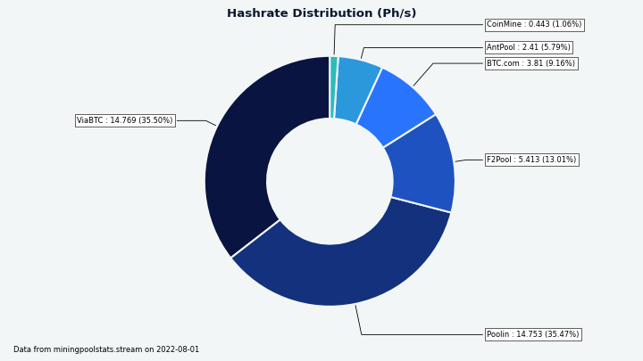
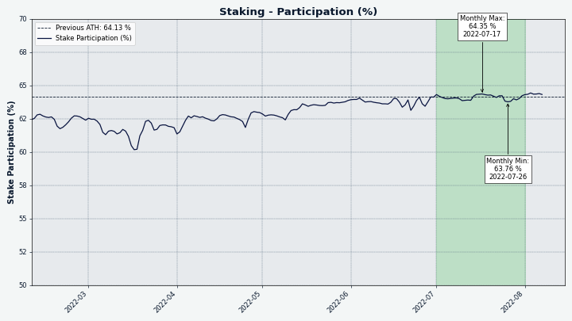
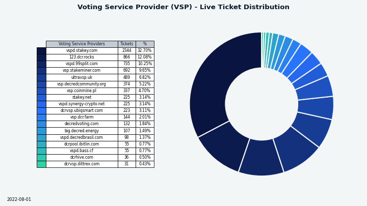

# Decred月报 – 2022 年 7 月

_图片：@OfficialCryptos的新闻艺术。_

七月亮点：

- DCRDEX 增加了对新型比特币钱包的支持，Electrum SPV 钱包已合并

- Politeia 即将发布一个新版本，其中包含导入的遗留提案和新的 GUI 插件架构

- 在拒绝继续资助 GoDCR 的提案后，该团队宣布他们将不再从事该项目

- @jy-p在一次采访中提到了他最近一直致力于闪电网络的相关事宜，这是一种全新的交互方式，应该在未来两个月内公开亮相

内容：

- [开发进展总结](#development)
- [人员](#people)
- [治理](#governance)
- [网络](#network)
- [生态系统](#ecosystem)
- [外展](#outreach)
- [媒体](#media)
- [讨论](#discussions)
- [市场](#markets)
- [相关外部信息](#relevant-external)

## 开发进展总结

除非另有说明，否则下面报告的工作具有“合并为主”状态。这意味着该工作已完成、审查并集成到高级用户可以[构建和运行](https://medium.com/@artikozel/the-decred-node-back-to-the-source-part-one-27d4576e7e1c)的源代码中，但在普通用户的发布二进制文件中尚不可用。

### dcrd

_[dcrd](https://github.com/decred/dcrd) 是一个完整的节点实现，为 Decred 在全球的点对点网络提供支持。_

优化：

- 直接针对[SECP256K1曲线](https://github.com/decred/dcrd/pull/2971)实施的私钥生成，以用所需的任何适配器代码替换标准库中的通用版本。这种实现不仅在执行速度和内存分配方面效率更高，而且理论上更安全，因为它没有标准库中的实现所具有的模偏差。
- 显着[优化的 CPU 挖矿代码](https://github.com/decred/dcrd/pull/2977)，可用于在测试网上进行挖掘。对速度统计跟踪代码进行了重新设计，以提高准确性和性能。在此更改之前，哈希率约为 0.5 Mh/s，最多可以有效使用 2 个内核。优化的代码哈希在单核上达到 1.2 Mh/s，在 10 个核上超过 10 Mh/s。

其他：

- 根据维护者的要求，删除了mainnet和 testnet 的 [planetdecred.org](https://github.com/decred/dcrd/pull/2974) 节点。
- 在新的 Go 1.19 中重新格式化了整个存储库中的[文档注释](https://github.com/decred/dcrd/pull/2976)。gofmt在一次提交中一次完成所有操作可以避免将来的提交免于额外的差异混乱。
- 修复了当有多个下一个候选区块（“链提示”）并且其中一些还没有可用的区块数据时[被选中选票](https://github.com/decred/dcrd/pull/2968)的广播。由于错误，与DCRD相关的投票钱包无法重新启动投票。
- 较小的改进。

_图片：dcrd 开发的另一天。_

### dcrwallet

_[dcrwallet](https://github.com/decred/dcrwallet) 是命令行和图形钱包应用程序使用的钱包服务器。_

自动选票购买机器人:

- 如果CoinShuffle ++服务器不设置，请勿尝试[混币](https://github.com/decred/dcrwallet/pull/2171)。

SON-RPC和命令行使用`dcrctl`:

- 修复了 `signrawtransasction` 命令没有看到提供的用于签署 P2PKH 输入的[私钥](https://github.com/decred/dcrwallet/pull/2173)。

进行中：

- 添加请求以允许 Decrediton 获取和更新[待处理的 TSpend 投票策略](https://github.com/decred/dcrwallet/pull/2172)。

### Decrediton

_[Decrediton](https://github.com/decred/decrediton) Decrediton 是一款功能齐全的桌面钱包应用程序，集成了投票、StakeShuffle 混合、闪电网络、DEX 交易等。它在有或没有完整区块链（SPV 模式）的情况下运行。_

正在进行中 - [对单个 TSpend 交易的投票](https://github.com/decred/decrediton/pull/3787)引入 Decrediton：

- “Treasury Spending”选项卡将显示待处理的 TSpends 和 投票能力。
- 在主页视图中，用户将看到新的活动和尚未投票的 TSpends 的通知。
- 工单详情页面将显示已在 VSP 上设置的金库密钥和 TSpend 投票选项。

### Politeia

_[Politeia](https://github.com/decred/politeia) 是Decred 的提案系统。它用于向 Decred 国库请求资金。_

后端 - tstore：

- 删除了[使用LevelDB](https://github.com/decred/politeia/pull/1651)作为 tstore 的键值存储的能力，现在默认情况下是 MySQL。由于 Trillian 无论如何都需要 MySQL，因此删除备用存储后端可以简化礼貌设置并使代码更易于维护。
- 更新了 tstore 后端以允许[覆盖](https://github.com/decred/politeia/pull/1652)现有条目。tstore 分两步保存数据：将数据保存在键值存储中，然后将其哈希附加到 Trillian 树上。如果第二步失败，覆盖现有条目修复了无法重新提交未更改数据的问题。

后端 - `ticketvote`插件：

- 将上次投票状态更改的[时间戳](https://github.com/decred/politeia/pull/1653)添加到投票摘要结构中。这允许在重建投票清单时提取更少的数据。
- 使用改进的 API、更好的文档以及将数据保存在 tstore 数据库而不是文件系统中重写了库存`ticketvote`[缓存](https://github.com/decred/politeia/pull/1649)。同样，[投票摘要缓存](https://github.com/decred/politeia/pull/1657) 和 [径流投票提交缓存](https://github.com/decred/politeia/pull/1658)从文件系统移动到 tstore 提供的插件缓存。
- 实现了`ticketvote`插件的 [fsck函数](https://github.com/decred/politeia/pull/1659) 来重建它的所有缓存。

后端 - 遗留提案：

- 向该工具添加了一个[`import` 命令](https://github.com/decred/politeia/pull/1632)。legacypoliteia它将 JSON 数据导入到在convert命令执行期间生成的 tstore 后端。这两个命令（`convert`和`import`）允许将大部分数据从以前版本的 Politeia 迁移到当前版本。不导入客户端和服务器签名，因为它们与转换后的数据不匹配。必须通过广泛的测试和变通方法来调查和解决一些 Trillian 的怪异问题。

后端 - 其他更改：

- 修复了接受[接受空评论](https://github.com/decred/politeia/pull/1655)的错误。
- 删除了从未用于任何事情的[遗留 websockets 代码](https://github.com/decred/politeia/pull/1660)。
- 代码清理和打包。
- 各种改进，调整等。

`politeaivoter` 命令行应用程序：

- 合并[配置错误处理](https://github.com/decred/politeia/pull/1648)以一致地涵盖更多情况。

Politeia GUI:

- 删除了硬编码的[遗留提案](https://github.com/decred/politeiagui/pull/2762)和处理它们的代码，现在它们已被迁移到当前的 Politeia 数据库中。
- 各种调整、改进和约 8 个修复。

Politeia GUI [新插件架构](https://github.com/decred/politeiagui/tree/master/plugins-structure#politeiagui---plugins-structure)的进展：

- 显示[外部链接](https://github.com/decred/politeiagui/pull/2804)的警告模式。
- 每个插件现在都可以[导出“效果”](https://github.com/decred/politeiagui/pull/2800)，开发人员可以在他们的类似 Politeia 的应用程序中重复使用和组合。例如，当用户滚动到列表末尾时，可以从负责这些可插入功能的插件中调用获取下一批提案/评论/投票摘要的代码。
- 添加了一个`politeiagui-scripts` [CLI 包](https://github.com/decred/politeiagui/pull/2827)。它对常用配置进行了重复数据删除，并提供了 7 个用于开发和测试插件和应用程序的命令。

### cspp

_[cspp](https://github.com/decred/cspp) 是一个使用 CoinShuffle++ 协议的混币服务器。它是非托管的，即不持有任何资金。_

- [@jy-p](https://www.youtube.com/watch?v=1RBBNnrPqc0&t=123) 说他与 @jrick 在 Decred 的 StakeShuffle 隐私服务的点对点混合方面取得了很大进展。目前 StakeShuffle 依赖于[mix.decred.org](https://mix.decred.org/)的中央服务器。

### DCRDEX

_[DCRDEX](https://github.com/decred/dcrdex) 是一个非托管、尊重隐私的去中心化交易所，由原子交换提供支持。_

面向用户的一般更改：

- 在 UI 的不同位置显示[法币价值](https://github.com/decred/dcrdex/pull/1600)显示。
- 添加了对[在线钱包重新配置](https://github.com/decred/dcrdex/pull/1686)的一般支持，并为 BTC 实现了它。这允许在更改钱包配置后重新建立锁定的硬币。在此更改之前，使用实时订单重新配置钱包会解锁资金，但尝试使用它们会导致错误。
- 实施[费率缓存和到期](https://github.com/decred/dcrdex/pull/1721)，以解决使用过时费率的长期问题。还优化了从各种来源（钱包、订单簿、外部 API）获取费率的频率。
- 澄清了有关[禁用 DEX 服务器](https://github.com/decred/dcrdex/pull/1634)的消息。使用最近的帐户发现功能，可以根据需要禁用和重新启用服务器，而无需再次支付注册费。
- 输入价格时优化[高资源使用](https://github.com/decred/dcrdex/pull/1684)。
- 修复了市场购买的[填充百分比显示](https://github.com/decred/dcrdex/pull/1711)。
- 修复了用户在极少数情况下因撤销订单而获得[订单完成信用](https://github.com/decred/dcrdex/pull/1707)的问题。

一般内部/其它变化：

- 在 CI 构建期间强制执行[代码格式检查](https://github.com/decred/dcrdex/pull/1699)以确保一致性。
- 其它测试基础设施改进、重构和约 5 个修复。

Decred 支持：

- 支持DCR 钱包（dcrdata 的 Insight API）的交易费用估算的[外部来源](https://github.com/decred/dcrdex/pull/1654)，以在钱包无法在本地获取费用估算时作为后备。
- 修复了 DCR SPV 钱包的块监控并改进了[连接错误消息](https://github.com/decred/dcrdex/pull/1701)。

比特币和类比特币资产支持：

- 添加了对常见[Electrum SPV](https://github.com/decred/dcrdex/pull/1607)钱包（BTC、LTC、BCH）的支持。DEX 客户端可以与本地 Electrum 钱包（最低版本 4.2）通信并使用其资金进行交易。
- 在负载测试中挖掘出块后，为发送 ZEC添加了短暂的延迟，以解决[Zcash发送](https://github.com/zcash/zcash/issues/6045)选择的问题。
- 最低要求的[比特币核心版本](https://github.com/decred/dcrdex/pull/1735)达到 v0.21（以及使用描述符钱包的 v22）。
- 修复了原生 BTC SPV 钱包在[发送太少](https://github.com/decred/dcrdex/pull/1705)（“灰尘”）数量后被破坏的问题，这是不允许的。
- 修复了创建本地 BTC 钱包[费用太低](https://github.com/decred/dcrdex/pull/1657)的问题。

以太坊支持：

- 当基础费用过高时，提高赎回的 ETH [gas费](https://github.com/decred/dcrdex/pull/1692)上限。
- 添加了[将 ETH 钱包导出](https://github.com/decred/dcrdex/pull/1648)到 Metamask 的功能。
- 更改了[ETH 钱包的私钥的派生方式](https://github.com/decred/dcrdex/pull/1702)，增加了一个额外的步骤，即生成以太坊 BIP-39 助记符，然后从该种子中派生私钥。这为将来导出种子词和帐户私钥打开了大门。
- 添加了以太坊坚固合同中[算术溢出的测试](https://github.com/decred/dcrdex/pull/1722)。从坚固性v0.8.0开始，如果有溢出，则应自动恢复交易。添加测试以防万一DCRDEX中使用的坚固性版本以某种方式降低到V0.8.0以下，或者如果将来的坚固性版本删除此保护。无论如何，要安全比后悔要好。

_图像：DCRDEX显示法币价值，以减轻传统金融系统的过渡影响。_

### GoDCR

_[GoDCR](https://github.com/planetdecred/godcr) 是一款轻量级桌面 GUI 钱包，集成了质押、隐私、Politeia 投票、共识投票等功能。_

在拒绝资助未来GODCR开发的[提案](https://proposals.decred.org/record/0ef42e5)之后，@Raedah团队[宣布](https://matrix.to/#/!gruHpujXftcsHcghjx:planetdecred.org/$tSIfmIcwrrtslpOU04O5m8y8cJzumZvds5ipv9coB30?via=planetdecred.org&via=decred.org&via=matrix.org)将不再由他们积极发展。

合并：

- 更新的[交易页面](https://github.com/planetdecred/godcr/pull/893)（改进的TX行显示，过滤器下拉列表中每个TX类型的计数等）。
- 实施了新的[概述页面](https://github.com/planetdecred/godcr/pull/1008)设计。
- 更新的钱包设置页面为[最新的UI](https://github.com/planetdecred/godcr/pull/1007)。
- 添加了DEX服务器[选择器](https://github.com/planetdecred/godcr/pull/1011)，使用自定义服务器的能力以及支付注册费。
- 固定[处理](https://github.com/planetdecred/godcr/pull/1023)钱包删除。
- 实施了新的[Staking标签](https://github.com/planetdecred/godcr/pull/1016)设计。
- 许多错误修复和UI调整。
- 翻译更新。

进行中：

- 简化了DCRLIBWALLET中的API，用于从DCRDATA Block Explorer和交换器中[提取数据](https://github.com/planetdecred/dcrlibwallet/pull/255)。
- 新的[StakeShuffle page](https://github.com/planetdecred/godcr/pull/1024)页面布局。
- 新的[交易页面](https://github.com/planetdecred/godcr/issues/1025)设计。
- [提案搜索](https://github.com/planetdecred/godcr/pull/1027)功能。

_图片：Godcr中的新放入设计。_

### dcrdata

_[dcrdata](https://github.com/decred/dcrdata) 是 Decred 区块链和链下数据（如 Politeia 提案、市场等）的浏览器。_

- 添加了[消息签名验证页面](https://github.com/decred/dcrdata/pull/1911)和两个新的HTTP API端点，用于脚本和应用程序。请求限制器还添加了默认值2 MIB，距离默认为10 MIB。

进行中：

- 公开更多的[国库数据](https://github.com/decred/dcrdata/pull/1918)，例如法定人数进度，大约。投票开始/结束日期，使用的PI密钥等等。
- 开发人员正在财政页面上研究分页问题。

### Documentation

_[dcrdocs](https://github.com/decred/dcrdocs) 是 Decred[用户文档](https://docs.decred.org/)的源代码_

- 更新了与[命令行应用程序](https://github.com/decred/dcrdocs/pull/1193)相关的文档，以匹配v1.7.2版本，并提到了Apple M1芯片和BSD系统的支持。
- [更新并重组了](https://github.com/decred/dcrdocs/pull/1195)使用Block Explorer指南，以解决Reddit上的一些混乱。

### decred.org

_[dcrweb](https://github.com/decred/dcrweb) is the source code for the decred.org website._

- [社交媒体](https://decred.org/community/)链接已清理。值得注意的是，由于缺乏对这些渠道的控制和适当的适应性，已删除了中国特定的社交媒体。

### 其它

回答一个社区问题：“您希望看到接下来会发展什么？” @jy-p放下了一个预告：“这个有细微的答案。我已经开发了它，它已经准备好了，它已经填补了我们很长一段时间的空白，它涉及闪电网络。我“我不会说很多。 。无论是什么，其余的集成和GUI工作大致估计为“2个月”。

## 人员

祝贺新承包商在5月至6月获得授予Decred承包商许可（DCC）：

- @philemon (GitHub [@ukane-philemon](https://github.com/ukane-philemon), 开发)
- @zippycorners (GitHub [@matthawkins90](https://github.com/matthawkins90), 开发)

@phoenixgreen在Decred Magazine上采访了Decred 开发者 [@dreacot (GoDCR)](https://www.decredmagazine.com/introducing-decred-developer-dreacot/)和[@VictorGuedes (Politeia)](https://www.decredmagazine.com/introducing-decred-developer-victorguedes/) 

截至8月1日的社区统计数据（与7月1日相比）：

- [Twitter](https://twitter.com/decredproject) 粉丝: 54,306 (-74)
- [Reddit](https://www.reddit.com/r/decred/) 订阅: 12,633 (-3)
- [Matrix](https://chat.decred.org/) #general 用户: 707 (+18)
- [Discord](https://discord.gg/GJ2GXfz) 用户: 1,765 (-561 - 清除无效用户)
- [Telegram](https://t.me/Decred) 用户: 2,773 (-37)
- [YouTube](https://www.youtube.com/decredchannel) 订阅: 4,630 (+0), 观看量: 212K (+2K)

## 治理

7月，新的[国库](https://dcrdata.decred.org/treasury)收到了9,204 DCR，价值22万美元，7月份的平均价格为23.93美元。3,205 dcr用于支付承包商，七月的费用为77K，6月的平均价格为$ 28.06。

国库支出[交易](https://explorer.dcrdata.org/tx/453e713358bb3c5662ebc1f58c50c50ceb66a950dae925701d8e25a3c4c72d4e)于7月24日开采，其产量从2.8 DCR到1,184 DCR不等。该交易以4,590票和7票批准。

截至8月8日，新旧国库的综合余额为807,000 dcr（3070万美元，价格38.01美元）。

七月没有新的提案。Decred Magazine提案于7月获得批准，批准了87％，投票率为28％。另外两项提案被拒绝，GoDCR（20％的批准，57％的投票率）和Decred Brazil Marketing（19％的批准，57％的投票率）。

有关本月提案的更多详细信息，请参见Politeia Digest第[53](https://blockcommons.red/politeia-digest/issue053/)期。

## 网络

**全网算力**: 7月的[全网算力](https://dcrdata.decred.org/charts?chart=hashrate&zoom=l4vb70eb-l6cmn0q7&scale=linear&bin=block&axis=time)以〜87 pH/s开启，结束为〜44 pH/s，底部为28 pH/s，峰值为116 pH/s。

_图像：全网算力继续寻求新的平衡。_

算力分布报告 8月1日：Poolin 36％，ViaBTC 36％，F2Pool 13％，BTC.com 9％，蚂蚁池6％，其它1％。

实际上在8月1日[开采](https://miningpoolstats.stream/decred)的1,000个块的分布：Poolin 42％，ViaBTC 30％，BTC.com 8％，CoinMine1％，未知19％。

_图像：池哈希率分布。_

**Staking**: [票价](https://dcrdata.decred.org/charts?chart=ticket-price&zoom=l4vb70eb-l6cmn0q7&axis=time&visibility=true-true&mode=stepped)在215-238 DCR之间变化，30天平均为226.8 DCR（+3.1）。

锁定金额为9.12-9.25百万dcr，这意味着63.7-64.5％的循环供应供应在参与PoS。

_图片：质押参与度创历史新高。_

**VSP**: 8月1日，〜7,170（+20）现场票由[列出](https://decred.org/vsp/)的VSPD服务器管理。总共18个VSP管理了选票池的17.4％（+0.1％）。

_图像：VSP管理的选票分布。_

**节点**:[Decred Mapper](https://nodes.jholdstock.uk/user_agents)在8月9日捕获的节点版本（总计127，仅DCRD）：v1.7.1-39％，v1.7.2-25％，v1.7.0-1.7.0-11％，v1.7.0，v1.7.0 dev builds -7％，v1，v1 .8.0 DEV构建-4％，V1.6系列-3％，V1.5系列-0.7％，V1.4系列-0.7％。

_图像：DCRD节点版本分布。_

[混合硬币](https://dcrdata.decred.org/charts?chart=coin-supply&zoom=jz3q237o-la8vk000&scale=linear&bin=day&axis=time&visibility=true-true-true)的份额在60.6-60.8％之间变化。每日混合量在244-509k dcr之间变化。

截至8月9日起， Decred的[闪电网络](https://ln-map.jholdstock.uk/)已观察到45个节点（+1），78个通道（+6），总容量为36.9 dcr（+0.2）。

## 生态系统

在decred.org和decrediton上列出了两个新的VSP：[@cryptocoiner69](https://github.com/decred/dcrwebapi/pull/162)（0.2％费用）和 [@kozel](https://dcrhive.com/)（0.7％费用）。@kozel 计划使用赚取的 VSP 费用为Decred 的闪电网络提供流动性——这是在选择 VSP 时要考虑的一个有趣的新动机。

根据@JZ，Binance已将所需的DCR确认从20降低到6 。

[Luxor](https://luxor.tech/)已关闭了雷迪特用户报告的6月10日原始截止日期约1个月。

[BisonPool](https://bisonpool.org/)已正式推出。Bisonpool是一种新型的商品验证池，即使他们自己负担不起一张全票，也能够获得POS奖励。为了实现这一目标，Bisonpool将用户的DCR汇总以购买门票。门票奖励根据他们能够提供的DCR数量分配给参与者。请参阅[Reddit](https://www.reddit.com/r/decred/comments/vyydm1/bisonpool_is_now_live/)上的公告。

用户无法控制Bisonpool上选票的投票偏好。

应当指出，这是一项托管服务，这意味着Bisonpool可以控制用户的资金。如果您选择使用此服务，则可能会被盗。无论谁在Bisonpool运行的人的身份是社区都不知道的。请记住，不是您的钥匙，而不是您的硬币。

警告：Decred Journal的作者对上述任何服务的可信度都不知道。请在将您的个人信息或资产信任任何实体之前进行自己的研究。

加入我们的[#ecosystem](https://chat.decred.org/#/room/#ecosystem:decred.org)聊天以遵循Decred生态系统更新。

## 外展

Monde PR的成就：

- 抓到2个公关机会
- 回答了2条评论请求。
- 获得了1次媒体采访。
- 提出了2名自由记者为Decred Magazine撰写。

确保了以下新闻文章：

- [Finder](https://www.finder.com/id/ethereum-eth-price-prediction) 中的一篇文章介绍了@JZ关于以太坊的2022年前景的评论。
- [Finder](https://www.finder.com.au/solana-sol-price-prediction) 中的一篇文章介绍了@JZ关于Solana的2022年展望的评论。
- [Finder](https://www.finder.com/nz/litecoin-ltc-price-prediction) 中的一篇文章，其中包含 @jz 对莱特币 2022 年前景的评论。
- [Finder](https://www.finder.com/id/dogecoin-doge-price-prediction) 中的一篇文章，其中包含 @jz 对狗狗币 2022 年前景的评论。
- [Cointelegraph](https://cointelegraph.com/news/3ac-a-10b-hedge-fund-gone-bust-with-founders-on-the-run)上的一篇文章，其中包含来自@jz的评论，内容是导致三箭资本倒台的原因。这篇文章被联合到 44 家出版物上，包括Crypto News Canada、The Switzerland Times和Bitcoin Insider。

## 媒体

[Decred Magazine](https://www.decredmagazine.com/) 更新:

> 7 月，我们发布了 10 篇新文章，并将所有以前的“Decred Assembly”内容添加到存档中。我们有一个新的官方贡献者——Tivra。
> 
> DM 现在有 297 个帖子、50 个时事通讯订阅者、6 个活跃的社交媒体活动。我不确定如何展示完整的社交媒体参与度，但根据我过去 30 天的统计数据，有 48 条新帖子，309 次点击帖子，375 次喜欢，56 次转发，内容已发布给 887 名关注者帐户。[@phoenixgreen]

DM 现在拥有自己的 Twitter，请关注 [@decredmagazine](https://twitter.com/decredmagazine) 以获取新的故事和公告。

作者通缉！在 Matrix [#writers](https://chat.decred.org/#/room/#writers:decred.org) 聊天中联系 @phoenixgreen 或在Twitter 上联系 [@DecredSociety](https://twitter.com/DecredSociety)。

**Decred 杂志文章：**

- [介绍Decred 开发人员@dreacot](https://www.decredmagazine.com/introducing-decred-developer-dreacot/) @phoenixgreen
- [魔术8球，这是底部吗？](https://www.decredmagazine.com/magic-8-ball-is-this-the-bottom/) @Applesaucesome
- [@phoenixgreen 介绍 Decred 开发者 VictorGuedes](https://www.decredmagazine.com/introducing-decred-developer-victorguedes/) 
- [迭代和发展的稳健货币](https://www.decredmagazine.com/decred-iterates-where-bitcoin-is-weak-broken/)  @RonnieAmato
- [优柔寡断、怀疑和每月一次的 hopium技术分析](https://www.decredmagazine.com/indecision-doubt-and-a-monthly-dose-of-hopium/) by @Applesaucesome

**视频:**

- [Decred 解释 -通过 Crypto Sketch 101使用混合共识机制提高去中心化和可扩展性](https://www.youtube.com/watch?v=VjbYtYFkYI4) 
- [Decred 新闻更新 - 首次使用新规则支付 DAO、DEX Solidity 合约审计、混合 ATH 等！](https://www.youtube.com/watch?v=QOCC4INo2TM) @Exitus
- [什么是Decred？](https://www.youtube.com/watch?v=Gpa-xADhtow) @ Blockchain Side
- [DCRDATA 定义项目的详细信息 - Decred Fundamentals](https://www.youtube.com/watch?v=Y6U_iWYQb9A) @phoenixgreen

直播：

- [两层经济——Decred 和市场状况@jy-p](https://www.youtube.com/watch?v=1RBBNnrPqc0) @Exitus @phoenixgreen

**艺术娱乐:**

- [Decred发展和适应](https://www.decredmagazine.com/decred-stairs-to-evolve-and-adapt/) @OfficialCryptos ([tweet](https://twitter.com/decredmagazine/status/1551255007118458883))
- [Decred的StakeShuffle 混币](https://twitter.com/karamblez/status/1551637047038853122) 统计动画 @karamble

**翻译:**)

- Decred月报 2022年6月被[翻译](https://xaur.github.io/decred-news/) 成中文 (@Dominic)。 谢谢!

## 讨论

选定的reddit帖子：

- 每周的捐款计划停顿了一个月，但第四版持续了更长的持续时间和2 dcr的赏金池（加上1 dcr，由参与者承诺，如果有一个，则获得了第二次最佳贡献）。自举很困难，但在放弃之前还有更多想法可以尝试。

## 市场

7月，DCR的交易在20.86-29.10 / BTC 0.00104-0.00134之间。平均每日价格为23.93美元。

@applesauceseome与有关加密货币和更广泛市场的图表和评论分享了两次[市场](https://www.decredmagazine.com/magic-8-ball-is-this-the-bottom/)[评论](https://www.decredmagazine.com/indecision-doubt-and-a-monthly-dose-of-hopium/)，以及最后一部分的“下一个霍普”。

_图片：dcrdex每月交易量。_

## 相关外部信息

一群称自己为“比特币最大化主义者”的人正在分散和萎缩，七月看到了一些重大的叛逃和破裂。尼克·卡特（Nic Carter）多年来一直在媒体上表现出了一个亲币的叙述，赢得了社区中许多人的尊重 - 但是当他的基金Castle Island Ventures的最新投资是由Bitcoin Maximalists在Twitter上设定的，Nic继续了对他们进行了持久的进攻，喊出了该小组的错误位置和失败，并使自己远离他们。在本月的晚些时马特（Matt）作为一个向比特币引入通货膨胀错误的人，这是一种有争议的情绪，引起了许多其他比特币开发人员的批评，并指出，开发人员的工作经历了整个人团队的评论，并将其提出来贬低马特（Matt）来发表评论。有毒行为使人们远离比特币。一位首席比特币核心维护者不久宣布，他们正在辞职。

特斯拉在2022年第二季度出售了其BTC股份的75％，销售时价值9.36亿美元。MicroStrategy是另一家公开公司购买BTC的公司，并保留了比特币，但“减值费”为9.18亿美元。迈克尔·塞勒（Michael Saylor）著名的是比特币最大主义模因 - 司机，他辞去了首席执行官“专注于购买比特币”，但仍控制着公司大多数投票股份和董事会主席。

10亿中国居民的细节被盗，并在黑暗的黑客论坛上提供。Binance首席执行官CZ是第一个发布推文的人之一，并指出，受影响地区的Binance威胁安全检查将增加，并推测发生了违规行为，因为开发人员在博客文章中泄漏了钥匙。这是一个又一证明，保护用户数据的最佳方法是首先不收集它。

索拉纳基金会（Solana Foundation）正在纽约市开设一个“使馆”，这是一个苹果商店类型的单位，人们将能够查看Solana NFTS并查看即将推出的Solana手机。

在我们的[#journal](https://chat.decred.org/#/room/#journal:decred.org)聊天室中分享您的下一期更新。

## 关于月报

这是 Decred Journal 第 49 期。[此处](https://xaur.github.io/decred-news/)提供所有问题、镜像和翻译的索引。

来自第三方的大多数信息在经过最低限度的健全性检查后直接从源转发。Decred 月报的作者无法验证所有声明。请提防诈骗并进行自己的研究。

感谢 (字母排列):

- 写作，编辑，出版：bee, bochinchero, Exitus, jz, l1ndseymm, phoenixgreen, richardred
- 评论和反馈：buck54321
- 标题图片：OfficialCryptos
- 资助：Decred stakeholders

## 中文社区

* [微博](https://www.weibo.com/DecredProject)
* [微信公众号](https://mp.weixin.qq.com/mp/profile_ext?action=home&__biz=Mzg2NTExNzc3MA==&scene=124#wechat_redirect)
* [bilibili频道](https://space.bilibili.com/425519478)
