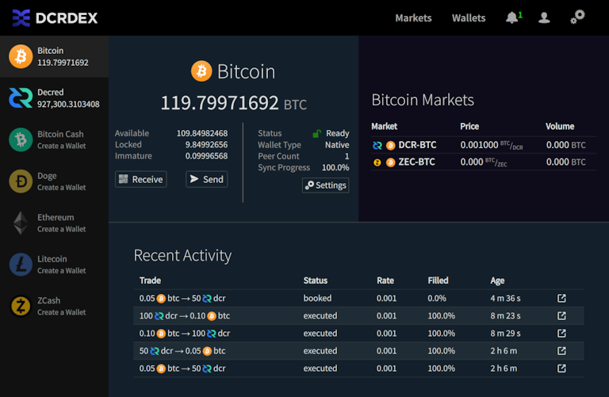

# Decred月报 – 2022 年 8 月

_图片： @saender _

八月亮点：

- 提案、通过并部署了对 decred.org 网站的大幅修改。
- Politeia v1.4.0 已经发布，新功能之一是拥有 5 分钟的时间窗口来修改评论。
- DCRDEX v0.5.2 已经发布，并且已经可以由不想等待正在进行的 Decrediton 集成更新的交易者运行。
- 核心 Decred 软件 v1.7.4 作为源代码发布，只是为了修复已被 ASIC 矿工停止的测试网。

内容：

- [Politeia v1.4.0 发布](#politeia-v140-released)
- [开发进展总结](#development)
- [人员](#people)
- [治理](#governance)
- [网络](#network)
- [生态系统](#ecosystem)
- [外展](#outreach)
- [媒体](#media)
- [讨论](#discussions)
- [市场](#markets)
- [相关外部信息](#relevant-external)

## Politeia v1.4.0 发布

经过 8 个月的开发，新的 Politeia 版本上线了！亮点包括：

- 导入旧提案是此版本的主要工作。现在所有提案都可以在[proposals.decred.org](https://proposals.decred.org/)上找到，没有单独的存档网站。
- 评论可以在发布后的 5 分钟内立即编辑。
- 显示提案被审查的原因。
- 改进的草稿用户体验。
- 用于构建类似 Politeia 的应用程序的新架构的初步工作。

请参阅 [politeia](https://github.com/decred/politeia/releases/tag/v1.4.0) 和 [politeiagui](https://github.com/decred/politeiagui/releases/tag/v1.4.0) 存储库中的完整发行说明。

## 开发进展总结

除非另有说明，否则下面报告的工作为“合并至核心存储库”状态。这意味着该工作已完成、审查并集成到高级用户可以[构建和运行](https://medium.com/@artikozel/the-decred-node-back-to-the-source-part-one-27d4576e7e1c)的源代码中，但在普通用户尚不可用。

### dcrd

_[dcrd](https://github.com/decred/dcrd) 是一个完整的节点实现，为 Decred 在全球的点对点网络提供支持。_

dcrd v1.7.4 已发布修复测试网挖掘算法，详情如下。它是一个仅源代码版本，因为它主要面向开发人员。

合并`master`并向后移植到 v1.7.4 版本：

- [强制难度限制](https://github.com/decred/dcrd/pull/2978)在测试网上设置。通常 ASIC 不会出现在测试网上，块是通过“缓慢”的 CPU 挖掘来挖掘的，因为需要高性能硬件来运行测试网是不合理的。也没有经济激励，因为测试网代币没有价值，而 ASIC 矿工有更好的选择来挖掘主网代币以获取利润。尽管如此，约 78 Th/s 的不寻常哈希率（相当于 2 个 Antminer DR5）加入了 Decred 测试网并开采了约 5 小时，这增加了难度并有效地停止了网络。为了限制 ASIC 可以在测试网上玩的游戏类型，引入了两条新规则：对最大允许难度的限制和在达到最大难度后限制出块率。即使在 GPU 和 ASIC 存在的情况下，这也应该保持 CPU 挖掘的可行性。

- 优化了选票数太少的区块处理，除了权益交易外，还可以[将常规交易](https://github.com/decred/dcrd/pull/2978/commits/659b7fed1f225861b8b689ead1a0466099992479)复制到替代区块模板中。这使得模板创建在重复支出的情况下更加健壮，并有助于确保将无效（投票不足）块中的所有交易添加到替代块模板中。以前所有交易也被复制，但只在下一个区块中复制，因此此更改消除了不必要的延迟。

合并`master`到 v1.8：

- 使运行时间更长的`区块链`测试[并行运行](https://github.com/decred/dcrd/pull/2988)，以将整体测试时间减少大约一半。
- 由于地址索引已被删除，并且没有其他索引器需要访问以前的脚本，因此删除了与以前的[脚本快照](https://github.com/decred/dcrd/pull/2989)相关的所有代码。
- 维护和较小的修复。

### dcrwallet

_[dcrwallet](https://github.com/decred/dcrwallet) 是命令行和图形钱包应用程序使用的钱包服务器。_

合并`master`并向后移植到 v1.7.4 源版本：

- 导入任意[公钥](https://github.com/decred/dcrwallet/pull/2177)及其派生地址的实现方法。仅支持观察钱包。
- 在 dcrd 中实施的新规则中添加了[硬分叉 testnet3](https://github.com/decred/dcrwallet/pull/2178)的检查点。检查点用于将钱包推送到预期的未投票链上，因为它的总工作量比被重组的链少得多。

合并`master`：

- 将[难度检查](https://github.com/decred/dcrwallet/pull/2181)更新为 testnet3 上的新限制规则。

### dcrctl

_[dcrctl](https://github.com/decred/dcrctl) 是 dcrd 和 dcrwallet 的命令行客户端。_

- 更新到最新的[Go 模块](https://github.com/decred/dcrctl/pull/49)和[GitHub 操作](https://github.com/decred/dcrctl/pull/48)版本。

### Decrediton

_[Decrediton](https://github.com/decred/decrediton) 是一款功能齐全的桌面钱包应用程序，集成了投票、StakeShuffle 混合、闪电网络、DEX 交易等。它可在有或没有完整区块链（SPV 模式）的情况下运行。_

- 添加了使用 F5 键[刷新](https://github.com/decred/decrediton/pull/3785) DEX 窗口的功能。
- 国库支出页面现在在测试网上使用[测试网 Pi 密钥](https://github.com/decred/decrediton/pull/3776)，并具有适当的链接以在 dcrd 的源代码中验证它们。
- 在[“隐私”选项卡](https://github.com/decred/decrediton/pull/3779)中将“Stakeshuffle++”更正为“StakeShuffle” 。
- ~4 个修复和其它内部更新。

### Politeia

_[Politeia](https://github.com/decred/politeia) 是 Decred 的提案系统。它用于向 Decred 国库请求资金。_

后端：

- 优化和改进的[`dbutil -migrate`](https://github.com/decred/politeia/pull/1667)命令验证（用于从一个用户数据库迁移到另一个）。
- 将[应用程序版本](https://github.com/decred/politeia/pull/1671)存储为单个字符串以简化发布过程。
- Go 1.19 的各种[更新](https://github.com/decred/politeia/pull/1672)（CI 配置、GitHub Actions、linter 和[代码格式化](https://github.com/decred/politeia/pull/1673)）。
- 在启动时删除[过期的用户会话](https://github.com/decred/politeia/pull/1669)。会话数据库的测试已被重写以修复许多问题。
- 更新[`dbutil -dump`](https://github.com/decred/politeia/pull/1676)了命令以与所有用户数据库实现一起使用。
- 冻结与不再允许更新的 Politeia 记录相对应的[Trillian trees](https://github.com/decred/politeia/pull/1670)（例如已审查或已存档）。Politeia 对 Trillian 的使用与其预期的用例完全不同，它会导致高 CPU 负载。冻结一些树木应该会减少它。

当前图形用户界面：

- 保留已批准和已拒绝提案的[仲裁标签](https://github.com/decred/politeiagui/pull/2836)。
- 修复了在服务器上注册之前使用的新密钥的常见[无效签名错误](https://github.com/decred/politeiagui/pull/2842)。
- 修复了遗留[RFP 提案](https://github.com/decred/politeiagui/pull/2845)的 2 个错误和遗留提案评论的约 6 个错误。

[新插件架构](https://github.com/decred/politeiagui/tree/master/plugins-structure#politeiagui---plugins-structure)的 GUI 重制：

- 去重常见[Babel和Jest](https://github.com/decred/politeiagui/pull/2838)配置。
- 向`pi`插件添加了各种信息：提案状态、投票持续时间、法定人数、计费状态更改和错误消息。
- 添加了基于Cypress的[端到端测试](https://github.com/decred/politeiagui/pull/2803)。
- 实施 RFP[提案和提交](https://github.com/decred/politeiagui/pull/2848)。
- 从 pi-ui重用[视图断点](https://github.com/decred/politeiagui/pull/2849)。断点控制使用哪种布局来匹配用户的屏幕大小。
- ~5 修复
- 代码重构和清理

pi-ui 共享库：

- [自定义断点](https://github.com/decred/pi-ui/pull/459)可在内部重用，也可由使用`pi-ui`。 为 CSS 处理连接[PostCSS](https://postcss.org/)。

_图片: Politeia 中更新的 RFP 提案视图。_

### 闪电网络

_[dcrlnd](https://github.com/decred/dcrlnd) 是 Decred 的闪电网络节点软件。LN 支持即时和低成本的交易。_

LN 守护进程：

- 添加`EnforcePing` RPC [调用](https://github.com/decred/dcrlnd/pull/163)。这允许调用者指示 dcrlnd ping 指定的对等点并等待响应。如果未能收到响应，则对等方断开连接。
- 为对等节点添加了[停顿检测和断开连接](https://github.com/decred/dcrlnd/pull/162)。这需要处理运行 dcrlnd 的计算机被挂起，然后在经过足够的时间以使远程对等节点断开连接后恢复的情况。
- 将对等方[空闲超时](https://github.com/decred/dcrlnd/commit/02793bc8d7e2fb1b0775f24b87bad4c892e62ba9)从 5 分钟减少到 1 分 30 秒。5 分钟的空闲超时时间过长，会妨碍正确及早检测停滞的对等方。

[流动性提供者守护进程](https://github.com/decred/dcrlnlpd):

- 为自动构建配置了[GitHub 操作](https://github.com/decred/dcrlnlpd/pull/5)。
- 记录了软件如何控制[出站渠道](https://github.com/decred/dcrlnlpd/pull/4)。
- 添加了[TLS 加密](https://github.com/decred/dcrlnlpd/pull/6)支持。

### DCRDEX

_[DCRDEX](https://github.com/decred/dcrdex) 是一个非托管、尊重隐私的去信任交易所，由原子交换提供支持。_

DCRDEX [v0.5.2](https://github.com/decred/dcrdex/releases/tag/v0.5.2) 已经发布！首先查看 [v0.5.0](https://github.com/decred/dcrdex/releases/tag/v0.5.0) 版本以获取从 v0.4 升级的功能、修复和说明。从 v0.5.2 版本开始，DCRDEX现在发布自己的二进制文件。与往常一样，强烈建议[验证它们](https://docs.decred.org/advanced/verifying-binaries)。

请注意，由于 DCRDEX 正在与其它组件（例如 Decrediton）协调，因此尚未发布任何公告。

v0.5 版本中包含的 8 月的更改：

- 将[wiki内容](https://github.com/decred/dcrdex/pull/1714)移至主仓库中的[docs/wiki](https://github.com/decred/dcrdex/tree/master/docs/wiki)。现在所有文档都在一个地方，并且可以通过拉取请求工作流程由更多贡献者更新和审查。
- 为 v0.5 版本重写了大部分[自述文件](https://github.com/decred/dcrdex/pull/1747)。
- 更新为使用新的testnet3[规则](https://github.com/decred/dcrdex/pull/1773)并将 LTC 区块浏览器从 bitaps.com 切换到 sochain.com。
- 使用[`go:embed`](https://github.com/decred/dcrdex/pull/1710).
- 更新了[德语](https://github.com/decred/dcrdex/pull/1815)翻译。
- 代码维护。

v0.5 中包含的 8 月修复：

- 修复了几个客户端钱包[挂起](https://github.com/decred/dcrdex/pull/1732)的问题。
- 修复了BTC SPV 钱包中的[锁死](https://github.com/decred/dcrdex/pull/1756)。
- 修复了将[钱包类型切换为SPV](https://github.com/decred/dcrdex/pull/1759)。
- 修复了交易引擎中的几个[锁死](https://github.com/decred/dcrdex/pull/1739)的问题。
- 修复了创建钱包后必须[手动刷新](https://github.com/decred/dcrdex/pull/1757)钱包页面的问题。
- 修复了已撤销匹配的[匹配状态](https://github.com/decred/dcrdex/pull/1772)显示。
- 约 10 个其他客户端修复和约 2 个后端/内部修复。

v0.6 版本的面向用户的更改：

- 最终用户（交易者）文档移至其自己的文档。
- 通过使用纪元的第一个和最后一个匹配[价格](https://github.com/decred/dcrdex/pull/1781)作为蜡烛的开始和结束价格，提高了烛台图表的准确性。
- 重新设计了[钱包页面](https://github.com/decred/dcrdex/pull/1700)。新样式响应迅速，可适应台式机、平板电脑和移动设备的屏幕尺寸。
- 调整[订单取消](https://github.com/decred/dcrdex/pull/1682)政策以惩罚过快取消。如果订单至少存在一个完整的时期，它仍然可以“免费”取消（不会损害用户的声誉得分）。这应该会改善人类的交易体验。
- 为 DCR 和 ETH实施了[在线钱包重新配置](https://github.com/decred/dcrdex/pull/1786)。它允许跨钱包配置更改正确跟踪锁定的硬币。

v0.6 版本的后端和开发人员更改：

- 服务器安装指南移到[own文档](https://github.com/decred/dcrdex/blob/master/docs/wiki/Server-Installation.md)中。
- 更新了对最新[btcsuite](https://github.com/decred/dcrdex/pull/1785)、go-ethereum、go-bip39 和最低 Go 1.18 的依赖项。
- 添加了开始[编写模糊测试](https://github.com/decred/dcrdex/pull/1766)的指南。
- 自动[Markdown linting](https://github.com/decred/dcrdex/pull/1796)以确保格式一致。
- 交易等待时间由服务器操作员[配置](https://github.com/decred/dcrdex/pull/1789)。这是服务器在出错之前搜索客户端报告的事务的最长时间。
- 更新了 v0.6 开发周期的Node.js[依赖项](https://github.com/decred/dcrdex/pull/1792)。
- 翻译后的页面模板现在[在运行时](https://github.com/decred/dcrdex/pull/1826)生成。它消除了手动重新生成它们的需要，并简化了更新翻译或添加新语言。
- 支持dcrd 和 dcrwallet 的[已发布 v1.7 和开发中的 v1.8 版本](https://github.com/decred/dcrdex/pull/1822)。
- 代码维护。
- ~11 个客户端修复和 ~2 个后端/内部修复

以太坊支持：

- 在 UI 上启用[以太坊代币交易](https://github.com/decred/dcrdex/pull/1622)，为代币钱包创建新的钱包流程，其中包括同步父链（例如以太坊）的步骤。

_图片: 平板设备的 DCRDEX 布局。_

### GoDCR

_[GoDCR](https://github.com/planetdecred/godcr) 是一款轻量级桌面 GUI 钱包，集成了质押、隐私、Politeia 投票、共识投票等功能。_

- 禁用仅观察钱包的接收、发送和混币页面。
- 将[钱包设置页面](https://github.com/planetdecred/godcr/pull/1036)更新为 v2 UI 设计。
- 将[顶级设置页面](https://github.com/planetdecred/godcr/pull/1035)更新为 v2 UI 设计。
- 实施[国库支出布局](https://github.com/planetdecred/godcr/pull/975)。
- 更新了顶部栏上的[颜色和图标](https://github.com/planetdecred/godcr/pull/1028)。
- 复了解析特定 Markdown 位时[提案详细信息](https://github.com/planetdecred/godcr/pull/1045)崩溃的问题。
- 修复了钱包恢复完成后[应用程序崩溃](https://github.com/planetdecred/godcr/pull/1048)的问题。
- 修复了[暗模式](https://github.com/planetdecred/godcr/pull/1049)下的顶栏文本颜色。

dcrlibwallet 共享库：

- 添加了在本地和管理票证的 VSP中保存 [TSpend 投票策略](https://github.com/planetdecred/dcrlibwallet/pull/253)的功能。
- 更新了 [dcrwallet](https://github.com/planetdecred/dcrlibwallet/pull/263) 依赖项。
- 将 Politeia 提取到一个[独立的包](https://github.com/planetdecred/dcrlibwallet/pull/262)中。
- [实现了用于从外部服务](https://github.com/planetdecred/dcrlibwallet/pull/255)（例如 dcrdata 块浏览器和交换）获取数据的 API 。

_图片：GoDCR 设置页面。_

### dcrdata

_[dcrdata](https://github.com/decred/dcrdata)  Decred 区块链和链下数据（如 Politeia 提案、市场等）浏览器。_

- 依赖和工具链[更新](https://github.com/decred/dcrdata/pull/1931)。
- 固定国库交易[分页](https://github.com/decred/dcrdata/pull/1929)。
- 修复了主页上不正确的[国库余额](https://github.com/decred/dcrdata/pull/1930)。
- ~3 个较小的修复。

### decred.org

_[dcrweb](https://github.com/decred/dcrweb) 是 decred.org 网站的源代码。_

[Decred.org](https://decred.org/) 已经按照[D.R.E.A.M. 2: Dream Harder](https://proposals.decred.org/record/5ef57f7)提案中的利益相关者的批准进行了彻底改革。新标题是“Decred - Money Evovled”。

网站[变更摘要](https://github.com/decred/dcrweb/pull/1056)：

- Complete overhaul of theme and style.
- Updated messaging using strong words and simple language.
- Support and Publications sections added to [Community page](https://decred.org/community/).
- Removed `/chat` subpage (it redirected to [chat.decred.org](https://chat.decred.org)).
- Removed `/brief`, `/sustainable`, `/adaptable`, `/security`, and `/history` subpages.
- Removed legacy stakepools from the [VSP list](https://decred.org/vsp/).

Technical details:

- Site is implemented as much as possible without JavaScript. JS is used for: top navigation bar on mobile, loading VSP table, OS-specific download links on the home page.
- Previous site was built on drag-and-drop editor Webflow. The Webflow CSS has been replaced with Bootstrap.
- All site CSS (including Bootstrap) is compiled from SCSS source.
- New site does not contain any videos or Lottie animations, so all CSS/JS for those has been removed.
- Data files (`apps.yml`, `current_release.yml` and `links.yml`) consolidated to remove duplcation. All wallet links and versions now reside in one file [`wallets.yml`](https://github.com/decred/dcrweb/blob/master/src/data/wallets/wallets.yml).
- SourceSansPro font replaced with a mixture of Poppins and Inter. SourceCodePro remains the monospace font.

Other site changes:

- Updated [Matrix support](https://github.com/decred/dcrweb/pull/1060) link. Now [decred.org/matrix-support](https://decred.org/matrix-support/) redirects to #support chat room in our self-hosted Element server.
- Removed 7 [defunct exchanges and wallets](https://github.com/decred/dcrweb/pull/1059). Updated links.

_Image: New decred.org design._

### Other

- Updated to [Go 1.19](https://tip.golang.org/doc/go1.19) and dropped support for 1.17 in various repos.
- Android and iOS mobile wallets have been [removed](https://bounty.decred.org/2022/08/mobile-wallets-no-longer-in-scope/) from the Bug Bounty program's scope due to lack of supporting developers.

## People

Welcome to new first-time contributors with code merged to master:

- Abirdcfly ([dcrd](https://github.com/decred/dcrd/commits?author=Abirdcfly))
- herculesbrito ([Decrediton](https://github.com/decred/decrediton/commits?author=herculesbrito))
- norwnd ([dcrd](https://github.com/decred/dcrd/commits?author=norwnd))

Decred community members [João Paulo Sant'Anna](https://www.decredmagazine.com/introducing-decred-community-member-joao-paulo-santanna/) (curator of [@DecredBR](https://twitter.com/Decred_BR)) and [Philemon](https://www.decredmagazine.com/introducing-decred-developer-philemon/) (developer in DCRDEX, dcrdata, and other projects) were interviewed by @phoenixgreen on Decred Magazine.

Community stats as of Sep 1 (compared to Aug 1):

- [Twitter](https://twitter.com/decredproject) followers: 54,751 (+445)
- [Reddit](https://www.reddit.com/r/decred/) subscribers: 12,647 (+14)
- [Matrix](https://chat.decred.org/) #general users: 714 (+7)
- [Discord](https://discord.gg/GJ2GXfz) users: 1,796 (+31)
- [Telegram](https://t.me/Decred) users: 2,884 (+111)
- [YouTube](https://www.youtube.com/decredchannel) subscribers: 4,640 (+10), views: 214K (+2K)

## Governance

In August the new [treasury](https://dcrdata.decred.org/treasury) received 9,219 DCR worth $294K at August's average rate of $31.93. 3,788 DCR was spent to pay contractors, worth $121K at August's rate, or $91K at July's billing rate of $23.93.

The [treasury spend transaction](https://explorer.dcrdata.org/tx/c3f990e6c43babdfb782be90ca58ca6f6f8b6bcd3da96a622aba098d4e88c012) was mined on August 27, it had 23 outputs ranging from 0.7 DCR to 1,168 DCR. The transaction was approved with 6,795 Yes votes and 0 No votes.

As of Sep 3, combined balance of [legacy](https://dcrdata.decred.org/address/Dcur2mcGjmENx4DhNqDctW5wJCVyT3Qeqkx) and [new treasury](https://dcrdata.decred.org/treasury) is 810,984 DCR (24.3 million USD at $29.95).

One proposal was published and approved in August. [D.R.E.A.M. 2: Dream Harder](https://proposals.decred.org/record/5ef57f7) was submitted by @jy-p working with @jholdstock, @jz, and @saender to produce a revised decred.org prototype site along the lines of the [D.R.E.A.M. proposal](https://proposals.decred.org/record/b243fa7) which had the best voting response (48% approval) but did not pass for the decred.org [messaging RFP](https://proposals.decred.org/record/0917c1d) which was decided in September 2020. The present proposal to deploy the new design/messaging at a cost of $7,660 ($3K of which is reserved for translations) was approved with 97% Yes votes and 59% turnout.

See Politeia Digest [issue 53](https://blockcommons.red/politeia-digest/issue053/) for more detail on the month's proposal.

## Network

**Hashrate**: August's [hashrate](https://dcrdata.decred.org/charts?chart=hashrate&zoom=l5vqeg6f-l7pjl52i&scale=linear&bin=block&axis=time) opened at ~44 Ph/s and closed ~70 Ph/s, bottoming at 38 Ph/s and peaking at 84 Ph/s throughout the month.

_Image: Hashrate recovering from the lows._

Distribution of 75 Ph/s hashrate [reported](https://poolbay.io/crypto/54/decred) by the pools on Sep 1: Poolin 65%, F2Pool 26%, BTC.com 5.5%, AntPool 3.5%, CoinMine 0.6%.

Distribution of 1,000 blocks actually [mined](https://miningpoolstats.stream/decred) by Sep 1: Poolin 61%, BTC.com 5%, CoinMine 0.7%, unknown 33%.

_Image: Pool hashrate distribution._

**Staking**: [Ticket price](https://dcrdata.decred.org/charts?chart=ticket-price&zoom=l5vqeg6f-l7pjl52i&axis=time&visibility=true-true&mode=stepped) varied between 220-239 DCR, with 30-day [average](https://dcrstats.com/) at 230.2 DCR (+3.4).

The [locked amount](https://dcrdata.decred.org/charts?chart=ticket-pool-value&zoom=l5vqeg6f-l7pjl52i&scale=linear&bin=block&axis=time) was 9.22-9.39 million DCR, meaning that 63.9-65.0% of the circulating supply [participated](https://dcrdata.decred.org/charts?chart=stake-participation&zoom=l5vqeg6f-l7pjl52i&scale=linear&bin=block&axis=time) in Proof of Stake. This is a new all-time high for stake participation and ticket pool value.

**VSP**: On Sep 1, ~7,050 (-120) live tickets were managed by [listed](https://decred.org/vsp/) vspd servers. Collectively the 18 VSPs managed 17.3% of the ticket pool (-0.1%).

_Image: Distribution of tickets managed by VSPs._

**Nodes**: Node versions captured by [Decred Mapper](https://nodes.jholdstock.uk/user_agents) on Sep 1 (176 total, dcrd only): v1.7.1 - 31%, v1.7.2 - 29%, v1.7.4 - 18%, v1.7.0 - 8.5%, v1.8.0 dev builds - 3%, v1.7.0 dev builds - 1%, other - 10%.

_Image: dcrd node version distribution._

The share of [mixed coins](https://dcrdata.decred.org/charts?chart=coin-supply&zoom=jz3q237o-la8vk000&scale=linear&bin=day&axis=time&visibility=true-true-true) varied between 60.8-60.9%. Daily [mixed amount](https://dcrdata.decred.org/charts?chart=privacy-participation&zoom=l5vqeg6f-l7pjl52i&bin=day&axis=time) varied between 233-546K DCR.

Decred's [Lightning Network](https://ln-map.jholdstock.uk/) has seen 42 nodes (-3), 68 channels (-10) with a total capacity of 35.4 DCR (-1.5), as of Sep 1.

## Ecosystem

VSP [synergy-crypto.net](https://vspd.synergy-crypto.net/) announced on its website that it is closing and is not accepting new tickets. Tickets with already paid fees will be voted as usual (180 tickets as of Sep 1).

ViaBTC [announced](https://support.viabtc.com/hc/en-us/articles/9197412971417-Announcement-on-Putting-Offline-DCR-Mining-Pool) on Aug 5 that they will shut down their DCR mining pool on Aug 10. Users were asked to withdraw or convert their DCR by Aug 17, and any DCR remaining by that deadline will be automatically converted to USDT.

A total of 7 defunct services have been [removed](https://github.com/decred/dcrweb/pull/1059) from decred.org [Exchanges page](https://decred.org/exchanges/) ([CoinSwitch](https://coinswitch.co/), [Sequoir](https://www.sequoir.com/) (ex Vertbase), [Evercoin](https://evercoin.com/home), [Bitcoin.com](https://exchange.bitcoin.com/)) and [Wallets page](https://decred.org/wallets/) ([Ownbit](https://ownbit.io/), [AnyBit](https://www.anybit.io/), [Atomic Wallet](https://atomicwallet.io/), [Evercoin](https://evercoin.com/)). As of Sep 12, 22 third-party exchanges and 6 third-party wallets remain listed.

Warning: the authors of the Decred Journal have no idea about the trustworthiness of any of the services above. Please do your own research before trusting your personal information or assets to any entity.

Join our [#ecosystem](https://chat.decred.org/#/room/#ecosystem:decred.org) chat to follow Decred ecosystem updates.

## Outreach

Monde PR's achievements:

- Pitched Decred to 2 PR opportunities.
- Responded to 3 requests for comments.

Secured the following news articles:

- An article in [Forbes Advisor](https://www.forbes.com/advisor/investing/cryptocurrency/what-are-meme-coins-are-they-worth-investing-in/) featuring commentary from @jz on the merit of meme coins. The piece was syndicated to 3 publications including [Nasdaq](https://www.nasdaq.com/articles/what-are-meme-coins-are-they-worth-investing-in).
- An article in [Cointelegraph](https://cointelegraph.com/news/bitcoin-lightning-network-vs-visa-and-mastercard-how-do-they-stack-up) featuring commentary from @jy-p on how Bitcoin's Lightning Network stacks up against Solana and Visa. The piece was syndicated to 30 publications including [Bitcoin Insider](https://www.bitcoininsider.org/article/181590/bitcoin-lightning-network-vs-visa-and-mastercard-how-do-they-stack) and [Crypto News Canada](https://cryptonewscanada.com/bitcoin-lightning-network-vs-visa-and-mastercard-how-do-they-stack-up/).
- The Cointelegraph piece also appeared in Portuguese on [Cointelegraph Brazil](https://cointelegraph.com.br/news/bitcoin-lightning-network-vs-visa-and-mastercard-how-do-they-stack-up).

## Media

Decred Magazine engagement stats for August:

- Total number of articles on DM: 305
- Newsletter subscribers: 55
- New posts and newsletters sent: 13
- Active social media campaigns: 5
- Social media posts: 75
- Post clicks: 224
- Likes: 412
- Re-tweets: 73
- Social media followers across all platforms and accounts: 927

Twitter users are more than welcome to support [@Decredmagazine](https://twitter.com/decredmagazine) with follows, likes and retweets to help spread the message.

**Selected articles:**

- [Introducing Decred community member João Paulo Sant'Anna](https://www.decredmagazine.com/introducing-decred-community-member-joao-paulo-santanna/) by @phoenixgreen
- [Introducing Decred developer Philemon](https://www.decredmagazine.com/introducing-decred-developer-philemon/) by @phoenixgreen
- [How Decred contributed to a more transparent election in Brazil](https://www.decredmagazine.com/how-decred-how-decred-contributed-to-a-more-transparent-election-in-brazil/) by @João
- [Peer-to-peer electronic corporation](https://www.decredmagazine.com/peer-to-peer-electronic-corporation/) by @Tivra
- [Inflection points](https://www.decredmagazine.com/inflection-points/) technical analysis by @Applesaucesome

**Videos:**

- [Decentralised treasury spending - Decred Fundamentals](https://www.youtube.com/watch?v=A0NR5ySIqoI) by @phoenixgreen
- [DCRDATA Decred's treasury - Decred Fundamentals](https://www.youtube.com/watch?v=lQebfO6qIoo) by @phoenixgreen
- [Why Decred will explode! $DCR crypto price prediction!](https://www.youtube.com/watch?v=0PerKqUmmfU) by Minted Max - better than a typical price talk video
- [Decred and the future of web3 - State of the Market with BlockchainBuck](https://www.youtube.com/watch?v=n3welZEDchU) by @phoenixgreen and @Exitus
- [Decred News Update - Development work surging across many repos - LN, DCRDEX, Politeia, DAO & more](https://www.youtube.com/watch?v=EPcUkmaaJlQ) by @Exitus

**Art and fun:**

- [New Website TikTok](https://twitter.com/exitusdcr/status/1565090356651237379) by @DCRDajana
- [Decred Heartbeat](https://www.decredmagazine.com/decred-heartbeat/) by @OfficialCryptos

**Translations:**

- Decred Journal April-July 2022 got a total of 6 new [translations](https://xaur.github.io/decred-news/). Thanks to @arij (Arabic), @Dominic (Chinese), and @kozel (Polish)!

**Non-English content:**

- [What is the Decred digital token project?](https://www.youtube.com/watch?v=B8Y3-z9Bs9A) by Be Coin (Arabic)
- [DCR DecreD Explose j'achete ou pas?](https://www.youtube.com/watch?v=6cWhwYQ9tbE) by Crypto for EveryOne (French, "Decred exploding, buy or not?")

## Discussions

Selected Reddit posts:

- [Can something like Tornado Cash ban happen to Decred?](https://www.reddit.com/r/decred/comments/x2c7u5/can_something_like_tornado_cash_ban_happen_to/)

Selected Twitter discussions:

- @elima\_iii has a draft of his research paper, which focuses on [Decred and the proposed Responsible Financial Innovation Act](https://twitter.com/elima_iii/status/1563655328209723404).
- @phoenixgreen has a [thread on his experiences using the DCRDEX](https://twitter.com/DecredSociety/status/1564625492795441153) to sell DCR for BTC using the platform's atomic-swap technology.

## Markets

In August DCR was trading between USD 25.60-70.40 / BTC 0.00114-0.00306. The average daily rate was $31.93.

Another [review](https://www.decredmagazine.com/inflection-points/) of crypto and stock markets by @Applesaucesome mentions unusual numbers in August's DCR pump:

> The volume of that candle was massive. And I mean MASSIVE. Just on the DCR/USDT pairing there was nearly 2 million DCR traded back and forth. That's 14% of the entire supply. Note: This doesn't mean that much was bought or sold but the total combined amount bought + sold.

*The following quote is not financial advice:*

> In conclusion, the markets are likely going to pull back but if you're a bull then it could present one last solid buying opportunity. If you're a bear then this would be the time to sell more. Crypto still looks terrible right now but I'm not selling.

_Image: DCRDEX monthly volume in USD._

## Relevant External

Tornado Cash, an Ethereum mixing service, was added to the OFAC sanctions list by the [US Treasury](https://home.treasury.gov/news/press-releases/jy0916), for its role in facilitating the laundering of proceeds of hacks by North Korea. The sanctions cover a set of Ethereum addresses associated with the mixer, and in the immediate aftermath of the sanctions being unveiled some trolls were [sending](https://www.coindesk.com/policy/2022/08/09/someone-is-trolling-celebs-by-sending-eth-from-tornado-cash/) small amounts of mixed ETH from Tornado to the wallets of celebrities to taint their funds. Circle quickly [blacklisted](https://twitter.com/bantg/status/1556712790894706688) $75K of USDC belonging to Tornado users. GitHub [removed](https://www.theregister.com/2022/08/10/github_tornado_cookies/) the repositories for Tornado Cash and also the accounts of at least 3 developers who worked on it.

Two days later a developer who worked on Tornado Cash, Alexey Pertsev, was [arrested](https://www.fiod.nl/arrest-of-suspected-developer-of-tornado-cash/) in Amsterdam by the Dutch Fiscal Information and Investigation Service, on suspicion of helping to facilitate money laundering. The Dutch authorities are holding Pertsev for 3 months until a trial can be arranged, but so far they have not been charged with a specific crime, and their wife has [denied links](https://www.coindesk.com/policy/2022/08/26/wife-of-pertsev-arrested-tornado-cash-developer-denies-russia-secret-service-links/) to Russian espionage.

A whole DeFi ecosystem on Solana (Saber protocol) was [revealed](https://www.coindesk.com/layer2/2022/08/04/master-of-anons-how-a-crypto-developer-faked-a-defi-ecosystem/) to be the work of two brothers, a lot of fake developer accounts, and some techniques for double or triple counting the assets locked into the protocol.

Maker DAO has been supporting the DAI stablecoin since launch in 2019 and its governance serves to determine how the MKR ecosystem develops. Most participants in Maker DAO governance seem to agree that it is not going well and needs to change, but there are disagreements about how it should change. In a recent [podcast debade](ttps://www.youtube.com/watch?v=UJ_kfHdCLUk) MKR founder Rune Christensen made a case that people working for the DAO were getting too comfortable and trying to expand the organisation in ways which suited themselves. Hasu (pseudonymous crypto researcher, MKR governance delegate) represented the side of DAO contributors who could see that MKR holders were being presented with sub-optimal proposal decisions which they were not always well suited to answer - but several proposals to create new core groups which would provide a certain kind of intelligence to the token holders were recently rejected. One [Twitter thread](https://twitter.com/g_dip/status/1564716178819653632) on the subject adds a 3rd faction, decentralization maximalists who want to see the smart contracts locked down or "ossified" so that they cannot be changed in response to changing regulation. Rune is however the main character whose return from semi-retirement heralded a change in direction away from what the DAO's contributors and in some cases VC backers were planning. Rune has provided an epic "End Game" plan but it is extremely long and complex, split into several long forum posts, so it's not clear how many people support that.

[Leaked videos](https://cryptoleaks.info/case-no-3) have been circulated of lawyer Kyle Roche bragging about their work with Ava Labs (of Avalanche network), which included tying other competing projects up with frivolous lawsuits. Ava labs have [denied](https://www.coindesk.com/business/2022/08/29/obvious-nonsense-prominent-blockchains-founder-dismisses-smear-campaign-allegation/) the sensational account of their arrangement with the firm which Crypto Leaks published, and Kyle Roche has [withdrawn](https://www.coindesk.com/business/2022/08/31/crypto-lawyer-kyle-roche-withdraws-from-tether-bitfinex-tron-and-bitmex-lawsuits-after-cryptoleaks-scandal/) from a number of the aforementioned class action lawsuits.

That's all for August. Share your updates for the next issue in our [#journal](https://chat.decred.org/#/room/#journal:decred.org) chat room.

## About

This is issue 50 of Decred Journal. Index of all issues, mirrors, and translations is available [here](https://xaur.github.io/decred-news/).

Most information from third parties is relayed directly from the source after a minimal sanity check. The authors of the Decred Journal cannot verify all claims. Please beware of scams and do your own research.

Credits (alphabetical order):

- writing, editing, publishing: bee, bochinchero, Exitus, jz, l1ndseymm, phoenixgreen, richardred
- reviews and feedback: davecgh
- funding: Decred stakeholders
