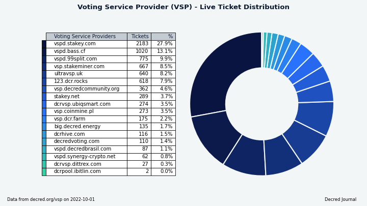

# Decred月报 – 2022 年 8 月

_图片: @OfficialCryptos的作品_

九月亮点：

- DCRDEX v0.5 发布多项改进，使去信任的自托管交易更易于访问，包括设置更多轻节点钱包选项。

- LTC 交易对在 dex.decred.org 上线。

- decred.org 网站更新后添加 4 个更新的翻译。

- Decred 闪电网络节点数量和容量持续增加。

内容：

- [DCRDEX v0.5 发布](#dcrdex-v05-released)
- [在 dex.decred.org 启用 LTC 交易](#ltc-trading-enabled-at-dexdecredorg)
- [开发进展总结](#development)
- [人员](#people)
- [治理](#governance)
- [网络](#network)
- [生态系统](#ecosystem)
- [外展](#outreach)
- [活动](#events)
- [媒体](#media)
- [讨论](#discussions)
- [市场](#markets)
- [相关外部信息](#relevant-external)

## DCRDEX v0.5 发布

DCRDEX v0.5.3 是 v0.5 系列中第一个[公开发布](https://twitter.com/decredproject/status/1575900485864853504)的版本。v0.5 让交易变得更容易、更稳定、更方便。自 v0.4 以来的主要变化：

- 内置轻量级 DCR 钱包。支持在 SPV 模式（非全节点）下使用 dcrwallet 或 Decrediton，现在甚至不需要外部钱包软件来交易 DCR。但是，用户应该继续使用他们现有的 Decred 钱包软件，该软件具有使 Decred 出色的所有治理功能。

- 使用 Electrum 钱包交易 BTC 和 LTC。Electrum 钱包的隐私性较弱，但它们非常受欢迎且易于使用，因此现在可以在 DCRDEX 上进行交易。

- DCRDEX 现在可以在使用 dcrwallet 或 Decrediton 作为外部 DCR 钱包时使用混合账户配置，从而允许在交易时自动使用 Decred 的隐私功能。

- 交易选项可以在开启订单时设置，而不是在钱包设置中。这包括预先调整资金规模以避免资金过度锁定，以及选定更高的网络费率。

- 改进的发送/取款控制，允许完全扫描钱包减去交易费用，或像大多数钱包一样发送精确的金额。

- 钱包接收地址的二维码显示。

- 在网络费用飙升的情况下，使用 CPFP 交易加速比特币交易以提高交换费率。最近这种需求并不多，但过去比特币费率的快速上涨发生过，这将是有价值的。

- 法定货币价值显示。当用户启用时，所有资产的当前美元汇率将用于在 UI 上显示等值的法定货币价值。

- 现在支持比特币“descriptor”钱包。这仅适用于 Bitcoin Core 软件（不是内置 BTC 钱包）的用户，他们也可以选择创建这种类型的钱包，这将成为未来版本的 Bitcoin Core 的默认设置。

- 重新扫描和恢复内置 BTC SPV 钱包的功能。您现在还可以重新配置内置 BTC 钱包的“诞生日”以更改重新扫描的范围（较年轻的钱包扫描速度更快）。

- 实验性的 Windows 构建，它在没有终端的情况下启动 DEX 客户端，并带有系统托盘图标。对于 Windows 用户来说，这应该感觉更自然。

- 支持引入 MWEB（私有地址）的最新 Litecoin Core 软件 (v0.21)。注意：仅常规地址用于交易。

- 初始 Zcash (ZEC) 支持使用 zcashd 和非屏蔽地址进行交易。注意：ZEC 交易对尚未在 dex.decred.org 上线。

虽然 DCRDEX 与传统交易所相比更为复杂，但值得注意的是它作为桌面应用程序的可访问性。DEX 客户端是一个不需要安装的单一文件。用户界面从本地文件快速加载。构建适用于 Windows、macOS、Linux（x64、ARM 和 RISC-V CPU）甚至 FreeBSD 和 OpenBSD。

查看[完整的发行说明](https://github.com/decred/dcrdex/releases)以获取新功能、修复和升级说明的完整列表。在撰写本文时，最新版本是 v0.5.4，它带有独立的二进制文件，可以独立于 Decrediton 使用。与往常一样，我们建议在运行之前[验证文件](https://docs.decred.org/advanced/verifying-binaries)。

## 在 dex.decred.org 启用 LTC 交易

_图片: LTC 交易对在 dex.decred.org 上登陆！_

一些用户自然会对[DCRDEX](https://twitter.com/SoapboxBueller/status/1575909321136754688)中的两个级别的资产支持感到困惑：

1. 首先在“代码”中添加一个新资产。这不会在官方服务器 (dex.decred.org) 上自动添加新的交易对，并且此阶段对其最终用户不可见。不过，代码集成仍然是公布的，因为它对于那些关注该项目的人来说是一个重要的里程碑，并且第三方服务器可能会尝试一些东西。

2. 经过充分的测试和准备后，新的交易对在官方服务器上上线。

在撰写本文时，[dex.decred.org](https://dex.decred.org)支持 DCR、BTC 和 LTC 的交易对。第三方服务器运营商可以启用额外的实验资产，目前支持：BCH、DOGE、ZEC 和 ETH。

## 开发进展总结

除非另有说明，否则下面报告的工作为“合并至核心存储库”状态。这意味着该工作已完成、审查并集成到高级用户可以[构建和运行](https://medium.com/@artikozel/the-decred-node-back-to-the-source-part-one-27d4576e7e1c)的源代码中，但普通用户尚不可用。

### dcrd

_[dcrd](https://github.com/decred/dcrd) 是一个完整的节点实现，为 Decred 在全球的点对点网络提供支持。_

九月主要是关于优化和清理：

- 优化块模板生成，不为[coinbase](https://github.com/decred/dcrd/pull/2994)交易（创建新币的交易）获取输入，因为它不能有输入。
- 事务脚本复制使用的[优化内存](https://github.com/decred/dcrd/pull/2993)。
- 不推荐使用[`--blockminsize`](https://github.com/decred/dcrd/pull/3002) CLI 选项。它允许在块低于指定的最小大小时将低费用或免费交易添加到块中。允许中继此类低费用/免费交易的策略已被删除（并替换为 Child Pays For Parent 技术），因此不再需要此 CLI 选项。
- 重新设计了[UTXO缓存](https://github.com/decred/dcrd/pull/2995)以提高其稳定性、优化并纠正一些难以实现的极端情况。这个缓存提供了对流通中硬币的快速访问（又名未使用的交易输出 - UTXO）并且对于性能至关重要，因为每个块基本上都会花费现有的硬币并创建新的硬币。由于它是共识关键代码，因此返工被分成 19 个独立的更改，以使其更易于审查。
- 添加了数据库迁移以[删除无法使用的UTXO](https://github.com/decred/dcrd/pull/2996)。具体来说，交易产生的硬币treasurybase（区块奖励的 10% 进入国库）永远不会直接花费，因此不应该占用 UTXO 数据库中的空间。
- 删除了处理[低费用和免费 tx 中继策略的内存池](https://github.com/decred/dcrd/pull/3003)和挖矿代码。响应中的相关--blockprioritysize选项和字段getrawmempool已被弃用。
- ~6 个其他维护 PR（重构、升级、清理）。

### dcrwallet

_[dcrwallet](https://github.com/decred/dcrwallet) 是命令行和图形界面钱包应用程序使用的钱包服务器。_

- 关联 SPV 和 P2P 连接的[代理配置](https://github.com/decred/dcrwallet/pull/2184)。

### Decrediton

_[Decrediton](https://github.com/decred/decrediton) 是一款功能齐全的桌面钱包应用程序，集成了投票、StakeShuffle 混币、闪电网络、DEX 交易等。它可在有或没有完整区块链（SPV 模式）的情况下运行。_

- 将[dcrdex 模块](https://github.com/decred/decrediton/pull/3791)升级到 v0.5.2。
- 更新了[德语翻译](https://github.com/decred/decrediton/pull/3798)。
- 重复使用[pi-ui](https://github.com/decred/pi-ui/pull/459)库中的[媒体断点](https://github.com/decred/decrediton/pull/3799)。这从 154 个文件中删除了重复的屏幕尺寸定义，并使它们与 Politeia GUI 保持一致。

### Politeia

_[Politeia](https://github.com/decred/politeia) 是 Decred 的提案系统。它用于向 Decred 国库请求资金。_

后端:

- 修正了提案作者[更新的顺序](https://github.com/decred/politeia/pull/1679)。

新插件架构的 GUI 重制：

- 4个[移动端视图](https://github.com/decred/politeiagui/pull/2857)改进，用于评论、提案页面等。
- 为应用程序初始化添加了[单元测试](https://github.com/decred/politeiagui/pull/2840)。
- 修复了新测试发现的[错误](https://github.com/decred/politeiagui/pull/2856)。

pi-ui 库（由 Politeia 和 Decrediton 共享）：

- 改进了[移动端](https://github.com/decred/pi-ui/pull/462)视图中的尺寸。
- 修复[双重渲染](https://github.com/decred/pi-ui/pull/463)。

### vspd

_[vspd](https://github.com/decred/vspd) 是用于运行投票服务提供商的服务器软件。VSP 24/7 代表其用户投票，不能窃取资金。_

- 将 vspd 代码移至[`cmd` 目录](https://github.com/decred/vspd/pull/352)。这是[删除全局变量](https://github.com/decred/vspd/issues/339)的最后一步，它允许从单个存储库构建多个可执行文件。
- 使[数据库备份](https://github.com/decred/vspd/pull/353)可选。只有 vspd 需要备份，但测试代码或未来即将推出的工具（例如[vote validator](https://github.com/decred/vspd/pull/335))不需要。

### 闪电网络

_[dcrlnd](https://github.com/decred/dcrlnd) 是 Decred 的闪电网络节点软件。LN 支持即时和低成本的交易。_

[流动性提供者守护进程](https://github.com/decred/dcrlnlpd):

- [将关闭频道](https://github.com/decred/dcrlnlpd/pull/7)的条件从绝对条件（关闭所有不符合条件的频道）更改为相对条件（基于每个频道的活动评分）。只有在链上钱包余额低于新的配置参数后，才会开始执行策略。预期的结果是，除非流动性提供者要求代币为新渠道提供资金，否则通道不会关闭，宁愿关闭在其生命周期内活动低的通道。由于使用率低，在 Decred 的 LN 的当前状态下，这是一个更有用的策略。

### DCRDEX

_[DCRDEX](https://github.com/decred/dcrdex) 是一个非托管、尊重隐私的去信任交易所，由原子交换提供支持。_

在 v0.5.3 版本中合并：

- 添加了用于从外部来源获取费用信息的[备用 API](https://github.com/decred/dcrdex/pull/1695) 。对于比特币 RPC 钱包（如本地比特币核心钱包），它将使用[mempool.space](https://mempool.space/) API。
- 修复了交易/赎回[费用信息](https://github.com/decred/dcrdex/pull/1827)，并在 CSV 导出中添加了基础和报价费用资产列。
- 修复了 4 个[特殊情况](https://github.com/decred/dcrdex/pull/1849)，在交易期间断开连接和来自服务器的无效响应。
- 修复了蜡烛[增量溢出](https://github.com/decred/dcrdex/pull/1872)错误。
- 删除了 Electrum 的[默认端口](https://github.com/decred/dcrdex/commit/e9ca06d353c7aa1f66a120ac8b9b8a6cc021983e)。
- - 从 `master` 向后移植了几个 [其它修复](https://github.com/decred/dcrdex/pull/1850)。

面向用户的更改合并在 `master`:

- 提取资金时显示[预估费用](https://github.com/decred/dcrdex/pull/1688)。
- 改进了[已下订单](https://github.com/decred/dcrdex/pull/1803)的通知。
- 添加了一个[禁用钱包](https://github.com/decred/dcrdex/pull/1804)的按钮。
- 为比特币现金添加了[内置SPV 钱包](https://github.com/decred/dcrdex/pull/1635)。“内置”意味着钱包完全由 DEX 管理，无需下载/安装/配置外部软件（BCH 钱包），而“SPV”意味着无需下载 BCH 区块链即可工作。目前，这依赖于gcash/neutrino的临时分支，其中包含 DCRDEX所需的额外更改，直到上游 [gcash/neutrino](https://github.com/gcash/neutrino)合并这些更改。
- 为莱特币添加了[内置的SPV 钱包](https://github.com/decred/dcrdex/pull/1750)，类似于BCH。
- 显示[最近匹配](https://github.com/decred/dcrdex/pull/1663)的订单。
- 在 Windows、macOS 和 Linux 上显示[系统托盘图标](https://github.com/decred/dcrdex/pull/1828)。
- 修复了钱包页面上不正确显示的市场[交易量](https://github.com/decred/dcrdex/pull/1837)。
- 修复了订单页面上令人困惑的[交易步骤排序](https://github.com/decred/dcrdex/pull/1830)，并添加了预期的未来步骤显示。
- ~5 其它修复。

内部更改合并于 `master`:

- 用更健壮的 [`fee_rate` 参数](https://github.com/decred/dcrdex/issues/1706) 将`settxfee` 方法的使用替换为`sendtoaddress`。 它仅受最新版本的比特币核心及其克隆支持。 基于旧比特币核心的钱包将继续使用`settxfee`（BCH、DOGE、ZEC）。
- 添加了用于查找丢失通知的工具 [翻译](https://github.com/decred/dcrdex/pull/1835)。 此外，如果缺少翻译，通知将退回到英文字符串。
- 客户端将不再接受 [截断消息](https://github.com/decred/dcrdex/pull/1526) 的签名 - 在某些地方消息数据在签名或验证之前未经过哈希处理的错误。 PR 解释了为什么这个漏洞很难被利用，但也很难修复。 此更改是推出修复程序的 4 阶段计划的最后一步，以尽量减少对老客户的干扰。
- ~6 其它修复。
- 约 8 次代码维护、测试和文档更改。

以太坊支持：

- [Babysit](https://github.com/decred/dcrdex/pull/1638) 退款和兑换交易。 与 UTXO 代币不同，以太坊用相同的 nonce 替换一个交易的能力需要更多的跟踪。
- [支付更新费用](https://github.com/decred/dcrdex/pull/1752)。 对于基于以太坊的资产，无法提前知道支付的确切费用。

[dex.decred.org](https://dex.decred.org/) 登陆页面：

- 重写[如何开始](https://github.com/decred/dexweb/pull/26)文本。
- 为所有 6 个支持的资产添加了 [漂亮的图标](https://github.com/decred/dexweb/pull/27)。

DCRDEX 旨在支持使用轻量级钱包进行交易，与必须下载完整的区块链相比，这极大地提升了用户体验。 对于 Decred，它使用其原生 SPV 协议，而对于比特币，它依赖于 Lightning Labs 的 [Neutrino](https://github.com/lightninglabs/neutrino) 钱包（它本身基于 btcsuite - Decred 的母公司）。 然而，莱特币和比特币现金的 Neutrino 分叉 [维护得不好](https://github.com/decred/dcrdex/pull/1750#issuecomment-1201859406)，因此团队创建了 [neutrino-bch](https: //github.com/dcrlabs/neutrino-bch) 和 [neutrino-ltc](https://github.com/dcrlabs/neutrino-ltc) 分叉，可以快速合并 DCRDEX 所需的更改。 在撰写本文时，他们的 LTC 和 BCH 上游存储库中缺少修复。

_图片：退出 DCRDEX 时的费用估算。_

_图片：系统托盘图标表示 DEX 客户端正在运行。_

_图片：dex.decred.org 上受支持资产的图标。_

### Documentation

_[dcrdocs](https://github.com/decred/dcrdocs) 是 Decred[用户文档](https://docs.decred.org/)的源代码。_

- Decred 的[简介](https://docs.decred.org/getting-started/business-brief/)和[项目历史页面](https://docs.decred.org/getting-started/project-history/)已从旧的 Decred 网站移至[docs.decred.org](https://docs.decred.org/)的入门部分。

### decred.org

_[dcrweb](https://github.com/decred/dcrweb) 是 decred.org 网站的源代码。_

翻译:

- 翻译基础设施收到了清理和更新翻译的[GUI 工具](https://github.com/decred/dcrweb/pull/1058)（在 Decrediton 中[首创](https://github.com/decred/decrediton/pull/3569)），以及使用说明。
- 添加/更新了[中文](https://github.com/decred/dcrweb/pull/1067), [阿拉伯语](https://github.com/decred/dcrweb/pull/1068), [德语](https://github.com/decred/dcrweb/pull/1069), 和 [波兰语](https://github.com/decred/dcrweb/pull/1070)翻译。

移动/删除页面的[重定向](https://github.com/decred/dcrweb/pull/1061)：

- `/brief`并`/history`重定向到他们在[docs.decred.org](https://docs.decred.org/)的新位置。
- `/contributors`重定向到 [Decred 的 GitHub 组织成员](https://github.com/orgs/decred/people)。
- 安全、可持续和适应性强的页面已被删除，并且将显示“未找到页面”以及指向主页的链接。

其它:

- 在新闻报道中添加了@richardred 的[区块链分析第 2 部分](https://blockcommons.red/post/dcr-on-chain-2/)。
- ~2 其它修复。

### 其它

[dcrwebapi](https://github.com/decred/dcrwebapi)（主要用于向 Decrediton 和 decred.org 提供 VSP 列表）：

- 在 VSP 响应中添加了[块高度](https://github.com/decred/dcrwebapi/pull/167)和估计的网络比例。与上次更新的时间戳（当前显示在[VSP 列表](https://decred.org/vsp/)中）不同，块高度允许更准确地确定 VSP 是否已停止。
- 删除了[未使用的端点/](https://github.comdecred/dcrwebapi/pull/170)。 获得硬币供应 (`gcs`) 的那个被维护得更好的 [dcrdata API](https://github.com/decred/dcrdata#apis) (`/supply` 端点) 所取代，而下载计数 ( `dc`) 只是基于非常基本的启发式的非常粗略的估计。 如果您知道有人使用这些端点，请在 [issue 169](https://github.com/decred/dcrwebapi/issues/169) 中报告。

软件翻译：

- 创建了一个新的[状态页面](https://decredcommunity.github.io/translations/status)，以跟踪 Decred 软件翻译的最新情况以及需要帮助的地方。目前正在跟踪 Decrediton、DCRDEX 和 decred.org 网站。

## 人员

欢迎来到 Decred 杂志的新作者： [Joao Paulo Sant'Anna da Silva](https://www.decredmagazine.com/author/joao/) 和 [Wahid Pessarlay](https://www.decredmagazine.com/author/wahid/) (他们也为[Cointelegraph](https://cointelegraph.com/authors/wahid-pessarlay)撰稿).

Decred 社区成员分享的新个人故事和想法：权威杂志上的[Brian Stafford](https://medium.com/authority-magazine/brian-buck-stafford-of-decred-on-the-future-of-money-and-banking-45f25305b409) (@buck54321)、 Decred 杂志上的[Ronnie Amato](https://www.decredmagazine.com/introducing-decred-community-member-ronnie-amato/) (@MadScrilla1) 以及社区圆桌会议直播中的[@h3la1 和 @Tivra](https://www.youtube.com/watch?v=jz6lX9TMvdY&t=1m20s)。

截至 10 月 1 日的社区统计数据（与 9 月 1 日相比）：

- [Twitter](https://twitter.com/decredproject) 粉丝: 54,019 (-732)
- [Reddit](https://www.reddit.com/r/decred/) 订阅: 12,637 (-10)
- [Matrix](https://chat.decred.org/) #general 用户: 720 (+6)
- [Discord](https://discord.gg/GJ2GXfz) 用户: 1,821 (+25)
- [Telegram](https://t.me/Decred) 用户: 2,891 (+7)
- [YouTube](https://www.youtube.com/decredchannel) 订阅: 4,650 (+10), 观看: 215,726 (+1,444)

## 治理

9 月，[新国库](https://dcrdata.decred.org/treasury)收到了 8,848 DCR，价值 241,000 美元，9 月的平均汇率为 27.19 美元。向承包商支付了 3,089 DCR，按 9 月的汇率计算价值 84000 美元，按 8 月的 31.93 美元计费汇率计算价值 99000 美元。

[国库支出交易](https://dcrdata.decred.org/tx/c8a4d7fae86645449561a3b414ac7df0ea33b5de03e58ded345ad71c485c9c6b)于 9 月 24 日开采，它有 28 个输出，范围从 1 DCR 到 961 DCR 。该交易以 6,856 票赞成票和 0 票反对票获得批准。

截至 10 月 10 日，[旧国库](https://dcrdata.decred.org/address/Dcur2mcGjmENx4DhNqDctW5wJCVyT3Qeqkx)和[新国库](https://dcrdata.decred.org/treasury)的总余额为 817,745 DCR（2090 万美元，25.51 美元）。

9 月份在 Politeia 上没有发布任何提案，但 @lindseymmc 的新PR[提案](https://proposals.decred.org/record/d5221a9)于 10 月 1 日发布。

Reddit 上发布了一个[提议](https://www.reddit.com/r/decred/comments/xd2ixd/partnership_between_fio_protocol_and_decred/)，建议 FIO Protocol 和 Decred 建立合作伙伴关系，它不是要求资金，而是提供向任何愿意将 FIO 集成到 Decred 软件中的人支付集成补助金。FIO 是一个具有自己代币的钱包间可操作性倡议。

Politeia 提案（8 月未发布）上发布了[更新](https://proposals.decred.org/record/4475472)，宣布该站点已更新到 v1.4.0，大部分工作是将遗留 Git 后端提案导入 Trillian，以及一些新功能，例如允许编辑在发布后 5 分钟内发表评论。

## 网络

**全网算力**: 9 月的[算力](https://dcrdata.decred.org/charts?chart=hashrate&zoom=l796eq4a-l8vp7dzk&scale=linear&bin=day&axis=time)约为 82 Ph/s开始，结束约为 91 Ph/s，整月的最低 75 Ph/s，最高为 109 Ph/s。

_图片：Decred 哈希率。_

10 月 1 日矿池[报告](https://poolbay.io/crypto/54/decred)的 71 Ph/s 算力分布：F2Pool 54%，Poolin 36%，BTC.com 6%，AntPool 3.6%，CoinMine 0.7%，未知 0.3%。

截至 10 月 1 日实际[开采](https://miningpoolstats.stream/decred)的 1,000 个区块的分布：F2Pool 49%、Poolin 44%、BTC.com 4%、（可能）AntPool 3%、CoinMine 0.3%。

_图片：矿池算力分布。_

**Staking**: [票价](https://dcrdata.decred.org/charts?chart=ticket-price&zoom=l796eq4a-l8vp7dzk&axis=time&visibility=true-true&mode=stepped)在221-239 DCR 之间变化，30 天平均价格为 229.1 DCR (-1.1)。

[锁定量](https://dcrdata.decred.org/charts?chart=ticket-pool-value&zoom=l796eq4a-l8vp7dzk&scale=linear&bin=day&axis=time)为 928-943 万 DCR，这意味着 64.1-64.9% 的流通供应量参与了 Proof of Stake。

**VSP**: 截至 10 月 1日，上市的 18 个 VSP共管理约 7,820 (+770) 张现场门票，占选票池的 19.1% (+1.8%)。

9 月份涨幅最大的是 vspd.bass.cf (+726) 和 vspd.stakey.com (+443)。请注意，后者自 9 月 20 日以来存在[API 问题](https://github.com/decred/dcrwebapi/pull/171)，并且它报告的票证统计信息不准确。

_图片：VSP 管理的选票。_

_图片：solo票与 VSP 管理票的分布。_

_图片：自 2016 年以来每月错过的选票。_

**节点**: [Decred Mapper](https://nodes.jholdstock.uk/user_agents)在 10 月 1 日观察到 118 个 dcrd 节点：v1.7.1 - 38%，v1.7.2 - 29%，v1.7.4 - 14%，v1.7.0 - 10%，其他 - 9%。

注意：[dcrd v1.7.4](https://github.com/decred/dcrd/releases/tag/release-v1.7.4)是面向开发人员的仅源版本，主要目标是修复停滞的测试网。

_图片：dcrd 节点版本分布。_

[混币](https://dcrdata.decred.org/charts?chart=coin-supply&zoom=jz3q237o-la8vk000&scale=linear&bin=day&axis=time&visibility=true-true-true)的份额在 60.8-60.9% 之间变化。每日[混合量](https://dcrdata.decred.org/charts?chart=privacy-participation&bin=day&axis=time)在 290-493K DCR 之间变化。

截至 10 月 1 日， Decred 的[闪电网络](https://ln-map.jholdstock.uk/)浏览器已经看到 70 个节点（+28）、105 个通道（+37），总容量为 42.5 DCR（+7.1）。

感谢@bochinchero 让 DJ 对排行榜不再那么无聊。您可以在[dcrsnapshots](https://github.com/bochinchero/dcrsnapshots)存储库中找到我们在此处挑选的图表以及许多其他图表。

## 生态系统

KuCoin在有报道称其不接受 DCR 存款后被从交易所名单中[删除](https://github.com/decred/dcrweb/pull/1064)。两周后，他们宣布启用 DCR 存款和取款。

火币宣布将下架包括DCR在内的[7个隐私币](https://www.huobi.com/support/en-us/detail/104917015223952)，以“保护我们用户的资产”，并从交易所名单中删除。

Cryptohunt 为 Decred 添加了一个[页面](https://www.cryptohunt.it/projects/decred)。该服务旨在通过为流行的加密项目提供简单的信息页面，使新来者更容易使用加密。

警告：Decred Journal 的作者不知道上述任何服务的可信度。在将您的个人信息或资产信任给任何实体之前，请先进行自己的研究。

加入我们的[#ecosystem](https://chat.decred.org/#/room/#ecosystem:decred.org)聊天，关注 Decred 生态系统更新。

## 外展

Monde PR的成就：

- 发布了 1 条新闻更新。
- 获得1次媒体采访。
- 回复了 3 个评论请求。

获得以下新闻文章：

- @buck54321 出现在权威杂志关于[关于货币和银行业未来](https://medium.com/authority-magazine/brian-buck-stafford-of-decred-on-the-future-of-money-and-banking-45f25305b409)未来的系列中。这篇文章深入探讨了 DCRDEX 和 P2P 的好处，以及闪电网络的要点、自我监管的重要性和去中心化。
- @jz 在[Axios](https://www.axios.com/2022/09/15/privacy-coins-test-crypto-exchanges-comfort-with-compliance)中被引用，关于加密货币的未来如何包括强大的隐私保障，以回应火币全球站下架 DCR 和其他六种隐私币。

## 活动

**出席:**

Paul Rosenberg 在 Hackers Congress Paralelni Polis（捷克共和国布拉格）上提到了 Decred。这是一张幻灯片上的一个小外观，但有一个重要的[想法](https://twitter.com/cryptotnetennba/status/1575969203835715584)：

> BTC、BCH、Decred、Scrit 等等……使用它。
> 开始以 sats 发布价格；让人们学习如何转换。 
> 如果您愿意，可以设置中间商。
> 如有必要，请花一年的时间进行过渡，但我们必须使用我们的钱。

## 媒体

[Decred Magazine](https://www.decredmagazine.com/) 9 月的参与度统计数据:

- DM上的文章总数：318
- 通讯订阅者：66
- 发送的新帖子和时事通讯：13
- 活跃的社交媒体活动：12
- 社交媒体帖子：151
- 喜欢：662
- 转推：114
- 所有平台和账户的社交媒体关注者：973

Twitter 用户可以通过关注、点赞和转发来支持[@Decredmagazine](https://twitter.com/decredmagazine)，以帮助传播信息。

DM 也将来到 Instagram - 关注[@decredmagazine](https://www.instagram.com/decredmagazine/)。

**精选文章:**

- [Decred 上的稳定币](https://www.decredmagazine.com/stablecoins-on-decred/) 来自Anon - 2018 年在 Decred 论坛上发布的概念文件，在 DM 上复活
- [Decred 的 Brian 'Buck' Stafford 谈货币和银行业的未来](https://medium.com/authority-magazine/brian-buck-stafford-of-decred-on-the-future-of-money-and -banking-45f25305b409)由 Jason Hartman 为权威杂志撰写
- [隧道尽头的光](https://www.decredmagazine.com/decred-light-at-the-end-of-the-tunnel/) - @Applesaucesome 的 DCR 技术分析
- [Monde PR 2022 年 8 月](https://www.decredmagazine.com/mondepr-august-2022/) - @phoenixgreen
- [介绍 Decred 社区成员 Ronnie Amato](https://www.decredmagazine.com/introducing-decred-community-member-ronnie-amato/) - @phoenixgreen
- [一切看起来都很糟糕](https://www.decredmagazine.com/the-one-where-i-post-lots-of-hopium/) - @Applesaucesome 的 DCR 技术分析
- [里约热内卢旨在成为加密货币之都](https://www.decredmagazine.com/rio-de-janeiro-aims-to-be-a-crypto-capital/) - @João
- [Decred 发布 DCRDEX v0.5，使基于原子交换的安全交易更易于访问](https://decred.org/news/2022-09-28_decred_releases_dcrdex_0.5/) - decred.org 上的新闻稿
- [使用 DCRDEX v0.5 推动高度便捷的 P2P 原子交换](https://www.decredmagazine.com/decred-pushes-for-highly-convenient-p2p-atomic-swaps-with-dcrdex-v0-5/) 作者：瓦希德·佩萨莱

**视频:**

- [Decred 社区圆桌会议 - DAO、治理、营销、DEX 等](https://www.youtube.com/watch?v=jz6lX9TMvdY) 由@Exitus 和@phoenixgreen 提供，以@WasPraxis、@h3la1 和@MadScrilla1 为特色
- [Decred 每月回顾 - 新网站、开发更新、Politeia 1.4.0、文章 + 采访等！](https://www.youtube.com/watch?v=7IPj3rWmNY8) @Exitus
- [DCRDATA 市场页面 - Decred Fundamentals](https://www.youtube.com/watch?v=6YW9JiMT2w8) by @phoenixgreen - 也作为 [文本帖子](https://www.decredmagazine.com/dcrdata-making-markets-decred-fundamentals/)
- [DCRDEX 添加莱特币原子交换去中心化交易所](https://twitter.com/karamblez/status/1573453810005348353) - @karamble 的动画
- [为什么Decred有自己的交易所？ - DCRDEX 系列](https://www.youtube.com/watch?v=7mx3TCPS5rU) by @phoenixgreen - 也作为 [文字帖子](https://www.decredmagazine.com/why-does-decred-have-its-own-exchange/)

**艺术娱乐:**

- @fjsixfjdksfi 在 Open Beats 系列中制作了 [第二首曲目](https://soundcloud.com/openbeats/ob2) (+ [循环版本](https://soundcloud.com/openbeats/ob2_looped))，可用 在 Decred 相关内容中免费使用（6 月错过）
- [Decred 装甲蜥蜴](https://www.decredmagazine.com/decred-the-armoured-lizard/) by @OfficialCryptos
- @richardred 通过@GhostWridah 制作了最易于访问的 [1 分钟解释 DCRDEX 的工作原理](https://www.youtube.com/watch?v=_0kInW0_QuA) - 也在 [Twitter](https:// twitter.com/RichardRed0x/status/1576014662537138176）

**翻译:**

- Decred 月报 2022 年 7 月至 8 月共有 4 个新的 [翻译](https://xaur.github.io/decred-news/)。 感谢@arij（阿拉伯语）、@Dominic（中文）和@kozel（波兰语）！

**非英语内容:**

- [Coin des tages: Decred (DCR)](https://www.youtube.com/shorts/6PfekNUZq_k) 来自 KryptoZenny（“今日硬币：Decred (DCR)”）
- [Decred Deepdive: Was steckt hinter der crypto?](https://www.youtube.com/watch?v=SssaKluRSJI) 来自 TaiikN Crypto (“Decred Deepdive: 加密背后是什么？”)

## 讨论

五位社区成员在 Decred 的 YouTube 频道上的新 [社区圆桌会议](https://www.youtube.com/watch?v=jz6lX9TMvdY) 中讨论了治理、营销、DEX 和许多其他主题。

精选 Reddit 帖子:

- [FIO Protocol 和 Decred 之间的合作伙伴关系](https://www.reddit.com/r/decred/comments/xd2ixd/partnership_between_fio_protocol_and_decred/) - 该提案被重新发布，因为它不符合 Politeia 的团队标准做这项工作。 @sirashtvm 回答了 FIO 协议如何在 Reddit 上以及 [在 Matrix 上](https://matrix.to/#/!qYpAAClAYrHaUIGkLs:decred.org/$MhR2C154GfT_UzqZVAzmHPe3TrGl_OJp7diBmlS2JcU)上工作的问题。
- [Decred 在 Phemex 交易所上市](https://www.reddit.com/r/decred/comments/xqeqg8/listing_of_decred_token_on_phemex_exchange/) - @sirashtvm 的另一个合作理念，DCR 将在新加坡的 Phemex 交易所上市，还讨论了[关于 Matrix](https://matrix.to/#/!qYpAAClAYrHaUIGkLs:decred.org/$BPzC-9nhy3gfgCNNXTXw8QTfV31DVrLVdERfGYqHPTk?via=decred.org&via=matrix.org&via=planetdecred.org)。争论的主要焦点是 Phemex 要求为交易比赛（2 万美元）和“KOL 影响者活动 + AMA”（1 万美元）提供资金的 3 万美元“营销费”。当得知 Phemex 代表对进一步讨论不感兴趣时，这个想法已经 [结束](https://www.reddit.com/r/decred/comments/xqeqg8/listing_of_decred_token_on_phemex_exchange/ir0m9nz/)。
- [每周贡献 - 特别版](https://www.reddit.com/r/decred/comments/xsacjg/weekly_contributions_special_edition_bounty_pool/) - 赏金池已增长到 4 个 DCR，@fjsixfjdksfi 继续迭代格式和规则。此版本的重点是（但不限于）在 DCRDEX 上推广新的莱特币对。

- [每周贡献 - 特别版](https://www.reddit.com/r/decred/comments/xsacjg/weekly_contributions_special_edition_bounty_pool/) - 赏金池已增长到 4 个 DCR，@fjsixfjdksfi 继续迭代格式和规则。此版本的重点是（但不限于）在 DCRDEX 上推广新的莱特币对。

精选 Twitter 讨论：

- [DCRDEX v0.5.3 已登陆莱特币支持](https://twitter.com/decredproject/status/1575900485864853504)

## 市场

9 月 DCR 的交易价格在 23.30-34.70 美元 / 比特币 0.00124-0.00175 之间。平均每日价格为 27.19 美元。

*以下不是投资建议。*

@Applesaucesome 的新市场报道：[隧道尽头的光](https://www.decredmagazine.com/decred-light-at-the-end-of-the-tunnel/) 和 [万物皆可归的地方 看起来很糟糕，但我发布了很多 hopium](https://www.decredmagazine.com/the-one-where-i-post-lots-of-hopium/)。

> 我不会粉饰它，一切看起来都很糟糕。斯托克斯，加密货币，应有尽有。过去几周获得的所有势头都被回撤。但正如我们都知道的那样，这就是所有的手都被甩掉的地方……或者我们只是第n次再次投降。[2022-09-25]

_图片：“当您缩小时，Decred 的 BTC 配对非常有趣。” - @Applesaucesome_

[More Crypto Online](https://www.youtube.com/watch?v=oP1-Ie5jFzo) 在 YouTube 上对 DCR 进行了技术分析（“它是目前最好的山寨币之一，但没有保证它能够成功")、[Jacob Crypto Bury](https://www.youtube.com/watch?v=FopCO-7UiaA) 和 [Schulz & Team Analytik](https://www.youtube. com/watch?v=begoqsTKdOI&t=586s)（德语）。

_图片：DCRDEX 月交易量（美元）。_

## 相关外部信息

OFAC 已[澄清](https://home.treasury.gov/taxonomy/term/1546) 对 Tornado Cash 地址的制裁应该如何运作。从 Tornado Cash 收到不请自来的名义金额（有人在拖钓）的人在技术上违反了制裁，但他们可以填写冻结财产表格以避免被起诉。

Coinbase [追随](https://blockworks.co/coinbase-users-across-georgia-milk-price-bug-for-100x-profit/)格鲁吉亚人利用了一个错误，发现格鲁吉亚拉里定价错误7 小时，交易者获得 100 倍拉里的加密货币。 Coinbase 联系了他们的银行，并锁定了他们的账户，等待收回提取的资金。

以太坊 [完成](https://www.coindesk.com/tech/2022/09/15/the-ethereum-merge-is-done-did-it-work/) 从 PoW 切换到 PoS 的“合并”共识，将其能源使用减少 [估计](https://blog.ethereum.org/2021/05/18/country-power-no-more) 99.95%，并在此过程中降低新 ETH 的发行率。

商品期货交易委员会 (CFTC) 已针对 Ooki DAO 违反《商品交易法》提出 [投诉](https://www.cftc.gov/PressRoom/PressReleases/8590-22)。 bZeroX LLC 被处以 250,000 美元的罚款，该公司试图通过将协议的控制权下放给 Ooki DAO 来规避执法。现在 CFTC 表示，他们正在追捕任何参与 Ooki DAO 的人，并将其描述为“非法人协会”。它[出现](https://www.coindesk.com/policy/2022/10/11/fear-may-be-keeping-crypto-group-ooki-dao-from-mounting-defense-against-cftc/) Ooki DAO 代币持有者害怕对如何回应的提案进行投票，以免他们通过投票给自己带来更多的个人麻烦，如果 DAO 在 10 月 14 日之前没有回应，他们可能会默认失败。

两个 DeFi 社区（FEI 和 RARI）之间的合并正在 [解散](https://www.coindesk.com/layer2/2022/09/20/lessons-from-a-defi-dao-divorce/) 之后关于如何赔偿 Fuse 的受害者的激烈分歧，Fuse 是他们共同投资的 DeFi 产品，被黑客入侵了 8000 万美元。在黑客攻击之后，最初的治理提案获得批准，以全额赔偿所有受害者，但 FEI 的领导层（他们有资金让受害者完整）认为这不是一个合适的提案，因此没有贯彻执行。需要 4 个提案才能达成所有各方都同意的解决方案，其中包括解除项目之间的合作关系并为代币持有者提供退出途径。

这就是九月的全部内容。在我们的 [#journal](https://chat.decred.org/#/room/#journal:decred.org) 聊天室中分享您对下一期的更新。

## 关于月报

这是 Decred Journal 第 51 期。[此处](https://xaur.github.io/decred-news/)提供所有问题、镜像和翻译的索引。

来自第三方的大多数信息在经过最低限度的健全性检查后直接从源转发。Decred 月报的作者无法验证所有声明。请提防诈骗并进行自己的研究。

感谢 (字母排列):

- 写作、编辑、出版： bee, bochinchero, Exitus, jz, l1ndseymm, phoenixgreen, richardred
- 评论和反馈： davecgh, jholdstock, karamble
- 标题图片： OfficialCryptos
- 资助： Decred stakeholders

## 中文社区

* [微博](https://www.weibo.com/DecredProject)
* [微信公众号](https://mp.weixin.qq.com/mp/profile_ext?action=home&__biz=Mzg2NTExNzc3MA==&scene=124#wechat_redirect)
* [bilibili频道](https://space.bilibili.com/425519478)
