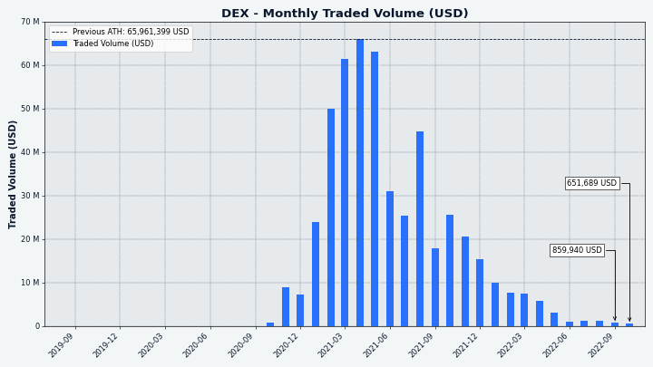

# Decred月报 – 2022 年 10 月

_图片：@Exitus_

十月亮点：

- 发布 Decred 核心软件 v1.7.5 和 DCRDEX v0.5.4 补丁。
- Decred 时间戳服务 (timestamp.decred.org) 用于为巴西选举中候选人的政治竞选文件添加时间戳。
- decred.org 网站更新，包括新的新闻页面，您可以在其中找到所有最新的月报问题。
- 在获得 66% 的支持率后，Monde PR 服务又持续了一年。

内容：

- [核心软件v1.7.5 发布](#core-software-v175-released)
- [开发进展总结](#development)
- [人员](#people)
- [治理](#governance)
- [网络](#network)
- [生态系统](#ecosystem)
- [外展](#outreach)
- [媒体](#media)
- [讨论](#discussions)
- [市场](#markets)
- [相关外部信息](#relevant-external)

## 核心软件v1.7.5 发布

[v1.7.5 版本](https://twitter.com/decredproject/status/1581003123287461888)的亮点：

- **dcrd** 获得了 UTXO 缓存更新，以提高其稳定性，并纠正一些难以解决的极端情况，这些情况涉及手动块失效、条件刷新和连续不干净关闭的混合。

- **dcrwallet** 获得了一种将公钥导入观察钱包的方法，以及命令 VSP 如何对国库支出进行投票的 gRPC 方法。修复包括：`signrawtransaction` 现在尊重传递给它的私钥，如果服务器未知，自动购票者不再尝试混合更改，并且从自动购票器发现的节点列表不再限于已弃用的 SPV 版本。最后，此版本强制执行 testnet3 硬分叉以防止 ASIC 停止测试网络。

- **Decredition** 的更新主要是由于 DCRDEX v0.5.4 中包含的关键修复。其他更改包括修复国库支出选项卡上永无止境的加载按钮。

访问[GitHub 版本](https://github.com/decred/decred-binaries/releases)以获取更改和下载的完整列表。一如既往，我们建议在运行前[验证文件](https://docs.decred.org/advanced/verifying-binaries)。

独立**DCRDEX 应用程序**的用户应在[此处](https://github.com/decred/dcrdex/releases)升级到最新版本，特别是为了避免比特币上的某些 Taproot 交易出现问题，这些问题已在 v0.5.4 和 v0.5.5 中修复。

## 开发进展总结

除非另有说明，否则下面报告的工作为“合并至核心存储库”状态。这意味着该工作已完成、审查并集成到高级用户可以[构建和运行](https://medium.com/@artikozel/the-decred-node-back-to-the-source-part-one-27d4576e7e1c)的源代码中，但普通用户尚不可用。

### dcrd

_[dcrd](https://github.com/decred/dcrd) 是一个完整的节点实现，为 Decred 在全球的点对点网络提供支持。_

- 在连接到对等节点时利用 [服务器](https://github.com/decred/dcrd/pull/3011) 使其更具响应性。
- 使用 [RPC 测试](https://github.com/decred/dcrd/pull/3012)。 它允许做两件事：测试取消和关闭是否正常工作，以及在必要时能够中止测试。
- 确保对等地址已[添加到地址管理器](https://github.com/decred/dcrd/pull/3013)。 它有助于加快网络上新节点的发现速度，方法是确保将它们添加到需要尝试的地址列表中，以便在以前从未见过它们时建立声誉。

### dcrwallet

_[dcrwallet](https://github.com/decred/dcrwallet) 是命令行和图形界面钱包应用程序使用的钱包服务器。_

- [context usage](https://github.com/decred/dcrwallet/pull/2188)的多项修复。 “context usage”用于向同时运行的各种服务发出信号，表明它们必须作为优雅的钱包关闭的一部分停止。

### Decrediton

_[Decrediton](https://github.com/decred/decrediton) 是一款功能齐全的桌面钱包应用程序，集成了投票、StakeShuffle 混币、闪电网络、DEX 交易等。它可在有或没有完整区块链（SPV 模式）的情况下运行。_

- 升级 DCRDEX 模块从[v0.5.3](https://github.com/decred/decrediton/pull/3812)到[v0.5.4](https://github.com/decred/decrediton/pull/3816). 后者包括对比特币区块解析的关键修复。
- 更新了[用于翻译的英文字符串](https://github.com/decred/decrediton/pull/3807)。 定期扫描代码库以查找 UI 上显示的文本，并将该文本收集在一个 [特殊文件](https://github.com/decred/decrediton/blob/master/app/i18n/translations/original.json) 中 可以用网页助手工具翻译。 换句话说，原文是新鲜的，现在是 [翻译](https://decredcommunity.github.io/translations/status#decrediton) 的好时机。

### Politeia

_[Politeia](https://github.com/decred/politeia) 是 Decred 的提案系统。它用于向 Decred 国库请求资金。_

`politeiavoter` 命令行应用程序：

- 通过先创建未签名的选票，然后从钱包中获取签名来整合[投票逻辑](https://github.com/decred/politeia/pull/1682)。 这种方法更简单，更不容易出错。

新[插件架构](https://github.com/decred/politeiagui/tree/master/plugins-structure#politeiagui---plugins-structure) 的 GUI 改造：

- 实施提案 [投票搜索](https://github.com/decred/politeiagui/pull/2863)。
- 实施提案 [作者更新](https://github.com/decred/politeiagui/pull/2860)，以平面模式回复的评论预览，以及单个评论链接。
- 实施提案 [投票下载](https://github.com/decred/politeiagui/pull/2865)。
- 优化 [代码拆分和块缓存](https://github.com/decred/politeiagui/pull/2868)，并将应用程序包从 1.5 MB 减少到 0.7 MB（未压缩大小）。
- 修复和重构。

pi-ui 库（由 Politeia 和 Decrediton 共享）：

- [优化构建](https://github.com/decred/pi-ui/pull/466) 并启用压缩，将包大小从 740 KB 减少到 430 KB。
- 依赖性和测试改进。

### 闪电网络

_[dcrlnd](https://github.com/decred/dcrlnd) 是 Decred 的闪电网络节点软件。LN 支持即时和低成本的交易。_

- [小道消息](https://github.com/decred/dcrlnd/pull/165) 时间戳现在被保留。 重新启动后，它会被发送到远程对等点以请求自该时间戳以来的消息。 这允许离线一段时间的节点获取丢失的八卦消息（特别是“ChannelUpdates”）以正确更新它们的本地网络视图。 在此更改之前，保持离线时间足够长的节点可能会错过许多“通道更新”-s，并错误地将现有通道标记为数据库中的僵尸。
- [维护](https://github.com/decred/dcrlnd/pull/165)：将最低 Go 版本更新为 1.18，更新为新格式。

### DCRDEX

_[DCRDEX](https://github.com/decred/dcrdex) 是一个非托管、尊重隐私的去信任交易所，由原子交换提供支持。_

[v0.5.4 发布](https://github.com/decred/dcrdex/releases/tag/v0.5.4):

- 更新上游 btcd 以修复比特币 [区块解析失败](https://github.com/decred/dcrdex/pull/1897)。 现在比特币主网和测试网上的区块包含更大的 Taproot 交易，这些交易不能被 btcd v0.23.1 及更早版本反序列化。该问题会影响使用全节点 (RPC) 或 SPV 钱包的接受者。

面向用户的更改合并到 `master`:

- 动态显示新匹配 [无需重新加载](https://github.com/decred/dcrdex/pull/1864) 订单页面。
- 重新设计了 [市场页面](https://github.com/decred/dcrdex/pull/1825) 并使其在台式机、平板电脑和移动设备布局中具有响应性。
- 拒绝发送表单上的[无效地址](https://github.com/decred/dcrdex/pull/1840)。 还修复了费用估算不受支持或失败时的处理，因此即使没有费用估算也可以发送。
- 支持 Electrum 钱包的[自定义钱包路径](https://github.com/decred/dcrdex/pull/1870)。 此外，支持未受保护的 Electrum 钱包（没有密码的钱包）。
- 当用户拥有 [活动订单](https://github.com/decred/dcrdex/pull/1904) 时尝试注销时会显示错误。
- 添加了一个[表单](https://github.com/decred/dcrdex/pull/1916) 以从客户端删除存档记录（订单和匹配），以及将删除的记录导出为 CSV 文件的选项。
- 更新了[中文翻译](https://github.com/decred/dcrdex/pull/1871)。
- 修复了 [加速订单按钮](https://github.com/decred/dcrdex/pull/1847) 在 swap tx 被挖掘后不隐藏的问题。
- 修复了[市场页面](https://github.com/decred/dcrdex/pull/1890) 上的多个 UI 错误。
- ~2 个其它错误修复。

内部和开发人员更改：

- 对测试稳定性、本地化系统和文档进行了大量改进。
- 当 WebSocket 连接关闭时，[请求超时](https://github.com/decred/dcrdex/pull/1915) 过期，以避免在关闭时挂起。
- 修复了[未连接钱包](https://github.com/decred/dcrdex/pull/1891) 的恢复并增加了对恢复禁用钱包的支持。
- 修复了 ZEC 的 [锁定余额](https://github.com/decred/dcrdex/pull/1918) 计算。 这需要为钱包实施一个解决方法，而不是自动解锁花掉的硬币。 目前 DOGE 和 ZEC 需要这个。
- 修复并改进了 [simnet 测试](https://github.com/decred/dcrdex/pull/1909)。 大多数测试将运行两次，在客户之间交替进行制造商和接受者。 这有助于发现一些错误。
- 修复了 HTML 模板解析 [包含Dash](https://github.com/decred/dcrdex/pull/1923)。
- ~2 个其它错误修复。

以太坊支持：

- 改进了 [ETH 钱包](https://github.com/decred/dcrdex/pull/1893) 连接管理。
- 在 ETH 和 ETH 代币钱包中添加了 [gas限制](https://github.com/decred/dcrdex/pull/1894)，这样一个区块最多 1/4 的 gas 限制可以被交换填满或赎回交易。 这应该可以防止一些巨大的[不可交换的订单](https://github.com/decred/dcrdex/issues/1771)。
- 实现了 [RPC 客户端](https://github.com/decred/dcrdex/pull/1832)，用于通过 WebSockets、HTTP 或 IPC 连接与以太坊节点通信。

保真债券:

- 为 DCR [保真债券](https://github.com/decred/dcrdex/pull/1818) 实施基础：债券交易结构、创建/广播/退款债券（针对客户）的通用接口、债券的解析和验证 tx（对于服务器）。 限时 [保真债券](https://en.wikipedia.org/wiki/Fidelity_bond) 将取代当前的注册费系统。 债券将在一定时间后由发布债券的用户赎回，从而增加使用 DCRDEX 的机会成本，而不是简单的货币成本。 它也是构建 [服务器网格](https://github.com/decred/dcrdex/issues/1765) 的先决条件。 为了使过渡更顺利，客户端和服务器保留了所有旧版注册收费机制，客户端暂时继续使用旧版注册系统。

_图片：DCRDEX 上重新设计的市场页面，桌面布局。 显示的数据不是真实的。_

### 文档

_[dcrdocs](https://github.com/decred/dcrdocs) 是 Decred [用户文档](https://docs.decred.org/) 的源代码。_

- 更新了 [mkdocs-material 主题](https://github.com/decred/dcrdocs/pull/1210)。 其中一项新功能是自动生成的社交平台卡，这些卡显示为链接预览，例如 推特。
- 重新设计了一些页面标题，使其在单独显示时更有意义（例如，“概述”变为“治理概述”）。

### decred.org

_[dcrweb](https://github.com/decred/dcrweb) 是 decred.org 网站的源代码。_

- 将 [国际化（翻译）内容移至子目录](https://github.com/decred/dcrweb/pull/1086)。 这修复了翻译后的新闻稿未以非英语语言显示的问题，并允许删除 100 多个空文件。
- 在页脚添加了 [`/vsp` 链接](https://github.com/decred/dcrweb/pull/1084)，以便用户可以轻松找到投票服务提供商。
- 重命名“新闻”，并在标题导航栏中 [添加链接](https://github.com/decred/dcrweb/pull/1084) 到 `/news`，使 [Decred 新闻](https ://decred.org/news/) 更容易访问。
- 添加了大量由以前版本组成的[新闻帖子](https://github.com/decred/dcrweb/pull/1084)。
- 确保新闻项目始终按日期 [排序](https://github.com/decred/dcrweb/pull/1084)。
- 添加了 [类别过滤器](https://github.com/decred/dcrweb/pull/1090) 到 `/news`。 这使观众可以轻松地在软件发布、Decred 期刊、新闻发布和 Decred 媒体报道之间切换。 每个类别都有一个 [直接链接](https://decred.org/news/#software_releases)，它们无需 JavaScript 即可工作。
- 为 [波兰语和中文](https://github.com/decred/dcrweb/pull/1084) 添加了“新闻”翻译 。
- 修复了新闻页面上的[重叠](https://github.com/decred/dcrweb/pull/1084) 文本和按钮。

_图片：decred.org 上的新闻页面。_

### 其它

[dcrseeder](https://github.com/decred/dcrseeder) - 构建可靠 Decred 节点列表的节点爬虫，新节点使用它来引导它们的连接：

- 不要添加 [RFC6598](https://github.com/decred/dcrseeder/pull/54) ([运营商级 NAT](https://en.wikipedia.org/wiki/Carrier-grade_NAT)) 地址。 全球 dcrseeder 不应将这些地址返回给 Decred 节点，因为它们是为私有网络保留的，无法从互联网上的任何节点可靠地连接到。
- 转换为使用 [`netip`](https://github.com/decred/dcrseeder/pull/55) 包来管理网络地址。
- 检查节点的正常运行时间是否[足够长](https://github.com/decred/dcrseeder/pull/57) 被视为“良好”。

[release](https://github.com/decred/release) - 用于制作 Decred 软件[可重现构建](https://reproducible-builds.org/) 的自动化工具：

- [更新](https://github.com/decred/release/pull/64) 构建核心软件 v1.7.5、DCRDEX v0.5.4、Politeia v1.4.0。
- 在 [Windows](https://github.com/decred/release/pull/65) 和 [macOS 和 OpenBSD](https://github.com/decred/release/pull/66) 上使用系统的本地 DNS 解析器 )，而不是 反回退解析器。

## 人员

我们对 Decred 社区成员进行了两次新的采访。

[Tiago Alves Dulce](https://www.decredmagazine.com/tiago-alves-dulce-developer-q-a/) (@tiagoalvesdulce) 分享了他作为 Politeia 开发人员做出贡献的故事和想法。

> Victor 对加密货币充满热情，并且一直向我们推销它。 费尔南多和我对此仍然持怀疑态度。 2017 年底，Victor 开始为 Decred 做贡献，我们决定对其进行研究。 我们喜欢我们所看到的。 这是为一个很酷的开源项目做出贡献的好机会，我们在 2018 年初开始这样做。随着时间的推移，我对这个项目的研究越来越多，并对它充满了热情。

Eduardo Lima (@elima\_iii) 加入了[市场状况](https://www.youtube.com/watch?v=COfKWnl7IYs) 节目，谈论他的法律研究论文 “但谁负责 Decred？ "、他在项目中的状态以及许多其他主题。

> 我相信，所有这一切、公民自由的一些英雄构建者，说实话，是软件开发人员。 正在构建技术的人。 (...) Decred 有点已经面向未来，但如果我们不为点对点交换的权利而战，如果我们不为隐私权而战，如果我们不为之而战 为了我们不被审查和不被禁止的权利，并且在您的资产被刚刚拿走和冻结之前有正当的法律程序，如果我们不为这些东西而战，它们将不会给我们。 所以我要感谢那些开发人员。

截至 11 月 1 日的社区统计数据（与 10 月 1 日相比）：

- [Twitter](https://twitter.com/decredproject) 粉丝: 53,954 (-65)
- [Reddit](https://www.reddit.com/r/decred/) 订阅: 12,632 (-5)
- [Matrix](https://chat.decred.org/) #general 用户: 726 (+6)
- [Discord](https://discord.gg/GJ2GXfz) 用户: 1,857 (+36)
- [Telegram](https://t.me/Decred) 用户: 2,862 (-29)
- [YouTube](https://www.youtube.com/decredchannel) 订阅: 4,640 (-10), 观看: 218K (+2K)

## 治理

10 月，新[国库](https://dcrdata.decred.org/treasury) 收到 8,850 DCR，价值 232,000 美元，10 月的平均汇率为 26.27 美元。 2,645 DCR 用于支付承包商费用，按 10 月的费率计算价值 69,000 美元，按 9 月的 27.19 美元费率计算价值 72,000 美元。

[国库支出交易](https://dcrdata.decred.org/tx/f79381e591ef46c9ed911d936a9c329d62ac63cd9674d9c2db5855d2e4317358) 有 31 个输出支付给承包商，范围从 2.3 DCR 到 1,028 DCR。

截至 11 月 1 日，[旧国库](https://dcrdata.decred.org/address/Dcur2mcGjmENx4DhNqDctW5wJCVyT3Qeqkx) 和 [新国库](https://dcrdata.decred.org/treasury) 的合并余额为 824,840 DCR（2250 万） 美元 27.28 美元）。

以 48,000 美元的费用继续保留 Monde PR 服务一年的 [提案](https://proposals.decred.org/record/d5221a9) 以 66% 的赞成票和 59% 的选民投票率获得批准。

[提案](https://proposals.decred.org/record/0848cc9) 以 1,955 美元的价格资助在 [@dcrtimestampbot](https://twitter.com/dcrtimestampbot) Twitter 机器人上完成的工作 @coinshuffle\_bot。

有关本月提案的更多详细信息，请参阅 Politeia Digest [第 54 期](https://blockcommons.red/politeia-digest/issue054/)。

## 网络

**全网算力**: 10 月的 [全网算力](https://dcrdata.decred.org/charts?chart=hashrate&scale=linear&bin=day&axis=time) 以 70 Ph/s开启，以 97 Ph/s结束，最低为 65 Ph/s，峰值 97 Ph/s。

_图片：Decred hashrate._

11 月 1 日各矿池的 84 Ph/s 算力分布[报告](https://poolbay.io/crypto/54/decred)：F2Pool 59%，Poolin 26%，AntPool 5%，BTC.com 4.6%。

截至 11 月 1 日实际 [开采](https://miningpoolstats.stream/decred) 1,000 个区块的分布：F2Pool 57%，Poolin 33%，（可能）AntPool 6%，BTC.com 3.6%，CoinMine 0.9%。

_图片：矿池算力分布。_

**Staking**: [选票价格](https://dcrdata.decred.org/charts?chart=ticket-price&axis=time&visibility=true-true&mode=stepped) 在 224-246 DCR 之间变化，30 天 [平均](https://dcrstats.com/) 为 233.7 DCR (+4.6)。

[锁定数量](https://dcrdata.decred.org/charts?chart=ticket-pool-value&scale=linear&bin=day&axis=time) 为 933-951 万 DCR，这意味着 64.0-65.0% 的循环供应 [参与](https://dcrdata.decred.org/charts?chart=stake-participation&scale=linear&bin=day&axis=time) 在权益证明中。

_图片：Staked DCR 突破 950 万。_

**VSP**: [17 家列出的 VSP](https://decred.org/vsp/) 共同管理了约 6,800 (-1,020) 张现场选票，截至 11 月 1 日，占选票池的 16.7% (-2.4%)。注意：这些 数字不包括存在 [API 问题](https://github.com/decred/dcrwebapi/pull/171) 并报告过时数据的 vspd.stakey.com。 它最新的最新报告是 10 月 3 日的 1,332 张现场门票，其中一些仍然在现场，而真正的 VSP 统计数据在 11 月 1 日略高。

10 月份涨幅最大的是 99split.com (+790)、decredcommunity.org (+233)、123.dcr.rocks (+76) 和 big.decred.energy (+71)。

**节点**: [Decred Mapper](https://nodes.jholdstock.uk/user_agents) 在 11 月 1 日观察到 157 个 dcrd 节点：v1.7.0 - 10%、v1.7.1 - 27%、v1.7.2 - 15%、v1.7.4 - 10%，v1.7.5 - 23%，v1.8.0 开发构建 - 4%，其他 11%。

_图片：可访问的 dcrd 节点版本。_

[混合硬币](https://dcrdata.decred.org/charts?chart=coin-supply&zoom=jz3q237o-la8vk000&scale=linear&bin=day&axis=time&visibility=true-true-true) 的份额在 60.7-61.0% 之间变化。 每日 [混合数量](https://dcrdata.decred.org/charts?chart=privacy-participation&bin=day&axis=time) 在 293-461K DCR 之间变化。

截至 11 月 1 日，Decred 的闪电网络浏览器已经看到 69 个节点（-1）、112 个通道（+7），总容量为 46.9 DCR（+4.4）。感谢@karamble 在 [LN 地图](https://ln-map.jholdstock.uk/) 期间提供数据维护。

## 生态系统

最大的 VSP [stakey.com](http://vspd.stakey.com/) 自 9 月 20 日左右开始出现问题，当时它有 2,183 张票，占所有 VSP 票的 28% 和所有实时票的 5%。 [API 端点](https://vspd.stakey.com/api/v3/vspinfo) 没有响应并且 decred.org [VSP API](https://api.decred.org/?c) 返回的数据 =vsp) 已经过时了。 服务运营商 @dema501 [评论](https://github.com/decred/dcrwebapi/pull/171#issuecomment-1279775352) 投票钱包功能正常，但 API 服务器处于不稳定状态。 [错过的选票](https://dcrdata.decred.org/charts?chart=missed-votes) dcrdata 的图表证实，截至 11 月 14 日，错过的选票没有出现峰值。

Binance [添加 DCR](https://twitter.com/binance/status/1582933735019663361) 到其 [简单赚取灵活的产品](https://www.binance.com/en/support/announcement/binance-adds-new-assets-to-simple-earn-flexible-products-2022-10-20-87e0f4b74c884d83b09ae4f3c2fd7b82)。 该服务允许人们在灵活的时间段内存入 DCR 并获得每日奖励（根据一份报告，年利率约为 2.5%）。 简单赚取 [已替换](https://www.binance.com/en/support/announcement/introducing-simple-earn-the-evolution-of-binance-savings-binance-staking-b067f764f4f14e5aa46cca1bf2b55ab8) 币安储蓄和币安质押 平台及其[灵活产品](https://www.binance.com/en/support/faq/get-started-with-binance-simple-earn-flexible-products-3bd1a6eba20a445da1e94bf6cfa52e80)组件是灵活产品的新名称 储蓄。

decred.org 更新：

- 将 [ChangeNOW](https://github.com/decred/dcrweb/pull/1093) 添加到 [交易所页面](https://decred.org/exchanges/)。
- 从 [钱包页面](https://decred.org/wallets/) 中删除了 Android 和 iOS [移动钱包](https://github.com/decred/dcrweb/pull/1092)，因为它们不再被维护。

Decred采用：

- 巴西总统候选人卢拉·达席尔瓦和圣保罗政府候选人费尔南多·哈达德的政府计划在 Decred 区块链上加盖了时间戳，以打击假新闻。 这可以通过从 [公告](https://haddadoficial.com.br/lula-e-haddad-registram-plano-de-governo-em-blockchain-para-evitar-fake-news/ )，计算他们的 SHA-256 并在 [timestamp.decred.org](https://timestamp.decred.org/) 上检查这些哈希值。 此前在巴西，Haddad 的 [2018 年活动](https://web.archive.org/web/20181106225509/https://www.obrasilfelizdenovo.com/haddad-blockchain-bitcoin-plano-governo/) 使用了 Decred 时间戳 为总统和 2020 年圣保罗 [市政选举](https://www.decredmagazine.com/how-decred-how-decred-contributed-to-a-more-transparent-election-in-brazil/) 通过 [VotoLegal](https://blockchain.votolegal.com.br/) 平台。

警告：Decred Journal 的作者不知道上述任何服务的可信度。 在将您的个人信息或资产委托给任何实体之前，请自行研究。

加入我们的 [#ecosystem](https://chat.decred.org/#/room/#ecosystem:decred.org) 聊天以关注 Decred 生态系统更新。

## 外展

Monde PR's 成就:

- 发布了 1 条新闻更新。
- 获得 2 次媒体采访。
- 回应了 5 条评论请求。

获得以下新闻文章：

- @jy-p 在 [Digital Cash Network Podcast](https://www.youtube.com/watch?v=SzUtXnoJBbc) 上接受采访，谈论 Decred 的混合共识模型。
- 在 [NYC Crypto](https://nyccrypto.io/?p=96803) 上发布了一篇 Axios 文章，其中包含@jz 关于加密和隐私的未来的评论。
- [BeInCrypto](https://br.beincrypto.com/planos-governo-lula-haddad-registrados-blockchain/) 中关于 Decred 的区块链如何在巴西总统选举中用于打击假新闻的文章。

## 媒体

**精选文章：**

- 支持莱特币的 DCRDEX v0.5 版本出现在[每周最佳 FTX 信号](https://blog.blockfolio.com/this-week-in-signal-teams-iota-decred-thorswap-7248bedfe56c) 博客中
- [了解人们为什么不喜欢 NFT（和加密货币）](https://blockcommons.red/post/nfts/) @richardred（_估计为“171 分钟阅读”，明天见！_）
- [为加密市场创建营销内容](https://www.decredmagazine.com/creation-of-marketing-content-for-the-crypto-market/) @Joao
- [Tiago Alves Dulce 开发者问答](https://www.decredmagazine.com/tiago-alves-dulce-developer-q-a/) @phoenixgreen
- [隐私币是未来证明吗？](https://www.decredmagazine.com/are-privacy-coins-future-proof/) by @MadScrilla1
- [Decred vs Zcash：一个诚实的比较](https://www.decredmagazine.com/decred-vs-zcash-a-honest-comparison/) by @Joao

[Decred 杂志](https://www.decredmagazine.com/) 10 月份的参与度统计数据：

- DM 文章总数：334
- 目前的时事通讯订阅者：72
- 发送的通讯总数：16
- 活跃的社交媒体活动：15
- 完成的社交媒体活动：17
- 社交媒体帖子：120
- 喜欢：557
- 转发：110
- 所有平台和账户的社交媒体粉丝：1,020

**视频:**

- [谁负责 Decred？ - Decred 和市场状况。 Eduardo Lima](https://www.youtube.com/watch?v=COfKWnl7IYs) @phoenixgreen 和@Exitus - 讨论@elima\_iii 的[法律研究论文](https://twitter.com/elima_iii/status/ 1567977181682479105) ([谷歌文档](https://docs.google.com/document/d/1xiFYTU5aFthkUs9gIK1elNKJACsaZf4r/edit), [镜像](https://www.decredmagazine.com/whos-in-charge-of-decred -市场现状/))
- [点对点交换 - 未来就在这里 - Decred DCRDEX](https://www.youtube.com/watch?v=oBrJgG-x9UY) @phoenixgreen - 也作为[文本帖子](https:// www.decredmagazine.com/peer-to-peer-exchange-the-future-is-here-decred-dcrdex/)
- [DCRDEX 第一眼 - DecredDEX 基础知识](https://www.youtube.com/watch?v=S4fVlYmo2Vk) @phoenixgreen - 也作为[文本帖子](https://www.decredmagazine.com/dcrdex- 第一眼-decreddex-基础知识/）
- [发现 DCRDEX 市场页面 - DCRDEX 基础知识](https://www.youtube.com/watch?v=67cduOxn7JM) @phoenixgreen - 也作为[文本帖子](https://www.decredmagazine.com/discovering -dcrdex-市场页面/)
- [Decred 新闻更新 - 巴西未来总统在 DEX 上使用时间戳、LTC 市场，dcrd v1.7.5](https://www.youtube.com/watch?v=OOWQ7sxr43E) @Exitus
- [Jake Yocom-Piatt 谈 Decred 的 PoW/PoS 混合和敌对矿工问题](https://www.youtube.com/watch?v=SzUtXnoJBbc)，作者是数字现金网络的 Joël Valenzuela - 也作为 [播客](https ://anchor.fm/digitalcashnetwork/episodes/Jake-Yocom-Piatt-on-Decreds-PoWPoS-Hybrid-And-Hostile-Miner-Troubles-e1q1b0t)

[Decred Magazine](https://anchor.fm/decred-magazine) 上的 Anchor 播客和所有常见的播客平台（如 Spotify 或 Apple）上的许多 Decred 视频都以音频格式提供。 它由 [Decred Society](https://anchor.fm/decred-society) 重命名，使其成为社区播客而不是个人播客。 如果您喜欢边走边听，请尝试一下。

**艺术娱乐:**

- [Decred holding all cards](https://www.decredmagazine.com/decred-holding-all-cards/) @OfficialCryptos - 这种设计的商品 [在 Redbubble 上可用](https://www.redbubble. com/people/OfficialCryptos/explore?page=1&sortOrder=recent)（显然它是有时间戳的！）
- [Decred 是货币的进化！](https://www.decredmagazine.com/decred-is-money-evolved/) by @OfficialCryptos

**翻译:**

- Decred Journal 2022 年 8 月至 9 月有 2 个新的 [翻译](https://xaur.github.io/decred-news/)。 感谢@arij（阿拉伯语）和@Dominic（中文）！
-
**非英语内容:**

- [卢拉和哈达德在区块链上注册政府计划以避免假新闻](https://haddadoficial.com.br/lula-e-haddad-registram-plano-de-governo-em-blockchain-para-evitar-fake - news/)（英文）- [Cointelegraph Brasil](https://cointelegraph.com.br/news/lula-and-haddad-register-government-plan-on-blockchain) 和 [BeInCrypto] ( https://br.beincrypto.com/planos-governo-lula-haddad-registrados-blockchain/）。

_图片：@OfficialCryptos 的 Decred 商品。

## 讨论

精选的 Reddit 帖子：

- [Embrace Degeneracy](https://www.reddit.com/r/decred/comments/yhaqfe/embrace_degeneracy/) - u/ersfbddfgwe 的一个想法，旨在针对现代退化趋势进行营销和品牌推广。

## 市场

10 月，DCR 在 23.50-29.90 美元/BTC 0.00128-0.00152 之间交易。 平均每日费用为 26.27 美元。

_图片：以美元为单位的 DCRDEX 月交易量。_

## 相关外部信息

10 月是加密黑客和漏洞利用的重要月份，到 13 日 [已经](https://www.coindesk.com/tech/2022/10/13/october-becomes-worst-month-for-crypto- hacks-with-to-weeks-to-go/) 是 11 次不同的 DeFi 攻击，其中黑客获得了 7.18 亿美元。 其中最突出的是 Mango Markets，它 [hit](https://www.coindesk.com/markets/2022/10/12/how-market-manipulation-led-to-a-100m-exploit-on- solana-defi-exchange-mango/) 因一名交易员操纵某些价格以借入平台上的所有资产而获得 1 亿美元的利用。 其中一名攻击者 [推特](https://twitter.com/avi_eisen/status/1581326197241180160) 在与该平台协商了一项允许其他存款人的和解协议后，他们参与了一项“高利润交易策略” 重新获得他们的资金。 这个故事的另一个怪癖是，攻击者提出了在没有刑事指控的情况下解决问题的提议，然后用他们从 利用。

Kim Kardashian 已与 SEC [和解](https://www.coindesk.com/business/2022/10/03/us-sec-charges-kim-kardashian-for-promoting-ethereummax/)，同意支付 1.26 美元 M 在她 2021 年未公开的 EthereumMax 先令。美国证券交易委员会主席 Gary Gensler 一直[宣传](https://twitter.com/GaryGensler/status/1576897535427448832) 这是一个巨大的胜利。

Rune 对 MakerDAO 的“Endgame”提案已获批准，并且[注意到](https://twitter.com/SebVentures/status/1584875892555268096)大多数委托的 MKR 投票都由 Rune 控制。 MakerDAO 还[投票](https://cointelegraph.com/news/makerdao-goes-ahead-with-500m-investment-in-treasuries-and-bonds) 首先批准 100 万美元美国国债的试点交易 由 Coinbase 托管，随后 [确认](https://cointelegraph.com/news/makerdao-goes-ahead-with-500m-investment-in-treasuries-and-bonds) 将向 Coinbase 投资 16 亿美元 通过这种方式，获得 1.5% 的收益，用于支持协议开发和其他工作。

这就是十月的全部内容。 欢迎在我们的 [#journal](https://chat.decred.org/#/room/#journal:decred.org) 聊天室中分享您对下一期的更新。

## 关于月报

这是 Decred Journal 第 52 期。[此处](https://xaur.github.io/decred-news/)提供所有问题、镜像和翻译的索引。

来自第三方的大多数信息在经过最低限度的健全性检查后直接从源转发。Decred 月报的作者无法验证所有声明。请提防诈骗并进行自己的研究。

感谢 (字母排列):

- 写作、编辑、出版： bee, bochinchero, Exitus, jz, karamble, l1ndseymm, phoenixgreen, richardred
- 评论和反馈： davecgh
- 标题图片： Exitus
- 资助： Decred stakeholders

## 中文社区

* [微博](https://www.weibo.com/DecredProject)
* [微信公众号](https://mp.weixin.qq.com/mp/profile_ext?action=home&__biz=Mzg2NTExNzc3MA==&scene=124#wechat_redirect)
* [bilibili频道](https://space.bilibili.com/425519478)
