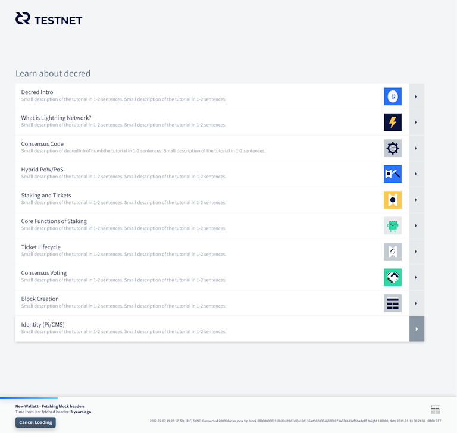
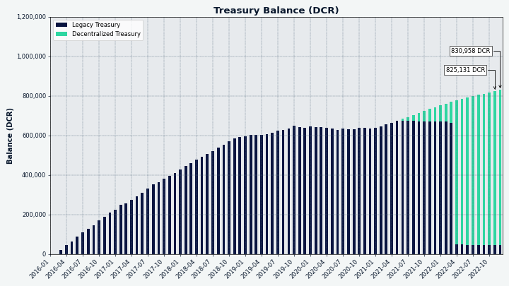
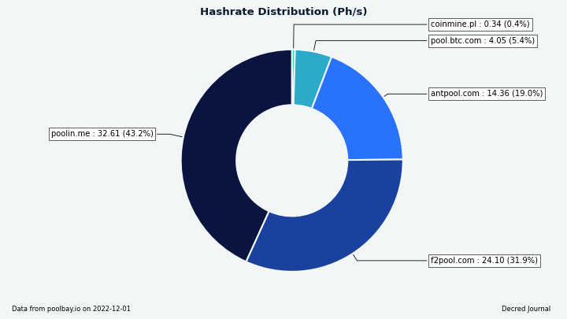
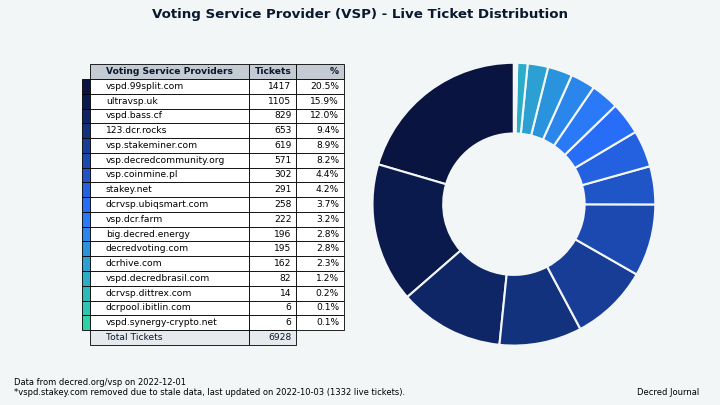

# Decred月报 – 2022 年 11 月

_图片：@Exitus_

11 月亮点：

- Decrediton (v1.7.6) 和 DCRDEX (v0.5.7) 新版本修复了些许bug。

- 2022 年 11 月的重大加密新闻是 FTX 暴雷，他们停止处理提款导致恐慌蔓延，影响了许多知名交易所和基金。这些事件应该使 DCRDEX 的非托管和“储备证明”优势更加突出。

- 推特上的 @dcrtimestampbot 已重新激活。这是在 10 月结束的巴西全国大选中高调使用 Decred 链作为时间戳之后，卢拉和圣保罗前市长哈达德在 Decred 链上为他们的治理计划加盖了时间戳，以打击假新闻。

内容:

- [Decrediton v1.7.6 发布](#decrediton-v176-release)
- [DCRDEX v0.5.7 发布](#dcrdex-v057-release)
- [开发进展总结](#development)
- [人员](#people)
- [治理](#governance)
- [网络](#network)
- [生态系统](#ecosystem)
- [外展](#outreach)
- [活动](#events)
- [媒体](#media)
- [讨论](#discussions)
- [市场](#markets)
- [相关外部信息](#relevant-external)

## Decrediton v1.7.6 发布

此版本修复了 DEX 的一些问题（模块更新到 v0.5.6），另外还有 1 个针对 Windows 的修复：

- DEX: 固定处理某些比特币 Taproot 交易。
- DEX: 修复了一些混合 Decred 钱包设置中的钱包解锁问题。
- DEX: 修复了内置 Decred 钱包中误导性的同步状态。
- 修复了使用在 Windows 中配置的备用 DNS 服务器的域名解析。

在 GitHub 上获取[最新版本](https://github.com/decred/decred-binaries/releases)。一如既往，我们建议在运行前[验证文件](https://docs.decred.org/advanced/verifying-binaries)。

## DCRDEX v0.5.7 发布

独立的 DEX 应用程序略高于上述 Decrediton 版本，包括自 v0.5.6 以来的这些变化：

- 修复了客户端可能无法完成订单取消，导致订单留在服务器账簿中的情况。
- 添加了自动取消从服务器收到的客户端不知道的订单，修复了一些边缘情况。

此版本还附带由 @chappjc 的密钥制作的签名`761D6A0BEB286C9B6A65DD053F857EEA746C64D1`，从而可以[验证](https://docs.decred.org/advanced/verifying-binaries) DEX 下载，直到它们作为下一个[核心软件版本](https://github.com/decred/decred-binaries/releases)的一部分可用。

最新的 DEX 应用程序可以在[这里](https://github.com/decred/dcrdex/releases)下载。

## 开发进展总结

除非另有说明，否则下面报告的工作为“合并至核心存储库”状态。这意味着该工作已完成、审查并集成到高级用户可以[构建和运行](https://medium.com/@artikozel/the-decred-node-back-to-the-source-part-one-27d4576e7e1c)的源代码中，但普通用户尚不可用。

### dcrd

_[dcrd](https://github.com/decred/dcrd) 是一个完整的节点实现，为 Decred 在全球的点对点网络提供支持。_

合并至 `master`:

- 在尝试连接之前更新对等节点 [时间戳](https://github.com/decred/dcrd/pull/3014)。
- 简化了原始交易及其附加 [描述](https://github.com/decred/dcrd/pull/3015) 在内存池中的存储方式。
- 调整 [内存管理](https://github.com/decred/dcrd/pull/3016) 以减少 CPU 时间进行垃圾收集。 有了这个 dcrd 可以以使用更多内存为代价，将初始链同步速度提高 10%。 一个很好的附带好处是，高级系统管理员现在可以使用环境变量来调整此行为。
- [启用](https://github.com/decred/dcrd/pull/3017) 并设置 [默认](https://github.com/decred/dcrd/pull/3019) 新的点对点协议 不再使用“拒绝”消息的版本。 该消息继承自原始 btcsuite 代码库，用于表示交易或区块被对等节点[“拒绝”](https://en.bitcoin.it/wiki/Protocol_documentation#reject)。 将此消息用于几乎任何事情都是不可靠或不正确的，因此提出了一项 [proposal](https://github.com/decred/dcrd/issues/2546) 来删除它。 与这个新协议版本协商的对等方将不再发送“拒绝”消息，如果收到则认为这是违规行为。 任何与旧版本协商的节点都不会因为发送“拒绝”而受到惩罚，并且会被新节点忽略。
- 添加新的[IPC事件](https://github.com/decred/dcrd/pull/3020)通知父进程分配给dcrd的地址和端口。 在 dcrd 由另一个进程（如 Decrediton 或自动测试运行器）控制的配置中，该父进程需要知道 dcrd 用于其 P2P 接口（与公共网络对话）和 RPC 接口（与钱包和其他本地通信）的地址和端口 客户）。 当 dcrd 的端口由操作系统随机分配且未由父进程配置时，此更改提供了一种可靠的方法来发现它们。
- 始终响应来自同行的 [`getheaders`](https://github.com/decred/dcrd/pull/3030) 请求。 如果本地链不被认为与网络完全同步，以前的逻辑将不会响应 `getheaders`。 在旧的“块优先”同步模型中，它有助于避免一些不希望出现的极端情况，例如不必要地下载块。 它也有缺点，比如一个节点可能对它的对等节点没有反应或停滞，同时处于活动状态并且根本没有任何有趣的数据可以共享。 在当前的“标头优先”同步模型中，不再需要此限制，并且在已知对等方是当前的之前提供标头不再导致不良行为。

RPC 服务器:

- 优化 WebSocket 客户端断开连接处理并修复 WebSocket 客户端断开连接时的虚假消息。
- 修改WebSocket客户端的[lifecycle](https://github.com/decred/dcrd/pull/3025)使用context，调用代码更加灵活。
- 为 `getwork` 请求添加了[取消支持](https://github.com/decred/dcrd/pull/3027) 并优化了对多个并发 `getwork` 请求的处理。 这应该有利于一些挖矿配置。 [`getwork`](https://en.bitcoin.it/wiki/Getwork) 被挖矿软件用来不断轮询节点以获取新工作，然后将其分发到挖矿硬件。 对于有挖矿的硬币来说，这是一种非常常见的方法，但是鼓励 Decred 矿工使用更高效的 [`notifywork`](https://github.com/decred/dcrd/blob/0e7920ce30257aa1aced00e34ac637423f50965e/docs/json_rpc_api.mediawiki#notifywork)订阅。

RPC 测试框架已移至名为 [`dcrtest`](https://github.com/decred/dcrtest) 的新存储库。 该框架连接到 dcrd 实例并通过 [RPC 接口](https://bitcoin.stackexchange.com/questions/24163/what-does-the-bitcoin-rpc-mean-and-how-is-it-used)。 它用于编写集成级测试，以执行完全编译的 dcrd 二进制文件的功能和行为。 现在位于一个单独的存储库中，它通过使用 Go 的模块系统而不是总是编译最新的“master”分支来选择特定版本的 dcrd 进行测试，从而提供更好的功能。 这允许测试框架的消费者（例如 dcrlnd）通过针对 dcrd 的发布版本以及最新的“master”进行测试来提供更多的质量保证。

### dcrwallet

_[dcrwallet](https://github.com/decred/dcrwallet) 是命令行和图形界面钱包应用程序使用的钱包服务器。_

- 将 `decred.org/dcrwallet` 模块的 [主要版本](https://github.com/decred/dcrwallet/pull/2189) 更新到版本 3，将当前正在进行的模块的所有依赖项从 dcrd 更新到它们的 相应的主要版本，删除未使用的代码。
- 允许 [管道答案](https://github.com/decred/dcrwallet/pull/2191) `--create` 提示不仅对初始密码提示而且对确认也能正常工作。 这有助于自动创建钱包（例如，通过管道传输文本文件中的所有答案）。
- Hex 种子 [钱包恢复](https://github.com/decred/dcrwallet/pull/2192) 不再需要额外的换行符。 这也有助于 [非交互式](https://github.com/decred/dcrwallet/issues/2190)（自动）部署 dcrwallet。
- 添加了 RPC 请求以允许 Decrediton 获取和更新[待处理的 TSpend 策略](https://github.com/decred/dcrwallet/pull/2172)。

### Decrediton

_[Decrediton](https://github.com/decred/decrediton) 是一款功能齐全的桌面钱包应用程序，集成了投票、StakeShuffle 混币、闪电网络、DEX 交易等。它可在有或没有完整区块链（SPV 模式）的情况下运行。_

[v1.7.6 发布](https://github.com/decred/decred-binaries/releases/tag/v1.7.6):

- [升级](https://github.com/decred/decrediton/pull/3834) DCRDEX 模块到 v0.5.6（BTC 和 DCR 的错误修复）并在 DEX 窗口中添加了一个图标。

在 `master` 的下一个版本中，钱包启动器已经 [重新设计](https://github.com/decred/decrediton/pull/3690)：

- 向启动器添加了进入教程。
- 向钱包卡片添加渐变。 每个钱包的梯度都保存在配置中。
- 将重新设计的进度条移至底部。
- 删除了 `RescanWallet` 组件。 重新扫描进度现在集成到进度条中，并且在进度期间显示入职教程列表。
- 引入了一个新的进度条指示获取块头的过程。
- 添加了 Trezor 钱包设置选项。
- 添加了自动钱包启动模式。 用户选择保存到配置中。

DEX:

- [已删除](https://github.com/decred/decrediton/pull/3800) 比特币钱包设置步骤有利于 DEX 模块提供的内置 BTC 钱包。 添加了 DEX 视图和操作的测试。
- 更改[钱包密码](https://github.com/decred/decrediton/pull/3822)时，用户可以输入他们的 DEX 应用密码，让 DEX 知道新的钱包密码。 对于那些通过 Decrediton 使用 DEX 的人来说，这修复了令人困惑的密码更改 UX。
- 修复了重新加载 UI 后 DEX 窗口[无法启动](https://github.com/decred/decrediton/pull/3831) 的问题。

UX 升级:

- [添加链接](https://github.com/decred/decrediton/pull/3778) 到交易详情页面上花费的选票和 VSP 费用。 这些链接现在在 Decrediton 本地打开，而不是发送到 dcrdata。 如果链接的交易还不在内存中（例如太旧），它将在后台从 dcrwallet 中获取。
- 添加了启动步骤以将投票偏好重新发送到 [最近升级的 VSP](https://github.com/decred/decrediton/pull/3738)。 发送给运行旧软件的 VSP 的共识投票选择会丢失，因为 VSP 不知道新的共识投票。 如果此类 VSP 升级，可能 [有必要](https://github.com/decred/decrediton/issues/3723) 向其重新发送投票选择，以便它可以使用其管理的票对最新的共识议程进行投票。
- 在整个钱包中以问号形式添加了[文档链接](https://github.com/decred/decrediton/pull/3802)。
- 重新设计了 [Trezor 页面](https://github.com/decred/decrediton/pull/3570)。
- 通过自动化以下步骤改进了[购买一张混合票](https://github.com/decred/decrediton/pull/3819) 的流程：禁用混合器、购买票、重新启用混合器。
- 现在投票偏好 [异步更新](https://github.com/decred/decrediton/pull/3801)。 开发人员 @bgptr 报告说，该过程在主网上快了 3 倍（3 秒对 11 秒）。 错误处理也得到了改进。

其它变化:

- 将包 `win32ipc` 重命名为 `dcrwin32ipc` 以 [避免混淆](https://github.com/decred/decrediton/pull/3828) 与同名的可疑远程包。 确定这个其他可疑包对 Decred 软件没有任何风险，并且 Decrediton 的模块总是从本地构建的资产加载。
- 修改了[事务处理](https://github.com/decred/decrediton/pull/3777) 代码以提高性能并启用自动化测试。
- 删除了所有 [旧版 stakepool 相关代码](https://github.com/decred/decrediton/pull/3808)。 还清理了与购票和汽车购买相关的代码结构。 隐私选项卡现在可以正确显示混音每 10 分钟创建一次，而不是 20 分钟。
- 为[希腊语](https://github.com/decred/decrediton/pull/3719)添加翻译。
- 当代理类型为 SOCKS5 时，将 [代理设置](https://github.com/decred/decrediton/pull/3803) 应用于 dcrd 和 dcrwallet。 有了这个，用户可以配置 dcrd 和 dcrwallet 通过 Tor 网络进行通信。
- 增加了自动化 UI 测试的覆盖范围。
- 依赖升级，包括切换到 [Node 16](https://github.com/decred/decrediton/pull/3837) 和 [Electron 18](https://github.com/decred/decrediton/pull/3832) .

修复:

- 修复了自动购票使用的钱包帐户的意外 [锁定](https://github.com/decred/decrediton/pull/3804)。
- 修复了同步期间的区块链下载 [时间估计](https://github.com/decred/decrediton/pull/3815)。
- 修复了成功或失败的购票、自动购买或运行混音器等后丢失的[重新锁定](https://github.com/decred/decrediton/pull/3819)。帐户锁定状态现在显示在帐户页面上以便于跟踪 .
- 修复了[交易视图](https://github.com/decred/decrediton/pull/3789)：截断长地址和账户名，显示票据的消费交易，修复块哈希显示，修复一些票据错误报告为Solo。
- 修复了无法在闪电网络选项卡中[关闭非活动通道](https://github.com/decred/decrediton/pull/3796) 的问题。
- 修复了恢复 Trezor 钱包时 [focus](https://github.com/decred/decrediton/pull/3839) 在种子词之间丢失的问题。

开发工具和文档:

- 记录了如何安装和升级 [Electron devtools](https://github.com/decred/decrediton/pull/3825)。
- 添加了用于分析 [捆绑包大小](https://github.com/decred/decrediton/pull/3826) 的脚本。

_图片：重新设计的 Decrediton 发布。_

_图片：在 Decrediton 中重新设计的 Trezor 设置。_

### Politeia

_[Politeia](https://github.com/decred/politeia) 是 Decred 的提案系统。它用于向 Decred 国库请求资金。_

以下所有更改都是针对新 [插件架构](https://github.com/decred/politeiagui/tree/master/plugins-structure#politeiagui---plugins-structure) 上的 GUI 重制。

[改进的导航](https://github.com/decred/politeiagui/pull/2866):

- 向 `core` 包添加了导航服务。 `core` 是一个基本的构建块，它的服务可以从任何插件或类似 Politeia 的应用程序中使用。
- 根据提案名称动态更新页面标题。
- 添加了可重复使用的“返回”链接组件并修复了遗留错误。

其它:

- 针对 [节点 18 和 19](https://github.com/decred/politeiagui) 构建和测试.
- 为通用 UI 组件添加了 [测试](https://github.com/decred/politeiagui/pull/2876)。
- 添加了一个 [工具包](https://github.com/decred/politeiagui/pull/2869) 以简化插件及其服务的配置和组合。
- 添加了 [GitHub Actions 工作流程](https://github.com/decred/politeiagui/pull/2873) 以独立于现有 GUI 应用程序构建和测试新的 GUI 改造。
- 在用户帐户页面中实现初始 [提交的提案](https://github.com/decred/politeiagui/pull/2877) 视图。
- 修复了服务器返回的一些[错误](https://github.com/decred/politeiagui/pull/2872) 的处理，并修复/更新了相关的端到端测试。

### vspd

_[vspd](https://github.com/decred/vspd) 是用于运行投票服务提供商的服务器软件。VSP 代表其用户全天候 24/7 投票，不能托管资金。_

- 添加了一个 [`vote-validator` 工具](https://github.com/decred/vspd/pull/335)。 这允许 VSP 管理员验证他们的 vspd 部署是否根据用户偏好正确投票。
- 在应用程序版本字符串中包含 [Git commit](https://github.com/decred/vspd/pull/357)。
- 为 vspd API 消费者添加了一个[可重复使用的 HTTP 客户端模块](https://github.com/decred/vspd/pull/359)。 这对于 dcrwallet、dcrwebapi 和 v3tool 等测试工具很有用。
- [构建系统](https://github.com/decred/vspd/pull/362) 改进。

### 闪电网络

_[dcrlnd](https://github.com/decred/dcrlnd) 是 Decred 的闪电网络节点软件。 LN 使即时和低成本交易成为可能。_

- 更新了 [最新](https://github.com/decred/dcrlnd/pull/168) dcrd 和 dcrwallet 测试版本。 这需要修复 simnet 矿工以解决挖矿过程中可能发生的票耗尽错误。
- 添加了 [选项](https://github.com/decred/dcrlnd/pull/170) 以在生成新地址时将间隙策略切换为 Wrap 而不是 dcrwallet 中的默认地址。 这修复了一个 [问题](https://github.com/decred/dcrlnd/issues/169)，其中尝试为 lnwallet 生成地址以打开或关闭通道会导致错误。

### DCRDEX

_[DCRDEX](https://github.com/decred/dcrdex) 是一种非托管的、尊重隐私的交易所，用于去信任交易，由原子交换提供支持。_

[v0.5.5 发布](https://github.com/decred/dcrdex/releases/tag/v0.5.5):

- 通过手动 [降级](https://github.com/decred/dcrdex/pull/1938) 修复了来自 go-ethereum 的 goleveldb 的错误修订。
- 通过再次升级 btcd，修复了比特币主网上 [大 Taproot 交易](https://github.com/decred/dcrdex/pull/1936) 的另一个问题。

[v0.5.6 发布](https://github.com/decred/dcrdex/releases/tag/v0.5.6):

- 修复[未混币账户](https://github.com/decred/dcrdex/pull/1954)在部分混合账户配置中未解锁的问题，以防止掉期退款失败。
- 修复了过早报告为 [就绪](https://github.com/decred/dcrdex/pull/1955) 的内置 DCR 钱包。

[v0.5.7 发布](https://github.com/decred/dcrdex/releases/tag/v0.5.7):

- 取消客户[不知道]的订单(https://github.com/decred/dcrdex/pull/1889)。 这修复了遇到的各种边缘情况，客户端可能会丢失一些订单（例如，通过使用损坏的数据库文件，无法保存订单等）。
- 修复了 [订单](https://github.com/decred/dcrdex/pull/1971) 在客户端上退出/不存在但仍在服务器上预订的错误。 如果客户端发起交易订单取消，未能响应来自服务器的 [原像请求](https://github.com/decred/dcrdex/blob/75bb91da9b2f65b52835cb8235bcc1a7fd7b893b/spec/orders.mediawiki#order-commitment)，则可能会发生这种情况 （例如通过短暂断开连接），并错误地将交易订单标记为[已撤销](https://github.com/decred/dcrdex/pull/1971)，而实际上取消失败并且交易订单仍在预订 服务器。

接下来是合并到下一个主要版本的 `master` 中的更改。

客户端，面向用户的更改：

- 添加了 [做市商机器人](https://github.com/decred/dcrdex/pull/1738)。 该机器人使用一些内部和（可选）外部信号来计算理想的买卖价格和“盈亏平衡点差”，这是买卖序列的 tx 费用等于其利润的点差。 这些值可以用作 5 种“缺口策略”之一的输入，用于确定目标价差。 该代码的结构是为了在未来支持更多的交易程序。 添加了 UI 以创建、配置和监控现有的做市商机器人。
- [服务器关闭]时添加了对“自治”交易的支持（https://github.com/decred/dcrdex/pull/1866）。 即使服务器出现故障或莫名其妙地丢失市场信息，客户也需要一种方法来完成已开始的交易。
- 数据库 [路径](https://github.com/decred/dcrdex/pull/1951) 现在已在启动时登录。
- 下订单 [更具响应性](https://github.com/decred/dcrdex/pull/1887)。 订单表格将很快关闭，订单提交将在后台继续。
- 默认显示或隐藏 [高级订单选项](https://github.com/decred/dcrdex/pull/1885)。
- 修复了 [法定利率](https://github.com/decred/dcrdex/pull/1974) 未显示的错误。 获取法定利率的频率已经降低，以避免达到利率限制。
- ~6 个较小的修复和调整。

客户，比特币钱包：

- 用户现在可以[查看和管理 BTC SPV 钱包连接的节点](https://github.com/decred/dcrdex/pull/1931)，以及添加新节点。

保真债券（客户端和服务器）：

- 实施了更多 [基础构建块](https://github.com/decred/dcrdex/pull/1819)：添加消息以管理债券，将服务器的帐户管理更改为分层系统，更新服务器的数据库以跟踪客户债券。 债券不会因不良行为而失效，相反，用户的等级是债券“强度”和他们的行为评分之间的平衡。 行为不端的用户可能需要将更多资金锁定在额外的债券中，以恢复他们的等级并再次交易。

服务器:

- 如果未为类比特币资产启用[交易索引](https://github.com/decred/dcrdex/pull/1973)，则快速失败。 它对于 DEX 运行是必不可少的，没有索引 DEX 将无法查找交易。
- 固定计算 [DOGE 费用](https://github.com/decred/dcrdex/pull/1965)。

_图片：您在 DCRDEX 中的做市商机器人助手。_

### dcrdata

_[dcrdata](https://github.com/decred/dcrdata) 是 Decred 区块链和链下数据（如 Politeia 提案、市场等）浏览器。_

- 修复了破坏 dcrd 数据库代码的 [bad goleveldb](https://github.com/decred/dcrdata/pull/1934) 修订版。
- 修复了各种前端bug，重要的是与 [国库支出和添加](https://github.com/decred/dcrdata/pull/1933) 有关的错误。

### Rosetta

_[dcrros](https://github.com/decred/dcrros) 是一种中间件服务，可通过 Rosetta API 提供对 Decred 网络的访问。_

- [升级](https://github.com/decred/dcrros/pull/27) 到 Decred 版本 v1.7.5。
- 将 Dockerfile 的稳定版本切换为使用最近标记的 [v0.2.0 版本](https://github.com/decred/dcrros/pull/30) 的 `dcrros`。
- 开始了 v0.3 的下一个[开发周期](https://github.com/decred/dcrros/pull/31)：升级到最新的 dcrd 包，更新了 CI 配置，切换到新的 [dcrtest](https:/ /github.com/decred/dcrtest）用于运行集成测试。

### 其它

在研究部，@matheusd 发表了 [OP_PEEL: Unilaterally exitable coin pools](https://matheusd.com/post/op_peel/)。 `OP_PEEL` 消除了先前 [MRTTREE](https://matheusd.com/post/ln-split-tickets-01-mrttree/) 在闪电网络上构建多所有者 Decred 票据的概念的几个限制。

> 引入“OP_PEEL”的主要目标是建立多用户资金池，呈现为单个链上 UTXO，这样池中的任何个人参与者都可以单方面取回其份额，而无需全部甚至部分组协调协议 用于合约的赎回阶段。

`OP_PEEL` 概念可能是实现多所有者票证（也称为“票证拆分”）的好方法，但其他应用程序也可以在此基础上构建。

## 人员

欢迎新的首次贡献者：

- @Xk9eboF6 ([Decrediton](https://github.com/decred/decrediton/commits?author=Xk9eboF6) 希腊语翻译)
- Blockchain Jew ([Decred 杂志](https://www.decredmagazine.com/author/blockchain/) 作者)
- Hassan Maishera ([Decred 杂志](https://www.decredmagazine.com/author/hassan/) 作者)

在 Decred 杂志问答的最新一期中，开发人员 @cli\_query 分享了他从外汇交易到深入研究加密货币和 Decred 的历程。

> 这种感觉非同寻常，能够为去中心化协议工作并获得报酬是非常强大的。 你只需要提供诚实的工作并为社区增加价值这一事实让我很兴奋。

截至 12 月 2 日的社区统计数据（与 11 月 1 日相比）：

- [Twitter](https://twitter.com/decredproject) 粉丝: 53,734 (-220)
- [Reddit](https://www.reddit.com/r/decred/) 订阅: 12,634 (+2)
- [Matrix](https://chat.decred.org/) #general 用户: 729 (+3)
- [Discord](https://discord.gg/GJ2GXfz) 用户: 1,878 (+21), 已验证发布：936（再次开始跟踪）
- [Telegram](https://t.me/Decred) 用户: 2,894 (+32)
- [YouTube](https://www.youtube.com/decredchannel) 订阅: 4,640 (+0), 观看: 219K (+1K)

## 治理

11 月，新 [国库](https://dcrdata.decred.org/treasury) 收到 8,473 DCR，价值 186,000 美元，11 月的平均汇率为 21.92 美元。 2,646 DCR 用于支付承包商费用，按 11 月的费率计算价值 58,000 美元，或按 10 月的 26.27 美元开票费率计算价值 70,000 美元。

[国库支出 tx](https://dcrdata.decred.org/tx/95ebb23a0846417eb1aa6a59bf6b4ad49d8cd72ff44c869d4af366fd1aef402e) 有 25 个输出支付给承包商，范围从 3 DCR 到 1,108 DCR。 它于 12 月 5 日以一致赞成票获得批准。 这是在 10 天内快速批准（在 [规范](https://github.com/decred/dcps/blob/master/dcp-0006/dcp-0006.mediawiki) 中也称为“短路批准”） 而不是最多 12 天的投票。 选民投票率为 49%，在 14,339 张合格选票中有 7,037 张赞成票有机会在缩短的投票期内投票。 可以在 dcrdata 的 [staging instance](https://tip.dcrdata.org/tx/95ebb23a0846417eb1aa6a59bf6b4ad49d8cd72ff44c869d4af366fd1aef402e) 中找到有关资金支出交易的更详细视图，并且很快就会到达区块浏览器的主实例。

截至 12 月 10 日，[legacy](https://dcrdata.decred.org/address/Dcur2mcGjmENx4DhNqDctW5wJCVyT3Qeqkx) 和 [new treasury](https://dcrdata.decred.org/treasury) 的合并余额为 830,186 DCR（1780 万） 美元 21.48 美元）。

_图片：国库余额历史。_

_图片：国库月度流入和流出。_

以 1,950 美元资助 [@dcrtimestampbot](https://twitter.com/dcrtimestampbot) Twitter 机器人的 [提案](https://proposals.decred.org/record/0848cc9) 以 91.4% 的赞成票和投票率获得批准 33%。 批准后一天，@cli\_query [发布更新](https://proposals.decred.org/record/0848cc9/comments/13) 在 Politeia 上说该机器人在新所有权下处于活动状态。

## 网络

**全网算力**: 11 月的 [全网算力](https://dcrdata.decred.org/charts?chart=hashrate&scale=linear&bin=day&axis=time) 开盘时约为 87 Ph/s，收盘时约为 68 Ph/s，底部为 50 Ph/s，峰值 整个月 93 Ph/s。

图片: Decred 全网算力。_

12 月 1 日各矿池 75 Ph/s 哈希率的分布 [报告](https://miningpoolstats.stream/decred)：Poolin 43%，F2Pool 32%，AntPool 19%，BTC.com 5%，CoinMine 0.4%。

截至 12 月 1 日实际 [开采](https://miningpoolstats.stream/decred) 1,000 个区块的分布：Poolin 51%，F2Pool 32%，（可能）AntPool 10%，BTC.com 6%，CoinMine 0.2%。

_图片：矿池哈希率分布。_

_图片：历史矿池哈希率分布。_

**Staking**: [选票价格](https://dcrdata.decred.org/charts?chart=ticket-price&axis=time&visibility=true-true&mode=stepped) 在 226-237 DCR 之间变化，30 天[平均](https:// dcrstats.com/) 在 231.5 DCR (-2.2)。

[锁定数量](https://dcrdata.decred.org/charts?chart=ticket-pool-value&scale=linear&bin=day&axis=time) 为 9.44-9.55 百万 DCR，这意味着 64.1-65.1% 的循环供应 [ 参与](https://dcrdata.decred.org/charts?chart=stake-participation&scale=linear&bin=day&axis=time) 在权益证明中。

**VSP**: [17 家列出的 VSP](https://decred.org/vsp/) 共同管理了约 6,930 (+130) 张现场门票，截至 12 月 1 日，占门票池的 16.8% (+0.1%)。注意：这些 数字不包括存在 [API 问题](https://github.com/decred/dcrwebapi/pull/171) 并报告过时数据的 vspd.stakey.com。

11 月份涨幅最大的是 ultravsp.uk (+497) 和 decredvoting.com (+83)。

_图片：VSP 管理的工单分布。_

**节点**: [Decred Mapper](https://nodes.jholdstock.uk/user_agents) 在 12 月 1 日观察到 112 个 dcrd 节点：v1.7.1 - 27%，v1.8.0 开发构建 - 17%，v1.7.5 - 17%，v1。 7.2 - 13%，v1.7.0 - 13%，v1.7.4 - 4%，其他 - 11%。

_图片：可访问的 dcrd 节点版本。_

_图片：历史 dcrd 版本分布，数据来自 nodes.jholdstock.uk。_

[混合硬币](https://dcrdata.decred.org/charts?chart=coin-supply&zoom=jz3q237o-la8vk000&scale=linear&bin=day&axis=time&visibility=true-true-true) 的份额在 61.0-61.1% 之间变化。 每日 [混合数量](https://dcrdata.decred.org/charts?chart=privacy-participation&bin=day&axis=time) 在 265-445K DCR 之间变化。

Decred 的 [闪电网络](https://ln-map.jholdstock.uk/) 浏览器 已经看到 67 个节点（-2），104 个通道（-8），总容量为 40.6 DCR（-6.3），截至 12 月 1. 感谢@karamble 在[LN地图](https://ln-map.jholdstock.uk/)维护期间提供数据。

感谢@bochinchero 改进图表并添加新图表。 [此处](https://github.com/bochincero/dcrsnapshots) 提供完整的图表集以供重复使用。

## 生态系统

Decred 公告现在将反映在 [多元化](https://en.wikipedia.org/wiki/Fediverse) 的 [@decred](https://dcr.pw/@decred) at dcr.pw。 如果您使用 Mastodon 或与 ActivityPub 兼容的其他实例，请关注它。

Fediverse 现在共有 3 个 Decred 服务：[citadel.stakey.net](https://citadel.stakey.net) 上的 Mastodon 实例，用于社交网络（[邀请链接](https://citadel.stakey. net/invite/vhmPf6ua))，[tube.decredcommunity.org](https://tube.decredcommunity.org/) 上的 PeerTube 实例镜像 YouTube 视频，以及最新的 [@decred](https://dcr.pw /@decred) 用于后续项目公告。 由于它们都使用 ActivityPub 协议，因此可以在同一帐户的时间轴中同时获取文本公告和新视频。

推文时间戳机器人再次活跃。 在你的推文中提及 [@dcrtimestampbot](https://twitter.com/dcrtimestampbot)，机器人会将其保存到 IPFS，Decred 区块链上的时间戳，并回复链接以查看证明和保存的副本。 目前，该机器人仅限于保存一条直接提及该机器人的推文（即没有线程）。 这可用于制作声明并保护其免受修改。 愿意帮助改进机器人的 Python 黑客可以在 [此处](https://github.com/JC60522/dcr_timestampbot) 找到源代码。

Android 和 iOS 的 Decred 钱包已从 [Google Play](https://play.google.com/store/apps/details?id=com.decred.dcrandroid.mainnet) 和 [Apple Store](https:/ /apps.apple.com/us/app/decred-wallet/id1462247643) [v1.7.0 版本](https://www.reddit.com/r/decred/comments/umye1t/decred_mobile_wallet_v170_has_been_released_for/) 中公布的位置 ( 2022 年 5 月），以及从 [Android 版本](https://github.com/planetdecred/dcrandroid/releases) 下载的 APK。 [源代码](https://github.com/planetdecred) 在 GitHub 上仍然可用。

币安 [增加](https://matrix.to/#/!teQafvHMYpIbqLIieU:decred.org/$YgdoiqEwjnnrJIKugu6p6u95Edf9YsRHQpz-HmEoSaU?via=decred.org&via=matrix.org) [Simple Earn](https: //www.binance.com/en/support/announcement/binance-adds-new-assets-to-simple-earn-flexible-products-2022-10-20-87e0f4b74c884d83b09ae4f3c2fd7b82) 提供从 15 DCR 到 300 DCR 每 人，并将收益率从 2.5% 提高到 3.5%。

[Poloniex](https://poloniex.com) 已完成为期 10 个月的 DCR 钱包 [维护](https://twitter.com/PoloSupport/status/1486355294493888512) [v1] 后 2 天开始 .7.0 版本](https://github.com/decred/decred-binaries/releases/tag/v1.7.0)。 存款和取款恢复正常，并且有一个新的 DCR/USDT 交易对。
Join our [#ecosystem](https://chat.decred.org/#/room/#ecosystem:decred.org) chat to follow Decred ecosystem updates.

警告：Decred Journal 的作者不知道上述任何服务的可信度。 在将您的个人信息或资产委托给任何实体之前，请自行研究。

## 外展

Monde PR 成就:

- 发布了 1 条新闻更新
- 获得3次媒体采访
- 回复了 13 条评论请求

获得以下新闻文章：

- [Fintech Times](https://thefintechtimes.com/new-use-for-blockchain-setting-the-record-straight-in-political-battles/) 上关于如何使用 Decred 区块链打击假货的文章 巴西总统选举的新闻，来自@jy-p 的评论。 该文章已联合发布到 [英国经济新闻](https://ukeconomynews.co.uk/new-use-for-blockchain-setting-the-record-straight-in-political-battles/)。
- [Cointelegraph](https://cointelegraph.com/news/ftx-collapse-the-crypto-industry-s-lehman-brothers-moment) 中的一篇文章，@jz 的评论称 FTX 传奇为“加密货币的雷曼兄弟时刻” ”。 这篇文章被联合发布到 24 家出版物，包括 [The New York Ledger](https://thenyledger.com/markets/crypto/ftx-collapse-the-crypto-industrys-lehman-brothers-moment/) 和 [Investing.com] （https://www.investing.com/news/cryptocurrency-news/ftx-collapse-the-crypto-industrys-lehman-brothers-moment-2942288）。
- @jy-p 出现在 [Invezz 播客](https://podcast.invezz.com/2000526/11675106) 中，谈论 Decred 区块链如何用于巴西总统选举。 Invezz 还发表了一篇关于这次采访的[文章](https://invezz.com/news/2022/11/11/video-blockchain-and-elections-jake-yocom-piatt/)，该文章联合了 2 份出版物并翻译 成 9 种语言。
- [手册](https://www.themanual.com/culture/what-experts-say-will-happen-next-for-crypto/) 中的一篇文章，其中包含@jz 对 FTX 之后加密货币未来的评论 坍塌。 该文章被联合到 [今日加拿大](https://canadatoday.news/ca/why-experts-say-ftx-failure-is-a-turning-point-not-the-end-for-crypto-155389/ ).
- [The Fintech Times](https://thefintechtimes.com/sustainable-crypto-alternatives-to-mining-with-decred-sellix-and-omnia-markets/) 中的一篇文章介绍了@jy-p 对可持续加密的评论 采矿的替代品。 这篇文章被联合发布到 5 家出版物，包括 [英国经济新闻](https://ukeconomynews.co.uk/sustainable-crypto-alternatives-to-mining-with-decred-sellix-and-omnia-markets/) 和 [NYC 加密](https://nyccrypto.io/?p=106617)。
- @jy-p 出现在 [Cryptonews.com 播客](https://cryptonews.com/exclusives/jake-yocom-piatt-co-founder-of-decred-on-blockchain-fixing-political-voting-campaign- spending-and-privacy.htm) 讨论区块链如何为政治投票、支出和隐私提供解决方案。 采访被联合到 7 家出版物，包括 [Daily Crypto](https://dailycrypto.us.com/jake-yocom-piatt-co-founder-of-decred-on-blockchain-fixing-political-voting-campaign-spending -and-privacy/) 和 [聪明的投资者](https://smartinvestor.online/jake-yocom-piatt-co-founder-of-decred-on-blockchain-fixing-political-voting-campaign-spending-and- 隐私-ep-182/)。

## 活动

**即将到来:**

- @arij 被选为摩洛哥 JCI 卡萨布兰卡主办的第 17 届企业家之夜的小组成员，主题为“女性创业”，她将在会上分享她在 Decred 项目中的工作经验以及如何在区块链中工作 域作为一个女人。 该活动定于12月20日举行。

## 媒体

**精选文章:**

- [区块链的新用途：在政治斗争中直接创纪录](https://thefintechtimes.com/new-use-for-blockchain-setting-the-record-straight-in-political-battles/) 作者：Francis Bignell 金融科技时代
- [Decred 对区块链审查的立场](https://www.decredmagazine.com/decreds-stand-on-censorship-in-the-blockchain/) @BlockchainJew
- [巴西新总统使用 Decred 区块链来改善他的竞选活动！](https://www.decredmagazine.com/brazil-new-president-uses-decred-blockchain-to-improve-his-camapign/)  @Joao
- [FTX - 玩弄别人的钱](https://www.decredmagazine.com/ftx-playing-with-other-peoples-money/) - @jy-p 的 Twitter 帖子转贴为 Decred 杂志文章
- [Decred 的技术堆栈概述](https://www.decredmagazine.com/decreds-technology-stack-overview/)  @phoenixgreen
- [Decred 在良好治理下成长](https://www.decredmagazine.com/decred-grows-with-good-governance/) @OfficialCryptos
- [审查 DEX 安全](https://www.decredmagazine.com/reviewing-dex-security/)  @BlockchainJew
- [cli_query 开发者问答](https://www.decredmagazine.com/cli_query-developer-q-a/) @phoenixgreen
- [Decred vs Litecoin：比特币的最佳替代品？](https://www.decredmagazine.com/decred-vs-litecoin-best-alternatives-for-bitcoin/) @Joao
- [FTX 的崩溃加剧了对去中心化交易所的需求](https://www.decredmagazine.com/ftxs-collapse-intensifies-the-need-for-decentralized-exchanges/) by @HassanMaishera

[Decred 杂志](https://www.decredmagazine.com/) 11 月份的参与度统计数据：:

- DM 文章总数：349
- 时事通讯订阅者：77
- 发送的简报总数：16
- 活跃的社交媒体活动：16
- 已完成的社交媒体活动：24
- 社交媒体帖子：147
- 喜欢: 823
- 转推: 198
- 所有平台和帐户的社交媒体关注者: 1,040

_图片：Decred 技术栈概览。_

**视频:**

- [Decred 社区圆桌会议 - Decred 作为一个可互操作的市场](https://www.youtube.com/watch?v=EGRtpI9oPHc) @Exitus 和 @phoenixgreen，壮举。 @h3la1、@MadScrilla1、@c12hz 和@DCR\_Uncle
- [DCRDEX 完成 P2P 交易 - DCRDEX 基础知识](https://www.youtube.com/watch?v=xr2Fmg5FMH8) by @phoenixgreen
- [区块链与选举，Jake Yocom-Piatt，Decred](https://invezz.com/news/2022/11/11/video-blockchain-and-elections-jake-yocom-piatt/) 作者：Dan Ashmore for Invezz - 也在 [YouTube](https://www.youtube.com/watch?v=cEQv7YdX2sM) 和 [播客](https://podcast.invezz.com/2000526/11675106)
- [交易场景 - DCRDEX 基础知识](https://www.youtube.com/watch?v=6c6McCUMhMQ) @phoenixgreen
- [DCRDEX 访问法币进出坡道 - DCRDEX 基础知识](https://www.youtube.com/watch?v=PM8HGR_CUv4) @phoenixgreen
- [Decred 的联合创始人 Jake Yocom-Piatt，关于区块链修复政治投票、竞选支出和隐私](https://www.youtube.com/watch?v=xUqRw4mxjW0)，作者 Matt Zahab 为 CryptoNews 播客 ep。 182. 也可作为完整的[文字记录](https://cryptonews.com/exclusives/jake-yocom-piatt-co-founder-of-decred-on-blockchain-fixing-political-voting-campaign-spending- and-privacy.htm）和作为[播客]（https://www.buzzsprout.com/1735660/11757590-182-jake-yocom-piatt-on-on-blockchain-fixing-political-voting-campaign-spending - 和隐私）。

在 Anchor 和所有常见的播客平台（如 Spotify 或 Apple）上的 [Decred Magazine 播客](https://anchor.fm/decred-magazine) 上，许多 Decred 视频都以音频格式提供。

我们的 YouTube 频道现在有一个新的短链接 [@DecredTV](https://www.youtube.com/@DecredTV)。 这些视频也反映在 [Odysee](https://odysee.com/@Decred:c) 上。

**音频:**

- 第一次 Decred Twitter Spaces 聚会于 11 月 21 日举行，主题为 [Decred 公开讨论 - 自我保管为王](https://twitter.com/i/spaces/1OdKrzMMXOXKX)。 [Twitter Spaces](https://help.twitter.com/en/using-twitter/spaces) 允许用户实时积极地进行对话，用户可以随意加入和离开。 用户可以请求运行该空间的主机说话的能力。 目前，只有移动设备上的用户可以说话，而网页用户只能听。 333 位用户收听了。录音也可以在 [Anchor](https://anchor.fm/decred-magazine/episodes/Decred-Open-Discussion---Self-Custody-is-King-e1r29tc) 上找到。

**翻译:**

- Decred Journal 2022 年 9 月和 10 月[翻译](https://xaur.github.io/decred-news/) 为阿拉伯语（@arij，@abdulrahman4）。 谢谢你告诉大家！

**非英语内容:**

- [简短的 Decred 介绍](https://www.youtube.com/watch?v=MyPbjxKsp1M)，作者 Just Crypto（阿拉伯语）

## 讨论

精选的 Reddit 帖子：

- [DCRDEX 订单簿始终得到完全支持](https://www.reddit.com/r/decred/comments/yqqohv/dcrdex_completing_a_p2p_trade_dcrdex_fundamentals/)- u/jet\_user argues it is so uncommon that it may take a thousand reminders to sink in
- [新播客与 Decred 联合创始人 - 区块链改进政治投票过程讨论](https://www.reddit.com/r/decred/comments/z7r6rv/new_podcast_w_cofounder_of_decred_blockchain/) (19 comments)

精选的 Twitter 讨论：

- [DCRDEX ETH 和代币支持在下一个版本中，可能最多一两个月](https://twitter.com/chappjc/status/1597372673314934787) by @chappjc

> 只有当交易所保管这些资产时，cexes 才能将客户资产借出做空。
> 
> 这些贷款往往直接损害拥有资产的客户的利益，造成激励失调。
> 
> 由于这种激励失调，唯一符合道德的前进道路是去中心化交易所 (dex)。
>
> 交易所不应该**永远**保管任何资产，而只是通过在交易对手之间路由消息来促进交易。 \[[@behindtext](https://twitter.com/behindtext/status/1591553998653427714)\]

## 市场

11 月，DCR 在 USDT 18.30-28.80 / BTC 0.00115-0.00146 之间交易。 平均每日费用为 21.92 美元。

_图片：以美元为单位的 DCRDEX 月度交易量。_

## 相关外部信息

美国检察官办公室没收了超过 50,000 个比特币（价值 33.6 亿美元），这些比特币显然是通过“旨在从臭名昭著的丝绸之路市场窃取比特币的复杂计划”获得的。复杂的方案涉及存入 BTC，然后立即（即在同一秒内）多次请求提取此金额，这将由丝绸之路的服务器及时处理。BTC 从一名 James Zhong 身上被没收，还有一些现金、股票和贵金属。一些 BTC 存储在“单板计算机上，该计算机被淹没在存放在浴室壁橱中的爆米花罐中的毯子下”。钟在离岸加密货币交易所用他们地址中累积的 BCH 换取了更多 BTC，这可能在允许当局追踪他方面发挥了作用。

加密货币交易所 FTX 已申请破产保护，并停止了其国际和美国网站的所有提款，影响了超过100 万用户。FTX的崩溃始于一个故事在 CoinDesk 上，关于 Alameda Research（Sam Bankman-Fried 的公司之一）泄露的资产负债表表明它严重依赖 FTT 代币（用于 FTX 交易所），其估值高于市场价值。Binance 的 CZ 暗示 Binance 将根据此信息清算其持有的大量 FTT，从而火上浇油。阿拉米达试图在一段时间内支撑 FTT 价格，但价格大幅下跌，这使他们资不抵债，在此过程中引发了越来越恐慌的 FTX 用户提出的一系列提款请求，最终 FTX 无法满足。SBF 在推特上证实 Binance 将介入并购买 FTX 以确保所有客户都能够使用他们的资金，从而证实了事情的严重错误，这一安排破裂了一天之内，几天之内就有报道称，SBF 正在寻求投资者提供 94 亿美元的救助计划。在宣布破产后，FTX 的大部分加密货币余额开始变动，它显然已被（前）内部人士“入侵”。任命的管理人批评FTX 是他所见过的经营最差的公司之一（他管理着安然公司的破产等）。在整个事件中，SBF 一直在推特上断断续续地接受采访，这违背了他的律师的建议（他们已经放弃了他的客户），许多加密货币评论员一直在哀叹他在主流媒体上受到的相对友善的对待。

许多知名加密货币公司一直在与 FTX/Alameda 崩溃的蔓延和解散的“山姆币”作斗争。Gemini 交易所不得不暂停提现，BlockFi 先是暂停提现，然后申请破产。Digital Currency Group 的经纪公司 Genesis暂停提款，而另一家 DCG 公司 Grayscale Trust 认为 GBTC 的交易价格比 BTC 低 45%，因为他们未能提供明确的“储备证明”。

储备证明 (PoR) 是一种保持交易所诚实的方式，它通过公布持有客户资金的地址，最好是在负债清单旁边，在 FTX 崩溃之后，PoR 重新受到关注，一些交易所已经实施了它的版本以向客户保证他们的资产是安全的。Nic Carter 有一个网站，概述了交易所实施某种 PoR 的概念和轨迹。有人对交易所的一些 PoR 努力提出了质疑，特别是 Crypto.com“错误地”向 Gate.io 发送了价值超过 4 亿美元的以太坊，这被视为可能是一个或两个交易所试图作弊。

Cosmos Hub 社区投票否决了一份重要且有争议的 ATOM 2.0 白皮书，该白皮书提议对网络的代币经济学和新的共识级别机制进行重大更改。此次投票投票率很高，73.4% 的 ATOM 代币参与其中，47.5% 的人投了赞成票，37.4% 的人投了“NoWithVeto”，超过 33.4% 的 NoWithVeto 票数意味着拒绝该提案。该提案被描述为一个信号提案，它来自社区内的各种人物，包括一位联合创始人，并且很可能在来自社区已得到解决。

MakerDAO 的联合创始人之一 Nikolai Mushegian在一次明显的溺水事件后死亡，他的尸体被发现在波多黎各以强流着称的海滩上。Mushegian在他去世前不久一直在推特上说中央情报局和摩萨德要陷害他或折磨他。

以 Odysee 视频应用程序而闻名的 LBRY 内容网络在针对 SEC 将 LBRY 代币作为未注册证券出售的长期案件中败诉。法官发布了一项简易判决，认为 LBRY 代币显然是证券，并发表了广泛的评论，并将大多数加密代币归类为证券。

这就是 11 月的全部内容。在我们的[#journal](https://chat.decred.org/#/room/#journal:decred.org)聊天室中分享您对下一期的更新。

## 关于月报

这是 Decred Journal 第 53 期。[此处](https://xaur.github.io/decred-news/)提供所有问题、镜像和翻译的索引。

来自第三方的大多数信息在经过最低限度的健全性检查后直接从源转发。Decred 月报的作者无法验证所有声明。请提防诈骗并进行自己的研究。

感谢 (字母排列):

- 写作、编辑、出版： bee, bochinchero, Exitus, jz, karamble, l1ndseymm, phoenixgreen, richardred
- 评论和反馈： davecgh
- 标题图片： Exitus
- 资助： Decred stakeholders

## 中文社区

* [微博](https://www.weibo.com/DecredProject)
* [微信公众号](https://mp.weixin.qq.com/mp/profile_ext?action=home&__biz=Mzg2NTExNzc3MA==&scene=124#wechat_redirect)
* [bilibili频道](https://space.bilibili.com/425519478)
