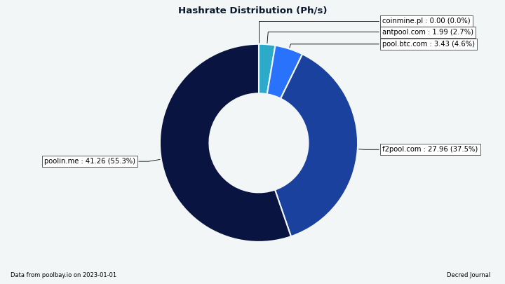
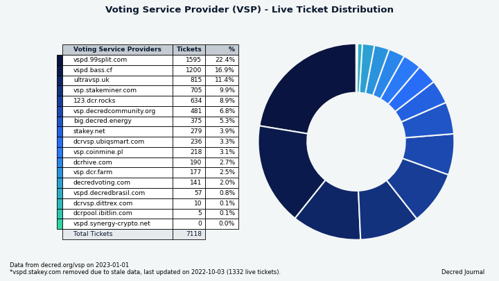

# Decred 月报 – 2022 年 12 月

_图片: @saender 的 Bison Relay 艺术作品_

12 月亮点:

- Bison Relay 发布，这个创新的增强隐私和抗垃圾邮件的信息传递网络使用 Decred 闪电网络为消息附加成本并阻止垃圾邮件，现已开放使用。
- 随着新用户打开通道并开始为消息付费，Bison Relay 推出以后闪电网络的节点数量和容量显著增加。
- DCRDEX v0.5.8 已发布，增加新的高级选项。

内容：

- [Bison Relay 发布](#bison-relay-launch)
- [DCRDEX v0.5.8 发布](#dcrdex-v058-release)
- [开发进展总结](#development)
- [人员](#people)
- [治理](#governance)
- [网络](#network)
- [生态系统](#ecosystem)
- [外展](#outreach)
- [活动](#events)
- [媒体](#media)
- [市场](#markets)
- [相关外部信息](#relevant-external)

## Bison Relay 发布

Bison Relay 是一个新的点对点社交媒体平台，具有抵抗审查、监控和广告的强大保护。消息通过点对点加密，以确保只有预期的收件人才能看到内容。没有账户，元数据被最小化，因此服务器操作员无法看到消息内容、发送者、接收者或用户参与的聊天。内置支付允许通过付费内容访问及内容货币化。

初始版本具有以下功能（不完整列表）:

- 直接聊天
- 发送文件
- 群聊
- 使用 Markdown 和图片制作更长的帖子
- 评论帖子
- 包含您订阅的用户的内容的提要
- 转发帖子（转发）
- 通过现有渠道发送的邀请文件或直接通过 Bison Relay 与其他用户联系（您现有的联系人将您与他们的联系人联系起来，也称为中介密钥交换）
- 通过 Decred 闪电网络发送和接收 DCR 提示
- 以用户为访问支付的可选价格共享文件
- 创建和支付发票
- 适用于 Linux、macOS 和 Windows 的 GUI 和命令行应用程序

发送和接收消息的费用可以作为抗垃圾邮件保护，但 Bison Relay 使用起来很便宜，0.1 DCR 可以持续几个月进行常规聊天。

大多数用户可[这里](https://github.com/companyzero/bisonrelay/releases)下载 GUI 应用程序，获取以`bisonrelay-xxx`您的操作系统命名的文件。下载尚无哈希值或签名，但将来会添加这些内容。

如何使用 Bison Relay:

- 官方[功能](https://bisonrelay.org/features/)和[教程](https://bisonrelay.org/tutorial/)
- [Decred 新闻更新中的 2 分钟概述](https://www.youtube.com/watch?v=K6Cu4Gi7Lp0)
- [在 macOS 上设置 Bison Relay v0.1.1](https://www.youtube.com/watch?v=L4jm-VMPmBo)
- [v0.1.1 的功能概述](https://www.youtube.com/watch?v=ukRkQC4IXoo)
- [News feed - 连接、创建和使用 markdown](https://www.youtube.com/watch?v=NuKVAp4fIBY)

设置完成后，阅读[使用指南](https://chat.decred.org/#/room/!GHnoHXSgkVAsUknRUg:decred.org/$tdpPg8WYSQGCizeGngYeoXSG_lCBrTnDxcuLGiZbfuI?via=decred.org&via=matrix.org&via=zettaport.com) 和 联系 Matrix 上的@kozel 以获得您的初始邀请。

高级用户还可以查看[命令行 brclient 应用程序](https://github.com/companyzero/bisonrelay/releases), [服务器源代码](https://github.com/companyzero/bisonrelay#server), 和 [技术文档](https://github.com/companyzero/bisonrelay/tree/master/doc)。

要了解 Bison Relay 背后的动机，请查看@jy-p 的帖子：

- [Decred 面临的外展问题](https://blog.decred.org/2022/12/02/What-is-wrong-with-Decred/) 与现有网点和社交媒体平台
- [现有网络的问题](https://blog.decred.org/2022/12/09/Trapped-in-the-Web/)
- 最初的 [Bison Relay 公告](https://blog.decred.org/2022/12/14/Bison-Relay-The-Sovereign-Internet/) 解释了系统的高级设计以及为什么需要它来促进 言论自由和结社自由
- 推文 [公告](https://twitter.com/behindtext/status/1603470873503141903)

> 推论是 Decred 应该尝试在没有传统营销的情况下发展其网络。 前进的道路不是穿越，而是绕过。 \[[Decred 有什么问题？](https://blog.decred.org/2022/12/02/What-is-wrong-with-Decred/)\]

## DCRDEX v0.5.8 发布

此版本修复了从外部来源请求法币汇率的问题，并为高级命令行和 Go API 用户添加了选项，允许跳过启动和关闭时耗时的操作。

v0.5.8 作为独立的 DEX 应用程序在 [这里](https://github.com/decred/dcrdex/releases) 提供。

## 开发进展总结

除非另有说明，否则下面报告的工作为“合并至核心存储库”状态。这意味着该工作已完成、审查并集成到高级用户可以[构建和运行](https://medium.com/@artikozel/the-decred-node-back-to-the-source-part-one-27d4576e7e1c)的源代码中，但普通用户尚不可用。

### dcrd

_[dcrd](https://github.com/decred/dcrd) 是一个完整的节点实现，为 Decred 在全球的点对点网络提供支持。_

- 当同行通过 [`getcfilterv2`](https://github.com/decred/dcrd/pull/3035) 请求时，始终提供已知过滤器。 以前，节点在其链与网络完全同步之前不会为过滤器提供服务。 这个限制继承自旧的布隆过滤器逻辑，它有助于避免性能下降，尤其是在初始链同步期间。 缺点是节点在各种生产和测试场景中可能会出现无响应或停滞。 布隆过滤器已被版本 2 过滤器取代，它现在的服务成本相对较低，因此即使在链完全同步之前，节点也始终可以响应“getcfilterv2”请求。
- 更新了 JSON-RPC API [文档](https://github.com/decred/dcrd/pull/3032)，用于发现符合特定条件的交易的方法：`loadtxfilter`、`notifynewtransactions` 和 `rescan`。 有关已删除的 API 方法和通知的信息已被 [删除](https://github.com/decred/dcrd/pull/3034)。
- 较小的更改和清理。

### dcrwallet

_[dcrwallet](https://github.com/decred/dcrwallet) 是命令行和图形界面钱包应用程序使用的钱包服务器。_

- 添加了 [`--cpuprofile`](https://github.com/decred/dcrwallet/pull/2195) 开关以捕获 CPU 性能数据并将其保存到文件中。
- 添加了获取新的 [SPV 模式下的国库支出](https://github.com/decred/dcrwallet/pull/2194)。 这将被 Decrediton 用于在更多场景中启用 TSpend 投票。
- 修改了 [购票](https://github.com/decred/dcrwallet/pull/1946) 逻辑以支持 Trezor 在即将对 Decrediton 进行的更改中质押。 此更改将一些现有代码连接在一起，未来的更改将集中在选票维护和重新支付失败的 VSP 费用上。 质押存储在 Trezor 钱包上的 DCR 是一项非常受欢迎的功能，因此这里有一些背景知识。 与 Trezor 签署交易、Decred 质押系统以及将选票委托给投票服务提供商 (VSP) 的更新系统相结合，带来了许多挑战。 一是VSP需要投票地址的私钥才能用票进行投票，而Trezor不允许直接导出私钥。 另一个是 Decrediton 需要为每个 VSP 管理的选票签署投票偏好，但要求 Trezor 签署每条消息是糟糕的用户体验。 为了解决这些问题，可以从 Trezor 获得的一段私人数据将用于派生用于投票和签署投票偏好的密钥。
- 更新了补充命令行工具的依赖项：movefunds、repaircfilters 和 sweepaccount。

### Decrediton

_[Decrediton](https://github.com/decred/decrediton) 是一款功能齐全的桌面钱包应用程序，集成了投票、StakeShuffle 混币、闪电网络、DEX 交易等。它可在有或没有完整区块链（SPV 模式）的情况下运行。_

- 将 DCRDEX 模块更新到 v0.5.7，修复了围绕 [订单取消](https://github.com/decred/decrediton/pull/3840) 的几个边缘情况。
- 引入了对 [个人 TSpends](https://github.com/decred/decrediton/pull/3787)的投票。 如果任何选票由 VSP 管理，更改后的选票投票偏好将发送给 VSP。 如果检测到新的未投票的 TSpend，将在主页上显示通知。 国库密钥和个人 TSpends 的现有投票政策将显示在选票详细信息页面上。
- 扩大了自动化 UI 测试范围。

_图片：国库支付发票在 Decrediton 中投票。_

### Politeia

_[Politeia](https://github.com/decred/politeia) 是 Decred 的提案系统。它用于向 Decred 国库请求资金。_

- 针对 [Node 18 和 19](https://github.com/decred/pi-ui/pull/468) 构建和测试 pi-ui。
- 测试修复。

### vspd

_[vspd](https://github.com/decred/vspd) 是用于运行投票服务提供商的服务器软件。VSP 代表其用户全天候 24/7 投票，不能托管资金。_

- 删除了扩展性不佳的[重复费用地址检查](https://github.com/decred/vspd/pull/361)（将近 500 毫秒插入 100K 选票数据库）。 在开发、测试或生产中从未观察到重复的费用地址。

### DCRDEX

_[DCRDEX](https://github.com/decred/dcrdex) 是一种非托管的、尊重隐私的交易所，用于去信任交易，由原子交换提供支持。_

[v0.5.8 发布](https://github.com/decred/dcrdex/releases/tag/v0.5.8):

- 添加了[核心 API 选项](https://github.com/decred/dcrdex/pull/1568) 以跳过启动和关闭时耗时的操作。 `NoAutoWalletLock` 在关闭时禁用钱包锁定，这对于避免潜在的[非常长](https://github.com/decred/dcrdex/pull/1568#discussion_r998877146) 解锁操作很有用。 `NoAutoDBBackup` 在关闭时禁用自动数据库备份。 `UnlockCoinsOnLogin` 指示钱包解锁登录或创建钱包时单独锁定的任何硬币（输出），这会自动从多个[问题](https://github.com/decred/dcrdex/pull/1568#discussion_r998880897)中手动恢复 由下订单期间连接中断和崩溃引起。 这些选项也可以使用 `dexc` 命令行应用程序的新开关进行设置，但它们实际上是供编写自己的 Go 代码以通过 `Core` API 控制 DEX 客户端的人们使用的。
- 修复了对外部服务失败的 [法币汇率请求](https://github.com/decred/dcrdex/commit/2ae50bb7617706c62b86e4b16b684744c995c818) 的处理，并调整了它们的频率以避免达到汇率限制。

以下更改合并到 `master` 中以用于将来的版本。

以太坊:

- 添加了对 [测试网 USDC](https://github.com/decred/dcrdex/pull/1733)交换的客户端和服务器支持 。
- 添加了 DEX 客户端和服务器通过 [经过身份验证的 WebSocket](https://github.com/decred/dcrdex/pull/1963) 连接到 Geth 全节点的能力。 这允许用户在单独的机器上运行 Geth。

忠诚债券（用户）：

- [忠诚债券](https://github.com/decred/dcrdex/pull/1820) 实施已合并，建立在 10 月和 11 月添加的较低级别 API 和服务器代码的基础上。 该批次添加了用于创建、存储、发布、确认和退还保证金的内部客户端代码，以及用于从命令行发布保证金的“dexc”应用程序命令。 债券的实施分为几个阶段，以使审查可行并与其他多项发展同步进行。 接下来是帐户等级维护、债券更新、设置和 UI 组件。- Documented bonds in the [spec](https://github.com/decred/dcrdex/pull/1994).
- 回顾一下，限时 [忠诚债券](https://en.wikipedia.org/wiki/Fidelity_bond) 将取代当前的注册费系统。 用户会将代币锁定在债券中并获得交易许可，只要他们的债券级别足够高（可能补偿取消订单过多等不良交易行为）。 当不再需要交易权限时，可以赎回债券以取回代币。 债券系统是构建 [服务器网格](https://github.com/decred/dcrdex/issues/1765) 的先决条件。

其它客户端更改：

- 重构 [登录顺序](https://github.com/decred/dcrdex/pull/1903) 以更好地处理多次登录尝试并避免重复初始化步骤。 添加警告提示尽快解锁钱包以处理活跃交易。
- 重构了类比特币资产常见的[费用估算](https://github.com/decred/dcrdex/pull/1967)，并为 DOGE 添加了外部费用估算器。 外部费用估算可用作 SPV（轻型）钱包和最近在费用估算尚未校准时启动的 RPC（完整）钱包的后备。
- 为通过 RPC 创建的钱包添加了 [默认值](https://github.com/decred/dcrdex/pull/1981)。 这是为了协助在 simnet 上进行测试。
- 移动了更多字符串 [翻译文件](https://github.com/decred/dcrdex/pull/1980)。
- 数据库 [压缩](https://github.com/decred/dcrdex/pull/1987) 调整为更积极地释放空间并更准确地报告节省情况。
- 在登录期间添加了更详细的[进度报告](https://github.com/decred/dcrdex/pull/1997)。
- 添加了 [阿拉伯语翻译](https://github.com/decred/dcrdex/pull/1898) 和显示从右到左文本所需的调整。
- 修复了钱包恢复期间的 SPV 钱包 [日志文件删除](https://github.com/decred/dcrdex/pull/1946)。
- 修复了发送表格中不包括交易费用的[法币价值](https://github.com/decred/dcrdex/pull/1983)。
- 修复了 [Pre-size Funds](https://github.com/decred/dcrdex/pull/1988) 选项的处理。 该选项创建一个额外的“拆分交易”来准备订单所需的确切资金数额，这避免了锁定多于所需的资金，但代价是支付拆分的额外费用。 该修复避免了在没有任何好处时进行预调整交易。 此外，通过始终显示该选项但解释其关闭原因，用户体验更加一致。 最后，另一个修复禁用了[即时市场订单](https://www.investopedia.com/terms/i/immediateorcancel.asp) 的预先调整，因为它们必须快速执行。
- 其它修复。

_图片：USDC 和 DCR 在测试网上的首次交易。_

### dcrdata

_[dcrdata](https://github.com/decred/dcrdata) 是 Decred 区块链和链下数据（如 Politeia 提案、市场等）浏览器。_

面向用户的变化：

- [国库投票](https://github.com/decred/dcrdata/pull/1918) 规则和进度变得更容易理解和遵循。 国库支出交易页面将显示当前投票与最低法定人数和同意百分比要求的比较情况、投票开始和结束的大致日历日期、哪个 Politeia 密钥签署了 TSpend，等等。 [此处](https://tip.dcrdata.org/tx/49f141f51421a499d319bc617a4430f87db3a73ffa605dee8408eefb081bd11b) 可以看到最近的 TSpend 示例。
- 修复了一个罕见的错误，即后来包含在批准区块中的[未批准交易](https://docs.decred.org/governance/overview/#block-voting) 的输出[错误地显示为未花费](https://github.com/decred/dcrdata/pull/1938)。 在整个链历史中，只有不到 20 笔交易受到影响。
- 其它修复和 UI 调整。

开发人员和 API 更改：

- 删除了[dcrwallet 导入](https://github.com/decred/dcrdata/pull/1887) 以简化对新 dcrd 模块的更新。
- 删除了在启用地址索引的情况下运行 dcrd 的要求，因为它已 [从 dcrd 中删除](https://github.com/decred/dcrd/pull/2930)。 删除了 dcrd 的“searchrawtransactions”方法（取决于地址索引）的使用，以支持 dcrdata 自己的数据库，该数据库具有所有必要的信息。
- 向 [交易数据 API](https://github.com/decred/dcrdata/pull/1946) 添加了两个字段：`tree`（Decred 块将交易存储在常规树和权益树中）和`type`（Decred 交易 可以是 `regular`、`ticket`、`vote`、`revocation`、`coinbase`、`treasurybase`、`treasury add`、`treasury spend`）。

_图片：dcrdata，现在可以更轻松地跟踪 国库支付发票 的投票进度。_

### Bison Relay

_[Bison Relay](https://github.com/companyzero/bisonrelay) 是一个新的点对点社交媒体平台，由 Decred 闪电网络 提供强大的抵抗审查、监视和广告功能。_

Bison Relay 在 Company 0 [开发](https://blog.decred.org/2022/12/14/Bison-Relay-The-Sovereign-Internet/)了2年后被公开。最终用户的详细信息可以 可以在上面的 [公告](#bison-relay-launch) 中找到，在这里我们将重点关注源代码中的技术和最近的变化。

Bison Relay 技术堆栈概述：

- [服务器](https://github.com/companyzero/bisonrelay#server) 是用 Go 编写的，使用 PostgreSQL 进行存储。
- [命令行客户端](https://github.com/companyzero/bisonrelay#cli-client) 是用 Go 编写的并实现了[基于文本的 UI](https://en.wikipedia.org/wiki/Text-based_user_interface)类似于 Irssi 或 WeeChat。
- [GUI 客户端](https://github.com/companyzero/bisonrelay/tree/master/bruig) 是用 Dart、Flutter 和实现 Bison Relay 协议的 Go 库编写的跨平台应用程序。 [Flutter](https://flutter.dev) 是一个很有前途的平台，可以从单个代码库为主要桌面（Linux、macOS、Windows）和移动（Android、iOS）系统构建跨平台 GUI 应用程序。
- 所有客户端到服务器的通信都使用 TLS 隧道作为外层，“NaCl secretbox”作为内层进行双重加密。
- 所有客户端到客户端的通信都使用 [double ratchet](https://signal.org/docs/specifications/doubleratchet/)（第三层加密）加密，密钥只有客户端拥有。
- 更多细节可以在[文档目录](https://github.com/companyzero/bisonrelay/tree/39015e62770ae6b18e73599a6fe497ceec463047/doc)和[协议概述](https://github.com/companyzero/bisonrelay/blob/39015e62770ae6b18e73599a6fe497ceec463047/rpc/README.md#protocol)。

GUI 应用程序，在 [v0.1.1](https://github.com/companyzero/bisonrelay/releases/tag/v0.1.1) 中发布的更改：

- 修复了通知、布局和数字格式方面的多个[问题](https://github.com/companyzero/bisonrelay/pull/13)。
- 修复了用户在未完成的种子设置后 [卡住](https://github.com/companyzero/bisonrelay/pull/21) 并添加了一个选择以 [删除](https://github.com/companyzero/bisonrelay/pull/42) 一个未完成的钱包。
- 修复了 [服务器指纹](https://github.com/companyzero/bisonrelay/pull/21) 中不可读的字体颜色。
- 修复了打开 LN 通道时达到 [差距限制](https://github.com/companyzero/bisonrelay/pull/39) 的问题。
- 其他修复。

GUI 应用程序，在 `master` 中对下一个版本的更改：

- 添加保存/恢复未发送的 [消息草稿](https://github.com/companyzero/bisonrelay/pull/43) 更改为/从另一个视图时。
- 添加了[种子恢复](https://github.com/companyzero/bisonrelay/pull/58) 页面。
- 为[复制种子](https://github.com/companyzero/bisonrelay/pull/58)添加了一个按钮到剪贴板。
- 添加了对保存和恢复 [静态通道备份](https://docs.decred.org/lightning-network/backups/) (SCB) 文件的支持。 锁定在 LN 通道中的资金无法单独从钱包种子中恢复。 无法从种子生成的恢复数据存储在 SCB 文件中。
- 将 [窗口标题](https://github.com/companyzero/bisonrelay/pull/64) 更改为“Bison Relay”。

GUI 应用程序，改进了注册：

- 在空的聊天页面上显示 [directions](https://github.com/companyzero/bisonrelay/pull/58) 以添加资金、创建频道并使用邀请与其他用户联系。

GUI 应用程序，修复：

- 修复了切换聊天时输入字段缺少 [autofocus](https://github.com/companyzero/bisonrelay/pull/43) 的问题。
- 修复了多个地方的[不可读文本](https://github.com/companyzero/bisonrelay/pull/64) 颜色。

CLI 应用程序:

- 将 [显示的标题](https://github.com/companyzero/bisonrelay/pull/57) 限制为 255 个字符。
- 右对齐 [评论时间戳](https://github.com/companyzero/bisonrelay/pull/60)。
- 添加了从种子恢复现有钱包时导入 [SCB 备份](https://github.com/companyzero/bisonrelay/pull/65) 的选项。
- 修复了[转发帖子](https://github.com/companyzero/bisonrelay/issues/52) 时的崩溃。

[bisonrelay.org](https://bisonrelay.org) 网站是使用 Hugo、Bootstrap 和 SCSS 构建的静态站点。 站点源代码也[完全开源](https://github.com/companyzero/bisonrelay-web)。

网站 12 月变更：

- [发布准备](https://github.com/companyzero/bisonrelay-web/commit/05d95d8a2bc04b63659aea930036f1e1c3db87e2)。
- 动画 [向下箭头](https://github.com/companyzero/bisonrelay-web/commit/0c0ff8e3ac90883ec68d7664b3b1e737ad38f9ac)。
- 添加了 [功能页面](https://github.com/companyzero/bisonrelay-web/commit/207cf5aba58dfb2aedb5ad5483a126254c9c4b60) 的副本。
- 添加了[教程](https://github.com/companyzero/bisonrelay-web/commit/aca241b3dfa6010b85fe7076fb27ccdef4c66622) [页面](https://github.com/companyzero/bisonrelay-web/commit/70a6eac099d4b440b52c2884f26a8638d840ab)。

BR 本身已 [宣布](https://www.youtube.com/watch?v=K6Cu4Gi7Lp0&t=47s) Bison Relay 的未来计划：

> 我们正在为 br 设计下一组功能，其中包括为内容和店面提供某种“页面”的能力。 此功能的当前迭代是客户端可以提供其他密钥交换客户端可以以某种方式查看和交互的“页面”。 \[@jy-p 在 2022-12-18 上\]

## 人员

欢迎新的首次贡献者：

- c12（[Decred 杂志](https://www.decredmagazine.com/author/c12/) 作者，[@c12hz](https://twitter.com/c12hz) 在 Twitter 上）

截至 1 月 4 日的社区统计数据（与 12 月 2 日相比）：

- [Twitter](https://twitter.com/decredproject) 粉丝: 53,392 (-342)
- [Reddit](https://www.reddit.com/r/decred/) 订阅: 12,648 (+14)
- [Matrix](https://chat.decred.org/) #general 用户: 738 (+9)
- [Discord](https://discord.gg/GJ2GXfz) 用户: 1,530 （-348 - 清除非活动用户），验证后发布：929 (-7)
- [Telegram](https://t.me/Decred) 用户: 2,872 (-22)
- [YouTube](https://www.youtube.com/decredchannel) 订阅: 4,640 (+0), 观看量: 221K (+2K)

根据[Twitter Shadowban Check](https://shadowban.jp/)，我们观察到我们主要的[@decredproject](https://twitter.com/decredproject)帐户激活了 4 个禁令中的 2 个：Ghost Ban 和 Reply Deboosting 。据报道，不久前所有 4 个都处于活动状态。这份报告和其它报告在某种程度上解释了 Twitter 迄今为止的表现。

## 治理

12 月，新[国库](https://dcrdata.decred.org/treasury) 收到 8,712 DCR，价值 172,000 美元，12 月的平均汇率为 19.79 美元。 3,907 DCR 用于支付承包商费用（但交易直到 1 月 3 日才获得批准/开采），按 12 月的汇率计算价值 77,000 美元，或按 11 月的 21.92 美元计费率计算价值 86,000 美元。
[国库支出交易](https://dcrdata.decred.org/tx/49f141f51421a499d319bc617a4430f87db3a73ffa605dee8408eefb081bd11b) 向 24 个承包商付款，范围从 5 DCR 到 1,270 DCR。
截至 1 月 7 日，[旧国库](https://dcrdata.decred.org/address/Dcur2mcGjmENx4DhNqDctW5wJCVyT3Qeqkx) 和 [新国库](https://dcrdata.decred.org/treasury) 的合并余额为 834,055 DCR（1560 万） 美元 18.70 美元）。

12 月 Politeia 上没有发布新提案。

## 网络

**全网算力**: 12 月的 [哈希率](https://dcrdata.decred.org/charts?chart=hashrate&scale=linear&bin=day&axis=time) 以 ~67 Ph/s开启，以 ~68 Ph/s结束，最低为 58 Ph/s，峰值 91 Ph/s。

_图片: Decred 全网算力。_

1 月 1 日各矿池的 75 Ph/s 算力分布[报告](https://miningpoolstats.stream/decred)：Poolin 55%，F2Pool 38%，BTC.com 5%，AntPool 2.7%。

截至 1 月 4 日实际 [开采](https://miningpoolstats.stream/decred) 1,000 个区块的分布：Poolin 55%，F2Pool 36%， BTC.com 5%， AntPool 2.6%，CoinMine 0.4%，未知 0.9% .

_图片：矿池算力分布。_

_图片：历史矿池哈希率分布。_

**Staking**: [选票价格](https://dcrdata.decred.org/charts?chart=ticket-price&axis=time&visibility=true-true&mode=stepped) 在 234-244 DCR 之间变化，30 天[平均](https:// dcrstats.com/) 为 234.8 DCR (+3.3)。

[锁定数量](https://dcrdata.decred.org/charts?chart=ticket-pool-value&scale=linear&bin=day&axis=time) 为 9.46-9.62 百万 DCR（历史新高），这意味着 64.0- 64.8% 的流通供应 [参与](https://dcrdata.decred.org/charts?chart=stake-participation&scale=linear&bin=day&axis=time) 权益证明。

**VSP**: [17 家列出的 VSP](https://decred.org/vsp/) 共同管理了约 7,120 (+190) 张现场选票，截至 1 月 1 日，占选票池的 17.2% (+0.4%)。这些数字不包括 vspd.stakey.com 由于 [过时的 API 数据](https://github.com/decred/dcrwebapi/pull/171)。

12 月涨幅最大的是 vspd.bass.cf (+371)、big.decred.energy (+179) 和 vspd.99split.com (+178)。

_图片：由 VSP 管理的选票分布。_

**节点**: [Decred Mapper](https://nodes.jholdstock.uk/user_agents) 在 1 月 1 日观察到 79 个 dcrd 节点：v1.7.5 - 27%，v1.7.1 - 27%，v1.8.0 dev builds - 23%，v1。 7.2 - 11%，v1.7.0 - 6%，v1.7.4 - 2.5%，其他 - 4%。

_图片：可访问的 dcrd 节点版本。_

_图片：历史dcrd版本分布，数据来自nodes.jholdstock.uk._

[混币](https://dcrdata.decred.org/charts?chart=coin-supply&zoom=jz3q237o-la8vk000&scale=linear&bin=day&axis=time&visibility=true-true-true) 的份额在 61.1-61.4% 之间变化，或 9.02-910 万 DCR（历史新高）。 每日 [混合数量](https://dcrdata.decred.org/charts?chart=privacy-participation&bin=day&axis=time) 在 291-479K DCR 之间变化。

Bison Relay 的推出对 Decred LN 产生了重大影响。 比较 12 月 1 日和 12 月 19 日观察到的 @karamble 节点的统计数据：节点 67 -> 120，通道 104 -> 212，容量 40.6 -> 91.1。

Decred 的 [闪电网络](https://ln-map.jholdstock.uk/) 浏览器已恢复运行，截至 1 月 4 日已报告 130 个节点、233 个通道，总容量为 100.7 DCR。这些统计数据因 逻辑节点。 例如，@karamble 的节点在 1 月 4 日报告了 144 个节点、312 个通道和 154 个 DCR 容量。

## 生态系统

VSP vspd.synergy-crypto.net 在对其剩余的实时选票进行投票后，已从 API [删除](https://github.com/decred/dcrwebapi/pull/172)。 它自 2021 年 6 月开始服务，共投了 892 张票。关闭执行得很干净：它在 2022 年 8 月停止接受新票，在接下来的 4 个月里，所有实时票都已投票。

Poloniex 已重新启用自 9 月 30 日交易所冻结的 DCR/BTC 市场 [推特](https://twitter.com/PoloSupport/status/1575745498933522432)，DCR 钱包仍在维护中（自 2022 年 1 月起）。该市场于 11 月 28 日首次重新启用，但很快又冻结了一周，直到 12 月 5 日完全恢复。

Binance 拒绝 DCR 提款大约 10 天。 12 月 12 日左右，关于提款被拒绝的第一份报告[浮出水面](https://chat.decred.org/#/room/!teQafvHMYpIbqLIieU:decred.org/$T5Mv2ATD2vgdbAlbIZ7BNGjRTNNWwPqIvzrfELK4vXc?via=decred.org&via=matrix.org&via=t2bot.io) . 有些在 12 月 14 日通过，但第二天更多的提款被暂停。 Binance 分享了有关中断原因的相互矛盾的信息。 支持 [Twitter](https://twitter.com/BinanceHelpDesk/status/1603293107633594369) 称其为“标准维护程序”。 在一张支持票中，他们称 DCR 网络“很忙”，但后来透露热钱包中的资金不足。 [钱包维护更新](https://www.binance.com/en/support/announcement/c-157?navId=157) 在撰写本文时未列出任何关于该问题的帖子。 该问题在 12 月 22 日左右得到解决。区块链按预期工作，网络其他地方没有出现中断或问题。

加入我们的 [#ecosystem](https://chat.decred.org/#/room/#ecosystem:decred.org) 聊天以关注 Decred 生态系统更新。

警告：Decred Journal 的作者不知道上述任何服务的可信度。 在将您的个人信息或资产委托给任何实体之前，请自行研究。

## 外展

Monde PR的成就：

- 发布了 1 条新闻更新
- 获得 1 次媒体采访
- 投放了 8 个评论操作

获得以下新闻文章：

- [CoinJournal](https://coinjournal.net/news/expert-panel-what-mistakes-should-users-avoid-when-attempting-to-buy-cryptocurrencies/) 中的一篇文章，其中包含@jy-p 的评论 购买加密货币时要避免的错误。
- [CoinJournal](https://coinjournal.net/news/expert-panel-what-is-your-biggest-tip-for-a-user-just-getting-into-crypto/) 中的一篇文章，其中包含来自 @jy-p 为那些刚刚进入加密领域的人提供提示。
- [CoinJournal](https://coinjournal.net/news/expert-panel-what-are-the-3-most-important-things-to-look-out-for-when-choosing-a-crypto-platform-to-sign-up-to/)中的一篇文章收录了@jy-p 关于如何选择加密平台的评论。
- [加密新闻](https://cryptonews.com/news/today-in-crypto-decred-launches-social-media-messaging-platform-opera-announces-a-suite-of-security-features-t-systems-mms-participates-in-chainlink-staking.htm) 关于 Bison Relay 的发布。
- [Invezz](https://invezz.com/news/2022/12/16/decred-launches-new-social-media-platform-bison-relay/) 中关于 Bison Relay 发布的文章。
- @jy-p 接受了 [Piece of the Py show](https://www.youtube.com/watch?v=OS_AOyMdAeU) 的采访，讨论了 Bison Relay 的启动、Decred 在 2022 年巴西大选中的使用以及 推出 DCRDEX v0.5。
- [BeInCrypto](https://beincrypto.com/focus-on-decentralization-and-empower-users-in-2023-says-industry/) 中的一篇文章，其中包含@jz 对 2023 年关注权力下放的评论，以及 提及 DCRDEX。

## 活动

**出席:**

- @arij 参加了由 JCI Casablanca 组织的名为女性创业的小组讨论（作为第 17 届企业家晚会活动的一部分）。 她谈到了她在 IT 行业、加密货币、Decred DAO 的运作方式以及为之工作的经历。 有关详细信息和链接，请参阅[报告](https://decredcommunity.github.io/events/index/20221220.1)。
- 

## 媒体

**精选文章:**

- [Decred 有什么问题？](https://blog.decred.org/2022/12/02/What-is-wrong-with-Decred/) by @jy-p
- [拥抱退化，第 1 部分 – Decred NFT](https://www.decredmagazine.com/embracing-degeneracy-part-1-decred-nfts/) @c12hz
- [陷入网络](https://blog.decred.org/2022/12/09/Trapped-in-the-Web/) @jy-p
- [Bison Relay：主权互联网](https://blog.decred.org/2022/12/14/Bison-Relay-The-Sovereign-Internet/) @jy-p
- [P2P 万维网](https://www.decredmagazine.com/the-p2p-world-wide-web-bison-relay/) @phoenixgreen
- [想象 Bison Relay 的未来](https://www.decredmagazine.com/imagining-the-future-of-bison-relay/) @c12hz
- [dcrd 做什么？](https://www.decredmagazine.com/what-does-dcrd-do/) @phoenixgreen 和@zippycorners
- [Decred 与比特币：从头到尾！](https://www.decredmagazine.com/decred-vs-bitcoin-from-start-to-the-end/) @Joao
- [突破社交媒体错觉的伪装](https://www.decredmagazine.com/breaking-through-the-facade-of-social-media-delusion/) by @BlockchainJew
- [Decred 2022 年底总结](https://www.decredmagazine.com/decred-2022-end-of-year-summary/) @phoenixgreen
- [2022 年的学习](https://www.decredmagazine.com/ftx-a-learning-from-2022/) @HassanMaishera

[Decred 杂志](https://www.decredmagazine.com/) 截至 12 月的参与度统计数据：

- DM 文章总数：371
- 时事通讯订户：83
- 发送的通讯总数：22
- 活跃的社交媒体活动：25
- 完成的社交媒体活动：27
- 社交媒体帖子：214
- 喜欢：1,040
- 转发：169
- 所有平台和账户的社交媒体粉丝：1,090

**视频:**

- [2022 熊年 - Decred 和市场状况](https://www.youtube.com/watch?v=PO2byx7D8z0) 壮举。 @phoenixgreen、@Exitus 和@Tivra
- [Decred 和原子交换革命 - DCRDEX 基础知识](https://www.youtube.com/watch?v=JyBoe1z5h9U) @phoenixgreen
- [在 macOS 上设置 BisonRelay 0.1.1](https://www.youtube.com/watch?v=L4jm-VMPmBo) @phoenixgreen
- [Bison Relay - 第一眼（版本 0.1.1）](https://www.youtube.com/watch?v=ukRkQC4IXoo) 作者：@phoenixgreen
- [我与 Decred 创始人/首席执行官 Jake 的聊天](https://www.youtube.com/watch?v=OS_AOyMdAeU)，作者 Py Patel 在 Piece of the Py Show 中
- [Decred 新闻 - Bison Relay P2P 聊天 + Lightning 上的社交媒体就在这里！ 重大开发更新！](https://www.youtube.com/watch?v=K6Cu4Gi7Lp0) by @Exitus
- [2022 the year of the bear - Decred and the State of the Market](https://www.youtube.com/watch?v=PO2byx7D8z0) feat. @phoenixgreen, @Exitus, and @Tivra (podcast [audio version](https://anchor.fm/decred-magazine/episodes/2022-the-year-of-the-bear---Decred-and-the-state-of-the-market-e1rnn2k))

**音频:**

新的 Twitter Spaces 录音：

- [Bison Relay：主权互联网](https://twitter.com/i/spaces/1ZkKzXlVvZqJv) @Tivra 和@kozel feat。 多个社区成员。 1700 人收听（直播 + 录制）。 也在 [Anchor](https://anchor.fm/decred-magazine/episodes/Bison-Relay-The-Sovereign-Internet-e1sebd4) 和其他播客平台上。
- [探索去中心化社交媒体的可能性](https://twitter.com/i/spaces/1ypKddnRQZvKW) - @Tivra 和@kozel feat。 社区成员，约 550 人收听。 Twitter-空间-e1smab7))

**艺术娱乐:**

- Bison Relay 发布 [闪电](https://twitter.com/karamblez/status/1604033417519177728) 图片来自@karamble
- [2023：Decred 加密奥德赛](https://www.decredmagazine.com/2023-decred-a-crypto-odyssey/) @OfficialCryptos

**翻译:**

- Decred Journal 9 月至 11 月共有 4 个新的 [翻译](https://xaur.github.io/decred-news/) 中文 (@Dominic) 和波兰语 (@kozel)。 谢谢你告诉大家！
- 
**非英语内容:**

- [Decred A Too Little Known Crypto 🧐 多久了？ 🔥 前比特币开发者 💎](https://www.youtube.com/watch?v=GeSpRLr3_94)（项目概览 + 法语助教）

## 市场

12 月，DCR 在 USDT 18.20-24.80 美元和 BTC 0.00110-0.00145 之间交易。 平均每日价格为 19.79 美元。

Poloniex 上新的 DCR/USDT 市场的日均交易量约为 1,070 DCR，远高于旧 DCR/BTC 交易对的 230 DCR/天。 有趣的是，当 DCR/USDT 活跃时，DCR/BTC 市场在第一周被冻结。

_图片：以美元为单位的 DCRDEX 月交易量。_

## 相关外部信息

11 月，欧盟取缔增强隐私的加密硬币的计划被泄露。这些计划是由目前主持会谈的捷克官员提出的。根据该提案，加密资产服务提供商和其他机构将被禁止持有或接触增强隐私的加密货币。

在巴西，国会通过了一项监管加密支付的法案，它将允许银行提供围绕加密资产的服务，并且还涵盖航空积分等内容。

亚伯拉罕·艾森伯格 (Avraham Eisenberg) 因“高利润交易策略”让 Mango Markets 损失 1.1 亿美元而获得公众赞誉的代言人已被捕，并被控犯有市场操纵罪。

SBF 被指控犯有多项罪行，并同意被引渡到美国，在那里他以 2.5 亿美元的保释金获准保释，条件是他要留在父母家里。一些持有部分债券的富有伙伴的名字一直保密，这很不寻常。该试验计划于 2023 年 10 月开始。

流行的加密新闻和研究提供商 The Block 被揭露由 SBF 通过 Alameda 秘密提供资金，看起来向 Block 首席执行官 McCaffrey 提供了三笔贷款，其中一笔用于在巴哈马购买公寓。似乎 Block 的编辑人员都不知道 SBF 和麦卡弗里之间的安排，麦卡弗里现在已经辞职了。

Grayscale Bitcoin Trust 一直令一些投资者感到困惑和恐慌，因为它的“NAV 折扣”（信托份额的价格与一股所代表的比特币数量的价值之比）增加到了惊人的 45％。在 2022 年夏季，Grayscale 将基金转换为 ETF 的申请被拒绝，因此它目前陷入了投资者无法要求获得其股票应得的 BTC 的境地，尽管这一决定正在上诉中。Grayscale 由数字货币集团所有，该集团还拥有陷入困境的加密贷款机构 Genesis，后者在 FTX 倒闭后不得不暂停运营，并在 1 月份裁员 30%。数字货币集团拥有多家公司在加密货币领域，有人猜测他们可能会出售其中哪些来拯救陷入困境的人。他们持有的资产包括 CoinDesk，它爆料了 FTX 的故事，引发了 DCG 目前的困境。DCG 持有的加密货币一直是一些争议的主题，因为 Grayscale拒绝参与提供“储备证明”是最初引起怀疑的因素之一——尽管 Coinbase 已加紧担保其资产被安全持有。

对于比特币矿工来说，这是艰难的一年，尤其是北美行业，该行业在 2021 年的廉价信贷的推动下迅速增长，并被中国禁止 PoW 挖矿留下的缺口所吸引。随着 BTC 价格在 2022 年下跌 63%，该行业的竞争变得更加激烈，导致挖矿盈利能力下降 70%。随着问题越来越明显，顶级矿机的价值下降了 85%，矿业公司的股票价值从 80-98% 之间下跌。12 月，美国最大的加密货币矿工之一 Core Scientific 已申请破产。

美联储正准备在 2023 年 5 月至 7 月推出“ FedNow ”，这是一种面向存款机构的数字美元版本，其客户将能够每天 24 小时 365 小时直接访问和使用它进行即时处理和结算一年中的几天。这与任何面向零售的 CBDC 不同，后者目前尚未在美国积极规划，但已经进行了一些实验。

英格兰银行积极寻求公司申请，为核心账本构建原型移动钱包应用程序、商户网站和后端服务器——并为获胜项目提供 200,000 英镑的预算。

ConsenSys 在 11 月更新其隐私政策后遭到强烈反对，用户反对通过 RPC 提供商 Infura 收集 IP 地址信息并将其与地址和账户余额相关联。ConsenSys 在 12 月的回应中澄清说，他们只收集“写入”事件（如进行交易）的数据，而不是在用户仅检查余额时收集数据，并且他们自 2018 年以来一直在这样做。他们承诺不再存储IP 数据与帐户访问数据一起使用，并使用户更容易通过界面更改 RPC 提供程序。

Sia 在 9 月启动了一项社区资助计划，并在 11 月提供了更新。有一个小小组审查提案，到目前为止，他们已经批准了两项提案——Lume Web 旨在“使用天网让 Sia 充当互联网”，获得 8 万美元，以及 Sia Satellite，这将允许人们支付用信用卡使用 Sia 存储，26,000 美元。12 月，另一份更新报告称，Fabstir 的提议已获得 4 万美元的批准，并计划与 Lume Web 在“web3 平台”的其他方面进行合作，例如为创作者经济提供销售和打赏的社交媒体。其他两个提案已被拒绝，但可以选择编辑并重新提交。

Osmosis DAO（Osmosis 是 Cosmos 上的主要 DeFi 平台）回顾2022 年。共有 278项提案，其中 26 项被否决，因此 90% 的提案获得通过。其中一个亮点似乎是“超流体质押”（也称为“反向流动性质押”），它允许流动性提供者绑定他们获得的代币，以便可以质押底层 OSMO 以有助于保护区块链。最初，投票权连同权益一起委托给权益质押者选择的验证者，但成功的治理提案随后允许 LP 权益质押者推翻他们选择的验证者的投票。渗透选民也批准了一项预算为 150 万美元的 OSMO 为期 6 个月的社区拨款提案，运行该计划的实体在最初的 10 万美元基础上每月收到 7 万美元——该计划于 11 月更新。

Balancer DAO 社区同意与后来被称为 Humpy 的 veBAL（Balancer 的治理令牌）鲸鱼达成和平条约。Humpy 是最大的 BAL 持有者和流动性提供者，并利用他们的投票权来主导 Balancer 的治理并提高他们个人使用的流动性池的收益率。Balancer 开发人员和社区动员起来减轻 Humpy 的自我交易，但 Humpy 仍然能够通过将 BAL 奖励指向他们创建的高费用池来获取可观的利润。veBAL 社区在象征性投票中几乎一致通过了和平条约，Humpy 同意在社区成员的协助下组织 OTC 交易，不再进一步增加他们的 BAL 头寸并平仓大部分头寸。

DFINITY 基金会宣布推出与互联网计算机 (IC) 的比特币集成，其中 IC 作为比特币的第 2 层，无需集中式桥接。

唐纳德特朗普推出了他自己的 NFT 系列，售出了 45,000 张“交易卡”图像，显示他身着各种服装，每张售价 99 美元。这些 NFT 都是在 24 小时内铸造出来的，这是一个很受欢迎的 NFT 集合，最初可以交易，二级市场的底价上涨到 200 美元以上。NFT 将赋予持有人访问某些与特朗普相关活动的权利，这些通行证在1月份被空投给持有人，但事实证明交易并不有利可图，使用代币化的门票可以以不到 25 美元的价格与唐纳德易手进行集体 Zoom 通话一块。

这就是 12 月的全部内容。欢迎在我们的#journal聊天室中分享您对下一期的更新。

## 关于月报

这是 Decred Journal 第 54 期。[此处](https://xaur.github.io/decred-news/)提供所有问题、镜像和翻译的索引。

来自第三方的大多数信息在经过最低限度的健全性检查后直接从源转发。Decred 月报的作者无法验证所有声明。请提防诈骗并进行自己的研究。

感谢 (字母排列):

- 写作、编辑、出版：bee、bochinchero、Exitus、jz、l1ndseymm、phoenixgreen、richardred
- 评论和反馈：davecgh、jholdstock、JoeGruff
- 标题图片：saender
- 资金：Decred 利益相关者

## 中文社区

* [微博](https://www.weibo.com/DecredProject)
* [微信公众号](https://mp.weixin.qq.com/mp/profile_ext?action=home&__biz=Mzg2NTExNzc3MA==&scene=124#wechat_redirect)
* [bilibili频道](https://space.bilibili.com/425519478)
