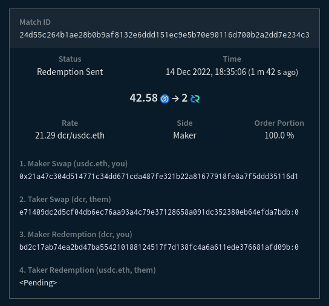

# Decred 月报 – 2022 年 12 月

_图片: @saender 的 Bison Relay 艺术作品_

12 月亮点:

- Bison Relay 发布，这个创新的增强隐私和抗垃圾邮件的信息传递网络使用 Decred 闪电网络为消息附加成本并阻止垃圾邮件，现已开放使用。
- 随着新用户打开通道并开始为消息付费，Bison Relay 推出以后闪电网络的节点数量和容量显著增加。
- DCRDEX v0.5.8 已发布，增加新的高级选项。

内容：

- [Bison Relay 发布](#bison-relay-launch)
- [DCRDEX v0.5.8 发布](#dcrdex-v058-release)
- [开发进展总结](#development)
- [人员](#people)
- [治理](#governance)
- [网络](#network)
- [生态系统](#ecosystem)
- [外展](#outreach)
- [活动](#events)
- [媒体](#media)
- [市场](#markets)
- [相关外部信息](#relevant-external)

## Bison Relay 发布

Bison Relay 是一个新的点对点社交媒体平台，具有抵抗审查、监控和广告的强大保护。消息通过点对点加密，以确保只有预期的收件人才能看到内容。没有账户，元数据被最小化，因此服务器操作员无法看到消息内容、发送者、接收者或用户参与的聊天。内置支付允许通过付费内容访问及内容货币化。

初始版本具有以下功能（不完整列表）:

- 直接聊天
- 发送文件
- 群聊
- 使用 Markdown 和图片制作更长的帖子
- 评论帖子
- 包含您订阅的用户的内容的提要
- 转发帖子（转发）
- 通过现有渠道发送的邀请文件或直接通过 Bison Relay 与其他用户联系（您现有的联系人将您与他们的联系人联系起来，也称为中介密钥交换）
- 通过 Decred 闪电网络发送和接收 DCR 提示
- 以用户为访问支付的可选价格共享文件
- 创建和支付发票
- 适用于 Linux、macOS 和 Windows 的 GUI 和命令行应用程序

发送和接收消息的费用可以作为抗垃圾邮件保护，但 Bison Relay 使用起来很便宜，0.1 DCR 可以持续几个月进行常规聊天。

大多数用户可[这里](https://github.com/companyzero/bisonrelay/releases)下载 GUI 应用程序，获取以`bisonrelay-xxx`您的操作系统命名的文件。下载尚无哈希值或签名，但将来会添加这些内容。

如何使用 Bison Relay:

- 官方[功能](https://bisonrelay.org/features/)和[教程](https://bisonrelay.org/tutorial/)
- [Decred 新闻更新中的 2 分钟概述](https://www.youtube.com/watch?v=K6Cu4Gi7Lp0)
- [在 macOS 上设置 Bison Relay v0.1.1](https://www.youtube.com/watch?v=L4jm-VMPmBo)
- [v0.1.1 的功能概述](https://www.youtube.com/watch?v=ukRkQC4IXoo)
- [News feed - 连接、创建和使用 markdown](https://www.youtube.com/watch?v=NuKVAp4fIBY)

设置完成后，阅读[使用指南](https://chat.decred.org/#/room/!GHnoHXSgkVAsUknRUg:decred.org/$tdpPg8WYSQGCizeGngYeoXSG_lCBrTnDxcuLGiZbfuI?via=decred.org&via=matrix.org&via=zettaport.com) 和 联系 Matrix 上的@kozel 以获得您的初始邀请。

高级用户还可以查看[命令行 brclient 应用程序](https://github.com/companyzero/bisonrelay/releases), [服务器源代码](https://github.com/companyzero/bisonrelay#server), 和 [技术文档](https://github.com/companyzero/bisonrelay/tree/master/doc)。

要了解 Bison Relay 背后的动机，请查看@jy-p 的帖子：

- [Decred 面临的外展问题](https://blog.decred.org/2022/12/02/What-is-wrong-with-Decred/) 与现有网点和社交媒体平台
- [现有网络的问题](https://blog.decred.org/2022/12/09/Trapped-in-the-Web/)
- 最初的 [Bison Relay 公告](https://blog.decred.org/2022/12/14/Bison-Relay-The-Sovereign-Internet/) 解释了系统的高级设计以及为什么需要它来促进 言论自由和结社自由
- 推文 [公告](https://twitter.com/behindtext/status/1603470873503141903)

> 推论是 Decred 应该尝试在没有传统营销的情况下发展其网络。 前进的道路不是穿越，而是绕过。 \[[Decred 有什么问题？](https://blog.decred.org/2022/12/02/What-is-wrong-with-Decred/)\]

## DCRDEX v0.5.8 发布

此版本修复了从外部来源请求法币汇率的问题，并为高级命令行和 Go API 用户添加了选项，允许跳过启动和关闭时耗时的操作。

v0.5.8 作为独立的 DEX 应用程序在 [这里](https://github.com/decred/dcrdex/releases) 提供。

## 开发进展总结

除非另有说明，否则下面报告的工作为“合并至核心存储库”状态。这意味着该工作已完成、审查并集成到高级用户可以[构建和运行](https://medium.com/@artikozel/the-decred-node-back-to-the-source-part-one-27d4576e7e1c)的源代码中，但普通用户尚不可用。

### dcrd

_[dcrd](https://github.com/decred/dcrd) 是一个完整的节点实现，为 Decred 在全球的点对点网络提供支持。_

- 当同行通过 [`getcfilterv2`](https://github.com/decred/dcrd/pull/3035) 请求时，始终提供已知过滤器。 以前，节点在其链与网络完全同步之前不会为过滤器提供服务。 这个限制继承自旧的布隆过滤器逻辑，它有助于避免性能下降，尤其是在初始链同步期间。 缺点是节点在各种生产和测试场景中可能会出现无响应或停滞。 布隆过滤器已被版本 2 过滤器取代，它现在的服务成本相对较低，因此即使在链完全同步之前，节点也始终可以响应“getcfilterv2”请求。
- 更新了 JSON-RPC API [文档](https://github.com/decred/dcrd/pull/3032)，用于发现符合特定条件的交易的方法：`loadtxfilter`、`notifynewtransactions` 和 `rescan`。 有关已删除的 API 方法和通知的信息已被 [删除](https://github.com/decred/dcrd/pull/3034)。
- 较小的更改和清理。

### dcrwallet

_[dcrwallet](https://github.com/decred/dcrwallet) 是命令行和图形界面钱包应用程序使用的钱包服务器。_

- 添加了 [`--cpuprofile`](https://github.com/decred/dcrwallet/pull/2195) 开关以捕获 CPU 性能数据并将其保存到文件中。
- 添加了获取新的 [SPV 模式下的国库支出](https://github.com/decred/dcrwallet/pull/2194)。 这将被 Decrediton 用于在更多场景中启用 TSpend 投票。
- 修改了 [购票](https://github.com/decred/dcrwallet/pull/1946) 逻辑以支持 Trezor 在即将对 Decrediton 进行的更改中质押。 此更改将一些现有代码连接在一起，未来的更改将集中在选票维护和重新支付失败的 VSP 费用上。 质押存储在 Trezor 钱包上的 DCR 是一项非常受欢迎的功能，因此这里有一些背景知识。 与 Trezor 签署交易、Decred 质押系统以及将选票委托给投票服务提供商 (VSP) 的更新系统相结合，带来了许多挑战。 一是VSP需要投票地址的私钥才能用票进行投票，而Trezor不允许直接导出私钥。 另一个是 Decrediton 需要为每个 VSP 管理的选票签署投票偏好，但要求 Trezor 签署每条消息是糟糕的用户体验。 为了解决这些问题，可以从 Trezor 获得的一段私人数据将用于派生用于投票和签署投票偏好的密钥。
- 更新了补充命令行工具的依赖项：movefunds、repaircfilters 和 sweepaccount。

### Decrediton

_[Decrediton](https://github.com/decred/decrediton) 是一款功能齐全的桌面钱包应用程序，集成了投票、StakeShuffle 混币、闪电网络、DEX 交易等。它可在有或没有完整区块链（SPV 模式）的情况下运行。_

- 将 DCRDEX 模块更新到 v0.5.7，修复了围绕 [订单取消](https://github.com/decred/decrediton/pull/3840) 的几个边缘情况。
- 引入了对 [个人 TSpends](https://github.com/decred/decrediton/pull/3787)的投票。 如果任何选票由 VSP 管理，更改后的选票投票偏好将发送给 VSP。 如果检测到新的未投票的 TSpend，将在主页上显示通知。 国库密钥和个人 TSpends 的现有投票政策将显示在选票详细信息页面上。
- 扩大了自动化 UI 测试范围。

_图片：国库支付发票在 Decrediton 中投票。_

### Politeia

_[Politeia](https://github.com/decred/politeia) 是 Decred 的提案系统。它用于向 Decred 国库请求资金。_

- 针对 [Node 18 和 19](https://github.com/decred/pi-ui/pull/468) 构建和测试 pi-ui。
- 测试修复。

### vspd

_[vspd](https://github.com/decred/vspd) 是用于运行投票服务提供商的服务器软件。VSP 代表其用户全天候 24/7 投票，不能托管资金。_

- 删除了扩展性不佳的[重复费用地址检查](https://github.com/decred/vspd/pull/361)（将近 500 毫秒插入 100K 选票数据库）。 在开发、测试或生产中从未观察到重复的费用地址。

### DCRDEX

_[DCRDEX](https://github.com/decred/dcrdex) 是一种非托管的、尊重隐私的交易所，用于去信任交易，由原子交换提供支持。_

[v0.5.8 发布](https://github.com/decred/dcrdex/releases/tag/v0.5.8):

- 添加了[核心 API 选项](https://github.com/decred/dcrdex/pull/1568) 以跳过启动和关闭时耗时的操作。 `NoAutoWalletLock` 在关闭时禁用钱包锁定，这对于避免潜在的[非常长](https://github.com/decred/dcrdex/pull/1568#discussion_r998877146) 解锁操作很有用。 `NoAutoDBBackup` 在关闭时禁用自动数据库备份。 `UnlockCoinsOnLogin` 指示钱包解锁登录或创建钱包时单独锁定的任何硬币（输出），这会自动从多个[问题](https://github.com/decred/dcrdex/pull/1568#discussion_r998880897)中手动恢复 由下订单期间连接中断和崩溃引起。 这些选项也可以使用 `dexc` 命令行应用程序的新开关进行设置，但它们实际上是供编写自己的 Go 代码以通过 `Core` API 控制 DEX 客户端的人们使用的。
- 修复了对外部服务失败的 [法币汇率请求](https://github.com/decred/dcrdex/commit/2ae50bb7617706c62b86e4b16b684744c995c818) 的处理，并调整了它们的频率以避免达到汇率限制。

以下更改合并到 `master` 中以用于将来的版本。

以太坊:

- 添加了对 [测试网 USDC](https://github.com/decred/dcrdex/pull/1733)交换的客户端和服务器支持 。
- 添加了 DEX 客户端和服务器通过 [经过身份验证的 WebSocket](https://github.com/decred/dcrdex/pull/1963) 连接到 Geth 全节点的能力。 这允许用户在单独的机器上运行 Geth。

忠诚债券（用户）：

- [忠诚债券](https://github.com/decred/dcrdex/pull/1820) 实施已合并，建立在 10 月和 11 月添加的较低级别 API 和服务器代码的基础上。 该批次添加了用于创建、存储、发布、确认和退还保证金的内部客户端代码，以及用于从命令行发布保证金的“dexc”应用程序命令。 债券的实施分为几个阶段，以使审查可行并与其他多项发展同步进行。 接下来是帐户等级维护、债券更新、设置和 UI 组件。- Documented bonds in the [spec](https://github.com/decred/dcrdex/pull/1994).
- 回顾一下，限时 [忠诚债券](https://en.wikipedia.org/wiki/Fidelity_bond) 将取代当前的注册费系统。 用户会将代币锁定在债券中并获得交易许可，只要他们的债券级别足够高（可能补偿取消订单过多等不良交易行为）。 当不再需要交易权限时，可以赎回债券以取回代币。 债券系统是构建 [服务器网格](https://github.com/decred/dcrdex/issues/1765) 的先决条件。

其它客户端更改：

- 重构 [登录顺序](https://github.com/decred/dcrdex/pull/1903) 以更好地处理多次登录尝试并避免重复初始化步骤。 添加警告提示尽快解锁钱包以处理活跃交易。
- 重构了类比特币资产常见的[费用估算](https://github.com/decred/dcrdex/pull/1967)，并为 DOGE 添加了外部费用估算器。 外部费用估算可用作 SPV（轻型）钱包和最近在费用估算尚未校准时启动的 RPC（完整）钱包的后备。
- 为通过 RPC 创建的钱包添加了 [默认值](https://github.com/decred/dcrdex/pull/1981)。 这是为了协助在 simnet 上进行测试。
- 移动了更多字符串 [翻译文件](https://github.com/decred/dcrdex/pull/1980)。
- 数据库 [压缩](https://github.com/decred/dcrdex/pull/1987) 调整为更积极地释放空间并更准确地报告节省情况。
- 在登录期间添加了更详细的[进度报告](https://github.com/decred/dcrdex/pull/1997)。
- 添加了 [阿拉伯语翻译](https://github.com/decred/dcrdex/pull/1898) 和显示从右到左文本所需的调整。
- 修复了钱包恢复期间的 SPV 钱包 [日志文件删除](https://github.com/decred/dcrdex/pull/1946)。
- 修复了发送表格中不包括交易费用的[法币价值](https://github.com/decred/dcrdex/pull/1983)。
- 修复了 [Pre-size Funds](https://github.com/decred/dcrdex/pull/1988) 选项的处理。 该选项创建一个额外的“拆分交易”来准备订单所需的确切资金数额，这避免了锁定多于所需的资金，但代价是支付拆分的额外费用。 该修复避免了在没有任何好处时进行预调整交易。 此外，通过始终显示该选项但解释其关闭原因，用户体验更加一致。 最后，另一个修复禁用了[即时市场订单](https://www.investopedia.com/terms/i/immediateorcancel.asp) 的预先调整，因为它们必须快速执行。
- 其它修复。

_图片：USDC 和 DCR 在测试网上的首次交易。_

### dcrdata

_[dcrdata](https://github.com/decred/dcrdata) 是 Decred 区块链和链下数据（如 Politeia 提案、市场等）浏览器。_

面向用户的变化：

- [国库投票](https://github.com/decred/dcrdata/pull/1918) 规则和进度变得更容易理解和遵循。 国库支出交易页面将显示当前投票与最低法定人数和同意百分比要求的比较情况、投票开始和结束的大致日历日期、哪个 Politeia 密钥签署了 TSpend，等等。 [此处](https://tip.dcrdata.org/tx/49f141f51421a499d319bc617a4430f87db3a73ffa605dee8408eefb081bd11b) 可以看到最近的 TSpend 示例。
- 修复了一个罕见的错误，即后来包含在批准区块中的[未批准交易](https://docs.decred.org/governance/overview/#block-voting) 的输出[错误地显示为未花费](https: //github.com/decred/dcrdata/pull/1938)。 在整个链历史中，只有不到 20 笔交易受到影响。
- 其它修复和 UI 调整。

开发人员和 API 更改：

- 删除了[dcrwallet 导入](https://github.com/decred/dcrdata/pull/1887) 以简化对新 dcrd 模块的更新。
- 删除了在启用地址索引的情况下运行 dcrd 的要求，因为它已 [从 dcrd 中删除](https://github.com/decred/dcrd/pull/2930)。 删除了 dcrd 的“searchrawtransactions”方法（取决于地址索引）的使用，以支持 dcrdata 自己的数据库，该数据库具有所有必要的信息。
- 向 [交易数据 API](https://github.com/decred/dcrdata/pull/1946) 添加了两个字段：`tree`（Decred 块将交易存储在常规树和权益树中）和`type`（Decred 交易 可以是 `regular`、`ticket`、`vote`、`revocation`、`coinbase`、`treasurybase`、`treasury add`、`treasury spend`）。

_图片：dcrdata，现在可以更轻松地跟踪 国库支付发票 的投票进度。_

### Bison Relay

_[Bison Relay](https://github.com/companyzero/bisonrelay) 是一个新的点对点社交媒体平台，由 Decred 闪电网络 提供强大的抵抗审查、监视和广告功能。_

Bison Relay 在 Company 0 [开发](https://blog.decred.org/2022/12/14/Bison-Relay-The-Sovereign-Internet/)了2年后被公开。最终用户的详细信息可以 可以在上面的 [公告](#bison-relay-launch) 中找到，在这里我们将重点关注源代码中的技术和最近的变化。

Bison Relay 技术堆栈概述：

- [服务器](https://github.com/companyzero/bisonrelay#server) 是用 Go 编写的，使用 PostgreSQL 进行存储。
- [命令行客户端](https://github.com/companyzero/bisonrelay#cli-client) 是用 Go 编写的并实现了[基于文本的 UI](https://en.wikipedia.org/wiki/Text -based_user_interface) 类似于 Irssi 或 WeeChat。
- [GUI 客户端](https://github.com/companyzero/bisonrelay/tree/master/bruig) 是用 Dart、Flutter 和实现 Bison Relay 协议的 Go 库编写的跨平台应用程序。 [Flutter](https://flutter.dev) 是一个很有前途的平台，可以从单个代码库为主要桌面（Linux、macOS、Windows）和移动（Android、iOS）系统构建跨平台 GUI 应用程序。
- 所有客户端到服务器的通信都使用 TLS 隧道作为外层，“NaCl secretbox”作为内层进行双重加密。
- 所有客户端到客户端的通信都使用 [double ratchet](https://signal.org/docs/specifications/doubleratchet/)（第三层加密）加密，密钥只有客户端拥有。
- 更多细节可以在[文档目录](https://github.com/companyzero/bisonrelay/tree/39015e62770ae6b18e73599a6fe497ceec463047/doc)和[协议概述](https://github.com/companyzero/bisonrelay/ blob/39015e62770ae6b18e73599a6fe497ceec463047/rpc/README.md#protocol）。

GUI 应用程序，在 [v0.1.1](https://github.com/companyzero/bisonrelay/releases/tag/v0.1.1) 中发布的更改：

- 修复了通知、布局和数字格式方面的多个[问题](https://github.com/companyzero/bisonrelay/pull/13)。
- 修复了用户在未完成的种子设置后 [stuck](https://github.com/companyzero/bisonrelay/pull/21) 并添加了一个选择以 [delete](https://github.com/companyzero/bisonrelay/ pull/42) 一个未完成的钱包。
- 修复了 [服务器指纹](https://github.com/companyzero/bisonrelay/pull/21) 中不可读的字体颜色。
- 修复了打开 LN 通道时达到 [差距限制](https://github.com/companyzero/bisonrelay/pull/39) 的问题。
- 其他修复。

GUI 应用程序，在 `master` 中对下一个版本的更改：

- 添加保存/恢复未发送的 [消息草稿](https://github.com/companyzero/bisonrelay/pull/43) 更改为/从另一个视图时。
- 添加了[种子恢复](https://github.com/companyzero/bisonrelay/pull/58) 页面。
- 为[复制种子](https://github.com/companyzero/bisonrelay/pull/58)添加了一个按钮到剪贴板。
- 添加了对保存和恢复 [静态通道备份](https://docs.decred.org/lightning-network/backups/) (SCB) 文件的支持。 锁定在 LN 通道中的资金无法单独从钱包种子中恢复。 无法从种子生成的恢复数据存储在 SCB 文件中。
- 将 [窗口标题](https://github.com/companyzero/bisonrelay/pull/64) 更改为“Bison Relay”。

GUI 应用程序，改进了注册：

- 在空的聊天页面上显示 [directions](https://github.com/companyzero/bisonrelay/pull/58) 以添加资金、创建频道并使用邀请与其他用户联系。

GUI 应用程序，修复：

- 修复了切换聊天时输入字段缺少 [autofocus](https://github.com/companyzero/bisonrelay/pull/43) 的问题。
- 修复了多个地方的[不可读文本](https://github.com/companyzero/bisonrelay/pull/64) 颜色。

CLI 应用程序:

- 将 [显示的标题](https://github.com/companyzero/bisonrelay/pull/57) 限制为 255 个字符。
- 右对齐 [评论时间戳](https://github.com/companyzero/bisonrelay/pull/60)。
- 添加了从种子恢复现有钱包时导入 [SCB 备份](https://github.com/companyzero/bisonrelay/pull/65) 的选项。
- 修复了[转发帖子](https://github.com/companyzero/bisonrelay/issues/52) 时的崩溃。

[bisonrelay.org](https://bisonrelay.org) 网站是使用 Hugo、Bootstrap 和 SCSS 构建的静态站点。 站点源代码也[完全开源](https://github.com/companyzero/bisonrelay-web)。

网站 12 月变更：

- [发布准备](https://github.com/companyzero/bisonrelay-web/commit/05d95d8a2bc04b63659aea930036f1e1c3db87e2)。
- 动画 [向下箭头](https://github.com/companyzero/bisonrelay-web/commit/0c0ff8e3ac90883ec68d7664b3b1e737ad38f9ac)。
- 添加了 [功能页面] 的副本 (https://github.com/companyzero/bisonrelay-web/commit/207cf5aba58dfb2aedb5ad5483a126254c9c4b60)。
- 添加了[教程](https://github.com/companyzero/bisonrelay-web/commit/aca241b3dfa6010b85fe7076fb27ccdef4c66622) [页面](https://github.com/companyzero/bisonrelay-web/commit/70a6eac099d4b440b52c2884f26a8638d840ab)。

BR 本身已 [宣布](https://www.youtube.com/watch?v=K6Cu4Gi7Lp0&t=47s) Bison Relay 的未来计划：

> 我们正在为 br 设计下一组功能，其中包括为内容和店面提供某种“页面”的能力。 此功能的当前迭代是客户端可以提供其他密钥交换客户端可以以某种方式查看和交互的“页面”。 \[@jy-p 在 2022-12-18 上\]

## 人员

Welcome the new first-time contributors:

- c12 ([Decred Magazine](https://www.decredmagazine.com/author/c12/) author, [@c12hz](https://twitter.com/c12hz) on Twitter)

Community stats as of Jan 4 (compared to Dec 2):

- [Twitter](https://twitter.com/decredproject) followers: 53,392 (-342)
- [Reddit](https://www.reddit.com/r/decred/) subscribers: 12,648 (+14)
- [Matrix](https://chat.decred.org/) #general users: 738 (+9)
- [Discord](https://discord.gg/GJ2GXfz) users: 1,530 (-348 - purged inactive users), verified to post: 929 (-7)
- [Telegram](https://t.me/Decred) users: 2,872 (-22)
- [YouTube](https://www.youtube.com/decredchannel) subscribers: 4,640 (+0), views: 221K (+2K)

Our main [@decredproject](https://twitter.com/decredproject) account has been [observed](https://chat.decred.org/#/room/!ggjLwhBHTjsMROezFf:decred.org/$ym0IL1s6fWqw9iu21vnMzVm1jmR0kdPm_4V3fKkV5Zs?via=decred.org&via=matrix.org&via=planetdecred.org) having 2 out of 4 bans activated: Ghost Ban and Reply Deboosting, according to [Twitter Shadowban Check](https://shadowban.jp/). Reportedly, not too long ago all 4 were active. This and other [reports](https://twitter.com/behindtext/status/1610663633498869760) somewhat explain Twitter performance seen so far.

## Governance

In December the new [treasury](https://dcrdata.decred.org/treasury) received 8,712 DCR worth $172K at December's average rate of $19.79. 3,907 DCR was spent to pay contractors (but the transaction was not approved/mined until January 3), worth $77K at December's rate, or $86K at November's billing rate of $21.92.

The [treasury spend tx](https://dcrdata.decred.org/tx/49f141f51421a499d319bc617a4430f87db3a73ffa605dee8408eefb081bd11b) had 24 outputs making payments to contractors, ranging from 5 DCR to 1,270 DCR.

As of Jan 7, combined balance of [legacy](https://dcrdata.decred.org/address/Dcur2mcGjmENx4DhNqDctW5wJCVyT3Qeqkx) and [new treasury](https://dcrdata.decred.org/treasury) is 834,055 DCR (15.6 million USD at $18.70).

There were no new proposals published on Politeia in December.

## Network

**Hashrate**: December's [hashrate](https://dcrdata.decred.org/charts?chart=hashrate&scale=linear&bin=day&axis=time) opened at ~67 Ph/s and closed ~68 Ph/s, bottoming at 58 Ph/s and peaking at 91 Ph/s throughout the month.

_Image: Decred hashrate._

Distribution of 75 Ph/s hashrate [reported](https://miningpoolstats.stream/decred) by the pools on Jan 1: Poolin 55%, F2Pool 38%, BTC.com 5%, AntPool 2.7%.

Distribution of 1,000 blocks actually [mined](https://miningpoolstats.stream/decred) by Jan 4: Poolin 55%, F2Pool 36%, likely BTC.com 5%, likely AntPool 2.6%, CoinMine 0.4%, unknown 0.9%.

_Image: Pool hashrate distribution._

_Image: Historical pool hashrate distribution._

**Staking**: [Ticket price](https://dcrdata.decred.org/charts?chart=ticket-price&axis=time&visibility=true-true&mode=stepped) varied between 234-244 DCR, with 30-day [average](https://dcrstats.com/) at 234.8 DCR (+3.3).

The [locked amount](https://dcrdata.decred.org/charts?chart=ticket-pool-value&scale=linear&bin=day&axis=time) was 9.46-9.62 million DCR (new all-time high), meaning that 64.0-64.8% of the circulating supply [participated](https://dcrdata.decred.org/charts?chart=stake-participation&scale=linear&bin=day&axis=time) in Proof of Stake.

**VSP**: The [17 listed VSPs](https://decred.org/vsp/) collectively managed ~7,120 (+190) live tickets, which was 17.2% of the ticket pool (+0.4%) as of Jan 1. These figures exclude vspd.stakey.com due to [stale API data](https://github.com/decred/dcrwebapi/pull/171).

Biggest gainers in December are vspd.bass.cf (+371), big.decred.energy (+179) and vspd.99split.com (+178).

_Image: Distribution of tickets managed by VSPs._

**Nodes**: [Decred Mapper](https://nodes.jholdstock.uk/user_agents) observed 79 dcrd nodes on Jan 1: v1.7.5 - 27%, v1.7.1 - 27%, v1.8.0 dev builds - 23%, v1.7.2 - 11%, v1.7.0 - 6%, v1.7.4 - 2.5%, other - 4%.

_Image: Reachable dcrd node versions._

_Image: Historical dcrd version distribution, data from nodes.jholdstock.uk._

The share of [mixed coins](https://dcrdata.decred.org/charts?chart=coin-supply&zoom=jz3q237o-la8vk000&scale=linear&bin=day&axis=time&visibility=true-true-true) varied between 61.1-61.4%, or 9.02-9.10 million DCR (new all-time high). Daily [mixed amount](https://dcrdata.decred.org/charts?chart=privacy-participation&bin=day&axis=time) varied between 291-479K DCR.

The launch of Bison Relay had a major impact on Decred LN. Comparing stats from @karamble's node observed on Dec 1 and Dec 19: nodes 67 -> 120, channels 104 -> 212, capacity 40.6 -> 91.1.

Decred's [Lightning Network](https://ln-map.jholdstock.uk/) explorer is back up and has reported 130 nodes, 233 channels with a total capacity of 100.7 DCR, as of Jan 4. These stats vary depending on the LN node. For example, @karamble's node reported 144 nodes, 312 channels and 154 DCR capacity on Jan 4.

## Ecosystem

The VSP vspd.synergy-crypto.net has been [removed](https://github.com/decred/dcrwebapi/pull/172) from the API after voting its remaining live tickets. It had been serving since June 2021 and voted a total of 892 tickets. The shutdown was executed cleanly: it stopped accepting new tickets in August 2022 and over the next 4 months all live tickets have voted.

Poloniex has re-enabled the DCR/BTC market which was frozen since Sep 30 when the exchange [tweeted](https://twitter.com/PoloSupport/status/1575745498933522432) that the DCR wallet is still on maintenance (since January 2022). The market was first re-enabled on Nov 28 but was quickly frozen again for another week until being fully restored on Dec 5.

Binance was rejecting DCR withdrawals for about 10 days. First reports of rejected withdrawals [surfaced](https://chat.decred.org/#/room/!teQafvHMYpIbqLIieU:decred.org/$T5Mv2ATD2vgdbAlbIZ7BNGjRTNNWwPqIvzrfELK4vXc?via=decred.org&via=matrix.org&via=t2bot.io) around Dec 12. Some went through on Dec 14 but next day more withdrawals got suspended. Binance shared conflicting information about the cause of the outage. Support [Twitter](https://twitter.com/BinanceHelpDesk/status/1603293107633594369) called it "standard maintenance procedure". In one support ticket they cited DCR network being "busy", but later revealed having insufficient funds in the hot wallet. [Wallet Maintenance Updates](https://www.binance.com/en/support/announcement/c-157?navId=157) lists no posts about the issue as of writing. The issue was resolved around Dec 22. The blockchain was working as expected and no outages or issues were seen elsewhere in the network.

Join our [#ecosystem](https://chat.decred.org/#/room/#ecosystem:decred.org) chat to follow Decred ecosystem updates.

Warning: the authors of the Decred Journal have no idea about the trustworthiness of any of the services above. Please do your own research before trusting your personal information or assets to any entity.

## Outreach

Monde PR's achievements:

- Pitched 1 news update
- Secured 1 media interview
- Pitched 8 commentary ops

Secured the following news articles:

- An article in [CoinJournal](https://coinjournal.net/news/expert-panel-what-mistakes-should-users-avoid-when-attempting-to-buy-cryptocurrencies/) featuring commentary from @jy-p on mistakes to avoid when buying cryptocurrencies.
- An article in [CoinJournal](https://coinjournal.net/news/expert-panel-what-is-your-biggest-tip-for-a-user-just-getting-into-crypto/) featuring commentary from @jy-p on tips for those just getting into crypto.
- An article in [CoinJournal](https://coinjournal.net/news/expert-panel-what-are-the-3-most-important-things-to-look-out-for-when-choosing-a-crypto-platform-to-sign-up-to/) featuring commentary from @jy-p on how to choose a crypto platform.
- A piece in [Cryptonews](https://cryptonews.com/news/today-in-crypto-decred-launches-social-media-messaging-platform-opera-announces-a-suite-of-security-features-t-systems-mms-participates-in-chainlink-staking.htm) about the launch of Bison Relay.
- An article in [Invezz](https://invezz.com/news/2022/12/16/decred-launches-new-social-media-platform-bison-relay/) about the launch of Bison Relay.
- @jy-p was interviewed by the [Piece of the Py show](https://www.youtube.com/watch?v=OS_AOyMdAeU), discussing the launch of Bison Relay, Decred's use in the 2022 Brazil elections and the launch of DCRDEX v0.5.
- An article in [BeInCrypto](https://beincrypto.com/focus-on-decentralization-and-empower-users-in-2023-says-industry/) featuring commentary from @jz on focusing on decentralization in 2023, with a DCRDEX mention.

## Events

**Attended:**

- @arij attended a panel discussion called Women Entrepreneurship organized by JCI Casablanca (as part of the 17th edition of the Entrepreneur's Evening event). She talked about her experience with the IT industry, crypto, how Decred DAO operates and what it is like to work for it. See the [report](https://decredcommunity.github.io/events/index/20221220.1) for more details and links.

## Media

**Selected articles:**

- [What is wrong with Decred?](https://blog.decred.org/2022/12/02/What-is-wrong-with-Decred/) by @jy-p
- [Embracing degeneracy, part 1 – Decred NFTs](https://www.decredmagazine.com/embracing-degeneracy-part-1-decred-nfts/) by @c12hz
- [Trapped in the web](https://blog.decred.org/2022/12/09/Trapped-in-the-Web/) by @jy-p
- [Bison Relay: The sovereign Internet](https://blog.decred.org/2022/12/14/Bison-Relay-The-Sovereign-Internet/) by @jy-p
- [The P2P World Wide Web](https://www.decredmagazine.com/the-p2p-world-wide-web-bison-relay/) by @phoenixgreen
- [Imagining the future of Bison Relay](https://www.decredmagazine.com/imagining-the-future-of-bison-relay/) by @c12hz
- [What does dcrd do?](https://www.decredmagazine.com/what-does-dcrd-do/) by @phoenixgreen and @zippycorners
- [Decred vs Bitcoin: From start to the end!](https://www.decredmagazine.com/decred-vs-bitcoin-from-start-to-the-end/) by @Joao
- [Breaking through the facade of social media delusion](https://www.decredmagazine.com/breaking-through-the-facade-of-social-media-delusion/) by @BlockchainJew
- [Decred 2022 end of year summary](https://www.decredmagazine.com/decred-2022-end-of-year-summary/) by @phoenixgreen
- [A learning from 2022](https://www.decredmagazine.com/ftx-a-learning-from-2022/) by @HassanMaishera

[Decred Magazine](https://www.decredmagazine.com/) engagement stats as of December:

- Total number of articles on DM: 371
- Newsletter subscribers: 83
- Total newsletters sent: 22
- Active social media campaigns: 25
- Completed social media campaigns: 27
- Social media posts: 214
- Likes: 1,040
- Re-tweets: 169
- Social media followers across all platforms and accounts: 1,090

**Videos:**

- [2022 the year of the bear - Decred and the State of the Market](https://www.youtube.com/watch?v=PO2byx7D8z0) feat. @phoenixgreen, @Exitus, and @Tivra (podcast [audio version](https://anchor.fm/decred-magazine/episodes/2022-the-year-of-the-bear---Decred-and-the-state-of-the-market-e1rnn2k))
- [Decred and the atomic swap revolution - DCRDEX Fundamentals](https://www.youtube.com/watch?v=JyBoe1z5h9U) by @phoenixgreen - also available as an [audio podcast](https://anchor.fm/decred-magazine/episodes/Decred-and-the-Atomic-Swap-Revolution---DCRDEX-Fundamentals-e1s85ne) and as a [text post](https://www.decredmagazine.com/decred-and-the-atomic-swap-revolution/)
- [Setting up BisonRelay 0.1.1 on macOS](https://www.youtube.com/watch?v=L4jm-VMPmBo) by @phoenixgreen
- [Bison Relay - First look (version 0.1.1)](https://www.youtube.com/watch?v=ukRkQC4IXoo) By @phoenixgreen
- [My chat with Decred founder/CEO Jake](https://www.youtube.com/watch?v=OS_AOyMdAeU) by Py Patel in Piece of the Py Show
- [Decred News - Bison Relay P2P chat + social media on Lightning is here! Big dev updates!](https://www.youtube.com/watch?v=K6Cu4Gi7Lp0) by @Exitus

**Audio:**

New Twitter Spaces recordings:

- [Bison Relay: The sovereign Internet](https://twitter.com/i/spaces/1ZkKzXlVvZqJv) by @Tivra and @kozel feat. multiple community members. 1.7K people tuned in (live + recorded). Also on [Anchor](https://anchor.fm/decred-magazine/episodes/Bison-Relay-The-Sovereign-Internet-e1sebd4) and other podcast platforms.
- [Exploring possibilities of decentralized social media](https://twitter.com/i/spaces/1ypKddnRQZvKW) - by @Tivra and @kozel feat. community members, ~550 people tuned in. ([Anchor](https://anchor.fm/decred-magazine/episodes/Bison-Relay---Exploring-Possibilities-of-Decentralized-Social-Media---Decred-Twitter-Space-e1smab7))

**Art and fun:**

- Bison Relay launch [lightning](https://twitter.com/karamblez/status/1604033417519177728) image by @karamble
- [2023: Decred a crypto odyssey](https://www.decredmagazine.com/2023-decred-a-crypto-odyssey/) by @OfficialCryptos

**Translations:**

- Decred Journal September-November got a total of 4 new [translations](https://xaur.github.io/decred-news/) to Chinese (@Dominic) and Polish (@kozel). Thank you for spreading the word!

**Non-English content:**

- [Decred Une Crypto Trop Meconnue 🧐 Pour Combien dE Temps ? 🔥 Par des anciens DEV du Bitcoin 💎](https://www.youtube.com/watch?v=GeSpRLr3_94) (project overview + TA in French)

## Markets

In December DCR was trading between USDT $18.20-$24.80 and BTC 0.00110-0.00145. The average daily rate was $19.79.

The new DCR/USDT market on Poloniex has seen around 1,070 DCR daily average volume, much higher than 230 DCR/day on the old DCR/BTC pair. Interestingly, DCR/BTC market was frozen for the first week while DCR/USDT was active.

_Image: DCRDEX monthly volume in USD._

## Relevant External

In November, plans to outlaw privacy-enhancing crypto coins in the EU were [leaked](https://www.coindesk.com/policy/2022/11/15/privacy-enhancing-crypto-coins-could-be-banned-under-leaked-eu-plans/). The plans were put forward by the Czech officials who are currently chairing talks. Crypto-asset service providers and other institutions would be banned from holding or touching privacy-enhancing cryptocurrency under the proposal.

In Brazil, Congress has [passed](https://decrypt.co/116011/brazil-crypto-payments) a bill to regulate crypto payments, it will allow banks to offer services around crypto assets, and also covers things like airline points.

Avraham Eisenberg, the front man who took public credit for the "highly profitable trading strategy" which drained Mango Markets of $110 million, has been [arrested](https://decrypt.co/118045/mango-markets-attacker-avraham-eisenberg-arrested-charged-with-market-manipulation-offenses) and charged with market manipulation offences.

SBF was charged with a number of offences and agreed to be [extradited](https://cointelegraph.com/news/sbf-signs-extradition-papers-set-to-return-to-face-charges-in-the-us) to the US, where he was granted bail on a $250 million bond on the condition that he stay at his parents' house. The names of some wealthy associates who covered part of the bond have been kept [secret](https://decrypt.co/118298/sbf-keep-bail-bond-cosigners-secret-like-lawyers-for-ghislaine-maxwell), unusually. The trial is scheduled to start in October 2023.

Popular crypto news and research providers The Block were [revealed](https://twitter.com/fintechfrank/status/1601295493102911488) to be secretly bankrolled by SBF through Alameda, it looks like three loans were made to Block CEO McCaffrey, one of which was used [buy](https://www.axios.com/2022/12/09/bankman-fried-funded-crypto-news-site-block) an apartment in the Bahamas. It appears that none of the Block's editorial staff were aware of the arrangement between SBF and McCaffrey, who has now resigned.

The Grayscale Bitcoin Trust has been [puzzling](https://seekingalpha.com/article/4563283-grayscale-bitcoin-trust-rating-upgrade) and spooking some investors, as its "discount to NAV" (price of a share of the trust vs the value of the amount of Bitcoin one share represents) [increased](https://ycharts.com/companies/GBTC/discount_or_premium_to_nav) to a whopping 45%. In Summer 2022 Grayscale's application to convert the fund to an ETF was denied, so it is presently stuck in a position where investors cannot claim the BTC their shares entitle them to, although this decision is under appeal. Grayscale is owned by the Digital Currency Group, which also owns [troubled](https://www.forbes.com/sites/dereksaul/2023/01/05/crypto-broker-genesis-cuts-30-of-staff-reportedly-mulls-bankruptcy/) crypto lender Genesis, which had to suspend its operations in the wake of FTX's collapse, and in January cut 30% of its workforce. The Digital Currency Group owns many [companies](https://dcg.co/portfolio/) in the crypto space, and there has been some speculation about which of these they might sell to bail out the struggling ones. Their holdings include CoinDesk, which broke the story about FTX which triggered the present difficulties for DCG. The cryptocurrency holdings of DCG have been the subject of some controversy, as Grayscale's [refusal](https://cryptopotato.com/grayscale-says-no-to-proof-of-reserves/) to participate in providing "Proof of Reserves" was one of the factors which caused suspicion initially - although Coinbase has stepped up to [vouch](https://www.cryptopolitan.com/coinbase-clears-about-grayscale-reserves) for their assets being safely held.

It has been a [tough year](https://www.forbes.com/sites/colinharper/2022/12/23/bitcoin-mining-in-2022-the-year-boom-turned-to-bust/) for Bitcoin miners, and in particular the Northern American industry which grew rapidly fuelled by cheap credit in 2021 and lured in by the gap left when China banned PoW mining. As the price of BTC declined by 63% in 2022 the industry was becoming more competitive, leading to a 70% drop in mining profitability. As the problems became clear the value of top mining machines declined 85% and the value of shares for the mining companies fell from between 80-98%. In December Core Scientific, one of the largest US crypto miners, has [filed](https://bitcoinmagazine.com/legal/bitcoin-miner-core-scientific-bankruptcy) for bankruptcy.

The US Federal Reserve is gearing up to [unleash](https://www.federalreserve.gov/paymentsystems/fednow_about.htm) "FedNow" in May-July 2023, a version of the digital dollar for depository institutions which their clients will be able to access and use directly for instant processing and settlement 24/7 hours a day 365 days a year. This is distinct from any retail-facing CBDC, which is so far not being actively planned in the US but some experiments have taken place.

The Bank of England actively [seeking](https://www.cityam.com/bank-of-england-ramps-up-cbdc-ambitions-after-offering-200000-wallet-contract-to-bidders/) applications from companies to build a prototype mobile wallet app, merchant website and back-end server for the core ledger - and offering a budget of £200,000 for the winning entry.

ConsenSys faced a [backlash](https://www.coindesk.com/tech/2022/11/24/ethereum-software-firm-consensys-reveals-it-collects-user-data/) over an update to its privacy policy in November, with users objecting to the collection of IP address information through RPC provider Infura and linking this to addresses and account balances. A [response](https://uk.finance.yahoo.com/news/consensys-metamask-crypto-wallet-response-130000872.html) from ConsenSys in December clarified that they only collect data for "write" events (like making a transaction) and not when the user merely checks their balances, and that they have been doing this since 2018. They pledged to no longer store the IP data alongside the account access data, and to make it easier for users to change RPC provider through the interface.

Sia launched a community grants program in September, and provided an [update](https://blog.sia.tech/grants-program-update-november-2022-83dd4a7e266e) in November. There is a small panel which reviews proposals and so far they have approved two proposals - Lume Web aims to "use Skynet to enable Sia to act as the internet", is getting $80K, and Sia Satellite, which will allow people to pay to use Sia storage with a credit card, $26K. In December another [update](https://blog.sia.tech/grants-program-update-december-2022-f7be5f103d13) reported that Fabstir's proposal had been approved for $40K, and plans to collaborate with Lume Web on other aspects of the "web3 platform", like social media for the creator economy with sales and tipping. The other two proposals have been rejected, but with an option to edit and re-submit.

The Osmosis DAO (Osmosis is a major DeFi platform on Cosmos) looked back on [2022](https://osmosis.zone/blog/osmosis-2022-retrospective). There were 278 [proposals](https://www.mintscan.io/osmosis/proposals), of which 26 were rejected, so 90% of proposals passed. One of the highlights appears to have been "superfluid staking" (otherwise known as "reverse liquid staking)", which allows liquidity providers to bond the tokens they get such that the underlying OSMO can be staked to contribute to securing the blockchain. Initially voting rights were delegated along with stake to the staker's choice of validator, but a successful governance [proposal](https://www.mintscan.io/osmosis/proposals/252) subsequently allowed LP stakers to override the votes of their chosen validator. Osmosis voters also [approved](https://www.mintscan.io/osmosis/proposals/186) a community grants proposal with a budget of 1.5M OSMO for 6 months and the entity running the program receiving $70K/month on top of an initial $100K - the program was [renewed](https://www.mintscan.io/osmosis/proposals/362) in November.

The Balancer DAO community [agreed](https://decrypt.co/117590/how-balancer-dao-achieved-peace-with-a-clever-whale-named-humpy) to a [peace treaty](https://forum.balancer.fi/t/bip-128-peace-treaty/4128) with the veBAL (Balancer's governance token) whale who came to be known as Humpy. Humpy is the largest BAL holder and liquidity provider, and used their voting power to dominate Balancer's governance and increase the yield rates for the liquidity pools they were personally using. Balancer developers and the community mobilised to mitigate Humpy's self-dealing but Humpy was still able to extract significant profit by pointing BAL rewards to pools they created with high fee levels. The peace treaty was approved almost unanimously by the veBAL community in a token vote, Humpy agreed to not increase their BAL position any further and to unwind much of it, with assistance from community members to organise OTC trades.

DFINITY Foundation [announced](https://finance.yahoo.com/news/internet-computer-brings-smart-contract-130000045.html) the launch of a Bitcoin integration with the Internet Computer (IC), with IC serving as a layer 2 for Bitcoin without a centralised bridge.

Donald Trump [launched](https://www.bbc.co.uk/news/business-63995563) his own NFT collection, selling 45,000 "trading card" images showing him dressed in various costumes for $99 each. The NFTs were all minted within 24 hours and it was a popular NFT collection to trade initially, the floor price on the secondary increased to over $200. The NFTs would entitle holders to access certain Trump-related activities, and these passes are in [Jan](https://decrypt.co/119055/nft-zoom-call-donald-trump-selling-under-25) being airdropped to holders, but are not proving as lucrative to trade, with tokenized tickets to access group Zoom calls with the Donald changing hands for less than $25 a piece.

That's all for December. Share your updates for the next issue in our [#journal](https://chat.decred.org/#/room/#journal:decred.org) chat room.

## About

This is issue 54 of Decred Journal. Index of all issues, mirrors, and translations is available [here](https://xaur.github.io/decred-news/).

Most information from third parties is relayed directly from the source after a minimal sanity check. The authors of the Decred Journal cannot verify all claims. Please beware of scams and do your own research.

Credits (alphabetical order):

- writing, editing, publishing: bee, bochinchero, Exitus, jz, l1ndseymm, phoenixgreen, richardred
- reviews and feedback: davecgh, jholdstock, JoeGruff
- title image: saender
- funding: Decred stakeholders
