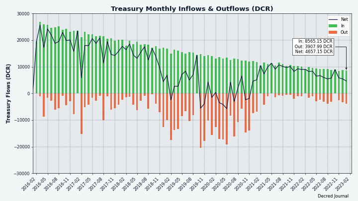
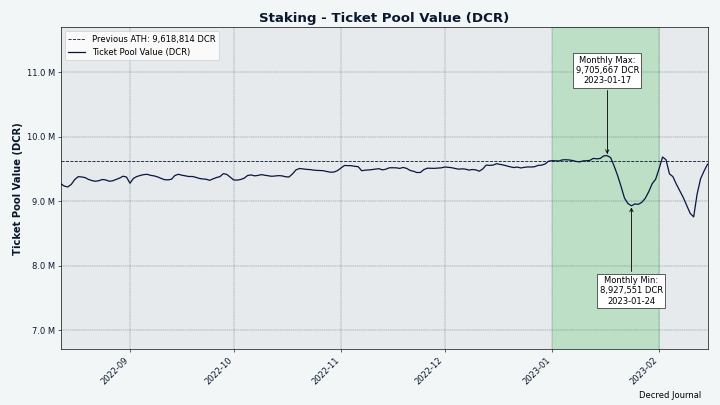
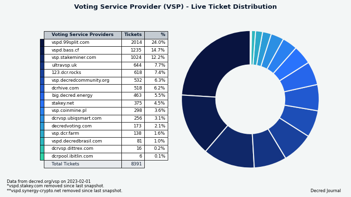
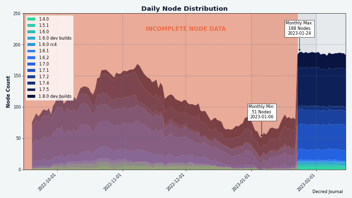
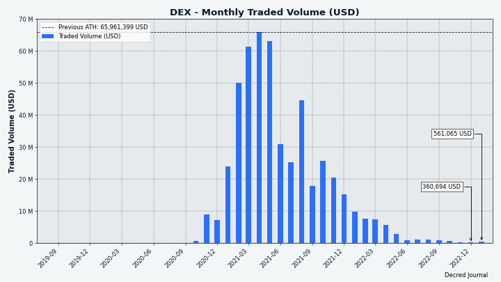

# Decred 月报 – 2023 年 1 月

_图片：@OfficialCryptos 的 Decred Owl_

一月亮点:

- 对 Timestamply 网站（decred时间戳服务）翻新已获得资金批准，并已经可以进行测试。

- 在 Politeia 上发布了 8 项提案，截至发布时间，所有提案的投票都已结束，5 项获得批准，3 项被拒绝。

- Bison Relay 收到了许多修复和操作体验更新，v0.1.3。

内容:

- [Bison Relay v0.1.3](#bison-relay-v013)
- [开发进展总结](#development)
- [人员](#people)
- [治理](#governance)
- [网络](#network)
- [生态系统](#ecosystem)
- [外展](#outreach)
- [活动](#events)
- [媒体](#media)
- [市场](#markets)
- [相关外部信息](#relevant-external)

## Bison Relay v0.1.3

新的 [v0.1.3 版本](https://github.com/companyzero/bisonrelay/releases/tag/v0.1.3) 带来了许多错误修复和早期社区测试中发现的操作体验改进。AppImage 构建现在可供 Linux 用户使用。

在新的[下载选择器](https://bisonrelay.org/download/)或直接从[GitHub](https://github.com/companyzero/bisonrelay/releases)获取最新版本。

前往[Bison Relay](#bison-relay)部分了解 v0.1.3 及更高版本的详细更改列表。

## 开发进展总结

除非另有说明，否则下面报告的工作为“合并至核心存储库”状态。这意味着该工作已完成、审查并集成到高级用户可以[构建和运行](https://medium.com/@artikozel/the-decred-node-back-to-the-source-part-one-27d4576e7e1c)的源代码中，但普通用户尚不可用。

### dcrd

_[dcrd](https://github.com/decred/dcrd) 是一个完整的节点实现，为 Decred 在全球的点对点网络提供支持。_

- 修改了从 mempool 中[修剪过期交易](https://github.com/decred/dcrd/pull/3042) 以接受当前最佳高度而不是在内部查找的方法。 这是通过消除隐藏假设使内存池状态更容易推理的更大努力的一部分。
- 将 [Docker 映像](https://github.com/decred/dcrd/pull/3043) 更新为更新版本的 Go 和 Alpine Linux。
- 将 Docker 容器配置为 [转发 SIGTERM 信号](https://github.com/decred/dcrd/pull/3044) 到正在运行的 dcrd 实例，以便在容器停止时正常关闭。
- 改进和扩展 [Docker 文档](https://github.com/decred/dcrd/pull/3045)。
- 优化地址管理器中对等节点的选择，以减轻通过使用 SPV DCR 钱包测试 DEX 发现的[高 CPU 使用率](https://github.com/decred/dcrd/pull/3047)。

### dcrwallet

_[dcrwallet](https://github.com/decred/dcrwallet) 是命令行和图形界面钱包应用程序使用的钱包服务器。_

- 添加了一个 [`watchlast` 选项](https://github.com/decred/dcrwallet/pull/2196) 来限制最初监视的地址，这反过来又提高了启动资源的使用和性能。 这将有利于拥有许多预计不会再次使用的旧地址的超大型钱包。

### Politeia

_[Politeia](https://github.com/decred/politeia) 是 Decred 的提案系统。它用于向 Decred 国库请求资金。_

以下所有更改都是针对新 [插件架构](https://github.com/decred/politeiagui/tree/master/plugins-structure#politeiagui---plugins-structure) 上的 GUI 重制。

重新实现的页面：

- [用户详细信息](https://github.com/decred/politeiagui/pull/2884) 页面。 所有视觉反馈、模态和消息都已重构，提取了常见的 UI 元素以供重用，修复了多个 UI 和响应问题，并进行了较小的设计改进。
- [用户会话页面](https://github.com/decred/politeiagui/pull/2887)，包括注册、登录、注销、密码重置和验证电子邮件。
- [管理页面](https://github.com/decred/politeiagui/pull/2891) 用于未经审查的提案和搜索用户。
- [提案页面](https://github.com/decred/politeiagui/pull/2892) 包括编辑和原始页面。
- 有一个[主要问题](https://github.com/decred/politeiagui/issues/2875) 跟踪哪些页面已被重新实现。

其它变化：

- 重构高级 Politeia 应用程序以使用新的 [工具包](https://github.com/decred/politeiagui/pull/2881) 将插件连接在一起。
- 为 Politeia 上的所有表单添加了[验证](https://github.com/decred/politeiagui/pull/2889)，包括错误消息和表单提交控制。
- GUI 和 pi-ui 库中的 ~5 个其他修复。

_图片：Politeia GUI 改造中的用户帐户页面。_

### cspp

_[cspp](https://github.com/decred/cspp) 是一个使用 CoinShuffle++ 协议协调硬币组合的服务器。 它是非托管的，即不持有任何资金。_

- [发送到客户端失败]时捕获IP地址和消息类型(https://github.com/decred/cspp/pull/79)。
- 修复了一个[协议错误](https://github.com/decred/cspp/pull/80) 如果客户端和服务器使用不同大小的整数类型，例如 32 位客户端连接，导致签名验证失败 到 64 位服务器。 此修复是对协议的重大更改（客户端需要升级才能使用此修复）。
- 更新到 [最新](https://github.com/decred/cspp/pull/81) dcrd 模块。

### DCRDEX

_[DCRDEX](https://github.com/decred/dcrdex) 是一种非托管的、尊重隐私的交易所，用于去信任交易，由原子交换提供支持。_

客户端更改：

- 更新了许多 [网络依赖项](https://github.com/decred/dcrdex/pull/1996)。
- 更新 Docker 配置：[优化基础镜像](https://github.com/decred/dcrdex/pull/2030)，将 DEX 客户端切换为[以非根用户身份运行](https://github.com/decred /dcrdex/pull/2035)，以及[排除不需要的文件](https://github.com/decred/dcrdex/pull/2077)。 除此之外，它有助于将 DEX 客户端 [集成到 Umbrel](https://proposals.decred.org/record/8d83046)。
- 允许[确认并隐藏](https://github.com/decred/dcrdex/pull/2044) 提醒保持 DEX 客户端运行直到所有交易结算的警告。
- 在所有表单中使用 [统一样式](https://github.com/decred/dcrdex/pull/2002) 改进了复选框用户体验。
- 如果在启动时未找到，则显示[钱包](https://github.com/decred/dcrdex/pull/2071) 丢失。
- 为所有输入字段、下拉菜单和复选框添加了一致的 [border](https://github.com/decred/dcrdex/pull/2070)。
- 在页面切换/刷新和 DEX 客户端重启时保存一些 [用户首选项](https://github.com/decred/dcrdex/pull/1975)。 诸如隐藏/显示左市场停靠点或在钱包页面上选择所选钱包之类的东西。

客户端修复：

- 修复了与所有 SPV 对等方失去连接后令人困惑的 [同步进度](https://github.com/decred/dcrdex/pull/2008) 跳跃。
- 改进了对用户（DEX 客户端之外）[手动广播](https://github.com/decred/dcrdex/pull/2011) 退款交易的检测和处理。
- 修复了 [32 位系统](https://github.com/decred/dcrdex/pull/2031) 上的启动失败。
- 修复了 [目录路径](https://github.com/decred/dcrdex/pull/2018)，它阻止了在 v0.5 中创建的内置 SPV 钱包在即将到来的 v0.6 中升级。
- 修复了 ~4 个并发错误。

服务器修复：

- 在收到兑换确认后避免[死锁](https://github.com/decred/dcrdex/pull/2021)。
- 添加了完整性检查以永不发送 [零费用交换](https://github.com/decred/dcrdex/pull/2060)。

以太坊:

- 删除了[最近添加](https://github.com/decred/dcrdex/pull/2047) `authrpc` 接口。 它被发现 [不必要地限制](https://github.com/decred/dcrdex/issues/2016#issuecomment-1369091909)，因为没有方法来检查内存池和计算最近的余额。 同时，在 DEX 中使用它并没有带来太多好处。 对于 DEX 用例，使用 [IPC](https://en.wikipedia.org/wiki/Inter-process_communication) 或 `--http` / `--ws` 标志连接到 Geth 更有意义。 将来，可能仍然需要经过身份验证的 RPC 支持才能从受信任的第三方 RPC 提供商处获取以太坊数据。 这可以大大简化测试，因为运行以太坊完整节点[太困难](https://github.com/decred/dcrdex/pull/2020#discussion_r1081309070)。
- 始终检查 [区块头时间戳](https://github.com/decred/dcrdex/pull/2034) 以确定同步状态。 由于以太坊的“Merge”事件，Geth 会将当前区块和最高区块报告为相同的数字，因此它们之间的差异不能再用于确定同步进度。 相反，DEX 会将最后一个区块头时间与用户的系统时钟进行比较，如果区块足够旧，则链将被假定为未同步。
- 在不知道确切交易的情况下改进了 [Maker Redemption](https://github.com/decred/dcrdex/pull/1978) 的显示。
- 添加了 DEX 服务器通过 [HTTP 和 WebSocket](https://github.com/decred/dcrdex/pull/2047) 接口连接到 Geth 的能力。
- 向 RPC 请求添加了 [超时](https://github.com/decred/dcrdex/pull/2051)，以便对 RPC 提供程序的非常长的请求可能会过期并被取消。
- 如果 RPC 提供程序缺少 [所需方法](https://github.com/decred/dcrdex/pull/2059)，则在计算余额时不要考虑未决（未开采）交易。
- 只有在他们得到一些确认后才检查 [交换费用](https://github.com/decred/dcrdex/pull/2062)（速度优化）。
- 修复了重新配置操作后钱包配置[未保存](https://github.com/decred/dcrdex/pull/2055)。
- 修复了 ERC-20 代币缺少的 [设置按钮](https://github.com/decred/dcrdex/pull/2053)。
- 固定最小/最大 [费用估算](https://github.com/decred/dcrdex/pull/2057) 显示为与“token”资产交换。 交换代币的费用以基础资产支付。 例如，当为 USDC 购买 DCR 时，交易 USDC 方的费用以 ETH 支付。

其它更改:

- 更新了[基础知识](https://github.com/decred/dcrdex/pull/2001) 规范页面（最新版本[此处](https://github.com/decred/dcrdex/blob/master/spec/fundamentals.mediawiki))。

进行中：

- [DigiByte](https://github.com/decred/dcrdex/pull/1993) (DGB) 支持。

_图片：改进了 DCRDEX 中代币的费用估算。_

### 文档

_[dcrdocs](https://github.com/decred/dcrdocs) 是 Decred [用户文档](https://docs.decred.org/) 的源代码。_

- 在[项目历史](https://docs.decred.org/getting-started/project- 历史/）页面。 还添加了时间轴。

### decred.org

_[dcrweb](https://github.com/decred/dcrweb) 是 [decred.org](https://decred.org/) 网站的源代码。_

- 通过[替换](https://github.com/decred/dcrweb/pull/1107) 转义引号来整理 i18n 语言文件，以减少出错的可能性。
- 更新了 [Hugo](https://github.com/decred/dcrweb/pull/1108) 版本。

### Bison Relay

_[Bison Relay](https://github.com/companyzero/bisonrelay) 是一个新的点对点社交媒体平台，由 Decred Lightning Network 提供强大的审查、监视和广告保护。_

v0.1.3 版本中的 GUI 更改：

- 添加了 [Linux](https://github.com/companyzero/bisonrelay/pull/85)（AppImage 和 tar）和 [Windows](https://github.com/companyzero/bisonrelay/pull/88) 的构建脚本 ) (MSIX)。
- 订阅和取消订阅 [异步] 发布的帖子 (https://github.com/companyzero/bisonrelay/pull/86)。 这很好地处理了目标用户离线并且需要很长时间才能回复订阅请求的情况。
- 为各种操作系统添加了适当的 [启动器图标](https://github.com/companyzero/bisonrelay/pull/94)。

v0.1.3 中的 GUI 修复：

- 现在可以 [复制](https://github.com/companyzero/bisonrelay/pull/72) 错误消息并粘贴到错误报告中。
- 打开新通道将被[阻止](https://github.com/companyzero/bisonrelay/pull/73)，同时有待打开的通道。 改进的错误消息将更好地解释无法打开频道的原因（[confused](https://github.com/companyzero/bisonrelay/issues/11) 新用户在注册期间）。
- 修复了新配置页面上的 [服务器地址](https://github.com/companyzero/bisonrelay/pull/81)。
- 修复了尝试传输 [大型付费下载](https://github.com/companyzero/bisonrelay/pull/91) 时的错误。
- 修复了应用程序启动后显示的 [密码字段自动对焦](https://github.com/companyzero/bisonrelay/pull/92) 缺失的问题。 现在也可以使用 Enter 键提交密码。
- [已修复](https://github.com/companyzero/bisonrelay/pull/96) 帖子评论中的不可点击链接、上下文菜单保持打开状态以及帖子列表中未显示图像。
- 修复了链接后的奇数 [trailing character](https://github.com/companyzero/bisonrelay/pull/100)。

v0.1.3 中的命令行应用更改：

- 添加了 `/timestats` 命令，报告闪电网络支付和发送出站消息的[时间统计](https://github.com/companyzero/bisonrelay/pull/)。
- 显示使用“/svrnode”和“/queryroute”命令查询的 LN 节点的[广告地址](https://github.com/companyzero/bisonrelay/pull/82)。
- 订阅和取消订阅 [异步] 发布的帖子 (https://github.com/companyzero/bisonrelay/pull/86)。

v0.1.3 中的命令行应用修复：

- 修复了文件发送记录到 [错误窗口](https://github.com/companyzero/bisonrelay/pull/71) 和 `/winlist` 命令的修复结果。
- [清除证书字段](https://github.com/companyzero/bisonrelay/pull/90) 设置自定义 LN 流动性提供者地址时。
- 修复了尝试传输 [购买的大文件](https://github.com/companyzero/bisonrelay/pull/91) 时的错误。

服务器在 v0.1.3 中的变化：

- 支持监听[多个地址](https://github.com/companyzero/bisonrelay/pull/89) 进行连接。

GUI 应用更改合并到下一个版本的 `master` 中：

- 改进了[聊天列表](https://github.com/companyzero/bisonrelay/pull/101) 中的未读指示器和排序。
- 添加了 [返回](https://github.com/companyzero/bisonrelay/pull/112) 按钮到高级设置和恢复视图。
- 升级到更新的 Dart 和 Flutter [库](https://github.com/companyzero/bisonrelay/pull/114) 并固定它们的哈希以获得更可靠的构建。
- 修复了 [换行符](https://github.com/companyzero/bisonrelay/pull/113) 的渲染。

`master` 中的命令行应用程序更改：

- 添加了来自第三方工具的 [controlling brclient](https://github.com/companyzero/bisonrelay/pull/84) API。 这允许编写机器人（例如 Matrix 桥接机器人）和其他集成。 请参阅 API 文档和示例 [此处](https://github.com/companyzero/bisonrelay/tree/0d85ba164376fb5e4c3351c0d7cb76c09a52583b/clientrpc)。

[bisonrelay.org](https://bisonrelay.org/) 网站：

- 添加了引导用户正确下载的[下载向导](https://github.com/companyzero/bisonrelay-web/pull/5)。 它甚至可以在禁用 JavaScript 的情况下使用。
- 更新了 [Hugo](https://github.com/companyzero/bisonrelay-web/pull/6) 版本。
- 添加了一个链接到最新 [发行说明](https://github.com/companyzero/bisonrelay-web/pull/7) 的按钮。

其他的东西：

- 在#br、#random 和#trading 聊天室中，到 Matrix 桥的双向 Bison 中继 [已上线](https://twitter.com/behindtext/status/1615452002502205454)。
- @davecgh [解释](https://twitter.com/BisonDigest/status/1609882842871500804) 当你“只是”在 Bison Relay 上发送消息时会发生什么（会合点如何工作，服务器如何无法知道谁在与谁交谈 谁等）
- [@BisonRelay](https://twitter.net/BisonRelay) 是用于公告的新 Twitter 帐户。
- [@BisonDigest](https://twitter.net/BisonDigest) 是一个新的 Twitter 帐户，用于重新发布 Bison Relay 的最佳内容。

### Timestamply

_[Timestamply](https://github.com/decred/dcrtimegui) 是由 Decred 区块链提供支持的免费时间戳文件服务。 时间戳证明某个文件在某个时刻已经存在。 这在保护数据完整性方面有一系列应用。_

dcrtimegui 已更名为 Timestamply，并且该应用程序获得了 [完全重新设计](https://github.com/decred/dcrtimegui/pull/151)。 一些新功能包括：

- 新的图形设计符合为 Decrediton、Politeia 和最新的 decred.org 更新开发的 Decred 设计标准。
- 明暗模式。
- 多种语言，包括最初的葡萄牙语翻译。
- 单独的时间戳和验证页面。
- 显示下一个锚定时间（不清楚锚定是每小时进行一次）。
- 最新的哈希部分。
- 改进了用于下载多个校样的用户体验。
- 由用户加盖时间戳和验证的散列列表。
- 每个哈希的交易确认进度。
- 改进的拖放区。

在应用程序受到[巴西政客]的一些关注后不久，时间戳重新设计就出现了(https://haddadoficial.com.br/lula-e-haddad-registram-plano-de-governo-em-blockchain-para-evitar-fake -news/) 为 PDF 文件加上他们的治理计划时间戳，以打击通过伪造文件版本传播的错误信息。

资助新版本的[提案](https://proposals.decred.org/record/855a506)已获批准，正在等待部署到[timestamp.decred.org](https://timestamp.decred.org /). 在此之前，用户可以在[测试网站](https://dcrtimegui-redesign.netlify.app/) 上试用即将推出的版本。 请注意，测试网站使用不同的数据库，可能找不到由当前版本的应用程序加盖时间戳的哈希值。

_图片：Timestamply 的新设计。_

### 其它

- [Bug Bounty](https://bounty.decred.org/) 计划 [报告](https://twitter.com/JamieHoldstock/status/1611641784127430657) 在最近的 6 个月内处理了 20 个提交 [提案 ](https://proposals.decred.org/record/da2f32d) 由@jholdstock 领导。 只有 1 个严重到需要支付赏金。
- Bug 赏金[网站](https://github.com/decred/dcrbounty) 获得了 [名人堂](https://github.com/decred/dcrbounty/pull/91) 的更新，添加参与者并更正分数和一般 [内务处理](https://github.com/decred/dcrbounty/pull/92) 以清理未使用的代码并简化未来的更新。

## 人员

截至 2 月 2 日的社区统计数据（与 1 月 4 日相比）：

- [Twitter](https://twitter.com/decredproject) 粉丝: 53,268 (-124)
- [Reddit](https://www.reddit.com/r/decred/) 订阅: 12,663 (+15)
- [Matrix](https://chat.decred.org/) #general 用户: 742 (+4)
- [Discord](https://discord.gg/GJ2GXfz) 已验证发布: 926 (-3)
- [Telegram](https://t.me/Decred) 用户: 2,816 (-56)
- [YouTube](https://www.youtube.com/decredchannel) 订阅: 4,640 (+0), 观看量: 222K (+1K)

## 治理

1 月份，新的 [国库](https://dcrdata.decred.org/treasury) 收到 8,564 DCR，价值 189,000 美元，一月份的平均汇率为 22.05 美元。

1 月 3 日开采的 [国库支出 tx](https://dcrdata.decred.org/tx/49f141f51421a499d319bc617a4430f87db3a73ffa605dee8408eefb081bd11b) 有 24 个输出，据报道 [上个月](202212.md#governance) 支付给 ) 11 月份的发票，范围从 5 DCR 到 1,270 DCR。 在缩短的 9 天投票中有机会参与的 12,909 张票中，它以 6,967 票（全部是）获得批准，投票率为 54%。 它总共花费了 3,907 DCR，价值约 按 11 月 21.92 美元的开票费率计算为 86,000 美元。

可以在 [此处](https://dcrdata.decred.org/treasury?txntype=tspend) 找到新国库的所有支出交易。

截至 1 月 30 日，[旧国库](https://dcrdata.decred.org/address/Dcur2mcGjmENx4DhNqDctW5wJCVyT3Qeqkx) 和 [新国库](https://dcrdata.decred.org/treasury) 的合并余额为 840K DCR（1940 万美元） 美元 23.03 美元）。

_图片：Decred 国库每月流入和流出。_

一月份在 Politeia 上发布了 8 个提案。

- [Decred Video Content 2023](https://proposals.decred.org/record/56a439a) 提案要求预算为 45,600 美元以继续制作视频内容，包括@DecredSociety 的“Decred 和市场状况”直播，@ Exitus 的新闻更新、@karamble 的视频/gif 动画和@Tivra 的 Twitter 空间。 它以 83% 的赞成票和 55% 的投票率获得批准。
- [Decred Arabia Communications and Content 2023](https://proposals.decred.org/record/5b975ba) 提案要求 13,000 美元的预算以继续团队一年的努力，该提案以 75% 的赞成票和 49 票获得批准。
- [Decred Content and Asset Translations 2023](https://proposals.decred.org/record/31c4b5f) 提案要求为一年的翻译工作提供 33,000 美元的预算，它以 88% 的赞成票和 44 人的投票率获得批准。
- [Timestamply](https://proposals.decred.org/record/855a506) 提案要求 17,300 美元用于在 DCR 时间戳服务的网络应用程序上完成的工作，它以 88% 的赞成票和 48% 的投票率获得批准。
- [Umbrel 上的 DCRDEX 集成](https://proposals.decred.org/record/8d83046) 提案要求预算 1,960 美元用于将 DCRDEX 与 Umbrel 平台集成以用于自托管开源软件，使 Umbrel 更容易 用户安装 DCRDEX。 它以 84% 的赞成票和 47% 的投票率获得批准。
- [Rick Red Revival：研究和其它各种任务](https://proposals.decred.org/record/f12258b) 提案要求为@richardred 的多种贡献类型提供 32,500 美元的预算：研究、测试、软件编写 -ups、Politeia 节制、有趣的东西和其它帮助。 该提案以 56% 的赞成票和 30% 的投票率被否决。
- [Alphaday Grant Application](https://proposals.decred.org/record/49793bf) 提案要求 2,400 美元建立一个仪表板，该仪表板将在一个地方收集有关 Decred 的各种类型的信息，它以 17% 的赞成票被否决。
- [赛车运动赞助](https://proposals.decred.org/record/2b19c56) 提案要求在一系列赛事中为本田思域 Type R 提供 26,033 美元的全车赞助，该提案以 9% 的支持率被拒绝，并且 投票率为22%。

请参阅 Politeia Digest [第 55 期](https://blockcommons.red/politeia-digest/issue055/) 和 [第 56 期](https://blockcommons.red/politeia-digest/issue056/) 了解有关本月的更多详细信息 建议。

## 网络

**全网算力**：1 月份的[哈希率](https://dcrdata.decred.org/charts?chart=hashrate&scale=linear&bin=day&axis=time) 开启为 ~80 Ph/s，结束为 ~76 Ph/s，底部为 64 Ph/s，整个月峰值为 93 Ph/s。

_图片：Decred 全网算力._

2 月 1 日各矿池的 81 Ph/s 算力分布[报告](https://miningpoolstats.stream/decred)：Poolin 64%，F2Pool 30%，BTC.com 4%，AntPool 2%，CoinMine 0.4%。

截至 2 月 1 日实际 [开采](https://miningpoolstats.stream/decred) 1,000 个区块的分布：Poolin 61%，F2Pool 31%，AntPool 4%，BTC.com 3%，CoinMine 0.4%。

_图片：历史矿池哈希率分布。_

**Staking**: [选票价格](https://dcrdata.decred.org/charts?chart=ticket-price&axis=time&visibility=true-true&mode=stepped) 在 140-298 DCR 之间变化，30 天[平均](https:// dcrstats.com/) 在 212.5 DCR (-22.3)。

_图片：票价暴涨。_

[锁定数量](https://dcrdata.decred.org/charts?chart=ticket-pool-value&scale=linear&bin=day&axis=time) 为 893-971 万 DCR，这意味着流通供应量的 59.9-65.2% [参与](https://dcrdata.decred.org/charts?chart=stake-participation&scale=linear&bin=day&axis=time) 在权益证明中。

_图片：锁定在 PoS 中的 DCR。_

购票量的急剧下降使票价跌至 140 DCR，上一次观察到这一水平是在 2022 年 10 月的类似下跌期间。 锁定在选票中的 DCR 数量减少至约 780K DCR 至 893 万 DCR。

如此低的票价引发了非常高的购票量，这使票价出现了迄今为止我们所见过的最剧烈的价格波动。 自 2016 年 2 月 Decred 的第一个月以来，1 月份已售出 48,624 张门票 - [最高月度](https://dcrdata.decred.org/months?rows=100)。

**VSP**: [16 家列出的 VSP](https://decred.org/vsp/) 共同管理了约 8,390 (+1,270) 张现场选票，截至 2 月 1 日，占选票池的 18.8% (+1.6%)。当时 在快照中，已勾选的池有约 44,670 张票，比 [目标](https://docs.decred.org/proof-of-stake/overview/) 40,960 高出 9%。

一月份涨幅最大的是 vspd.99split.com (+419)、dcrhive.com (+328) 和 vsp.stakeminer.com (+319)。

_图片：由 VSP 管理的选票分布。_

**Nodes**: [Decred Mapper](https://nodes.jholdstock.uk/user_agents) 在 2 月 1 日观察到 187 个 dcrd 节点：v1.7.5 - 33%，v1.7.1 - 21%，v1.8.0 开发构建 - 13%，v1。 7.2 - 13%，v1.7.0 - 9%，v1.7.4 - 3%，其它 - 8%。

_图片：历史dcrd版本分布，数据来自nodes.jholdstock.uk。 注意：2023 年 1 月之前的数据不完整。_

我们发现自 [2022 年 6 月](202206.md) 以来我们一直在报告的节点计数不完整。 一个可能的原因是 Decred Mapper 依赖于 `GetAddr` 请求，并且许多节点出于某种原因停止响应该请求。 `GetAddr` 是网络八卦协议的一部分，它是节点发现其他节点的方式。 响应它是可选的，因此没有响应不是错误。 Decred Mapper 报告的节点计数在 1 月 26 日是正确的。

[混合硬币](https://dcrdata.decred.org/charts?chart=coin-supply&zoom=jz3q237o-la8vk000&scale=linear&bin=day&axis=time&visibility=true-true-true) 的份额在 59.9-61.6% 之间变化。 每日 [混合数量](https://dcrdata.decred.org/charts?chart=privacy-participation&bin=day&axis=time) 在 140-611K DCR 之间变化。

_图片：混合和未使用的 DCR 略有下降。_

Decred 的 [闪电网络](https://ln-map.jholdstock.uk/) 浏览器已经看到 147 个节点（+17），261 个通道（+28），总容量为 106.1 DCR（+5.4），截至 2 月 1. 这些统计数据因 LN 节点而异。 例如，@karamble 的节点在 2 月 1 日报告了 163 个节点 (+19)、347 个通道 (+35) 和 159.7 DCR (+5.7) 容量。

## 生态系统

[VSP 列表 API](https://api.decred.org/?c=vsp) 现在报告块高度和估计的网络比例。 块高度提供了关于 VSP 停滞或与区块链完全同步的更多确定性。 [此处](https://github.com/bochinchero/dcrsnapcsv) 提供了 API 数据的历史快照。

由于 [问题]( https://github.com/decred/dcrwebapi/pull/171#issuecomment-1279775352）并修复其 API。 投票钱包不应该受到影响。

GoDCR SPV 钱包已从[钱包页面](https://decred.org/wallets/)[删除](https://github.com/decred/dcrweb/pull/1104)。 由于 [GoDCR 提案](https://proposals.decred.org/record/0ef42e5) 未能通过，下载链接不再有效并且此钱包不再受支持/更新。 [源代码](https://github.com/planetdecred/godcr) 仍然可用。

新的闪电网络节点由@kozel 在 ln.dcrhive.com（标准端口 9735）[启动](https://www.reddit.com/r/decred/comments/102zzxu/dcr_hive_launches_a_ln_node_and_lowers_fees/)。 为了庆祝推出，他的 [VSP](https://dcrhive.com/) 在 2 月 8 日之前提供了仅 0.1% 的折扣费用。未来@kozel 计划添加一个 LN Liquidity Provider 实例，因此任何希望接收 其节点的入站 LN 容量将能够请求它。

加入我们的 [#ecosystem](https://chat.decred.org/#/room/#ecosystem:decred.org) 聊天以关注 Decred 生态系统更新。

警告：Decred Journal 的作者不知道上述任何服务的可信度。 在将您的个人信息或资产委托给任何实体之前，请自行研究。

## 外展

Monde PR成就：

- 提供 2 次评论机会
- 提供 4 次媒体机会

获得以下媒体展示位置：

- @jy-p 在 CryptoSlate 的 [SlateCast 播客](https://cryptoslate.com/podcasts/combining-proof-of-work-and-proof-of-stake-for-a-decentralized-financial-system- with-decred/)，谈论 Decred 的审查和隐私方法、项目资金库和混合共识模型。
- [Decred Magazine](https://www.decredmagazine.com/defi-needs-to-be-decentralized-beyond-name/) 中的一篇文章，其中@jz 评论了 DeFi 需要如何去中心化。
- 

## 活动

**出席:**

- @arij 受邀参加由 Settat 和 Women Techmakers Settat-Marrakech 的 Google Developer Group 组织的 DevFest。 她以区块链和 Decred 的力量为例，以及使用自托管钱包而不是中心化交易所的重要性。 大多数听众是开发人员和计算机科学专业的学生，一些人问了有关如何为 Decred 工作或实习的问题。 在 [报告](https://decredcommunity.github.io/events/index/20230107.1) 中查看更多详细信息。

## 媒体

**精选文章:**

- [Decred 午餐 Bison Relay：一个私人的、抗审查的社交媒体和消息传递平台](https://decred.org/news/2022-12-15-decred-launches-bison-relay/)
- [未来已来？ 与 OpenAI 关于加密市场的谈话](https://www.decredmagazine.com/future-is-here-a-talk-with-openai-about-the-crypto-market/) @Joao
- [个人私有服务器 Umbrel](https://www.decredmagazine.com/personal-private-server-umbrel/) @phoenixgreen
- [Decred vs Monero：隐私硬币的冲突](https://www.decredmagazine.com/decred-vs-monero-clash-of-privacy-coins/) @Joao
- [Decred 的 Bison Relay 帮助用户通过所有类型的内容获利](https://www.decredmagazine.com/decreds-bison-relay-helps-users-monetize-all-types-of-content/) by @HassanMaishera
- [Decred 年度回顾 (2022)](https://www.decredmagazine.com/decred-a-year-in-review-2022/) @phoenixgreen

[Decred 杂志](https://www.decredmagazine.com/) 截至 2023 年 1 月的参与度统计数据：

- DM 文章总数：392
- 时事通讯订户：87
- 发送的新 DM 帖子和时事通讯：21
- 活跃的社交媒体活动：26
- 完成的社交媒体活动：31
- 社交媒体帖子：132
- 喜欢：704
- 转发：129
- 所有平台和账户的社交媒体粉丝：1,180

请注意，Decred Magazine 生成的内容比 [@decredproject](https://twitter.com/decredproject) 可以转发的内容多得多（这是一个很好的问题！），因此请直接关注它以免错过任何故事。 关注 DM 的方式有很多：[Twitter](https://twitter.com/decredmagazine)、[Instagram](https://instagram.com/decredmagazine)、[Facebook](https://www.facebook. com/Decredmagazine)，[RSS feed](https://www.decredmagazine.com/rss/)，或者直接检查 [decredmagazine.com](https://www.decredmagazine.com/) 或特定类别， [新闻](https://www.decredmagazine.com/tag/news/) 或 [Politeia 文摘](https://www.decredmagazine.com/tag/politeia-digest/)。

**视频:**

- [Bison Relay 0.1 新闻提要 - 连接、创建和使用降价](https://www.youtube.com/watch?v=NuKVAp4fIBY) by @phoenixgreen
- [内置支付系统 - Bison Relay](https://www.youtube.com/watch?v=aZvnd5BvEBs) @phoenixgreen - 也作为[文本帖子](https://www.decredmagazine.com/ 内置支付系统野牛中继/)
- [Bison Relay - 管理内容](https://www.youtube.com/watch?v=1gNc_DLCddc) @phoenixgreen - 也作为[文本帖子](https://www.decredmagazine.com/bison-relay -管理内容/)
- [SlateCast #49：将 DeFi 中的工作量证明和权益证明与 Decred 相结合](https://www.youtube.com/watch?v=VYDPCbb5VhE)，作者为 CryptoSlate feat。 @jy-p
- [Bison Relay 更新至版本 0.1.3](https://www.youtube.com/watch?v=EWNW91_rp1w) @phoenixgreen - 也作为[文本帖子](https://www.decredmagazine.com/ bison-relay-updates-to-version-0-1-3/)

**音频:**

Tivra aka [@WasPraxis](https://twitter.com/WasPraxis) 组织了 5 个新的 Twitter 空间：

- [2023 年：隐私币之年？](https://twitter.com/i/spaces/1YqKDobzqoOxV) 壮举。 Monero 社区成员（也在 [Anchor](https://anchor.fm/decred-magazine/episodes/2023-The-Year-of-the-Privacy-Coin-e1t4mst) + [YouTube] 上的编辑版本（https ://www.youtube.com/watch?v=5ttufSLhsE0))
- [主权时代的隐私工具](https://twitter.com/i/spaces/1jMJgLyXXEyxL) 壮举。 Decred 和 Monero 社区成员（[Anchor](https://anchor.fm/decred-magazine/episodes/Privacy-Tools-for-a-Sovereign-Age---Decred-Twitter-Space-e1tf0g9)）
- [5 个提案 - 一般性讨论](https://twitter.com/i/spaces/1YpKkgeoVqwKj) - 与提案提交者和社区讨论最新一批提案 ([Anchor](https://anchor.fm /decred-magazine/episodes/Decred-Twitter-Space-5-Proposals-Up-General-Discussion-hosted-by-WasPraxis-e1tpati))
- [为什么隐私对于功能齐全的货币至关重要](https://twitter.com/i/spaces/1YqJDoDNrnzGV) 壮举。 Firo 联合创始人 [Reuben Yap](https://twitter.com/reubenyap) 全功能货币---Decred--Firo-Twitter-Space-e1u52o8))
- [DCR 提案空间](https://twitter.com/i/spaces/1jMKgLAlLXgGL) - 与提案所有者进行第二次聊天，讨论他们的目标和结果（[Anchor](https://anchor.fm/decred-magazine/ 剧集/DCR-提案-空间-e1u9f9j))

**艺术与娱乐:**

- [Bison Relay TikTok 促销](https://twitter.com/exitusdcr/status/1620123207251681280) 壮举。 [@DajanaDcr](https://twitter.com/DajanaDcr)
- [Decred 再次罢工](https://www.decredmagazine.com/decred-strikes-again/) @OfficialCryptos

_图片：[@maitreludo](https://twitter.com/maitreludo/status/1608847709930393601) 的“Decred 热巧克力时间到了”_

**其它**:

- @toddfmaki 关于 Decred 投票服务提供商的教程 [线程](https://twitter.com/toddfmaki/status/1616283326490497025)

**翻译:**

- Decred 月报十一月十二月 共有 3 个新的 [翻译](https://xaur.github.io/decred-news/) 到阿拉伯语（@arij，@abdulrahman4），中文（@Dominic）和波兰语（@ 科泽尔）。 谢谢大家的传播！
- [Bison Relay: 主权互联网](https://blog.decred.org/2022/12/14/Bison-Relay-The-Sovereign-Internet/)被翻译成[中文](https://github.com/DominicTing/decred-ZH-translations/blob/master/Bison%20Relay:%20The%20Sovereign%20Internet.md) @Dominic ([tweet](https://twitter.com/wanbihou/status/1604010848745230336))

**讨论**:

- [有什么能超越比特币作为加密货币的主要价值存储吗？](https://www.reddit.com/r/decred/comments/103dkbu/can_anything_surpass_bitcoin_as_the_main_store_of/)
- [为 DCR 集思广益](https://www.reddit.com/r/decred/comments/10m8y6r/decred_notes_idea/)
- 不要接受 [FUD](https://twitter.com/applesaucesome1/status/1612328396868009986) [诱饵](https://twitter.com/applesaucesome1/status/1615063402514157568)。

## 市场

1 月份，DCR 的交易价格在 USDT 18.30-24.90 美元和 BTC 0.00097-0.00116 之间。 平均每日交易价格为 22.05 美元。

尽管最近不在 [Decred Magazine](https://www.decredmagazine.com/author/applesaucesome/) 上，@Applesaucesome 继续 [在 Twitter](https://twitter.com/applesaucesome1) 上发布 $DCR 技术分析和预测 ).

_图片：以美元为单位的 DCRDEX 月交易量。_

## 相关外部信息

Ordinals 协议，用于像 NFT 的比特币版本一样在 satoshis 上“刻录”数据，于本月首次亮相，并收到了比特币社区的不同反应。一些人将其视为比特币的另一个有趣用例，另一些人则将其视为入侵比特币链的垃圾邮件，应予以劝阻甚至审查。Adam Back 是那些立即开始考虑矿池可以动员起来审查和阻止这种比特币使用方式的人之一，尽管后来删除并收回了这条推文。

2 月初，有史以来最大的比特币交易被挖出，它是一个“Taproot Wizard”序号铭文，几乎填满了整个区块，达到 4 兆字节的限制。该交易由 Luxor 矿池开采，并通过与 Taproot Wizards 之一的 Udi Wertheimer 的私人安排支付。Ordinals 依靠 Taproot 和 SegWit 以其特定形式在比特币链上工作，并且它们与 NFT 在以太坊和其他链上的工作方式有一些结构差异。

Taproot本身被标榜为比特币的隐私升级，因为它允许复杂的交易，比如那些需要多重签名授权或使用时间锁的交易，以一种不暴露其性质的方式看起来与正常交易相似。Taproot 还允许更有效地完成其中一些操作，这意味着为块空间支付更少的费用。尽管自 2021 年 11 月激活软分叉以来 Taproot 一直在运行，但直到最近它的使用率仍然很低，2022 年 4 月只有 0.37% 的交易使用它。

Polkadot 正计划转型它的治理，旨在提高权力下放和社区参与的水平。目前，理事会由代币持有者选举产生，并任命协议专家组成的技术委员会，这些机构在 Polkadot 的治理中发挥着关键作用。新系统将取消理事会和委员会的角色。他们的一些功能将由社区成员直接执行，提案将根据他们的工作提交到不同的轨道，轨道将有自己的批准阈值和时间框架，并有一个自动流程来确定投票何时开始和停止以及首先激活哪些提案。“Substrate Fellowship”将负责确保升级的代码质量，但在 100 多个成员中，这将是一个比技术委员会大得多的团体。

Polkadot 的 Web3 基金会在推特上发表了为什么 DOT 代币不再是证券的论点，解释了他们为遵守美国证券法所做的努力，并在 2022 年 11 月宣布 DOT 能够转变为不再是证券的东西.

看起来 Ooki DAO 将在 CFTC 的缺席判决中败诉，因为在 1 月 11 日的截止日期之前没有人站出来代表 DAO。到目前为止，CFTC 已经确定它可以通过将DAO文件发布在他们的论坛/Discord，只要他们也识别并服务于至少一个代币持有者，并且表明它认为以任何方式参与 DAO 的任何人都作为非法人合伙企业对其行为承担连带责任。

美国证券交易委员会已经向 Avi Eisenberg提出了自己的芒果市场操纵指控，而这些指控已经由美国司法部和 CFTC 提出。截至 2 月初，艾森伯格正试图通过保释谈判，自 12 月 26 日以来一直被拘留。

臭名昭著的 3AC 联合创始人正试图从 FTX 的废墟中重生，寻求资金成立一家公司，以交易加密货币交易员对破产交易所清算的索赔。

Moonbeam 链上的 DeFi 平台 Moonwell 一直在想办法在选民批准的参数更改导致平台上的所有抵押品失去 99.9% 的借贷能力并且每个人都被清算，支付其头寸规模的 10% 后如何补偿其用户在处罚中。30% 的清算罚金将进入社区基金，并提议直接偿还该部分，其余 70% 将由Moonwell 的风险管理合作伙伴Gauntlet 承担。

Reddit 推出了一些新的 MOON 用例，即 /r/cryptocurrency 业力奖励代币。Moonplace 是一系列 10,000 个 NFT，每个 NFT 都授予其持有者对二维公共空间中 10x10 像素阵列的控制权。4 天后，所有 NFT 都被铸造出来，燃烧了 100 万个 MOON（价值约 130,000 美元）并导致 MOON 的价格暂时飙升。Moonplace NFT 在 Arbitrum Nova 网络上，这是以太坊的 L2 rollup 扩展解决方案。

第一个 /r/cryptocurrency 横幅广告也以 MOON（价值 3,350 美元）的价格卖给了 1inch 去中心化交易所。

最大的 ETH 权益池一直在考虑是否应该限制其进一步增长以避免中心化问题。Rocket Pool 正在批准一项提案(RPIP-17)，该提案将体现 Rocket Pool 促进“健康质押”的目标，并通过一些机制来限制其在集合 ETH 质押中所占份额的增长，其中 Rocket Pool目前控制1.66%。控制着更大份额的 ETH 质押 (29%) 的 Lido 在 2022 年 7 月以压倒性多数拒绝了类似的提案。

Vitalik Buterin发表了一篇关于隐形地址的博文，将隐私描述为以太坊生态系统中最大的挑战之一。隐形地址将由发件人根据收件人的元地址生成，只有收件人可以控制，但不会与他们的链上身份相关联。换句话说，它将提供与为每次接收资产生成新地址相同的隐私，但无需生成新地址的麻烦。

Uniswap 的治理已经变成了风险投资的冲突，因为 a16z 和 Jump 都支持自己的书来选择为币安智能链集成哪个桥。Jump 支持 Wormhole，而 a16z 的马是 LayerZero，但扭曲的是 a16z 在技术上无法参与“温度检查”投票来决定哪个集成被编码，但要求将他们的 15M 代币计入账簿作为投票给 LayerZero。Wormhole 以 1100 万票赢得了温度检查，因此 a16z 的投票足以改变结果。如果做不到这一点，a16z 可能会尝试通过在链上投票中投反对票来阻止虫洞桥的部署（假设他们在技术上能够做到）。

Silvergate Capital 是许多加密交易所使用的银行，在报告 2022 年第二季度 81 亿美元的加密资产外流并裁员 40%（约 200 名员工）以削减成本后，其股价暴跌 46% 。Silvergate 被视为 FTX/Genesis 蔓延的可能受害者，刺激了提款潮。Silvergate 还宣布将注销其对 Diem（前身为 Facebook Libra/Zuck Bucks）的全部 1.96 亿美元投资，显然已经意识到开源代码和受损的品牌价值不大。

Aptos 由前 Diem 开发商领导，但没有为他们的资产支付 Meta/Silvergate 任何费用，而是从 a16z 和其他风险投资公司那里获得了2 亿美元的资金，1 月份其价格飙升，使其市值达到 $2.4B，一度成为“炙手可热的新币”。

著名的比特币开发者Luke Dashjr被黑客攻击并丢失了相当大一部分的 BTC 堆栈，超过 200 BTC。看起来黑客能够破坏正在使用的 Linux 系统，该系统授予访问 Luke 的 PGP 加密密钥以及他的 BTC 的权限。PGP 密钥用于签署比特币核心和 Knots 版本，因此在问题得到解决并且 Luke Dashjr 可能发布新的 PGP 密钥之前，用户不应信任这些密钥。

Coffeezilla记录了 YouTube 名人 Logan Paul 在 CryptoZoo NFT 项目中的角色，得出的结论是他是一个项目的骗子中的头号人物，该项目过度炒作了他们实际上不会交付的游戏。保罗威胁要起诉 CoffeeZilla，但随后撤回了这些威胁并道歉。Logan Paul 现在因他在 CryptoZoo 中的角色而成为集体诉讼的对象。

That's all for January. Share your updates for the next issue in our [#journal](https://chat.decred.org/#/room/#journal:decred.org) chat room.

## 关于月报

这是 Decred Journal 第 55 期。[此处](https://xaur.github.io/decred-news/)提供所有问题、镜像和翻译的索引。

来自第三方的大多数信息在经过最低限度的健全性检查后直接从源转发。Decred 月报的作者无法验证所有声明。请提防诈骗并进行自己的研究。

感谢 (字母排列):

- 写作、编辑、出版： bee, bochinchero, Exitus, jz, l1ndseymm, phoenixgreen, richardred
- 评论和反馈：davecgh, jholdstock
- 标题图片: OfficialCryptos
- 资助: Decred stakeholders

## 中文社区

* [微博](https://www.weibo.com/DecredProject)
* [微信公众号](https://mp.weixin.qq.com/mp/profile_ext?action=home&__biz=Mzg2NTExNzc3MA==&scene=124#wechat_redirect)
* [bilibili频道](https://space.bilibili.com/425519478)
