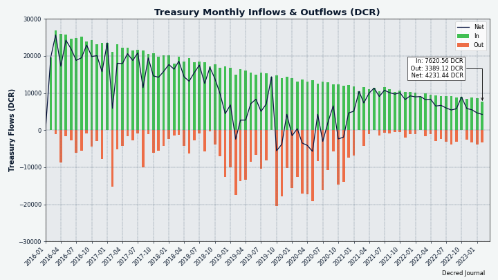
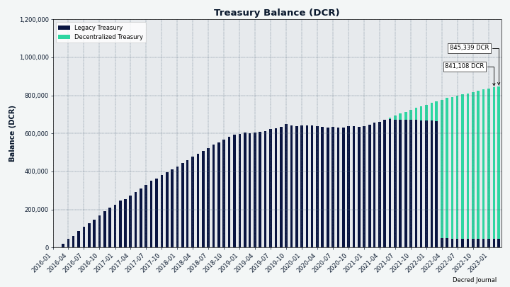
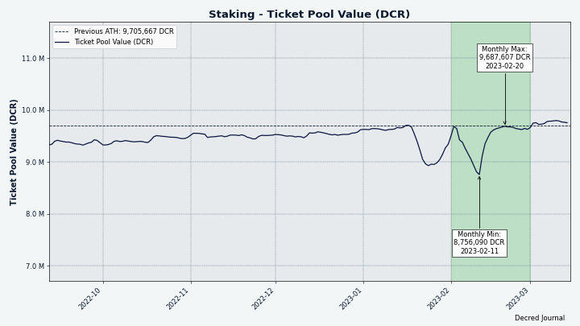
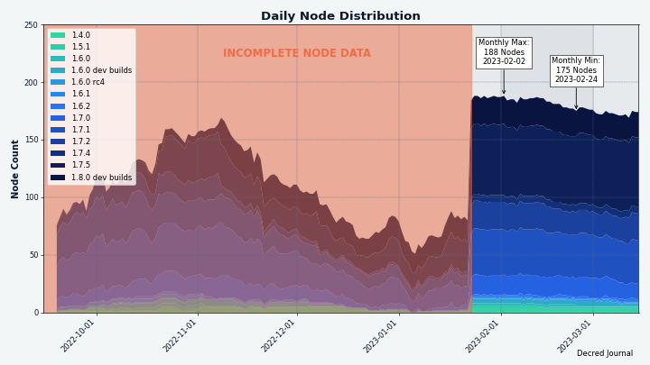
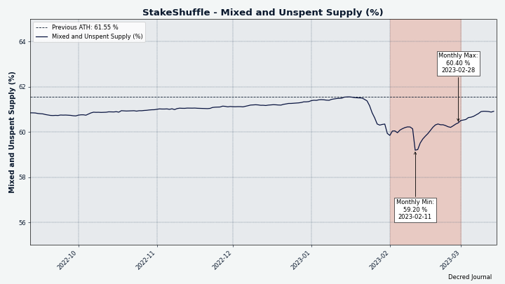
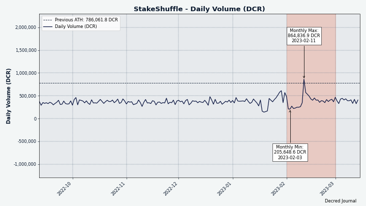

# Decred 月报 – 2023 年 2 月

_图片：Decred 生日蛋糕_

二月亮点：

- Decred 达成了运营 7 年的里程碑。
- Decred DEX v0.5.9 进行了bug修复和版本优化，并且有大量关于重大开发进展的报告，v0.6 即将到来。
- Bison Relay v0.1.4 已发布，改进了用户体验，Oprah 打赏机器人现已在 BR 上运行。
- Timestamply 重新设计现已上线。
- 选票价格先是大幅下跌，然后是史诗般的上涨，再创历史新高。

内容：

- [DCRDEX v0.5.9 发布](#dcrdex-v059-release)
- [Bison Relay v0.1.4 发布](#bison-relay-v014-release)
- [开发进展总结](#development)
- [人员](#people)
- [治理](#governance)
- [网络](#network)
- [外展](#outreach)
- [活动](#events)
- [媒体](#media)
- [市场](#markets)
- [相关外部信息](#relevant-external)

## DCRDEX v0.5.9 发布

v0.5.9 随 v0.6 一起发布，为 Umbrel 启用自动部署的 Docker 镜像。但是，此版本中还有许多其它修复是从 v0.6 开发向后移植的：

- 改进客户端数据库压缩以节省磁盘空间。
- 更准确的交易费估算。
- 防止零费用交易。
- 增强性能。
- 清理日志记录。
- 修复了大约十几个边缘错误。

可以在[此处](https://github.com/decred/dcrdex/releases)找到完整的发行说明和独立的 DEX 应用程序下载。包含的散列和签名允许[验证](https://docs.decred.org/advanced/verifying-binaries)下载未被第三方损坏或修改。

## Bison Relay v0.1.4 发布

Bison Relay 在 v0.1.4 中收到了另一个更新：

- 一切都运行得更快。
- 可调字体大小。
- 图片和链接附件。
- 右侧面板可以更轻松地访问对用户和群聊的操作。
- 更强大的密钥交换维护。
- 奖励有价值内容作者的打赏机器人。
- 许多其它用户体验改进。

[此处](https://www.youtube.com/watch?v=Yz-IPu00eDc)提供新功能的简短视频概述。

[在改进的下载页面](https://bisonrelay.org/download/)上获取最新版本。欢迎在[GitHub 问题跟踪器](https://github.com/companyzero/bisonrelay/issues) 和 [#br Matrix 聊天](https://chat.decred.org/#/room/#br:decred.org)中报告错误和反馈。

## 开发进展总结

除非另有说明，否则下面报告的工作为“合并至核心存储库”状态。这意味着该工作已完成、审查并集成到高级用户可以[构建和运行](https://medium.com/@artikozel/the-decred-node-back-to-the-source-part-one-27d4576e7e1c)的源代码中，但普通用户尚不可用。

### dcrd

_[dcrd](https://github.com/decred/dcrd) 是一个完整的节点实现，为 Decred 在全球的点对点网络提供支持。_

大多数更改都集中在使共识部署代码更健壮且更易于理解：

- 重新设计了 [共识部署](https://github.com/decred/dcrd/pull/3056) 验证逻辑和测试，使其更容易修改并使其更符合代码库中使用的更现代的编码实践。 术语“部署”和“议程”指的是[共识投票定义](https://github.com/decred/dcrd/blob/974b1b3ccc7393c5450d75f1f58b75b80020cc3b/chaincfg/mainnetparams.go#L139)，包括描述、投票选择、有效期、 和其他细节。
- 为不同的议程强制执行[全球唯一的投票 ID](https://github.com/decred/dcrd/pull/3057)。 从技术上讲，重复使用投票 ID 并没有错，但是 Decred 生态系统中的各种软件隐含地假设 ID 在所有议程中都是唯一的。 这个不成文的规则现在已经正式化，以防止混淆并简化处理它的代码。
- 跟踪 [共识规则更改](https://github.com/decred/dcrd/pull/3059) 状态的简化代码。
- 添加了一个网络参数以[强制共识投票](https://github.com/decred/dcrd/pull/3060) 到某些结果并相应地激活它们的功能。 这已经被用于测试网络以快速测试功能，而无需经过整个投票过程。 虽然它的工作方式被发现是令人惊讶的行为：“如果在给定网络的参数中找不到部署，则认为它是活动的”。 其他问题包括测试投票过程本身的复杂性，以及这种隐式强制投票在 getblockchaininfo 等命令中是不可见的。 所有这些问题都已修复，现在可以更轻松地在代码中找到强制规则。 还添加了安全检查以确保不能在主网络上使用强制投票选择。

Docker:

- 添加了为特定 Git 版本构建 [Docker 映像](https://github.com/decred/dcrd/pull/3048) 的功能。
- 除了 dcrd 版本之外，还打印 [dcrctl 版本](https://github.com/decred/dcrd/pull/3062)，因为它们现在来自单独的存储库。

其它:

- 由于 Go 1.19，在未导出的模块中切换到新的[原子类型](https://github.com/decred/dcrd/pull/3053)。 这使得代码不太容易出现人为错误，并且不那么冗长。 导出的模块在 [单独的 PR](https://github.com/decred/dcrd/pull/3054) 中升级，稍后将合并到 [主存储库](https://github.com/decred/dcrd/pull/3054#issuecomment-1428189607)到更新的 Go 版本太快了。
- 更新了 [连接请求](https://github.com/decred/dcrd/pull/3055) 跟踪以防止并发错误。
- 修复了基于 [riscv64](https://github.com/decred/dcrd/pull/3049) CPU 架构的 OpenBSD 构建。
- 更新了 [Go 1.20](https://github.com/decred/dcrd/pull/3052) 的构建基础设施和文档，并放弃了对 Go 1.18 的支持。
- 依赖更新。

### dcrwallet

_[dcrwallet](https://github.com/decred/dcrwallet) 是命令行和图形界面钱包应用程序使用的钱包服务器。_

- 修复了 [地址发现](https://github.com/decred/dcrwallet/pull/2204) 中的死锁，该死锁可能由时机不佳的 getnewaddress 命令触发。
- 更新了 dcrd 中的 [`addrmgr` 模块](https://github.com/decred/dcrwallet/pull/2206)，以便在 SPV 模式下可用的质量对等点很少时提高性能。
- 更新了 [golang.org/x 模块](https://github.com/decred/dcrwallet/pull/2209)，包括更新的 `x/sys` 以支持在 [OpenBSD](https://github.com/decred/dcrwallet/pull/2208)上构建在 riscv64 CPU 上运行。

### dcrctl

_[dcrctl](https://github.com/decred/dcrctl) 是 dcrd 和 dcrwallet 的命令行客户端。

- 将 [dependencies](https://github.com/decred/dcrctl/pull/54) 更新为最新模块。 这允许在 OpenBSD riscv64 上构建并且还显着减少了间接依赖性。

### Decrediton

_[Decrediton](https://github.com/decred/decrediton) 是一款功能齐全的桌面钱包应用程序，集成了投票、StakeShuffle 混合、闪电网络、DEX 交易等功能。 它在有或没有完整的区块链（SPV 模式）的情况下运行。_

进行中：

- [更新到 React v18](https://github.com/decred/decrediton/pull/3851)。 它可能需要进行大的更改，但会带来性能改进。

### vspd

_[vspd](https://github.com/decred/vspd) 是用于运行投票服务提供商的服务器软件。 VSP 代表其用户全天候 24/7 投票，不能窃取资金。_

- 检查 [VSP 是否已关闭](https://github.com/decred/vspd/pull/369) 是否更早，在 dcrd/dcrwallet/database 客户端初始化之前。 这样效率更高并且可以防止可能的错误。
- 更新至 [Go 1.20](https://github.com/decred/vspd/pull/368)。
- 测试现在作为 [子测试](https://github.com/decred/vspd/pull/365) 运行，以便更好地报告测试结果和指标。
- 添加了 [错误处理](https://github.com/decred/vspd/pull/363) 的测试，确保 vspd 错误的格式正确，非 vspd 错误包含足够的调试信息。
- 从文档中删除了 [dcrstakepool 说明](https://github.com/decred/vspd/pull/370)，因为它现已失效。

### cspp

_[cspp](https://github.com/decred/cspp) 是一个使用 CoinShuffle++ 协议协调硬币组合的服务器。 它是非托管的，即不持有任何资金。_

- 更新 CI 以使用最新的 [flint2](https://github.com/decred/cspp/pull/69) 数学 [library](http://www.flintlib.org/) 在 Ubuntu 22 上构建。
- 添加了一个 [`solverrpc` 包](https://github.com/decred/cspp/pull/86) 作为现有 `solver` 的直接替代品。 它允许将与 C 代码（flint2 数学库）的交互提取到一个名为“csppsolver”的单独后台进程中，并从更灵活的纯 Go 代码与该进程对话。
- 添加了 [build flags](https://github.com/decred/cspp/pull/87)，允许构建一个完全独立的 `csppsolver` 可执行文件，其中嵌入了 flint2 库。 分发此类可执行文件无需安装 flint2。

### DCRDEX

_[DCRDEX](https://github.com/decred/dcrdex) 是一种非托管的、尊重隐私的交易所，用于去信任交易，由原子交换提供支持。_

[v0.5.9 版本](https://github.com/decred/dcrdex/releases/tag/v0.5.9) 是为了支持 [Umbrel 集成](https://github.com/decred/dcrdex/pull/2153)，但它还包括自 2022 年 12 月左右以来在 `master` 中进行的许多重要修复：

- 调整了哪些 [交换费用](https://github.com/decred/dcrdex/pull/2147) 被认为是 BTC 和 DCR 的“最佳”。 最好的案例费用发生在整个订单在一次匹配中被消耗时，即整个订单的 1 笔交易和 1 次输出。 这会影响下订单时显示的费用预览。
- 自动忽略旧客户端版本生成的非常[旧通知](https://github.com/decred/dcrdex/pull/2144)。
- [更新 Docker 配置](https://github.com/decred/dcrdex/pull/2112)：优化基础镜像，将 DEX 客户端切换为以非 root 用户身份运行，删除不需要的文件，并优化 [Docker 构建](https://github.com/decred/dcrdex/pull/2162)用于生产。 除其他外，它有助于在 [Umbrel 应用商店](https://proposals.decred.org/record/8d83046) 中发布 DEX 客户端。
- 添加了 GitHub 工作流程以构建和发布 [发布 Docker 图像](https://github.com/decred/dcrdex/pull/2127)。
- 更新了 dcrd 的 [地址管理器](https://github.com/decred/dcrdex/pull/2096) 模块以修复在运行测试网 SPV 钱包超过一天时的高 CPU 使用率。
- 修复了存档清理功能报告的已删除[订单和匹配项](https://github.com/decred/dcrdex/pull/2098) 的数量。
- 修复了在某些 macOS 系统上检测到“不符合标准”证书错误时毫无意义的 [重新连接尝试](https://github.com/decred/dcrdex/pull/2130)。
- 修复了客户端在 [账户数据库](https://github.com/decred/dcrdex/pull/2119) 加载失败时尝试运行的问题。
- 依赖更新，包括次要的安全修复。
- 从 12 月至 1 月制作的“master”向后移植了[~14 个其他修复](https://github.com/decred/dcrdex/pull/2153)。

以下所有其他更改都在下一个 [v0.6 版本](https://github.com/decred/dcrdex/milestone/22) 的 `master` 分支中。

客户端更改：

- 在[服务器证书更改](https://github.com/decred/dcrdex/pull/2019) 时处理更多边缘情况。
- 如果不支持资产版本，则隐藏 [order form](https://github.com/decred/dcrdex/pull/2054)。
- 显示代币资产订单的[费用百分比](https://github.com/decred/dcrdex/pull/2110)，如果法定汇率可用于代币及其母资产。
- 允许连接到 DEX 服务器 [仅查看模式](https://github.com/decred/dcrdex/pull/1986) 无需注册，并浏览市场和订单簿。

客户端，忠诚债券进展：

- 为客户实施了主要的[债券生命周期](https://github.com/decred/dcrdex/pull/2036) 机制，包括自动债券轮换。 当当前债券即将到期时，必须在正确的时间用另一个债券替换它才能继续使用 DEX 而不会中断。 添加[图表](https://github.com/decred/dcrdex/blob/7603ead02dc6e040e69b50f8796e3f23aac06e1b/client/core/bond.go#L49)来解释债券的生命周期。
- 实施维护[债券基金储备](https://github.com/decred/dcrdex/pull/2103)。 钱包的一部分资金将保留用于未来的债券以及交易费用的缓冲。 当储备金被强制执行时，钱包提款或交易订单等交易将被限制在较低的可用余额范围内。 钱包余额报告将显示锁定在现有债券中并为未来债券预留的资金。 债券将使用不同于为交易订单提供资金的选币策略。 订单试图消耗更少的输出以最小化费用（可以花费更多的 DCR 并返回多余的零钱），而债券试图将确切的 DCR 数量放入时间锁中（并且不能依赖零钱输出）。 默认情况下，为 DCR 启用掉期交易输入的预先调整大小，因为它有利于债券管理，而且 DCR 费用现在很便宜。 无法禁用未使用债券的帐户。 初始实施仅支持 DCR 债券，但已添加基础以允许其他资产中的债券。
- 将注册 UI 流程更改为 [创建债券](https://github.com/decred/dcrdex/pull/2025) 而不是支付费用。 用户可以选择债券的强度。 如果账户等级低于交易水平并且有未决债券，市场页面将显示用户可以交易之前需要的债券确认。 为手动债券过帐添加了后债券功能。
- 优化[硬币选择](https://github.com/decred/dcrdex/pull/2169) 算法以创建更接近目标 DCR 数量的债券。
- 可以在 [此仪表板](https://github.com/orgs/decred/projects/2/views/1) 上查看债券子系统已完成、正在进行和剩余的任务。
- 在大局中，需要 [fidelity bond](https://en.wikipedia.org/wiki/Fidelity_bond) 从用户*支付费用*到服务器，再到用户在使用服务器时*锁定资金* . 这两种方法都可以保护服务器免受垃圾邮件和其他不良行为的侵害。 债券比费用更复杂，但也有优势。 用户可以在不想交易时返还锁定的资金，债券还支持从独立服务器过渡到去中心化的[服务器网格](https://github.com/decred/dcrdex/issues/1765)（收费 系统不清楚哪些服务器应该收取费用）。

客户端修复：

- 修复了在尚未创建父钱包时创建 [令牌钱包](https://github.com/decred/dcrdex/pull/2121) 的问题。
- 修复了[订单状态](https://github.com/decred/dcrdex/pull/2140) 不同视图的差异。
- 修复了注册页面上令人困惑的 [同步进度](https://github.com/decred/dcrdex/pull/2133) 报告。
- 修复了重复重新获取 [资产图标](https://github.com/decred/dcrdex/pull/2163)。
- 修复了无法从钱包中提取 [all available DCR](https://github.com/decred/dcrdex/pull/2170) 的问题。
- 修复了最近匹配表上的[光标和排序方向](https://github.com/decred/dcrdex/pull/2172)。
- 修复了 [钱包余额](https://github.com/decred/dcrdex/pull/2183) 在为订单提供资金后未更新的问题。
- 修复了 ~4 个并发错误。
- 针对 UI、测试、文档和 Docker 图像优化的其他修复。

以太坊、RPC 数据提供者：

- 添加了 DEX 服务器配置 [多个以太坊数据提供者](https://github.com/decred/dcrdex/pull/2104) 并在活动提供者停止工作时切换到另一个提供者的能力。
- 添加了对 [RPC 提供程序运行状况](https://github.com/decred/dcrdex/pull/2125) 的监控。 以前，只有在所有配置的提供者都可以连接到并具有更新的区块链时，ETH 后端才会启动。 现在，如果至少有一个供应商连接正常并报告一个新区块，ETH 后端将启动。 建立连接后，将持续监控供应商的健康响应，并首先使用最好的供应商。
- 改进了 [已知且合规的 RPC 提供程序](https://github.com/decred/dcrdex/pull/2102) 的管理。
- 修复了尝试使用具有 [太旧的块头](https://github.com/decred/dcrdex/pull/2074) 的 RPC 提供程序的问题，这意味着它们未与网络同步。

以太坊，掉期费优化：

- 使 [交换估计](https://github.com/decred/dcrdex/pull/2129) 了解以太坊区块气体限制。
- 在放弃和因资金不足而失败之前，尝试对 [batched swap](https://github.com/decred/dcrdex/pull/2143)（一次交易中的多次交换）使用较低的 gas 限制。
- 调整 [费用估算](https://github.com/decred/dcrdex/pull/2139) 以降低和更现实的金额。

以太坊，其他变化：

- 阐明了 ETH 及其子代币资产的 API [版本控制](https://github.com/decred/dcrdex/pull/2094)。 目前，令牌资产将使用与父资产相同的版本。 这些版本号将用于确定不同的客户端和服务器是否兼容。
- 从 ETH 和 ERC-20 交换的 Solidity 智能合约中删除了 [`isRedeemable` 方法](https://github.com/decred/dcrdex/pull/2111)，并禁用了 `estimateRedeemGas` 调用。 这两种方法都会在赎回交易之前向以太坊节点揭示一个秘密。 当客户端使用私有节点时，这不是问题，但它成为公共 RPC 提供程序的漏洞，自合并以来 DEX 被迫使用。 Solidity 编译器已更新至 v0.8.18。
- 使用 [go-ethereum](https://github.com/ethereum/go-ethereum) 代码构建 [默认包含](https://github.com/decred/dcrdex/pull/2157)。 go-ethereum 是流行的以太坊软件，支持 DCRDEX 中的 ETH 和 ERC-20 支持。 与 DEX 不同，它是根据 GNU 宽松通用公共许可证 (LGPL) 获得许可的。 对于愿意使用 DCRDEX 的闭源软件来说，此许可证的负担可能是不可接受的，因此添加了一个标志以从构建中排除 go-ethereum。
- 在 [mainnet](https://github.com/decred/dcrdex/pull/2013) 上启用了 ETH 和 USDC 并调整了气体限制。 将兑换交易确认从 10 次减少到 3 次，因为重组 [considered](https://github.com/decred/dcrdex/commit/5c1ff8ab05a43b431f6d8e091692c32ea181e937) 在合并之后非常不可能。 智能合约爱好者可以找到 ETH [此处](https://etherscan.io/address/0x8c17e4968b6903e1601be82ca989c5b5e2c7b400#code) 和 ERC-20 [此处](https://etherscan.io/address/0x1bbd020ddd6dc01f974aa72f223d727) 的新交换合约 ＃代码）。
- @chappjc [tweeted](https://twitter.com/chappjc/status/1623136803661266947) 新合约在主网上与 ETH 和 USDC 执行了许多原子互换。
- Bug修复。

以太坊对权益证明共识的升级（也称为 [The Merge](https://ethereum.org/en/upgrades/merge/)）恰好 [客户端](https://github.com/ethereum/go-ethereum/issues/25623) 被 DCRDEX 使用，尽管有一些[期望](https://blog.ethereum.org/2021/03/24/finalized-no-24) 它会起作用。 这大大延迟了 DCRDEX v0.6，而必须开发解决方法。 在 [轻客户端](https://geth.ethereum.org/docs/fundamentals/les) 固定之前，DEX 用户可以选择运行自己的完整节点或使用像 [Infura](https://www.infura.io/)、[Ankr](https://www.ankr.com/) 和 [其它8个](https://github.com/decred/dcrdex/blob/80b0531a64a806ac8901d812b1e322418118cac1/client/asset/eth/multirpc.go)。

Umbrel 应用商店集成：

- 添加到 Decred GitHub 组织的新存储库用于托管 [Umbrel 集成](https://github.com/decred/umbrel-app-store) 代码。 Umbrel 用户可以按照说明添加此存储库并安装 DCRDEX 包。
- DCRDEX 包已提交至 [官方 Umrel 应用商店](https://github.com/getumbrel/umbrel-apps/pull/430) 进行审核。 与自定义社区应用程序商店不同，它需要集中批准。

### Timestamply

_[Timestamply](https://github.com/decred/dcrtimegui) 是由 Decred 区块链提供支持的免费时间戳文件服务。 时间戳证明某个文件在某个时刻已经存在。 这在保护数据完整性方面有一系列应用。_

- [1 月](202301.md#timestamply) 宣布的完整站点 [重新设计](https://github.com/decred/dcrtimegui/pull/151) 已完成并部署在 [timestamp.decred.org](https //时间戳.decred.org/）。 所有现有数据都已[迁移](https://proposals.decred.org/record/855a506/comments/20)。
- 添加了一个新的 API 方法，该方法返回由 dcrtime 服务器标记的 [last digests](https://github.com/decred/dcrtime/pull/84)。 它由新的 GUI 使用。
- 升级到 [Node v16](https://github.com/decred/dcrtimegui/pull/152)。

### Documentation

_[dcrdocs](https://github.com/decred/dcrdocs) 是 Decred [用户文档](https://docs.decred.org/) 的源代码。_

- 更新到 [MkDocs Material v9](https://github.com/decred/dcrdocs/pull/1214)，改进了搜索。
- 删除了 [Font Awesome](https://github.com/decred/dcrdocs/pull/1216) 图标，因为它们不起作用并且只出现在几页上。

### Bison Relay

_[Bison Relay](https://github.com/companyzero/bisonrelay) 是一个新的社交媒体平台，由 Decred Lightning Network 提供强大的审查、监视和广告保护。_

v0.1.4 版本中 GUI 和 CLI 应用程序的常见更改：

- 添加了支付和发送[多条消息并行](https://github.com/companyzero/bisonrelay/pull/98) 的支持，无需等待服务器确认，这使得发送速度更快。
- 在私人聊天和群聊中添加了对[发送和呈现嵌入](https://github.com/companyzero/bisonrelay/pull/118)（如图像和下载链接）的支持。
- 改进了对加密状态的跟踪和[密钥交换 (KX) 重置](https://github.com/companyzero/bisonrelay/pull/116) 的维护。 添加了半自动工具来检测和重置可能损坏的密钥交换。 重置的候选者是长时间没有收到消息的用户，或者如果自己的客户端已经长时间离线的所有用户。
- 改进了对刚 [连接](https://github.com/companyzero/bisonrelay/pull/130) 到服务器后收到的新群聊消息的处理。 这应该显示按时间正确排序的消息，尤其是在连接速度较慢的情况下。
- 修复了在某些情况下阻止 [clean shutdown](https://github.com/companyzero/bisonrelay/commit/ec5637968937439eb8752aa41200947051b2f8c0) 的错误。
- 修复了由于客户端尝试 [重新使用相同的付款](https://github.com/companyzero/bisonrelay/pull/131) 而导致的可能的重新连接循环。

v0.1.4 版本中的 GUI 应用更改：

- 添加了 [字体大小设置](https://github.com/companyzero/bisonrelay/pull/117)，有 4 种大小可供选择。
- 将用户和群聊的菜单操作（列表帖子、支付小费等）移动到[右侧面板](https://github.com/companyzero/bisonrelay/pull/119)。 这类似于 Element 并且更易于使用。
- 聊天列表的顺序在应用程序重新启动时 [已保存](https://github.com/companyzero/bisonrelay/pull/111)。
- 使用 [emoji 字体](https://github.com/companyzero/bisonrelay/commit/41fd091af874512d7a3d941f094c1615e54ee70b) 渲染更多字符和表情符号。

v0.1.4 版本中的命令行应用更改：

- 删除了 Ctrl+C 作为退出快捷方式。
- 如果视图不在底部，则删除[自动滚动到底部](https://github.com/companyzero/bisonrelay/commit/9324add82f4f7bd5317a31f14c8f78618e79e856)。
- 提醒当前窗口[已完成下载](https://github.com/companyzero/bisonrelay/commit/fdad19d95a140125019daa5bbb929ed6892df2f2)。
- 添加了 [未读消息标记](https://github.com/companyzero/bisonrelay/commit/e03164fcdf3c168cb772bde17310a003de8418f6) 到非活动窗口。
- 其他修复和依赖更新。

服务器和 v0.1.4 中的其他更改：

- 添加了对[同时](https://github.com/companyzero/bisonrelay/pull/97)接受多条消息的支持。 默认情况下，连接的客户端在需要支付之前可以请求最多 8 张消息发送发票。 服务器必须在 24 小时内检测到付款，否则将需要重新付款。 生产服务器可能为此使用不同的参数。
- [存储收到的消息](https://github.com/companyzero/bisonrelay/pull/110) 以便 `clientrpc` 用户可以检索它们。 这可以防止机器人和其他自动化工具中遗漏消息。

GUI 和 CLI 应用程序的常见更改合并到下一个版本 (v0.1.5) 的 `master` 中：

- 添加了 [警告](https://github.com/companyzero/bisonrelay/pull/139) 提醒用户 LN 发票生成失败并建议增加接收容量。
- 添加了[群聊的版本控制](https://github.com/companyzero/bisonrelay/pull/140) 和不支持的群聊版本的警告。
- 添加了向其成员[重新发送群聊信息](https://github.com/companyzero/bisonrelay/commit/dc63dafcad9dad4e1db105418e642ea50349896f) 的命令，以解决用户列表不同步的问题。
- 修复了应用重启后的[群聊消息排序](https://github.com/companyzero/bisonrelay/pull/136)。

`master` 中的 GUI 应用程序更改：

- 添加了一条水平线，用于标记收到的 [未读消息](https://github.com/companyzero/bisonrelay/pull/137) 的开始。 如果后续消息来自同一作者，则删除头像和用户名的显示。
- 添加总 DCR [发送和接收](https://github.com/companyzero/bisonrelay/pull/146) 摘要到支付统计页面。
- 为存款地址添加了[二维码](https://github.com/companyzero/bisonrelay/pull/148)。
- 在提示打开更多LN通道的页面默认隐藏[高级选项](https://github.com/companyzero/bisonrelay/pull/150)。
- 修复了打开聊天部分时 [活动聊天](https://github.com/companyzero/bisonrelay/pull/145) 选择丢失的问题。

`master` 中的 CLI 应用程序更改：

- 打开通道和[请求接收容量](https://github.com/companyzero/bisonrelay/pull/147)的简化代码。
- 允许指定嵌入式 dcrlnd 实例将监听的 [自定义 IP 地址](https://github.com/companyzero/bisonrelay/pull/149)，而不是默认的“127.0.0.1”。
- 改进了[文本换行](https://github.com/companyzero/bisonrelay/pull/132) 和多行元素的渲染。
- 添加了[密钥交换调解](https://github.com/companyzero/bisonrelay/pull/134) 和[作者昵称](https://github.com/companyzero/bisonrelay/pull/151) 到使用的自动化 API 通过机器人和其他工具。

其他的东西：

- 奥普拉出局了！ 这是一个打赏机器人，它会关注用户并奖励他们发表实质性的帖子或评论。 在 [#br Matrix chat](https://chat.decred.org/#/room/#br:decred.org) 中询问如何从 Oprah 那里获得提示。

## 人员

截至 3 月 1 日的社区统计数据（与 2 月 2 日相比）：

- [Twitter](https://twitter.com/decredproject) 粉丝: 53,064 (-204)
- [Reddit](https://www.reddit.com/r/decred/) 订阅: 12,660 (-3)
- [Matrix](https://chat.decred.org/) #general 用户: 750 (+8)
- [Discord](https://discord.gg/GJ2GXfz) 用户: 1,557, 已验证发布: 932 (+6)
- [Telegram](https://t.me/Decred) 用户: 2,756 (-60)
- [YouTube](https://www.youtube.com/decredchannel) 订阅: 4,630 (-10), 观看量: 224.6K (+2.3K)

## 治理

2 月份，新[国库](https://dcrdata.decred.org/treasury) 收到 7,620 DCR，价值 183,000 美元，2 月份的平均汇率为 24.03 美元。 3,389 DCR 用于支付承包商费用，按 2 月份的汇率计算价值 81,000 美元。

[国库支出 tx](https://explorer.dcrdata.org/tx/e09505dbb877e5efdd184129858be5655a3de235cdac2cfa749442f0ccf7de81) 有 27 个输出支付给承包商，范围从 3 DCR 到 1,084 DCR。 这些 DCR 的大部分可能是为 12 月的发票支付的，现在在月末和该月的 TSpend 创建之间存在持续滞后，因此当交易被利益相关者批准时，通常是在交易结束后的两个月。 进行工作的月份。 按照 12 月 19.79 美元的开票率，2 月的 TSpend 相当于 67,000 美元。

_图片：Decred 国库月度流入和流出。_

截至 3 月 14 日，[旧国库](https://dcrdata.decred.org/address/Dcur2mcGjmENx4DhNqDctW5wJCVyT3Qeqkx) 和 [新国库](https://dcrdata.decred.org/treasury) 的合并余额为 844,504 DCR（1680 万） 美元 19.88 美元）。

_图片：Decred 国库余额历史记录。_

2月份没有新的提案发表，当月投票结束的提案刊登在期刊的[1月月报](202301.md#governance)。

## 网络

**全网算力**: 2 月的 [全网算力](https://dcrdata.decred.org/charts?chart=hashrate&scale=linear&bin=day&axis=time) 开始为 ~73 Ph/s，结束为 ~71 Ph/s，最低为 60 Ph/s，峰值为 83 Ph/s。

_图片：Decred 全网算力。_

3 月 1 日各矿池的 66 Ph/s 算力分布[报告](https://miningpoolstats.stream/decred)：Poolin 51%，F2Pool 38%，AntPool 11%，CoinMine 0.4%。

截至 3 月 1 日实际 [开采](https://miningpoolstats.stream/decred) 1,000 个区块的分布：Poolin 54%，F2Pool 36%，AntPool 6%，可能 BTC.com 4%。

_图片：历史矿池哈希率分布。_

**Staking**: [选票价格](https://dcrdata.decred.org/charts?chart=ticket-price&axis=time&visibility=true-true&mode=stepped) 在 207-496.5 DCR 之间变化，30 天[平均](https:// dcrstats.com/) 在 263.8 DCR (+51.3)。

在 1 月份大幅下跌至 140 DCR 之后，票价飙升至 **496.5 DCR** 的历史新高。 一周后它恢复正常水平并稳定在 230 DCR 附近。

_图片：选票价格创下历史最大涨幅。_

[锁定数量](https://dcrdata.decred.org/charts?chart=ticket-pool-value&scale=linear&bin=day&axis=time) 为 876-969 万 DCR，这意味着流通供应量的 58.5-64.9% [参与](https://dcrdata.decred.org/charts?chart=stake-participation&scale=linear&bin=day&axis=time) 在权益证明中。 这也比平时更不稳定。

_图片：锁定在 PoS 中的 DCR。_

**VSP**: [16 个列出的 VSP](https://decred.org/vsp/) 共同管理了约 7,410 (-980) 张现场门票，截至 3 月 1 日，占门票池的 18.4% (-0.4%)。

2 月份唯一的赢家是 dcrhive.com（+383 张票或 +74%）和 vsp.decredcommunity.org（+202 张票或 +38%）。 其他 14 个 VSP 平均丢失了约 25% 的票，但应该在票池大小从异常的 44,880 张票减少到 40,960 张票的目标的情况下考虑损失。

_图片：VSP 管理的工单分布。_

**节点**: [Decred Mapper](https://nodes.jholdstock.uk/user_agents) 在整个月内观察到 175 到 188 个 dcrd 节点。 3 月 1 日看到的 176 个节点的版本：v1.7.5 - 34%、v1.7.1 - 22%、v1.8.0 开发构建 - 13%、v1.7.2 - 11%、v1.7.0 - 10%、v1.7.4 - 3%，其他 - 7%。

_图片：历史 dcrd 版本分布，数据来自 nodes.jholdstock.uk。 2023 年 1 月之前的数据不完整。_

[混合硬币](https://dcrdata.decred.org/charts?chart=coin-supply&zoom=jz3q237o-la8vk000&scale=linear&bin=day&axis=time&visibility=true-true-true) 的份额在 59.2-60.4% 之间变化。 每日 [混合交易量](https://dcrdata.decred.org/charts?chart=privacy-participation&bin=day&axis=time) 在 206-865K DCR 之间变化。

由于混合硬币的很大一部分来自质押，因此质押 DCR 的下降也导致了混合量的下降。 随着PoS参与度的恢复，它在 2 月底恢复正常。

_图片：混币百分比。_

_图片：每日混币量的变化更大。_

Decred 的 [闪电网路](https://ln-map.jholdstock.uk/) 浏览器 已经看到 158 个节点（+11），305 个通道（+44），总容量为 115 DCR（+9），截至 3 月 1. 这些统计数据因 LN 节点而异。 例如，@karamble 的节点在同一个 3 月 1 日报告了 172 个节点（+12）、385 个通道（+38）和 168 个 DCR（+9）容量。

## 外展

Monde PR的成就：

- 获得 1 次媒体采访
- 提供 3 次评论机会
- 提供 4 次媒体机会

获得以下媒体展示位置：

- Bison Relay 在 [Blockworks](https://blockworks.co/news/web3-social-media-apps-to-watch) 中被列为“要观看的 Web3 社交媒体应用程序”。
- 一篇 [Decred 杂志文章](https://www.decredmagazine.com/planbs-s2f-model-is-flawed/) @jz 对 PlanB 的 S2F 模型缺陷的评论。
- [Decred 杂志文章](https://www.decredmagazine.com/middlemen-need-to-be-eliminated-from-the-cryptocurrency-space/) 以@jz 对从加密货币领域消除中间商的评论为特色。

Decred 杂志的评论最初是为加密出版物起草的，但没有被使用。 它没有被丢弃，而是被重新利用并发布在 DM 上。

## 活动

**出席:**

- @arij 在 Technopark Casablanca 为大约 60 位客人组织了 Decred 7 周年庆典。 该活动首先介绍了该项目及其多年来的主要里程碑，随后是该项目合作伙伴的评论。 在派对上发现了新版本的 Decred Cake。 在 [报告](https://decredcommunity.github.io/events/index/20230205.1) 中查看更多详细信息。

_图片：Decred 7 岁生日蛋糕。_

## 媒体

在 [此线程](https://www.reddit.com/r/decred/comments/10vnmmo/decred_on_nostr/) 中发布您的公钥，以帮助在 Nostr 上引导 Decred 社区。

**精选文章:**

- [中间人需要从加密货币空间中消除](https://www.decredmagazine.com/middlemen-need-to-be-eliminated-from-the-cryptocurrency-space/) by @HassanMaishera
- [价值 38 亿美元的加密货币被盗！ 可以做什么？](https://www.decredmagazine.com/u-3-8-billion-worth-of-crypto-stolen-what-can-be-done/) by @Joao
- [互联网隐私及其重要性](https://www.decredmagazine.com/internet-privacy-and-why-it-is-important/) @BlockchainJew
- [Decred vs Firo：隐私和治理！](https://www.decredmagazine.com/decred-vs-firo-privacy-and-governance/) @Joao

Decred 杂志 2 月份的参与度统计数据：

- DM 文章总数：409
- 时事通讯订户：88
- 发送的新 DM 帖子和时事通讯：17
- 活跃的社交媒体活动：32
- 完成的社交媒体活动：32
- 社交媒体帖子：143
- 喜欢：678
- 转发：148
- 所有平台和账户（包括 [@DecredSociety](https://twitter.com/DecredSociety)）的社交媒体粉丝：1,220

Decred Magazine 已开始在 TikTok 上建立受众。 非常感谢与 [@decredmagazine](https://www.tiktok.com/@decredmagazine) 的互动。

**视频:**

- [在完全验证模式下安装 Decrediton - Decred 基础知识](https://www.youtube.com/watch?v=JxLMi5fWL80) @phoenixgreen
- [Decred 新闻 - DEX 上的 ERC20 对、ATH 新票价、令人兴奋的 DCR DAO 新提案等](https://www.youtube.com/watch?v=9fJ92YxL_pU) @Exitus
- [Decrediton SPV 模式和导入种子短语 - Decred 基础](https://www.youtube.com/watch?v=K1zUdxsrgJM) @phoenixgreen
- [Decrediton 点对点支付 - 发送和接收](https://www.youtube.com/watch?v=DRWJ9Ajh6II) @phoenixgreen
- [Bison Relay 更新至版本 0.1.4](https://www.youtube.com/watch?v=Yz-IPu00eDc) @phoenixgreen

现场直播：

- [Decred 圆桌会议 - 下一个加密热潮](https://www.youtube.com/watch?v=ntJO1Ckmj4M) 壮举。 @phoenixgreen、@Exitus、@DCR\_Jay 和@Laurent - 讨论 [赛车运动提案](https://proposals.decred.org/record/2b19c56) 和加密领域的下一件大事。

**音频:**

推特空间：

- [Bitcoin.jpg：“我们将其全部放在链上！”](https://twitter.com/WasPraxis/status/1620938664879554560) @Tivra 讨论比特币上的 NFT 和 Ordinals 用例 - 反映在 [Anchor] (https://anchor.fm/decred-magazine/episodes/Bitcoin-jpg-Were-putting-it-all-on-chain-e1ud6gq)
- [Decred 的 7 岁生日庆典](https://twitter.com/decredproject/status/1622721223913271299) @Tivra feat。 Decred 社区，讨论 Decred 的七年，它去过的地方以及它的发展方向 - 反映在 [Anchor](https://anchor.fm/decred-magazine/episodes/Decreds-7th-Birthday-Bash-e1um58e)
- [公平游戏或操纵系统 - 关于工作量证明和 ASIC 生产](https://www.decredmagazine.com/fair-game-or-rigged-system-on-proof-of-work-and-asic -生产/）@Tivra壮举。 David Vorick，讨论他在 ASIC 生产游戏中的经历并质疑其公平性——反映在 [Anchor](https://anchor.fm/decred-magazine/episodes/Fair-Game-or-Rigged-System---On- Proof-of-Work-and-ASIC-Production-e1v382d)，加上[YouTube]上的编辑和压缩版本(https://www.youtube.com/watch?v=n8Wz5Zx0MSs)

**艺术与乐趣：**

- [Clay Stakey 骑粘土野牛](https://twitter.com/RichardRed0x/status/1622676008955412480) @richardred
- @karamble 的 [Bison Relay](https://twitter.com/karamblez/status/1624099752555032602)、更多 [Bison Relay](https://twitter.com/karamblez/status/1625176367573700615) 和 [DCRDEX] 动画 (https://twitter.com/karamblez/status/1629475704088805378) ETH+USDC 开发更新
- [Bison Relay 贴纸](https://www.reddit.com/r/decred/comments/10rvh06/join_the_herd_bison_relay_stickers/) - [@TofuPixel](https://twitter.com/TofuPixel) 的设计，可以 在社交媒体上使用或打印成贴纸来宣传 BR
- [Decred 加密独角兽](https://www.decredmagazine.com/decred-a-crypto-unicorn/) @OfficialCryptos

> Decred 是成熟的加密货币中真正的独角兽。 它通常被描述为一种极其多才多艺的生物，是加密纯洁和优雅的象征。

**翻译:**

- [点对点电子公司](https://www.decredmagazine.com/peer-to-peer-electronic-corporation/) @Tivra - [中文](https://github.com/DominicTing /decred-ZH-translations/blob/master/Peer-to-Peer%20Electronic%20Corporation.md）@Dominic
- Decred 月报 十二月至一月 共有 3 个新的 [翻译](https://xaur.github.io/decred-news/) 到阿拉伯语 (@arij, @abdulrahman4)、中文 (@Dominic) 和波兰语 (@科泽尔）。 感谢大家传播 Decred 的信息！

**非英语内容:**

- [每周加密货币市场回顾和 Decred](https://www.youtube.com/watch?v=ZLBrCKKNkPs) @FIMA（克罗地亚语）
- [Decred 概述和价格预测](https://www.youtube.com/watch?v=vmdAarp-Lew)（法语）

**讨论:**

- [每票 360 DCR，这是历史新高吗？](https://www.reddit.com/r/decred/comments/10qtjtj/360_dcr_per_ticket_is_this_a_record_high/)

**其它：**

- 关于 [Decred DAO 的资助方式](https://twitter.com/toddfmaki/status/1622136960407183360) 的教育主题，作者 @toddfmaki
- 关于 [Bison Relay] 的教育主题 (https://twitter.com/karamblez/status/1623621101027835904) @karamble

## 市场

2 月，DCR 在 USDT 21.71-28.52 和 BTC 0.00095-0.00121 之间交易。 平均每日费用为 24.03 美元。

_图片：以美元为单位的 DCRDEX 月交易量。_

## 外部相关信息

Localbitcoins，个人对个人比特币交易的长期促进者，正在关闭。经过 10 年的行动，Localbitcoins 无法承受“持续的非常寒冷的加密冬天”，并于 2 月 16 日暂停交易，仅供用户提取任何余额。

加密货币交易所 Kraken 已与美国证券交易委员会就“加密资产质押即服务计划的未注册要约和销售”达成和解，并同意“支付 3000 万美元以了结美国证券交易委员会的费用” 。这是对交易所提供的质押服务进行更大规模打击的一部分，交易所通过质押用户的代币产生收入，并将其中的一部分支付给代币持有人。这些行动的既定动机是为投资者提供有关其代币保管人使用它们的可靠信息，但正如 Kraken 首席执行官杰西鲍威尔在推特上所说，这并不像填写表格那么容易，而且对于已经尝试过的公司来说参与审批过程并不顺利。

Oasis DeFi 协议被用于“反利用”黑客，该黑客于 2022 年 2 月从虫洞桥窃取了 120,000 ETH，并在其开发人员被英国高等法院命令后窃取他们存入该平台的资金。去年虫洞桥被利用后，Jump Crypto（其 VC 支持者）介入，使用户完整，此后一直在追踪被盗资金以期找回。据报道通过 Blockworks，Jump Crypto 可能在检索中发挥了关键作用，他们提供了资金来收回抵押品并关闭未平仓头寸，并且他们很可能也是 Oasis 博客文章中提到的“白帽集团”，他们提供了关于如何收回资产。反利用涉及一个可升级的合约，并向拥有 Oasis 合约的 4 of 12 multisig 添加一个新的签名者。目前尚不清楚生成执行漏洞利用命令的过程是什么。

Optimism 是第 2 层以太坊链，进行了第二次空投，向超过 300,000 个地址发送了 1170 万个 OP 代币。这次空投奖励委托 OP 进行治理的用户，以及在汽油费上花费超过 6 美元的用户，以及委托更多时间更长或使用更多天然气的乘数。Optimism 承诺将 19% 的供应量分配给空投，2022 年 5 月的第一个空投分配了 5%。

Facebook 母公司 Meta报告称其Metaverse 部门 2022 年亏损 137 亿美元，并警告称 2023 年亏损将进一步加速。

印度的目标是在 2023 年底之前推出其 CBDC，并且正在进行两项面向 CBDC 的批发和零售试验，这些试验一直在扩大，但并非没有困难。印度已经拥有由银行运营的无处不在的统一支付接口（UPI），该接口被广泛使用并将用户数据暴露给银行运营商——零售 CBDC 被视为一种提供更像现金和尊重隐私的支付方式而无需银行中介机构。

阿拉伯联合酋长国 (UAE) 中央银行宣布计划发行用于国内和跨境支付的 CBDC，作为加速数字化转型新项目的一部分。

1 月，澳大利亚国民银行成为第二家创建稳定币 (AUDN) 的澳大利亚主要银行，允许企业客户使用澳元实时结算区块链技术交易。他们的目标是在年中推出并支持包括海外支付和碳信用交易在内的交易，其既定目的是促进数字经济。这是在墨尔本的竞争对手 ANZ 开发类似产品 (A$DC) 后的 9 个月。澳大利亚储备银行正在探索 CBDC 的用例，并将在 2023 年上半年选择一些试点项目。

这就是二月的全部内容。在我们的#journal聊天室中分享您对下一期的更新。

## 关于月报

这是 Decred Journal 第 56 期。[此处](https://xaur.github.io/decred-news/)提供所有问题、镜像和翻译的索引。

来自第三方的大多数信息在经过最低限度的健全性检查后直接从源转发。Decred 月报的作者无法验证所有声明。请提防诈骗并进行自己的研究。

感谢 (字母排列):

- 写作、编辑、出版： bee, bochinchero, Exitus, jz, karamble, l1ndseymm, phoenixgreen, richardred
- 评论和反馈: davecgh, kozel
- 标题图片: arij, Exitus
- 资助: Decred stakeholders

## 中文社区

* [微博](https://www.weibo.com/DecredProject)
* [微信公众号](https://mp.weixin.qq.com/mp/profile_ext?action=home&__biz=Mzg2NTExNzc3MA==&scene=124#wechat_redirect)
* [bilibili频道](https://space.bilibili.com/425519478)

