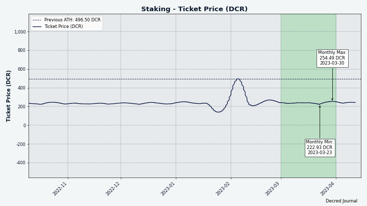

# Decred 月报 – 2023 年 3 月

_图片: @Exitus_

三月亮点：

- 提出并批准了一项提案，将区块补贴从 10/80 PoW/PoS 更改为 1/89，并更改算法用以排除现有ASIC。

- Bison Relay v0.1.5 已发布，v0.1.6 RC1 也已发布。

- DCRDEX 0.6 正在进行 Beta 测试，发布候选版本。

- Decred月报 是本月批准的四项提案之一，其它三项是针对 DCRDEX 开发的特定方面。

内容：

- [更改 PoW 算法并减少 PoW 奖励的提案](#proposal-to-change-pow-algorithm-and-reduce-pow-rewards)
- [Bison Relay v0.1.6 候选发布版](#bison-relay-v016-release-candidate)
- [开发进展总结](#development)
- [人员](#people)
- [治理](#governance)
- [网络](#network)
- [生态系统](#ecosystem)
- [外展](#outreach)
- [活动](#events)
- [媒体](#media)
- [市场](#markets)
- [相关外部信息](#relevant-external)

## 更改 PoW 算法并减少 PoW 奖励的提案

Decred 的共识和经济学正在发生重大变化。新提案将进一步将奖励的工作量证明份额从 10% 减少到 1%，将权益证明奖励从 80% 增加到 89%，并将挖矿算法从 BLAKE-256 更改为 BLAKE3。这将从网络中删除所有当前正在挖掘的 ASIC 硬件，目的是修复 DCR 的价格发现。在撰写本文时，该提案已获得批准。下一步将是在代码中实施新的共识规则，发布新版本的核心软件，让网络安装它并让利益相关者投票激活新规则。所有这一切应该需要几个月的时间，并且在 Decred 的[官方渠道](https://decred.org/community/)上会有更多关于每个阶段的交流。

## Bison Relay v0.1.6 候选发布版

三月份发布了两个版本，重点是改善群聊体验。

v0.1.5 版本亮点：

- 新的付款统计页面
- 存款地址二维码
- 改进错误信息
- 修复群聊成员列表不同步的问题
- 固定群聊消息排序
- 其他错误修复和用户界面调整

v0.1.6 Release Candidate 1 的亮点：

- 支持多个管理员的新版群聊
- 新消息的侧边栏通知
- 捆绑在邀请文件中的自动群聊邀请
- 突出显示带有用户昵称的消息
- 更明显的新帖子按钮
- 所有帖子评论都指向原始帖子，对中继副本的评论被禁用
- GUI 和 CLI 应用程序中的许多错误修复和 UI 改进

在 [GitHub](https://github.com/companyzero/bisonrelay/releases) 上获取最新版本的二进制文件（截至在 bisonrelay.org 上编写 [下载页面](https://bisonrelay.org/download/) 仍然 显示 v0.1.4)。 欢迎在 [GitHub 问题跟踪器](https://github.com/companyzero/bisonrelay/issues) 和 [#br 聊天室](https://chat.decred.org/#/room/#br:decred.org)在 Matrix 或 Bison Relay 本身上。

## 开发进展总结

除非另有说明，否则下面报告的工作为“合并至核心存储库”状态。这意味着该工作已完成、审查并集成到高级用户可以[构建和运行](https://medium.com/@artikozel/the-decred-node-back-to-the-source-part-one-27d4576e7e1c)的源代码中，但普通用户尚不可用。

### dcrd

_[dcrd](https://github.com/decred/dcrd) 是一个完整的节点实现，为 Decred 在全球的点对点网络提供支持。_

从 [上个月](202302.md#dcrd) 开始继续强化共识更改投票代码：

- 增强了部署参数的启动[验证](https://github.com/decred/dcrd/pull/3068)，以确保它们满足计票逻辑所依赖的假设。 例如，它检查每张选票是否恰好有一张弃权票和一张否决票，没有重复的投票选择，以及选择是否以位正确编码。 这允许优化和简化与计票相关的代码。
- 添加验证以确保共识更改投票参数 [不要使用特殊位](https://github.com/decred/dcrd/pull/3073) 保留用于批准或不批准前一个块。
- 添加验证以确保同一投票批次中不同投票使用的位 [不重叠](https://github.com/decred/dcrd/pull/3077)。
- 添加了使用 [空 ID](https://github.com/decred/dcrd/pull/3079) 拒绝投票选择的验证。 ID 是总结投票选择含义的短字符串，它们通常是“是”、“否”或“弃权”。
- 重新编写代码确定共识 [投票阶段和计票](https://github.com/decred/dcrd/pull/3069) 逻辑以优化它并使其更容易推理。
- 更改了获胜共识投票选择的内部表示，以提高可读性并防止 [滥用](https://github.com/decred/dcrd/pull/3080) 此代码。
- 重新编写了 [共识投票处理](https://github.com/decred/dcrd/pull/3075) 代码的测试，使它们更易于理解，测试更多的边缘案例，并 [更可靠](https://github.com/decred/dcrd/pull/3076)。
- 请注意，上述更改不会以任何方式破坏版本之间的共识，它们添加了更多检查，如果 dcrd 检测到共识代码所做的任何假设被违反，则允许它提前失败。

其他变化：

- 如果被查询的对等节点断开连接，则重新请求块和交易[更快](https://github.com/decred/dcrd/pull/3067)。 不再等待此数据稍后再次公布，而是立即从已知拥有该数据的对等方请求该数据。
- 修复了其他同行的[已知库存](https://github.com/decred/dcrd/pull/3074) 的缓存。 这是一个非常小的错误，可能会导致比绝对必要的流量略高的流量。
- 重构和 [构建配置](https://github.com/decred/dcrd/pull/3081) 更新。

### dcrwallet

_[dcrwallet](https://github.com/decred/dcrwallet) 是命令行和图形界面钱包应用程序使用的钱包服务器。_

- 删除了使用带余额的自动购票时不必要的[余额计算](https://github.com/decred/dcrwallet/pull/2203)以保持未设置或为零。 在较繁忙的钱包上，这会显着提高性能。
- 迁移到 [vspd](https://github.com/decred/vspd) 存储库提供的 [VSP 客户端](https://github.com/decred/dcrwallet/pull/2213)。 它主要是从 dcrwallet 借来的相同代码，但是将 VSP 代码合并到一个地方允许删除可能不同步的重复，例如错误代码、数据结构等。
- 修复了 SPV 模式下的 [数据竞争](https://github.com/decred/dcrwallet/pull/2210)。
- 修复了由于票价变化而取消购票请求时可能[丢失相关交易](https://github.com/decred/dcrwallet/pull/2212)的问题。

### Decrediton

_[Decrediton](https://github.com/decred/decrediton) 是一款功能齐全的桌面钱包应用程序，集成了投票、StakeShuffle 混币、闪电网络、DEX 交易等功能。 它在有或没有完整的区块链（SPV 模式）的情况下运行。_

进行中：

- Decrediton [Ledger 集成](https://github.com/JoeGruffins/ledger-decred-poc) 工作已由@JoeGruff 启动，并带有初始[概念证明](https://github.com/JoeGruffins/ledger-decred-poc) 和后续 [提案](https://proposals.decred.org/record/609db9e) 以使其做好生产准备。 目前用户需要使用 Ledger Live 软件从他们的 Ledger 设备发送/接收 DCR，但历史上存在太多[技术问题](https://matrix.to/#/!MYLcxlwzxwViTaFPGo:decred.org/$fxDMmKpCE-Edb1fRQyhyy_Rjlx2HuKNGtpwSmC76nIA?via=decred.org&via=matrix.org&via=planetdecred.org) 使用该软件。 在 Decrediton 中直接拥有 Ledger 支持将给 DCR 持有者一个更好的选择。

其它:

- 使用 Decrediton + Trezor 质押 DCR 再次被[阻止](https://github.com/decred/decrediton/issues/2681#issuecomment-1366432017) 固件所需的更改。 修复已于 12 月[提交](https://github.com/trezor/trezor-firmware/pull/2703) 到 Trezor 固件存储库，但尚未审查或合并。

### vspd

_[vspd](https://github.com/decred/vspd) 是用于运行投票服务提供商的服务器软件。 VSP 代表其用户全天候 24/7 投票，且其不能窃取资金。_

使 vspd 代码更容易被其他软件（例如 dcrwallet）使用的更改：

- 删除了使用自定义函数[覆盖服务器签名验证](https://github.com/decred/vspd/pull/372) 的能力。 添加此功能是为了方便测试，但结果是不必要的，并且使 VSP 客户端库更难使用。
- 删除了调用代码中 [转换错误](https://github.com/decred/vspd/pull/374) 的需要。 这是将模块的主要版本升级到 v2 所必需的。

其他变化：

- 添加了管理员登录请求的[速率限制](https://github.com/decred/vspd/pull/373)（每秒最多尝试 3 次）和支持它的示例 Nginx 配置。
- 添加了新的[开发工具](https://github.com/decred/vspd/pull/366)，用于测试 VSP 协议的各个步骤：创建 VSP 费用交易，将其发送到 VSP，查询票据状态，并更改 选票 的投票选项。 VSP 操作员可以使用此工具来验证他们的 VSP 是否正常工作。
- 增加测试覆盖率。

### dcrpool

_[dcrpool](https://github.com/decred/dcrpool) 是用于运行矿池的服务器软件。_

- 更新至 [Go 1.18](https://github.com/decred/dcrpool/pull/338)。

### 闪电网络

_[dcrlnd](https://github.com/decred/dcrlnd)是Decred的闪电网络节点软件。 闪电网络使即时和低成本交易成为可能。_

- 升级为针对 [Go 1.20](https://github.com/decred/dcrlnd/pull/176) 构建和测试。
- 更新了 [依赖项](https://github.com/decred/dcrlnd/pull/177)。

[LN 流动性提供者](https://github.com/decred/dcrlnlpd) (LP):

- 添加了客户端 [完整性检查](https://github.com/decred/dcrlnlpd/pull/9)，以便在无法从 LP 获取入站通道时提前失败。 客户端将使用服务器的策略来确定服务器是否可以创建所需大小的通道，以及客户端是否能够为此付费。 这样可以避免获取不会支付的发票。
- [配置](https://github.com/decred/dcrlnlpd/pull/9) LP 服务器的发票过期政策的能力。 发票由服务器生成，用于收取向客户开通 LN 通道的费用。 服务器操作员现在可以配置发票的有效期，以及客户在请求新发票之前必须等待的时间。
- 更新了 [依赖项](https://github.com/decred/dcrlnlpd/pull/10)。

LN 流动性提供者 是一种控制普通 LN 节点并为其添加一个有用功能的软件：客户端软件可以要求 LP 打开返回客户端的通道。 这为客户提供了额外的入站容量，并允许他们通过闪电网络接收更多资金。 作为回报，LP 运营商收取少量服务费用。

Bison Relay 是 Decred 闪电网络的主要用户，并受益于基础 LN 软件和流动性提供者的改进。

### cspp

_[cspp](https://github.com/decred/cspp) 是一个使用 CoinShuffle++ 协议协调混币的服务器。 它是非托管的，即不持有任何资金。_

- 更新了 [Go 依赖项](https://github.com/decred/cspp/pull/89)。

### DCRDEX

_[DCRDEX](https://github.com/decred/dcrdex) 是一种非托管的、尊重隐私的交易所，用于去信任交易，由原子交换提供支持。_

大型 v0.6 版本的内部预发布测试已于 3 月开始，其中有一个测试版和两个候选版本 [已标记](https://github.com/decred/dcrdex/tags)。 下面报告的所有更改都将包含在 v0.6 版本中。

客户端更改：

- 删除了 [默认比特币节点](https://github.com/decred/dcrdex/pull/2193)，以便在 SPV 模式下获得紧凑的块过滤器。 它是在很少有公共比特币全节点支持 [BIP-157](https://bitcoin.stackexchange.com/questions/86231/whats-the-distinction-between-bip-157-and-bip-158-are-they-supported-by-bitcoi/86232#86232)。 现在有很多，删除默认的可能会改善连接性，因为它经常过载。
- 改进了数据库 [无法初始化](https://github.com/decred/dcrdex/pull/2205) 时的错误消息，最常见的是在尝试启动第二个 dexc 实例时。

客户端修复：

- 修复了价格图表上空的[蜡烛之间的间隙](https://github.com/decred/dcrdex/pull/2195)。
- 修复了不同 UI 元素上不一致的小数 [精度](https://github.com/decred/dcrdex/pull/2208)。
- 修复了 [价格](https://github.com/decred/dcrdex/pull/2214) 在某些地方没有更新的问题。
- 修复了 SPV 模式下 [DCR](https://github.com/decred/dcrdex/pull/2219) 和 [BTC](https://github.com/decred/dcrdex/pull/2225) 的重组指示 匹配 dcrd 和 dcrwallet。 具体来说，不在主链上的区块（“孤立”区块）将被报告为具有“-1”确认。
- 修复了[创世钱包](https://github.com/decred/dcrdex/pull/2236) 显示 UTC 日期而不是系统的本地日期。
- 修复了 ~5 个其他 UI 错误和 ~1 个并发错误。

以太坊，客户端：

- 改进了在 DEX 客户端[关闭](https://github.com/decred/dcrdex/pull/2191) 时对 RPC 提供程序连接不良的处理。
- 添加了[以太坊钱包指南](https://github.com/decred/dcrdex/pull/2233) 维基页面。
- 向 [费用估算](https://github.com/decred/dcrdex/pull/2234) 添加了 20% 的缓冲区，确保发送 ETH 成功，即使网络的基本费用在发送前跳跃。
- 更新到 [Geth v1.11](https://github.com/decred/dcrdex/pull/2238)。 这是计划于 2023 年 4 月 12 日进行的上海网络升级所必需的。
- 修复了代币的[父资产余额](https://github.com/decred/dcrdex/pull/2201) 在取消涉及该代币的订单时未更新的问题。
- 修复了[未确认交易](https://github.com/decred/dcrdex/pull/2211) 未反映在可用余额中的问题。
- 修复了错误信息。

以太坊，服务器：

- 允许服务器操作员在配置文件中按 [优先级](https://github.com/decred/dcrdex/pull/2199) 对 RPC 提供程序端点进行排名。 始终首先尝试具有最高优先级的健康连接。

忠诚债券：

- [UI 更新](https://github.com/decred/dcrdex/pull/2200) 用债券代替注册费，包括将债券整合到账户进出口流程中。 从相同或新的应用程序种子恢复时，以及使用现有或创建新的 DEX 帐户时，会考虑不同的情况。
- 在客户端和服务器中 [使用 BTC](https://github.com/decred/dcrdex/pull/2196) 实施债券融资。 可以将债券转换为使用不同的资产，例如 从 DCR 到 BTC。

其他变化：

- 为交换中使用的地址添加了更严格的服务器端[检查](https://github.com/decred/dcrdex/pull/2248)。
- 更新了 [LTC 依赖项](https://github.com/decred/dcrdex/pull/2268) 以引入 [关键修复](https://github.com/ltcsuite/ltcd/pull/25) 进行处理 大额交易。
- 测试基础设施、构建脚本、依赖更新方面的改进。

下一个版本（可能是 v0.6.1）的 `master` 客户端更改：

- 通知用户有关[不稳定的连接](https://github.com/decred/dcrdex/pull/2028)。
- 修复了 [无法订阅](https://github.com/decred/dcrdex/pull/2252) 来自以太坊 RPC 提供商的新标头通知时的错误。

其他的东西：

- DCRDEX 在官方 Umbrel App Store 中被 [拒绝](https://github.com/getumbrel/umbrel-apps/pull/430#issuecomment-1452436145) 因为“对于加密相关的应用程序，我们只接受应用程序 只专注于比特币”。 两周后，他们 [推特](https://twitter.com/umbrel/status/1636068336101621760) 审查开发者是反自由市场，这让一些社区成员在拒绝的背景下感到惊讶。 通过添加 DEX 自己的[社区应用商店](https://github.com/decred/umbrel-app-store)，仍然可以通过 Umbrel 安装 DCRDEX。 不同之处在于，与中央官方 Umbrel App Store 相比，它需要更多的手动步骤，并且将 DCRDEX 暴露给更少的用户。
- 在 Twitter 上 [发现](https://twitter.com/DigiByteCoin/status/1640820963532214273) 首次与 DigiByte (DGB) 进行主网交换。

_图片：DCRDEX 中的 UI 更新，以用时间锁定债券代替注册费。 UI 设计是一项正在进行的工作。 显示的 DCR 金额不是真实的。_

### dcrdata

_[dcrdata](https://github.com/decred/dcrdata) 是 Decred 区块链和链下数据（如 Politeia 提案、市场等）的浏览器。_

- 添加了一个[允许主机](https://github.com/decred/dcrdata/pull/1958) 中间件，以确保请求标头中设置的任何“主机”值都在主机白名单中。 这可以防止无效或意外的“主机”值，即使在没有 Nginx 的情况下部署 dcrdata，Nginx 通常会处理它。
- 更新了 Decred 和第三方 [Node.js 模块](https://github.com/decred/dcrdata/pull/1952) 和 Go [依赖项](https://github.com/decred/dcrdata/pull/1959 ) 到他们的最新版本，并将构建移动到 Go 1.19 和 1.20。

### Documentation

_[dcrdocs](https://github.com/decred/dcrdocs) 是 Decred [用户文档](https://docs.decred.org/) 的源代码。_

- 添加了[语法突出显示](https://github.com/decred/dcrdocs/pull/1219) 以解决代码语法难以阅读的问题，尤其是在暗模式下。
- 更新了权益证明[概览页面](https://docs.decred)中的[PoS 奖励](https://github.com/decred/dcrdocs/pull/1220) 数字（30% 到 80%）。
- 为“兑换脚本”添加了一个[词汇表条目](https://github.com/decred/dcrdocs/pull/1217)。
- 在多个页面上更新了 [VSP 质押信息](https://github.com/decred/dcrdocs/pull/1217)。 这包括删除对兑换脚本的大部分引用，删除“遗留”质押说明，并简化剩余的质押说明。
- 整合了使用 VSP 和单独质押的 [优缺点](https://github.com/decred/dcrdocs/pull/1217)。
- 在兑换脚本页面添加了一个[注释](https://github.com/decred/dcrdocs/pull/1217)，表明它们不再相关。
- 优化了[使用dcrwallet购票](https://github.com/decred/dcrdocs/pull/1217)页面。 它现在清楚地将购买票和投票分两步分开，并删除了对过时的 dcrstakepool 系统的任何引用。
- 优化 [Docker 构建](https://github.com/decred/dcrdocs/pull/1222)：切换到基于 Alpine Linux 的小得多的图像，修复 RSS 提要的 MIME 类型，并更新脚本以在错误时失败。

### Dev Docs

_[dcrdevdocs](https://github.com/decred/dcrdevdocs) 是 Decred [开发者文档](https://devdocs.decred.org/) 的源代码。_

- 升级到 [MkDocs Material 9](https://github.com/decred/dcrdevdocs/pull/108)，改进了搜索。 还升级到 Python 3.11、Nginx 1.22，并优化了 Docker 构建。

### decred.org

_[dcrweb](https://github.com/decred/dcrweb) 是 [decred.org](https://decred.org/) 网站的源代码。_

[新闻页面](https://github.com/decred/dcrweb/pull/1106)的变化：

- 现在显示更具可读性的新闻媒体名称，而不是网站的域名。
- 不再显示软件版本的作者。

### Bison Relay

_[Bison Relay](https://github.com/companyzero/bisonrelay) 是一个新的社交媒体平台，由 Decred 闪电网络提供强大的审查、监视和广告保护。_

Bison Relay v0.1.5 的最终用户二进制文件已发布，其中包含我们在 [2 月月报](202302.md#bison-relay) 中报告的所有更改和修复。 仅仅一周后，v0.1.6 Release Candidate 1 就可以下载了。 以下是 v0.1.6 RC1 和 v0.1.6 final 中的所有更改。 后者添加了非常小的修复，并且没有为它制作二进制文件。

v0.1.6 中 GUI 和 CLI 应用程序的常见更改：

- 实施了 [新版群聊](https://github.com/companyzero/bisonrelay/pull/155)，引入了对多个管理员的支持。 管理员可以邀请或删除成员，以及分配或撤销管理员权限。 关闭群聊的权限仍然只有特殊的 Owner 角色才有可能。 现有群聊可以选择升级到新版本。
- 改进了[失败付款](https://github.com/companyzero/bisonrelay/pull/156)（例如小费）的错误处理和记录。
- 改进了[添加 LN 接收容量](https://github.com/companyzero/bisonrelay/pull/166) 的帮助文本。
- 禁止对 [中继帖子](https://github.com/companyzero/bisonrelay/pull/162) 发表评论。 评论帖子需要与原作者交换密钥。 此外，一旦收到作者的原帖，所有转发的副本都将被删除，以支持原帖。
- 修复了无法同时接受 [多个群聊邀请](https://github.com/companyzero/bisonrelay/pull/154) 的错误。
- 依赖更新和内部重构。

v0.1.6 中的 GUI 应用更改：

- 为 [新聊天消息](https://github.com/companyzero/bisonrelay/pull/157) 添加了侧边栏通知图标。
- 当[未读计数](https://github.com/companyzero/bisonrelay/pull/157) 超过 1,000 时显示为“1k+”。
- 当聊天中没有以前的消息时，避免冗余 [最后阅读指示器](https://github.com/companyzero/bisonrelay/pull/157)。
- 添加了一个突出的 [New Post](https://github.com/companyzero/bisonrelay/pull/159) 按钮，可以从不同的视图轻松访问。
- 添加了包含用户昵称的[消息突出显示](https://github.com/companyzero/bisonrelay/pull/164)。
- 添加了[种子验证步骤](https://github.com/companyzero/bisonrelay/pull/174)，用户需要回答有关其种子的问题。
- 添加了包含应用程序版本和版权信息的[关于页面](https://github.com/companyzero/bisonrelay/pull/175)。
- 修复了段错误 [关闭时](https://github.com/companyzero/bisonrelay/pull/157)。
- 修复了 [离开或杀死](https://github.com/companyzero/bisonrelay/pull/170) 群聊时的错误。
- 更小的 UI 调整和修复。

CLI 应用程序在 v0.1.6 中的变化：

- 为各种命令添加了用户名和群聊名称的[自动完成](https://github.com/companyzero/bisonrelay/pull/163)。
- 添加 [Alt+V](https://github.com/companyzero/bisonrelay/pull/153) 作为粘贴热键。
- 添加了解码和检查 [LN 发票](https://github.com/companyzero/bisonrelay/pull/166) 的命令，改进了 LN 事件的日志记录（例如通道打开或关闭）。
- 在邀请用户的[私人聊天](https://github.com/companyzero/bisonrelay/pull/169) 中显示群聊邀请。
- 添加了在邀请文件中包含 [群聊邀请](https://github.com/companyzero/bisonrelay/pull/178) 的选项。 在完成与邀请作者的初始密钥交换后，邀请收件人将自动被邀请加入群聊。
- 修复了多行文本的[换行](https://github.com/companyzero/bisonrelay/pull/153)。

`clientrpc` [自动化 API](https://github.com/companyzero/bisonrelay/tree/master/clientrpc) 在 v0.1.6 中的变化：

- 改进了读取循环的[取消和关闭](https://github.com/companyzero/bisonrelay/issues/158) 处理。
- 添加了[管理群聊](https://github.com/companyzero/bisonrelay/pull/161) 和[发送文件](https://github.com/companyzero/bisonrelay/pull/179) 的方法。
- 修复了消息重播日志文件中的[阅读](https://github.com/companyzero/bisonrelay/pull/161)。

其他内容和预期内容：

- 图像附件现在可以在 Bison Relay 和 Matrix 之间双向传送。
- 预付费邀请已经[宣布](https://twitter.com/behindtext/status/1641080004778897408)，它们将帮助新用户入职，而无需他们从外部获得 DCR 并为其 Bison Relay 钱包注资。
- 下一个重要的[里程碑](https://matrix.to/#/!aNnAOHkWUdNcEXRGjJ:decred.org/$oCz1kQZLJ_wc4Wwjq6z8x8numCsuZWyy7IyPWw3vDIA?via=decred.org&via=matrix.org&via=planetdecred.org) 是预付费群聊邀请，它结合了预付费 邀请和捆绑群聊邀请。
- Bison Relay GUI (Flutter) 背后的技术提供了从同一代码库构建移动应用程序的基础设施。 仍然需要努力调整 UI/UX 以适应移动平台并修复特定于移动设备的边缘情况，但与在原生 Android 和 iOS 堆栈中从头构建移动应用程序相比，这要容易得多。
- 在中期，开发人员计划添加页面和店面，这将需要相当多的工作才能实现。

### 其它

- Decred Bug Bounty [网站](https://bounty.decred.org/)：添加了[电子邮件模板](https://github.com/decred/dcrbounty/pull/95)，优化了[Docker 构建](https://github.com/decred/dcrbounty/pull/96)，并[添加](https://github.com/decred/dcrbounty/pull/94) Tanvir0x1 到名人堂。
- 更新多个网站以使用最新的 Hugo 站点生成器。

## 人员

截至 4 月 3 日的社区统计数据（与 3 月 1 日相比）：

- [Twitter](https://twitter.com/decredproject) 粉丝：53,189 (+125)
- [Reddit](https://www.reddit.com/r/decred/) 订阅者：12,678 (+18)
- [Matrix](https://chat.decred.org/) #general 用户: 761 (+11)
- [Discord](https://discord.gg/GJ2GXfz) 用户：1,556 (-1)，已验证发帖：923 (-9)
- [Telegram](https://t.me/Decred) 用户：2,619 (-137)
- [YouTube](https://www.youtube.com/decredchannel) 订阅者：4,630 (+0)，观看次数：226.5K (+1.9K)

## 治理

3 月，新[国库](https://dcrdata.decred.org/treasury) 收到 8,388 DCR，价值 174,000 美元，3 月的平均汇率为 20.69 美元。 4,271 DCR 用于支付承包商费用，按 3 月份的汇率计算价值 88,000 美元。

3 月 13 日开采了 [国库支出交易](https://explorer.dcrdata.org/tx/57c226c50632baf64aa3bb366e11c586c38689248a067b4642173a6a96fd47d0)，它有 27 个输出支付给承包商，范围从 2.7 DCR 到 1264 DCR 以 1 月份 22.05 美元的计费率计算，TSpend 相当于 94,000 美元。

截至 4 月 13 日，[旧国库](https://dcrdata.decred.org/address/Dcur2mcGjmENx4DhNqDctW5wJCVyT3Qeqkx) 和 [新国库](https://dcrdata.decred.org/treasury) 的合并余额为 852,332 DCR（1780 万） 美元 20.90 美元）。

3 月份提交了 7 份提案：

- Decred 月报 和 Politeia Digest [提案](https://proposals.decred.org/record/9e68dca) 申请了 40,000 美元的预算，并以 86% 的赞成票和 46% 的投票率获得批准。

- Decred DEX 团队提出了 3 项提案，全部获得批准。 用于客户开发的主要[提案](https://proposals.decred.org/record/ca6b749) 要求预算为 182,000 美元，并以 94% 的赞成票和 49% 的投票率获得批准。 [提案](https://proposals.decred.org/record/ae7c4fe) 资助将 DEX 软件打包为桌面应用程序的工作，预算为 29,000 美元，43% 的投票率支持 91%。 一项为做市商和套利机器人的开发提供资金的[提案](https://proposals.decred.org/record/8b1ceda) 73,000 美元的预算，获得了 42% 的投票者 89% 的支持。

- 来自 Cointelegraph 的一项价值 50,000 美元内容的[提案](https://proposals.decred.org/record/ff64137) 被 51% 的投票者以 41% 的赞成票被拒绝。

- 来自@jy-p 的 [提案](https://proposals.decred.org/record/a8501bc) 将 PoW/PoS 补贴比例更改为 1/89，并将 PoW 算法更改为 BLAKE3，移除设计的 ASIC 硬件 从网络中挖掘 DCR。

- 来自@joegruff 的[提案](https://proposals.decred.org/record/609db9e) 以 20,500 美元的成本开发对 Ledger 硬件的 Decrediton 支持。

请参阅 Politeia Digest [第 57 期](https://blockcommons.red/politeia-digest/issue057/) 和 [第 58 期](https://blockcommons.red/politeia-digest/issue058/)，了解有关本月的更多详细信息 建议。

Politeia Digest 可在以下位置获得：[Block Commons](https://blockcommons.red/politeia-digest/)、[Decred Magazine](https://www.decredmagazine.com/tag/politeia-digest/)、[Medium ](https://medium.com/politeia-digest) 和 [GitHub](https://github.com/RichardRed0x/politeia-digest)。

## 网络

**全网算力**: 3 月的 [全网算力](https://dcrdata.decred.org/charts?chart=hashrate&scale=linear&bin=day&axis=time) 以 ~71 Ph/s开启，以 ~73 Ph/s结束，最低为 64 Ph/s，峰值为 83 Ph/s。

_图片：Decred 全网算力。_

4 月 1 日各矿池的 74 Ph/s 算力分布[报告](https://miningpoolstats.stream/decred)：Poolin 54%，F2Pool 35%，AntPool 11%，CoinMine 0.2%。

截至 4 月 3 日实际 [开采](https://miningpoolstats.stream/decred) 1,000 个区块的分布：Poolin 44%，F2Pool 43%，AntPool 9%，BTC.com 3%。

_图片：历史矿池哈希率分布。_

**Staking**: [票价](https://dcrdata.decred.org/charts?chart=ticket-price&axis=time&visibility=true-true&mode=stepped) 在 223-254 DCR 之间变化。

_图片：票价稳定了。_

[锁定数量](https://dcrdata.decred.org/charts?chart=ticket-pool-value&scale=linear&bin=day&axis=time) 为 964-983 百万 DCR，这意味着 64.0-65.2% 的循环供应 [参与](https://dcrdata.decred.org/charts?chart=stake-participation&scale=linear&bin=day&axis=time) 在权益证明中。

_图片：锁定在选票中的 DCR 不断爬升。_

**VSP**: [16 家列出的 VSP](https://decred.org/vsp/) 共同管理了约 7,200 (-210) 张现场票，截至 4 月 1 日，占选票池的 17.6% (-0.8%)。

3 月份涨幅最大的是 ubiqsmart.com（280 张票或 +155%）和 dcrhive.com（+225 张票或 +25%）。

_图片：由 VSP 管理的票证分布。_

**节点**: [Decred Mapper](https://nodes.jholdstock.uk/user_agents) 在整个月内观察到 162 到 176 个 dcrd 节点。 4 月 1 日看到的 166 个节点的版本：v1.7.5 - 36%、v1.7.1 - 21%、v1.8.0 开发构建 - 13%、v1.7.2 - 13%、v1.7.0 - 8%、v1.7.4 - 4%，其他 - 7%。

_图片：历史dcrd版本分布，数据来自nodes.jholdstock.uk。 2023 年 1 月之前的数据不完整。_

[混币](https://dcrdata.decred.org/charts?chart=coin-supply&zoom=jz3q237o-la8vk000&scale=linear&bin=day&axis=time&visibility=true-true-true) 的份额在 60.5-61.1% 之间变化。 每日 [混合交易量](https://dcrdata.decred.org/charts?chart=privacy-participation&bin=day&axis=time) 在 317-495K DCR 之间变化。

_图片：混合供应已从短暂下降中恢复过来。_

Decred 的 [闪电网络](https://ln-map.jholdstock.uk/) 观察到 175 个节点（+17），354 个通道（+49），总容量为 129 DCR（+14），截至 4 月 3. 这些统计数据因 LN 节点而异。 例如，@karamble 的节点在 4 月 3 日同一天报告了 175 个节点（+0）、376 个通道（-9）和 135 个 DCR（-33）容量。

## 生态系统

[Metal Pay](https://metalpay.com/) 根据用户报告。 他们的支持网站证实了这一点，该网站不再在[可用于交易的资产](https://help.metalpay.com/hc/en-us/articles/4409447985303-What-Cryptocurrencies-are-Available-for-Trading-on-Metal-Pay-)列表中显示 DCR。 支持[存取款](https://help.metalpay.com/hc/en-us/articles/4409465061911-Which-Cryptocurrencies-Support-Deposit-and-Withdrawal-on-Metal-Pay-)的资产不包括 DCR 要么，显然从来没有。 其他与DCR同批下架的币种还有BNB、BUSD、DGB、PAX、TUSD。 从更大的角度来看，Metal Pay [退市](https://www.reddit.com/r/CryptoCurrency/comments/zlmxj3/delisting_notice_for_select_tokens_on_metal_pay/) 12 月 13 种资产，包括 XMR、ZEC、DASH 和 BSV。 自 2022 年 11 月可交易资产列表从 63 种减少到仅 15 种。Metal Pay 首次上架 DCR 于 [2020 年 4 月](https://twitter.com/metalpaysme/status/1249745420206686208)。

[Ledger](https://www.ledger.com/)代表来到Decred的Matrix聊天室分享了一个状态更新。 摘要是：Ledger Live 中的 Decred 支持对某些用户来说是中断的，修复需要很长时间，并且 Ledger 希望在 Ledger 的集成中断的情况下将受影响的用户重定向到与他们的设备兼容的第三方服务 边。 因此，Ledger 将受益于即将在 Decrediton 中进行的[直接集成](https://proposals.decred.org/record/609db9e)。

币安 [宣布](https://www.reddit.com/r/decred/comments/123tn1i/binance_close_isolated_margin_for_decred_and_some/) 从逐仓保证金中下架 DCR/BTC 和 DCR/USDT 交易对。 就上下文而言，NEBL 和 XVG 也是这批退市的一部分。 常规（现货）DCR 交易不受此影响。 同时，Simple Earn 产品中的个人配额已增加每人 300 到 10,000 DCR。 截至 3 月 27 日，Simple Earn 的年利率为 1.67%，而直接质押 DCR 的年收益率约为 7%。

由于监管和经济方面的挑战，Bittrex 就[关闭美国业务](https://twitter.com/BittrexExchange/status/1641879884682387457) 发表了重大声明。 根据他们的 [时间线](https://bittrex.zendesk.com/hc/en-us/articles/10080271948701)，法币取款必须在 4 月 24 日之前结束，加密货币取款必须在 4 月 29 日之前结束（越早越好）。 Bittrex Global 没有（直接）受到影响，并将继续为非美国客户运营。 此举是在 Bittrex 被 [罚款](https://www.reuters.com/business/finance/crypto-exchange-bittrex-fined-53-mln-by-us-treasury-dept-2022-10-11/ ) 于 12 月因违反制裁和反洗钱规定而被罚款 2900 万美元。 尽管关闭了美国业务，Bittrex 可能会受到另一起 [诉讼](https://reason.com/2023/04/19/sec-sues-crypto-exchange-bittrex-shortly-after-it-announces-its-leaving-u-s-markets/) 从美国证券交易委员会获得经营未注册证券交易所的资格。

加入我们的 [#ecosystem](https://chat.decred.org/#/room/#ecosystem:decred.org) 聊天以关注 Decred 生态系统更新。

警告：Decred 月报的作者不知道上述任何服务的可信度。 在将您的个人信息或资产委托给任何实体之前，请自行研究。

## 外展

世界公关的成就：

- 提供 2 次评论机会
- 提供 8 次媒体机会

获得以下媒体展示位置：

- [Cointelegraph](https://cointelegraph.com/news/trezor-crypto-wallet-s-move-into-the-semiconductor-business-isn-t-for-everyone) 中的一篇文章，其中包含@jz 对 Trezor 加密钱包进军半导体业务。 该文章被联合到 14 家出版物，包括 [Ethereum Today](https://www.ethereum.today/trezor-crypto-wallets-move-into-the-semiconductor-business-isnt-for-everyone/) 和 [Bitcoin Insider ](https://www.bitcoininsider.org/article/207994/trezor-crypto-wallets-move-semiconductor-business-isnt-everyone)。
- [CoinDesk](https://www.coindesk.com/markets/2023/03/16/crypto-observers-believe-us-banking-crisis-could-strengthen-crypto-ecosystem-in-the- long-term/) 中的一篇文章 以@jz 对美国银行业危机对加密货币的长期影响的评论为特色。 这篇文章被联合到 3 个出版物，包括 [Yahoo! 财经](https://finance.yahoo.com/news/crypto-observers-believe-u-banking-113017805.html)。

## 活动

**出席:**

- @arij 在 Technopark Casablanca 做了一个主题为“区块链和创业精神”的[演讲](https://decredcommunity.github.io/events/index/20230304.1)。 它首先介绍了区块链技术用例和历史，然后是 Decrediton 和 Politeia 的演示。 与会者来自不同的背景，包括金融、能源和 IT 行业。 大多数是对 LinkedIn 公告的回应。
- [第二场活动](https://decredcommunity.github.io/events/index/20230311.1) Decred Arabia团队由Aïn Chock体育协会和Aïn Chock卡萨布兰卡区议会共同举办。 @khalidesi 在第 1 天介绍了区块链，在第 2 天介绍了区块链的应用和 Decred 示例。主题是展示区块链如何改善企业运营方式并促进更大的经济和社会包容性。

**即将到来**：

- @elian 将于 5 月 5 日、6 日和 7 日在墨西哥城的 [Monerotopia](https://monerotopia.com/) 展示 Decred 的最新更新。Decred 将有一个小展位。

## 媒体

**精选文章：**

- [Decred vs DigiByte：速度竞赛！](https://www.decredmagazine.com/decred-vs-digibyte/) by @Joao
- [为什么 Decred 不兼容 EVM？](https://www.decredmagazine.com/why-is-decred-not-evm-compatible/) by @BlockchainJew

Decred 杂志 3 月份的参与度统计数据：

- 关于 DM 的文章总数：427
- 时事通讯订阅者：93
- 发送的新 DM 帖子和时事通讯：18
- 活跃的社交媒体活动：35
- 完成的社交媒体活动：35
- 社交媒体帖子：127
- 喜欢：709
- 转发：181
- 所有 Twitter 和 Facebook 平台和帐户（包括 [@DecredSociety](https://twitter.com/DecredSociety)）的社交媒体粉丝：1,290

**视频：**

- [Decrediton 中的账户 - Money Evolved](https://www.decredmagazine.com/accounts-in-decrediton/) by @phoenixgreen
- [Timestamply - 重新设计时间戳数字存在](https://www.decredmagazine.com/timestamply-redesign-for-timestamping-digital-existence/) @phoenixgreen 
- [DCRDEX 0.6 即将推出 - 多链钱包、做市商机器人、DigiByte 支持等](https://www.decredmagazine.com/dcrdex-0-6-is-coming/) by @phoenixgreen - 也作为 文本发布和作为 [播客](https://podcasters.spotify.com/pod/show/decred-magazine/episodes/DCRDEX-0-6-is-coming-e210q07)
- [Timestamply 教程演示 - Decred 时间戳](https://www.youtube.com/watch?v=Vw1J5nleUK8) @phoenixgreen 

直播：

- [市场状况 - Decred 壮举的内容和发展建议。 Cointelegraph](https://www.decredmagazine.com/state-of-the-market-content-and-development-proposals/) @phoenixgreen 和@Exitus 加入 Matthew 和 Yana - 也作为 [播客](https://podcasters.spotify.com/pod/show/decred-magazine/episodes/State-of-the-market---Content-and-Development-Proposals-e209gfm）

**音频：**

- [以加密货币为生 - 重新发现加密货币作为现金的最初用途](https://twitter.com/i/spaces/1djGXlALNNdGZ) - @Tivra 与 [@TheDesertLynx](https://twitter.com/TheDesertLynx) 交谈 自 2016 年以来一直以加密货币为生。“如果你厌倦了传统银行业务并想摆脱束缚，这就是给你的”。 反映在 [Spotify](https://podcasters.spotify.com/decred-magazine/episodes/Living-on-Crypto--Rediscovering-the-Original-Purpose-of-Crypto-as-Cash-e205aup)。

**艺术与娱乐：**

- [Bison Relay 奖励](https://twitter.com/karamblez/status/1631583670732480514) @karamble 制作的动画
- [你甚至给你的存在加上时间戳吗？](https://twitter.com/karamblez/status/1632551305469128704) @karamble 制作的动画
- [Decred DEX - 有更好的方法](https://www.youtube.com/shorts/CpwiihYotbI) @buck54321
- [未来不会中心化](https://www.decredmagazine.com/the-future-will-not-be-centralised/) by @OfficialCryptos
- [Decred Pepe 粉碎矿工](https://twitter.com/karamblez/status/1640492718211182592) @karamble
- [你刚才对 Decred 说了什么？](https://www.youtube.com/watch?v=WRL-ISUme0I) 模因实验实验室
- [关于 Cointelegraph 提案的 TikTok](https://twitter.com/exitusdcr/status/1641796401725337602) @DajanaDcr 和@Exitus

**翻译：**

- Decred 月报最近 共有 3 个新的 [翻译](https://xaur.github.io/decred-news/) 阿拉伯语（@arij、@abdulrahman4）、中文（@Dominic）和波兰语（@ 科泽尔）。 谢谢各位朋友！

**讨论：**

- 当前银行业危机对 [加密货币市场](https://twitter.com/BisonDigest/status/1636523254050324481) 和相关问题的影响。 关注 [@BisonDigest](https://twitter.com/BisonDigest) 以获得在 Bison Relay 上发现的最佳车队，或者更好的是，[加入 Bison Relay](https://bisonrelay.org/) 不错过任何一个。
- [好的营销创意调查](https://twitter.com/exitusdcr/status/1639809057870721024)

**其他：**

- @decredmagazine 制作了 3 个新的 [TikTok 视频](https://www.tiktok.com/@decredmagazine)

## 市场

3 月，DCR 在 USDT 17.53-25.90 和 BTC 0.00068-0.00102 之间交易。 平均每日价格为 20.69 美元。

_图片：Applesaucesome 看涨。 关注 [Twitter](https://twitter.com/applesaucesome1) 了解更多信息。_

_图片：以美元为单位的 DCRDEX 月交易量。_

## 相关外部信息

3 月份美国三家银行倒闭，其中最大的是硅谷银行(SVB)，这是美国历史上倒闭的第二大银行。连锁反应之一是 USDC 稳定币暂时脱钩，因为有消息称，在处理 Circle 的提款之前，当 FDIC 介入接管时，约 10% 的支持 USDC 的资金被 SVB 困住了。

在华尔街日报的一篇文章（非付费链接）中，Tether 稳定币的运营商涉嫌使用伪造文件和空壳公司获取银行账户。《华尔街日报》审查了来自 Tether 员工的电子邮件缓存，这表明他们长期通过参与各种计划来保留银行访问权限，包括让中国人制作假发票和伪造存款和取款的合同——这项政策最终在所有者时被停止斯蒂芬摩尔写道，他“......不想在潜在的欺诈/洗钱案件中争论上述任何一个”。

Nic Carter 已经记录了他称之为 Operation Choke Point 2.0 的证据，这是一种有意的努力，通过阻止银行使用各种方式与他们打交道来限制银行对加密公司的访问。

美国商品期货交易委员会 (CFTC) 对Binance 提出了广泛的指控，其中涉及多项违法行为，包括薄弱的 KYC/AML，允许美国客户交易他们未注册提供的衍生品和证券，允许洗钱发生，并进行交易他们自己的客户。这份长达 74 页的投诉引用了内部员工之间发送的消息，其中包括来自洗钱报告官的“我对我们的地理围栏没有信心”之类的宝石。投诉还提到比特币和以太坊作为商品，以服务于将 Binance 的活动定义为受 CFTC 管辖。CZ 的反应是“4” ，意思是“忽略 FUD”，后来回复的时间更长其中回顾了币安在监管合规和合作方面的投入。一些分析师对币安战胜 CFTC 的机会持悲观态度。

Coinbase 已受到 SEC 的威胁，可能会对违反联邦证券法的行为采取法律行动。Coinbase 代表公开表示公司对美国证券交易委员会不清楚选择被视为证券的加密资产感到沮丧，并引用美国证券交易委员会拒绝说明在 Coinbase 平台上交易的哪些特定资产是证券。

孙宇晨和他的公司 Tron Foundation、BitTorrent Foundation 和 Rainberry 已被美国证券交易委员会起诉，罪名包括出售未注册证券（TRX 和 BTT）以及通过大量清洗交易操纵 TRX 二级市场。许多参与推广 Sun 项目的名人也因在未披露安排的情况下推广 TRX/BTT 而在同一动议中被起诉，其中包括 Lindsey Lohan、Jake Paul、Soulja Boy 和 Lil Yachty。Sun 被指控洗钱交易的时间段为 2018 年 4 月至 2019 年 2 月，据称在此期间 Sun 提供了 450 万至 740 万个 TRX，并指示工作人员使用他的两个账户进行洗钱交易。

Terra/Luna 臭名昭著的 Do Kwon因使用伪造文件在黑山被捕。美国和韩国都宣布希望引渡和起诉他。

Optimism 的第二个追溯性公共产品资助 (RetroPGF) 计划于 3 月完成，1000 万个 OP 被分配给 195 个不同的项目和为 Optimism 或以太坊生态系统做出贡献的人。资金分配给三个不同部分的接受者，即基础设施（收到 37%）、工具和公用事业（32%）和教育（31%）。为了决定如何分发 OP，通过使用各种不同方式选择社区成员组成了一个由 90 名社区成员组成的小组。每个“徽章持有人”对提名的项目进行排名，并根据他们的投票加权平均分配资金。

以太坊第 2 层的 Arbitrum 进行了期待已久的空投，空投猎人对条件的预期程度一直存在争议。对空投的分析表明，尽管有避免向 Sybil 用户提供空投的规则，但仍有多达 48% 的空投代币流向了与至少一个也收到空投的其他地址密切相关的地址——其中 22% 的空投高级 Sybil 用户拥有数千个接收空投的关联地址。

一旦代币被空投，它们的持有者（那些没有立即抛售的人）就成为了 Arbitrum 的治理决策者。在第一个提案（AIP-1）中，他们将决定是否向 Arbitrum 基金会分配 7.5 亿个 ARB（价值 10 亿美元）代币，结果变得一团糟。社区成员反对基金会在未经链上社区批准的情况下自行决定使用其中一些资金，并且当很明显该提案遇到困难时，基金会发表了一篇博文解释说投票是为了批准已经发生的事情，基金会已经有了资金并且实际上已经开始使用它们了。这似乎是对投票性质的误解，但在爆发争议之后，基金会已采取措施向社区保证，在社区批准提案之前，不会动用剩余的 7 亿 ARB。

本月破纪录的 DeFi 黑客攻击是一个好消息，因为这是Euler Labs 团队有史以来规模最大的资金回收。3 月 13 日， Euler Finance 协议被闪电贷攻击所利用，攻击者获得了 1.97 亿美元，导致 Euler 合约锁定的价值低至 1000 万美元。Euler Labs 试图与黑客谈判返还 90% 的资金，谈判破裂后悬赏 100 万美元以获取有关攻击者的信息。尽管无法达成协议，但攻击者开始零星地返还资金，直到 4 月 4 日 Euler Labs 宣布所有“可收回资金”已返还并取消了赏金。

LinksDAO 似乎正在实现其主要目标并购买林克斯高尔夫俱乐部，特别是苏格兰马里海岸的斯佩湾。该俱乐部以 905,000 美元的价格挂牌，LinksDAO 的代表是最高出价者，交易待定，最终售价未知。据报道， LinksDAO 仍在寻找美国的高尔夫球场，因为据推测其 5,400 名全球会员中没有多少人可以轻松前往马里海岸打一场球。

“中本聪头骨”是绿色和平组织委托制作的艺术装置，作为强调 PoW 挖矿影响的活动的一部分，已被比特币社区采纳为自己的作品。艺术家已经意识到这不是一个非黑即白的问题，正如他们在开始创作作品时所认为的那样。

佛罗里达州州长罗恩·德桑蒂斯 (Ron DeSantis) 提议立法禁止在该州接受中央银行数字货币 (CBDC)。有人质疑该立法是否可行，联邦推动 CBDC 很可能会推翻先前存在的州法律。

迪拜在 2 月份发布了新法律，禁止发行和使用Monero 等增强匿名性的加密货币。

两家英国银行限制零售客户使用加密货币。Nationwide 对借记卡购买设置了每日 5,000 英镑的限额，同时不允许使用信用卡购买加密货币。汇丰银行还禁止使用其信用卡购买加密货币。

尼日利亚一直在推动其 CBDC，当出租车票价折扣等激励措施无法提高采用率时，他们限制获得现金以强制解决这个问题，但人们抗议缺乏现金，而且 CBDC 的采用率仍然低于人口的 0.5%。

这就是三月的全部内容。在我们的[#journal](https://chat.decred.org/#/room/#journal:decred.org)聊天室中分享您对下一期的更新。

## 关于月报

这是 Decred 月报的第 57 期。 [此处](https://xaur.github.io/decred-news/) 提供所有问题、镜像和翻译的索引。

来自第三方的大多数信息都是在经过最低限度的健全性检查后直接从源头转发的。 Decred 月报的作者无法验证所有声明。请提防诈骗并自行研究。

感谢（字母顺序）：

- 写作、编辑、出版：bee、bochinchero、Exitus、jz、karamble、l1ndseymm、phoenixgreen、richardred
- 评论和反馈：davecgh
- 标题图片：Exitus
- 资金：Decred 利益相关者

## 中文社区

* [微博](https://www.weibo.com/DecredProject)
* [微信公众号](https://mp.weixin.qq.com/mp/profile_ext?action=home&__biz=Mzg2NTExNzc3MA==&scene=124#wechat_redirect)
* [bilibili频道](https://space.bilibili.com/425519478)
