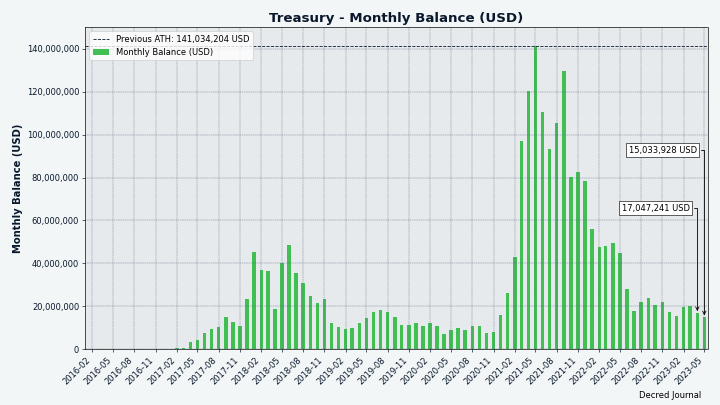
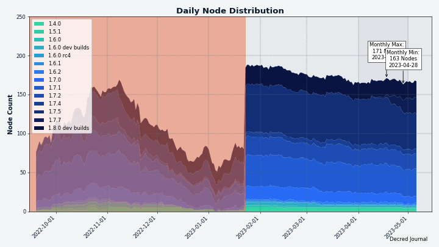
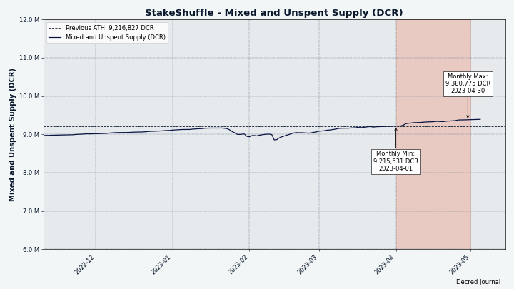
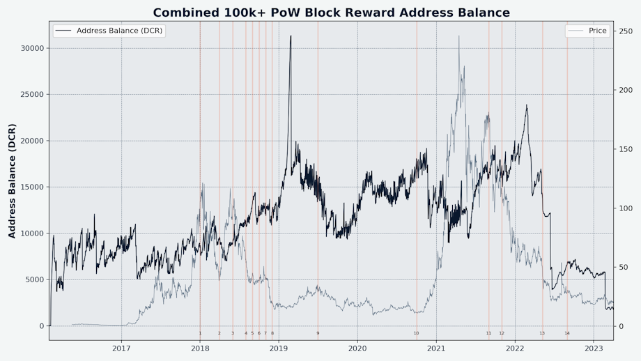

# Decred 月报 – 2023 年 4 月

_图片: @Exitus_

四月亮点：

- Decred DEX 进行了大约 8 个月的开发工作见证了一个重要的新版本发布，其中包括 ETH 和 USDC 交易对。

- 核心 Decred 软件的 v1.7.7 已经发布，包含软件优化和错误修复以及允许 Decrediton 用户对个人 TSpends 进行投票的功能。

- 另一个新的 Bison Relay 版本部署了许多对 UX 和入门使用上的改进。

内容：

- [核心软件 v1.7.7 发布](#core-software-v177-release)
- [DCRDEX v0.6.0 发布](#dcrdex-v060-release)
- [Bison Relay v0.1.7 发布](#bison-relay-v017-release)
- [开发进展总结](#development)
- [人员](#people)
- [治理](#governance)
- [网络](#network)
- [生态系统](#ecosystem)
- [外展](#outreach)
- [活动](#events)
- [媒体](#media)
- [市场](#markets)
- [相关外部信息](#relevant-external)

## 核心软件 v1.7.7 发布

[v1.7.7 版本](https://twitter.com/decredproject/status/1648190102802161671) 的亮点：

- **dcrd** 进行了一些优化，以在某些情况下占用更少的带宽和CPU。

- **dcrwallet** 针对 SPV 模式、购票和混合进行了许多错误修复和性能改进。 特别是，这有利于包含许多交易的频繁使用的钱包。

- **Decrediton** 获得了对个人 TSpend 交易的投票，重新设计了在钱包加载时教育用户的启动器视图，重新设计的 Trezor 视图，升级到 DCRDEX v0.6.0 与 ETH 和 USDC 交易，以及一些错误修复。

访问 [GitHub 版本](https://github.com/decred/decred-binaries/releases) 获取完整的更改和下载列表。 一如既往，我们建议在运行前[验证文件](https://docs.decred.org/advanced/verifying-binaries)。

_图片：新的启动器视图 - 在钱包同步时了解 Decred_

## DCRDEX v0.6.0 发布

期待已久的 v0.6 已经交付了大约 8 个月的开发工作。 自 v0.5 以来的主要变化：

- ETH 和 ERC-20 钱包和交易
- 内置比特币现金 (BCH) 和莱特币 (LTC) 轻钱包允许在不运行完整节点的情况下存储和交易资金
- 注册费被忠诚债券取代，可以返还给用户的时间锁定资金
- 能够以仅观察模式连接到 DEX 服务器
- 重新设计的市场和钱包页面，针对各种屏幕尺寸采用不同的布局
- 实验性做市商机器人

其它显着变化：

- 手动对等管理控制
- 发送页面上的费用估算
- 能够禁用现有钱包
- 归档旧订单数据
- 更快速的下单
- 最近的比赛显示在市场页面上
- 在 Electrum 支持、以太坊支持、订单跟踪和展示、错误报告、费用估算、翻译等方面进行了大量改进和修复

DCRDEX的获取途径有3种：

- 作为 [Decrediton](https://github.com/decred/decred-binaries/releases) 钱包的一部分（全部集成，无需运行单独的应用程序，由“Decred Release”密钥签名）
- 来自 [核心软件版本](https://github.com/decred/decred-binaries/releases) 的独立 `dexc` 应用程序（更多 CPU 和操作系统选项，由 `Decred Release` 密钥签名）
- 来自 [DCRDEX 自己的版本](https://github.com/decred/dcrdex/releases) 的独立 `dexc` 应用程序（具有更适合 Windows 的版本，带有系统托盘图标，没有终端窗口，由 DEX 开发人员签名）

请花时间阅读[重要通知](https://github.com/decred/dcrdex/releases/tag/v0.6.0)以了解非托管P2P交易的具体信息。

注意：

- 查看有关 [在 Decrediton 中设置 DEX](https://www.decredmagazine.com/setting-up-dcrdex-0-6-in-decrediton/) 和 [为 LTC、BCH 和 BTC](https://www.decredmagazine.com/setting-up-dcrdex-native-wallets-btc-bch-ltc/)，以及 [@DecredTV](https://www. youtube.com/@DecredTV/videos）。
- 内置的 LTC 钱包在搜索支持紧凑块过滤器的节点时启动速度可能很慢。 用户可以转到 DEX 钱包页面，单击 Litecoin -> 设置 -> 管理节点，然后手动添加一个节点 [从此列表](https://gist.github.com/chappjc/d0f26b12258f8531bb78b37f38d080a0) 以帮助推动流程。
- 做市商机器人可以 [enabled](https://twitter.com/blockchainbuck/status/1655933747064360967) 通过运行带有 `--experimental` 标志的 DEX 客户端并从菜单中选择“做市商”。 一定要调高“oracle weight”。 该机器人有助于增加流动性，但在被认为是实验性的情况下应谨慎使用。

_图片：更新了 DCRDEX v0.6.0 中的交易视图_

_图片：更新了 DCRDEX v0.6.0 中的钱包视图_

## Bison Relay v0.1.7 发布

新版本自 v0.1.6 RC1 发布仅 4 周。 v0.1.7 final 中的显着变化：

- 由于新的预先资助的邀请、基于服务器的预付费邀请和自动钱包设置，改进了入职流程
- 右键单击用户名会打开一个菜单，让小费更容易
- 建议用户与另一个用户交换密钥的按钮（即将一个用户介绍给另一个用户）
- 新帖子的 UI 通知和对现有帖子的新评论
- 在链上发送和接收 DCR（可用于从 Bison Relay 提取 DCR）
- 改进和固定的滚动行为
- 列出所有自己的帖子
- 将文件添加到帖子的更好的用户体验
- 收到的文件可以直接从 BR 打开
- 改进的 macOS 安装程序，应用程序已签名和公证
- 下面的 [Bison Relay](#bison-relay) 开发部分有更多详细信息

在 [GitHub](https://github.com/companyzero/bisonrelay/releases) 上获取最新版本的二进制文件。 Bison Relay 下载现在可以[验证](https://docs.decred.org/advanced/verifying-binaries)，这要归功于由签署 Decred 版本的相同密钥添加的签名（`Decred Release <release@decred.org >` 带有指纹`F516ADB7A069852C7C28A02D6D897EDF518A031D`）。

查看[安装指南](https://www.decredmagazine.com/bison-relay-upgrades-to-version-0-1-7/) 和[小费指南](https://www.decredmagazine.com /oprah-tipping-bot-bisonrelay/) 以避免接收小费的常见问题。 在 [@DecredTV](https://www.youtube.com/@DecredTV/videos) 查找更多 Bison Relay 视频指南。

_图片：Bison Relay v0.1.7_

_图片：奥普拉在Bison Relay中给小费_

## 开发进展总结

除非另有说明，否则下面报告的工作为“合并至核心存储库”状态。这意味着该工作已完成、审查并集成到高级用户可以[构建和运行](https://medium.com/@artikozel/the-decred-node-back-to-the-source-part-one-27d4576e7e1c)的源代码中，但普通用户尚不可用。

### dcrd

_[dcrd](https://github.com/decred/dcrd) 是一个完整的节点实现，为 Decred 在全球的点对点网络提供支持。_

更改反向移植到 [v1.7.7 版本](https://github.com/decred/dcrd/releases/tag/release-v1.7.7)：

- 将 [`peer`](https://github.com/decred/dcrd/commit/0d375e0738e5995b1c3beb303a654aefe76e4a64) 和 [`addrmgr`](https://github.com/decred/dcrd/commit) 的最低 Go 版本增加到 1.17 模块以启用 Go 工具链优化，例如 [模块图修剪](https://go.dev/ref/mod#graph-pruning) 和 [延迟模块加载](https://go.dev/ref/mod #延迟加载）。 [`peer`](https://github.com/decred/dcrd/tree/8f3e249555544ff8f1991d055da1e910dbd5a88b/peer) 和 [`addrmgr`](https://github.com/decred/dcrd/tree/8f3e249555544ff8f1991d055da1e910dbd 5a88b/addrmgr) 模块 为构建与 Decred 网络对话的软件提供了坚实的基础。
- `peer` 模块使用的点对点 [协议](https://github.com/decred/dcrd/commit/ad501373e203aeff56e8f7f699ab442f8706694e) 的增加版本不再使用 `reject` 消息（我们对此进行了解释） 在 [11 月](202211.md#dcrd) 问题中）。
- 修正缓存其他节点的[库存](https://github.com/decred/dcrd/pull/3074)（小流量优化）。
- 优化了[peer address selection](https://github.com/decred/dcrd/commit/32e98be286deb3104352f81fe8c1147c1f158e29) 并缓解了测试网场景中的 CPU 使用率过高。
- 更新了 [Go 1.20](https://github.com/decred/dcrd/pull/3087) 的代码格式、构建脚本和自述文件。
- 更新到最新的“sys”模块（与操作系统的低级交互）以支持在 OpenBSD 上构建 64 位 [RISC-V](https://en.wikipedia.org/wiki/RISC-V) 处理器 .
- 所有向后移植的更改都已添加到 [release 分支](https://github.com/decred/dcrd/commits/release-v1.7)，而不是仅仅增加 `go.mod` 文件中的模块版本号 . 对于一些开发人员来说，这使得从发布分支构建 [更容易](https://github.com/decred/dcrd/pull/3083)。

更改合并到 `master` 中以用于将来的版本：

- 添加了即将到来的共识投票的定义，以将 [工作量证明哈希](https://github.com/decred/dcrd/pull/3089) 更改为 [BLAKE3](https://en.wikipedia.org /wiki/BLAKE_(hash_function)#BLAKE3) 并[减少 PoW 区块奖励](https://github.com/decred/dcrd/pull/3090)。 这些更改将分别在 [Decred 更改提案](https://github.com/decred/dcps) DCP-11 和 DCP-12 中更正式地记录。 这些定义仅添加基本信息，如投票说明、选择和有效期。 实现真正改变的代码将单独添加。
- 实施了 [DCP-12 共识投票](https://github.com/decred/dcrd/pull/3092)。 如果通过，区块奖励分成将变为 1% PoW、89% PoS、10% Treasury。
- 添加了使用自定义熵源[生成私钥](https://github.com/decred/dcrd/pull/3096) 的功能。 在 dcrd 中具有这样的功能允许从其他 Decred 包中删除重复项。
- 代码重构和清理。
- 几个模块的版本已被修改以启用跨代码库的 Go 模块图修剪。

### dcrwallet

_[dcrwallet](https://github.com/decred/dcrwallet) 是命令行和图形界面钱包应用程序使用的钱包服务器。_

向后移植到 v1.7.7 版本的更改：

- 添加了 [`watchlast` 选项](https://github.com/decred/dcrwallet/pull/2196) 以限制最初观看的地址，这有利于拥有许多旧地址的大型钱包。
- 删除了使用自动购票时不必要的[余额计算](https://github.com/decred/dcrwallet/pull/2203)。 这提高了更活跃钱包的性能。
- 修复了由于票价变化而取消购票的边缘情况，导致某些钱包的交易[未被发现](https://github.com/decred/dcrwallet/pull/2212)。
- 实施了一种更快的方法来[选择随机 UTXO](https://github.com/decred/dcrwallet/pull/2202)（又名“硬币”）用于创建新交易。
- 避免创建 [small mix change](https://github.com/decred/dcrwallet/pull/2218)，这样未混合的账户就不会充满这些太小而无法混合且太诱人而无法一起消费的输出。 “混合找零”是混合交易的特殊输出，当发送到混合中的 DCR 金额未按混合面额[均匀分配](https://math.stackexchange.com/a/58558) 时创建。 例如看[这个混合](https://dcrdata.decred.org/tx/a87479a31814f2f08513df76ea4dcc438de9f12b04bfba89c77dd960db169656)：3.2189 DCR 进入混合，输出包括标准混合面额 0.1678 DCR 的 17 个输出（总计 2.8521 DCR）和 7 个较小尺寸的“更改”输出（总计 0.3666 DCR）。 根据 [mix.decred.org](https://mix.decred.org/)，混音更改不是匿名的，可用于破坏混音的隐私。 dcrwallet 可以通过仔细混合来匿名化此类零钱，但是对于小于 0.00264314 DCR（最小混合面额 0.00262144 DCR 加上默认费用）的零钱输出，则无法做到这一点。 与其创建无论如何都不应该使用的如此小的输出，不如将它们的价值计入交易费用。

更改合并到 `master` 中以用于将来的版本：

- 清理并简化了内部 [VSP 代码](https://github.com/decred/dcrwallet/pull/2227) 的公共 API。 这是整合 [vspd](https://github.com/decred/vspd) 存储库中 VSP 代码的一部分，以便于维护和代码重用。
- 删除了 VSP 客户端的 [票证撤销](https://github.com/decred/dcrwallet/pull/2230) 支持。 这从 VSP 代码中删除了一个重要的依赖项，并且它是不必要的，因为自 [DCP-9](https://github.com/decred/dcps/blob/master/dcp-0009/dcp-0009. 媒体维基）。
- 修复了配置中设置的 [最大 VSP 费用](https://github.com/decred/dcrwallet/pull/2228) 未被遵守且始终被硬编码值 0.2 DCR 覆盖的问题。 此外，VSP 配置验证已移至启动代码，以便更早地报告无效选项。
- 代码维护和 1 个并发修复。

### dcrctl

_[dcrctl](https://github.com/decred/dcrctl) 是 dcrd 和 dcrwallet 的命令行客户端。

- v1.7.7 版本的更新：切换到最新的 GitHub 构建代码、Go 1.20 和最新的 dcrwallet 代码。

### Decrediton

_[Decrediton](https://github.com/decred/decrediton) 是一款功能齐全的桌面钱包应用程序，集成了投票、StakeShuffle 混币、闪电网络、DEX 交易等功能。 它在有或没有完整的区块链（SPV 模式）的情况下运行。_

向后移植到 v1.7.7 版本的更改：

- ~34 [提交](https://github.com/decred/decrediton/compare/release-v1.7.6...release-v1.7.7) 自 [2022 年 11 月](202211.md) 以来进行的所有修复和改进 #decrediton）。
- 更新 [DCRDEX v0.6.0](https://github.com/decred/decrediton/pull/3857)。
- 修复了[发送表单](https://github.com/decred/decrediton/pull/3855) 导致在某些情况下报告或发送错误的 DCR 数量的错误。
- 通过删除不必要的 VSP 信息提取，修复了 [打开钱包](https://github.com/decred/decrediton/pull/3846) 时的延迟。
- 修复了流程托管/非托选票证视图上的 [加载状态](https://github.com/decred/decrediton/pull/3846) 并为它们添加了测试。 这些视图有助于确保所有选票都在 VSP 注册并支付了费用。
- 修复了 DEX 窗口中的 [ETH 显示为不受支持](https://github.com/decred/decrediton/pull/3861)。 发布 [二进制文件](https://github.com/decred/decred-binaries/releases/tag/v1.7.7) 已快速重建以包含此修复。

请参阅 [发行说明](https://github.com/decred/decred-binaries/releases/tag/v1.7.7#decrediton-v177)，了解自 v1.7.6 以来所有更改的摘要。

### vspd

_[vspd](https://github.com/decred/vspd) 是投票服务提供商使用的服务器软件。 VSP 代表其用户全天候 24/7 投票，不能窃取资金。_

- 从 dcrd 和 dcrwallet 更新到最新的 [Decred 模块](https://github.com/decred/vspd/pull/378)。
- 代码维护。

### Lightning Network

_[dcrlnd](https://github.com/decred/dcrlnd)是Decred的闪电网络节点软件。 LN 使即时和低成本交易成为可能。_

- 从上游 lnd 向后移植了一个 [更改](https://github.com/lightningnetwork/lnd/pull/5047) 以带来 [与帐户相关的功能](https://github.com/decred/dcrlnd/pull/178 )（导入账户、导入单个公钥、列出账户等）。 除此之外，还添加了一些其他功能：创建额外的钱包帐户、导出个人私钥以及花费特定的 UTXO。 这些更改的目标是允许用户创建一个帐户，从中可以提取个人私钥然后使用。 这在 Bison Relay 中用于为预付费邀请提供资金。
- 从 dcrd 和 dcrwallet 更新到最新的 [Decred 模块](https://github.com/decred/dcrlnd/pull/179)。
- 添加了 RPC 请求以获取有关属于 LN 钱包的 [交易](https://github.com/decred/dcrlnd/pull/180) 的信息。

### cspp

_[cspp](https://github.com/decred/cspp) 是一个使用 CoinShuffle++ 协议协调硬币组合的服务器。 它是非托管的，即从不持有任何资金。 CSPP 是 Decreds 隐私系统 StakeShuffle 的一部分。_

- 项目负责人 Jake Yocom-Piatt 报告说 [点对点混合](https://twitter.com/exitusdcr/status/1655095852392935425) 最终将取代目前协调混合的中央服务器。

### DCRDEX

_[DCRDEX](https://github.com/decred/dcrdex) 是一种非托管的、尊重隐私的交易所，用于无信任交易，由原子交换提供支持。_

v0.6.0 版本中包含的客户端更改：

- 如果 Web 服务器的地址是 [IPv6 地址](https://github.com/decred/dcrdex/pull/2287)，则不将其放入内容安全策略 (CSP) HTTP 标头。 这是针对 [Safari 错误](https://bugs.webkit.org/show_bug.cgi?id=201591) 的解决方法的修复，该错误导致一些图标 [未加载](https://github.com/decred/dcrdex/issues/1652) 正确。
- 修复了计算以太坊交易确认时的潜在整数 [溢出](https://github.com/decred/dcrdex/pull/2285)。
- 一些较小的修复。

下面的所有其他更改都合并到 `master` 中以用于将来的版本。

用户：

- [连接失败](https://github.com/decred/dcrdex/pull/2288) 到钱包时显示通知。
- 如果未在配置中指定，则默认使用 [`127.0.0.1`](https://github.com/decred/dcrdex/pull/2283) IPv4 地址。 这有助于满足[内容安全策略](https://developer.mozilla.org/en-US/docs/Web/HTTP/CSP) 协议的要求，同时也解决了 Safari 中的错误。 新的默认设置避免了某些 [图标](https://github.com/decred/dcrdex/issues/1652) 由于 CSP 故障而无法正确加载的问题。
- 总是显示市场的[最近的交易](https://github.com/decred/dcrdex/pull/2307)。 以前最近的交易列表在某些情况下被清除，例如重新启动客户端。
- 即使订单框折叠，也显示 [订单率](https://github.com/decred/dcrdex/pull/2281)。 费率（价格）是必须可见的重要信息，无需单击以展开订单详细信息。
- 从一些 UI 元素中删除了多余的 [trailing zeroes](https://github.com/decred/dcrdex/pull/2278) 并提高了数字格式的整体一致性。
- 在页面重新加载时记住最后选择的 [蜡烛尺寸](https://github.com/decred/dcrdex/pull/2284)。 默认蜡烛大小从 5 分钟更改为 1 小时。
- 跟踪[兑换交易](https://github.com/decred/dcrdex/pull/2049) 的确认，并在必要时重试。 这解决了一个边缘情况，当内存池太满以至于支付较低费用的交易被清除并且从未被开采时。 此类交易必须稍后重试，可能会收取更高的费用。
- 为 v0.6.0 添加了 [发行说明](https://github.com/decred/dcrdex/pull/2276)。
- 固定市场 [价格](https://github.com/decred/dcrdex/pull/2280) 在左侧边栏上不同步。
- 修复了在客户端市场初始化之前可能出现的服务器[通知](https://github.com/decred/dcrdex/pull/2286) 的处理。
- 修复了在 Decrediton 中运行时 [shutdown](https://github.com/decred/dcrdex/pull/2325) 期间的错误。
- 修复了 ~2 个较小的 UI 错误。

以太坊：

- 显示更有意义的 [Walle 类型](https://github.com/decred/dcrdex/pull/2207)，例如由第 3 方数据提供商提供支持的 ETH 钱包的“RPC”和 USDC 钱包的“以太坊代币”。
- 更新了 [文档](https://github.com/decred/dcrdex/pull/2289)：删除了正在关闭的 ArchiveNode.io 提供程序，建议不要使用 Flashbots.net，添加了钱包恢复提示。
- 重构了 [轮换债券](https://github.com/decred/dcrdex/pull/2275) 的代码，以更轻松地集成 ETH 债券。
- 更改为向 [所有 RPC 提供程序](https://github.com/decred/dcrdex/pull/2266) 广播交易，而不是仅向一个首选提供程序广播。 这应该有助于确保交易快速传播并被挖掘。
- 在与钱包设置相关的表格中添加了[配置指南链接](https://github.com/decred/dcrdex/pull/2261)。 此外，将为 RPC 提供程序显示两个输入字段，而不是一个。 重要的是用户要了解提供者的失败可能导致资金损失，并配置 2 个或更多提供者以始终有后备。
- 添加了一个开发人员工具，用于获取以太坊上 DEX 关键操作的 [gas 估算](https://github.com/decred/dcrdex/pull/2050)。 它将有助于添加新的代币或新的合约版本。

Litcoin：

- 从 [ltcd](https://github.com/ltcsuite/ltcd/pull/25) 移植 [交易大小修复](https://github.com/decred/dcrdex/pull/2299) 以处理一些异常大的问题 隔离见证交易。
- 为 DCRDEX 编写的一些 MimbleWimble [解码器代码](https://github.com/ltcsuite/ltcd/issues/17#issuecomment-1201877368) 已 [采用](https://github.com/ltcsuite/ltcd/issues /17#issuecomment-1506234416) 在 [ltcd](https://github.com/ltcsuite/ltcd/pull/31) 中！

Zcash：

- 为 Zcash 替换了 [已弃用的地址方法](https://github.com/decred/dcrdex/pull/2237) 的用法。 这需要 zcashd v5.4.2 或更新版本。
- 为屏蔽池添加了[初始](https://github.com/decred/dcrdex/pull/2317) [基础设施](https://github.com/decred/dcrdex/pull/2250)，Zcash 功能启用 私人余额和交易。 Zcash 隐私集成的第一阶段将仅限于屏蔽/取消屏蔽自己的资金，以及从自己屏蔽的地址发送到任意屏蔽或透明地址。 最初只有透明地址会参与交换活动。
- 修复了代码库中 [Zcash](https://github.com/decred/dcrdex/pull/2300) 的拼写问题。

DigiByte：

- DigiByte 交换已在 [主网](https://github.com/decred/dcrdex/pull/1993#issuecomment-1487571640) 上进行了测试，DGB 支持已 [合并](https://github.com/decred/ dcrdex/pull/1993) 并且[计划](https://github.com/decred/dcrdex/pull/1993#issuecomment-1511304826) 即将发布的 v0.6.1。
- 运行 DigiByte 全节点是目前唯一的选择，因为它基于 Bitcoin Core v0.17 并且没有 [紧凑型过滤器](https://github.com/decred/dcrdex/issues/1992#issue-1486990539) 支持 （因此 DEX 无法为 DGB 实现轻型内置钱包）。 Bitcoin Core v22 功能的重大升级 [正在进行中](https://github.com/DigiByte-Core/digibyte/pull/63)，因此这可能会在未来发生变化。
- 对于某些背景，DGB 社区成员早在 2022 年 11 月就表达了兴趣，并且一直活跃在 [Twitter](https://twitter.com/dgb_ycagel/) 和 DEX 的 [GitHub](https://github.com/decred/dcrdex/pull/1993#issuecomment-1459097459)。 @chappjc 创建了一个[补丁](https://github.com/DigiByte-Core/digibyte/pull/102)，提高了 DigiByte 节点在测试网上的性能，以促进开发。 2023 年 3 月，Decred 利益相关者批准 DGB 集成作为最新 [DEX 开发提案](https://proposals.decred.org/record/ca6b749) 的一部分。
- 请注意，此阶段只是 DCRDEX 中的软件支持，启动和运行 DGB 市场是一项 [单独](https://github.com/decred/dcrdex/pull/1993#issuecomment-1456932743) 任务。

服务器：

- 删除了配置 [DCR 注册费用](https://github.com/decred/dcrdex/pull/2293) 的服务器启动要求，并删除了与 DCR 费用严格相关的代码。 由于能够用 DCR 以外的资产支付注册费，这个旧代码已经过时了。 现在，随着向忠诚债券的过渡，多资产注册费支持本身已被弃用，但仍将保留一段时间。
- 修复了启动 [余额检查](https://github.com/decred/dcrdex/pull/2312) 错误，该错误可能会错误地取消预订订单。

其他：

- 在幕后进行了许多不那么令人兴奋但必要的更改，以更顺利地添加新资产，例如代码重构、清理、构建代码优化等。
- 上面列出的一些 [修复](https://github.com/decred/dcrdex/pull/2323) 将被移植到即将发布的 v0.6.1 版本。
- Umbrel 整合已经完成。 Decred 的 Umbrel 社区应用程序商店已 [更新](https://github.com/decred/umbrel-app-store/pull/3) 包含最新的 Docker 映像，包括 DEX v0.6.0 版本。 Umbrel 安装链接已 [添加](https://github.com/decred/dexweb/pull/34) 到 [dex.decred.org](https://dex.decred.org/)。 最后，Umbrel 上的 DEX v0.6 版本已经在 Twitter 上[宣布](https://twitter.com/decredproject/status/1648439889678192640)。
- [建议](https://twitter.com/chappjc/status/1645982431571329024) 莱特币节点运营商将其节点升级到 v0.21 并启用紧凑型块过滤器。 目前内置的 SPV 钱包很难找到它的第一个节点，因为没有那么多公共全节点提供紧凑型过滤器。 DCRDEX 用户可以通过从 [此列表](https://gist.github.com/chappjc/d0f26b12258f8531bb78b37f38d080a0) 手动添加对等节点来解决此问题。

进行中：

- [DCR 质押](https://github.com/decred/dcrdex/issues/2264) 直接在 DEX 钱包中。 这引发了从 dcrwallet [提取更多 VSP 代码](https://github.com/decred/vspd/pull/382) 到 vspd 存储库的努力，以使其更易于重用。
- 做市商机器人。 这是一项涉及[命令行界面](https://github.com/decred/dcrdex/issues/2304)、[测试框架](https://github.com/decred/dcrdex/issues)等任务的巨大努力，模拟各种市场条件，[交易绩效监控](https://github.com/decred/dcrdex/issues/2306)，[隔离机器人的余额](https://github.com/decred/dcrdex/pull/2332），等等。
- [套利机器人](https://github.com/decred/dcrdex/pull/2005)。 这两个机器人都是最近 [DEX 机器人提案](https://proposals.decred.org/record/8b1ceda) 的一部分。
- 将 DEX 打包为 [桌面应用程序](https://github.com/decred/dcrdex/pull/1957)。 这会将 GUI 包装在 [WebView](https://github.com/webview/webview) 中，这样 DEX 就像一个普通的桌面应用程序一样，有自己的窗口、任务栏/托盘图标、通知等，这样用户就不会 不再需要在常规浏览器中加载应用程序。 这是[打包提案](https://proposals.decred.org/record/ae7c4fe) 的一部分。 
- [polygon集成](https://github.com/decred/dcrdex/issues/2319)（[客户端开发提案](https://proposals.decred.org/record/ca6b749) 的一部分）。 Polygon 是以太坊的第 2 层扩展解决方案，具有更快的执行速度和更低的费用。 以前称为 Matic Network（MATIC 代币）。
- 新版本的 ETH [交换智能合约](https://github.com/decred/dcrdex/pull/2038) 有可能显着 [降低费用](https://github.com/decred/dcrdex/ 拉/1426）。
- 以 [ETH](https://github.com/decred/dcrdex/pull/2223) 资助的忠诚债券。
- 整合 [Firo](https://github.com/decred/dcrdex/pull/2270) 的初步研究已经开始。 Firo 以前称为 Zcoin。

_图片：DigiByte 即将登陆 DCRDEX_

_图片：Umbrel 是获取 DCRDEX 的另一种方式_

### decred.org

_[dcrweb](https://github.com/decred/dcrweb) 是 [decred.org](https://decred.org/) 网站的源代码。_

- [v1.7.7 版本](https://github.com/decred/dcrweb/pull/1115) 的更新。

### Bison Relay

_[Bison Relay](https://github.com/companyzero/bisonrelay) 是一个新的社交媒体平台，由 Decred 闪电网络提供强大的审查、监视和广告保护。_

社区首先在 Release Candidate 1 中测试了新功能，其中发现了一些在 v0.1.7 final 中修复的错误。

v0.1.7 中 GUI 和 CLI 应用程序的常见更改：

- 添加了进度跟踪和自动 [重试发送 DCR 提示](https://github.com/companyzero/bisonrelay/pull/176)。

v0.1.7 中的 GUI 应用更改：

- 添加了一个菜单命令 [建议](https://github.com/companyzero/bisonrelay/pull/182) 一个用户与另一个用户进行密钥交换。 这允许通过调解他们的密钥交换将两个用户连接在一起。
- 使[接收的文件](https://github.com/companyzero/bisonrelay/pull/190) 具有交互性：每个文件都有一个指示其类型的图标，单击该文件将使用操作系统中配置的程序打开它。
- 添加了工具提示，解释共享内容时的 [Cost](https://github.com/companyzero/bisonrelay/pull/196) 字段（这是用户为下载内容支付的价格）。
- 在聊天、用户列表、提要或发表评论等各个地方[右键单击](https://github.com/companyzero/bisonrelay/pull/198) 用户名时添加上下文菜单。 这使用户可以更快地访问小费和其他操作。
- 改进了 [在帖子中嵌入文件](https://github.com/companyzero/bisonrelay/pull/203) 的用户体验。 一些用户未能按“+”按钮添加文件，导致帖子没有图像。 令人困惑的 `+` 按钮已被删除，现在只需一个操作即可添加文件。
- 添加了一个页面，列出了所有 [自己的帖子](https://github.com/companyzero/bisonrelay/pull/204)。
- 添加了[预付邀请](https://github.com/companyzero/bisonrelay/pull/191)。 导入此类邀请后，其 DCR 将自动为受邀用户的 Bison Relay 钱包提供资金。
- 添加了钱包账户管理（创建和列出账户）和[使用链上发送和接收 DCR](https://github.com/companyzero/bisonrelay/pull/191)（不是 LN）交易的能力。 有了这个 BR 可以作为一个简单的 DCR 钱包，成为继 Decrediton 和 DCRDEX 之后第三个积极支持的 GUI 钱包。
- 添加了 [基于服务器的邀请](https://github.com/companyzero/bisonrelay/pull/194)（也称为基于 RV 的邀请），避免了交换邀请文件的需要。 相反，邀请被推送到服务器，其下载由发件人预付费用。 接收用户可以在没有任何资金支付服务器的情况下获取这样的邀请。 如果邀请中有任何 DCR，则可以兑换以引导新用户的钱包使用 Bison Relay。
- 使用基于服务器的邀请添加了自动 [入职流程](https://github.com/companyzero/bisonrelay/pull/197)。 如果给定适当的预付费邀请密钥，它会执行所有钱包设置任务。 任务包括：获取邀请、赎回资金、打开出站和入站 LN 通道，以及与创建邀请的用户执行初始密钥交换。
- 修复了在使用 Enter 键发送且光标不在行尾时插入不需要的 [newline](https://github.com/companyzero/bisonrelay/pull/195)。 还修复了空消息的发送。
- 修复了一些不响应 [Enter 键](https://github.com/companyzero/bisonrelay/pull/198) 的输入表单，它通常会提交表单。
- 修复并改进了聊天[滚动行为](https://github.com/companyzero/bisonrelay/pull/207)。 新消息将不再导致滚动到底部和丢失滚动位置。 离开并返回聊天后，它将像在 Element 中一样滚动到底部。 滚动到第一条未读消息已添加。
- 修复了使用[查询路由](https://github.com/companyzero/bisonrelay/pull/200) 功能检查是否存在到 Bison 中继服务器使用的 LN 节点的有效路由时的错误消息。

在 v0.1.7 Release Candidate 1 中发现并在 v0.1.7 final 中修复的 GUI 应用程序问题：

- 为新帖子和现有帖子的新评论添加了[通知](https://github.com/companyzero/bisonrelay/pull/217)。 如果有未读条目，主侧边栏上的图标会改变，Feed 条目将被标记为“新帖子”或“新评论”，新评论将以粗体显示，直到用户点击离开帖子。
- 更新了适用于 macOS 和 Windows 的 [图标](https://github.com/companyzero/bisonrelay/pull/218)，将应用程序名称从“bruig”更改为“bisonrelay”。
- 修复了 [New Post](https://github.com/companyzero/bisonrelay/pull/210) 按钮导航到错误页面的问题。
- 修复了 [图标](https://github.com/companyzero/bisonrelay/pull/220) 在黑暗模式下很难看到的问题。
- 修复了“聊天”选项卡表现得像 [用户还没有联系人](https://github.com/companyzero/bisonrelay/issues/211) 并显示初始邀请提示，直到应用程序与网络同步。 这已被加载地址簿时的加载动画所取代。

CLI 应用程序在 v0.1.7 中的变化：

- 为 `/channels` 命令添加了一个选项以显示 LN 通道的 [附加信息](https://github.com/companyzero/bisonrelay/pull/208)。
- 修复了在“请求接收容量”视图中路径为空时尝试加载 TLS 证书的问题。
- 更新了[构建脚本](https://github.com/companyzero/bisonrelay/pull/209) 并删除了 ZKC（Bison Relay 的前身）的剩余部分。

更改合并到 `master` 中以用于将来的版本：

- 修复了使用 `/ln channels` 命令列出 [LN 通道](https://github.com/companyzero/bisonrelay/pull/222) 余额时 CLI 应用程序可能崩溃的问题。
- 为新帖子和新评论通知更新了 GUI 应用程序 [样式](https://github.com/companyzero/bisonrelay/pull/225)。

其它：

- 小费机器人 Oprah 将[发送消息](https://matrix.to/#/!GHnoHXSgkVAsUknRUg:decred.org/$FKG9OTiG-WZO7vRl_-VhS9ST_EhvjpWOLeQjs9qvcyc?via=decred.org&via=matrix.org&via=zettaport.com) 发送提示失败时的用户。 这样，小费接收者将收到有关其接收渠道问题的通知。
- 现有的公共群聊将升级以支持多个管理员并使用新的入职管理机器人。 此类房间的成员应升级到 v0.1.6 或更高版本。
- 新的 [admin bot](https://matrix.to/#/!GHnoHXSgkVAsUknRUg:decred.org/$X75ujNeIVZdUSDf2HUwdlIzbXVzYsfKj-HnkWMJwpZk) 将通过帮助新用户发现公共频道并自动邀请他们来进一步简化入职，消除等待 手动邀请。
- 在入职工作之后，开发人员计划在 [页面、商店和移动应用程序] 上工作 =matrix.org&via=zettaport.com）。

_图片：Bison Relay 现在可以用作简单的 DCR 钱包_

_图片：在 Bison Relay 中给用户小费变得更容易了_

_图片：友好的机器人有助于发现公共聊天_

### 其它

- Decred 自己的 [release](https://github.com/decred/release) 构建工具获得了 [build flavors](https://github.com/decred/release/pull/90)，它将被 DCRDEX 构建使用 与 Windows 系统托盘集成。 添加了对 [64 位 ARM 上的 OpenBSD](https://github.com/decred/release/pull/88) 的支持。 [64 位 ARM 上的 Windows](https://github.com/decred/release/commit/542b45cf593c8c6dbfa1d2d92e67bf7c21e36f0e) 已被探索但由于一个依赖项尚不支持而被删除。
- [decred-release](https://github.com/decred/decred-release) 自动安装程序已更新为 v1.7.7 版本的散列和签名。
- [dcrtest](https://github.com/decred/dcrtest/pull/11) 集成测试框架已 [更新](https://github.com/decred/dcrtest/pull/11) 到最新的 Go 模块 来自 dcrd。
- 在可重现的构建 [session](https://matrix.to/#/!zefvTnlxYHPKvJMThI:decred.org/$qjda4fjr5oQaDICsfnfhSRMmmoJtYx67zBrrRQqzyrk?via=decred.org&via=matrix.org&via=planetdecred.org) 期间，开发人员遇到了 v1.7.7 版本 DCRDEX 的 `go-ethereum` 构建不匹配，结果证明是 [“一个编译器错误”](https://github.com/golang/go/issues/59500)（这是一项相当大的成就 遇到编译器错误！）和 Go 构建代码中的另一个 [错误](https://github.com/golang/go/issues/59525)。 调查将发布推迟了几天，最终这两个错误都得到了修复，修复将在 Go 1.21 和 Go 1.20.4 中发布。

## 人员

欢迎新的首次贡献者：

- Jay（[Decred 杂志](https://www.decredmagazine.com/author/jay/) 作者，Twitter 上的 [@h3la1](https://twitter.com/h3la1)）

祝贺 [@norwnd](https://github.com/norwnd) 获得 Decred 承包商许可！

截至 5 月 3 日的社区统计数据（与 4 月 3 日相比）：

- [Twitter](https://twitter.com/decredproject) 关注者：53,077 (-112)
- [Reddit](https://www.reddit.com/r/decred/) 订阅者：12,701 (+23)
- [Matrix](https://chat.decred.org/) #general users: 763 (+2)
- [Discord](https://discord.gg/GJ2GXfz) 用户：1,573 (+17)，已验证发帖：921 (-2)
- [Telegram](https://t.me/Decred) 用户：2,508 (-111)
- [YouTube](https://www.youtube.com/decredchannel) 订阅者：4,630 (+0)，观看次数：228.1K (+1.6K)

## 治理

4 月，新[国库](https://dcrdata.decred.org/treasury) 收到 7,958 DCR，价值 161,000 美元，4 月的平均汇率为 20.22 美元。 3,087 DCR 用于支付承包商费用，按 4 月份的平均汇率计算价值 62,000 美元。

[国库支出 tx](https://dcrdata.decred.org/tx/5aa2142e4dce72d28fb3cef3e7d1b565a90655304fdd284016fb585cc96431e9) 以 6,900 票赞成票和 54% 的投票率获得批准，并于 4 月 16 日开采。从 7 DCR 至 1,102 DCR。 大部分 DCR 可能是为 2 月份的工作支付的，以其 24.03 美元的计费汇率计算，TSpend 价值约 74,000 美元。

截至 5 月 9 日，[旧国库](https://dcrdata.decred.org/address/Dcur2mcGjmENx4DhNqDctW5wJCVyT3Qeqkx) 和 [新国库](https://dcrdata.decred.org/treasury) 的合并余额为 856,305 DCR（1450 万美元） 汇率 16.96 美元。

_图片：DCR 中减少的国库余额_

_图片：以美元计的国库余额减少_

4 月份提交了 2 项新提案：

- [Decred Vanguard](https://proposals.decred.org/record/0a1b782) 是一项新计划，旨在为社区驱动的外展团队提供资金，预算为 46,784 美元。 参与者将有多达 25 个带薪职位，每月可获得 100 美元，以及来自 Vanguard 团队内外的良好贡献的 100 美元奖励。

- 德国加密货币新闻网站 BTC-ECHO 提交了一份 [提案](https://proposals.decred.org/record/49e373b)，要求为 2 篇赞助文章和相关促销活动提供 9,500 美元，为期 3 个月。

@jy-p 的 [提案](https://proposals.decred.org/record/a8501bc) 改变奖励分配，使 PoW 矿工仅获得 1%，哈希算法的改变以 97% 的赞成票和投票率获得批准 62%。 @bee [编译](https://github.com/decredcommunity/proposals/blob/master/proposals/a8501bc/qna.md) 来自对提案高度活跃的评论的最常见问题和答案。 实施 DCP-12 更改所需的开发工作已经 [合并](https://github.com/decred/dcrd/pull/3092) 掌握。

来自 @joegruff 的 [提案](https://proposals.decred.org/record/609db9e) 以 89% 的赞成票和 39% 的投票率批准了开发 Decrediton 对 Ledger 硬件的支持。

有关本月提案的更多详细信息，请参阅 Politeia Digest [第 59 期](https://blockcommons.red/politeia-digest/issue059/)。

## 网络

4 月的新 ATH：

- 抵押 DCR：9,882,748.69 DCR
- 混合和未使用的 DCR：9,380,774.51 DCR
- 闪电网络节点：192
- 闪电网络通道：392
- 闪电网络容量：163.63 DCR

**全网算力**：4 月的[全网算力](https://dcrdata.decred.org/charts?chart=hashrate&scale=linear&bin=day&axis=time) 以 ~94 Ph/s开启，以 ~76 Ph/s结束，最低为 62 Ph/s，整个月达到 94 Ph/s 的峰值。

_图片：Decred 全网算力

5 月 1 日各矿池 72 Ph/s 算力的分布 [报告](https://miningpoolstats.stream/decred)：Poolin 64%，F2Pool 30%，AntPool 6%，CoinMine 0.3%。

截至 5 月 1 日实际 [开采](https://miningpoolstats.stream/decred) 1,000 个区块的分布：Poolin 63%，F2Pool 28%，AntPool 6%，BTC.com 2.5%，CoinMine 0.2%。

_图片：历史矿池算力分布_

**质押**：[选票价格](https://dcrdata.decred.org/charts?chart=ticket-price&axis=time&visibility=true-true&mode=stepped) 在 236-253 DCR 之间变化。

_图片：4月票价异常稳定_

[锁定数量](https://dcrdata.decred.org/charts?chart=ticket-pool-value&scale=linear&bin=day&axis=time) 为 9.75-988 万 DCR，这意味着 64.6-65.3% 的循环供应量 [ 参与](https://dcrdata.decred.org/charts?chart=stake-participation&scale=linear&bin=day&axis=time) 在权益证明中。

_图片：锁定在票中的DCR正在爬行_

**VSP**：[14 家列出的 VSP](https://decred.org/vsp/) 共同管理了约 6,960 (-240) 张现场门票，截至截至目前，占门票池的 17.1% (-0.5%) 5月1日。

4 月份最大的赢家是 vspd.bass.cf（+165 张门票或 +27%）。 两个 VSP 被 [除名](#ecosystem)。

_图片：由 VSP 管理的工单分布_

**节点**：[Decred Mapper](https://nodes.jholdstock.uk/user_agents) 在整个月内观察到 163 到 171 个 dcrd 节点。 5 月 1 日看到的 166 个节点的版本：v1.7.5 - 28%、v1.7.1 - 21%、v1.8.0 dev builds - 13%、v1.7.2 - 12%、v1.7.7 - 11%、v1.7.0 - 5%，v1.7.4 - 4%，其他 - 7%。

_Image：历史dcrd版本分布，数据来自nodes.jholdstock.uk。 2023年1月之前的数据不完整。_

[混合硬币](https://dcrdata.decred.org/charts?chart=coin-supply&zoom=jz3q237o-la8vk000&scale=linear&bin=day&axis=time&visibility=true-true-true) 的份额在 61.0-61.8% 之间变化。 每日 [混合交易量](https://dcrdata.decred.org/charts?chart=privacy-participation&bin=day&axis=time) 在 303-502K DCR 之间变化。

_图片：混合供应正在上升_

_图片：根据 Coin Metrics 的定义，在 DCR 和 USD 中 [“调整后的交易量”](https://coinmetrics.io/introducing-adjusted-estimates/) 上升_

Decred 的 [Lightning Network](https://ln-map.jholdstock.uk/) explorer 已经看到 196 个节点（+21），399 个通道（+45），总容量为 163 DCR（+34），截至 5 月 1. 这些统计数据对于每个节点都是不同的。 例如，@karamble 的节点在 5 月 1 日同一天报告了 193 个节点（+18）、429 个通道（+53）和 174 个 DCR（+39）容量。

根据来自 1ML.com 的 [Litecoin LN 数据](https://1ml.com/litecoin/)，Decred 的 LN 在节点数和通道数方面已超过 Litecoin LN，并且在容量方面正在接近。

_图片：Decred 的闪电网络正在看到更多节点_

@bochinchero 创建的图表显示 [顶级挖矿地址的余额](https://github.com/bochinchero/decred-pub/blob/main/MiningRewardBalance/MiningAddresses.md) 与 DCR 的价格历史和关键事件（如 ASIC 发布日期和 CEX） 列表。 虽然它本身没有提供太多分析或评论，但它有助于集体研究矿工参与恶意打压 DCR 市场的情况，这是最近 [proposal](https://proposals.decred.org/) 的关键论点 record/a8501bc) 将挖矿奖励降低到 1% 并更改挖矿算法。

_图片：前 22 个挖矿地址的综合余额与 DCR 历史价格_

## 生态系统

获得或列出的服务：

- 新的 DCR/USDC、BTC/USDC 和 ETH/BTC 交易对在 [dex.decred.org](https://dex.decred.org/)。 创建 ETH 和 USDC 钱包和交易需要 DEX 客户端版本 0.6.0 或更高版本。

- [Bison Relay](https://bisonrelay.org/) 已被 [添加](https://github.com/decred/dcrweb/pull/1114) 到 [社区](https://decred.org/ community/) 链接在 decred.org。

- [Trocador.app](https://trocador.app/) 已被 [添加](https://github.com/decred/dcrweb/pull/1124) 到 [交易所](https://decred.org /exchanges/)，它是一个元交换器，可以从各种服务中找到报价，然后通过他们的 API 为用户提供服务。 它在没有 JavaScript 和 Tor 的情况下工作（他们甚至有一个 Onion URL）。 Trocador 的一个有用功能是它评估了每个后端提供商在事后强制执行 KYC/AML 的可能性。 这是即时交易的最大风险，而不是直接的诈骗。 此外，如果后端提供商出于某种原因未能发送资金或无法提供证明其合理性的法律命令证明，Trocador 可能会偿还部分兑换金额。 [2023 年 2 月](https://twitter.com/TrocadorApp/status/1625487712601112576) 中列出了 DCR。

_图片：Trocador.app 找到最优惠的价格，与供应商隔离，并警告 KYC 风险_

服务丢失或除名：

- VSP [dcrpool.ibitlin.com](https://dcrpool.ibitlin.com) 已从 [VSP 列表](https://github.com/decred/dcrwebapi/pull/173)[删除](https://github.com/decred/dcrwebapi/pull/173)自2月28日下线后，上次报4张live tickets。 该 VSP 自 2021 年 1 月开始服务，投票了约 1,200 张票，失误率为 0.75%。 费用为选票奖励的 1%。

- VSP [dcrvsp.dittrex.com](https://dcrvsp.dittrex.com) 已从 [VSPs](https://decred.org/vsp/) 中删除，最后一次在线查看是在 4 月 4 日，当时有 2 现场选票。 GitHub 上的所有者 [澄清](https://github.com/decred/dcrwebapi/pull/175) VSP 即将停用。 它自 2021 年 4 月开始服务，投了大约 500 张票，仅漏掉了 0.6%。 这个有 5% 的费用。

- [Metal Pay](https://github.com/decred/dcrweb/pull/1124) 已从 [Exchange](https: //decred.org/exchanges/)，它禁用了 DCR 的买单，如 [3 月号](202303.md#ecosystem) 中所述。

- [GloBee](https://globee.com/) 已从 [Exchanges](https://decred.org/exchanges/)移除. 一个由门罗的 fluffypony 等人创立的支付处理商，现已下线。 我们在其 [Twitter](https://twitter.com/GlobeeCom) 或其他地方找不到任何关闭公告。 该网站的最后一个快照是在 [1 月](https://web.archive.org/web/20230131111854/https://globee.com/) 制作的。

- [dcrstats.com](https://dcrstats.com/) 从四月初左右开始下线，它是 Decred 早期流行的网络统计仪表板。

其他消息：

- Bittrex 已被[收费](https://reason.com/2023/04/19/sec-sues-crypto-exchange-bittrex-shortly-after-it-announces-its-leaving-u-s-markets/) 美国证券交易委员会经营未注册的证券交易所。 这是在 [3 月](202303.md#ecosystem) 宣布 Bittrex 离开美国市场后不久。 到目前为止，我们还没有看到任何信息表明它可能会影响 [Bittrex Global](https://global.bittrex.com/trade/dcr-usdt) 的非美国用户。

即将 [更改](https://matrix.to/#/!lDZCzVQjFoJsXMPkvr:decred.org/$jO-Hc1bk0SGjON0JrJvLwzLNeF6pzg-bAgwXT5lv-BA) 到 Decred 的 [聊天平台](https://decred.org/community/)：

- 除了 Matrix 和 Bison Relay 之间的桥，所有聊天桥都被关闭了。
- Discord 可能会被完全关闭。 如果没有桥接内容，它可能会变成一座鬼城，如果没有足够的版主观看，它就会被垃圾邮件发送者或诈骗者接管。
- [Decred](https://t.me/Decred) Telegram 将继续按照相同的规则照常运行，但没有桥接（由于大量交易，它在 2021 年被 [disabled](202112.md#outreach) 垃圾邮件）。
- [Decred Trading](https://t.me/DecredTrading) Telegram 更名为 [Bison Time](https://t.me/BisonTime)，Decred 品牌已被删除。
- [Decred Support](https://t.me/DecredSupport) Telegram 已解锁、锁定，现在仅重定向至 Matrix #support。
- Matrix 上的 [#trading](https://matrix.to/#/!lDZCzVQjFoJsXMPkvr:decred.org/) 将遵守与其他聊天室相同的审核规则。
- Matrix 上的 [#support](https://matrix.to/#/!xUNvyzkFgiMjhvPbIi:decred.org/) 成为开发人员主动监控的*唯一*聊天。 所有支持请求[将被重定向](https://matrix.to/#/!xUNvyzkFgiMjhvPbIi:decred.org/$oC3cXW1RvLqONPyIiqOBm1Oo5tMTbbQ3ndntruO8aTw) 到这个矩阵聊天。

加入我们的 [#ecosystem](https://chat.decred.org/#/room/#ecosystem:decred.org) 聊天以获取有关 Decred 服务的更多新闻。

警告：Decred Journal 的作者不知道上述任何服务的可信度。 在将您的个人信息或资产委托给任何实体之前，请自行研究。

## 外展

Monde PR的成就：

- 发布了 1 条新闻公告
- 提供 6 次媒体机会

获得以下媒体展示位置：

- [Invezz](https://invezz.com/news/2023/04/17/decred-announces-dcrdex-0-6-with-support-for-ethereum-and-usdc-swaps/) 中的一篇文章关于 推出 DCRDEX 0.6。 这篇文章被联合到 5 家出版物，包括 [Bitcoin Insider](https://www.bitcoininsider.org/article/212399/decred-announces-dcrdex-06-support-ethereum-and-usdc-swaps)。
- [CoinJournal](https://coinjournal.net/news/decred-launches-dcrdex-0-6-the-latest-version-of-its-decentralized-exchange/) 中关于 DCRDEX 0.6 发布的文章。 该文章被联合到 3 个出版物，包括 [Crypto News BTC](https://cryptonewsbtc.org/2023/04/17/decred-launches-dcrdex-0-6-the-latest-version-of-its-decentralized- 交换/）。
- @jy-p 出现在 [Entangled Things Podcast](https://www.entangledthings.com/all-episodes/episode/7bef6428/quantum-and-cryptocurrency-with-jake-yocom-piatt) 中谈论威胁 量子计算到加密货币。
- @jy-p 出现在 [MineYourBiz Show](https://www.youtube.com/watch?v=aTaEul34RsA) 上，谈论 Decred 项目的当前状态及其新的隐私功能。

## 活动

**即将到来:**

- @arij 和 @khalidesi 将作为访客和 Decred 代表前往 [GITEX AFRICA](https://www.gitexafrica.com/home)。 这是 5 月 31 日至 6 月 2 日在摩洛哥马拉喀什举行的大型科技活动。如果有人计划参加或有建议，请加入 Matrix [#events](https://chat.decred.org/#/room/# 事件：decred.org）聊天。

## 媒体

**精选文章：**

- [Decred 提供社会问题的解决方案？](https://www.decredmagazine.com/decred-offers-solutions-to-society-problems/)  @Joao
- [Decred 挖矿发展](https://www.decredmagazine.com/decred-mining-evolves/) @OfficialCryptos
- [Decred vs Dash：所有人的治理！](https://www.decredmagazine.com/decred-vs-dash/)  @Joao
- [Decred 价格暴涨的 5 大原因](https://www.decredmagazine.com/top-5-reasons-decreds-price-will-explode/)  @Jay
- [选择的悖论：在图灵完备和非图灵完备区块链之间做出决定](https://www.decredmagazine.com/the-paradox-of-choice-deciding-between-turing-complete-and-non-turing -complete-blockchains/) @BlockchainJew
- [DAO 治理的投票机制和激励机制](https://mirror.xyz/0x34ddd9223D9DDb6B56F640824Af6FCC31e1deBF4/T6AUZv8Rn5rlGS9xxQNVzh7QPoo8h2CCWIwU_OYpJmk) Arhat - DAO 治理研究，作者已[更正](https://twitter.com/0xArhat/status /1650753877430468608) Decred部分回应反馈
- [跨界对话！ 今天来自 DigiByte 社区的 Jose Trejo](https://www.decredmagazine.com/inter-community-talk-today-with-jose-trejo-from-the-digibyte-community/) @Joao - 第一次谈论 Decred Magazine 作者将采访其他加密社区成员的系列

> 无论结果如何，明年左右都会是一段有趣的旅程。 如果你来这里是为了密码朋克的理想（创新、权力下放、非监管解决方案和发展），那么你很难不对未来充满热情。 \[[@OfficialCryptos](https://www.decredmagazine.com/decred-mining-evolves/)\]

Decred Magazine 4 月份的参与度统计数据：

- 关于 DM 的文章总数：444
- 时事通讯订户：96
- 发送的新 DM 帖子和时事通讯：16
- 活跃的社交媒体活动：46
- 完成的社交媒体活动：38
- 社交媒体帖子：212
- 喜欢：1,230
- 转发：260
- 所有平台和账户（包括 [@DecredSociety](https://twitter.com/DecredSociety)）的社交媒体粉丝：1300

**视频:**

- [Decred 回顾 - 挖矿变更、新补贴拆分、Cointelegraph 提案、大量开发更新！](https://www.youtube.com/watch?v=xW4JzxjYKww) @Exitus - 也作为 [播客](https ://podcasters.spotify.com/pod/pod/show/decred-magazine/episodes/Decred-Recap---Mining-Change--New-Subsidy-Split--Cointelegraph-Proposal--tons-of-Dev- 更新-e21jks5)
- [Decrediton 质押 - 以简单的方式购买门票](https://www.youtube.com/watch?v=oaRTDuNVF4Y) @phoenixgreen - 也作为[文本帖子](https://www.decredmagazine.com/ decrediton-staking-buying-tickets-the-easy-way/)
- [Oprah 打赏机器人 - BisonRelay](https://www.youtube.com/watch?v=6uSFttopNnk) @phoenixgreen - 也作为 [文本帖子](https://www.decredmagazine.com/oprah-tipping -bot-bisonrelay/)
- [在 Decrediton 中设置 DCRDEX 0.6](https://www.youtube.com/watch?v=6LCxuCSstGo) @phoenixgreen - 也作为[文本帖子](https://www.decredmagazine.com/setting- up-dcrdex-0-6-in-decrediton/)
- [设置 DCRDEX 本机钱包（BTC、BCH 和 LTC）](https://www.youtube.com/watch?v=7eioER2lWmI) @phoenixgreen - 也作为 [文本帖子](https://www. decredmagazine.com/setting-up-dcrdex-native-wallets-btc-bch-ltc/)

> 使用 Bison Relay，您不再是产品。 您的内容和意见一直具有货币价值，但这里的主要区别在于价值属于创作者，而不是平台。 \[[@phoenixgreen](https://www.youtube.com/watch?v=6uSFttopNnk)\]

现场直播：

- [Decred - 砖化 ASIC 和 P2P 社交媒体讨论专长。 Dave Collins 和 Jake Yocom-Piatt](https://www.youtube.com/watch?v=ZZmq7NVqYBA)@phoenixgreen 和@Exitus 加入@jy-p 和@davecgh - 也作为[播客](https: //podcasters.spotify.com/pod/show/decred-magazine/episodes/Decred---Bricking-ASICs-and-P2P-Social-Media-discussion-feat--Dave-Collins--Jake-Yocom-Piatt- e21qf1e)
- [#Decred 到底是什么以及它如何保护#PRIVACY？](https://www.youtube.com/watch?v=aTaEul34RsA) MineYourBiz 壮举。 @jy-p

**声音的：**

- [Jake Yocom-Piatt 的量子和加密货币](https://www.entangledthings.com/all-episodes/episode/7bef6428/quantum-and-cryptocurrency-with-jake-yocom-piatt) 作者：Patrick Hynds 和 Ciprian Jichici - Entangled Things 播客中的一集，讨论加密标准和量子计算对区块链的威胁。 在 [Apple 播客](https://podcasts.apple.com/us/podcast/quantum-and-cryptocurrency-with-jake-yocom-piatt/id1552714727?i=1000607276017)、[Buzzsprout](https://entangledthings.buzzsprout.com/1617373/12580449-quantum-and-cryptocurrency-with-jake-yocom-piatt）和其他平台。

**翻译：**

- [为什么 Decred 不兼容 EVM？](https://www.decredmagazine.com/why-is-decred-not-evm-compatible/) - [中文](https://github.com/DominicTing/decred-ZH-translations/blob/master/Why%20is%20Decred%20not%20EVM%20compatible%3F.md）@Dominic
- [选择的悖论：在图灵完备和非图灵完备区块链之间做出决定](https://www.decredmagazine.com/the-paradox-of-choice-deciding-between-turing-complete-and-non-turing-complete-blockchains/) - [中文](https://github.com/DominicTing/decred-ZH-translations/blob/master/The%20Paradox%20of%20Choice:%20Deciding%20Between%20Turing%20Complete%20and %20Non-Turing%20Complete%20Blockchains.md) @Dominic
- Decred Journal 2 月至 3 月共有 3 种新的 [翻译](https://xaur.github.io/decred-news/) 阿拉伯语（@arij、@abdulrahman4）、中文（@Dominic）和波兰语（@ 科泽尔）。 谢谢你们！

**非英语内容：**

- [克罗地亚语 Decred 概述](https://www.youtube.com/watch?v=xlQH09pzmDw) @FIMA

**讨论：**

- Bison Relay [帖子](https://twitter.com/exitusdcr/status/1642750459890008065) 关于如何使用 Twitter 上的垃圾关注者帐户来降低目标帐户的可见性
- 关于 [硬币中心化] 的讨论(https://www.reddit.com/r/decred/comments/12d8ake/one_entity_owns_2m_dcr_bad_or_good/)
- Decred [pitch](https://twitter.com/0x69b9/status/1649089557927804928) 由 0x69b9

**其他：**

- 比特币杂志上的 [Decred 标签页](https://bitcoinmagazine.com/tags/decred) 不见了。 上次[看到](https://web.archive.org/web/20220119175419/https://bitcoinmagazine.com/tags/decred) 有 4 篇文章。 [直接链接](https://bitcoinmagazine.com/business/decred-sets-its-sights-decentralization-2018) 应该仍然有效。

## 市场

4 月，DCR 在 USDT 17.91-25.18 和 BTC 0.00061-0.00089 之间交易。 平均每日费用为 20.22 美元。

_图片：以美元为单位的 DCRDEX 月交易量_

## 相关外部信息

比特币 Ordinals 继续增长，到目前为止已铸造超过 250 万个，单日峰值达到 223K，将每日比特币交易量增加到自 2017 年以来的最高水平。最近的 Ordinals 活动大部分围绕新的BRC -20系列铸造可替代代币的标准。

以太坊的 Shapella 升级已在主网上激活，允许持有 ETH 的 ETH 持有者最终将其从抵押合约中取出。

USDC 稳定币的发行人 Circle发布了一种在区块链之间转移资产的新方法的详细信息，无需“锁定和铸币”桥，这已被证明是黑客的一个重要目标——他们称之为“跨链”传输协议”或 CCTP。

加密货币交易所 Bittrex 被美国证券交易委员会指控违反证券法。该指控将6 种代币列为 Bittrex 应该注册交易的证券：OMG Network (OMG)、Dash (DASH)、Algorand (ALGO)、Monolith (TKN)、NAGA (NGC) 和 IHT Real Estate Protocol (IHT)。将 DASH 命名为证券被认为反映了一种特别激进的立场，Dash 开发由区块奖励资助，并且没有（官方）预挖。

Coinbase 继续努力与美国证券交易委员会合作，并通过起诉美国证券交易委员会试图迫使其公开其标准并澄清其决定来澄清他们如何定义加密证券。

加里·金斯勒 (Gary Gensler)出席了国会听证会，他在听证会上回答了有关 SEC 方法的一些问题，但没有回答 ETH 是否被归类为证券。他还发布了一段新视频，以他标志性的居高临下的风格，将加密证券与模仿金鱼的狗进行了比较。

欧洲议会以 90% 的赞成票和 97% 的投票率投票赞成加密资产市场 (MiCA) 许可制度，为它在 2024 年成为整个欧盟的法律铺平了道路。虽然这些法规受到欢迎由于行业的明确性，许多加密隐私爱好者对使用混合服务将导致资金被标记为高风险感到失望。与此同时，议会投票赞成资金转移监管，该监管要求加密货币运营商将其客户识别为反洗钱步骤——最终投票数字为 92% 的赞成票，98% 的符合条件的欧洲议会议员投票。

James Zhong 被发现拥有超过 50,000 BTC，他通过同时提出取款请求从丝绸之路骗取，被判处有期徒刑一年零一天，并没收所有 BTC 和相关产品他用它购买的资产，包括一家有限责任公司房地产控股公司、金银和卡萨修斯硬币。

这就是四月的全部内容。在我们的[#journal](https://chat.decred.org/#/room/#journal:decred.org)聊天室中分享您对下一期的更新。

## 关于月报

这是 Decred 月报的第 58 期。 [此处](https://xaur.github.io/decred-news/) 提供所有问题、镜像和翻译的索引。

来自第三方的大多数信息都是在经过最低限度的健全性检查后直接从源头转发的。 Decred 月报的作者无法验证所有声明。请提防诈骗并自行研究。

感谢（字母顺序）：

- 写作、编辑、出版：bee、bochinchero、Exitus、jz、karamble、l1ndseymm、phoenixgreen、richardred
- 评论和反馈：chappjc、davecgh
- 标题图片：Exitus
- 资金：Decred 利益相关者

## 中文社区

* [微博](https://www.weibo.com/DecredProject)
* [微信公众号](https://mp.weixin.qq.com/mp/profile_ext?action=home&__biz=Mzg2NTExNzc3MA==&scene=124#wechat_redirect)
* [bilibili频道](https://space.bilibili.com/425519478)
