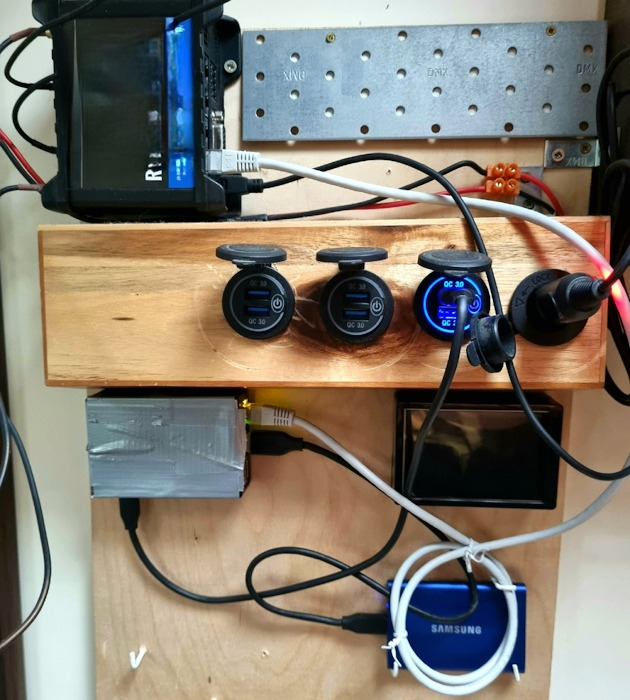

# Decred 月报 – 2023 年 5 月

_图片: 赛博风暴 @Exitus_

五月亮点：

- DCRDEX v0.6.1 已发布，提供 DigiByte 支持和针对 LTC 和 ZEC 的重要修复。

- Decred Vanguard 提案获得批准，社区驱动的社交媒体推广计划已经启动。

- Bison Relay 一直在取得进展，新版本的页面以及商店的商家工具都将被合并。

内容：

- [DCRDEX v0.6.1 发布](#DCRDEX v0.6.1 发布)
- [开发进展总结](#开发)
- [人员](#人)
- [治理](#治理)
- [网络](#网络)
- [生态系统](#生态系统)
- [外展](#外展)
- [活动](#活动)
- [媒体](#媒体)
- [市场](#市场)
- [相关外部信息](#相关外部信息)

## DCRDEX v0.6.1 发布

此版本具有以下特点：

- 初始 DigiByte (DGB) 支持（需要同时运行的全节点钱包）
- 针对莱特币 (LTC) 和 Zcash (ZEC) 的重要修复
- 订单列表中的订单费率现在更容易查看
- 现在会记住图表蜡烛尺寸，默认尺寸更改为 1 小时

获取最新的 DEX 客户端作为 [独立应用程序](https://github.com/decred/dcrdex/releases)，或作为 [Decrediton](https://github.com/decred/decred-binaries/releases) 的一部分，或从 Decred 的自定义 [Umbrel App Store](https://github.com/decred/umbrel-app-store) 安装它。 与往常一样，我们建议在运行之前[验证文件](https://docs.decred.org/advanced/verifying-binaries)。

## 开发进展总结

除非另有说明，否则下面报告的工作为“合并至核心存储库”状态。这意味着该工作已完成、审查并集成到高级用户可以[构建和运行](https://medium.com/@artikozel/the-decred-node-back-to-the-source-part-one-27d4576e7e1c)的源代码中，但普通用户尚不可用。

### dcrd

_[dcrd](https://github.com/decred/dcrd) 是一个完整的节点实现，为 Decred 在全球的点对点网络提供支持。_

已合并到未来版本的“master”中：

- 通过[删除错误状态](https://github.com/decred/dcrd/pull/3110)清理了[几个函数](https://github.com/decred/dcrd/pull/3114)。
- [去年八月](202208.md#dcrd)，为了对抗测试网的 ASIC 攻击并确保 CPU 始终能够挖掘新的测试网区块，[测试网已更新](https://github.com/ decred/dcrd/pull/2978)，以便测试网挖掘难度被最大值限制。 本月，挖掘模板生成器和 CPU 挖掘器已更新为[删除旧的测试网逻辑](https://github.com/decred/dcrd/commit/c6e53c9ef0926f172a637a6552b744cbd6445537)，该逻辑不再适用，因为所有新的测试网块都强制执行难度限制 。
- [删除了已弃用的内部方法](https://github.com/decred/dcrd/pull/3113)，其中列出了等待区块链更新的订阅客户端。 由于此方法是内部方法，因此不需要在 dcrd 外部共享。
- [通过 dcrdata 发现了一个错误](https://github.com/decred/dcrdata/issues/1963)，其中从 dcrd RPC 服务器返回的总代币供应量计算不包括新的 `TreasuryBases` - 的一部分 每个区块的奖励流入新的去中心化金库。 总代币供应量计算[现已更新](https://github.com/decred/dcrd/pull/3112)，其中还包括对数据库的更新。 需要注意的是，这个错误只是 RPC 币供应量计算中的一个小错误，不会以任何方式影响共识。

进行中：

- 实施 [DCP-11](https://github.com/decred/dcrd/pull/3115) PoW 哈希共识投票。

### dcrwallet

_[dcrwallet](https://github.com/decred/dcrwallet) 是命令行和图形界面钱包应用程序使用的钱包服务器。_

向后移植的为下一个 v1.7.x 版本做好准备：

- 尊重 SPV 和 P2P 播种器连接的 [代理配置](https://github.com/decred/dcrwallet/commit/7fbdd7fba71525149bf7a98dc7f8033f34a1e108)。 这是为了防止泄露内部网络详细信息。

更改已合并到未来版本的“master”中：

- 使用多个 [dcrd 模块](https://github.com/decred/dcrwallet/pull/2234) 和一些第三方 [依赖项](https://github.com/decred/dcrwallet/pull/2236) 的最新版本。
- 如果钱包获得批准并激活，则允许钱包[遵循 DCP-12 硬分叉](https://github.com/decred/dcrwallet/pull/2232)。
- 删除了几个[已弃用的内部方法](https://github.com/decred/dcrwallet/pull/2235)，即那些因共识变更而过时的方法[DCP-9](https://github.com/decred/ dcps/blob/master/dcp-0009/dcp-0009.mediawiki）（自动票证撤销）和 [DCP-10](https://github.com/decred/dcps/blob/master/dcp-0010/dcp- 0010.mediawiki）（将 PoW/PoS 补贴比例更改为 10/80）。

### Decrediton

_[Decrediton](https://github.com/decred/decrediton) 是一款功能齐全的桌面钱包应用程序，集成了投票、StakeShuffle 混币、闪电网络、DEX 交易等功能。 它在有或没有完整的区块链（SPV 模式）的情况下运行。_

进行中：

- [Ledger支持](https://github.com/decred/decrediton/issues/3865)：添加[初级功能](https://github.com/decred/decrediton/pull/3869)和[UI 视图](https://github.com/decred/decrediton/pull/3874)。
- 由于目前无法使用任何硬件钱包进行质押，因此质押界面将被[删除](https://github.com/decred/decrediton/pull/3870)以避免混淆。
- 在 pi-ui 共享库中添加了 [Ledger 图标](https://github.com/decred/pi-ui/pull/479)。

其他：

- Decrediton 已[添加](https://github.com/microsoft/winget-pkgs/pull/106493)到[winget](https://en.wikipedia.org/wiki/Windows_Package_Manager)包存储库。 Windows 用户现在可以使用“winget install Decred.Decrediton”[安装](https://matrix.to/#/!zefvTnlxYHPKvJMThI:decred.org/$25tEa195uFjzuxC0J9ecm7X8NRGUAhcrUqNvuUKfHqM?via=decred.org&via=matrix.org&via=planetdecred.org) `。

### vspd

_[vspd](https://github.com/decred/vspd) 是投票服务提供商使用的服务器软件。 VSP 代表其用户全天候 24/7 投票，不能窃取资金。_

- 将[自动VSP费用支付](https://github.com/decred/vspd/pull/382)从dcrwallet复制并调整到vspd存储库。 该代码在 dcrwallet 中是私有的，但在 vspd 中可以被其他软件使用，这些软件将被 DCRDEX 中的 [DCR 质押](https://github.com/decred/dcrdex/pull/2290) 集成所利用。

### Lightning Network

_[dcrlnd](https://github.com/decred/dcrlnd)是Decred的闪电网络节点软件。 LN 使即时和低成本交易成为可能。_

- 添加了对 dcrwallet 的[自定义连接](https://github.com/decred/dcrlnd/pull/182)的支持。 它允许 LN 代码将 dcrwallet 配置为使用代理服务器连接到 SPV 对等点。

### cspp

_[cspp](https://github.com/decred/cspp) 是一个使用 CoinShuffle++ 协议协调硬币组合的服务器。 它是非托管的，即从不持有任何资金。 CSPP 是 Decreds 隐私系统 StakeShuffle 的一部分。_

- 在混合过程的早期防止[重复输入](https://github.com/decred/cspp/pull/92)。 在此修复双花发送混合交易时会触发错误之前，它可能会导致混合失败。
- 改进了混合的[日志记录](https://github.com/decred/cspp/pull/93)，以始终捕获混合输出的会话 ID、运行编号和面额值。
- 防止 CoinJoin 交易[超出内存池大小限制](https://github.com/decred/cspp/pull/94)。 这可能会从混合中排除一些对等体，如果发生这种情况，服务器将尝试在下一个混合时期将它们配对。 添加了一项检查，以便在对等点数量[低于最小值](https://github.com/decred/cspp/pull/95) 设置时重试会话。

### DCRDEX

_[DCRDEX](https://github.com/decred/dcrdex) 是一种非托管的、尊重隐私的交易所，用于无信任交易，由原子交换提供支持。_

v0.6.1 版本中包含的更改：

- 设置足够高的[Zcash交易费率](https://github.com/decred/dcrdex/pull/2336)。 DEX 根据交易规模计算费用，但 Zcash 是一个例外，因为它目前使用每笔交易 1,000 zats 或 0.00001 ZEC 的标准费用，无论规模大小。 当 [ZIP 317](https://zips.z.cash/zip-0317) 激活时，这种情况将会改变，从而导致更高的费用。 为了确保 DEX 交易始终被转发和挖掘，这一变化将费用提高到 0.0002-0.0003 ZEC 左右。 84 zats/字节的硬编码费率被用作 Zcash 没有简单方法来估算费用的解决方法。
- 添加了 [DigiByte](https://github.com/decred/dcrdex/pull/2323) 全节点钱包交易支持。
- 添加了ZEC交易的[区块浏览器](https://github.com/decred/dcrdex/pull/2340)链接。
- 添加了 [间隔](https://github.com/decred/dcrdex/pull/2339) 的编译时间选项，DEX 服务器轮询新的类比特币资产块。 它允许对远程节点使用较慢的轮询，其中默认的 1 秒间隔太快。
- 修复了在某些情况下无法重新配置断开连接的类似比特币的钱包的问题。
- 修复了类似比特币的钱包总是需要重新启动并且没有机会进行实时重新配置的问题。
- 修复了在某些更改 RPC 连接配置的情况下未触发完全重启的问题。
- 修复了发送 ZEC 时显示的不正确的 [交易 ID](https://github.com/decred/dcrdex/pull/2342)。
- 修复了 ZEC 和非 SegWit 资产的 [bonds](https://github.com/decred/dcrdex/pull/2343) 的几个问题。
- 向后移植了 5 月份之前在“master”中制作的 ~22 个[修复和改进](https://github.com/decred/dcrdex/pull/2323)。

以下所有其他更改都将合并到未来版本的“master”中。

用户：

- 在匹配界面中添加了预期的[退款时间](https://github.com/decred/dcrdex/pull/2042)。 以前它可能会在几个小时内显示令人困惑的“<Pending>”。
- 自动化更多钱包[启用/禁用步骤](https://github.com/decred/dcrdex/pull/2324)。 禁用链的主要资产钱包也会禁用该链的所有代币钱包。 启用代币钱包也将启用链的主要资产钱包。
- 通过最小化加载用户信息的昂贵调用来优化[请求处理](https://github.com/decred/dcrdex/pull/2350)。
- 恢复了对标准输出的 HTTP 请求的[彩色日志记录](https://github.com/decred/dcrdex/pull/2350)。
- 在 SPV 模式下利用外部[费率来源](https://github.com/decred/dcrdex/issues/2354)。 在此更改之前，从 SPV 钱包发送时可能需要支付不合理的高额费用。
- 删除了取消订单时输入密码的要求(https://github.com/decred/dcrdex/pull/2374)。

比特币：

- 修复了[问题](https://github.com/decred/dcrdex/pull/2326)：simnet钱包可能会尝试连接到主网，类似比特币的钱包总是需要重新启动，重新配置断开连接的钱包在某些情况下可能会失败 。

以太坊：

- 将[代币批准](https://github.com/decred/dcrdex/pull/2349)作为一个单独的手动步骤，而不是第一次交换的自动部分。 为了交易代币（例如 USDC），互换合约必须获得批准才能代表用户处理代币。 使其成为手动操作可以让用户了解正在发生的事情，并且不会对首次交换的高额费用感到惊讶。 稍后可以在钱包设置中撤销批准。

Firo：

- 添加了对[Firo](https://firo.org/)（以前称为Zcoin）的[全节点钱包](https://github.com/decred/dcrdex/pull/2270)支持。
- 接下来是对基于 Electrum 的 Firo [轻钱包](https://github.com/decred/dcrdex/issues/2346) 的支持。

应用程序包装：

- 引入了一个新的可执行文件“dexc-desktop”，它将 DEX Web 应用程序包装在 WebView 组件中，看起来像一个[桌面应用程序](https://github.com/decred/dcrdex/pull/1957)。 如果有活动订单，应用程序将继续在后台运行（但可以使用命令行上的“--kill”开关强制关闭）。
- 添加了构建 [Debian 软件包](https://github.com/decred/dcrdex/commit/ca5b1d8914b8d84bdfa4cbe28a6c97f5a20c18c4) 的脚本。

开发者和内部变化：

- 更新了 [npm 依赖项](https://github.com/decred/dcrdex/pull/2321)。
- 将[做市](https://github.com/decred/dcrdex/pull/2320)机器人逻辑从“Core”包移至其[自己的包](https://github.com/decred/dcrdex/tree/ca5b1d8914b8d84bdfa4cbe28a6c97f5a20c18c4/)。 这是改进架构并在未来添加更多机器人策略所必需的。
- 启用 [makezero](https://github.com/decred/dcrdex/pull/2344) linter 来检测内存分配中的更多错误。
- 更新了构建和测试工作流程以添加 [Node.js](https://github.com/decred/dcrdex/pull/2341) v20 并删除 v16。 Node.js v16 将于 2023 年 9 月终止生命周期。
- 更干净地将链提示和对等跟踪 goroutine 更改为 [shutdown](https://github.com/decred/dcrdex/pull/2369)。

_图片：DEX 的交换合约需要一次性批准才能交换您的代币。_

_图片：设置运行 Umbrel 与 DEX 做市商 + 套利。 作者：[@busyLightz](https://twitter.com/busyLightz/status/1654876069101436928)._

### dcrdata

_[dcrdata](https://github.com/decred/dcrdata) 是 Decred 区块链和链下数据（如 Politeia 提案、市场等）的浏览器。_

- 由于未过滤掉侧链和无效输出，修复了[地址余额图表](https://github.com/decred/dcrdata/pull/1962)上的数字略有偏差。

### Bison Relay

_[Bison Relay](https://github.com/companyzero/bisonrelay) 是一个新的社交媒体平台，具有针对审查、监视和广告的强大保护，由 Decred 闪电网络提供支持。_

All work reported below is merged to `master` towards the next release (likely v0.1.8).

GUI and CLI apps:

- Implemented initial version of the [Pages](https://github.com/companyzero/bisonrelay/pull/224) feature. Pages allow to browse static content from a remote user. Only [Markdown](https://www.markdownguide.org/) pages are supported. Pages can link to other users' pages using `br://` links. Limitations of the first iteration are listed in the [pull request](https://github.com/companyzero/bisonrelay/pull/224). Pages is a big feature that will need rounds of improvements in response to user feedback.
- Improved [tip retry](https://github.com/companyzero/bisonrelay/pull/236) strategy. Instead of making multiple parallel attempts at paying tips for one user, only a single one is tried at a time. This should help avoid problems with tip payments failing due to LN nodes with low capacity. Also tip attempts failed for having no LN route will be retried (this error may be temporary). CLI app can list running tip user attempts with the new `/runningtips` command.
- Added ability to connect the embedded dcrlnd through the configured proxy server (such as Tor) to both the [CLI app](https://github.com/companyzero/bisonrelay/pull/235) and the [GUI app](https://github.com/companyzero/bisonrelay/pull/239). New `circuitlimit` config parameter allows to limit the number of [open connections](https://github.com/companyzero/bisonrelay/pull/234) when using proxy.
- Added [handshake feature](https://github.com/companyzero/bisonrelay/pull/246) that allows users to test that their encryption ratchets are still working.
- Implemented [persistent chat history](https://github.com/companyzero/bisonrelay/pull/230) that remembers last 500 messages and shows them after restarting the app. All chats are stored in log files but accessing history from the app itself is better UX and has been a frequent feature request. The plan is to eventually add on-demand loading of history as the user scrolls back in time.
- Fixed possible [broken ratchets](https://github.com/companyzero/bisonrelay/pull/248) when two users simultaneously attempt to exchange keys with each other. This could happen when two users are added to two different group chats where the other user already exists, which initiates two key exchanges at the same time.

GUI app:

- Added [context menu](https://github.com/companyzero/bisonrelay/issues/216) to individual chats and group chats.
- Added a floating button to [jump to recent messages](https://github.com/companyzero/bisonrelay/pull/231).
- Restricted size of [embedded images](https://github.com/companyzero/bisonrelay/pull/244) shown in chats and posts. Bigger image is shown if clicked. This fixes issues with scrolling and different image sizes.
- Fixed some issues with [text selection](https://github.com/companyzero/bisonrelay/pull/226), added height limit to code blocks and made code blocks scrollable. Two Flutter widgets have been forked and patched to work around the issues, but double click (select word) and triple click (select paragraph) still don't work.
- Fixed [scrollbar issues](https://github.com/companyzero/bisonrelay/pull/249) on LN management views.
- Smaller fixes for scrolling and overflow behavior.

CLI app:

- Enabled brclient to delegate Pages and Store requests to [another program](https://github.com/companyzero/bisonrelay/pull/224) via the [clientrpc API](https://github.com/companyzero/bisonrelay/tree/master/clientrpc), and forward its responses back to requesting BR users. This flexibility will enable useful features in the future.
- Enabled brclient to delegate requests to a HTTP or HTTPS [website](https://github.com/companyzero/bisonrelay/pull/224). This allows BR users to access HTTP/HTTPS resources through another BR user who acts as a proxy.
- Sort posts by [most recent activity](https://github.com/companyzero/bisonrelay/pull/243). Also unread posts will be highlighted with a different color.
- Allow to use the `/closechannel` command with a [short prefix](https://github.com/companyzero/bisonrelay/pull/252) of the channel ID (full ID is 64 characters long).

Stores progress:

- Implemented merchant-side foundations for [simple Stores](https://github.com/companyzero/bisonrelay/pull/224). Unlike Pages, Stores are dynamic resources that can present product items for sale. Store has a front page and individual product pages that are generated from local files. Store is reloaded automatically when its files change. BR client running the store can serve product pages, maintain shopping carts, handle order placements, and create invoices. Prices will be shown in USD but paid in DCR. Exchange rate is fetched from [dcrdata](https://explorer.dcrdata.org). DCR amount to be paid is locked for 60 minutes while the order is valid. CLI app only supports on-chain payments.
- Implemented [simple forms](https://github.com/companyzero/bisonrelay/pull/241). Forms can be viewed, filled and submitted by store customers to add items to the shopping cart or to place an order.
- Added [shipping details](https://github.com/companyzero/bisonrelay/pull/250) to orders. Some products may require to fill shipping info.

Other:

- Added end-to-end [performance tests](https://github.com/companyzero/bisonrelay/pull/245).
- @JC made an onboarding event in #trading with a [giveaway](https://matrix.to/#/!lDZCzVQjFoJsXMPkvr:decred.org/$FjC6ZsHaR4GBvlR9-o4E4anuqWwoq1F167CU0QPJmS4) of 20 prepaid invites with 0.05 DCR each.

## People

Community stats as of Jun 2 (compared to May 3):

- [Twitter](https://twitter.com/decredproject) followers: 53,108 (+31)
- [Reddit](https://www.reddit.com/r/decred/) subscribers: 12,723 (+22)
- [Matrix](https://chat.decred.org/) #general users: 774 (+11)
- [Discord](https://discord.gg/GJ2GXfz) users: 1,590 (+17), verified to post: 634 (-287) - Discord was unbridged and got stronger verfication rules
- [Telegram](https://t.me/Decred) users: 2,470 (-38)
- [YouTube](https://www.youtube.com/decredchannel) subscribers: 4,640 (+10), views: 229.6K (+1.5K)

## Governance

In May the new [treasury](https://dcrdata.decred.org/treasury) received 8,088 DCR worth $139K at May's average rate of $17.13. 3,591 DCR was spent to pay contractors, worth $62K at same rate.

A [treasury spend tx](https://explorer.dcrdata.org/tx/5efdb2de7cbea2682d389aa274a1ef79c5996201226054b28e08e286b1809519) was approved with 6,722 Yes votes and 52% turnout, and mined on May 20. It had 23 outputs making payments to contractors, ranging from 4 DCR to 1,464 DCR. Most of this DCR was likely paid for March work, at its billing exchange rate of $20.69 the TSpend is worth around $74K.

As of June 17, combined balance of [legacy](https://dcrdata.decred.org/address/Dcur2mcGjmENx4DhNqDctW5wJCVyT3Qeqkx) and [new treasury](https://dcrdata.decred.org/treasury) is 858,136 DCR (12.1 million USD at $14.08).

Proposals approved in May:

- [Decred Vanguard](https://proposals.decred.org/record/0a1b782) proposal was approved for a budget of $46,784 to fund growth of a community driven outreach program, with 94% Yes votes and turnout of 39%.

- [BTC-ECHO](https://proposals.decred.org/record/49e373b) proposal was approved for a budget of $9,500 for a three month trial with German crypto site [BTC-ECHO.de](https://www.btc-echo.de/) during which they produce two sponsored articles, with 69% Yes votes and turnout of 32%. Prior to the vote it was edited to include additional promotion on their social media and a 2-week ad on their podcast. Second edit clarified that they do not require upfront payment and agree to wait for the payment for up to 60 days after the campaign has ended, in line with how most existing proposals and contractors operate. After the proposal was approved they posted an [update](https://proposals.decred.org/record/49e373b/comments/24) about next steps and the timeline.

Proposals submitted in May:

- [DCRDEX Mesh Beginnings and Bonds Evolution](https://proposals.decred.org/record/4d2324b) requested $164K to develop experimental version of DCRDEX based on a server mesh architecture.

See Politeia Digest [issue 60](https://blockcommons.red/politeia-digest/issue060/) for more details on the month's proposals.

## Network

**Hashrate**: May's [hashrate](https://dcrdata.decred.org/charts?chart=hashrate&scale=linear&bin=day&axis=time) opened at ~74 Ph/s and closed ~66 Ph/s, bottoming at 61 Ph/s and peaking at 88 Ph/s throughout the month.

_Image: Decred hashrate_

Distribution of 67 Ph/s hashrate [reported](https://miningpoolstats.stream/decred) by the pools on Jun 1: Poolin 40%, F2Pool 40%, AntPool 16%, BTC.com 5%.

Distribution of 1,000 blocks actually [mined](https://miningpoolstats.stream/decred) by Jun 1: F2Pool 40%, Poolin 35%, AntPool 17%, BTC.com 8%.

_Image: Historical pool hashrate distribution_

**Staking**: [Ticket price](https://dcrdata.decred.org/charts?chart=ticket-price&axis=time&visibility=true-true&mode=stepped) varied between 173-334 DCR.

_Image: Ticket price made another swing_

The [locked amount](https://dcrdata.decred.org/charts?chart=ticket-pool-value&scale=linear&bin=day&axis=time) was 9.38-9.90 million DCR, meaning that 61.7-65.1% of the circulating supply [participated](https://dcrdata.decred.org/charts?chart=stake-participation&scale=linear&bin=day&axis=time) in Proof of Stake.

**VSP**: The [14 listed VSPs](https://decred.org/vsp/) collectively managed ~6,650 (-310) live tickets, which was 16.8% of the ticket pool (0.3%) as of Jun 1.

_Image: Distribution of tickets managed by VSPs_

**Nodes**: [Decred Mapper](https://nodes.jholdstock.uk/user_agents) observed 147 dcrd nodes on Jun 1 of the following versions: v1.7.7 - 25%, v1.7.1 - 21%, v1.7.5 - 18%, v1.7.2 - 10%, v1.8.0 dev builds - 9%, v1.7.0 - 7%, v1.7.4 - 3%, other - 8%.

_Image: Historical dcrd version distribution, data from nodes.jholdstock.uk. Data before Jan 2023 was incomplete._

The share of [mixed coins](https://dcrdata.decred.org/charts?chart=coin-supply&zoom=jz3q237o-la8vk000&scale=linear&bin=day&axis=time&visibility=true-true-true) varied between 61.8-61.9%. Daily [mixed volume](https://dcrdata.decred.org/charts?chart=privacy-participation&bin=day&axis=time) varied between 143-497K DCR.

_Image: Monthly StakeShuffle volume in USD_

Decred's [Lightning Network](https://ln-map.jholdstock.uk/) explorer has seen 211 nodes (+15), 423 channels (+24) with a total capacity of 176 DCR (+13), as of Jun 1. These stats are different for each node. For example, @karamble's node reported 210 nodes (+17), 446 channels (+17) and 182 DCR (+9) capacity on same day Jun 1.

_Image: Decred's Lightning Network capacity_

And a few new charts from @bochinchero:

_Image: Average block time remains stable at 5 minutes_

_Image: Decred chain is adding ~180 MB per month_

_Image: The full Decred blockchain can fit in modern smartphone's storage_

_Image: Monthly DCR issuance in USD - rewards shifted from miners to stakers and will shift more soon_

_Image: Total monthly fees - Decred is still cheap to use_

There are more charts now than it is feasible to show in the Journal. The above and other charts can be found [here](https://github.com/bochinchero/dcrsnapshots) - reuse on social media is highly encouraged!

## Ecosystem

New services:

- ZEC/BTC and ZEC/USDC pairs have been [launched](https://twitter.com/exitusdcr/status/1654626949837500416) at [dex.decred.org](https://dex.decred.org/).

- DGB/BTC market [went live](https://twitter.com/DecredSociety/status/1657750204852871173). DEX client version 0.6.1 or higher is required, it can be obtained as a [standalone app](https://github.com/decred/dcrdex/releases) or with [Decrediton](https://github.com/decred/decred-binaries/releases) v1.8.0. Only full node-based DGB wallet is supported initially, but built-in light wallet may become possible when DigiByte v8.22 is released.

- Decred's Matrix chat logs can now be viewed [archive.matrix.org](https://archive.matrix.org/) - a new chat archive browser replacing [view.matrix.org](https://view.matrix.org/). The service works without JavaScript and does not require a Matrix account.

Services lost:

- Binance is [leaving Canada](https://www.forbes.com/sites/digital-assets/2023/05/16/binance-exits-canada-over-concerns-of-strict-regulation/) in [response](https://twitter.com/binance/status/1657099651210969088) to recent crypto regulations that prohibit registered exchanges from accepting stablecoin deposits or selling them to the customers without approval from CSA. Other restrictions include a ban on margin trading and investor limits. According to [#trading chat](https://matrix.to/#/!lDZCzVQjFoJsXMPkvr:decred.org/$Ox6W2V_jS33D6X5kOvuX6OU-TPW-8xStJL0QdLzpD8E) customers were asked via email to close any open positions by September 30, 2023.

- Binance plans to [delist 12 privacy coins](https://cointelegraph.com/news/binance-to-delist-privacy-tokens-in-france-italy-spain-and-poland) in France, Italy, Poland and Spain. Starting from June 26, residents of these countries will no longer be able to trade DCR. Binance has recently acquired appropriate [licenses](https://beincrypto.com/binance-privacy-coins-prohibition/) in the affected jurisdictions. The move came soon after the Markets in Crypto Assets (MiCA) has [passed](https://cryptoslate.com/binance-delists-privacy-coins-for-european-users-amid-layoff-rumors/) in the EU on May 16.

- Hotbit [announced](https://twitter.com/Hotbit_news/status/1660496999458963458) it is shutting down operations and asks to withdraw all assets by June 30. DCR trading was available on the main hotbit.io since [October 2019](https://twitter.com/Hotbit_news/status/1186979514741428224) and on its Korean branch since [November 2020](https://twitter.com/Hotbit_Korea/status/1331412789416534017). According to some community members DCR was delisted some time ago and no DCR users should be affected. Reasons to sunset the exchange included: losses from the criminal [investigation](https://help.hotbit.io/hc/en-us/articles/8074249353495), outflow of funds from CEXes, unsustainable business model of trying to list too many coins of which many get hacked, and difficulties to comply with regulation. Quoting the goodbye [announcement](https://help.hotbit.io/hc/en-us/articles/14750194236823-It-s-time-to-take-a-bow): "either embrace the regulation or become more decentralized". We're on it!

Other news:

- Apparently Huobi did not delist DCR as it planned to in September 2022. The announcement page has been removed but an [archived copy](https://web.archive.org/web/20221002130913/https://www.huobi.com/support/en-us/detail/104917015223952) is available. USDT trading pairs for DCR and 6 other privacy coins from that list are still live and report good-looking volumes on CoinGecko and CoinMarketCap as of May 12. Observers from the #trading chat said that DCR has never stopped flowing back and forth between Huobi and Binance.

- Bittrex has filed for [bankruptcy](https://fortune.com/2023/05/08/bittrex-bankruptcy-us-filing-crypto-platform/) in the U.S. and Malta, 3 weeks after it was charged by the SEC for operating an unregistered securities exchange. Both arms have been processing [withdrawals](https://www.coindesk.com/policy/2023/05/10/bittrexs-us-maltese-arms-processed-425m-in-withdrawals-since-april-1-attorney-says/) since April.

- Ledger [announced](https://twitter.com/Ledger/status/1658458714771169282) an upcoming [Ledger Recover](https://www.ledger.com/recover) service. Recover allows to register your ID (CA, EU, UK, US) and backup the wallet seed at trusted third parties. The seed is split into 3 fragments, the fragments are encrypted with a symmetric key and sent to 3 different backup providers. It can be later rebuilt on another Ledger device by verifying ID and getting 2 out of 3 fragments from the providers. Only Ledger Nano X is supported currently. DCR users may want to evaluate the [risks](https://support.ledger.com/hc/en-us/articles/9579368109597-Ledger-Recover-FAQs) of using Ledger in light of this new feature, which has been added in [firmware version 2.2.1](https://twitter.com/alistairmilne/status/1658381708763209729) and *should* be inactive until explicitly enabled. See more detailed coverage in [#ecosystem](https://chat.decred.org/#/room/#ecosystem:decred.org/$LSE8W9g9a4hqu9HN4IIyqWSf6H-LwSjd-xgK8Xie7GQ).

New services discovered but not tested by the community yet:

- [DCR payment option](https://fxdreema.com/purchase) has been [spotted](https://twitter.com/h3la1/status/1653233413200158721) at [fxDreema](https://fxdreema.com/) - a graphical builder of trading bots compatible with MetaTrader 4 and MetaTrader 5.

- [CryptoWallet.com](https://cryptowallet.com/) features a mobile app that allows users to buy and sell crypto, supports VISA/MasterCard/SEPA transfers, and plans to launch own card product. The company is licensed in Estonia. Research and testing help is much appreciated.

Join our [#ecosystem](https://chat.decred.org/#/room/#ecosystem:decred.org) chat to get more news about Decred services.

Warning: the authors of the Decred Journal have no idea about the trustworthiness of any of the services above. Please do your own research before trusting your personal information or assets to any entity.

## Outreach

Decred Vanguard has been [approved](https://proposals.decred.org/record/0a1b782) and started its outreach operations. Vanguard has its own Discord server where members coordinate, develop best approaches and evaluate results. Members make use of Midjourney AI to generate advanced art to help get Decred's message across. Several members acquired Twitter Blue and it seems to be working quite well. Key challenge at this point is recruiting members who are active and productive, this is why the initial monthly stipend is set low at $100. Another challenge is marketing in the bear market. In May no prizes for big/notable engagements have been allocated.

Anyone interested in joining Decred Vanguard should contact [@Tivra](https://twitter.com/WasPraxis) or [@Exitus](https://twitter.com/exitusdcr). If you are new to Decred it's OKAY - you just need to be willing to learn and help out where you can.

> Vanguard really feels like something we needed for years. \[@Exitus\]

_Image: Vanguard's War Room_

Monde PR's achievements:

- Pitched 1 commentary opportunity
- Pitched 7 media opportunities
- Secured 1 media interview

Secured the following media placements:

- @jy-p was interviewed by [Authority Magazine](https://medium.com/authority-magazine/the-future-is-now-jake-yocom-piatt-on-how-their-technological-innovation-will-shake-u-3966dc1adc22) discussing many aspects of Decred including: Decred's origin story, Bison Relay's offering as a sovereign internet, upcoming support for pages and e-commerce stores, Politeia, and Decred's use in Brazil's election.

## Events

**Attended:**

- @arij and @khalidesi attended [EMEC EXPO](https://emecexpo.ma) in Casablanca, Morocco, a big 9K people event dedicated to digital technologies. The team had a stand where they explained Decred features to visitors from various fields, interacted with several Moroccan companies, and met some people who were already familiar with the project. See the full report [here](https://decredcommunity.github.io/events/index/20230511.1).

## Media

**Selected articles:**

- [Decred DEX launches DCRDEX 0.6, offering new levels of privacy and security for cross-chain swaps](https://decred.org/news/2023-04-18_decred_releases_dcrdex_0.6/) - April's press release is now live at decred.org
- [The future is now: Jake Yocom-Piatt of decred.org on how their technological innovation will shake up the tech scene](https://medium.com/authority-magazine/the-future-is-now-jake-yocom-piatt-on-how-their-technological-innovation-will-shake-u-3966dc1adc22) by Authority Magazine feat. @jy-p
- [Decred vs Horizen: Crypto is not enough!](https://www.decredmagazine.com/decred-vs-horizen-crypto-is-not-enough/) by @Joao
- [I don't want your likes](https://www.decredmagazine.com/i-dont-want-your-likes/) by @phoenixgreen

Decred Magazine engagement stats for May 2023:

- Total number of articles on DM: 460
- Newsletter subscribers: 100
- New DM posts and newsletters sent: 16
- Active social media campaigns: 57
- Completed social media campaigns: 41
- Social media posts: 172
- Likes: 1,180
- Re-tweets: 302
- Social media followers across all platforms and accounts (including [@DecredSociety](https://twitter.com/DecredSociety)): 1,350

**Videos:**

- [Completing a Litecoin atomic-swap - DCRDEX 0.6](https://www.youtube.com/watch?v=ajHovJHxtFw) by @phoenixgreen
- [Decred Recap - v1.7.7 improvements, atomic-swap DEX v0.6 - The DAO evolves!](https://www.youtube.com/watch?v=OgupSweE94s) by @Exitus - also as a [podcast](https://podcasters.spotify.com/pod/show/decred-magazine/episodes/Decred-Recap---v1-7-7-Improvements--Atomic-Swap-DEX-v0-6---The-DAO-Evolves-e23hp9k)
- [Bison Relay upgrades to version 0.1.7](https://www.youtube.com/watch?v=wg0k8p3arxI) by @phoenixgreen - also as a [text post](https://www.decredmagazine.com/bison-relay-upgrades-to-version-0-1-7/)
- [Decrediton proposal voting](https://www.youtube.com/watch?v=q18OVd9z-n0) by @phoenixgreen - also as a [text post](https://www.decredmagazine.com/decrediton-proposal-voting/)
- [Bison Relay pre-paid invites](https://www.youtube.com/watch?v=n4_fkpyppws) by @phoenixgreen - also as a [text post](https://www.decredmagazine.com/bison-relay-pre-paid-invitations/)
- [Decred is developing a mesh network for its DEX](https://www.tiktok.com/@decred_crypto/video/7239431067764002074) TikTok by @DajanaDcr and @Exitus

Livestream:

- [State of the Market - Decred Vanguard - A new outreach effort](https://www.youtube.com/watch?v=UDTQFOcva5Q) by @phoenixgreen and @Exitus joined by @Tivra and @h3la1 - also as a [podcast](https://podcasters.spotify.com/pod/show/decred-magazine/episodes/State-of-the-market---Decred-Vanguard---A-New-Outreach-Effort-e23midd)

**Audio:**

- Twitter Space [Decred x Zcash community discussion](https://twitter.com/i/spaces/1vOxwMZYqYWGB) with @Tivra and [ZecHub](https://twitter.com/ZecHub) - also on [YouTube](https://www.youtube.com/watch?v=2RStHBiWNDk)
- [Twitter Space](https://twitter.com/i/spaces/1jMJgLwmPLMxL) with @Tivra and [W0wn3r0](https://twitter.com/W0wn3r0)

**Art and fun:**

- Bison Ordinals [inscription](https://twitter.com/c12hz/status/1656636523448606720) by @c12hz
- [Ascend to Greatness](https://www.decredmagazine.com/ascend-to-greatness/) by @OfficialCryptos
- [Decred Katana](https://www.decredmagazine.com/decred-katana/) by @OfficialCryptos
- [Decred Magazine](https://twitter.com/aithzakaria1/status/1653718235588468737) illustration by @aithzakaria1

_Image: Decred shedding the ballast. By @OfficialCryptos._

**Translations:**

- [Internet privacy and why it is important](https://www.decredmagazine.com/internet-privacy-and-why-it-is-important/) - [in Chinese](https://github.com/DominicTing/decred-ZH-translations/blob/master/Internet%20Privacy%20and%20Why%20it%20is%20Important.md) by @Dominic
- Decred Journal April 2023 was [translated](https://xaur.github.io/decred-news/) to Chinese by @Dominic - thank you!

## Markets

In May DCR was trading between USDT 15.19-20.59 and BTC 0.00056-0.00075. The average daily rate was $17.13.

Community's DCR price analysis posted in the #trading chat:

_Image: Odd price wicks on DCR/USD seem to happen during low correlation with BTC/USD price action. Analysis by @saender._

_Image: Market Valuations (USD) based on Decred-specific Staked Realised Value metric from @bochinchero_

_Image: DCR/USD accumulation zones analysis by @saender_

_Image: DCRDEX monthly volume in USD_

## Relevant External

Ethereum's Beacon chain has been [experiencing](https://www.theblock.co/post/230680/ethereum-beacon-chain-finality-issue) some issues with finality, two episodes where validators mostly stopped proposing attestations for about an hour and nobody is sure why. Transactions on the Ethereum network have been able to continue and so users may have noticed no issues, but behind the scenes the beacon chain which finalizes everything was not working so these transactions were more susceptible to reversion than would have ordinarily been the case. Ethereum core developers [released](https://cointelegraph.com/news/ethereum-s-beacon-chain-is-updated-after-finality-issues) patches for the two clients affected by the issue (Go-based [Prysm](https://github.com/prysmaticlabs/prysm) from Prysmatic Labs and Java-based [Teku](https://github.com/ConsenSys/teku) from ConsenSys), which had been caused by exceptionally high load on the nodes running these clients.

The Dash network and chain stalled on May 22 for 16 hours, due to a [glitch](https://www.dash.org/blog/dash-network-update/) caused by the upgrading the BLS threshold cryptography to an industry standard in v19. The core team produced a quick patch (v19.1) to halt deployment of v19 and this allowed the network to resume after 16 hours of downtime. A fix for the issue and another attempt to deploy the changes will be included in v19.2.

Halborn has [documented](https://www.halborn.com/blog/post/halborn-discovers-zero-day-impacting-dogecoin-and-280-networks) several issues discovered while auditing the Dogecoin codebase, but which also apply to a number of forks of the same Bitcoin lineage, including Litecoin and Zcash. They refer to these as "The Rab13s Vulnerabilities", and the most exploitable ones would allow attackers to take nodes offline, with others allowing remote code execution but only with valid credentials, making exploiting the issue more difficult.

The new BRC-20 token standard for Bitcoin inscriptions (NFTs) which was launched in March has [reached](https://decrypt.co/139357/bitcoin-brc-20-tokens-near-billion-market-cap-exchanges-list-ordi) a combined (notional) market valuation of $1 billion. This milestone was reached after ORDI, the first BRC-20 token, was listed on some major exchanges.

Bitcoin has set a new [record](https://www.msn.com/en-us/money/other/bitcoin-sets-new-daily-transaction-record-amid-ordinals-trend-as-crypto-miners-face-potential-energy-tax/ar-AA1aXUjh) in daily transactions. The trend of minting fungible tokens with the BRC-20 standard is [spreading](https://decrypt.co/140683/meme-tokens-nfts-took-over-bitcoin-now-happening-dogecoin-litecoin) to Litecoin and Dogecoin chains, similarly raising their transaction activity levels.

There has been some [criticism](https://twitter.com/jratcliff/status/1655669410206457865) of the inefficiency of storage of the BRC-20 data on-chain, suggestions that not spending the time to encode data as binary is costing 4x as much in transaction fees. The choice was [apparently](https://twitter.com/hash_bender/status/1655671019498258432) made due to a desire to have the on chain data be human-readable, but there are [suggestions](https://twitter.com/peterktodd/status/1655694148983312387) that using a lot more block space may have been deliberate on the part of the designers.

Taproot Assets v0.2 was [released](https://lightning.engineering/posts/2023-05-16-taproot-assets-v0.2/), adding a set of tools that developers can use on testnet to issue, transfer and discover assets on the Taproot Assets Protocol (formerly Taro). Taproot Assets Protocol is aiming to provide a more scalable way to handle assets on the bitcoin chain by handling most transactions off-chain, as opposed to Ordinal inscriptions which use block space in an inefficient manner and cause a material increase in fees for all users of the network. Version 0.2 adds support for "virtual Partially Signed Bitcoin Transactions" (vPSBTs), which will allow developers to more easily handle Taproot Assets. Lightning network support for assets and stablecoins is one of the big targets for a future release, geared towards use in emerging markets.

Richard Heart's Pulsechain (an Ethereum fork), which is a long anticipated part of the HEX ecosystem, [launched](https://protos.com/richard-hearts-pulse-launch-flops-users-stranded-hex-crashes/), along with "PulseX" decentralized exchange (a Uniswap fork). These launches have been much anticipated by the HEX community, since years before they pivoted to become forks of Ethereum software. However the aim of lowering fees for HEX users does not seem to have been met, because of the lengthy sequence of transactions required to bridge assets to and from Pulsechain. Furthermore, significant liquidity issues made it difficult for users to obtain PLS that they could use to pay gas fees, resulting in many users being stuck without the right kind of tokens to use the network at all and these only being available at extortionate mark-ups. The prices for all the related tokens have been in a steep decline.

DeFi lending protocol AAVE [approved](https://app.aave.com/governance/proposal/224/) and deployed a change to its smart contracts on Ethereum, Polygon and Avalanche networks, the change was intended to adjust interest rate calculations but, due to a function formatting error, broke the protocol on the Polygon chain. User funds worth around $120M were [unavailable](https://www.coindesk.com/tech/2023/05/23/aave-v2-users-temporarily-unable-to-access-120m-on-polygon-after-governance-bug/) while a proposal to fix the error worked its way through the governance process, taking around a week to resolve the issue.

The DAO for development of OFAC-sanctioned ETH mixing service Tornado Cash was [taken over](https://www.coindesk.com/tech/2023/05/21/attacker-takes-over-tornado-cash-dao-with-vote-fraud-token-slumps-40/) by a hacker who granted themselves 1.2 million TORN tokens and used these to approve spends from the DAO's Treasury fund. The code to allow the hack was recently passed within a legitimate-looking proposal which was approved by the usual Tornado DAO governance process. The hack did not affect the Tornado Cash mixer itself, but rather the smart contracts associated with the DAO. After a few days the attacker made a proposal to reset the changes they had made and [return](https://crypto.news/hacker-drops-control-over-tornado-cash-as-they-use-it-to-wash-stolen-funds/) the unspent tokens they had granted themselves, returning control to the DAO after pocketing around $900,000 of ETH mixed through Tornado Cash.

Binance has been compiling lists of "no-progress projects" which it has listed for trade, and has started [adding](https://twitter.com/cz_binance/status/1656231470959063041) them to the "Innovation Zone", on a pathway to delisting if they don't start demonstrating some progress. CZ has already [realized](https://twitter.com/cz_binance/status/1656231889718353921) that this may necessitate a re-naming of the "Innovation Zone".

Bittrex filed for [bankruptcy](https://www.coindesk.com/policy/2023/05/08/us-crypto-exchange-bittrex-files-for-bankruptcy-in-delaware/) in Delaware but with a plan to reimburse all customer asset deposits, with the global Bittrex entity seemingly unaffected.

Silvergate Capital has been [delisted](https://protos.com/crypto-banking-giant-silvergate-is-no-more-following-nyse-delisting/) from NYSE and gone into liquidation. It is the parent company of Silvergate Bank, once the largest crypto banking partner. Silvergate bank was [wound down](https://www.theguardian.com/technology/2023/mar/09/crypto-bank-silvergate-liquidation-sector-turmoil-wind-down-ftx-exchange) in March after a rush of customer withdrawals following the collapse of FTX meant they made a loss of $1 billion in the last quarter of 2022.

Ledger hardware wallet has been recovering from a PR [fail](https://cointelegraph.com/news/ledger-co-founder-clarifies-there-is-no-backdoor-in-recover-firmware-update) of the messaging around a new seed backup feature, [Ledger Recover](https://www.ledger.com/recover). The ex-CEO added fuel to the fire when he addressed concerns about seeds being exported by the new firmware by stating that users were already trusting Ledger to not deploy this kind of backdoor seed-exporting firmware, so he couldn't see the big deal.

The finance ministers of the EU's Council have [signed](https://www.coindesk.com/policy/2023/05/16/eus-crypto-legal-framework-inches-towards-law-with-finance-ministers-sign-off/) off on the Markets in Crypto Assets regulation (MiCA), meaning that its provisions will come into force in June or July 2024. MiCA will require crypto firms to seek licenses to operate in the EU, and sets requirements like reserve holdings for stablecoins. Alongside MiCA some new measures were agreed to mandate sharing of information about crypto holdings of EU citizens with tax authorities.

A supply chain [attack](https://www.kaspersky.com/blog/fake-trezor-hardware-crypto-wallet/48155/) from 2022 with a tampered Trezor device has been documented. The user bought the device from an online marketplace and their crypto disappeared about a month after they started using it. Upon inspection some dodgy firmware had been installed which would cycle between 20 pre-set seeds rather than generating a random seed, and would only use the first character of any password set - so that the device could only generate 1,280 different private keys, a manageable number for the attackers to watch.

Ishan Wahi, the Coinbase manager accused of insider trading to profit from new listings was [sentenced](https://www.coindesk.com/policy/2023/05/09/ex-coinbase-product-manager-sentenced-to-2-years-in-prison-for-insider-trading/) to 2 years in prison after pleading guilty. Wahi provided the information to his brother and another man, who made over $1 million trading on the information. Wahi's brother pleaded guilty in September to conspiracy to commit wire fraud, and was sentenced to 10 months in prison.

That's all for May. Suggest news for the next issue in our [#journal](https://chat.decred.org/#/room/#journal:decred.org) chat room.

## About

This is issue 59 of Decred Journal. Index of all issues, mirrors, and translations is available [here](https://xaur.github.io/decred-news/).

Most information from third parties is relayed directly from the source after a minimal sanity check. The authors of the Decred Journal cannot verify all claims. Please beware of scams and do your own research.

Credits (alphabetical order):

- writing, editing, publishing: bee, bochinchero, Exitus, jz, karamble, l1ndseymm, phoenixgreen, richardred, zippycorners
- reviews and feedback: davecgh
- title image: Exitus
- funding: Decred stakeholders
