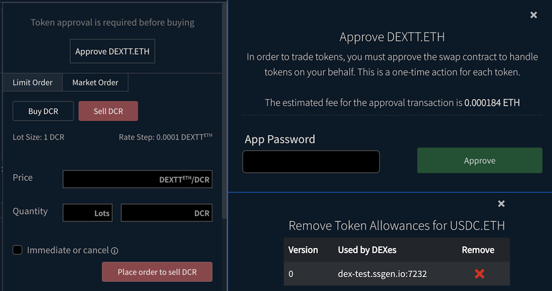
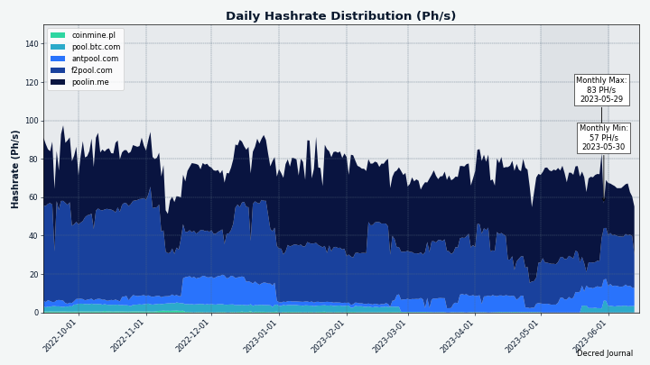
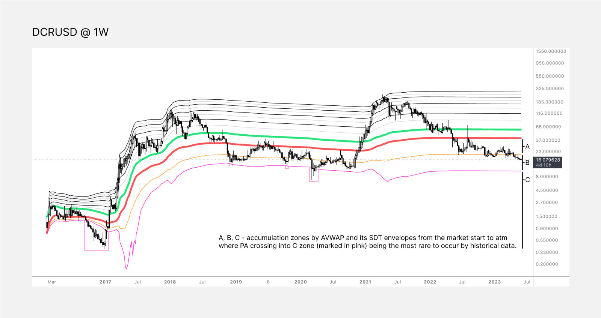

# Decred 月报 – 2023 年 5 月

_图片: 赛博风暴 @Exitus_

五月亮点：

- DCRDEX v0.6.1 已发布，提供 DigiByte 支持和针对 LTC 和 ZEC 的重要修复。

- Decred Vanguard 提案获得批准，社区驱动的社交媒体推广计划已经启动。

- Bison Relay 一直在取得进展，新版本的页面以及商店的商家工具都将被合并。

内容：

- DCRDEX v0.6.1 发布
- [开发进展总结](#开发)
- [人员](#人)
- [治理](#治理)
- [网络](#网络)
- [生态系统](#生态系统)
- [外展](#外展)
- [活动](#活动)
- [媒体](#媒体)
- [市场](#市场)
- [相关外部信息](#相关外部信息)

## DCRDEX v0.6.1 发布

此版本具有以下特点：

- 初始 DigiByte (DGB) 支持（需要同时运行的全节点钱包）
- 针对莱特币 (LTC) 和 Zcash (ZEC) 的重要修复
- 订单列表中的订单费率现在更容易查看
- 现在会记住图表蜡烛尺寸，默认尺寸更改为 1 小时

获取最新的 DEX 客户端作为 [独立应用程序](https://github.com/decred/dcrdex/releases)，或作为 [Decrediton](https://github.com/decred/decred-binaries/releases) 的一部分，或从 Decred 的自定义 [Umbrel App Store](https://github.com/decred/umbrel-app-store) 安装它。 与往常一样，我们建议在运行之前[验证文件](https://docs.decred.org/advanced/verifying-binaries)。

## 开发进展总结

除非另有说明，否则下面报告的工作为“合并至核心存储库”状态。这意味着该工作已完成、审查并集成到高级用户可以[构建和运行](https://medium.com/@artikozel/the-decred-node-back-to-the-source-part-one-27d4576e7e1c)的源代码中，但普通用户尚不可用。

### dcrd

_[dcrd](https://github.com/decred/dcrd) 是一个完整的节点实现，为 Decred 在全球的点对点网络提供支持。_

已合并到未来版本的“master”中：

- 通过[删除错误状态](https://github.com/decred/dcrd/pull/3110)清理了[几个函数](https://github.com/decred/dcrd/pull/3114)。
- [去年八月](202208.md#dcrd)，为了对抗测试网的 ASIC 攻击并确保 CPU 始终能够挖掘新的测试网区块，[测试网已更新](https://github.com/decred/dcrd/pull/2978)，以便测试网挖掘难度被最大值限制。 本月，挖掘模板生成器和 CPU 挖掘器已更新为[删除旧的测试网逻辑](https://github.com/decred/dcrd/commit/c6e53c9ef0926f172a637a6552b744cbd6445537)，该逻辑不再适用，因为所有新的测试网块都强制执行难度限制 。
- [删除了已弃用的内部方法](https://github.com/decred/dcrd/pull/3113)，其中列出了等待区块链更新的订阅客户端。 由于此方法是内部方法，因此不需要在 dcrd 外部共享。
- [通过 dcrdata 发现了一个错误](https://github.com/decred/dcrdata/issues/1963)，其中从 dcrd RPC 服务器返回的总代币供应量计算不包括新的 `TreasuryBases` - 的一部分 每个区块的奖励流入新的去中心化金库。 总代币供应量计算[现已更新](https://github.com/decred/dcrd/pull/3112)，其中还包括对数据库的更新。 需要注意的是，这个错误只是 RPC 币供应量计算中的一个小错误，不会以任何方式影响共识。

进行中：

- 实施 [DCP-11](https://github.com/decred/dcrd/pull/3115) PoW 哈希共识投票。

### dcrwallet

_[dcrwallet](https://github.com/decred/dcrwallet) 是命令行和图形界面钱包应用程序使用的钱包服务器。_

向后移植的为下一个 v1.7.x 版本做好准备：

- 尊重 SPV 和 P2P 播种器连接的 [代理配置](https://github.com/decred/dcrwallet/commit/7fbdd7fba71525149bf7a98dc7f8033f34a1e108)。 这是为了防止泄露内部网络详细信息。

更改已合并到未来版本的“master”中：

- 使用多个 [dcrd 模块](https://github.com/decred/dcrwallet/pull/2234) 和一些第三方 [依赖项](https://github.com/decred/dcrwallet/pull/2236) 的最新版本。
- 如果钱包获得批准并激活，则允许钱包[遵循 DCP-12 硬分叉](https://github.com/decred/dcrwallet/pull/2232)。
- 删除了几个[已弃用的内部方法](https://github.com/decred/dcrwallet/pull/2235)，即那些因共识变更而过时的方法[DCP-9](https://github.com/decred/dcps/blob/master/dcp-0009/dcp-0009.mediawiki)（自动票证撤销）和 [DCP-10](https://github.com/decred/dcps/blob/master/dcp-0010/dcp-0010.mediawiki)（将 PoW/PoS 补贴比例更改为 10/80）。

### Decrediton

_[Decrediton](https://github.com/decred/decrediton) 是一款功能齐全的桌面钱包应用程序，集成了投票、StakeShuffle 混币、闪电网络、DEX 交易等功能。 它在有或没有完整的区块链（SPV 模式）的情况下运行。_

进行中：

- [Ledger支持](https://github.com/decred/decrediton/issues/3865)：添加[初级功能](https://github.com/decred/decrediton/pull/3869)和[UI 视图](https://github.com/decred/decrediton/pull/3874)。
- 由于目前无法使用任何硬件钱包进行质押，因此质押界面将被[删除](https://github.com/decred/decrediton/pull/3870)以避免混淆。
- 在 pi-ui 共享库中添加了 [Ledger 图标](https://github.com/decred/pi-ui/pull/479)。

其他：

- Decrediton 已[添加](https://github.com/microsoft/winget-pkgs/pull/106493)到[winget](https://en.wikipedia.org/wiki/Windows_Package_Manager)包存储库。 Windows 用户现在可以使用“winget install Decred.Decrediton”[安装](https://matrix.to/#/!zefvTnlxYHPKvJMThI:decred.org/$25tEa195uFjzuxC0J9ecm7X8NRGUAhcrUqNvuUKfHqM?via=decred.org&via=matrix.org&via=planetdecred.org) `。

### vspd

_[vspd](https://github.com/decred/vspd) 是投票服务提供商使用的服务器软件。 VSP 代表其用户全天候 24/7 投票，不能窃取资金。_

- 将[自动VSP费用支付](https://github.com/decred/vspd/pull/382)从dcrwallet复制并调整到vspd存储库。 该代码在 dcrwallet 中是私有的，但在 vspd 中可以被其他软件使用，这些软件将被 DCRDEX 中的 [DCR 质押](https://github.com/decred/dcrdex/pull/2290) 集成所利用。

### Lightning Network

_[dcrlnd](https://github.com/decred/dcrlnd)是Decred的闪电网络节点软件。 LN 使即时和低成本交易成为可能。_

- 添加了对 dcrwallet 的[自定义连接](https://github.com/decred/dcrlnd/pull/182)的支持。 它允许 LN 代码将 dcrwallet 配置为使用代理服务器连接到 SPV 对等点。

### cspp

_[cspp](https://github.com/decred/cspp) 是一个使用 CoinShuffle++ 协议协调硬币组合的服务器。 它是非托管的，即从不持有任何资金。 CSPP 是 Decreds 隐私系统 StakeShuffle 的一部分。_

- 在混合过程的早期防止[重复输入](https://github.com/decred/cspp/pull/92)。 在此修复双花发送混合交易时会触发错误之前，它可能会导致混合失败。
- 改进了混合的[日志记录](https://github.com/decred/cspp/pull/93)，以始终捕获混合输出的会话 ID、运行编号和面额值。
- 防止 CoinJoin 交易[超出内存池大小限制](https://github.com/decred/cspp/pull/94)。 这可能会从混合中排除一些对等体，如果发生这种情况，服务器将尝试在下一个混合时期将它们配对。 添加了一项检查，以便在对等点数量[低于最小值](https://github.com/decred/cspp/pull/95) 设置时重试会话。

### DCRDEX

_[DCRDEX](https://github.com/decred/dcrdex) 是一种非托管的、尊重隐私的交易所，用于无信任交易，由原子交换提供支持。_

v0.6.1 版本中包含的更改：

- 设置足够高的[Zcash交易费率](https://github.com/decred/dcrdex/pull/2336)。 DEX 根据交易规模计算费用，但 Zcash 是一个例外，因为它目前使用每笔交易 1,000 zats 或 0.00001 ZEC 的标准费用，无论规模大小。 当 [ZIP 317](https://zips.z.cash/zip-0317) 激活时，这种情况将会改变，从而导致更高的费用。 为了确保 DEX 交易始终被转发和挖掘，这一变化将费用提高到 0.0002-0.0003 ZEC 左右。 84 zats/字节的硬编码费率被用作 Zcash 没有简单方法来估算费用的解决方法。
- 添加了 [DigiByte](https://github.com/decred/dcrdex/pull/2323) 全节点钱包交易支持。
- 添加了ZEC交易的[区块浏览器](https://github.com/decred/dcrdex/pull/2340)链接。
- 添加了 [间隔](https://github.com/decred/dcrdex/pull/2339) 的编译时间选项，DEX 服务器轮询新的类比特币资产块。 它允许对远程节点使用较慢的轮询，其中默认的 1 秒间隔太快。
- 修复了在某些情况下无法重新配置断开连接的类似比特币的钱包的问题。
- 修复了类似比特币的钱包总是需要重新启动并且没有机会进行实时重新配置的问题。
- 修复了在某些更改 RPC 连接配置的情况下未触发完全重启的问题。
- 修复了发送 ZEC 时显示的不正确的 [交易 ID](https://github.com/decred/dcrdex/pull/2342)。
- 修复了 ZEC 和非 SegWit 资产的 [bonds](https://github.com/decred/dcrdex/pull/2343) 的几个问题。
- 向后移植了 5 月份之前在“master”中制作的 ~22 个[修复和改进](https://github.com/decred/dcrdex/pull/2323)。

以下所有其他更改都将合并到未来版本的“master”中。

用户：

- 在匹配界面中添加了预期的[退款时间](https://github.com/decred/dcrdex/pull/2042)。 以前它可能会在几个小时内显示令人困惑的“<Pending>”。
- 自动化更多钱包[启用/禁用步骤](https://github.com/decred/dcrdex/pull/2324)。 禁用链的主要资产钱包也会禁用该链的所有代币钱包。 启用代币钱包也将启用链的主要资产钱包。
- 通过最小化加载用户信息的昂贵调用来优化[请求处理](https://github.com/decred/dcrdex/pull/2350)。
- 恢复了对标准输出的 HTTP 请求的[彩色日志记录](https://github.com/decred/dcrdex/pull/2350)。
- 在 SPV 模式下利用外部[费率来源](https://github.com/decred/dcrdex/issues/2354)。 在此更改之前，从 SPV 钱包发送时可能需要支付不合理的高额费用。
- 删除了取消订单时输入密码的要求。

比特币：

- 修复了[问题](https://github.com/decred/dcrdex/pull/2326)：simnet钱包可能会尝试连接到主网，类似比特币的钱包总是需要重新启动，重新配置断开连接的钱包在某些情况下可能会失败 。

以太坊：

- 将[代币批准](https://github.com/decred/dcrdex/pull/2349)作为一个单独的手动步骤，而不是第一次交换的自动部分。 为了交易代币（例如 USDC），互换合约必须获得批准才能代表用户处理代币。 使其成为手动操作可以让用户了解正在发生的事情，并且不会对首次交换的高额费用感到惊讶。 稍后可以在钱包设置中撤销批准。

Firo：

- 添加了对[Firo](https://firo.org/)（以前称为Zcoin）的[全节点钱包](https://github.com/decred/dcrdex/pull/2270)支持。
- 接下来是对基于 Electrum 的 Firo [轻钱包](https://github.com/decred/dcrdex/issues/2346) 的支持。

应用程序包装：

- 引入了一个新的可执行文件“dexc-desktop”，它将 DEX Web 应用程序包装在 WebView 组件中，看起来像一个[桌面应用程序](https://github.com/decred/dcrdex/pull/1957)。 如果有活动订单，应用程序将继续在后台运行（但可以使用命令行上的“--kill”开关强制关闭）。
- 添加了构建 [Debian 软件包](https://github.com/decred/dcrdex/commit/ca5b1d8914b8d84bdfa4cbe28a6c97f5a20c18c4) 的脚本。

开发者和内部变化：

- 更新了 [npm 依赖项](https://github.com/decred/dcrdex/pull/2321)。
- 将[做市](https://github.com/decred/dcrdex/pull/2320)机器人逻辑从“Core”包移至其[自己的包](https://github.com/decred/dcrdex/tree/ca5b1d8914b8d84bdfa4cbe28a6c97f5a20c18c4/)。 这是改进架构并在未来添加更多机器人策略所必需的。
- 启用 [makezero](https://github.com/decred/dcrdex/pull/2344) linter 来检测内存分配中的更多错误。
- 更新了构建和测试工作流程以添加 [Node.js](https://github.com/decred/dcrdex/pull/2341) v20 并删除 v16。 Node.js v16 将于 2023 年 9 月终止生命周期。
- 更干净地将链提示和对等跟踪 goroutine 更改为 [shutdown](https://github.com/decred/dcrdex/pull/2369)。

_图片：DEX 的交换合约需要一次性批准才能交换您的代币。_

_图片：设置运行 Umbrel 与 DEX 做市商 + 套利。 作者：[@busyLightz](https://twitter.com/busyLightz/status/1654876069101436928)._

### dcrdata

_[dcrdata](https://github.com/decred/dcrdata) 是 Decred 区块链和链下数据（如 Politeia 提案、市场等）的浏览器。_

- 由于未过滤掉侧链和无效输出，修复了[地址余额图表](https://github.com/decred/dcrdata/pull/1962)上的数字略有偏差。

### Bison Relay

_[Bison Relay](https://github.com/companyzero/bisonrelay) 是一个新的社交媒体平台，具有针对审查、监视和广告的强大保护，由 Decred 闪电网络提供支持。_

下面报告的所有工作都将合并到下一个版本（可能是 v0.1.8）的“master”中。

GUI 和 CLI 应用程序：

- 实现了 [主页](https://github.com/companyzero/bisonrelay/pull/224) 功能的初始版本。主页允许远程用户浏览静态内容。 仅支持 [Markdown](https://www.markdownguide.org/) 页面。 页面可以使用“br://”链接链接到其他用户的页面。 [拉取请求](https://github.com/companyzero/bisonrelay/pull/224) 中列出了第一次迭代的限制。 主页是一项重要功能，需要根据用户反馈进行多轮改进。
- 改进了[提示重试](https://github.com/companyzero/bisonrelay/pull/236)策略。 一次只尝试一次，而不是多次并行尝试为一名用户支付小费。 这应该有助于避免由于 LN 节点容量低而导致小费支付失败的问题。 此外，由于没有 LN 路径而失败的提示尝试也会重试（此错误可能是暂时的）。 CLI 应用程序可以使用新的“/runningtips”命令列出运行提示用户尝试。
- 添加了通过配置的代理服务器（例如 Tor）将嵌入式 dcrlnd 连接到 [CLI 应用程序](https://github.com/companyzero/bisonrelay/pull/235) 和 [GUI 应用程序](https://github.com/companyzero/bisonrelay/pull/239)。 新的“CircuitLimit”配置参数允许在使用代理时限制[打开连接](https://github.com/companyzero/bisonrelay/pull/234)的数量。
- 添加了[握手功能](https://github.com/companyzero/bisonrelay/pull/246)，允许用户测试他们的加密棘轮是否仍在工作。
- 实现了[持久聊天历史记录](https://github.com/companyzero/bisonrelay/pull/230)，它可以记住最后 500 条消息并在重新启动应用程序后显示它们。 所有聊天都存储在日志文件中，但从应用程序本身访问历史记录是更好的用户体验，并且一直是频繁的功能请求。 该计划最终是在用户向后滚动时添加历史记录的按需加载。
- 修复了当两个用户同时尝试彼此交换密钥时可能出现的[损坏的棘轮](https://github.com/companyzero/bisonrelay/pull/248)。 当两个用户被添加到两个不同的群聊（其中另一个用户已存在）时，可能会发生这种情况，从而同时启动两个密钥交换。

图形用户界面应用程序：

- 在个人聊天和群聊中添加了[上下文菜单](https://github.com/companyzero/bisonrelay/issues/216)。
- 添加了一个浮动按钮[跳转到最近的消息](https://github.com/companyzero/bisonrelay/pull/231)。
- 聊天和帖子中显示的[嵌入图像](https://github.com/companyzero/bisonrelay/pull/244) 的大小受到限制。 如果单击，将显示更大的图像。 这解决了滚动和不同图像尺寸的问题。
- 修复了[文本选择](https://github.com/companyzero/bisonrelay/pull/226)的一些问题，为代码块添加了高度限制并使代码块可滚动。 两个 Flutter 小部件已被分叉和修补以解决这些问题，但双击（选择单词）和三次单击（选择段落）仍然不起作用。
- 修复了 LN 管理视图上的[滚动条问题](https://github.com/companyzero/bisonrelay/pull/249)。
- 对滚动和溢出行为的较小修复。

CLI 应用程序：

- 使 brclient 通过 [clientrpc API](https://github.com/companyzero/bisonrelay/) 将页面和存储请求委托给 [另一个程序](https://github.com/companyzero/bisonrelay/pull/224)，并将其响应转发回请求的 BR 用户。 这种灵活性将在未来实现有用的功能。
- 启用 brclient 将请求委托给 HTTP 或 HTTPS [网站](https://github.com/companyzero/bisonrelay/pull/224)。 这允许 BR 用户通过充当代理的另一个 BR 用户访问 HTTP/HTTPS 资源。
- 按[最近活动](https://github.com/companyzero/bisonrelay/pull/243)对帖子进行排序。未读的帖子也会以不同的颜色突出显示。
- 允许使用带有通道 ID 的 [短前缀](https://github.com/companyzero/bisonrelay/pull/252) 的 `/closechannel` 命令（完整 ID 为 64 个字符长）。

店铺进度：

- 为[简单商店](https://github.com/companyzero/bisonrelay/pull/224)实施了商家端基础。 与页面不同，商店是动态资源，可以展示待售的产品。 商店有一个首页和从本地文件生成的各个产品页面。 当其文件更改时，存储会自动重新加载。 运行商店的 BR 客户端可以提供产品页面、维护购物车、处理订单放置以及创建发票。 价格将以美元显示，但以 DCR 支付。 汇率取自[dcrdata](https://explorer.dcrdata.org)。 订单有效期间，支付的 DCR 金额将被锁定 60 分钟。 CLI应用程序仅支持链上支付。
- 实施[简单形式](https://github.com/companyzero/bisonrelay/pull/241)。 商店顾客可以查看、填写和提交表格，以将商品添加到购物车或下订单。
- 在订单中添加了[运输详细信息](https://github.com/companyzero/bisonrelay/pull/250)。 有些产品可能需要填写运输信息。

其他：

- 添加了端到端[性能测试](https://github.com/companyzero/bisonrelay/pull/245)。
- @JC 在 #trading 中举办了一场入职活动，并赠送 20 个预付费邀请，每个邀请 0.05 DCR。

## 人员

截至 6 月 2 日的社区统计数据（与 5 月 3 日相比）：

- [Twitter](https://twitter.com/decredproject) 关注：53,108 (+31)
- [Reddit](https://www.reddit.com/r/decred/) 订阅：12,723 (+22)
- [Matrix](https://chat.decred.org/) #普通用户：774 (+11)
- [Discord](https://discord.gg/GJ2GXfz) 用户：1,590 (+17)，验证发帖人数：634 (-287) - Discord 未桥接，并获得了更强的验证规则
- [Telegram](https://t.me/Decred) 用户：2,470 (-38)
- [YouTube](https://www.youtube.com/decredchannel) 订阅者：4,640 (+10)，观看次数：229.6K (+1.5K)

## 治理

5 月份，新[国库](https://dcrdata.decred.org/treasury) 收到了 8,088 个 DCR，价值 13.9 万美元，5 月份的平均汇率为 17.13 美元。 3,591 DCR 用于支付承包商费用，价值 62,000 美元。

[国库支出 tx](https://explorer.dcrdata.org/tx/5efdb2de7cbea2682d389aa274a1ef79c5996201226054b28e08e286b1809519) 以 6,722 票赞成和 52% 的投票率获得批准，并于 5 月 20 日开采。它有 23 个产出向承包商付款，范围从 4 DCR 至 1,464 DCR。 大部分 DCR 可能是为 3 月份的工作支付的，按照 20.69 美元的计费汇率，TSpend 的价值约为 7.4 万美元。

截至 6 月 17 日，[旧国库](https://dcrdata.decred.org/address/Dcur2mcGjmENx4DhNqDctW5wJCVyT3Qeqkx) 和[新国库](https://dcrdata.decred.org/treasury) 的总余额为 858,136 DCR（1,210 万） 美元价格为 14.08 美元）。

五月份批准的提案：

- [Decred Vanguard](https://proposals.decred.org/record/0a1b782) 提案获得批准，预算为 46,784 美元，用于资助社区驱动的外展计划的发展，获得了 94% 的赞成票，投票率为 39%。

- [BTC-ECHO](https://proposals.decred.org/record/49e373b) 提案获得批准，预算为 9,500 美元，在德国加密网站 [BTC-ECHO.de](https://www.btc-echo.de/)期间，他们发表两篇赞助文章，获得了 69% 的赞成票，投票率为 32%。 在投票之前，对其进行了编辑，包括在社交媒体上进行额外的促销活动，并在播客上播放为期两周的广告。 第二次编辑澄清，他们不需要预付款，并同意在活动结束后最多等待 60 天付款，这与大多数现有提案和承包商的运作方式一致。 提案获得批准后，他们发布了有关后续步骤和时间表的[更新](https://proposals.decred.org/record/49e373b/comments/24)。

5月份提交的提案：

- [DCRDEX 网格开始和债券演变](https://proposals.decred.org/record/4d2324b) 请求 16.4 万美元来开发基于服务器网格架构的 DCRDEX 实验版本。

有关本月提案的更多详细信息，请参阅 Politeia Digest [第 60 期](https://blockcommons.red/politeia-digest/issue060/)。

## 网络

**全网算力**: 5 月的 [算力](https://dcrdata.decred.org/charts?chart=hashrate&scale=linear&bin=day&axis=time) 以74 Ph/s开启，结束为 66 Ph/s，最低为 61 Ph/s，峰值 88 Ph/s。

_图片：Decred 算力_

6 月 1 日矿池 67 Ph/s 算力分布[报告](https://miningpoolstats.stream/decred)：币印 40%、F2Pool 40%、AntPool 16%、BTC.com 5%。

截至 6 月 1 日，实际[开采](https://miningpoolstats.stream/decred) 的 1,000 个区块的分布：F2Pool 40%、Poolin 35%、AntPool 17%、BTC.com 8%。

_图片：历史矿池算力分布_

**质押**：[选票价格](https://dcrdata.decred.org/charts?chart=ticket-price&axis=time&visibility=true-true&mode=stepped)在173-334 DCR之间变化。

_图片：票价再次波动_

[锁定金额](https://dcrdata.decred.org/charts?chart=ticket-pool-value&scale=linear&bin=day&axis=time)为938-990万个DCR，意味着循环供应量的61.7-65.1%[参与](https://dcrdata.decred.org/charts?chart=stake-participation&scale=linear&bin=day&axis=time) 权益证明。

**VSP**：[14 个列出的 VSP](https://decred.org/vsp/) 总共管理了约 6,650 (-310) 份现场门票，截至 6 月占门票池的 16.8% (0.3%) 1.

_图片：VSP 管理的选票分布_

**节点**：[Decred Mapper](https://nodes.jholdstock.uk/user_agents) 在 6 月 1 日观察到以下版本的 147 个 dcrd 节点：v1.7.7 - 25%、v1.7.1 - 21%、v1 .7.5 - 18%，v1.7.2 - 10%，v1.8.0 开发版本 - 9%，v1.7.0 - 7%，v1.7.4 - 3%，其他 - 8%。

_Image：历史dcrd版本分布，数据来自nodes.jholdstock.uk。 2023 年 1 月之前的数据不完整。_

[混币](https://dcrdata.decred.org/charts?chart=coin-supply&zoom=jz3q237o-la8vk000&scale=linear&bin=day&axis=time&visibility=true-true-true)的份额在61.8-61.9%之间变化。 每日[混合量](https://dcrdata.decred.org/charts?chart=privacy-participation&bin=day&axis=time) 在 143-497K DCR 之间变化。

_图片：每月 StakeShuffle 交易量（美元）_

截至 6 月，Decred 的 [闪电网络](https://ln-map.jholdstock.uk/) 浏览器已看到 211 个节点 (+15)、423 个通道 (+24)，总容量为 176 DCR (+13) 1. 每个节点的这些统计数据都不同。 例如，@karamble 的节点在 6 月 1 日同一天报告了 210 个节点 (+17)、446 个通道 (+17) 和 182 DCR (+9) 容量。

_图片：Decred 的闪电网络容量_

还有一些来自 @bochinchero 的新图表：

_图片：平均出块时间稳定在5分钟_

_图片：Decred 链每月增加约 180 MB_

_图片：完整的 Decred 区块链可以适应现代智能手机的存储_

_图片：每月以美元计价的 DCR 发行 - 奖励从矿工转移到质押者，并且很快会转移更多_

_图片：每月总费用 - Decred 使用起来仍然很便宜_

现在的图表数量超出了《华尔街日报》所能展示的范围。 上述和其他图表可以在[此处](https://github.com/bochinchero/dcrsnapshots)找到 - 强烈鼓励在社交媒体上重复使用！

## 生态系统

新服务：

- ZEC/BTC 和 ZEC/USDC 交易对已在 [dex.decred.org](https://dex.decred.org/) 上[启动](https://twitter.com/exitusdcr/status/1654626949837500416)。

- DGB/BTC 市场[上线](https://twitter.com/DecredSociety/status/1657750204852871173)。 需要 DEX 客户端 v0.6.1 或更高版本，它可以作为[独立应用程序](https://github.com/decred/dcrdex/releases) 或通过 [Decrediton](https://github.com/decred/decred-binaries/releases)v1.8.0。 最初仅支持基于全节点的 DGB 钱包，但当 DigiByte v8.22 发布时，内置轻钱包将可用。

- Decred 的 Matrix 聊天日志现在可以查看 [archive.matrix.org](https://archive.matrix.org/) - 新的聊天存档浏览器取代了 [view.matrix.org](https://view.matrix.org/)。 该服务无需 JavaScript 即可运行，并且不需要 Matrix 帐户。

服务丢失：

- 币安将[离开加拿大](https://www.forbes.com/sites/digital-assets/2023/05/16/binance-exits-canada-over-concerns-of-strict-regulation/) [回复](https://twitter.com/binance/status/1657099651210969088) 最近的加密法规禁止注册交易所接受稳定币存款或未经 CSA 批准将其出售给客户。 其他限制包括禁止保证金交易和投资者限制。 根据 [#trading chat](https://matrix.to/#/!lDZCzVQjFoJsXMPkvr:decred.org/$Ox6W2V_jS33D6X5kOvuX6OU-TPW-8xStJL0QdLzpD8E)，客户被要求在 2023 年 9 月 30 日之前关闭所有未平仓头寸。

- 币安计划在法国、意大利、波兰和波兰[下架 12 种隐私币](https://cointelegraph.com/news/binance-to-delist-privacy-tokens-in-france-italy-spain-and-poland) 。 从6月26日开始，这些国家的居民将无法再进行DCR交易。 币安最近在受影响的司法管辖区获得了适当的[许可证](https://beincrypto.com/binance-privacy-coins-prohibition/)。 此举是在欧盟加密资产市场（MiCA）[通过](https://cryptoslate.com/binance-delists-privacy-coins-for-european-users-amid-layoff-rumors/)之后不久进行的。

- Hotbit [已宣布](https://twitter.com/Hotbit_news/status/1660496999458963458) 将关闭运营并要求在 6 月 30 日之前撤回所有资产。自 [2019 年 10 月](https://twitter.com/Hotbit_news/status/1186979514741428224)以来，DCR 交易已在主 hotbit.io 上提供以及自 [2020 年 11 月](https://twitter.com/Hotbit_Korea/status/1331412789416534017) 以来的韩国分支机构。 据一些社区成员透露，DCR 已下架一段时间，不会影响任何 DCR 用户。 关闭交易所的原因包括：犯罪[调查](https://help.hotbit.io/hc/en-us/articles/8074249353495)造成的损失、CEX资金外流、试图上市的商业模式不可持续 许多代币，其中许多被黑客攻击，并且难以遵守监管。 引用告别[公告](https://help.hotbit.io/hc/en-us/articles/14750194236823-It-s-time-to-take-a-bow)：“要么接受监管，要么变得更加 去中心化”。 我们正在努力！

其他新闻：

- 显然火币并没有按照计划于 2022 年 9 月下架 DCR。公告页面已被删除，但有[存档副本](https://web.archive.org/web/20221002130913/https://www.huobi.com/support/en-us/detail/104917015223952)可用。 截至 5 月 12 日，DCR 和该列表中其他 6 种隐私币的 USDT 交易对仍然存在，并且在 CoinGecko 和 CoinMarketCap 上报告了不错的交易量。

- Bittrex 已在美国和马耳他申请[破产](https://fortune.com/2023/05/08/bittrex-bankruptcy-us-filing-crypto-platform/)，距该公司被指控 3 周后 SEC 经营未注册的证券交易所。处理提款从四月开始。

- Ledger [宣布](https://twitter.com/Ledger/status/1658458714771169282) 即将推出的 [Ledger Recover](https://www.ledger.com/recover) 服务。 恢复允许注册您的 ID（加拿大、欧盟、英国、美国）并在受信任的第三方备份钱包种子。 种子被分成 3 个片段，这些片段使用对称密钥加密并发送到 3 个不同的备份提供商。 稍后可以通过验证 ID 并从提供商处获取 3 个片段中的 2 个来在另一个 Ledger 设备上重建它。 目前仅支持 Ledger Nano X。 DCR 用户可能希望根据这一新功能评估使用 Ledger 的[风险](https://support.ledger.com/hc/en-us/articles/9579368109597-Ledger-Recover-FAQs)，该新功能已被添加到[固件版本2.2.1](https://twitter.com/alistairmilne/status/1658381708763209729)并且*应该*在明确启用之前处于非活动状态。 请参阅 [#ecosystem](https://chat.decred.org/#/room/#ecosystem:decred.org/$LSE8W9g9a4hqu9HN4IIyqWSf6H-LwSjd-xgK8Xie7GQ) 中更详细的报道。
  
社区发现但尚未测试的新服务：

- [DCR 付款选项](https://fxdreema.com/purchase) 已在 [fxDreema](https://fxdreema.com/) 上被[发现](https://twitter.com/h3la1/status/1653233413200158721) - 与 MetaTrader 4 和 MetaTrader 5 兼容的交易机器人图形构建器。

- [CryptoWallet.com](https://cryptowallet.com/) 拥有一款移动应用程序，允许用户买卖加密货币，支持 VISA/MasterCard/SEPA 转账，并计划推出自己的卡产品。 该公司在爱沙尼亚获得许可。 非常感谢研究和测试帮助。

加入我们的 [#ecosystem](https://chat.decred.org/#/room/#ecosystem:decred.org) 聊天，获取有关 Decred 服务的更多新闻。

警告：Decred Journal 的作者不知道上述任何服务的可信度。 在将您的个人信息或资产委托给任何实体之前，请先进行自己的研究。

## 外展

Decred Vanguard 已获得[批准](https://proposals.decred.org/record/0a1b782) 并开始其外展业务。 Vanguard 拥有自己的 Discord 服务器，成员可以在其中进行协调、制定最佳方法并评估结果。 成员利用 Midjourney AI 生成先进的艺术作品，以帮助传达 Decred 的信息。 一些成员购买了 Twitter Blue，而且似乎运行得很好。 此时的主要挑战是招募积极且富有成效的会员，这就是为什么最初的每月津贴定为 100 美元的低水平。 另一个挑战是熊市中的营销。 五月份没有为大型/著名活动分配任何奖项。

任何有兴趣加入 Decred Vanguard 的人都应联系 [@Tivra](https://twitter.com/WasPraxis) 或 [@Exitus](https://twitter.com/exitusdcr)。 如果您是 Decred 的新手，没关系 - 您只需要愿意学习并尽可能提供帮助即可。

> Vanguard 确实感觉像是我们多年来所需要的东西。 \[@Exitus\]

_图片：先锋队作战室_

Monde PR 的成就：

- 提供 1 次评论机会
- 推介 7 个媒体机会
- 获得 1 次媒体采访

确保以下媒体展示位置：

- @jy-p 接受[权威杂志](https://medium.com/authority-magazine/the-future-is-now-jake-yocom-piatt-on-how-their-technological-innovation-will-shake-u-3966dc1adc22)采访讨论了 Decred 的许多方面，包括：Decred 的起源故事、Bison Relay 作为主权互联网的产品、即将推出的对页面和电子商务商店的支持、Politeia 以及 Decred 在巴西选举中的使用。

## 活动

**出席：**

- @arij 和 @khalidesi 参加了在摩洛哥卡萨布兰卡举行的 [EMEC EXPO](https://emecexpo.ma)，这是一场专注于数字技术的 9000 人大型活动。 团队设立了一个展台，向来自各个领域的参观者解释 Decred 的功能，与几家摩洛哥公司进行互动，并会见了一些已经熟悉该项目的人。 请参阅[此处](https://decredcommunity.github.io/events/index/20230511.1)的完整报告。

## 媒体

**精选文章：**

- [Decred DEX 推出 DCRDEX 0.6，为跨链交换提供新级别的隐私和安全性](https://decred.org/news/2023-04-18_decred_releases_dcrdex_0.6/)
- [未来就在眼前：decred.org 的 Jake Yocom-Piatt 谈论他们的技术创新将如何撼动科技领域](https://medium.com/authority-magazine/the-future-is-now-jake-yocom-piatt-on-how-their-technological-innovation-will-shake-u-3966dc1adc22) 由权威杂志发布。 @jy-p
- [Decred vs Horizen：加密还不够！](https://www.decredmagazine.com/decred-vs-horizen-crypto-is-not-enough/) @Joao
- [我不需要你的喜欢](https://www.decredmagazine.com/i-dont-want-your-likes/) @phoenixgreen

Decred 杂志 2023 年 5 月参与度统计数据：

- DM 上的文章总数：460
- 时事通讯订阅者：100
- 发送的新 DM 帖子和时事通讯：16
- 活跃的社交媒体活动：57
- 已完成的社交媒体活动：41
- 社交媒体帖子：172
- 点赞数：1,180
- 转发：302
- 所有平台和帐户的社交媒体关注者（包括 [@DecredSociety](https://twitter.com/DecredSociety)）：1,350

**视频：**

- [完成莱特币原子交换 - DCRDEX 0.6](https://www.youtube.com/watch?v=ajHovJHxtFw) @phoenixgreen
- [Decred Recap - v1.7.7 改进，atomic-swap DEX v0.6 - DAO 不断发展！](https://www.youtube.com/watch?v=OgupSweE94s)  @Exitus 
- [Bison Relay 升级到版本 0.1.7](https://www.youtube.com/watch?v=wg0k8p3arxI)  @phoenixgreen 
- [Decrediton 提案投票](https://www.youtube.com/watch?v=q18OVd9z-n0)  @phoenixgreen 
- [Bison Relay 预付费邀请](https://www.youtube.com/watch?v=n4_fkpyppws)  @phoenixgreen 
- [Decred 正在为其 DEX 开发网状网络](https://www.tiktok.com/@decred_crypto/video/7239431067764002074) TikTok  @DajanaDcr 和 @Exitus

直播：

- [市场状况 - Decred Vanguard - 一项新的外展工作](https://www.youtube.com/watch?v=UDTQFOcva5Q) 由 @phoenixgreen 和 @Exitus 主持，@Tivra 和 @h3la1

**音频：**

- Twitter Space [Decred x Zcash 社区讨论](https://twitter.com/i/spaces/1vOxwMZYqYWGB) 与 @Tivra 和 [ZecHub](https://twitter.com/ZecHub) - 也在 [YouTube](https://www.youtube.com/watch?v=2RStHBiWNDk)
- [Twitter 空间](https://twitter.com/i/spaces/1jMJgLwmPLMxL) @Tivra 和 [W0wn3r0](https://twitter.com/W0wn3r0)

**艺术与乐趣：**

- 野牛序号 [题词](https://twitter.com/c12hz/status/1656636523448606720)  @c12hz
- [登上伟大](https://www.decredmagazine.com/ascend-to-greatness/)  @OfficialCryptos
- [Decred Katana](https://www.decredmagazine.com/decred-katana/) @OfficialCryptos
- [Decred 杂志](https://twitter.com/aithzakaria1/status/1653718235588468737) @aithzakaria1

_图片：@OfficialCryptos._

**翻译：**

- [互联网隐私及其重要性](https://www.decredmagazine.com/internet-privacy-and-why-it-is-important/) - [中文](https://github.com/DominicTing/decred-ZH-translations/blob/master/Internet%20Privacy%20and%20Why%20it%20is%20Important.md) @Dominic
- Decred 月报 2023.4 已由 @Dominic [翻译](https://xaur.github.io/decred-news/) 为中文 - 谢谢！

## 市场

5 月份 DCR 的交易价格在 USDT 15.19-20.59 和 BTC 0.00056-0.00075 之间。 平均每日交易价格为 17.13 美元。

社区的 DCR 价格分析发布在 #trading 聊天中：

_图片：DCR/USD 的奇怪价格灯芯似乎发生在与 BTC/USD 价格走势相关性较低的情况下。 @saender._ 的分析

_图片：市场估值（美元）基于 @bochinchero_ 的 Decred 特定质押已实现价值指标

_图片：DCR/USD 累积区域分析，作者：@saender_

_图片：DCRDEX 每月交易量（美元）_

## 相关外部信息

以太坊的信标链一直在经历一些最终性问题，在两次事件中，验证者大多停止提出证明大约一个小时，没有人知道为什么。以太坊网络上的交易已经能够继续，因此用户可能没有注意到任何问题，但在幕后，完成一切的信标链无法正常工作，因此这些交易比通常情况更容易被逆转。以太坊核心开发人员为受该问题影响的两个客户端（Prysmatic Labs 的基于 Go 的Prysm和 ConsenSys 的基于 Java 的Teku ）发布了补丁，这是由运行这些客户端的节点上异常高的负载引起的。

达世币网络和链于 5 月 22 日停滞了 16 个小时，原因是在 v19 中将 BLS 阈值加密升级到行业标准时出现故障。核心团队制作了一个快速补丁（v19.1）来停止 v19 的部署，这使得网络在停机 16 小时后恢复。v19.2 中将包含对该问题的修复以及部署更改的另一次尝试。

Halborn记录了在审计狗狗币代码库时发现的几个问题，但这些问题也适用于同一比特币谱系的许多分叉，包括莱特币和 Zcash。他们将这些漏洞称为“Rab13s 漏洞”，最容易利用的漏洞将允许攻击者使节​​点脱机，而其他漏洞则允许远程执行代码，但仅限于有效的凭据，从而使利用该问题变得更加困难。

3 月份推出的比特币铭文 (NFT) 新 BRC-20 代币标准已达到10 亿美元的综合（名义）市场估值。这一里程碑是在第一个 BRC-20 代币 ORDI 在一些主要交易所上市后实现的。

比特币创下了每日交易新纪录。使用 BRC-20 标准铸造可替代代币的趋势正在蔓延到莱特币和狗狗币链，同样提高了它们的交易活动水平。

对于 BRC-20 数据链上存储效率低下的问题，有人提出批评，认为不花时间将数据编码为二进制会导致交易费用增加 4 倍。做出这一选择显然是因为希望链上数据可供人类阅读，但有人建议使用更多的区块空间可能是设计者有意为之。

Taproot Assets v0.2发布，添加了一组工具，开发人员可以在测试网上使用这些工具来发行、转移和发现 Taproot Assets 协议（以前的 Taro）上的资产。Taproot 资产协议的目标是通过处理大多数链外交易来提供一种更具可扩展性的方式来处理比特币链上的资产，而不是序数铭文，后者以低效的方式使用区块空间，并导致所有用户的费用大幅增加。网络。0.2 版本增加了对“虚拟部分签名比特币交易”（vPSBT）的支持，这将使开发人员能够更轻松地处理 Taproot 资产。闪电网络对资产和稳定币的支持是未来版本的主要目标之一，面向新兴市场的使用。

Richard Heart 的 Pulsechain（以太坊分叉）推出，这是 HEX 生态系统中备受期待的一部分，以及“PulseX”去中心化交易所（Uniswap 分叉）。这些发布早在 HEX 社区转向成为以太坊软件分叉之前就备受期待。然而，降低 HEX 用户费用的目标似乎并未实现，因为在 Pulsechain 之间桥接资产所需的交易序列很长。此外，严重的流动性问题使得用户很难获得可用来支付汽油费的 PLS，导致许多用户根本没有合适的代币来使用网络，而这些代币只能以高额加价获得。所有相关代币的价格都在急剧下跌。

DeFi 借贷协议 AAVE批准并在以太坊、Polygon 和 Avalanche 网络上部署了对其智能合约的更改，该更改旨在调整利率计算，但由于函数格式错误，破坏了 Polygon 链上的协议。价值约 1.2 亿美元的用户资金无法使用，而修复错误的提案正在通过治理流程，大约需要一周时间才能解决问题。

用于开发 OFAC 批准的 ETH 混合服务 Tornado Cash 的 DAO 被一名黑客接管，该黑客授予自己 120 万个 TORN 代币，并用这些代币批准 DAO 财政基金的支出。允许黑客攻击的代码最近在一项看似合法的提案中获得通过，该提案得到了通常的 Tornado DAO 治理流程的批准。这次黑客攻击并没有影响 Tornado Cash 混合器本身，而是影响了与 DAO 相关的智能合约。几天后，攻击者提出重置他们所做的更改并返还他们授予自己的未使用代币的建议，通过 Tornado Cash 混入约 900,000 美元的 ETH 后将控制权返回给 DAO。

币安一直在编制已上市交易的“无进展项目”清单，并开始将它们添加到“创新区”，如果它们没有开始展示一些进展，就将被除名。CZ已经意识到这可能需要重新命名“创新区”。

Bittrex 在特拉华州申请破产，但计划偿还所有客户资产押金，全球 Bittrex 实体似乎未受影响。

Silvergate Capital 已从纽约证券交易所退市并进入清算程序。它是曾经最大的加密银行合作伙伴 Silvergate Bank 的母公司。Silvergate 银行在 FTX 崩溃后出现大量客户提款，导致该银行在 2022 年最后一个季度亏损 10 亿美元，因此于 3 月份被关闭。

Ledger 硬件钱包一直在从新的种子备份功能Ledger Recover的消息传递PR失败中恢复。这位前首席执行官在谈到对新固件导出种子的担忧时表示，用户已经相信 Ledger 不会部署这种后门种子导出固件，因此他认为这没什么大不了的，这更是火上浇油。 。

欧盟理事会财政部长已签署加密资产市场监管 (MiCA)，这意味着其条款将于 2024 年 6 月或 7 月生效。MiCA 将要求加密公司寻求在欧盟运营的许可证，并且设定了稳定币储备持有量等要求。除了 MiCA 之外，还同意了一些新措施，要求与税务机关共享有关欧盟公民持有的加密货币的信息。

2022 年发生的利用被篡改的 Trezor 设备发起的供应链攻击已被记录。用户从在线市场购买了该设备，他们的加密货币在开始使用大约一个月后就消失了。经检查，安装了一些狡猾的固件，该固件会在 20 个预设种子之间循环，而不是生成随机种子，并且只会使用任何密码集的第一个字符 - 因此该设备只能生成 1,280 个不同的私钥，这是一个可管理的供攻击者观看的号码。

Coinbase 经理 Ishan Wahi 被指控进行内幕交易，从新上市产品中获利，在认罪后被判处2 年监禁。Wahi 将这些信息提供给了他的兄弟和另一名男子，后者利用这些信息进行了超过 100 万美元的交易。Wahi 的兄弟于 9 月承认共谋实施电信诈骗罪，并被判处 10 个月监禁。

这就是五月的全部内容。在我们的[#journal](https://chat.decred.org/#/room/#journal:decred.org)聊天室中建议下一期的新闻。

## 关于月报

这是 Decred 月报的第 59 期。 [此处](https://xaur.github.io/decred-news/) 提供所有问题、镜像和翻译的索引。

来自第三方的大多数信息都是在经过最低限度的健全性检查后直接从源头转发的。 Decred 月报的作者无法验证所有声明。请提防诈骗并自行研究。

感谢（字母顺序）：

- 写作、编辑、出版：bee、bochinchero、Exitus、jz、karamble、l1ndseymm、phoenixgreen、richardred、zippycorners
- 评论和反馈：davecgh
- 标题图片：Exitus
- 资金来源：Decred 利益相关者

## 中文社区

* [推特](https://twitter.com/DecredCN)
* [微信公众号](https://mp.weixin.qq.com/mp/profile_ext?action=home&__biz=Mzg2NTExNzc3MA==&scene=124#wechat_redirect)
* [bilibili频道](https://space.bilibili.com/425519478)
