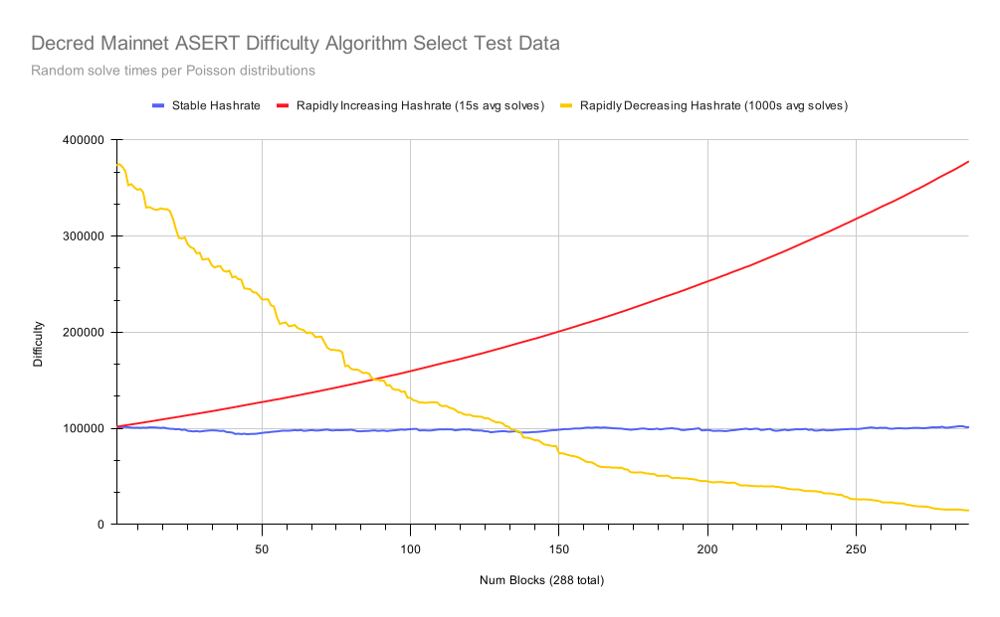
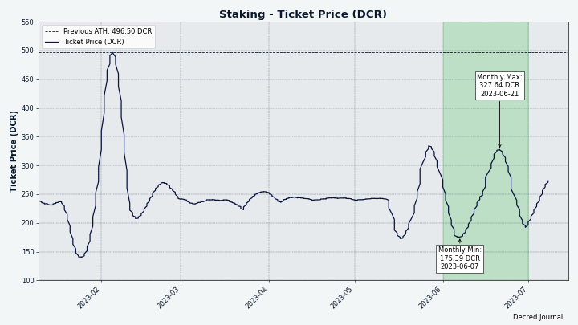
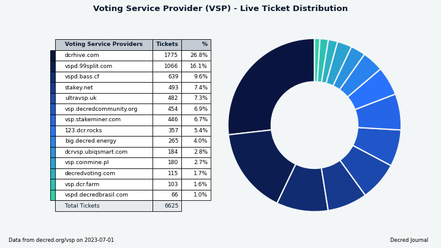
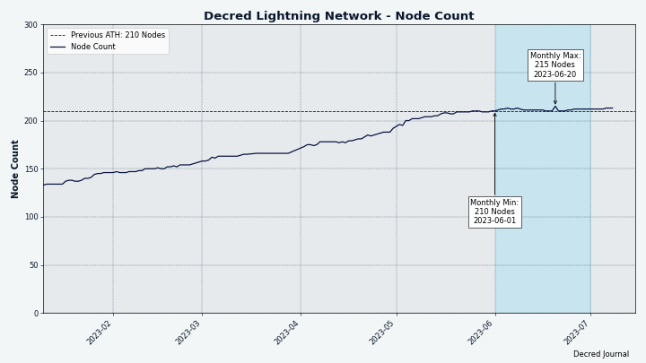
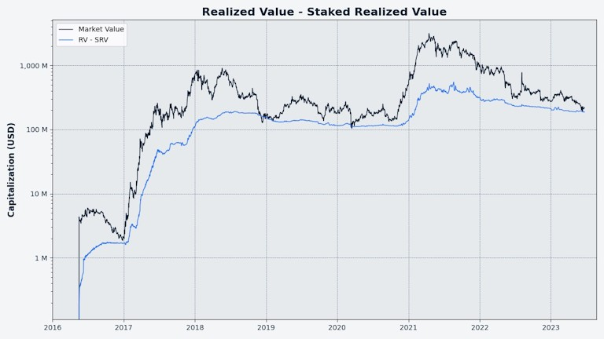

# Decred 月报 – 2023 年 6 月

_图片：@Exitus_

六月亮点：

- Decred 核心软件 v1.8.0 发布，解锁新的共识投票和其它功能。

- DEX v0.6.2 发布，为新的共识投票做好准备并部署了许多其它改进。

-  7月初网络节点更新达到阈值，就会开始对两个新的共识提案（更改区块奖励比例和网络哈希算法）进行投票。

- DCRDEX 去中心化网状网络架构提案获得批准。

内容：

- [对新的网络共识投票!](#upgrade-and-vote-on-new-consensus-changes)
- [核心软件 v1.8.0 发布](#core-software-v180-release)
- [DEX v0.6.2 发布](#dcrdex-v062-release)
- [开发进展总结](#development)
- [人员](#people)
- [治理](#governance)
- [网络](#network)
- [生态系统](#ecosystem)
- [外展](#outreach)
- [活动](#events)
- [媒体](#media)
- [市场](#markets)
- [相关外部信息](#relevant-external)

## 对新的网络共识投票!

我们鼓励每个人升级到[最新核心软件版本](https://github.com/decred/decred-binaries/releases)，以便能够对两个新的共识变更进行投票。为了与网络保持同步，即使您不打算投票赞成提案，升级也很重要。

请仔细阅读 Decred 治理、共识变化和抗分裂网络的硬分叉，查看[文档](https://docs.decred.org/governance/consensus-rule-voting/overview/)。

您可以通过以下文档了解最新的共识变更提案：

- [将 PoW/PoS 区块奖励更改为 1/89，并将 PoW 算法更改为 BLAKE3](https://proposals.decred.org/record/a8501bc) 提案
- [DCP0011：将 PoW 更改为 BLAKE3 和 ASERT](https://github.com/decred/dcps/blob/master/dcp-0011/dcp-0011.mediawiki)（撰写时尚未发布）
- [DCP0012：将 PoW/PoS 补贴比例更改为 1/89](https://github.com/decred/dcps/blob/master/dcp-0012/dcp-0012.mediawiki)

其它详细信息、代码实现，代码审查和测试结果可以在 GitHub PR [#3115](https://github.com/decred/dcrd/pull/3115) 和 [#3092](https://github.com/decred/dcrd/pull/3092) 中找到。

投票于 7 月 4 日开始，持续到 8 月 1 日左右（区块高度 [786,303](https://dcrdata.decred.org/block/786303)）。

投票进度可以在[投票仪表板](https://voting.decred.org/) 或 dcrdata 的[提案页面](https://dcrdata.decred.org/agendas) 上跟踪。

## 核心软件 v1.8.0 发布

v1.8.0 版本的又名 [“The Forkening”](https://twitter.com/decredproject/status/1668722927661973505)：

**dcrd**：两个新的共识升级（如果获得批准，将对链进行硬分叉）、BLAKE3 CPU 挖掘、低费用交易拒绝、初始同步时间减少约 20% 的大量优化以及更好的运行内存管理、改进的投票时间以及许多其它更新。

**dcrwallet**：支持两个新的共识更改（例如，在验证区块或创建投票时）、混合购票以及额外隐私支持、在 SPV 模式下提取国库支出（在 SPV 模式下进行 Tspend 投票所需）、供 GUI 应用程序使用的新 gRPC 方法以及多个错误修复。

**Decrediton**：能够对单个 Tspend 交易进行投票、更新的 DCRDEX 模块、更新的布局和样式、所有页面/选项卡上的大量错误修复和改进。

请访问 [GitHub 版本](https://github.com/decred/decred-binaries/releases) 以获取完整的更改和下载列表。 与往常一样，我们建议在运行之前[验证文件](https://docs.decred.org/advanced/verifying-binaries)。

## DEX v0.6.2 发布

更新到 [DEX v0.6.2](https://github.com/decred/dcrdex/releases/tag/v0.6.2) 非常重要，这样才能在未来几个月发生任何可能的硬分叉后保持在链上。 如果您不使用内置（也称为本机）DCR 钱包，较旧的 DEX 版本可能会起作用，但仍建议更新。

新版本的亮点：

- 支持 Decred 1.8 共识变更
- 对 BTC、LTC 和 BCH 的内置 SPV 钱包进行更准确的费用估算（请务必在钱包设置中启用“外部费率估算”）
- 注册保证金的建议 BTC 金额已大幅减少
- 修复和优化

检查更新的[客户端指南](https://github.com/decred/dcrdex/wiki/Client-Installation-and-Configuration)以获取分步说明。

最新的 DEX 客户端作为[独立应用程序](https://github.com/decred/dcrdex/releases)，或 [Decrediton](https://github.com/decred/decred-binaries/releases) ，或从 Decred 的自定义 [Umbrel 应用商店](https://github.com/decred/umbrel-app-store) 安装它。 与往常一样，我们建议在运行之前[验证文件](https://docs.decred.org/advanced/verifying-binaries)。

## 开发进展总结

除非另有说明，否则下面报告的工作为“合并至核心存储库”状态。这意味着该工作已完成、审查并集成到高级用户可以[构建和运行](https://medium.com/@artikozel/the-decred-node-back-to-the-source-part-one-27d4576e7e1c)的源代码中，但普通用户尚不可用。

### dcrd

_[dcrd](https://github.com/decred/dcrd) 是一个完整的节点实现，为 Decred 在全球的点对点网络提供支持。_

首先让我们看看新的 [1.8.0 版本](https://github.com/decred/dcrd/releases/tag/release-v1.8.0) 中包含的6月份修改。

面向用户最大的变化是升级全节点的激励：

- 运行 v1.8 的矿工将[生成新的区块版本](https://github.com/decred/dcrd/pull/3136) (v10)，并且如果大多数网络升级[节点将拒绝旧的区块版本](https://github.com/decred/dcrd/pull/3135) (v9)。

- 修改了投票通知逻辑，以便在区块高度 777,240 之后，权益投票者将[不再批准旧区块版本的区块](https://github.com/decred/dcrd/pull/3137)。 这是通过使 dcrd 不向连接的 RPC 客户端（例如投票钱包）发送新块通知来实现的。 这一变化迫使矿工及时升级到最新的区块版本，以便可以开始对新的共识变化进行投票。

接下来是实现 DCP-11 共识升级的一些主要部分，[“将 PoW 更改为 BLAKE3 和 ASERT”](https://github.com/decred/dcrd/pull/3115)：

- 制作*区块哈希*和*工作量证明哈希*[独立](https://github.com/decred/dcrd/commit/dbb6b782e0580395b3cb05333233994a70196ae7)，以便可以修改每个哈希而不改变另一个。一个重要的实际结果是，DCP-11 中的“区块哈希”共识将保持不变，这意味着所有处理区块哈希的软件都不需要修改。 规模较小、重点突出的升级意味着对用户端的下游影响最小。
- 为[BLAKE3哈希函数](https://en.wikipedia.org/wiki/BLAKE_(hash_function)#BLAKE3)添加了[支持](https://github.com/decred/dcrd/commit/66a59e0d9248632575d57cf26f5f338ed60ed9f5)以及计算旧PowHashV1(BLAKE256)和[新PowH的分割方法ashV2 (BLAKE3)](https://github.com/decred/dcrd/commit/b2878aa5c18a1a5669f769d594ec3fc4954aa779)。 值得注意的是，不可能完全删除 PowHashV1 和其他旧的共识代码。 即使区块链共识发生变化，也必须仍然可以验证旧链。 因此，保留遗留共识代码，以便能够在新的共识更改之前验证整个 Decred 区块链。 BLAKE3 选择的第三方依赖是 [lukechampine.com/blake3](https://pkg.go.dev/lukechampine.com/blake3) - 一个平衡性能和代码可读性的实现，希望最终能够登陆 Go 标准库。 除了纯 Go 版本之外，该软件包还提供 AVX-512 和 AVX2 例程以提高性能。 另一个添加的依赖项是 [cpuid](https://github.com/klauspost/cpuid) - 一个用于检测可用 CPU 功能的 Go 包。
- [更新](https://github.com/decred/dcrd/commit/6c323c18b0eb7e4035c8ceb4ac3a36230c8c9c42) `getwork` 命令和 `notifywork` websocket 通知。 挖掘代码使用这些来获取新数据进行哈希处理。
- 在验证链的[共识代码](https://github.com/decred/dcrd/commit/d9b1921177d4626a22c380853d6c7030a2d5c854)中实现了ASERT难度计算，并在[区块生成](https://github.com/decred/dcrd/commit/2db55eb6e7d16aca5676cd7d)中单独实现473555d23b30e23f挖矿代码。 通常会避免代码重复，但在这种情况下，[故意]创建了两个副本(https://github.com/decred/dcrd/pull/3115#discussion_r1210399671)。 主要原因是使用一个副本来捕获另一个副本中的错误，这一原则称为[“不相似冗余”](https://en.wikipedia.org/wiki/Redundancy_(engineering)#Dissimilar_redundancy)。 另一个原因是未来在共识和挖矿代码上实现不同的优化。 对于那些喜欢研究代码的人，请务必阅读此处的 [ASERT 代码](https://github.com/decred/dcrd/blob/d9b1921177d4626a22c380853d6c7030a2d5c854/blockchain/standalone/pow.go#L222)。
- 实施了 DCP-11 [共识投票](https://github.com/decred/dcrd/commit/85e3701a67fa5a9a7eb418ce71fa991ede447dbb)。 它将在投票软件中显示为“blake3pow”。
  
除了 BLAKE3 PoW 哈希算法变化会使当前的 Decred ASIC 矿机变得无用之外，新的 ASERT 算法还将调整每个新块的难度，而不是每 144 个块（当前的调整频率）。 作为参考，比特币的挖矿难度每 2,016 个区块更新一次，或者大约每两周更新一次。 ASERT 代表绝对计划指数加权上升目标。

ASERT算法也是指数级的，能够比现有算法更好地处理激增的算力。 这将极大地打击那些只想以低难度获得快速奖励的“肇事逃逸”矿工。 [哈希率大幅下降](https://github.com/decred/dcrd/pull/3115#discussion_r1205741807) 导致出块缓慢和用户体验不佳的问题也得到了更好的处理。 当矿工持续创建新区块并维持 5 分钟的目标出块时间时，网络会更强大。 另请参阅相关[Matrix 讨论](https://matrix.to/#/!uCnoeYfbhUnvwWihzS:decred.org/$tbF9LyO1EzQ8m3JDHfX9EYnQz1zr8W0Ra73Yjtprj1M)。

为了说明新的难度调整速度，我们[询问](https://github.com/xaur/decred-news/pull/182#discussion_r1265803246) @davecgh 新算法在算力突然从 100 PH/s 下降到 20 PH/s 的假设场景中将如何执行。 改进是巨大的：在旧算法下恢复 5 分钟的目标出块时间需要约 75 小时（约 3.1 天），而在新的 ASERT 算法下则需要 20-30 分钟。

如果 DCP-11 获得批准，在 1 个月的[升级期](https://docs.decred.org/governance/consensus-rule-voting/overview/)之后，难度将重置为[硬编码值](https://github.com/decred/dcrd/blob/a13ca3ace61d28678e1889b9a6303dd88c3dae98/chaincfg/mainnetparams.go#L115) ，这相当于初始目标哈希率约为 1.45 TH/s。 不过这个数字确实很重要，因为由于新的难度算法，它会很快调整。

_图片：模拟 ASERT 难度算法对稳定、快速增长和快速下降的算力的反应。_

作为参考，DCP-12“将 PoW/PoS 区块奖励拆分为 1/89”的工作已完成并在 [4 月](202304.md#dcrd) 问题中进行了讨论。 DCP 本身已于 6 月经过审核并[发布](https://github.com/decred/dcps/pull/28)，现已[在 DCP 存储库中提供](https://github.com/decred/dcps/blob/master/dcp-0012/dcp-0012.mediawiki)。

与之前的所有共识变更一样，共识代码将保持休眠状态，只有在相应的[投票提案](https://voting.decred.org/)通过时才会激活。

作为发布开发周期的一部分，两个硬编码值已更新：[`AssumeValid`](https://github.com/decred/dcrd/pull/3122) 块和 [`MinKnownChainWork`](https://github.com/decred/dcrd/pull/3123)。

作为参考，截至 [2022 年 5 月](202205.md#development)，“AssumeValid”已取代传统的“检查点”方法来优化初始区块链下载。 使用“AssumeValid”，非常旧的区块链分叉将被拒绝，并且对于假定有效块将跳过一些验证检查。 这可以显着加快初始区块链下载速度。 对“AssumeValid”和“MinKnownChainWork”的更新由开发人员进行外部验证和硬编码，默认情况下使用，无需节点管理员执行任何操作。 注意：可以使用“dcrd --help”或[代码中](https://github.com/decred/dcrd/blob/255ef183f66567f1e623026eb524f9cd26fd2b23/chaincfg/mainnetparams.go#L129)中所述的标志“--allowoldforks”和“--assumevalid”来更改此行为，但不建议这样做典型的节点管理员。

`MinKnownChainWork` 已[替换](https://github.com/decred/dcrd/pull/2000) 遗留检查点，作为确定区块链是否最新的更好方法。 与“AssumeValid”不同，它不能被禁用，也没有理由禁用，因为该值不能通过链重组而失效。 虽然某个区块可能会也可能不会成为主区块链的一部分，但最小已知的链工作永远不会下降。
Finally, below are v1.8.0 changes relevant for developers:

- 作为常规发布周期的一部分发布了新的模块版本。 在 dcrd 之上构建的开发人员现在可以使用以下更新的 Go 模块：[addrmgr](https://github.com/decred/dcrd/pull/3121)、[blockchain](https://github.com/decred/dcrd/pull/3133)、[blockchain/standalone](https://github.com/decred/dcrd/pull/3120)、[blockchain/stake](https://github.com/decred/dcrd/pull) /3131), [chaincfg](https://github.com/decred/dcrd/pull/3125), [connmgr](https://github.com/decred/dcrd/pull/3124), [数据库](https://github.com/decred/dcrd/pull/3130), [dcrutil](https://github.com/decred/dcrd/pull/3129), [gcs](https://github .com/decred/dcrd/pull/3132), [hdkeychain](https://github.com/decred/dcrd/pull/3127), [peer](https://github.com/decred/dcrd/pull/3128), [rpcclient](https://github.com/decred/dcrd/pull/3134), [txscript](https://github.com/decred/dcrd/pull/312) 6)、[wire](https://github.com/decred/dcrd/pull/3119)和[主模块](https://github.com/decred/dcrd/pull/3138)。
- 更新了集成测试框架（dcrtest）和[重新启用国库测试]（https://github.com/decred/dcrd/pull/3118）。 它被[暂时禁用](https://github.com/decred/dcrd/issues/3093)以解决循环依赖问题。
- 更新了 [Go CI 配置和 linter](https://github.com/decred/dcrd/commit/ab6d284362de7a30f623289bb1523ecc395c18ca)。

_Image：dcrd v1.8.0 中优化的内存分配。 分配越少越好，它意味着更低的 CPU 使用率和更快的同步时间。_

以下工作已合并到未来版本的“master”中：

- 更新了 [Docker 镜像](https://github.com/decred/dcrd/pull/3146)，以使用较新的 Go 和 Alpine Linux 构建 dcrd 二进制文件。 值得注意的是，dcrd Docker 模板不会保留 Alpine Linux 操作系统。 构建二进制文件后，操作系统将被删除，dcrd 自行在“scratch”Docker 容器中运行。 没有操作系统，没有 root 用户，甚至没有 shell。 一个轻量级的[具有最高安全性的容器](https://github.com/decred/dcrd/tree/4aa67947b5b36d40bb146d5ecacb76dcb7f50a7f/contrib/docker)。
- 添加了 [v1.8.0 的发行说明](https://github.com/decred/dcrd/pull/3144)。
- [改进的测试标志处理](https://github.com/decred/dcrd/pull/3151)，特别是在默认主目录无法访问（例如 NixOS）且需要更改的情况下。 此外，现在可以使用 [`DCRD_APPDATA`](https://github.com/decred/dcrd/pull/3152) 环境变量来覆盖默认目录。 环境变量通常是覆盖容器中默认值的首选方法。

开发人员和内部更改合并在“master”中：

- 更新为使用最新的 [dcrtest](https://github.com/decred/dcrd/pull/3142)，并从常规构建中排除[未使用的模块](https://github.com/decred/dcrd/pull/3143)。
- 清理了[数据库测试逻辑](https://github.com/decred/dcrd/pull/3147)。
- 添加了[发行说明模板](https://github.com/decred/dcrd/pull/3148)。
- 为测试和模块缓存添加了 [CI 支持](https://github.com/decred/dcrd/pull/3145)，这将导致 CI 运行更快。 CI 是持续集成，这是一种“持续”构建和测试代码以确保所有更改都能良好“集成”的服务。 更快的 CI 运行减少了开发人员查看其更改是否通过所有测试的等待时间。 缓存将 CI 运行时间从约 10 分钟缩短至约 1 分钟。
- 更新了[模块层次结构图](https://github.com/decred/dcrd/pull/3149)以准确反映模块依赖关系。

更改合并到 [dcrtest](https://github.com/decred/dcrtest) 框架中：

- 更新了投票钱包以支持 simnet 上的 [DCP-12](https://github.com/decred/dcrtest/pull/12) 区块奖励分割语义。
- 更新了投票钱包以支持 simnet 上的 [DCP-11](https://github.com/decred/dcrtest/pull/14) 工作语义证明。
- 更新为使用最新发布的 [Decred 模块](https://github.com/decred/dcrtest/pull/15) 依赖项和最新的 [主 dcrd 模块](https://github.com/decred/dcrtest/pull/16)。

### dcrwallet

_[dcrwallet](https://github.com/decred/dcrwallet) 是命令行和图形界面钱包应用程序使用的钱包服务器。_

新 1.8.0 版本中包含的更改：

- 确保钱包可以正确验证使用[原始 BLAKE-256 或即将推出的 BLAKE3](https://github.com/decred/dcrwallet/pull/2240) 哈希算法挖掘的块，并更新了投票版本。
- 在钱包将每笔交易发布到内存池之前，混合购票现在有 [随机 20-60 秒延迟](https://github.com/decred/dcrwallet/pull/2244)。 这种涓流效应将使监控内存池的任何人更难根据发布的时间戳将票证链接在一起，从而提高隐私性。
- 将 [dcrd 和 cspp 模块](https://github.com/decred/dcrwallet/pull/2241) 更新到最新版本。 dcrwallet v3.0.0 模块已发布给 vspd、DCRDEX 或 Politeia 等消费者。

以下工作已合并到未来版本的“master”中：

- 为从源代码构建的人员更新了 [README](https://github.com/decred/dcrwallet/pull/2247)。
- 将开发中 [dcrwallet 模块](https://github.com/decred/dcrwallet/pull/2248) 的主要模块版本提升到 v4，为未来的更改做好准备。
- 从内部钱包配置中删除了一个已弃用的选项，该选项在自动购票等某些功能中启用自动 [`AddressReuse`](https://github.com/decred/dcrwallet/pull/2258)。 该选项最初在 v1.5 中[已弃用](https://github.com/decred/dcrwallet/pull/1442)，并在 v1.6 中从主包中[删除](https://github.com/decred/dcrwallet/pull/1676)，因为重复使用地址不利于隐私。 钱包停止使用“AddressReuse”选项，但它在内部包中被弃用，以保持当时的代码兼容性。
- 维护：调整日志记录、代码清理、Go 1.21 的测试代码更新。

将 VSP 代码合并到 vspd 存储库中已完成的工作：

- 使 dcrwallet 与 vspd 保持同步，并[减少了 VSP 客户端和 dcrwallet 之间的依赖关系](https://github.com/decred/dcrwallet/pull/2238)。
- 将[选择非托管选票](https://github.com/decred/dcrwallet/pull/2257)的逻辑从VSP客户端模块移出并移入钱包模块。
- 内部重构、清理、添加更多测试。

这些更改的最终目标是将 VSP 客户端从 dcrwallet 中提取出来并放入 vspd 中，以便可以在 DCRDEX 中重用，从而使 DCRDEX 能够购买选票并将其注册到 VSP。 VSP 客户端将允许 DCRDEX 在轻量 (SPV) 模式下提供 Decred 质押和投票功能，而无需下载完整的区块链。 其他用 Go 编写的钱包也可以从中受益。

### dcrctl

_[dcrctl](https://github.com/decred/dcrctl) 是 dcrd 和 dcrwallet 的命令行客户端。_

- v1.8.0版本的更新：使用最新发布的[dcrd和dcrwallet模块](https://github.com/decred/dcrctl/pull/60)，以便可以访问它们的所有新功能。

### Decrediton

_[Decrediton](https://github.com/decred/decrediton) 是一款功能齐全的桌面钱包应用程序，集成了投票、StakeShuffle 混币、闪电网络、DEX 交易等功能。 它在有或没有完整的区块链（SPV 模式）的情况下运行。_

新的 v1.8.0 版本中包含的更改：

- 将 DCRDEX 模块更新到 [v0.6.1 版本](https://github.com/decred/decrediton/pull/3871)。
- [删除了硬件钱包的质押页面](https://github.com/decred/decrediton/pull/3870)，因为它们无法参与质押。 还添加了警告，不要使用硬件钱包接收质押资金，因为硬件钱包无法花费这些资金。
- 为 v1.8.0 添加了应用内[发行说明](https://github.com/decred/decrediton/pull/3878)。
- 更新了[波兰语翻译](https://github.com/decred/decrediton/pull/3850)。
- 修复了当人们断开 Decrediton 和 DEX 钱包之间的连接时发生的错误。 使用 Decrediton 的 DEX 时的默认行为是 Decrediton 只控制一个钱包，并且 DEX 模块仅使用该钱包。 但是，用户可以中断该连接并强制 DEX 钱包类型为“SPV”，这将创建一个完全由 DEX 管理的全新钱包。 Decrediton 的主钱包仍然可以工作，但它无法再控制 DEX 创建的新钱包，并且在某些情况下会抛出错误。 通过不允许 Decrediton 尝试更改其不再控制的 DEX 钱包上的密码，[错误已修复](https://github.com/decred/decrediton/pull/3866)。 但是，用户仍应避免这种不常见的配置，并且不要从 DEX 模块内更改钱包类型。
- 其他小的更新和修复，包括一些拼写错误和碰撞依赖项。
- 更新了官方出版物的[应用元数据](https://github.com/decred/decrediton/pull/3872)，作为[已完成工作](https://github.com/microsoft/winget-pkgs/pull/106493)的一部分，以将 Decrediton 添加到 [winget](https://en.wikipedia.org/wiki/Windows_Package_Manager) 包存储库。

以下工作已合并到未来版本的“master”中：

- 将 [DEX 模块更新至 v0.6.2](https://github.com/decred/decrediton/pull/3882)，由于共识变化，需要遵循 Decred 1.8.0 硬分叉。 此外，这还修复了一些用户报告的“响应缓冲区太短”错误。
- 更新了[阿拉伯语翻译](https://github.com/decred/decrediton/pull/3847)。
- 修复了[介绍教程](https://github.com/decred/decrediton/pull/3881)中的占位符文本。 这还为 v1.8 添加了正确的发布艺术作品。
- 更新了[网络依赖项](https://github.com/decred/decrediton/pull/3876)。
- 从 v18 更新到 [Electron v23](https://github.com/decred/decrediton/pull/3884)。 除此之外，这使得 Decrediton 能够与 USB 设备进行通信，这是某些硬件钱包（如 Ledger）所必需的。 由于 [WebUSB](https://en.wikipedia.org/wiki/WebUSB) 内置于较新版本的 Electron 中，这意味着开发人员不必使用外部依赖项，这有利于安全性。

进行中：

- 正如[上个月](202305.md#decrediton)所述，[添加 Ledger 支持](https://github.com/decred/decrediton/issues/3865) 的工作正在进行中，特别是 [Ledger UI](https://github.com/decred/decrediton/pull/3874)。 6 月份最有趣的新进展是添加 Ledger [后端功能](https://github.com/decred/decrediton/pull/3869)，以便 UI 可以实际与 Ledger 本身进行交互。 主要困难不是简单地验证功能是否按预期工作，而是尽可能[删除尽可能多的依赖项](https://github.com/decred/decrediton/pull/3869#discussion_r1221483673)，以降低依赖项[供应链攻击](https://en.wikipedia.org/wiki/Supply_chain_attack)的巨大风险。 Ledger软件使用[大量依赖项](https://npmgraph.js.org/?q=%40ledgerhq%2Fhw-app-btc)，如果这些依赖项中的任何一个被不良行为者破坏，则可能会使钱包安全面临风险。 因此，Decred 开发人员非常小心地确保这种集成正确。

### Politeia

_[Politeia](https://github.com/decred/politeia) 是 Decred 的提案系统。 它用于向 Decred 财政部请求资金。_

- [修复了一个错误](https://github.com/decred/politeia/pull/1688)，如果找不到交易，Politeia 网络服务器在尝试处理新用户的注册付款时会崩溃。 现在，如果找不到交易，服务器将简单地响应用户尚未付款。
- 内部开发更新：需要 [Go 1.19 或 1.20](https://github.com/decred/politeia/pull/1690)； [改进](https://github.com/decred/politeia/pull/1691) [linting](https://github.com/decred/politeia/pull/1692) [和](https://github.com/decred/politeia/pull/1693) [日志记录](https://github.com/decred/politeia/pull/1689)。

### vspd

_[vspd](https://github.com/decred/vspd) 是投票服务提供商使用的服务器软件。 VSP 代表其用户全天候 24/7 投票，不能窃取资金。_

[v1.2.0 版本](https://github.com/decred/vspd/releases/tag/release-v1.2.0) 中包含的更改：

- [优化](https://github.com/decred/vspd/pull/390) vspd 管理文档并添加了新的[发行说明](https://github.com/decred/vspd/pull/393)，其中包括自 2022 年 3 月以来的显着更改和升级说明。
- 内部开发更新：更新了 [linters](https://github.com/decred/vspd/pull/384)，重构了 [数据库编码](https://github.com/decred/vspd/pull/384)，更新为使用最新的 [dcrd](https://github.com/decred/vspd/pull/387) 和 [dcrwallet](https://github.com/decred/vspd/pull/388) [模块s](https://github.com/decred/vspd/pull/392) 在客户端和[服务器](https://github.com/decred/vspd/pull/389)中，更新了 Gin [web 框架](https://github.com/decred/vspd/pull/391)。
  
更改已合并到未来版本的“master”中：

- 更新了管理 Web UI 以显示[人类可读的费用交易](https://github.com/decred/vspd/pull/397)，而不仅仅是原始字节。 VSP 管理员的生活质量改进还包括一些额外的功能，例如更好的票证搜索输入和更好的 JSON 格式。

### dcrpool

_[dcrpool](https://github.com/decred/dcrpool) 是用于运行矿池的服务器软件。_

- 更新了 [CI 配置和依赖项](https://github.com/decred/dcrpool/pull/340) 以使用 v1.8.0 版本中的 Go 1.20、PostgreSQL 15、dcrd 和 dcrwallet 模块、较新的第三方依赖项，并启用了额外的代码检查器（又名 linter）。

### Lightning Network

_[dcrlnd](https://github.com/decred/dcrlnd)是Decred的闪电网络节点软件。 LN 使即时和低成本交易成为可能。_

- 更新为使用 v1.8.0 版本 [dcrd](https://github.com/decred/dcrlnd/pull/184) 和 [dcrwallet](https://github.com/decred/dcrlnd/pull/171) 模块。
- 改进了 dcrlnd 的[启动时间](https://github.com/decred/dcrlnd/pull/186)，并移植了一些上游更改以使其更容易。 优化的基础是提供对飞行中支付的快速访问，并跳过启动时对所有历史支付的昂贵扫描。
- 将 `dcrlncli --version` 的输出更新为与其他 Decred 软件[一致](https://github.com/decred/dcrlnd/pull/185)。
- 更新了正常构建和 Docker 构建的 [CI 配置](https://github.com/decred/dcrlnd/pull/183)。
- 将版本提升到 [v0.4.0](https://github.com/decred/dcrlnd/pull/171) 以反映自 v0.3.8 以来的重大更改。
- 将 dcrd 存储库中旧的 `rpctest` 包的测试切换为使用新的 [dcrtest](https://github.com/decred/dcrtest) 框架。

### cspp

_[cspp](https://github.com/decred/cspp) 是一个使用 CoinShuffle++ 协议协调硬币混合的服务器。 它是非托管的，即从不持有任何资金。 CSPP 是 StakeShuffle、Decreds 隐私系统的一部分。_

- 更改混合服务器的[发送和接收超时](https://github.com/decred/cspp/pull/82)，以根据混合的开始提前计算。 这实现了混合协议每个步骤的更稳健的截止日期时间表。客户端不需要精确跟踪协议截止日期，因为它们是由服务器协调的。 更大的客户端超时允许灵活地调整服务器上的截止日期，而无需更新客户端软件。
- 添加了 [`StartSolver`](https://github.com/decred/cspp/commit/ea898fb6341ed8173f7cf51f8542a4df1d7e19ae) 函数，该函数允许 RPC 客户端启动解算器后台进程并在开始混合会话之前尽早检测其启动问题。
- 更新了[依赖项](https://github.com/decred/cspp/pull/96)。
  

### DCRDEX

_[DCRDEX](https://github.com/decred/dcrdex) 是一种非托管的、尊重隐私的交易所，用于无信任交易，由原子交换提供支持。_

v0.6.2 版本中包含的更改：

- 改进了注册流程中的[解释债券的帮助文本](https://github.com/decred/dcrdex/pull/2402)。 这是基于社区和其他 Decred 新用户的反馈。
- 大幅减少[债券所需的初始存款](https://github.com/decred/dcrdex/pull/2392)，从 0.056 BTC (1,500 美元) 到 0.0035 BTC (100 美元)。 这将使新用户更容易加入。 请注意，债券也可以通过 DCR 提供资金。
- 从 v1.8.0 版本更新到最新的 dcrd 和 dcrwallet [模块](https://github.com/decred/dcrdex/pull/2403)。
- 允许对 SPV 钱包（例如内置 DEX 钱包或 Electrum 钱包）使用[外部费用信息](https://github.com/decred/dcrdex/pull/2391)。 这适用于基于 BTC 的资产：BTC、LTC 和 BCH。 在此更改之前，在某些情况下可能会支付不合理的[高额费用](https://github.com/decred/dcrdex/issues/2354)。
- 优化了浏览器中[静态 GUI 资源](https://github.com/decred/dcrdex/pull/2398) 的加载。 CSS、JavaScript、图像和字体文件现在加载速度更快。
- 修复了注册流程可以继续进行的错误 [无需等待足够的债券资金](https://github.com/decred/dcrdex/pull/2392) 存入。
- 修复了“设置”页面对债券使用不正确的[资金金额](https://github.com/decred/dcrdex/pull/2402)的错误。
- 添加了 Badger 数据库[截断错误](https://github.com/decred/dcrdex/pull/2389) 的解决方法，该问题可能在 Windows 上崩溃后发生。 Badger 数据库的目标是[在崩溃时不会丢失任何数据](https://dgraph.io/blog/post/badger/)，实现这一目标的一种方法是将所有数据积极保存到[内存映射文件](https://en.wikipedia.org/wiki/Memory-mapped_file)，并在崩溃后从中恢复。 Windows 处理内存映射文件的方式与其他操作系统不同（https://github.com/dgraph-io/badger/issues/476#issuecomment-388122680），而 Badger 必须预先过度分配大量文件。 崩溃后，Badger 需要[截断](https://github.com/dgraph-io/badger/issues/744)（删除）多余的分配，然后才能恢复正常操作。 在基于 Unix 的操作系统上，需要截断文件可能表明数据丢失，但在 Windows 上，这就是它的工作原理，并且在这种情况下[数据丢失的风险几乎为零](https://github.com/dgraph-io/badger/issues/476#issuecomment-388655357)。

下面报告的所有更改都是针对下一个版本的。

客户：

- 添加了对客户端前端（浏览器 UI）和后端（“dexc”进程）之间的 [HTTPS 连接](https://github.com/decred/dcrdex/pull/2345) 的支持。 当“dexc”在公共网络上运行时，默认情况下将启用 HTTPS，否则可以使用“--webtls”标志强制启用。 浏览器将显示有关自签名证书的可怕警告，但可以覆盖它。
- 添加了[工具提示](https://github.com/decred/dcrdex/pull/2357)来解释各种钱包余额（可用、锁定、未成熟、债券储备）。
- 添加了一个系统托盘选项，即使在所有窗口关闭后也可以[保持 DEX 运行](https://github.com/decred/dcrdex/pull/2367)。
- [更新](https://github.com/decred/dcrdex/pull/2383) [客户端安装和配置](https://github.com/decred/dcrdex/wiki/Client-Installation-and-Configuration) wiki 页面，使其更清晰、更简洁，并且与最新版本保持同步。 一个值得注意的补充是每种资产支持的钱包类型的表格摘要。
- 为 v0.6.1 添加了[发行说明](https://github.com/decred/dcrdex/pull/2394)。
- 修复了已撤销（取消）交易显示[加速按钮](https://github.com/decred/dcrdex/pull/2414)的错误。

Bitcoin:

- [回收未使用](https://github.com/decred/dcrdex/pull/2368) 兑换和退款地址。 DEX生成新的比特币地址用于赎回（交易正常完成）和退款（交易被取消并退款）。 许多地址最终都没有被使用。 在分层确定性（HD）钱包中，这可能会在使用的地址之间产生大于[间隙限制]（https://blog.lopp.net/mind-the-bitcoin-address-gap/）的*间隙*，这可能会导致发现资金和从种子恢复钱包时出现问题。 为了避免超出缺口限制，生成的未用于赎回或退款的地址将被保存并用于将来的交易。
- 修复了同步时内置 BTC 钱包的[崩溃](https://github.com/decred/dcrdex/pull/2396)。 测试 DEX 钱包[发现](https://github.com/decred/dcrdex/issues/1690) 在上游 btcwallet 代码中出现[崩溃](https://github.com/btcsuite/btcwallet/issues/827)。 DEX 开发人员为调查和[修复](https://github.com/btcsuite/btcwallet/pull/870)做出了贡献。
- 实现了[一次性下多个订单](https://github.com/decred/dcrdex/pull/2362)的功能。 这将由做市机器人使用，并可能解锁交易优化。

Polygon (MATIC):

- 实现了几个低级基元和[测试工具](https://github.com/decred/dcrdex/pull/2399)以帮助开发Polygon支持。 该工具能够同步余额并在 simnet 和 testnet 上发送资金。 现有的以太坊代码已被 Polygon 代码重构为更加通用和可重用。
- 扩展了[测试工具](https://github.com/decred/dcrdex/pull/2413)以创建两个节点，将它们连接在一起并挖掘块。

应用程序打包:

- 添加了打包脚本来构建 [适用于 macOS 的 DMG 安装程序](https://github.com/decred/dcrdex/pull/2333)。
- 在 Arch 用户存储库 (AUR) 中创建了 [DCRDEX 包](https://aur.archlinux.org/packages/dcrdex)。 在 Arch 或基于 Arch 的 Linux 发行版（如 Manjaro）上，可以使用命令（如“$ yay dcrdex”）进行安装。 文档已[更新](https://github.com/decred/dcrdex/pull/2347)，其中包含各种包装系统的现有和即将推出的包的列表。

服务器:

- 将订单限制更改为[基于粘合强度](https://github.com/decred/dcrdex/pull/2411)。 通过锁定更多资金来提高债券等级将释放更大的订单规模。 不良行为（例如未完成掉期）也会减少订单限制。 此更改应该可以修复某些用户无法提交订单的问题。 惩罚和奖励制度仍在进行中。

开发者和内部变化：

- 使用[新的工作证明]更新了 simnet 区块链（https://github.com/decred/dcrdex/pull/2358）。
- 添加了自动[更新缓存破坏者](https://github.com/decred/dcrdex/pull/2363)的脚本。
- 启用 GitHub Actions 生成的 Go 构建输出的[缓存](https://github.com/decred/dcrdex/pull/2390)。 这可以避免不必要的重新编译并加速针对每个拉取请求运行的构建和测试。 因此，可以花费更少的时间来查看正在开发的更改是否破坏了任何测试。

_图片：改进了 DCRDEX 中债券的介绍_

_图片：DCRDEX支持的钱包类型_

### dcrdata

_[dcrdata](https://github.com/decred/dcrdata) 是 Decred 区块链和链下数据（如 Politeia 提案、市场等）的浏览器。_

- 更新为使用 v1.8.0 中发布的最新 [dcrd 模块](https://github.com/decred/dcrdata/pull/1968)。 这使得 dcrdata 及其客户（例如 Decrediton）了解新的共识投票，并将它们添加到[提案页面](https://dcrdata.decred.org/agendas)。
- 更新了[区块奖励](https://github.com/decred/dcrdata/pull/1969) 数学，以了解 DCP-12 激活日期以及新的区块奖励分割。
- 修复了图表页面上显示的 [硬币供应](https://github.com/decred/dcrdata/pull/1964) 数据中包含 Tspend 交易的错误。 结合 dcrd 中的[硬币供应报告](https://github.com/decred/dcrd/pull/3112)修复，修复了 dcrdata 的[主页](https://dcrdata.decred.org/)和[图表](https://dcrdata.decred.org/charts)页面之间的供应差异。
- 更新了 [CI 构建配置](https://github.com/decred/dcrdata/pull/1966)、Docker 配置和 linter。

### Timestamply

_[Timestamply](https://github.com/decred/dcrtimegui) 是一项由 Decred 区块链支持的时间戳文件免费服务。 时间戳证明某个文件在某个时刻已经存在。 这在保护数据完整性方面有一系列应用。_

- 将 dcrtime 更新为 [针对 Go 1.20 构建和测试](https://github.com/decred/dcrtime/pull/91) 并使用最新的 Decred 模块。
  

### Documentation

_[dcrdocs](https://github.com/decred/dcrdocs) 是 Decred [用户文档](https://docs.decred.org/) 的源代码。_

- [v1.8.0 版本](https://github.com/decred/dcrdocs/pull/1223) 中命令行应用程序使用的多项更新。
  

### Bison Relay

_[Bison Relay](https://github.com/companyzero/bisonrelay) 是一个新的社交媒体平台，具有针对审查、监视和广告的强大保护，由 Decred 闪电网络提供支持。_

下面报告的所有工作都将合并到下一个版本的“master”中。

GUI 和 CLI 应用程序：

- 默认情况下创建新的群聊[版本1](https://github.com/companyzero/bisonrelay/pull/263)。 这是支持多个管理员在一个群聊中的最新版本。
- [Persist](https://github.com/companyzero/bisonrelay/pull/257) 收到但未完全处理的群聊消息。 这有助于以正确的顺序显示消息，尤其是在应用程序重新启动后。
- [空闲 HTTP 连接](https://github.com/companyzero/bisonrelay/pull/281) 的最大数量从 100 减少到 2。与“正常网络”的 HTTP 连接用于获取 DCR/BTC 和 BTC/USD 汇率。
- 使服务器[重新连接循环](https://github.com/companyzero/bisonrelay/pull/290)更快。
- 修复了[密钥交换](https://github.com/companyzero/bisonrelay/pull/273) (KX) 的一些问题。 改进了直接聊天和群聊中已完成 KX 的报告。 加入多个群聊时，避免对同一用户进行多次 KX 尝试。 添加了向群聊成员发送消息时的自动 KX 尝试，这应该可以解决由于错过与目标用户的 KX 导致的消息传递问题。

图形用户界面应用程序：

- 添加了[地址簿](https://github.com/companyzero/bisonrelay/pull/256)，列出了所有已知用户和群聊。 最近的聊天列表经过优化，可以隐藏空聊天并在顶部显示较新的聊天。 隐藏的空聊天记录可以从通讯录中找回来。
- 地址簿页面添加了[搜索和过滤](https://github.com/companyzero/bisonrelay/pull/264)功能。
- 添加了[隐藏非空聊天](https://github.com/companyzero/bisonrelay/pull/264)的功能。 隐藏的聊天记录可以通过地址簿再次显示。
- 如果缺少，请创建 [config 目录](https://github.com/companyzero/bisonrelay/pull/259)。
- 存储和加载[发票](https://github.com/companyzero/bisonrelay/pull/282)，以便在应用程序重新启动时更好地跟踪小费状态。
- 改进了[提要帖子排序](https://github.com/companyzero/bisonrelay/pull/288)，以考虑最近的评论。
- 改进了帖子[评论用户体验](https://github.com/companyzero/bisonrelay/pull/291)，以更好地可视化用户是否添加顶级评论或对其他评论的回复。
- 完善了[聊天列表用户体验](https://github.com/companyzero/bisonrelay/pull/292)。
- 优化了入站和出站通道页面上的[垂直空间](https://github.com/companyzero/bisonrelay/pull/293)。
- 更新了 [Flutter](https://github.com/companyzero/bisonrelay/pull/258) 依赖项。
- 修复了[未完成密钥交换]的联系人历史记录的加载(https://github.com/companyzero/bisonrelay/pull/257)。
- 修复了一个错误，该错误可能会阻止错误在入门页面上正确显示[显示](https://github.com/companyzero/bisonrelay/pull/271)。
- 修复了聊天页面不知道[隐藏聊天](https://github.com/companyzero/bisonrelay/pull/276)并错误地显示“需要资金”或“需要邀请”页面的错误。
- 修复了 [建议 KX](https://github.com/companyzero/bisonrelay/pull/277) 操作无法正常工作的问题。 这还会将隐藏用户添加到下拉列表中。
- 修复了在创建帖子或生成邀请等位置打开[多个文件选择器](https://github.com/companyzero/bisonrelay/pull/262)的可能性。

CLI 应用程序：

- 允许使用“/post new”命令从[现有文件](https://github.com/companyzero/bisonrelay/pull/253)创建新帖子。
- 允许在“EDITOR”环境变量中配置的[外部文本编辑器](https://github.com/companyzero/bisonrelay/pull/253)中创作帖子和评论。
- 允许通过添加“localfilename”指令在帖子和评论中[嵌入图像](https://github.com/companyzero/bisonrelay/pull/253)，该指令将替换为文件内容。
- 在发送评论之前允许[查看并确认评论](https://github.com/companyzero/bisonrelay/pull/253)。
- 添加了[手动设置汇率](https://github.com/companyzero/bisonrelay/pull/272)的命令，并减少了从 dcrdata 和 Bittrex 获取汇率失败的日志详细程度。
- 修复了新聊天窗口中的[重复消息](https://github.com/companyzero/bisonrelay/pull/254)。

商店实施：

- 添加了一个页面来查看有关一个[订单]的信息(https://github.com/companyzero/bisonrelay/pull/255)。
- 允许商店[admin](https://github.com/companyzero/bisonrelay/pull/260)和[customer](https://github.com/companyzero/bisonrelay/pull/283)向订单添加评论，并在管理和客户订单页面上显示它们。

移动应用程序构建的准备工作：

- 在生成的 TLS 证书中将嵌入式 dcrlnd 配置为 [不包括 IP 或主机名](https://github.com/companyzero/bisonrelay/pull/267)。 这是编译 Android 版本所必需的。
- 更新了 [gomobile](https://github.com/companyzero/bisonrelay/pull/267) 库。
- 修复了 gomobile 的 [`golib` 编译](https://github.com/companyzero/bisonrelay/pull/267)。 `golib` 是 Go 中低级 Bison Relay 代码的适配器，供用 Dart 和 Flutter 编写的高级 GUI 代码重用。
- 将一些[桌面代码](https://github.com/companyzero/bisonrelay/pull/267)移动并调整到共享位置，以便在移动设备上重用。
- 针对 [iOS 和 Android 版本](https://github.com/companyzero/bisonrelay/pull/267) 进行了多项更改。
- 第一次制作视图[响应式](https://github.com/companyzero/bisonrelay/pull/285)并可在较小的屏幕和移动平台上使用。 一旦用户体验规范最终确定，未来将进行更彻底的设计实施。

开发者和内部变化：

- 更新了 Decred 和第三方 [Go 依赖项](https://github.com/companyzero/bisonrelay/pull/268)。
- 改进了 GitHub [构建配置](https://github.com/companyzero/bisonrelay/pull/280)，自动化了更多的[发布过程](https://github.com/companyzero/bisonrelay/pull/274)，并[清理了](https://github.com/companyzero/bisonrelay/pull/279)一些代码。
  

### 其它

- Testnet coin faucet 更新至 [Go 1.20](https://github.com/decred/testnetfaucet/pull/70) 和 [Decred 模块](https://github.com/decred/testnetfaucet/pull/71)，随 v1.8.0 发布。 Faucet被开发者用来获取测试网DCR。
- gominer 已[更新](https://github.com/decred/gominer/pull/193)，以获取最新的 Decred 模块、linter 和 GitHub Actions 构建配置。
- [投票仪表板](https://voting.decred.org/)：更新了 [Go 1.20](https://github.com/decred/dcrvotingweb/pull/289) 和较新的 [Decred](https://github.com/decred/dcrvotingweb/pull/291) 和第三方依赖项，在 v1.8.0 中添加了共识投票议程的显示，修复了[投票版本](https://github.com/decred/ dcrvotingweb/pull/292) 用于“testnet3”。
- dcrinstall，一个命令行应用程序的自动安装程序/更新程序，已[更新](https://github.com/decred/decred-release/pull/234)至v1.8.0。 最新版本可以在[发布页面](https://github.com/decred/decred-release/releases)下载。
- dcrseeder 是一种用于引导 Decred 节点发现的服务，已针对 Go 1.20 和 v1.8.0 版本的 Decred 模块进行了[更新](https://github.com/decred/dcrseeder/pull/58)。

## 人员

截至 7 月 2 日的社区统计数据（与 6 月 2 日相比）：

- [Twitter](https://twitter.com/decredproject) 关注者：53,558 (+450)
- [Reddit](https://www.reddit.com/r/decred/) 订阅者：12,738 (+15)
- [Matrix](https://chat.decred.org/) #普通用户：787 (+13)
- [Discord](https://discord.gg/GJ2GXfz) 用户：1,586 (-4)，已验证发帖人数：635 (+1)
- [Telegram](https://t.me/Decred) 用户：2,362 (-108)
- [YouTube](https://www.youtube.com/decredchannel) 订阅者：4,640 (+0)，观看次数：231.1K (+1.5K)

## 治理

6 月份，新[国库](https://dcrdata.decred.org/treasury) 收到了 7,760 DCR，价值 111,000 美元，6 月份的平均汇率为 14.25 美元。 4,604 DCR 用于支付承包商费用，按相同费率价值 6.6 万美元。

[国库支出 tx](https://explorer.dcrdata.org/tx/4734a7e88ecb366d5c3be8510c35e846ff5a117fa92e24a0ad9329ac65b4925f) 以 7,456 票赞成和 52% 的投票率获得批准，并于 6 月 13 日开采。它有 20 个输出向承包商付款，范围从 4 DCR 到 1,308 DCR。 大部分 DCR 可能是为 4 月份的工作支付的，按照 20.22 美元的计费汇率，TSpend 的价值约为 9.3 万美元。

截至 7 月 9 日，[旧版](https://dcrdata.decred.org/address/Dcur2mcGjmENx4DhNqDctW5wJCVyT3Qeqkx) 和[新金库](https://dcrdata.decred.org/treasury) 的总余额为 863,788 DCR（1,390 万美元，16.06 美元）。

_图片：DCR 形式的 Decred 国库余额_

_图片：Decred 国库余额（美元）_

6 月发布了 4 项提案，5 月发布了 1 项提案并完成投票：

- [提案](https://proposals.decred.org/record/552c87e) 资助开发包含中文内容的 Decred.club 网站，并以 2,400 美元围绕该网站发展社区。
- [提案](https://proposals.decred.org/record/4d3a8fc) 将 Decred Magazine 更名为 Cypherpunk Times，并继续制作一年，预算增加 44,000 美元。
- [提案](https://proposals.decred.org/record/9e265ad)，制作一个戴着滑雪面具的人用 12 种语言之一谈论 Decred 的 90 秒视频，成本为 23,650 美元。
- [提案](https://proposals.decred.org/record/20ba5cd) 为 DCRDEX 制作一个促销网站，成本为 2,000 美元。
- 资助 DCRDEX 网状架构探索的[提案](https://proposals.decred.org/record/4d2324b) 预算为 164,000 美元，以 94% 的赞成票和 44% 的投票率获得批准。

有关本月提案的更多详细信息，请参阅 Politeia Digest [issue 61](https://blockcommons.red/politeia-digest/issue061/) 和 [issue 62](https://blockcommons.red/politeia-digest/issue062/)。

## 网络

**全网算力**: 6 月份的 [全网算力](https://dcrdata.decred.org/charts?chart=hashrate&scale=linear&bin=day&axis=time) 以 66 PH/s 开启，结束约为 63 PH/s，最低为 69 PH/s，峰值为 46 PH/s。

_图片：Decred 算力_

7 月 1 日矿池 64 PH/s 算力分布[报告](https://miningpoolstats.stream/decred)：F2Pool 49%、Poolin 30%、AntPool 16%、BTC.com 5%。

截至 7 月 1 日，实际[开采](https://miningpoolstats.stream/decred) 的 1,000 个区块分布：F2Pool 46%、Poolin 31%、AntPool 18%、BTC.com 5%。

**Staking**: [票价](https://dcrdata.decred.org/charts?chart=ticket-price&axis=time&visibility=true-true&mode=stepped) 在 175-328 DCR 之间变化。

_图片：票价波动更大_

_图片：选票价格波动自然与波动的购票活动相关_

[锁定金额](https://dcrdata.decred.org/charts?chart=ticket-pool-value&scale=linear&bin=day&axis=time)为9.34-977万个DCR，这意味着61.2-63.8%的流通供应量[参与](https://dcrdata.decred.org/charts?chart=stake-participation&scale=linear&bin=day&axis=time)权益证明。

_图片：锁定在权益证明中的代币百分比是持有者信念的良好指标_

**VSP**: 截至 7 月 1 日，[14 个列出的 VSP](https://decred.org/vsp/) 总共管理了约 6,630 (-20) 张现场选票，占选票池的 16.5% (-0.3%)。

6 月份涨幅最大的是 [dcrhive.com](https://dcrhive.com/)（+652 票或+58%）、[stakey.net](https://stakey.net/)（+182 票或+59%）和 [ultravsp.uk](https://ultravsp.uk/)（+131 票或+37%）。

_图片：VSP 管理的票证分发_

**Nodes**: [Decred Mapper](https://nodes.jholdstock.uk/user_agents) 整个月观察到 144 到 172 个 dcrd 节点。 7 月 1 日看到的 170 个节点的版本：v1.8.0 - 77%、v1.7.x - 14%、v1.8.0 开发版本 - 3.5%、其他 - 6%。

网络已快速部署 v1.8.0 并开始挖掘新区块，如下两个图表所示。

_Image：节点运营商已快速升级至 v1.8.0。 2023 年 1 月之前的红色区域表示我们当时拥有的数据不完整。_

_图片：区块版本10迅速接管解锁共识投票_

[混合币](https://dcrdata.decred.org/charts?chart=coin-supply&zoom=jz3q237o-la8vk000&scale=linear&bin=day&axis=time&visibility=true-true-true)的份额在61.8-62.1%之间变化。 每日[混合量](https://dcrdata.decred.org/charts?chart=privacy-participation&bin=day&axis=time) 在 298-699K DCR 之间变化。

_图片：每日 StakeShuffle 交易量激增_

_图片：迄今为止最大的月度 StakeShuffle 交易量_

截至 7 月 1 日，Decred 的 [闪电网络](https://ln-map.jholdstock.uk/) 浏览器已发现 212 个节点 (+1)、427 个通道 (+4)，总容量为 191 DCR (+15)。每个节点的这些统计数据都不同。 将此与同一日期报告的 [Litecoin LN 统计数据](https://1ml.com/litecoin/) 进行比较：95 个节点、170 个通道和 35 个 LTC 的总容量。 以美元计算，DCR 的容量为 3,010 美元，LTC 的容量为 3,710 美元。

_图片：Decred 的闪电网络节点数量增长已停止_

_图片：Decred 的闪电网络容量不断攀升_

## 生态系统

投票服务提供商：

- VSP运营商一直在快速升级，以支持即将到来的共识升级。 在 [新 vspd](https://github.com/decred/vspd/releases/tag/release-v1.2.0) 发布后的短短 3 天内，14 个 VSP 中有 7 个已升级。 截至 6 月 30 日，所有 VSP 均已运行 v1.2.0。

- [vote.dcr-swiss.ch](https://www.vote.dcr-swiss.ch/) 的新 VSP 已开始测试网和主网测试，以添加到 [VSP 列表](https://decred.org/vsp/)。

钱包：

- DCRDEX 已[添加](https://github.com/decred/dcrweb/pull/1125)到 decred.org [钱包页面](https://decred.org/wallets/)，作为“支持 DEX 的多币轻钱包”。

- [Atomic Wallet](https://atomicwallet.io/) 已于 6 月 2 日至 3 日左右遭到入侵。 第三方研究人员估计损失在 [6700 万美元](https://twitter.com/tayvano_/status/1668778031790587905) 到 [超过 1 亿美元](https://cointelegraph.com/news/north-korean-hackers-swipe-over-100m-from-atomic-wallet-users) 之间，而 Atomic Wallet 更倾向于将其衡量为“小于0.1% 的用户”，即根据[网站](https://atomicwallet.io/)声称的 500 万用户计算，不到 5,000 个用户。 截至 [6 月 20 日](https://atomicwallet.io/blog/june-3rd-event-statement)，根本原因尚未确定。 自 2018 年 8 月起，爱沙尼亚注册的 Atomic 钱包 [已支持 DCR](https://twitter.com/atomicwallet/status/1042032573168476160)。DCR 不在 ZachXBT 于 6 月 4 日发布的[受影响货币列表](https://twitter.com/zachxbt/status/1665151915355676674) 中，我们还没有看到 DCR 用户的任何丢失报告。 如果您知道，请在#ecosystem 聊天中分享。

- Ledger Live 用户可能想要设置密码，因为在设置密码之前，Ledger Live 可能会[泄露](https://twitter.com/RandyMcMillan/status/1671637422281728000)未加密的[扩展公钥](https://support.ledger.com/hc/en-us/articles/360011069619-Extended-public-key-xPub-)到文件系统。 这个单一的密钥允许找到钱包使用的所有地址和交易。

交流：

- 6 月 14 日，币安发现 DCR 存款出现短暂中断，并发出“正在进行维护”的通知。 这可能是由于对 Decred 的分叉过程和 [v1.8.0 版本](https://github.com/decred/decred-binaries/releases/tag/v) 的[误解](https://matrix.to/#/!lDZCzVQjFoJsXMPkvr:decred.org/$RG0di1DqCrR14qRXk5FM-UodObPb3ndayJrHeAywQ64) 1.8.0）于6月13日发布。问题在不到12小时内得到解决。

- 币安已[恢复其从 6 月 26 日起在法国、意大利、波兰和西班牙下架 DCR 的决定](https://cointelegraph.com/news/binance-to-delist-privacy-tokens-in-france-italy-spain-and-poland)。客户收到了[更新的列表](https://twitter.com/beczka2006/status/1671224544693026817）不允许“全面监控交易”的币种，原计划下架的12种币中只有5种。 DCR 不在更新的列表中，可能是因为其隐私系统被选择加入。

- Binance 和 CZ 因违反证券法而被[美国 SEC 起诉](https://www.coindesk.com/policy/2023/06/05/sec-sues-crypto-exchange-binance-ceo-changpeng-zhao/)。 这些指控与 [CFTC 三月份] 对币安提出的指控类似 (202303.md#relevant-external)。 该消息引发了 Binance 和 Binance.US 的大规模[提款](https://www.reuters.com/technology/crypto-exchange-binance-hit-by-outflows-780-mln-last-24-hours-nansen-2023-06-06/)。 DCR 仍然不在 SEC 在不同时间点提到的“50 多种资产的更新列表”(https://cointelegraph.com/news/sec-labels-61-cryptocurrencies-securities-after-binance-suit) 中。 如果报告的交易量可信的话，币安仍然是 DCR 的最大市场。

- 其他币安新闻包括[在塞浦路斯取消注册](https://www.coindesk.com/policy/2023/06/14/binances-cyprus-unit-under-examination-for-deregistration-as-crypto-service-provider/)、[离开荷兰](https://www.coindesk.com/business/2023/06/16/binance-to-quit-netherlands-after-failing-to-ac quire-license/)、[比利时监管机构](https://www.coindesk.com/policy/2023/06/23/binance-ordered-to-immediately-halt-offering-crypto-services-in-belgium-by-markets-regulator/)发出的停止服务的命令，以及[SEPA银行提供商]即将发生的变化(https://www.coindesk.com/business/2023/06/28/bin欧洲银行合作伙伴将在 9 月份停止支持加密货币交易所/）。 后者可能要求用户在 2023 年 9 月 25 日之后接受新条款并更新其银行详细信息。

- KuCoin将从2023年7月15日开始为所有用户添加[强制性KYC](https://www.kucoin.com/news/enhancement-of-kucoin-customer-identification-and-verification-program)。他们的第一个[验证级别](https://www.kucoin.com/support/360015102254)称为“基本个人信息”可能就足够了，但需要测试 - 报告值得赞赏！ 根据《福布斯》(https://www.forbes.com/advisor/investing/cryptocurrency/kucoin-review/) 和我们看到的一些用户报告，这一变化可能会产生不幸的影响，即终止对之前未经验证的美国用户的支持。 KuCoin 总部位于塞舌尔，自 [2018 年 9 月](https://web.archive.org/web/20200513103616/https://news.kucoin.com/en/decred-dcr-gets-listed-on-kucoin/) 以来拥有 DCR 交易对。 截至 7 月 7 日，DCR/BTC 市场的 24 小时交易量为 2 万美元。
  
通讯系统：

- Decred 的 Discord 免于死亡，并继续按照更严格的规则运作。 5 月 1 日，[宣布](202304.md#ecosystem) 与 Discord 的聊天桥已被禁用，并且由于阻止和删除不良内容的困难，Discord 可能会被关闭。 @tothemoon 介入解决了这个问题，从而产生了新的用户验证流程，可以更好地防止垃圾邮件。 新规则要求用户链接 Reddit、Twitter 或 GitHub 等社交媒体帐户，或请求管理员的特殊手动批准。 如果不符合规则，所有现有成员都会回到未经验证的状态，这影响了 900 名成员中的约 300 名。

- Telegram 和 Discord 支持频道已从[社区页面](https://decred.org/community/)[删除](https://github.com/decred/dcrweb/pull/1128)，以反映[最近的更改](202304.md#ecosystem)。 所有支持请求现在都重定向到[Matrix 聊天](https://decred.org/matrix-support/)。

- Decred 公告现已在 [Bluesky](https://bsky.app/profile/dcr.pw) 上发布。 截至 7 月 4 日，Bluesky 仍处于邀请测试阶段，您需要一个帐户才能关注 Decred。 Bluesky [源代码](https://github.com/bluesky-social)于2023年5月公开。

- [Decred Twitter 社区](https://twitter.com/i/communities/1669880501681659904/about) 已创建。 [Twitter 社区](https://help.twitter.com/en/using-twitter/communities) 允许拥有专门的、受监管的空间，只有成员才能发推文和回复，而活动是公开可见的。 社区与 Reddit 和 Facebook 群组竞争。
  
其他新闻：

- Timestamply 现在可在较短的域中使用：[timestamply.org](https://timestamply.org/)。 旧的 [timestamp.decred.org](https://timestamp.decred.org/) 仍然有效。

社区已发现但尚未测试的服务：

- [Swapika](https://swapika.com/exchange-pairs/btc-to-dcr/) 和 [CryptoWallet.com](https://cryptowallet.com/) 仍在等待社区成员的评估。 任何帮助表示赞赏。

加入我们的 [#ecosystem](https://chat.decred.org/#/room/#ecosystem:decred.org) 聊天，获取有关 Decred 服务的更多新闻。

警告：Decred Journal 的作者不知道上述任何服务的可信度。 在将您的个人信息或资产委托给任何实体之前，请先进行自己的研究。

## 外展

BTC-ECHO 已分享了由其批准的提案保护的[两篇文章的草稿](https://proposals.decred.org/record/49e373b/comments/28)。 欢迎德语使用者在文章发表前帮助改进它们。

Monde PR 的成就：

- 提供 1 次评论机会
- 针对加密货币出版物提出了 2 个故事创意
- 获得 2 次媒体采访
- 获得 1 次媒体机会

以下是 Decred Vanguard 团队的更新。

Vanguard 大步向前，集思广益，创造艺术，并寻找机会推动 Decred 协议。

@Tivra 一直在尝试从 Reddit 招募新会员。 这些人为我们提供了有趣的视角，让我们了解 Decred 的新手如何看待 Decred 的价值主张和整体技术堆栈。 他们渴望学习，有些人已经凭借自己的力量在推广 DCR 方面做出了值得称赞的工作。

我们一直在讨论处理每月奖金（总计 400 美元）的最佳方式，我们认为用奖金进行一些赠品将是帮助推广 DCR 的一种有趣方式。

6 月份 100 美元奖金获得者：

- @PubPete - 出色的活动
- @TallAmericano - 非凡的活动

然后我们决定将剩余的奖金用于比赛：

- [艺术大赛](https://twitter.com/exitusdcr/status/1680287503528370179) - 这非常受欢迎，我们从中得到了一些很酷的新艺术和模因。 四位不同的 [获奖者](https://twitter.com/exitusdcr/status/1681067908699389952) 瓜分了 100 美元的奖金。
- [Decred 电梯推介](https://twitter.com/WasPraxis/status/1680928961415589889) - 仍在进行中！

Decred Vanguard 正在招募！ 参与者每月获得 100 美元的固定津贴，他们的 Twitter Blue 由 Decred DAO 支付。 请参阅[提案](https://proposals.decred.org/record/0a1b782)了解更多详细信息，并联系[@Tivra](https://twitter.com/WasPraxis)或[@Exitus](https://twitter.com/exitusdcr)了解加入事宜。

## 活动

**出席：**

- @arij 和 @khalidesi 出席了在摩洛哥马拉喀什举行的 [GITEX 非洲数字峰会](https://twitter.com/in_insaf/status/1664663673053298690)。 由于成本高昂，没有设立 Decred 展位，@arij 和 @khalidesi 通过与参观者建立联系，非正式地代表了该项目，并建立了一些有价值的联系。 [这里是报告](https://decredcommunity.github.io/events/index/20230601.1)。

## 媒体

**精选文章：**

- [社区间谈话！ 今天与 FIRO 联合创始人 Reuben Yap 对话](https://www.cypherpunktimes.com/inter-community-talk-today-with-reuben-yap-co-Founder-of-firo/) @Joao
- [加密货币中的 OPSEC](https://www.cypherpunktimes.com/opsec-in-crypto/) @BlockchainJew
- [中心化交易所面临交易量下降； 是时候拥抱去中心化交易所了](https://www.cypherpunktimes.com/cexs-face-a-decline-in-trading-volume-time-to-embrace-decentralized-exchanges/) @BlockchainJew
- [巴西将中央银行定义为负责监管加密货币市场](https://www.cypherpunktimes.com/brazil-defines-the-central-bank-as-responsible-for-regulate-the-crypto-market/) @Joao
- [我们是怎么来到这里的？ 去中心化简史](https://www.cypherpunktimes.com/how-did-we-get-here-a-brief-history-of-decentralization/) @Joao
  
Decred 杂志 2023 年 6 月参与度统计数据：

- DM 上的文章总数：479
- 时事通讯订阅者：101
- 发送的新 DM 帖子和时事通讯：19
- 活跃的社交媒体活动：66
- 已完成的社交媒体活动：44
- 社交媒体帖子：160
- 点赞数：1,070
- 转发：256
- 所有平台和帐户的社交媒体关注者（包括 [@DecredSociety](https://twitter.com/DecredSociety)）：1,410

**视频:**

- [Decrediton 中的隐私混合](https://www.youtube.com/watch?v=fQpdGi57x-M) by @phoenixgreen 
- [DCRDEX 的高级交易选项](https://www.youtube.com/watch?v=yqqzKFmBA8E) by @phoenixgreen
- [Decrediton 共识升级投票](https://www.youtube.com/watch?v=5klbCo6HzD4) by @phoenixgreen
- [Bison Relay 钱包功能](https://www.youtube.com/watch?v=VZe-3T7k-24) by @phoenixgreen 

现场直播：

- [Crypto Unity - 构建去中心化债券 - 市场状况](https://www.youtube.com/watch?v=CPQpP7K6EN8)，作者：@phoenixgreen、@Exitus 和 @Tivra，其中包括 [JohnnyLaw2021](https://twitter.com/JohnnyLaw2021)、[ZecHub](https://twitter.com/ZecHub) 和 [LTCUnderground](https://twitter.com/LT) CUnderground） - 也作为 [播客](https://podcasters.spotify.com/pod/show/cypherpunktimes/episodes/Crypto-Unity---Building-Decentralized-Bonds---State-of-the-market-e25n9na)

**音频：**

- [加密货币被围攻？](https://twitter.com/i/spaces/1OyJAVgRnEOxb) - Twitter Space 与 @Tivra 和 [BawdyAnarchist_](https://twitter.com/BawdyAnarchist_) 讨论加密货币情况 - 也在 [Spotify](https://podcasters.spotify.com/pod/show/cypherpunktimes/episodes/Crypto-Under-Siege-e26 0ibe）

**艺术与乐趣：**

- [领导 DAO 包](https://www.cypherpunktimes.com/leading-the-dao-pack/) by @OfficialCryptos
- [Decred 的创新列车](https://www.cypherpunktimes.com/decred-innovation-train/) by @OfficialCryptos
- [IQ 钟形曲线](https://twitter.com/exitusdcr/status/1671540620328828930) by @Exitus
- [唯一可能让坚强的人感到不安的事情](https://twitter.com/exitusdcr/status/1665459255682519042) by @Exitus
- 一堆搞笑的[老人模因](https://matrix.to/#/!lDZCzVQjFoJsXMPkvr:decred.org/$hpdZUQThNeIg6FphVY1Vk3Gwr2qWYYVahrxRdZMxexU) 已于 6 月 28 日左右发布在 Matrix 和 Bison Relay 的#trading 聊天中

**翻译：**

- Decred Journal 3 月至 5 月总共获得了 3 个新的阿拉伯语 (@arij, @abdulrahman4)、中文 (@Dominic) 和波兰语 (@kozel) [翻译](https://xaur.github.io/decred-news/)。 谢谢各位！

**讨论：**

- 挑战其他项目与 Decred 的[初始同步时间]竞争(https://twitter.com/decredproject/status/1673431473234366464)
- 接下来要在 DCRDEX 中集成哪些代币 - [Twitter](https://twitter.com/decredproject/status/1668408872107687936) 和 [Reddit](https://www.reddit.com/r/decred/comments/148de6k/which_coin_should_be_next_on_our_dcrdex/) 上的调查
- [DCRDEX公告](https://www.reddit.com/r/litecoin/comments/13xonle/litecoin_atomicswaps_trade_litecoin_p2p_with_no/)在r/litecoin上获得了90+赞成票
- Zclassic (ZCL) [戏弄](https://twitter.com/ZclassicCoin/status/1668873387907637249) 关于可能的 DEX 集成的 Twitter
- Rhett Creighton（[Zclassic](https://zclassic.org/) 和 [Bitcoin Private](https://www.investopedia.com/terms/b/bitcoin-private-btcp.asp) 的创始人）制作了他探索跨链原子交换和 DCRDEX 的[直播](https://twitter.com/rhett_creighton/status/1668133884779974656)。 该视频对 DEX 应用程序 UI 和文档进行了多项 [UX 改进](https://matrix.to/#/!mlRZqBtfWHrcmgdTWB:decred.org/$lzWuh7yk-jxorxgLyppFIInMSZmvfXQVM8du3tgtBs4)。

**选定的非 Decred 文章** 发布在 Cypherpunk Times 上：

- [BRC-20； 是留下还是消失？](https://www.cypherpunktimes.com/brc-20-here-to-stay-or-fade/) by @BlockchainJew - 还涵盖了新的 Taproot 资产协议
- [顶级银行欢迎区块链与 SWIFT 的互操作性](https://www.cypherpunktimes.com/top-banks-to-welcome-blockchain-interoperability-with-swift/) by @BlockchainJew
- [新研究称巴西人希望投资加密货币](https://www.cypherpunktimes.com/brazilians-want-to-invest-in-crypto-says-new-research/) by @Joao

_图片：@OfficialCryptos 领导的 DAO 包_

## 市场

6 月份，DCR 的交易价格在 USDT 12.01-17.84 和 BTC 0.00046-0.00067 之间。 平均每日价格为 14.25 美元。

社区的 DCR 价格分析发布在 #trading 聊天中：

_图片：DCR/USD 累积区域分析，作者：@saender_

_图片：市场估值（美元）基于来自 @bochinchero_ 的 Decred 特定 [质押已实现价值](https://bochinchero.medium.com/decred-on-chain-staked-realized-value-444ab5a146d8) 指标

_图片：@bochinchero 的 Decred 特定 SASRV/RV 比率指标提供了市场趋势方向的滞后指标_

@bochinchero 提供了一张新图表：

> 我之前一直在修改的另一个有趣的，估计没有门票/投票（例如 RV-SRV）的实现价值是多少，它看起来很像 BTC RV 所做的......并且似乎很好地表明了局部底部
>
> 显然，鉴于市场受到操纵，其中很多内容都可以被视为半信半疑，试图解读被操纵的茶叶

_图片：已实现价值减去质押已实现价值，作者：@bochinchero_

_图片：DCRDEX 每月交易量（美元）_

## 相关外部信息

Bittrex US 被允许重新开放客户提款，这些提款通常会在清算期间被冻结，但 Bittrex 主张允许客户提取资金，法官同意了，尽管他表示这并没有确定客户（仍然）拥有资产，并且随着清算过程的继续，可能会出现回拨。

美国证券交易委员会 (SEC)起诉了币安和 CZ，这是一项期待已久的举措，宣布币安列出的一些资产为证券，并声称他们允许美国公民在该平台上进行交易，甚至鼓励鲸鱼。SEC 的投诉列出了 10 种加密代币，并用一页或更多内容解释了其起源以及 SEC 为何将其视为证券。列为证券的代币有：SOL、ADA、MATIC、FIL、ATOM、SAND、MANA、ALGO、AXS 和 COTI。

在 SEC 提起诉讼后的大约一天内，币安（14.3 亿美元）和 Coinbase（11.8 亿美元）都出现了大幅资产净流出，响应这一消息，客户提取的资金远多于存款。

SEC 追查的一些后果是将资产控制权转移给 Binance US 的员工，使得 Binance Holdings 的员工不再能够访问加密资产或内部系统。这是为避免冻结美国所有币安资产而达成的协议的一部分，冻结美国币安美国处理美元交易的能力。

对于币安来说，还有更多坏消息，在未能获得许可证后退出荷兰、放弃英国和塞浦路斯的许可证并被勒令停止在比利时提供加密服务后，币安失去了欧元银行合作伙伴。

币安撤销了为一些欧洲国家的用户下架多种以隐私为导向的加密资产的决定，以遵守新的 MiCA 法规。在听取了用户和社区对这些项目的反馈后，他们决定可以继续支持这些项目，因为他们拥有透明的公共账本。

币安还致力于整合比特币闪电网络以进行存款和取款。

美国证券交易委员会针对 Ripple 的长期诉讼揭露了 Bill Hinman 著名演讲的幕后反馈，他在演讲中表示，以太币看起来不像一种证券，并宣称“充分去中心化”的网络不必担心证券法，接着列出了美国证券交易委员会在做出这一决定时会考虑的一些事项。围绕演讲的电子邮件显示，比尔忽视了同事们对其某些方面的担忧，包括他添加新因素并使用以太币作为命名示例的自由，他们警告说，这将使未来追究与以太币相关的证券违规行为变得困难。

SEC 还起诉Coinbase 作为未注册的证券交易所运营，Coinbase 对此作出回应，称 SEC 对其平台上的资产没有管辖权，因为 Coinbase 只托管二级市场，不提供任何直接从发行人出售的加密货币。

虽然 SEC 一直在追查许多知名加密货币交易所涉嫌违反证券规定，但一个新的参与者 Prometheum 已经出现，它似乎正在快速获得 Coinbase 等公司多年来一直试图获得的批准。Prometheum 联合首席执行官现身国会山在国会作证，他的言论被广泛认为是在重复 SEC 的立场，引发了人们的疑问：这个未知的新进入者来自哪里，以及为什么他们与 SEC 相处得如此融洽。该公司声称多年来一直在努力获得监管批准，但在很大程度上仍不为人所知，因为其“爬行-行走-运行方式”意味着它实际上尚未提供任何 BTC 或 ETH 交易。已建议聘请 FINRA 和 SEC 的内部人士是 Prometheum 获得批准并开始在听证会上提出支持 SEC 谈话要点的关键。

万向是与 Prometheum 有联系并拥有所有权的两家中国实体之一，该组织将Vitalik Buterin 列为其联合创始人之一。Vitalik 与万向的关系可以追溯到 2015 年以太坊成立初期，当时万向的首席执行官向 ETH 投资了 50 万美元，用于支付一些开发人员的工资。

“Electric Coin Company”（ECC）宣布（5 月份）正在重组，以不同的方式为 Zcash 提供服务，团队规模要小得多（13 名员工，50% 被裁员），并专注于核心专业，例如向权益证明共识的过渡。ECC 的许多职能将转移给 ZEC 社区内的其他实体。

MakerDAO 已投票决定从其储备中删除 Paxos 提供的 USDP 稳定币，目前其中包括 5 亿美元的 USDP，这是代币供应量的一半。

支付处理商万事达卡建立了一个名为“多代币网络”（MTN）的测试平台，用于对银行存款进行代币化，将其转换为区块链上的数字代币，这些代币像加密代币一样可编程。从 2023 年夏季开始，英国的行业合作伙伴将可以使用 MTN 的测试版，他们正在设立一个创新之泉，选定的团队将能够访问 MTN，以便他们可以开发用例。万事达卡还计划在 MTN 上试验稳定币和 CBDC。

CRV 的观察者在 Twitter 上指出，其超过 30% 的流通量已被一位用户（即创始人）存入 AAVE 协议中作为贷款抵押品，这引发了人们的担忧，即如果该头寸被清算，市场将充斥着 CRV，而 Aave 协议最终将产生大量坏账。CRV 价格确实进一步下跌，但借款人偿还了部分债务并降低了清算风险。

6 月 3 日，许多 Atomic Wallet 用户的资产在一次明显的黑客攻击中被盗，最初估计用户损失达3500 万美元，后来估计为 1 亿美元。然而，目前尚不清楚黑客攻击的原因是什么，钱包开发者 6 月 22 日发布的一篇博客文章留下了很多悬而未决的问题——他们提供了用户资金被盗的四种可能性，但不确定哪一种是真正的原因。他们认为所有的盗窃事件都发生在 6 月 3 日，但他们只是根据用户的证词和报告，与一直在调查此事并提供更及时更新的社区研究人员相同。

Web 3 博彩平台 Polymarket 的用户因对丢失的泰坦潜水器的结果进行赌博而引起关注，赌注价值数十万美元的加密货币，使其成为该网站当时最活跃的市场。Polymarket赌注是否会在 6 月 23 日之前找到泰坦潜水器的事件在确实找到了潜艇碎片后解决了“是”，但有关该事件的一些故事提到人们通过“打赌不会找到泰坦潜水器”来赚钱。目前无法在 Polymarket 上找到争议解决结果。

一场旷日持久的法庭斗争由 Joe Lubin 领导的以太坊开发组织 ConsenSys 及其原始瑞士实体 (ConsenSys AG) 的员工之间。争议涉及 2020 年将资产（ConsenSys 拥有 Infura 等几家主要以太坊基础设施提供商）转让给摩根大通投资的一家新的美国实体 - ConsenSys AG 的员工持有该公司的股权，并声称这些资产的估值低得离谱（4700 万美元），因此他们从摩根大通（间接）购买这些资产时获得的资金很少。本月，ConsenSys 举行了一次股东投票，追溯批准了此次转让——瑞士法院指示他们这样做，这将允许员工继续进行多年法律诉讼的下一步。

国际货币基金组织 (IMF) 决定，禁止加密货币“从长远来看可能不会有效”，此前早在 2023 年 2 月就曾建议将其作为一种选择。他们现在建议以其他方式解决数字支付需求，以减少对加密货币的需求，但不要禁止加密货币，因为这会阻止该国获得任何好处。

美国证券交易委员会 (SEC) 将LBRY 的罚款从 4400 万美元减少到 111,000 美元，但这并没有改变主意，而是承认该实体现已解散并正在解散，没有能力支付数百万美元的罚款。SEC 针对 LBRY 的马拉松式案件拖延了数年，直到2022 年 11 月才得到解决， LBRY 蒙受损失，法官也确立了在证券违规行为方面广泛撒网的先例。LBRY 在其网络投入运行之前就出售了代币，因此法院裁定该组织出售 LBRY 代币将构成非法证券发行，即使是 5 美元的交易也是为了给一些视频创作者小费——这是 LBRY 代币的主要预期目的。

以色列政府从与伊朗军方和伊朗支持的黎巴嫩真主党武装组织有关的钱包中查获了价值 170 万美元的加密货币。Chainaanalysis 协助追踪 Tron 网络上的 USDT 到 40 个不同的地址，这些地址根据国防部长的授权被冻结。5 月，以色列报告称，自 2021 年以来，与哈马斯和伊斯兰国有关的 190 个币安账户被冻结。

欧盟委员会发布了支持数字欧元的立法计划，确定了一些优势，例如以比银行更高的数据保护标准促进人们之间的交易，以及在包括偏远地区在内的任何地方提供免费支付服务。尽管欧盟委员会希望推出一种保护隐私的数字欧元，但发行数字欧元的责任取决于欧洲央行，而银行界内部仍然强烈反对这一想法。这些提案被批评为比现金更容易受到监视。

美国国家情报总监办公室最新解密的一份报告显示，联邦政府正在批量购买美国人的数据，秘密收集有关本国公民的“大量”“敏感和私密信息”。一年前，国家情报总监艾薇儿·海恩斯 (Avril Haines) 在委托专家小组后获悉此事，但该报告至今一直保密。

在主要金融市场参与者 Citadel 证券、富达 (Fidelity) 和嘉信理财 (Charles Schwab) 的支持下，一个新的加密货币交易所已经出现。该交易所的不同寻常之处在于它是非托管的，市场允许交易者就交易达成一致，但随后公司之间直接转移加密货币和现金来结算交易——尽管 EDX 计划在今年晚些时候推出一个清算所来促进这一过程（尽管仍然没有直接接触资产，而是使用其他服务提供商来实现）。因此，EDX 不会直接为个人投资者提供服务，但零售经纪公司可能会向其市场发送订单以供履行。

这就是六月的全部内容。在我们的[#journal](https://chat.decred.org/#/room/#journal:decred.org)聊天室中建议下一期的新闻。

## 关于月报

这是 Decred 月报的第 60 期。 [此处](https://xaur.github.io/decred-news/) 提供所有问题、镜像和翻译的索引。

来自第三方的大多数信息都是在经过最低限度的健全性检查后直接从源头转发的。 Decred 月报的作者无法验证所有声明。请提防诈骗并自行研究。

感谢（字母顺序）：

- 写作、编辑、出版：bee、bochinchero、Exitus、jz、karamble、l1ndseymm、phoenixgreen、richardred、zippycorners
- 评论和反馈：davecgh、jholdstock
- 标题图片：Exitus
- 资金来源：Decred 利益相关者

## 中文社区

* [推特](https://twitter.com/DecredCN)
* [微信公众号](https://mp.weixin.qq.com/mp/profile_ext?action=home&__biz=Mzg2NTExNzc3MA==&scene=124#wechat_redirect)
* [bilibili频道](https://space.bilibili.com/425519478)
