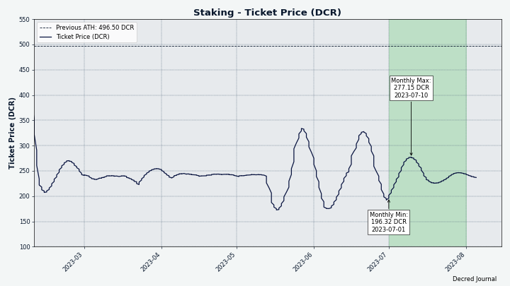
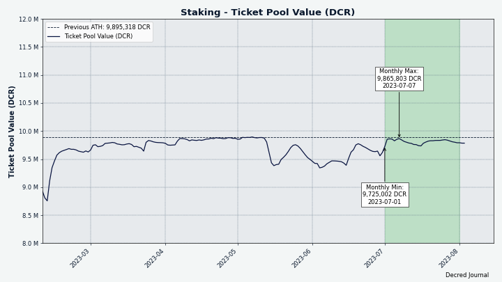
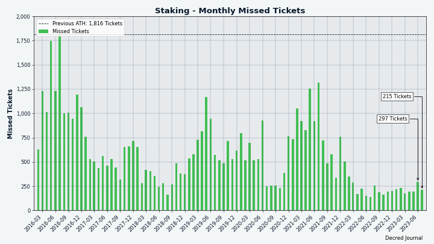

# Decred 月报 – 2023 年 7 月

_图片：@Exitus_

七月亮点：

- 两项共识变更提案（PoW 哈希函数和 PoW/PoS 补贴分割）获得社区的高票支持通过，新共识将于 8 月底激活（请尽快升级到 v1.8）。

- Cypherpunk Times 推出了更名后的网站（以前称为 Decred 杂志），并启动了除 Decred 之外的第一个提供内容的项目 Firo。

- Discord 现在再次桥接到 Matrix 房间，新的改进桥允许 Matrix 用户阻止个别 Discord 用户，Discord 上新成员的批准程序也得到了改进。

内容:

- [为即将到来的分叉进行升级！](#upgrade-for-the-coming-fork)
- [开发进展总结](#development)
- [人员](#people)
- [治理](#governance)
- [网络](#network)
- [生态系统](#ecosystem)
- [外展](#outreach)
- [活动](#events)
- [媒体](#media)
- [市场](#markets)
- [相关外部信息](#relevant-external)

## 为即将到来的分叉进行升级！

两项共识变更的投票已结束 [将 PoW 更改为 BLAKE3 和 ASERT](https://github.com/decred/dcps/blob/master/dcp-0011/dcp-0011.mediawiki) 和 [更改 PoW/PoS 区块奖励 至 1/89](https://github.com/decred/dcps/blob/master/dcp-0012/dcp-0012.mediawiki)，最初是 2023 年 3 月 [在 Politeia 上提出的](https://proposals.decred.org /record/a8501bc）。

这两项变更均已获得**批准**，赞成票超过 99%，投票率超过 60%。 提案状态更改为[锁定](https://docs.decred.org/governance/consensus-rule-voting/overview/)，并将在 8 月 29 日左右在区块 794,368 中激活。可以在 [投票仪表板](https://voting.decred.org/) 或访问 [dcrdata Agendas](https://dcrdata.decred.org/agendas)跟踪剩余时间。

建议所有用户升级到最新的[核心软件](https://github.com/decred/decred-binaries)、[独立DEX应用程序](https://github.com/decred/dcrdex/releases)，或 正在使用的任何[其他钱包](https://decred.org/wallets/)。 与往常一样，我们建议在运行之前[验证文件](https://docs.decred.org/advanced/verifying-binaries)。

<a id="development" />

## 开发进展总结

除非另有说明，否则下面报告的工作为“合并至核心存储库”状态。这意味着该工作已完成、审查并集成到高级用户可以[构建和运行](https://medium.com/@artikozel/the-decred-node-back-to-the-source-part-one-27d4576e7e1c)的源代码中，但普通用户尚不可用。

### dcrd

_[dcrd](https://github.com/decred/dcrd) 是一个完整的节点实现，为 Decred 在全球的点对点网络提供支持。_

以下工作已合并到未来版本的“master”中：

- 更新了“GetBlock”和“GetBlockHeader”命令以显示[新的工作哈希证明](https://github.com/decred/dcrd/pull/3154)。 对于 [DCP-11：将 PoW 更改为 BLAKE3 和 ASERT](https://github.com/decred/dcps/blob/master/dcp-0011/dcp-0011.mediawiki) 激活后的区块，*工作量证明哈希 * 将是新的 BLAKE3 哈希值。 对于 DCP-11 之前的区块，*区块哈希*和*工作哈希证明*将是相同的。 此更新使 [dcrdata](#dcrdata) 等用户能够轻松访问新的哈希值。
- 更新了 [Docker 镜像](https://github.com/decred/dcrd/pull/3158)，以使用较新的 Go 和 Alpine Linux 构建 dcrd 二进制文件。 节点管理员可以认为 Docker 是一个很好的安全选项，而不是使用具有更大攻击面的虚拟机。
- 更新了 RPC 服务器以[动态重新加载新的 RPC 证书](https://github.com/decred/dcrd/pull/3153)，无需关闭并重新启动。 这对于节点管理员来说是工作质量的改进，因为它使他们能够热交换服务器证书/密钥对以及任何潜在的客户端证书。 例如，当RPC服务器公开且其IP地址或域名发生变化时，需要更新证书。 另一个例子是当需要修改客户端证书以撤销客户端、添加新客户端或允许现有客户端更改其私钥时。 此更新非常强大，最大限度地减少了磁盘访问，不需要特定于平台的依赖项，并且能够抵御用户错误，以避免破坏工作配置。
- 显式配置的 RPC 客户端通过 HTTP 连接到 dcrd [使用 TLS v1.2 或更高版本](https://github.com/decred/dcrd/pull/3169)。 这已经是隐含的最小值，但现在更加清晰。

开发人员和内部更改合并在“master”中：

- 更新了挖矿代码中详细说明[ASERT计算系数](https://github.com/decred/dcrd/pull/3156)的注释，以便它们与共识代码注释相匹配。
-添加了[新的linter](https://github.com/decred/dcrd/pull/3157)，解决了一些[linter投诉](https://github.com/decred/dcrd/pull/3155)，以及 将 [linting 逻辑](https://github.com/decred/dcrd/pull/3161) 移动到测试脚本之外的自己的脚本中。
- 更新了[Github Actions](https://github.com/decred/dcrd/pull/3159)，并确保持续集成操作按照正确的顺序。
- 更新了 [golangci linter](https://github.com/decred/dcrd/pull/3163)，并更改了其[安装方法](https://github.com/decred/dcrd/pull/3162) “curl”改为“go install”，这样做的好处是可以减少供应链攻击带来的潜在安全风险。 此外，还缓存了二进制文件，以便将来更快地运行。
- 当前版本的 Go 处理循环的方式令人困惑。 “for 循环”和“range 循环”都模糊地处理内部循环变量，这导致代码难以阅读且难以调试。 开发人员必须非常谨慎地对待循环，但仍然可能会处理恼人的错误。 该问题的完整解释可以[阅读此处](https://go.googlesource.com/proposal/+/master/design/60078-loopvar.md)，特别是谈论[基本原理](https://go.googlesource.com/proposal/+/master/design/60078-loopvar.md#rationale-and-compatibility).。 Go 的未来版本（可能是 1.22）将对循环的处理方式进行重大更改。 虽然新的循环语义不会那么混乱和容易出错，但项目必须设置非常高的最低支持的 Go 版本，以避免使用旧版 Go 编译时出现错误。 为了确保 dcrd 代码能够在 Go 1.22 中正常工作，并保持向后兼容并与旧版本的 Go 正确编译，[更新了所有必要的循环](https://github.com/decred/dcrd/pull/3165) 这将在任何潜在问题有机会出现之前避免它们。

### dcrwallet

_[dcrwallet](https://github.com/decred/dcrwallet) 是命令行和图形界面钱包应用程序使用的钱包服务器。_

以下工作已合并到未来版本的“master”中。

用户可能会注意到的主要改进与通过 VSP 购买选票有关：

- 修复了错误的 VSP 选票购买的损坏的[重试逻辑](https://github.com/decred/dcrwallet/pull/2252)。 这个问题影响了很多用户。 任何第一次有效的购票行为都不会受到影响，但任何遇到错误的购买行为都不会被重试，这将导致选票无法添加到 VSP 中并错过投票。 值得庆幸的是，使用不同的 VSP 重新注册选票是一种解决方法，但显然这是糟糕的用户体验。
- 修复了[费用支付状态检查](https://github.com/decred/dcrwallet/pull/2269)可能被无理延迟的错误。 VSP 客户端将操作延迟一段随机时间，以帮助保护隐私。 由于这种不正确的延迟计算，钱包将在长达 2 小时内将费用支付报告为未确认，直到下一次检查发生，而此时费用实际上已发送并确认。 现在用户钱包更新得更快。
- 要求 VSP 客户[等待 VSP 确认费用支付](https://github.com/decred/dcrwallet/pull/2271)，然后再考虑完全购买 VSP 选票。 这消除了因用户广播自己的费用交易而导致的多种有问题的边缘情况，例如支付过低的费用或将付款发送到错误的地址。
- 修复了在 VSP 选票管理生命周期的各个阶段中某些 VSP 选票可能被[跳过且不更新](https://github.com/decred/dcrwallet/pull/2266) 的错误。 没有用户报告此错误引起的任何问题。 改进的错误处理代码使用了新的“Errors.Join”功能，该功能通过更新到 Go 1.20 提供，如下所述。

开发人员和内部更改合并在“master”中：

Go 1.20 解锁了[更好的错误处理](https://tip.golang.org/doc/go1.20#errors)，这激发了一些变化：

- 删除了一个[未使用的变量](https://github.com/decred/dcrwallet/pull/2262)和一个令人困惑的[自定义错误函数](https://github.com/decred/dcrwallet/pull/2263) dcrwallet 的内部错误定义。
- [放弃对 Go 1.19 的支持](https://github.com/decred/dcrwallet/pull/2267)，并增加对 Go 1.20 和 1.21.0-rc3 的支持。 这是因为 Go 1.19 没有 `Errors.Join`。
- 添加了 Go 1.20 标准库中的新 [`Errors.Join`](https://github.com/decred/dcrwallet/pull/2268) 函数。 这个新函数是一种将多个错误消息包装在一起的简单方法。 在 Go 1.19 及之前的版本中，使用 `Errors.Is`/`As` 函数在某种程度上是可能的，但包装的错误可能会被隐藏，这使得错误跟踪变得相当困难。 `Errors.Join` 是一个[更好的解决方案](https://blog.devgenius.io/wrapping-multiple-errors-in-go-1-20-78163ef5fc2c)。

此外:

- 更新了 [LRU 缓存](https://github.com/decred/dcrwallet/pull/2264) 以使用 Go 泛型并接受多种变量类型。 LRU 是一种标准缓存模式，一旦缓存已满，就会删除最近最少更新的值。 通用 LRU 缓存的主要优点是减少代码重复并更轻松地重用代码。 通过指定每个新 LRU 缓存实例的类型，这具有更明确的代码的额外好处，以及编译器更好的代码验证。 泛型是[在 Go 1.18 中添加的](https://go.dev/blog/go1.18)（2022 年 3 月），并且相对有争议，但这只是因为它们具有开发人员必须考虑的权衡。 理想情况下，Go 编译器将像对待具有特定变量类型的函数一样对待泛型函数，并且每个函数都将得到同样的优化。 实际上，情况并非总是如此。 泛型的好处有时是以更高的复杂性和[性能稍慢]为代价的。(https://planetscale.com/blog/generics-can-make-your-go-code-slower)。 在这种情况下，dcrwallet 目前很少使用泛型，因此对性能的影响很小。
- 改进和完善[钱包测试](https://github.com/decred/dcrwallet/pull/2260)，包括删除冗余代码。

  
### dcrctl

_[dcrctl](https://github.com/decred/dcrctl) 是 dcrd 和 dcrwallet 的命令行客户端。_

以下工作已合并到未来版本的“master”中：

- 从主模块中[删除了过时的依赖项](https://github.com/decred/dcrctl/pull/64)，并更新了[dcrd和dcrwallet模块](https://github.com/decred/dcrctl/ pull/67) 到最新版本。 值得注意的是，这使得 dcrd 的新的“getblock”和“getblockheader”详细结果可用。
- 更新了自述文件，建议开发人员在使用 dcrd 和 dcrwallet 的开发版本时使用本地 [Go Workspaces](https://github.com/decred/dcrctl/pull/66)。

### Decrediton

_[Decrediton](https://github.com/decred/decrediton) 是一款功能齐全的桌面钱包应用程序，集成了投票、StakeShuffle 混币、闪电网络、DEX 交易等功能。 它在有或没有完整的区块链（SPV 模式）的情况下运行。_

进行中：

- 更新到 [React v18](https://github.com/decred/decrediton/pull/3851)
- Ledger [后端功能](https://github.com/decred/decrediton/pull/3869) 和 [用户界面](https://github.com/decred/decrediton/pull/3874)
- 更新[法语](https://github.com/decred/decrediton/pull/3895)和[中文](https://github.com/decred/decrediton/pull/3893)翻译
  
7 月，@norwnd 提出了基于简单 2-of-2 多重签名的 [Decrediton 2FA 存储](https://www.reddit.com/r/decred/comments/15cyod5/decrediton_2fa_hoddle_safely/)。 这个想法是通过使用第二台设备（最初是 Android 智能手机）来签署交易，提供更安全的存储 DCR 的解决方案。 这应该可以防止钱包加密密码薄弱或笔记本电脑被盗等威胁。 作为一个额外的好处，它可以使不具备自行编写多重签名解决方案技能的普通用户更容易使用多重签名功能。 目前正处于早期讨论和反馈阶段，但已经做出了一些努力来测试 dcrwallet 中的多重签名功能，并测试 QR 码可以传递多少数据。

### vspd

_[vspd](https://github.com/decred/vspd) 是投票服务提供商使用的服务器软件。 VSP 代表其用户全天候 24/7 投票，不能窃取资金。_

[v1.2.1 版本](https://github.com/decred/vspd/releases/tag/release-v1.2.1) 中包含的更改：

- 修复了[交易广播](https://github.com/decred/vspd/pull/398)逻辑，以便在交易已经存在时不会生成错误（这不是问题）。 在调查 dcrwallet 的 VSP 客户端中的[重试中断](https://github.com/decred/dcrwallet/pull/2252) 问题时，注意到了这种缺失的错误情况。 这是一个预防性修复，目前还没有报告由此错误引起的问题。

### Lightning Network

_[dcrlnd](https://github.com/decred/dcrlnd)是Decred的闪电网络节点软件。 LN 使即时和低成本交易成为可能。_

- 改进了[关闭通道的追踪](https://github.com/decred/dcrlnd/pull/187)。 在 Decred LN 主网上观察到，一些已在链上关闭的通道仍在网络上公布。 虽然根本原因尚未确定，但此更改减少了无效通道公告的数量及其负面影响，特别是对于在 SPV 模式下运行的节点（例如 Bison Relay 客户端）。 这是通过保存已知已关闭的通道 ID 并使用该信息来跳过无效更新或避免昂贵的操作来实现的。

### DCRDEX

_[DCRDEX](https://github.com/decred/dcrdex) 是一种非托管的、尊重隐私的交易所，用于无信任交易，由原子交换提供支持。_

[向后移植修复](https://github.com/decred/dcrdex/pull/2432) 将包含在下一个 v0.6 补丁版本中：

- 服务器：[增加订单限制](https://github.com/decred/dcrdex/pull/2411)， 这应该可以解决某些用户无法提交订单的问题。
- 客户端：确保服务器知道客户端已[完成](https://github.com/decred/dcrdex/pull/2405)交易。 在某些情况下，客户端无法通知服务器已完成的匹配，这可能会对帐户的声誉产生负面影响。 通过此修复，客户端将不断重试消息，直到服务器收到并确认客户端已兑换（收到）资金。
- 客户端：更新了 [btcwallet 和 neutrino](https://github.com/decred/dcrdex/pull/2438) 依赖项以修复内置 BTC 钱包中的崩溃问题。 开发人员通常会避免升级已发布版本中的依赖项，以免引入新的错误。 不过，考虑到该 bug 造成的麻烦，而且距离 DCRDEX 的下一个主要版本发布还很遥远，这种情况是一个例外。
  
以下是在“master”中合并到未来版本中的更改。

用户：

- 改进了[应用程序设置流程](https://github.com/decred/dcrdex/pull/2385)。 设置应用程序密码后，用户将看到快速配置页面，允许启用 DEX 服务器并选择要激活的钱包。 之后，一个新页面将提醒用户备份他们的应用程序种子。 设置更改为钱包后显示的登陆页面。
- [切换](https://github.com/decred/dcrdex/pull/2372) 从 WebView 到 macOS 上的 [MacDriver](https://github.com/progrium/macdriver) 库。 这可以实现本机 macOS 行为，例如：保持应用程序在没有窗口的情况下运行、创建新窗口以及拥有停靠图标菜单。
- 如果钱包未同步并且没有可同步的对等节点，则禁止[进行交易](https://github.com/decred/dcrdex/issues/2436)。 这可以避免交易永远不会被挖掘并让用户感到困惑。
- 修复了误导性的“交易所需的操作”[启动消息](https://github.com/decred/dcrdex/pull/2428)，要求用户添加更多债券。 当债券交易尚未发送并且用户只需等待而不采取任何操作时，可能会发生这种情况。
- 修复了绿色三角形[自己订单的标记](https://github.com/decred/dcrdex/pull/2448)并不总是显示在深度图上的错误。

客户，内部变更：

- 实现了 [Decred](https://github.com/decred/dcrdex/pull/2433)、[Ethereum](https://github.com/decred/dcrdex/pull/2421) 一次性下多个订单的功能。 这将由做市机器人使用，并可能解锁交易优化。
- 重构和测试代码改进。
- 更新了 [npm 依赖项](https://github.com/decred/dcrdex/pull/2439) 以修复安全警告（DEX 在运行时未使用受影响的包）。

Bitcoin, 内部变化：

- 修复了[硬币选择](https://github.com/decred/dcrdex/pull/2435)逻辑中的错误。 这并不重要，因为它只影响“MultiTrade”功能，该功能尚未投入生产使用。

以太坊：

- 在代币审批表中添加了[法定货币](https://github.com/decred/dcrdex/pull/2427)。 需要一次性批准才能允许互换合约代表用户处理代币（例如 USDC）。 授予和撤销此权限都需要少量 ETH 交易。

正在进行的工作亮点：

- Decred：[DCR 质押]的基础(https://github.com/decred/dcrdex/pull/2290)。
- Polygon：[基础设施](https://github.com/decred/dcrdex/pull/2431) 工作包括 USDC 交易合约。
- Dash：[全节点钱包](https://github.com/decred/dcrdex/pull/2424)支持。
- Firo：[Electrum 轻钱包支持](https://github.com/decred/dcrdex/pull/2426)。
- 做市机器人的[余额管理](https://github.com/decred/dcrdex/pull/2332)。

_图片：DCRDEX 中重新设计的应用程序设置流程_

_图片：macOS 中的 Dock 菜单将列出所有 DEX 窗口_

### dcrdata

_[dcrdata](https://github.com/decred/dcrdata) 是 Decred 区块链和链下数据（如 Politeia 提案、市场等）的浏览器。_

- 将新的 BLAKE3 工作哈希证明添加到[区块详细信息页面](https://github.com/decred/dcrdata/pull/1970)。 如果 dcrdata 使用相当新版本的 dcrd 运行，它将[利用](https://github.com/decred/dcrdata/pull/1971)其[新更新的](https://github.com/ decred/dcrd/pull/3154) `GetBlockHeader` 命令可以更快地获取 PoW 哈希值。

### Timestamply

_[Timestamply](https://github.com/decred/dcrtimegui) 是一项由 Decred 区块链支持的时间戳文件免费服务。 时间戳证明某个文件在某个时刻已经存在。 这在保护数据完整性方面有一系列应用。_

- 将 GitHub 操作更新为 [使用 Go 1.20 构建](https://github.com/decred/dcrtime/pull/91)，并添加 linter 并修复他们的投诉。
- Decred 时间戳的 [JavaScript 库](https://github.com/decred/dcrtimejs) dcrtimejs 已从其[原始位置](https://github.com/tiagoalvesdulce/dcrtimejs)导入，成为 [decred](https://github.com/decred/dcrtimejs) GitHub 帐户的一部分。 dcrtimejs v1.0.0 版本已由财政部资助，作为 [时间戳重新设计](https://proposals.decred.org/record/855a506) 提案的关键要素。

### Bison Relay

_[Bison Relay](https://github.com/companyzero/bisonrelay) 是一个新的社交媒体平台，具有针对审查、监视和广告的强大保护，由 Decred 闪电网络提供支持。_

GUI 和 CLI 应用程序：

- 添加了“syncfreelist”配置选项来调整内部闪电网络节点使用的 bbolt 数据库。 将其设置为“false”可以提高运行性能，但会牺牲启动性能。

GUI 应用程序：

- 改进了帖子评论用户体验，现在评论线程可以[折叠或展开](https://github.com/companyzero/bisonrelay/pull/298)。
- 修复了新闻源未呈现[嵌入图像](https://github.com/companyzero/bisonrelay/pull/296)并显示“--embed”代码的错误。
  
CLI 应用程序：

- 添加了基本的 [`/backup` 命令](https://github.com/companyzero/bisonrelay/pull/297)。
- 添加了[内容过滤](https://github.com/companyzero/bisonrelay/pull/265)系统，该系统可以阻止消息在客户端级别显示给最终用户。 要创建过滤规则，用户需要指定它将在什么上下文中工作（直接聊天、群聊、帖子、帖子评论或所有）以及它应该匹配的内容（可以是简单的字符串或正则表达式）。 尝试“/helpfiltersadd”和“/helpfiltersaddrule”来了解它是如何工作的。 目前，它仅在 CLI 应用程序中公开，但将来可以将低级部分连接到 GUI 应用程序。
  

### 其它

- 所有旧版 VSP（当时称为“权益池”）均已从 dcrwebapi（为 Decrediton 提供支持的服务）和VSP 列表中[删除](https://github.com/decred/dcrwebapi/pull/158)，位于 decred.org。 2020 年 [vspd 版本](https://blog.decred.org/2020/06/02/A-More-Private-Way-to-Stake/) 已弃用旧版 VSP，并且所有已知公共服务器均已弃用。

<a id="people" />

## 人员

截至 8 月 1 日的社区统计数据（与 7 月 2 日相比）：

- [Twitter](https://twitter.com/decredproject) 关注者：53,328 (-230)
- [Reddit](https://www.reddit.com/r/decred/) 订阅者：12,747 (+9)
- [Matrix](https://chat.decred.org/) #普通用户：797 (+10)
- [Discord](https://discord.gg/GJ2GXfz) 用户：1,589 (+3)，已验证发帖人数：643 (+8)
- [Telegram](https://t.me/Decred) 用户：2,355 (-7)
- [YouTube](https://www.youtube.com/decredchannel) 订阅者：4,640 (+0)，观看次数：232.5K (+1.4K)

<a id="governance" />

## 治理

7 月份，新[国库](https://dcrdata.decred.org/treasury) 收到了 7,859 个 DCR，价值 12.1 万美元，7 月份的平均汇率为 15.40 美元。 4,943 DCR 用于支付承包商费用，按相同价格计算价值 7.6 万美元。

[国库支出交易](https://dcrdata.decred.org/tx/bf3fcf63697c2191260690aa8471088e863e4f25434564196f8110464b669a51)以 5,274 票赞成和 37% 的投票率获得批准，并于 7 月 25 日开采，它向 32 个承包商付款，范围从 1.5 DCR 到 1,692 DCR。 大部分 DCR 可能是为 5 月份的工作支付的，按照 17.13 美元的计费汇率，TSpend 的价值约为 85,000 美元。

截至 8 月 6 日，[旧国库](https://dcrdata.decred.org/address/Dcur2mcGjmENx4DhNqDctW5wJCVyT3Qeqkx) 和 [新国库](https://dcrdata.decred.org/treasury) 的总余额为 865,895 DCR（1,260 万） 美元价格为 14.56 美元。

_图片：DCR/USD走低导致国债流出增加_

_图片：国库余额等值美元_

7 月份完成投票的提案有 4 项：

- 一项以 2,400 美元资助开发包含中文内容的 Decred.club 网站并围绕其发展社区的[提案](https://proposals.decred.org/record/552c87e) 被拒绝，投票数为 28% 和 26% ％ 。
- 一项将 Decred Magazine 更名为 Cypherpunk Times 并在预算增加 44,000 美元的情况下继续制作一年的[提案](https://proposals.decred.org/record/4d3a8fc) - 以 95% 的赞成票和 47% 的赞成票获得批准 ％ 结果发现。
- 一项 [提案](https://proposals.decred.org/record/9e265ad) 制作了 90 秒的视频，让戴滑雪面具的人们用 12 种语言谈论 Decred，成本为 23,650 美元，获得批准，75% 的赞成票 和 42% 的投票率。
- 一项耗资 2,000 美元为 DCRDEX 制作推广网站的[提案](https://proposals.decred.org/record/20ba5cd) 被拒绝，30% 的赞成票和 34% 的投票率。

<a id="network" />

## 网络

**全网算力**: 7 月的 [全网算力](https://dcrdata.decred.org/charts?chart=hashrate&scale=linear&bin=day&axis=time) 以 52 PH/s开启，以 55 PH/s结束，最低为 49 PH/s，峰值为 69 PH/s。

_图片：Decred 算力_

8 月 1 日矿池 55 PH/s 算力分布[报告](https://miningpoolstats.stream/decred)：F2Pool 58%、Poolin 32%、BTC.com 8%、AntPool 3%。

截至 8 月 1 日，实际[开采](https://miningpoolstats.stream/decred)的 1,000 个区块的分布：F2Pool 52%、Poolin 38%、BTC.com 7%、AntPool 3%。

_图：历史矿池算力分布_

**Staking**: [选票价格](https://dcrdata.decred.org/charts?chart=ticket-price&axis=time&visibility=true-true&mode=stepped) 区间为 196-277 DCR.

_图片：票价稳定_

[锁定金额](https://dcrdata.decred.org/charts?chart=ticket-pool-value&scale=linear&bin=day&axis=time)为9.73-987万个DCR，意味着循环供应量的63.3-64.2%[ 参与](https://dcrdata.decred.org/charts?chart=stake-participation&scale=linear&bin=day&axis=time) 的权益证明。

_图片：完全锁定的 DCR 重新测试其 ATH_

_图片：每月错过的门票在六月份小幅上升后有所下降_

**VSP**: 截至 8 月 1 日，[14 个列出的 VSP](https://decred.org/vsp/) 总共管理了约 6,150 (-480) 张现场门票，占门票池的 15.1% (-1.4%)。

7 月份涨幅最大的是 [bass.cf](https://vspd.bass.cf/)（+96 张门票或+15%）和 [decredcommunity.org](https://vsp.decredcommunity.org/) （+37 票或+8%）。

_图片：VSP 管理的选票_

**节点**: [Decred Mapper](https://nodes.jholdstock.uk/user_agents) 整个月观察到 162 到 170 个 dcrd 节点。 8 月 1 日看到的 164 个节点的版本：v1.8.0 - 84%、v1.7.x - 11%、v1.9.0 开发版本 - 1.2%、v1.8.0 开发版本 - 0.6%、其他 - 4%。

_图片：大部分网络运行的是v1.8.0_

_Image：节点运营商已快速升级至 v1.8.0。 2023 年 1 月之前的红色区域表示我们当时拥有的数据不完整。_

[混合币](https://dcrdata.decred.org/charts?chart=coin-supply&zoom=jz3q237o-la8vk000&scale=linear&bin=day&axis=time&visibility=true-true-true)的份额在62.0-62.3%之间变化。 每日[混合量](https://dcrdata.decred.org/charts?chart=privacy-participation&bin=day&axis=time) 在 351K-486K DCR 之间变化。

_图片：DCR StakeShuffle _

_图片：交易量已经放暑假了。 [指标](https://coinmetrics.io/introducing-adjusted-estimates/) 由 Coin Metrics 定义。_

截至 8 月，Decred 的 [闪电网络](https://ln-map.jholdstock.uk/) 浏览器已看到 219 个节点 (+7)、445 个通道 (+18)，总容量为 188 DCR (-3) 1. 每个节点的这些统计数据都不同。 例如，@karamble 的节点在 8 月 1 日同一天报告了 220 个节点、464 个通道和 191 个 DCR 容量。

_图片：Decred 的闪电网络节点数量缓慢增长_

_图片：Decred 闪电网络容量稳定在 200 DCR 左右_

<a id="ecosystem" />

## 生态系统

Voting Service Providers:

- New VSP at [vote.dcr-swiss.ch](https://vote.dcr-swiss.ch/) has voted its first mainnet tickets and [applied](https://github.com/decred/dcrwebapi/pull/178) to get listed in Decrediton wallet and the [VSP page](https://decred.org/vsp/). DCR Swiss has a low fee of 0.25%. Out of 14 existing VSPs this is the third lowest fee after dcrhive.com (0.1%) and vspd.bass.cf (0.2%).

Wallets:

- Android and iOS Decred wallets will stop syncing in late August when new [consensus upgrades](https://voting.decred.org/) activate. The apps have been removed from Google Play and Apple Store to prevent users from installing apps that are no longer maintained. If you have used Android or iOS Decred wallets feel free to comment in a [Reddit survey](https://www.reddit.com/r/decred/comments/15eokjz/survey_have_you_used_decred_mobile_apps/).

Exchanges:

- EXMO [announced](https://info.exmo.me/ru/uvedomleniya/exmo-me-exclude-from-listing-five-crypto/) on July 6 that they will delist DCR and 3 other tokens by July 20 due to low liquidity. EXMO was the only exchange to list DCR via a non-expensive [proposal](https://proposals.decred.org/proposals/950e8149e594b01c010c1199233ab11e82c9da39174ba375d286dc72bb0a54d7) that got approved in May 2019 and fulfilled in [June 2019](https://exmo.com/en/news_view?id=2776).

- #trading members [discovered](https://matrix.to/#/!lDZCzVQjFoJsXMPkvr:decred.org/$aTBeqNdAk4d03IEEybIk8WtVo-Wfe0JYFwVX0fZsIh4) on July 9 that DCR was trading around $20 at Indian [Bitbns](https://bitbns.com/trade/#/dcr) while it was around $16 on other exchanges. As of July 31 DCR was still trading at a premium and with significant 24-hour volume of $68K making DCR/INR a top 10 pair at Bitbns (if we trust reported volumes of course). DCR [price chart](https://bitbns.com/trade/#/dcr) suggests it was listed in May 2022.

Communication systems:

- Public access to Twitter has been mostly [unavailable](https://techcrunch.com/2023/07/05/twitter-silently-removes-login-requirement-for-viewing-tweets/) between June 30 and July 5. Browsing Twitter required login and was subject to rate limits even for paid accounts. According to Elon Musk it was a [temporary emergency measure](https://www.reuters.com/technology/twitter-now-needs-users-sign-view-tweets-2023-06-30/) to combat AI bots which were pulling so much data from Twitter that it effectively became a denial of service attack. Public API restrictions also [broke Nitter](https://github.com/zedeus/nitter/issues/919), a lightweight alternative for browsing [@decredproject](https://nitter.net/decredproject) and other accounts. Login requirement was [removed](https://techcrunch.com/2023/07/05/twitter-silently-removes-login-requirement-for-viewing-tweets/) on July 5. Despite all problems and [revelations](https://twitter.com/elonmusk/status/1670117122650050561) Twitter remains Decred's main outreach platform with 53.3K followers as of Aug 1.

- The two-way bridge between Matrix and Discord is back! It was made possible by the new [user verification](202306.md#ecosystem) flow that is much better at preventing spam. The new bridge allows blocking individual Discord users on the Matrix side without affecting other Discord users, this was not possible with the old bridge. Also, message editing should propagate in both directions. New bridge is hosted by [t2bot.io](https://t2bot.io/discord/), a free service providing bots and bridges for [Matrix](https://matrix.org/) communities. It is operated by a single person and is supported by [donations](https://t2bot.io/donations/). As of writing the following Matrix rooms are bridged to Discord: #101, #dex, #marketing, #media, #memes, #proposals, #showerthoughts, #support, and of course #trading.

Other news:

- In May both [@StakeShuffle_](https://twitter.com/StakeShuffle_/status/1660015673102180353) and [@dcrtimestampbot](https://twitter.com/dcrtimestampbot/status/1660015663514107904) announced that the bots are "down until further notice due to recent twitter-api changes". The bots have been developed by @cli\_query and sponsored by a total of 3 low-budget [proposals](https://proposals.decred.org/user/3b9b30d5-1065-4e48-b1b6-3f558d0cb378?tab=submitted%20proposals). It appears that developer time is [limited](https://proposals.decred.org/record/1a290d8) to maintain these projects, but the Python source code of [StakeShuffle_](https://github.com/JC60522/StakeShuffle_BOT) and [dcrtimestampbot](https://github.com/JC60522/dcr_timestampbot) is available on GitHub for contributors to pick up and improve.

- [Cypherpunk Times](https://cypherpunktimes.com/) is live. See the [Outreach](#outreach) section below for more details.

Join our [#ecosystem](https://chat.decred.org/#/room/#ecosystem:decred.org) chat to get more news about Decred services.

Warning: the authors of the Decred Journal have no idea about the trustworthiness of any of the services above. Please do your own research before trusting your personal information or assets to any entity.

<a id="outreach" />

## Outreach

First iteration of the new multi-coin publication [Cypherpunk Times](https://cypherpunktimes.com/) is live! It is a continuation and a rebrand of Decred Magazine, approved and funded by Decred stakeholders in [July 2023](https://proposals.decred.org/record/4d3a8fc). The new social media handle is `@cypherpunktimes` on [Twitter](https://twitter.com/cypherpunktimes), [Facebook](https://www.facebook.com/cypherpunktimes), and [Spotify podcasts](https://podcasters.spotify.com/pod/cypherpunktimes). Any support is greatly appreciated.

Firo is the first project to contribute content to Cypherpunk Times. In July Firo has [onboarded](https://matrix.to/#/!NkCFEoJGXyDMwLfgMb:decred.org/$hoWcufElq2WAw5RcQ2GM1pE2ASKDme8q9-RZTQfvv04) 3 content and published their first [article](https://www.cypherpunktimes.com/unveiling-spark-public-testnet-launch-date-confirmed/).

TikTok account `@decredmagazine` was renamed to [@dearcryptopunk](https://www.tiktok.com/@dearcryptopunk). Moving forward its scope will be extended from supporting Cypherpunk Times to general Decred outreach, and it will move under the umbrella of [Decred Vanguard](https://proposals.decred.org/record/0a1b782) proposal. Twitter account [@decredmagazine](https://twitter.com/decredmagazine) will keep running for now to support Decred-only content.

Cypherpunk Times engagement stats for July:

- Total number of articles on Cypherpunk Times: 497
- Newsletter subscribers: 104
- New CT posts and newsletters sent: 18
- Active social media campaigns: 68
- Completed social media campaigns: 2
- Social media posts: 128
- Likes: 496
- Re-tweets: 120
- Social media followers across all platforms and accounts (including [@DecredSociety](https://twitter.com/DecredSociety) and the old [@decredmagazine](https://twitter.com/decredmagazine)): 1,440

Totti from [BTC-ECHO](https://www.btc-echo.de/) has collected two rounds of feedback posted across [Politeia](https://proposals.decred.org/record/49e373b) and the [#writers](https://chat.decred.org/#/room/#writers:decred.org) chat and incorporated it in the first German article. BTC-ECHO [suggested](https://proposals.decred.org/record/49e373b/comments/30) to wait through the lower seasonal activity and publish the first article in mid-August. The delay was used to [add mentions](https://matrix.to/#/!NkCFEoJGXyDMwLfgMb:decred.org/$-Y8Sj1vafMV3bFwDTRyMavH9ab6ki2zntLvdmz6LBEw) of hardfork resistance and on-chain governance which are key to Decred consensus.

Monde PR's achievements:

- Pitched two commentary opportunities
- Pitched three story ideas to target crypto publications
- Secured one media interview

Secured the following media placements:

- @Tivra took part in a [Twitter Space](https://twitter.com/i/spaces/1djGXlqNBeeGZ) hosted by [The Rollup](https://twitter.com/therollupco) podcast talking about DCRDEX.

<a id="media" />

## Media

**Selected articles:**

- [How-to DCRDEX on Raspberry Pi with Umbrel](https://www.cypherpunktimes.com/how-to-dcrdex-on-raspberry-pi-with-umbrel/) by @karamble
- [Is it time to overcome traditional social media?](https://www.cypherpunktimes.com/is-it-time-to-overcome-traditional-social-media/) by @Joao
- [The ripple effect on cryptocurrency regulation](https://www.cypherpunktimes.com/the-ripple-effect-on-cryptocurrency-regulation/) by @Tivra
- [Decred vs Ethereum: Staking on the future](https://www.cypherpunktimes.com/decred-vs-ethereum-staking/) by @Joao

**Videos:**

- [Decred DEX standalone: Atomic-swaps in a web browser](https://www.youtube.com/watch?v=9U3fNFQFkkE) by @phoenixgreen - also as a [text post](https://www.cypherpunktimes.com/decred-dex-standalone-atomic-swaps-in-a-web-browser/)
- [Decred Decentralized Exchange: Creating a fidelity bond](https://www.youtube.com/watch?v=5Z2jISaNkxc) by @phoenixgreen - also as a [text post](https://www.cypherpunktimes.com/decred-decentralized-exchange-creating-a-fidelity-bond/)
- [Bison Relay Lightning Network management: How to rebalance your channels](https://www.youtube.com/watch?v=LD54opBdkh8) by @phoenixgreen - also as a [text post](https://www.cypherpunktimes.com/bison-relay-lightning-network-management-how-to-rebalance-your-channels/)
- [Using market maker bots on decentralised exchange: first look](https://www.youtube.com/watch?v=cyp_vnQRCXE) by @phoenixgreen - also as a [text post](https://www.cypherpunktimes.com/using-market-maker-bots-on-decentralised-exchange-first-look/)

Livestream:

- [Living on crypto & the freedom of exchange](https://www.youtube.com/watch?v=riW1HbhfoIw) by @phoenixgreen and @Exitus feat. [Joel Valenzuela](https://twitter.com/TheDesertLynx) of Dash, Reuben Yap of Firo, and @Tivra

**Audio:**

- [Crypto Evolution: Rising above volatility with vision](https://twitter.com/i/spaces/1yNxaNYLwwqKj) - Twitter Space by @Tivra feat. @Exitus and Joel Valenzuela discussing the shutdown of DashDirect and Cake Pay, tipping, P2P services, and more - also as a [podcast](https://podcasters.spotify.com/pod/show/cypherpunktimes/episodes/Crypto-Evolution-Rising-Above-Volatility-with-Vision-e26qm28)

**Art and fun:**

- July is the [National Bison Month](https://nationaltoday.com/national-bison-month/) in the U.S.
- [DEX island](https://www.cypherpunktimes.com/dex-island/) by @OfficialCryptos
- [Supply shock infographic](https://www.reddit.com/r/decred/comments/14vruz2/supply_shock_infographic_wip/) by @Tivra
- Decred [art contest](https://twitter.com/exitusdcr/status/1680287503528370179) by @Exitus - four [winners](https://twitter.com/exitusdcr/status/1681067908699389952) got their DCR
- Decred [elevator pitch contest](https://twitter.com/WasPraxis/status/1680928961415589889) by @Tivra had [two winners](https://twitter.com/waspraxis/status/1684173637623119872)
- [DCR top tier list](https://matrix.to/#/!lDZCzVQjFoJsXMPkvr:decred.org/$Im4VJ9nJDedNOOCaKlxSu9a9N7HCA9fJEUd-W3ubVMY) by @Void

_Image: DCR top tier list by @Void_

**Translations:**

- [How-to DCRDEX on Raspberry Pi with Umbrel](https://www.cypherpunktimes.com/how-to-dcrdex-on-raspberry-pi-with-umbrel/) - in [Chinese](https://github.com/Decred-CN/articles/blob/master/How-To_DCRDEX_on_Raspberry_Pi_with_Umbrel.md) by @Dominic
- [Using market maker bots on decentralised exchange: first Look](https://www.cypherpunktimes.com/using-market-maker-bots-on-decentralised-exchange-first-look/) - in [Chinese](https://github.com/Decred-CN/articles/blob/master/Using%20Market%20Maker%20Bots%20on%20Decentralised%20Exchange:%20First%20Look.md)
- Note that all content translated to Chinese is published on WeChat since 2019.
- Decred Journal May-June got a total of 3 new [translations](https://xaur.github.io/decred-news/) to Arabic (@arij, @abdulrahman4) and Chinese (@Dominic). Thank you for your work!

**Discussions:**

- [ChatGPT4 attempting to decrypt @saender's TA](https://www.reddit.com/r/decred/comments/14wlx9u/some_technical_analysis_based_on_saender_post/)
- [We need a new Internet](https://news.ycombinator.com/item?id=36676452) on Hacker News
- A reply to James Prestwich's question ["so did Decred ever change the world?"](https://twitter.com/_prestwich/status/1679630835019030531)

<a id="markets" />

## Markets

In July DCR was trading between USDT 13.70-19.75 and BTC 0.00047-0.00064. The average daily rate was $15.40.

\#trading members [observed](https://matrix.to/#/!lDZCzVQjFoJsXMPkvr:decred.org/$qOBXWvgSgINClwaPNzI9IXoqu9BLuqZdmJic2qTwMLw) a $1 million sell wall on Binance DCR/USDT. Also, trading volumes across all markets were [unusually low](https://matrix.to/#/!lDZCzVQjFoJsXMPkvr:decred.org/$o6Rmw5-8oiHBwRIGWWnE3qMpJTXmm__ad7HoxyJVioo) on some days, possibly due to summer time.

_Image: DCR performance compared to other privacy coins by @saender_

_Image: Decred Pricing Metrics by @bochinchero_

The [chart](https://matrix.to/#/!lDZCzVQjFoJsXMPkvr:decred.org/$H540G0LtMAsa1Vc1ANY0A2Jf6CuN0uTyr6XKQO68nq8) above is based on same [Staked Realized Value](https://bochinchero.medium.com/decred-on-chain-staked-realised-value-444ab5a146d8) model we showed [last month](202306.md#markets) but with price instead of market cap.

_Image: DCR/BTC in June-July_

_Image: DCRDEX monthly volume in USD does not like summer time_

<a id="relevant-external" />

## Relevant External

DeFi lending platform Curve, a pillar of DeFi on Ethereum, has been [hacked](https://twitter.com/CurveFinance/status/1685693202722848768). The hack involved using a malfunctioning reentrancy lock in certain versions of Vyper which made certain pools but not others vulnerable to being drained. Similar protocols Metronome and Alchemix were also affected, and together the 3 projects [lost](https://www.coindesk.com/markets/2023/08/04/looter-behind-61m-curve-hack-starts-returning-assets-raising-hope-for-recovery/) $61.7 million worth of assets. The attacker was only able to drain some of the affected pools because when the action started many white hat hackers stepped in to rescue their funds. By Aug 7 a reported 73% of the assets had been [recovered](https://www.coindesk.com/tech/2023/08/07/curve-recoups-73-of-hacked-funds-bolstering-crv-sentiment/), some from the white hats but also significant amounts from the attacker. Curve offered a 10% bounty for voluntary return of funds until August 6, but with over $18 million still in the hacker's possession at the deadline the chance to end the matter there was lost and the bounty opened up to public investigators who could help to secure recovery.

Gitcoin has [launched](https://www.theblock.co/post/241425/gitcoins-layer-2-public-goods-network-goes-live-on-mainnet) an Ethereum Layer 2 called Public Goods Network (PGN), it uses the Optimism stack and a proportion of the sequencer fees will be collected in a pot to fund public goods.

Arkham Intelligence has launched a crypto identity data marketplace or "[doxx to earn program](https://protos.com/arkham-intelligence-draws-ire-for-dox-to-earn-program/)", where users can place bounties on the identity of certain crypto wallet addresses and eager researchers attempt to discover who owns the wallet for a pay day. Arkham also showed casual disregard for its own users by generating referral links using an easily reversed algorithm [revealing](https://www.coindesk.com/business/2023/07/10/crypto-startup-arkham-has-apparently-been-doxxing-privacy-obsessed-users-for-months/) the email addresses of the promoters.

Sam Altman's Worldcoin [launched](https://www.bbc.com/news/technology-66128111) its eyeball-scanning orbs in 1,500 locations around the world, allowing people to scan their iris to set up a wallet and receive 25 free WLD (worth ~$50). The prospect of an AI company founder sending orbs out into the world to scan peoples' eyes for small handouts has been decried as dystopian by many in the crypto space, Worldcoin is not a popular project. However, Vitalik Buterin has recently published a blog [post](https://vitalik.eth.limo/general/2023/07/24/biometric.html) about biometric proof of personhood where he seems to find quite a lot of merit in Worldcoin's approach, suggesting it protects privacy better than most of the alternative approaches to proof of personhood, although still having some negative aspects. A day after Worldcoin's launch, the UK data watchdog was [reported](https://protos.com/worldcoin-eyed-by-uk-data-watchdog-day-after-launch-avoided-us/) to be looking into whether it complies with data protection regulations. In Kenya, where Worldcoin had been in communication with the Office of Data Protection Commissioner since April, it was thought to be operating legally but its scanning operations were [suspended](https://www.coindesk.com/policy/2023/08/03/kenya-appears-to-have-flip-flopped-on-worldcoins-data-practices/) and it's not clear if this was self-imposed by Worldcoin to improve on "crowd control" issues with long lines at the sign-up stations, or if the authorities [changed](https://techcrunch.com/2023/08/02/kenya-suspends-worldcoin-scans-over-security-privacy-and-financial-concerns/) their mind about its legality.

FedNow, the US government's instant payments system, [launched](https://techcrunch.com/2023/07/21/fednow-is-finally-live-in-the-us/) with 35 financial institutions set up to use the service which allows for 24/7 instant settlement. This is seen as bridging a gap where the US is quite behind other jurisdictions that already have such instant bank transfer facilities. It is anticipated that it will take some time for uptake of FedNow by institutions to make the service broadly available to end users.

The Token Engineering Commons (TEC) has [completed](https://medium.com/token-engineering-commons/expertise-and-quadratic-funding-bd4f0c5c3e23) the first round of its new grants program, using Quadratic Funding (like Gitcoin grants) to distribute a funding pool of $25,000 and drawing donations of $6,162 to augment this and determine where the grants would go. TEC have added to the usual Quadratic Funding model (in which a greater number of individual donations to a project means a larger slice of the matching pool) by adding a mechanism for the expression of "Subject Matter Expertise". Contributors who had TEC tokens and/or NFT knowledge attestation certificates in their wallet were considered to be "experts" and a stronger weight was applied to their donations when determining the matching amount - this was done to tackle a perceived issue where projects that are good at mobilising community support do the best in Quadratic Funding rounds.

Legislation [concerning](https://www.coindesk.com/policy/2023/07/28/us-stablecoin-bill-takes-big-step-despite-fight-from-democrats-white-house/) stablecoins has made it out of committee in the US Congress for the first time, meaning that should soon be voted on and if approved passed to the Senate. The bill had bipartisan support for some of its life but Democrats withdrew that support late in the process over a failure to negotiate a resolution to some points of conflict, lessening the bill's chances of making it all the way into law. One key point of dispute seems to be the role of a federal regulator to oversee stablecoins licensed at the state level, with Democrats pushing for this kind of oversight and Republicans rejecting it.

The much-hyped round of Bitcoin ETF applications from major financial institutions [incorporates](https://www.coindesk.com/business/2023/07/11/blackrocks-bitcoin-etf-application-takes-surveillance-to-the-next-level/) a new feature, Surveillance Sharing Agreements (SSAs) with Coinbase as a provider of market intelligence where the ETF providers and regulators can pull data directly including the capacity to request personally identifiable information from Coinbase where this is deemed necessary to investigating or preventing market manipulation. In previous ETF filings the market provider would push information to regulators about suspicious activity, the SSAs turn this around to give more oversight. SSA with Coinbase was first introduced by BlackRock but has been copied by the other applicants in this round of ETF applications.

A European Commission document about its Metaverse strategy was [leaked](https://www.coindesk.com/policy/2023/07/06/eus-leaked-metaverse-strategy-proposes-regulatory-sandbox-new-global-governance/) ahead of its publication. The document describes the potential of virtual worlds to being "unprecedented opportunities in many societal areas", and the need to remove barriers to new organizational forms such as DAOs to realise their benefits.

Coinbase CEO Brian Armstrong has [revealed](https://protos.com/sec-coinbase-demand-would-have-meant-end-of-crypto-in-the-us/) that shortly before suing them the SEC demanded that they drop all assets except Bitcoin, which made it an easy choice for the company to take the matter to court because that would have meant the effective end of their business in the US.

Binance's Australian headquarters has been [raided](https://protos.com/binance-australia-raided-by-regulator-just-weeks-after-europe-hq-raid/) by the Australian Securities and Investments Commission (ASIC), in an investigation into unlawful derivatives dealings that involved mislabelling retail and institutional customers. Binance also [withdrew](https://protos.com/binance-withdraws-germany-crypto-license-request-as-europe-bites-back/) its application for a license in Germany, after being told that it was not going to be granted in its current form. After Binance US lost its banking partner BTC has been trading at a [discount](https://protos.com/scoop-major-crypto-arbitrage-fund-says-binance-us-discounts-arent-worth-risk/), something similar happened in Australia in May.

Binance has completed [integrating](https://cointelegraph.com/news/binance-integration-bitcoin-btc-lightning-network) Bitcoin's Lightning Network.

The LBRY company has [shut down](https://decrypt.co/148288/lbry-token-plummets-file-sharing-crypto-project-shuts-down) after losing its case against the SEC, having its LBC token sales defined as unregistered securities offerings and being restricted from doing any more of this without first "registering with the SEC". The LBRY protocol lives on, it was never the target of the litigation, and the LBC token's status remains ambiguous as to whether it is now a security, since the SEC have bankrupted the incorporated "common enterprise" that token-holders were deemed to seek profit from.

Richard Heart, mastermind and primary beneficiary of the Hex and PulseChain projects, has been [sued](https://www.coindesk.com/policy/2023/07/31/us-sec-sues-richard-heart-hex-pulsechain-on-unregistered-securities-fraud-allegations/) by the SEC for securities fraud violations. Although the Heart/Hex ecosystem is widely regarded as a scam, it has been [suggested](https://twitter.com/collins_belton/status/1686064809467396096) by [several](https://twitter.com/lex_node/status/1686030110443315200) crypto legal personalities that the case doesn't seem very strong. The HEX terms referred to sacrificing money into a black box mechanism and Heart himself was very [clear](https://www.youtube.com/shorts/tlFC_NhoRsQ) that he was spending a lot of the proceeds on designer clothes, portraying this as part of a marketing strategy which was going to help pump the price of the related tokens.

Alex Mashinsky, former CEO of Celsius, has been [arrested](https://protos.com/mashinsky-charged-by-doj-cftc-sec-and-ftc-year-on-from-celsius-bankruptcy/) and charged with a number of crimes including wire fraud and market manipulation. The Chief Revenue Officer was also charged. The filing indicates that Celsius was actively manipulating the price of CEL tokens while lying about key aspects of its performance, pumping and dumping the tokens to cash our large sums, $42 million allegedly in Mashinsky's case.

A [report](https://www.elliptic.co/hubfs/Elliptic_Report_Crypto%20and%20the%20Global%20Fentanyl%20Trade.pdf) by Elliptic researchers has identified Russian (Garantex) and Australian crypto exchanges as key intermediaries in facilitating the trade in Fentanyl precursors. They [identified](https://protos.com/centralized-crypto-exchanges-used-to-buy-32m-in-fentanyl-precursors-elliptic/) and communicated with over 100 sellers who were ready to ship Fentanyl or its precursor chemicals, and followed the crypto payment addresses to find out about their other transactions. In this way they uncovered addresses receiving $19M in Bitcoin and $13M in USDT, mostly from certain centralized exchanges.

Bittrex has [reminded](https://protos.com/bittrex-reminds-us-customers-to-withdraw-crypto-or-risk-unforeseen-issues/) its US customers to withdraw crypto assets from the bankrupt platform, they have until August 31st but Bittrex suggests doing it sooner rather than later for fear of "unforeseen issues".

Blockchain technology broke new ground again in the realm of gambling, with the world's first live hamster racing [platform](https://hamsters.gg/) [launching](https://www.coindesk.com/markets/2023/07/21/move-over-shiba-inu-crypto-community-flirts-with-hamster-race-betting/), where users can deposit ETH, BNB or BUSD and gamble it away betting on which hamster crosses the line first. Based on observation of several races (which are streamed on Twitch) the hamsters don't so much race as wander around (or not), showing very little interest in the finish line or motivation to get there first.

That's all for July. Suggest news for the next issue in our [#journal](https://chat.decred.org/#/room/#journal:decred.org) chat room.

## About

This is issue 61 of Decred Journal. Index of all issues, mirrors, and translations is available [here](https://xaur.github.io/decred-news/).

Most information from third parties is relayed directly from the source after a minimal sanity check. The authors of the Decred Journal cannot verify all claims. Please beware of scams and do your own research.

Credits (alphabetical order):

- writing, editing, publishing: bee, bochinchero, Exitus, jz, karamble, kozel, l1ndseymm, phoenixgreen, richardred, zippycorners
- reviews and feedback: davecgh, jholdstock
- title image: Exitus
- funding: Decred stakeholders
