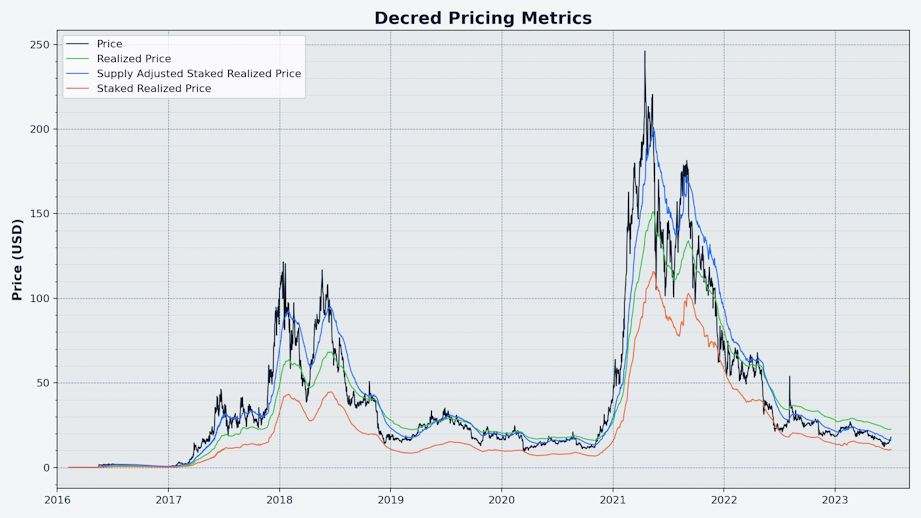

# Decred 月报 – 2023 年 7 月

_图片：@Exitus_

七月亮点：

- 两项共识变更提案（PoW 哈希函数和 PoW/PoS 补贴分割）获得社区的高票支持通过，新共识将于 8 月底激活（请尽快升级到 v1.8）。

- Cypherpunk Times 推出了更名后的网站（以前称为 Decred 杂志），并启动了除 Decred 之外的第一个提供内容的项目 Firo。

- Discord 现在再次桥接到 Matrix 房间，新的改进桥允许 Matrix 用户阻止个别 Discord 用户，Discord 上新成员的批准程序也得到了改进。

内容:

- [为即将到来的分叉进行升级！](#upgrade-for-the-coming-fork)
- [开发进展总结](#development)
- [人员](#people)
- [治理](#governance)
- [网络](#network)
- [生态系统](#ecosystem)
- [外展](#outreach)
- [活动](#events)
- [媒体](#media)
- [市场](#markets)
- [相关外部信息](#relevant-external)

## 为即将到来的分叉进行升级！

两项共识变更的投票已结束 [将 PoW 更改为 BLAKE3 和 ASERT](https://github.com/decred/dcps/blob/master/dcp-0011/dcp-0011.mediawiki) 和 [更改 PoW/PoS 区块奖励 至 1/89](https://github.com/decred/dcps/blob/master/dcp-0012/dcp-0012.mediawiki)，最初是 2023 年 3 月 [在 Politeia 上提出的](https://proposals.decred.org/record/a8501bc)。

这两项变更均已获得**批准**，赞成票超过 99%，投票率超过 60%。 提案状态更改为[锁定](https://docs.decred.org/governance/consensus-rule-voting/overview/)，并将在 8 月 29 日左右在区块 794,368 中激活。可以在 [投票仪表板](https://voting.decred.org/) 或访问 [dcrdata Agendas](https://dcrdata.decred.org/agendas)跟踪剩余时间。

建议所有用户升级到最新的[核心软件](https://github.com/decred/decred-binaries)、[独立DEX应用程序](https://github.com/decred/dcrdex/releases)，或 正在使用的任何[其他钱包](https://decred.org/wallets/)。 与往常一样，我们建议在运行之前[验证文件](https://docs.decred.org/advanced/verifying-binaries)。

<a id="development" />

## 开发进展总结

除非另有说明，否则下面报告的工作为“合并至核心存储库”状态。这意味着该工作已完成、审查并集成到高级用户可以[构建和运行](https://medium.com/@artikozel/the-decred-node-back-to-the-source-part-one-27d4576e7e1c)的源代码中，但普通用户尚不可用。

### dcrd

_[dcrd](https://github.com/decred/dcrd) 是一个完整的节点实现，为 Decred 在全球的点对点网络提供支持。_

以下工作已合并到未来版本的“master”中：

- 更新了“GetBlock”和“GetBlockHeader”命令以显示[新的工作哈希证明](https://github.com/decred/dcrd/pull/3154)。 对于 [DCP-11：将 PoW 更改为 BLAKE3 和 ASERT](https://github.com/decred/dcps/blob/master/dcp-0011/dcp-0011.mediawiki) 激活后的区块，*工作量证明哈希 * 将是新的 BLAKE3 哈希值。 对于 DCP-11 之前的区块，*区块哈希*和*工作哈希证明*将是相同的。 此更新使 [dcrdata](#dcrdata) 等用户能够轻松访问新的哈希值。
- 更新了 [Docker 镜像](https://github.com/decred/dcrd/pull/3158)，以使用较新的 Go 和 Alpine Linux 构建 dcrd 二进制文件。 节点管理员可以认为 Docker 是一个很好的安全选项，而不是使用具有更大攻击面的虚拟机。
- 更新了 RPC 服务器以[动态重新加载新的 RPC 证书](https://github.com/decred/dcrd/pull/3153)，无需关闭并重新启动。 这对于节点管理员来说是工作质量的改进，因为它使他们能够热交换服务器证书/密钥对以及任何潜在的客户端证书。 例如，当RPC服务器公开且其IP地址或域名发生变化时，需要更新证书。 另一个例子是当需要修改客户端证书以撤销客户端、添加新客户端或允许现有客户端更改其私钥时。 此更新非常强大，最大限度地减少了磁盘访问，不需要特定于平台的依赖项，并且能够抵御用户错误，以避免破坏工作配置。
- 显式配置的 RPC 客户端通过 HTTP 连接到 dcrd [使用 TLS v1.2 或更高版本](https://github.com/decred/dcrd/pull/3169)。 这已经是隐含的最小值，但现在更加清晰。

开发人员和内部更改合并在“master”中：

- 更新了挖矿代码中详细说明[ASERT计算系数](https://github.com/decred/dcrd/pull/3156)的注释，以便它们与共识代码注释相匹配。
-添加了[新的linter](https://github.com/decred/dcrd/pull/3157)，解决了一些[linter投诉](https://github.com/decred/dcrd/pull/3155)，以及 将 [linting 逻辑](https://github.com/decred/dcrd/pull/3161) 移动到测试脚本之外的自己的脚本中。
- 更新了[Github Actions](https://github.com/decred/dcrd/pull/3159)，并确保持续集成操作按照正确的顺序。
- 更新了 [golangci linter](https://github.com/decred/dcrd/pull/3163)，并更改了其[安装方法](https://github.com/decred/dcrd/pull/3162) “curl”改为“go install”，这样做的好处是可以减少供应链攻击带来的潜在安全风险。 此外，还缓存了二进制文件，以便将来更快地运行。
- 当前版本的 Go 处理循环的方式令人困惑。 “for 循环”和“range 循环”都模糊地处理内部循环变量，这导致代码难以阅读且难以调试。 开发人员必须非常谨慎地对待循环，但仍然可能会处理恼人的错误。 该问题的完整解释可以[阅读此处](https://go.googlesource.com/proposal/+/master/design/60078-loopvar.md)，特别是谈论[基本原理](https://go.googlesource.com/proposal/+/master/design/60078-loopvar.md#rationale-and-compatibility).。 Go 的未来版本（可能是 1.22）将对循环的处理方式进行重大更改。 虽然新的循环语义不会那么混乱和容易出错，但项目必须设置非常高的最低支持的 Go 版本，以避免使用旧版 Go 编译时出现错误。 为了确保 dcrd 代码能够在 Go 1.22 中正常工作，并保持向后兼容并与旧版本的 Go 正确编译，[更新了所有必要的循环](https://github.com/decred/dcrd/pull/3165) 这将在任何潜在问题有机会出现之前避免它们。

### dcrwallet

_[dcrwallet](https://github.com/decred/dcrwallet) 是命令行和图形界面钱包应用程序使用的钱包服务器。_

以下工作已合并到未来版本的“master”中。

用户可能会注意到的主要改进与通过 VSP 购买选票有关：

- 修复了错误的 VSP 选票购买的损坏的[重试逻辑](https://github.com/decred/dcrwallet/pull/2252)。 这个问题影响了很多用户。 任何第一次有效的购票行为都不会受到影响，但任何遇到错误的购买行为都不会被重试，这将导致选票无法添加到 VSP 中并错过投票。 值得庆幸的是，使用不同的 VSP 重新注册选票是一种解决方法，但显然这是糟糕的用户体验。
- 修复了[费用支付状态检查](https://github.com/decred/dcrwallet/pull/2269)可能被无理延迟的错误。 VSP 客户端将操作延迟一段随机时间，以帮助保护隐私。 由于这种不正确的延迟计算，钱包将在长达 2 小时内将费用支付报告为未确认，直到下一次检查发生，而此时费用实际上已发送并确认。 现在用户钱包更新得更快。
- 要求 VSP 客户[等待 VSP 确认费用支付](https://github.com/decred/dcrwallet/pull/2271)，然后再考虑完全购买 VSP 选票。 这消除了因用户广播自己的费用交易而导致的多种有问题的边缘情况，例如支付过低的费用或将付款发送到错误的地址。
- 修复了在 VSP 选票管理生命周期的各个阶段中某些 VSP 选票可能被[跳过且不更新](https://github.com/decred/dcrwallet/pull/2266) 的错误。 没有用户报告此错误引起的任何问题。 改进的错误处理代码使用了新的“Errors.Join”功能，该功能通过更新到 Go 1.20 提供，如下所述。

开发人员和内部更改合并在“master”中：

Go 1.20 解锁了[更好的错误处理](https://tip.golang.org/doc/go1.20#errors)，这激发了一些变化：

- 删除了一个[未使用的变量](https://github.com/decred/dcrwallet/pull/2262)和一个令人困惑的[自定义错误函数](https://github.com/decred/dcrwallet/pull/2263) dcrwallet 的内部错误定义。
- [放弃对 Go 1.19 的支持](https://github.com/decred/dcrwallet/pull/2267)，并增加对 Go 1.20 和 1.21.0-rc3 的支持。 这是因为 Go 1.19 没有 `Errors.Join`。
- 添加了 Go 1.20 标准库中的新 [`Errors.Join`](https://github.com/decred/dcrwallet/pull/2268) 函数。 这个新函数是一种将多个错误消息包装在一起的简单方法。 在 Go 1.19 及之前的版本中，使用 `Errors.Is`/`As` 函数在某种程度上是可能的，但包装的错误可能会被隐藏，这使得错误跟踪变得相当困难。 `Errors.Join` 是一个[更好的解决方案](https://blog.devgenius.io/wrapping-multiple-errors-in-go-1-20-78163ef5fc2c)。

此外:

- 更新了 [LRU 缓存](https://github.com/decred/dcrwallet/pull/2264) 以使用 Go 泛型并接受多种变量类型。 LRU 是一种标准缓存模式，一旦缓存已满，就会删除最近最少更新的值。 通用 LRU 缓存的主要优点是减少代码重复并更轻松地重用代码。 通过指定每个新 LRU 缓存实例的类型，这具有更明确的代码的额外好处，以及编译器更好的代码验证。 泛型是[在 Go 1.18 中添加的](https://go.dev/blog/go1.18)（2022 年 3 月），并且相对有争议，但这只是因为它们具有开发人员必须考虑的权衡。 理想情况下，Go 编译器将像对待具有特定变量类型的函数一样对待泛型函数，并且每个函数都将得到同样的优化。 实际上，情况并非总是如此。 泛型的好处有时是以更高的复杂性和[性能稍慢](https://planetscale.com/blog/generics-can-make-your-go-code-slower)为代价的。 在这种情况下，dcrwallet 目前很少使用泛型，因此对性能的影响很小。
- 改进和完善[钱包测试](https://github.com/decred/dcrwallet/pull/2260)，包括删除冗余代码。

  
### dcrctl

_[dcrctl](https://github.com/decred/dcrctl) 是 dcrd 和 dcrwallet 的命令行客户端。_

以下工作已合并到未来版本的“master”中：

- 从主模块中[删除了过时的依赖项](https://github.com/decred/dcrctl/pull/64)，并更新了[dcrd和dcrwallet模块](https://github.com/decred/dcrctl/pull/67) 到最新版本。 值得注意的是，这使得 dcrd 的新的“getblock”和“getblockheader”详细结果可用。
- 更新了自述文件，建议开发人员在使用 dcrd 和 dcrwallet 的开发版本时使用本地 [Go Workspaces](https://github.com/decred/dcrctl/pull/66)。

### Decrediton

_[Decrediton](https://github.com/decred/decrediton) 是一款功能齐全的桌面钱包应用程序，集成了投票、StakeShuffle 混币、闪电网络、DEX 交易等功能。 它在有或没有完整的区块链（SPV 模式）的情况下运行。_

进行中：

- 更新到 [React v18](https://github.com/decred/decrediton/pull/3851)
- Ledger [后端功能](https://github.com/decred/decrediton/pull/3869) 和 [用户界面](https://github.com/decred/decrediton/pull/3874)
- 更新[法语](https://github.com/decred/decrediton/pull/3895)和[中文](https://github.com/decred/decrediton/pull/3893)翻译
  
7 月，@norwnd 提出了基于简单 2-of-2 多重签名的 [Decrediton 2FA 存储](https://www.reddit.com/r/decred/comments/15cyod5/decrediton_2fa_hoddle_safely/)。 这个想法是通过使用第二台设备（最初是 Android 智能手机）来签署交易，提供更安全的存储 DCR 的解决方案。 这应该可以防止钱包加密密码薄弱或笔记本电脑被盗等威胁。 作为一个额外的好处，它可以使不具备自行编写多重签名解决方案技能的普通用户更容易使用多重签名功能。 目前正处于早期讨论和反馈阶段，但已经做出了一些努力来测试 dcrwallet 中的多重签名功能，并测试 QR 码可以传递多少数据。

### vspd

_[vspd](https://github.com/decred/vspd) 是投票服务提供商使用的服务器软件。 VSP 代表其用户全天候 24/7 投票，不能窃取资金。_

[v1.2.1 版本](https://github.com/decred/vspd/releases/tag/release-v1.2.1) 中包含的更改：

- 修复了[交易广播](https://github.com/decred/vspd/pull/398)逻辑，以便在交易已经存在时不会生成错误（这不是问题）。 在调查 dcrwallet 的 VSP 客户端中的[重试中断](https://github.com/decred/dcrwallet/pull/2252) 问题时，注意到了这种缺失的错误情况。 这是一个预防性修复，目前还没有报告由此错误引起的问题。

### Lightning Network

_[dcrlnd](https://github.com/decred/dcrlnd)是Decred的闪电网络节点软件。 LN 使即时和低成本交易成为可能。_

- 改进了[关闭通道的追踪](https://github.com/decred/dcrlnd/pull/187)。 在 Decred LN 主网上观察到，一些已在链上关闭的通道仍在网络上公布。 虽然根本原因尚未确定，但此更改减少了无效通道公告的数量及其负面影响，特别是对于在 SPV 模式下运行的节点（例如 Bison Relay 客户端）。 这是通过保存已知已关闭的通道 ID 并使用该信息来跳过无效更新或避免昂贵的操作来实现的。

### DCRDEX

_[DCRDEX](https://github.com/decred/dcrdex) 是一种非托管的、尊重隐私的交易所，用于无信任交易，由原子交换提供支持。_

[向后移植修复](https://github.com/decred/dcrdex/pull/2432) 将包含在下一个 v0.6 补丁版本中：

- 服务器：[增加订单限制](https://github.com/decred/dcrdex/pull/2411)， 这应该可以解决某些用户无法提交订单的问题。
- 客户端：确保服务器知道客户端已[完成](https://github.com/decred/dcrdex/pull/2405)交易。 在某些情况下，客户端无法通知服务器已完成的匹配，这可能会对帐户的声誉产生负面影响。 通过此修复，客户端将不断重试消息，直到服务器收到并确认客户端已兑换（收到）资金。
- 客户端：更新了 [btcwallet 和 neutrino](https://github.com/decred/dcrdex/pull/2438) 依赖项以修复内置 BTC 钱包中的崩溃问题。 开发人员通常会避免升级已发布版本中的依赖项，以免引入新的错误。 不过，考虑到该 bug 造成的麻烦，而且距离 DCRDEX 的下一个主要版本发布还很遥远，这种情况是一个例外。
  
以下是在“master”中合并到未来版本中的更改。

用户：

- 改进了[应用程序设置流程](https://github.com/decred/dcrdex/pull/2385)。 设置应用程序密码后，用户将看到快速配置页面，允许启用 DEX 服务器并选择要激活的钱包。 之后，一个新页面将提醒用户备份他们的应用程序种子。 设置更改为钱包后显示的登陆页面。
- [切换](https://github.com/decred/dcrdex/pull/2372) 从 WebView 到 macOS 上的 [MacDriver](https://github.com/progrium/macdriver) 库。 这可以实现本机 macOS 行为，例如：保持应用程序在没有窗口的情况下运行、创建新窗口以及拥有停靠图标菜单。
- 如果钱包未同步并且没有可同步的对等节点，则禁止[进行交易](https://github.com/decred/dcrdex/issues/2436)。 这可以避免交易永远不会被挖掘并让用户感到困惑。
- 修复了误导性的“交易所需的操作”[启动消息](https://github.com/decred/dcrdex/pull/2428)，要求用户添加更多债券。 当债券交易尚未发送并且用户只需等待而不采取任何操作时，可能会发生这种情况。
- 修复了绿色三角形[自己订单的标记](https://github.com/decred/dcrdex/pull/2448)并不总是显示在深度图上的错误。

客户，内部变更：

- 实现了 [Decred](https://github.com/decred/dcrdex/pull/2433)、[Ethereum](https://github.com/decred/dcrdex/pull/2421) 一次性下多个订单的功能。 这将由做市机器人使用，并可能解锁交易优化。
- 重构和测试代码改进。
- 更新了 [npm 依赖项](https://github.com/decred/dcrdex/pull/2439) 以修复安全警告（DEX 在运行时未使用受影响的包）。

Bitcoin, 内部变化：

- 修复了[硬币选择](https://github.com/decred/dcrdex/pull/2435)逻辑中的错误。 这并不重要，因为它只影响“MultiTrade”功能，该功能尚未投入生产使用。

以太坊：

- 在代币审批表中添加了[法定货币](https://github.com/decred/dcrdex/pull/2427)。 需要一次性批准才能允许互换合约代表用户处理代币（例如 USDC）。 授予和撤销此权限都需要少量 ETH 交易。

正在进行的工作亮点：

- Decred：[DCR](https://github.com/decred/dcrdex/pull/2290)的基础质押。
- Polygon：[基础设施](https://github.com/decred/dcrdex/pull/2431) 工作包括 USDC 交易合约。
- Dash：[全节点钱包](https://github.com/decred/dcrdex/pull/2424)支持。
- Firo：[Electrum 轻钱包支持](https://github.com/decred/dcrdex/pull/2426)。
- 做市机器人的[余额管理](https://github.com/decred/dcrdex/pull/2332)。

_图片：DCRDEX 中重新设计的应用程序设置流程_

_图片：macOS 中的 Dock 菜单将列出所有 DEX 窗口_

### dcrdata

_[dcrdata](https://github.com/decred/dcrdata) 是 Decred 区块链和链下数据（如 Politeia 提案、市场等）的浏览器。_

- 将新的 BLAKE3 工作哈希证明添加到[区块详细信息页面](https://github.com/decred/dcrdata/pull/1970)。 如果 dcrdata 使用相当新版本的 dcrd 运行，它将[利用](https://github.com/decred/dcrdata/pull/1971)其[新更新的](https://github.com/decred/dcrd/pull/3154) `GetBlockHeader` 命令可以更快地获取 PoW 哈希值。

### Timestamply

_[Timestamply](https://github.com/decred/dcrtimegui) 是一项由 Decred 区块链支持的时间戳文件免费服务。 时间戳证明某个文件在某个时刻已经存在。 这在保护数据完整性方面有一系列应用。_

- 将 GitHub 操作更新为 [使用 Go 1.20 构建](https://github.com/decred/dcrtime/pull/91)，并添加 linter 并修复他们的投诉。
- Decred 时间戳的 [JavaScript 库](https://github.com/decred/dcrtimejs) dcrtimejs 已从其[原始位置](https://github.com/tiagoalvesdulce/dcrtimejs)导入，成为 [decred](https://github.com/decred/dcrtimejs) GitHub 帐户的一部分。 dcrtimejs v1.0.0 版本已由财政部资助，作为 [时间戳重新设计](https://proposals.decred.org/record/855a506) 提案的关键要素。

### Bison Relay

_[Bison Relay](https://github.com/companyzero/bisonrelay) 是一个新的社交媒体平台，具有针对审查、监视和广告的强大保护，由 Decred 闪电网络提供支持。_

GUI 和 CLI 应用程序：

- 添加了“syncfreelist”配置选项来调整内部闪电网络节点使用的 bbolt 数据库。 将其设置为“false”可以提高运行性能，但会牺牲启动性能。

GUI 应用程序：

- 改进了帖子评论用户体验，现在评论线程可以[折叠或展开](https://github.com/companyzero/bisonrelay/pull/298)。
- 修复了新闻源未呈现[嵌入图像](https://github.com/companyzero/bisonrelay/pull/296)并显示“--embed”代码的错误。
  
CLI 应用程序：

- 添加了基本的 [`/backup` 命令](https://github.com/companyzero/bisonrelay/pull/297)。
- 添加了[内容过滤](https://github.com/companyzero/bisonrelay/pull/265)系统，该系统可以阻止消息在客户端级别显示给最终用户。 要创建过滤规则，用户需要指定它将在什么上下文中工作（直接聊天、群聊、帖子、帖子评论或所有）以及它应该匹配的内容（可以是简单的字符串或正则表达式）。 尝试“/helpfiltersadd”和“/helpfiltersaddrule”来了解它是如何工作的。 目前，它仅在 CLI 应用程序中公开，但将来可以将低级部分连接到 GUI 应用程序。
  

### 其它

- 所有旧版 VSP（当时称为“权益池”）均已从 dcrwebapi（为 Decrediton 提供支持的服务）和VSP 列表中[删除](https://github.com/decred/dcrwebapi/pull/158)，位于 decred.org。 2020 年 [vspd 版本](https://blog.decred.org/2020/06/02/A-More-Private-Way-to-Stake/) 已弃用旧版 VSP，并且所有已知公共服务器均已弃用。

<a id="people" />

## 人员

截至 8 月 1 日的社区统计数据（与 7 月 2 日相比）：

- [Twitter](https://twitter.com/decredproject) 关注者：53,328 (-230)
- [Reddit](https://www.reddit.com/r/decred/) 订阅者：12,747 (+9)
- [Matrix](https://chat.decred.org/) #普通用户：797 (+10)
- [Discord](https://discord.gg/GJ2GXfz) 用户：1,589 (+3)，已验证发帖人数：643 (+8)
- [Telegram](https://t.me/Decred) 用户：2,355 (-7)
- [YouTube](https://www.youtube.com/decredchannel) 订阅者：4,640 (+0)，观看次数：232.5K (+1.4K)

<a id="governance" />

## 治理

7 月份，新[国库](https://dcrdata.decred.org/treasury) 收到了 7,859 个 DCR，价值 12.1 万美元，7 月份的平均汇率为 15.40 美元。 4,943 DCR 用于支付承包商费用，按相同价格计算价值 7.6 万美元。

[国库支出交易](https://dcrdata.decred.org/tx/bf3fcf63697c2191260690aa8471088e863e4f25434564196f8110464b669a51)以 5,274 票赞成和 37% 的投票率获得批准，并于 7 月 25 日开采，它向 32 个承包商付款，范围从 1.5 DCR 到 1,692 DCR。 大部分 DCR 可能是为 5 月份的工作支付的，按照 17.13 美元的计费汇率，TSpend 的价值约为 85,000 美元。

截至 8 月 6 日，[旧国库](https://dcrdata.decred.org/address/Dcur2mcGjmENx4DhNqDctW5wJCVyT3Qeqkx) 和 [新国库](https://dcrdata.decred.org/treasury) 的总余额为 865,895 DCR（1,260 万） 美元价格为 14.56 美元。

_图片：DCR/USD走低导致国债流出增加_

_图片：国库余额等值美元_

7 月份完成投票的提案有 4 项：

- 一项以 2,400 美元资助开发包含中文内容的 Decred.club 网站并围绕其发展社区的[提案](https://proposals.decred.org/record/552c87e) 被拒绝，投票数为 28% 和 26% ％ 。
- 一项将 Decred Magazine 更名为 Cypherpunk Times 并在预算增加 44,000 美元的情况下继续制作一年的[提案](https://proposals.decred.org/record/4d3a8fc) - 以 95% 的赞成票和 47% 的赞成票获得批准 ％ 结果发现。
- 一项 [提案](https://proposals.decred.org/record/9e265ad) 制作了 90 秒的视频，让戴滑雪面具的人们用 12 种语言谈论 Decred，成本为 23,650 美元，获得批准，75% 的赞成票 和 42% 的投票率。
- 一项耗资 2,000 美元为 DCRDEX 制作推广网站的[提案](https://proposals.decred.org/record/20ba5cd) 被拒绝，30% 的赞成票和 34% 的投票率。

<a id="network" />

## 网络

**全网算力**: 7 月的 [全网算力](https://dcrdata.decred.org/charts?chart=hashrate&scale=linear&bin=day&axis=time) 以 52 PH/s开启，以 55 PH/s结束，最低为 49 PH/s，峰值为 69 PH/s。

_图片：Decred 算力_

8 月 1 日矿池 55 PH/s 算力分布[报告](https://miningpoolstats.stream/decred)：F2Pool 58%、Poolin 32%、BTC.com 8%、AntPool 3%。

截至 8 月 1 日，实际[开采](https://miningpoolstats.stream/decred)的 1,000 个区块的分布：F2Pool 52%、Poolin 38%、BTC.com 7%、AntPool 3%。

_图：历史矿池算力分布_

**Staking**: [选票价格](https://dcrdata.decred.org/charts?chart=ticket-price&axis=time&visibility=true-true&mode=stepped) 区间为 196-277 DCR.

_图片：票价稳定_

[锁定金额](https://dcrdata.decred.org/charts?chart=ticket-pool-value&scale=linear&bin=day&axis=time)为9.73-987万个DCR，意味着循环供应量的63.3-64.2%[ 参与](https://dcrdata.decred.org/charts?chart=stake-participation&scale=linear&bin=day&axis=time) 的权益证明。

_图片：完全锁定的 DCR 重新测试其 ATH_

_图片：每月错过的门票在六月份小幅上升后有所下降_

**VSP**: 截至 8 月 1 日，[14 个列出的 VSP](https://decred.org/vsp/) 总共管理了约 6,150 (-480) 张现场门票，占门票池的 15.1% (-1.4%)。

7 月份涨幅最大的是 [bass.cf](https://vspd.bass.cf/)（+96 张门票或+15%）和 [decredcommunity.org](https://vsp.decredcommunity.org/) （+37 票或+8%）。

_图片：VSP 管理的选票_

**节点**: [Decred Mapper](https://nodes.jholdstock.uk/user_agents) 整个月观察到 162 到 170 个 dcrd 节点。 8 月 1 日看到的 164 个节点的版本：v1.8.0 - 84%、v1.7.x - 11%、v1.9.0 开发版本 - 1.2%、v1.8.0 开发版本 - 0.6%、其他 - 4%。

_图片：大部分网络运行的是v1.8.0_

_Image：节点运营商已快速升级至 v1.8.0。 2023 年 1 月之前的红色区域表示我们当时拥有的数据不完整。_

[混合币](https://dcrdata.decred.org/charts?chart=coin-supply&zoom=jz3q237o-la8vk000&scale=linear&bin=day&axis=time&visibility=true-true-true)的份额在62.0-62.3%之间变化。 每日[混合量](https://dcrdata.decred.org/charts?chart=privacy-participation&bin=day&axis=time) 在 351K-486K DCR 之间变化。

_图片：DCR StakeShuffle _

_图片：交易量已经放暑假了。 [指标](https://coinmetrics.io/introducing-adjusted-estimates/) 由 Coin Metrics 定义。_

截至 8 月，Decred 的 [闪电网络](https://ln-map.jholdstock.uk/) 浏览器已看到 219 个节点 (+7)、445 个通道 (+18)，总容量为 188 DCR (-3) 1. 每个节点的这些统计数据都不同。 例如，@karamble 的节点在 8 月 1 日同一天报告了 220 个节点、464 个通道和 191 个 DCR 容量。

_图片：Decred 的闪电网络节点数量缓慢增长_

_图片：Decred 闪电网络容量稳定在 200 DCR 左右_

<a id="ecosystem" />

## 生态系统

投票服务提供商：

- [vote.dcr-swiss.ch](https://vote.dcr-swiss.ch/) 的新 VSP 已对其第一张主网门票进行投票并[已申请](https://github.com/decred/dcrwebapi/pull/178)以在 Decrediton 钱包和 [VSP 页面](https://decred.org/vsp/) 中列出。 DCR Swiss 的费用低至 0.25%。 在 14 个现有 VSP 中，这是第三低的费用，仅次于 dcrhive.com (0.1%) 和 vspd.bass.cf (0.2%)。

钱包：

- 当新的[共识升级](https://voting.decred.org/)激活时，Android和iOS Decred钱包将在8月下旬停止同步。 这些应用程序已从 Google Play 和 Apple Store 中删除，以防止用户安装不再维护的应用程序。 如果您使用过 Android 或 iOS Decred 钱包，请随时在 [Reddit 调查](https://www.reddit.com/r/decred/comments/15eokjz/survey_have_you_used_decred_mobile_apps/) 中发表评论。

交流：

- 7 月 6 日，EXMO [宣布](https://info.exmo.me/ru/uvedomleniya/exmo-me-exclude-from-listing-Five-crypto/)，他们将于 7 月 20 日下架 DCR 和其他 3 个代币 由于流动性低。 EXMO 是唯一一家通过廉价 [提案](https://proposals.decred.org/proposals/950e8149e594b01c010c1199233ab11e82c9da39174ba375d286dc72bb0a54d7) 上线 DCR 的交易所，该提案于 2019 年 5 月获得批准并于 [2019 年 6 月](https://exmo.com/en/news_view?id=2776)。

- #trading 成员于 7 月 9 日[发现](https://matrix.to/#/!lDZCzVQjFoJsXMPkvr:decred.org/$aTBeqNdAk4d03IEEybIk8WtVo-Wfe0JYFwVX0fZsIh4)，DCR 在印度 [Bitbns](https://bitbns) 的交易价格约为 20 美元 .com/trade/#/dcr），而其他交易所的价格约为 16 美元。 截至 7 月 31 日，DCR 仍处于溢价交易状态，24 小时交易量高达 6.8 万美元，这使得 DCR/INR 成为 Bitbns 的前 10 货币对（当然，如果我们相信报告的交易量）。 DCR [价格图表](https://bitbns.com/trade/#/dcr)表明它于2022年5月上市。

通讯系统：

- 6 月 30 日至 7 月 5 日期间，公众对 Twitter 的访问基本上[不可用](https://techcrunch.com/2023/07/05/twitter-silently-removes-login-requirement-for-viewing-tweets/)。 浏览 Twitter 需要登录，并且即使是付费帐户也受到速率限制。 根据埃隆·马斯克的说法，这是一项对抗人工智能机器人的[临时紧急措施](https://www.reuters.com/technology/twitter-now-needs-users-sign-view-tweets-2023-06-30/) 这些攻击从 Twitter 中获取了大量数据，以至于实际上成为了拒绝服务攻击。 公共 API 限制也[打破了 Nitter](https://github.com/zedeus/nitter/issues/919)，这是浏览 [@decredproject](https://nitter.net/decredproject) 和其他帐户的轻量级替代方案。 登录要求已于 7 月 5 日[删除](https://techcrunch.com/2023/07/05/twitter-silently-removes-login-requirement-for-viewing-tweets/)。尽管存在所有问题和[启示](https://twitter.com/elonmusk/status/1670117122650050561)Twitter 仍然是 Decred 的主要外展平台，截至 8 月 1 日拥有 5.33 万关注者。

- Matrix 和 Discord 之间的双向桥梁又回来了！ 这是通过新的[用户验证](202306.md#ecosystem)流程实现的，该流程可以更好地防止垃圾邮件。 新桥允许阻止 Matrix 端的单个 Discord 用户，而不影响其他 Discord 用户，这是旧桥不可能实现的。 此外，消息编辑应该双向传播。 新桥由 [t2bot.io](https://t2bot.io/discord/) 托管，这是一项为 [Matrix](https://matrix.org/) 社区提供机器人和桥的免费服务。 它由一个人运营，并由[捐赠](https://t2bot.io/donations/)支持。 截至撰写本文时，以下 Matrix 房间已桥接到 Discord：#101、#dex、#marketing、#media、#memes、#proposals、#showerthoughts、#support，当然还有#trading。

其他新闻：

- 5 月，[@StakeShuffle_](https://twitter.com/StakeShuffle_/status/1660015673102180353) 和 [@dcrtimestampbot](https://twitter.com/dcrtimestampbot/status/1660015663514107904) 都宣布机器人“已关闭” 直至因最近 twitter-api 更改而另行通知”。 这些机器人由 @cli\_query 开发，并由总共 3 个低预算提案。 看来开发人员维护这些项目的时间是[有限](https://proposals.decred.org/record/1a290d8)，但是StakeShuffle_和 [dcrtimestampbot](https://github.com/JC60522/dcr_timestampbot) 已在 GitHub 上提供，供贡献者学习和改进。

- [Cypherpunk Times](https://cypherpunktimes.com/) 已上线。 有关更多详细信息，请参阅下面的 [Outreach](#outreach) 部分。

加入我们的 [#ecosystem](https://chat.decred.org/#/room/#ecosystem:decred.org) 聊天，获取有关 Decred 服务的更多新闻。

警告：Decred 月报的作者不知道上述任何服务的可信度。 在将您的个人信息或资产委托给任何实体之前，请先进行自己的研究。

<a id="outreach" />

## 外展

新的多币种出版物 [Cypherpunk Times](https://cypherpunktimes.com/) 的首次迭代已上线！ 它是 Decred 杂志的延续和品牌重塑，由 Decred 利益相关者于 [2023 年 7 月](https://proposals.decred.org/record/4d3a8fc) 批准和资助。 [Twitter](https://twitter.com/cypherpunktimes)、[Facebook](https://www.facebook.com/cypherpunktimes) 和 Spotify 播客上的新社交媒体账号为“@cypherpunktimes” 。 

Firo 是第一个向 Cypherpunk Times 贡献内容的项目。 7 月，Firo [加入](https://matrix.to/#/!NkCFEoJGXyDMwLfgMb:decred.org/$hoWcufElq2WAw5RcQ2GM1pE2ASKDme8q9-RZTQfvv04) 3 内容并发布了他们的第一篇文章。

TikTok 帐户“@decredmagazine”已重命名为 [@dearcryptopunk](https://www.tiktok.com/@dearcryptopunk)。 展望未来，其范围将从支持 Cypherpunk Times 扩展到一般 Decred 外展，并将在 [Decred Vanguard](https://proposals.decred.org/record/0a1b782) 提案的保护下进行。 Twitter 帐户 [@decredmagazine](https://twitter.com/decredmagazine) 目前将继续运行以支持仅限 Decred 的内容。

《Cypherpunk Times》七月参与度统计数据：

- Cypherpunk Times 上的文章总数：497
- 时事通讯订阅者：104
- 发送的新 CT 帖子和时事通讯：18
- 活跃的社交媒体活动：68
- 已完成的社交媒体活动：2
- 社交媒体帖子：128
- 喜欢：496
- 转发：120
- 所有平台和帐户的社交媒体关注者（包括 [@DecredSociety](https://twitter.com/DecredSociety) 和旧 [@decredmagazine](https://twitter.com/decredmagazine)）：1,440

[BTC-ECHO](https://www.btc-echo.de/) 的 Totti 收集了在 [Politeia](https://proposals.decred.org/record/49e373b) 和 [ #writers](https://chat.decred.org/#/room/#writers:decred.org) 聊天并将其合并到第一篇德语文章中。 BTC-ECHO [建议](https://proposals.decred.org/record/49e373b/comments/30) 等待较低的季节性活动，并在 8 月中旬发布第一篇文章。 这次延迟被用来[添加提及](https://matrix.to/#/!NkCFEoJGXyDMwLfgMb:decred.org/$-Y8Sj1vafMV3bFwDTRyMavH9ab6ki2zntLvdmz6LBEw)硬分叉阻力和链上治理，这是 Decred 共识的关键。

Monde PR 的成就：

- 提供两次评论机会
- 针对加密货币出版物提出了三个故事创意
- 获得一次媒体采访

确保以下媒体展示位置：

- @Tivra 参加了由 [The Rollup](https://twitter.com/therollupco) 主持的关于 DCRDEX 的 [Twitter Space](https://twitter.com/i/spaces/1djGXlqNBeeGZ) 播客。

<a id="media" />

## 媒体

**精选文章：**

- [如何使用 Umbrel 在 Raspberry Pi 上使用 DCRDEX](https://www.cypherpunktimes.com/how-to-dcrdex-on-raspberry-pi-with-umbrel/)  @karamble
- [是时候克服传统社交媒体了吗？](https://www.cypherpunktimes.com/is-it-time-to-overcome-traditional-social-media/)  @Joao
- [加密货币监管的连锁反应](https://www.cypherpunktimes.com/the-ripple-effect-on-cryptocurrency-regulation/)  @Tivra
- [Decred 与以太坊：赌注未来](https://www.cypherpunktimes.com/decred-vs-ethereum-stake/)  @Joao

**视频：**

- [Decred DEX 独立版：网络浏览器中的原子交换](https://www.youtube.com/watch?v=9U3fNFQFkkE)  @phoenixgreen
- [Decred 去中心化交易所：创建忠诚纽带](https://www.youtube.com/watch?v=5Z2jISaNkxc)  @phoenixgreen 
- [Bison Relay 闪电网络管理：如何重新平衡您的频道](https://www.youtube.com/watch?v=LD54opBdkh8)  @phoenixgreen 
- [在去中心化交易所中使用做市商机器人：初看](https://www.youtube.com/watch?v=cyp_vnQRCXE) @phoenixgreen 

直播：

- [依靠加密货币和交换自由为生](https://www.youtube.com/watch?v=riW1HbhfoIw)  @phoenixgreen 和 @Exitus feat。 Dash 的 [Joel Valenzuela](https://twitter.com/TheDesertLynx)、Firo 的 Reuben Yap 和 @Tivra
  
**音频:**

- [加密货币进化：通过愿景超越波动性](https://twitter.com/i/spaces/1yNxaNYLwwqKj) - Twitter Space  @Tivra feat. @Exitus 和 Joel Valenzuela 讨论关闭 DashDirect 和 Cake Pay、小费、P2P 服务等 

**艺术与乐趣：**

- 七月是美国的[国家野牛月](https://nationaltoday.com/national-bison-month/)
- [DEX 岛](https://www.cypherpunktimes.com/dex-island/) @OfficialCryptos
- [供应冲击信息图](https://www.reddit.com/r/decred/comments/14vruz2/supply_shock_infographic_wip/) @Tivra
- Decred [艺术竞赛](https://twitter.com/exitusdcr/status/1680287503528370179) @Exitus - 四位[获奖者](https://twitter.com/exitusdcr/status/1681067908699389952) 获得了他们的 DCR
- @Tivra 的 Decred [电梯推介竞赛](https://twitter.com/WasPraxis/status/1680928961415589889) 有 [两名获奖者](https://twitter.com/waspraxis/status/1684173637623119872)
- [DCR 顶级列表](https://matrix.to/#/!lDZCzVQjFoJsXMPkvr:decred.org/$Im4VJ9nJDedNOOCaKlxSu9a9N7HCA9fJEUd-W3ubVMY)  @Void

_图片：DCR 顶级列表，作者：@Void_

**翻译:**

- [如何通过 Umbrel 在 Raspberry Pi 上使用 DCRDEX](https://www.cypherpunktimes.com/how-to-dcrdex-on-raspberry-pi-with-umbrel/) - [中文](https://github.com/Decred-CN/articles/blob/master/How-To_DCRDEX_on_Raspberry_Pi_with_Umbrel.md) @Dominic
- [在去中心化交易所中使用做市商机器人：初次体验](https://www.cypherpunktimes.com/using-market-maker-bots-on-decentralized-exchange-first-look/) - [中文](https://github.com/Decred-CN/articles/blob/master/Using%20Market%20Maker%20Bots%20on%20Decentralized%20Exchange:%20First%20Look.md) @Dominic
- 请注意，自 2019 年起，所有翻译成中文的内容均在微信上发布。
- Decred 月报 5 月至 6 月总共获得了 3 个阿拉伯语 (@arij, @abdulrahman4) 和中文 (@Dominic) 的新[翻译](https://xaur.github.io/decred-news/)。 感谢您的工作！
  
**讨论：**

- [ChatGPT4 解密](https://www.reddit.com/r/decred/comments/14wlx9u/some_technical_analysis_based_on_saender_post/)
- 黑客新闻上的[我们需要一个新的互联网](https://news.ycombinator.com/item?id=36676452)
- 对 James Prestwich 问题的回复 [“Decred 曾经改变过世界吗？”](https://twitter.com/_prestwich/status/1679630835019030531)

<a id="markets" />

## 市场

7 月份 DCR 的交易价格在 USDT 13.70-19.75 和 BTC 0.00047-0.00064 之间。 平均每日交易价格为 15.40 美元。

交易爱好者[观察到](https://matrix.to/#/!lDZCzVQjFoJsXMPkvr:decred.org/$qOBXWvgSgINClwaPNzI9IXoqu9BLuqZdmJic2qTwMLw)币安 DCR/USDT 上的 100 万美元销售墙。 此外，在某些日子里，所有市场的交易量[异常低](https://matrix.to/#/!lDZCzVQjFoJsXMPkvr:decred.org/$o6Rmw5-8oiHBwRIGWWnE3qMpJTXmm__ad7HoxyJVioo)，可能是由于夏季。

_图片：DCR 性能与其他隐私币的比较，作者：@saender_

_图片：Decred 定价指标，作者：@bochinchero_

上面的[图表](https://matrix.to/#/!lDZCzVQjFoJsXMPkvr:decred.org/$H540G0LtMAsa1Vc1ANY0A2Jf6CuN0uTyr6XKQO68nq8)基于相同的[质押实现价值](https://bochinchero.medium.com/decred-on-chain-staked-realized-value-444ab5a146d8)模型我们[上个月]（202306.md#markets）展示，但使用的是价格而不是市值。

_图片：6-7 月 DCR/BTC_

_图片：DCRDEX 美元月交易量不喜欢夏季_

<a id="relevant-external" />

## 相关外部信息

以太坊上 DeFi 的支柱 DeFi 借贷平台 Curve 遭到黑客攻击。 这次黑客攻击涉及在某些版本的 Vyper 中使用故障重入锁，这使得某些池（但其他池）容易被耗尽。 类似的协议 Metronome 和 Alchemix 也受到影响，这 3 个项目总共损失了价值 6170 万美元的资产。 攻击者只能耗尽部分受影响的资金池，因为当行动开始时，许多白帽黑客介入以拯救他们的资金。 据报道，截至 8 月 7 日，73% 的资产已被追回，其中一些来自白帽子，但也有大量来自攻击者。 Curve 为 8 月 6 日之前的自愿返还资金提供了 10% 的赏金，但截至截止日期，黑客仍掌握着超过 1800 万美元，因此失去了结束此事的机会，赏金向公共调查人员开放，他们可以帮助确保安全。 恢复。

Gitcoin 推出了名为公共物品网络 (PGN) 的以太坊第 2 层，它使用 Optimism 堆栈，并且将收集一部分定序器费用以资助公共物品。

Arkham Intelligence 推出了一个加密身份数据市场或“doxx to Earn 计划”，用户可以在其中对某些加密钱包地址的身份进行悬赏，而热心的研究人员则试图在发薪日发现谁拥有该钱包。 Arkham 还通过使用一种易于逆转的算法生成推荐链接来显示推广者的电子邮件地址，从而表现出对其用户的随意漠视。

Sam Altman 的 Worldcoin 在全球 1,500 个地点推出了眼球扫描球，允许人们扫描虹膜来设置钱包并获得 25 个免费 WLD（价值约 50 美元）。 人工智能公司创始人向世界各地发送球体来扫描人们的眼睛以获取小额施舍的前景被加密领域的许多人谴责为反乌托邦，世界币并不是一个受欢迎的项目。 然而，Vitalik Buterin 最近发表了一篇关于身份生物识别证明的博客文章，他似乎发现 Worldcoin 的方法有很多优点，表明它比大多数身份证明的替代方法更好地保护隐私，尽管仍然存在一些负面影响 方面。 据报道，世界币推出一天后，英国数据监管机构正在调查其是否遵守数据保护法规。 在肯尼亚，世界币自 4 月份以来一直与数据保护专员办公室进行沟通，人们认为它是合法运营的，但其扫描操作被暂停，目前尚不清楚这是否是世界币自行实施的，以改善“人群控制” “在登记站排长队的问题，或者当局是否改变了对其合法性的看法。

美国政府的即时支付系统 FedNow 推出，已有 35 家金融机构使用该服务，可实现 24/7 即时结算。 这被视为弥补了美国远远落后于其他已经拥有此类即时银行转账设施的司法管辖区的差距。 预计机构需要一段时间才能采用 FedNow 以便最终用户广泛使用该服务。

Token Engineering Commons (TEC) 已完成第一轮新赠款计划，使用二次方资金（如 Gitcoin 赠款）分配 25,000 美元的资金池，并筹集 6,162 美元的捐款来扩大这一规模并确定赠款的去向。 TEC 通过添加“主题专业知识”的表达机制，在通常的二次融资模式（其中对项目的个人捐款越多意味着匹配池的份额越大）的基础上进行了添加。 钱包里有 TEC 代币和/或 NFT 知识证明证书的贡献者被认为是“专家”，在确定匹配金额时，他们的捐赠会受到更大的权重 - 这样做是为了解决一个明显的问题，即好的项目 在动员社区支持方面，在二次方融资轮次中做得最好。

有关稳定币的立法首次被排除在美国国会委员会之外，这意味着该立法将很快进行投票，如果获得批准，则将传递给参议院。 该法案在其实施过程中曾获得两党的支持，但由于未能通过谈判解决某些冲突问题，民主党在后期撤回了支持，从而降低了该法案最终成为法律的机会。 争论的一个关键点似乎是联邦监管机构在监督州一级许可的稳定币方面的作用，民主党人推动这种监督，而共和党人则拒绝。

主要金融机构大肆宣传的这一轮比特币 ETF 应用纳入了一项新功能，即与 Coinbase 作为市场情报提供商的监控共享协议 (SSA)，ETF 提供商和监管机构可以直接提取数据，包括请求个人身份信息的能力

来自 Coinbase 的信息，如果这些信息被认为对于调查或防止市场操纵是必要的。 在之前的 ETF 备案中，市场提供商会向监管机构推送有关可疑活动的信息，而 SSA 则扭转这一局面，给予更多监管。 SSA 与 Coinbase 最初由 BlackRock 推出，但在本轮 ETF 申请中已被其他申请人效仿。

欧盟委员会关于其元宇宙战略的文件在发布之前就被泄露。 该文件描述了虚拟世界成为“许多社会领域前所未有的机遇”的潜力，以及消除 DAO 等新组织形式实现其好处的障碍的必要性。

Coinbase 首席执行官布莱恩·阿姆斯特朗 (Brian Armstrong) 透露，在起诉他们之前不久，美国证券交易委员会 (SEC) 要求他们放弃除比特币之外的所有资产，这使得该公司很容易选择将此事告上法庭，因为这将意味着他们在 我们。

澳大利亚证券和投资委员会（ASIC）突击搜查了币安的澳大利亚总部，调查涉及错误标记零售和机构客户的非法衍生品交易。 币安在被告知不会以目前的形式获得许可后，也撤回了在德国的许可申请。 在币安美国失去银行合作伙伴后，BTC 一直在打折交易，5 月份澳大利亚也发生了类似的情况。

币安已完成比特币闪电网络的整合。

LBRY 公司在对 SEC 的官司败诉后关闭，其 LBC 代币销售被定义为未注册的证券发行，并且在未先“向 SEC 注册”的情况下被限制进行任何此类活动。 LBRY 协议仍然存在，它从来都不是诉讼的目标，而且 LBC 代币现在是否是一种证券的地位仍然模糊，因为 SEC 已经破产了代币持有者被认为寻求寻求的合并的“共同企业” 从中获利。

Hex 和 PulseChain 项目的策划者和主要受益人 Richard Heart 因违反证券欺诈行为而被 SEC 起诉。 尽管 Heart/Hex 生态系统被广泛认为是一个骗局，但一些加密货币法律人士表示，这个案子似乎并不十分有力。 HEX 术语指的是在黑匣子机制中牺牲金钱，Heart 本人非常清楚，他将大量收益花在名牌服装上，并将其描述为营销策略的一部分，这将有助于推高相关产品的价格。 代币。

摄氏集团前首席执行官亚历克斯·马辛斯基 (Alex Mashinsky) 已被捕，并被指控犯有电汇欺诈和市场操纵等多项罪行。 首席收入官也受到指控。 该文件表明，Celsius 积极操纵 CEL 代币的价格，同时对其业绩的关键方面撒谎，通过拉高和抛售代币来兑现我们的巨额资金，据称在 Mashinsky 的案件中为 4200 万美元。

Elliptic 研究人员的一份报告指出，俄罗斯 (Garantex) 和澳大利亚加密货币交易所是促进芬太尼前体贸易的关键中介机构。 他们识别并与 100 多个准备运送芬太尼或其前体化学品的卖家进行沟通，并跟踪加密货币支付地址以了解他们的其他交易。 通过这种方式，他们发现了接收 1900 万美元比特币和 1300 万美元 USDT 的地址，这些地址主要来自某些中心化交易所。

Bittrex 已提醒其美国客户在 8 月 31 日之前从破产平台提取加密资产，但 Bittrex 建议尽早这样做，因为担心出现“不可预见的问题”。

区块链技术在赌博领域再次开辟了新天地，世界上第一个现场仓鼠赛马平台上线，用户可以存入 ETH、BNB 或 BUSD，然后投注哪只仓鼠先过线。 根据对几场比赛（在 Twitch 上直播）的观察，仓鼠与其说是比赛，不如说是四处闲逛（或不闲逛），对终点线表现出很少的兴趣，也没有第一个到达终点的动力。

这就是七月的全部内容。 在我们的#journal 聊天室中建议下一期的新闻。

## 关于月报

这是 Decred 月报的第 61 期。 [此处](https://xaur.github.io/decred-news/) 提供所有问题、镜像和翻译的索引。

来自第三方的大多数信息都是在经过最低限度的健全性检查后直接从源头转发的。 Decred 月报的作者无法验证所有声明。请提防诈骗并自行研究。

感谢（字母顺序）：

- 写作、编辑、出版：bee、bochinchero、Exitus、jz、karamble、kozel、l1ndseymm、phoenixgreen、richardred、zippycorners
- 评论和反馈：davecgh、jholdstock
- 标题图片：Exitus
- 资金来源：Decred 利益相关者

## 中文社区

* [推特](https://twitter.com/DecredCN)
* [微信公众号](https://mp.weixin.qq.com/mp/profile_ext?action=home&__biz=Mzg2NTExNzc3MA==&scene=124#wechat_redirect)
* [bilibili频道](https://space.bilibili.com/425519478)  
