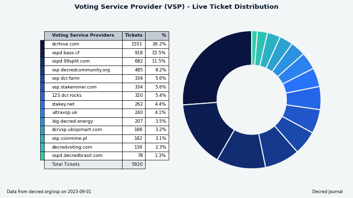
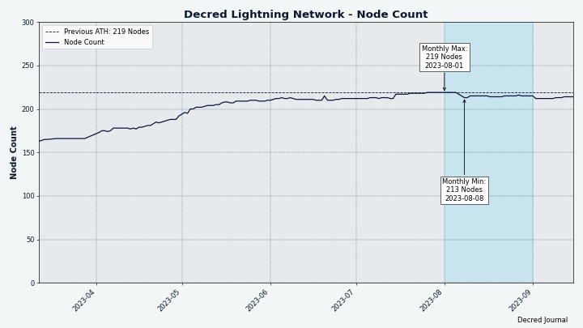
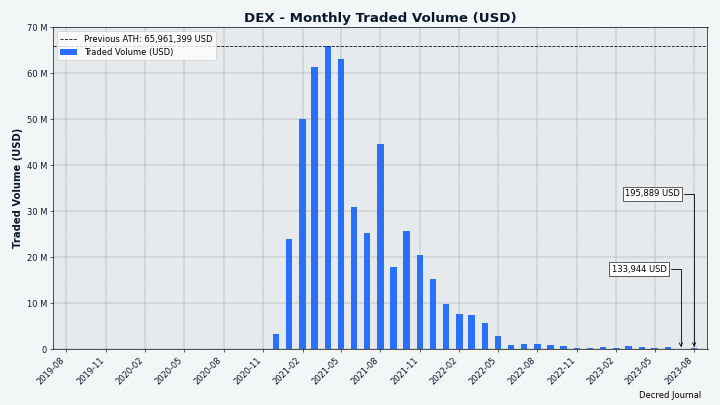

# Decred 月报 – 2023 年 8 月

_图片: @Exitus_

八月亮点：

- Decred 主网激活了两项共识变更，减少挖矿奖励并更改挖矿算法。 这些变化消除了网络中的专用集成设备（ASIC），并使 GPU 挖矿变得更加容易。

- Cryptopower 的第一个主网版本已经发布。 它是一款建立在 GoDCR 基础上的新钱包，并添加了第三方的 BTC 和 LTC 钱包、即时硬币兑换等功能。 最初作为桌面应用程序提供，但移动应用程序正在开发中。

- Bison Relay v0.1.8 已发布，在应用程序重新启动后加载聊天历史记录、初始电子商务功能以及大量用户体验改进。

- 对 Dash 和 Firo 的全节点钱包支持已合并到 DCRDEX 中。 高级用户可以尝试一下。

内容:

- [新共识规则激活](#new-consensus-rules-activated)
- [Cryptopower v1.0.0 发布](#cryptopower-v100-release)
- [Bison Relay v0.1.8 发布](#bison-relay-v018-release)
- [开发进展总结](#development)
- [人员](#people)
- [治理](#governance)
- [网络](#network)
- [生态系统](#ecosystem)
- [外展](#outreach)
- [媒体](#media)
- [市场](#markets)
- [相关外部信息](#relevant-external)

<a id="new-consensus-rules-activated" />

## 新共识规则激活

共识变更 [将 PoW 更改为 BLAKE3 和 ASERT](https://github.com/decred/dcps/blob/master/dcp-0011/dcp-0011.mediawiki) 和 [将 PoW/PoS 补贴比例更改为 1/89](https://github.com/decred/dcps/blob/master/dcp-0012/dcp-0012.mediawiki) 已在 Decred 主网区块高度 [794,368](https://dcrdata.decred.org/block/071683030010299ab13f139df59dc98d637957b766e47f8da6dd5ac762f1e8c7)激活。自3月份提交[Politeia提案](https://proposals.decred.org/record/a8501bc)以来，花了大约5个月的时间来实施这些更改并通过投票激活它们。

激活后，区块链暂停了近 3 天，直到 CPU 矿工发现第一个区块，区块链才重新开始运行。 我们将在下一期中介绍早期的 CPU 和 GPU 挖矿开发。 截至撰写本文时，一切看起来再次稳定，并且更多升级正在进行中。

旧软件将不会跟随 8 月 29 日分叉之后的链。 要使用 Decred，请确保升级到最新的[核心软件版本](https://github.com/decred/decred-binaries/releases)、独立的[DCRDEX 应用程序](https://github.com/decred/dcrdex/releases)、[Cryptopower](https://github.com/crypto-power/cryptopower/releases) 或其他[钱包](https://decred.org/wallets/)。

祝贺 Decred 社区激活我们的[第 12 次共识变更](https://github.com/decred/dcps)！

<a id="cryptopower-v100-release" />

## Cryptopower v1.0.0 发布

Cryptopower 是一款新的 DCR、BTC 和 LTC 自托管钱包。 自 GoDCR 于 [2022 年 8 月](202208.md#godcr) 停止，第一个公共主网版本包含了一年的开发工作和添加的新功能。 重点：

- 适用于 DCR、BTC 和 LTC 的多币种钱包 - 全部在轻量 (SPV) 模式下工作，无需下载完整的区块链
- Decred 质押、混合和治理 - 对共识变更、国库支出和 Politeia 提案进行投票
- 通过集中交换器进行硬币转换，例如 [Flyp.me](https://flyp.me/)、[Godex.io](https://godex.io/)、[ChangeNOW.io](https://changenow.io/) 及其他
- 自定义硬币选择以实现额外控制
- 自定义间隙限制
- 可在 Windows、macOS、Linux、FreeBSD 上运行
- 可以从同一代码库构建适用于 Android 和 iOS 的移动应用程序

[此处](https://github.com/crypto-power/cryptopower/releases) 下载适合您的操作系统的应用程序。 确保按照[release](https://github.com/crypto-power/cryptopower/releases/tag/release-v1.0.0)中的说明验证文件； 构建由“Cryptopower <release@cryptopower.dev>”和密钥“5C26BFEC6C2466A528D5551CD05AC74F68976E52”进行签名。

Android APK 版本是[主网测试版](https://twitter.com/dreacot/status/1699963093940363668)，欢迎测试者。

欢迎使用 [GitHub 问题](https://github.com/crypto-power/cryptopower/issues) 或在 [#cryptopower](https://matrix.to/#/!oxOZZtibVUXxXtdPJS:decred.org) Matrix聊天。

了解更多：

- [简短演示视频](https://twitter.com/dreacot/status/1694260734878712220)
- [简介及截图](https://www.cypherpunktimes.com/cryptopower-golang-native-desktop-mobile-wallet/)
- [提案](https://proposals.decred.org/record/256efee) 资助 Cryptopower 开发
- [桌面和移动设备的状态以及一个功能表](https://proposals.decred.org/record/256efee) 比较 Cryptopower、Decrediton、旧 Android 和 iOS 钱包、Cake Wallet 和 DCRDEX
- [与首席开发人员 @dreacot 的问答](https://www.cypherpunktimes.com/introducing-decred-developer-dreacot/)

_图片：暗模式下的 Cryptopower 钱包选择页面

_图片：Cryptopower 的发送页面_

_图片：Cryptopower 支持高级硬币选择以实现额外控制_

_图片：Cryptopower 可以让您[转换硬币](https://twitter.com/exitusdcr/status/1699366344813109572)，无需打开浏览器_

<a id="bison-relay-v018-release" />

## Bison Relay v0.1.8 发布

这是一个重大版本，在过去 4 个月内进行了新功能和用户体验改进。

GUI 和文本应用程序的主要变化：

- 应用程序重新启动后加载聊天记录
- 带有超链接的页面（类似于网页）
- 提高了密钥交换和小费的可靠性
- 许多bug修复

GUI 应用程序亮点：

- 具有搜索和过滤功能的地址簿
- 带图像的新闻提要和改进的排序
- 改进的通知用户界面
- 改进了小屏幕上的响应能力

brclient 文本应用程序亮点：

- 初始电子商务功能
- 客户端内容过滤
- 客户数据备份

最初的电子商务基础设施称为“simplestore”，旨在销售纯数字商品，例如图像、视频、音频和文件。 支持的支付方式有 DCR 闪电网络、链上 DCR 转账和自定义/手动处理。 Simplestore 仅在此版本中基于文本的 brclient 应用程序中可用。

GUI 和文本客户端现在具有不同的功能。 [发布页面](https://github.com/companyzero/bisonrelay/releases/tag/v0.1.8) 上列出了每个应用程序的更改； Windows 上从 v0.1.7 迁移请注意升级通知。 有关更改的完整列表及其说明，请参阅 2023 年 4 月至 7 月的 [Decred 月报](https://xaur.github.io/decred-news/) 问题。请参阅 [README](https://github.com/companyzero/bisonrelay/blob/v0.1.8/README.md#verifying-binaries) 文件，了解有关验证文件的说明。

_图片：Bison Relay v0.1.8 帮助您更快找到新评论_

<a id="development" />

## 开发进展总结

除非另有说明，否则下面报告的工作为“合并至核心存储库”状态。这意味着该工作已完成、审查并集成到高级用户可以[构建和运行](https://medium.com/@artikozel/the-decred-node-back-to-the-source-part-one-27d4576e7e1c)的源代码中，但普通用户尚不可用。

### dcrd

_[dcrd](https://github.com/decred/dcrd) 是一个完整的节点实现，为 Decred 在全球的点对点网络提供支持。_

本月的大部分工作都是以开发人员为中心。 然而，支持新的 Go 版本总是很有趣，因为它解锁了编码语言本身的潜在新功能和改进（请查看 [7月月报](202307.md#dcrwallet) 中的 dcrwallet 更新以获取相关示例）。

以下工作已合并到未来版本的“master”中：

- 放弃了对 Go 1.19 的官方支持，并[添加了对 Go 1.21 的支持](https://github.com/decred/dcrd/pull/3172)（仍支持 Go 1.20）。 这包括对 GitHub Actions 构建工作流程的更新。 针对 Go 1.19 进行构建仍然是可能的，并且很可能运行良好，但不再进行积极的测试。
- 更新了 [Docker 映像](https://github.com/decred/dcrd/pull/3171) 以使用 Go 1.21.0 构建 dcrd 二进制文件。
- 优化了 GitHub Actions [构建工作流程](https://github.com/decred/dcrd/pull/3168)，以减少重复的缓存条目和缓存垃圾邮件。 这涉及从 GitHub 构建工作流程中删除 Go 模块和构建缓存，因为最新的“setup-go”操作默认缓存它们，这会创建重复的缓存条目。 linter 仍然单独缓存，并且此更新还包括一个小的文件名更改，以产生显着更少的缓存对象。
- 在 [ASERT 测试](https://github.com/decred/dcrd/pull/3173) 中添加了一个测试场景，以确保当区块时间加快时，难度会适当调整。
- 添加了[重复单词linter](https://github.com/decred/dcrd/pull/3175)，并用它来[整理评论](https://github.com/decred/dcrd/pull/3174) 在 44 个不同的文件中。
- [从一些区块链函数中删除了未使用的参数](https://github.com/decred/dcrd/pull/3177)。 这些功能是内部功能，因此此更改对客户或用户没有影响。
- 添加了一个[errors linter](https://github.com/decred/dcrd/pull/3179)，以便它们可以[用有用的上下文包装](https://github.com/decred/dcrd/pull/3178)。 这使得函数调用者可以将它们解包以识别错误源。 此更新允许errors与“errors.Is”和“errors.As”很好地配合。

指定对 BLAKE3 和 ASERT 的更改的 [DCP-11 文档](https://github.com/decred/dcps/blob/master/dcp-0011/dcp-0011.mediawiki) 已被审核并[已发布](https://github.com/decred/dcps/pull/29)。 以下是我们发现的一些有趣的事情：

- 该文档解释了新的工作量哈希算法、新的 ASERT 难度调整算法以及激活后的难度重置，所有这些都非常详细地包含公式、图表和实施指南。
- *区块头*保持完全相同； 它是一个紧凑的 180 字节结构，保存有关块的重要元数据，并允许非常快速地同步和导航链。
- *区块哈希*也保持不变； 它与 *区块头* 的 BLAKE-256 14 轮哈希相同。 大多数 Decred 软件使用区块哈希来识别区块，无需修改。
- *工作哈希证明*更改为 BLAKE3； 它是通过散列*块头*创建的。 只有挖矿软件（和硬件）需要适应这种新的哈希算法。
- 对难度算法的研究表明，ASERT 是该领域[表现最好的算法](https://github.com/zawy12/difficulty-algorithms/issues/50) 之一。 旁注：比特币的 DA 在第 9 类中获得最差评级，仅次于所有其他类别。 基于该研究和其他研究，比特币现金于 2020 年 11 月[采用](https://documentation.cash/protocol/forks/2020-11-15-asert.html) ASERT 的变体。
- 必须为每个块计算新的 ASERT 难度，其频率比之前的 EMA 算法高 144 倍。 然而，ASERT 算法的计算速度可以快 16 倍，因此 dcrd 运行 ASERT 代码的时间总体会增加约 9 倍。 幸运的是，每个块的时间约为微秒，并且不会产生任何实际差异。 阅读更多内容[此处](https://github.com/decred/dcps/pull/29#discussion_r1300314310)。
- 从文本长度、文件数量和总体大小来衡量，DCP-11 是迄今为止最大的 DCP。 它制作精良，建议所有 Decred 爱好者[阅读全文](https://github.com/decred/dcps/blob/master/dcp-0011/dcp-0011.mediawiki)。

投票结果已添加到所有 12 个 [DCP 文档](https://github.com/decred/dcps) 中，以记录投票开始的历史区块以及共识变更锁定和激活的时间。 Decred 共识的实现可以使用这些区块号来优化其链验证逻辑并避免统计历史投票。

_图片：ASERT 难度公式相当简单。 如果我们的处理器可以直接运行这个美丽的数学运算......_

_Image：回到现实，面对二进制计算机精度有限的残酷现实。 这个调整后的公式经过优化，可以在真实硬件上快速运行，并且误差最小。_

### dcrwallet

_[dcrwallet](https://github.com/decred/dcrwallet) 是命令行和图形界面钱包应用程序使用的钱包服务器。_

6 月至 7 月针对下一个 v1.8.x 版本进行了[向后移植](https://github.com/decred/dcrwallet/pull/2277)：

- [警告用户](https://github.com/decred/dcrwallet/commit/1c1bcfbd5aa7ca0b1cbad06b4f1bb6b8c2af5aa5)因钱包被锁定而导致的VSP费用支付错误。 如果锁定的钱包阻止 VSP 费用支付，这将使用户能够做出反应。 看到错误后，用户应解锁钱包并重试，以防止错过选票。
- 修复了错误的 VSP 选票购买的损坏的[重试逻辑](https://github.com/decred/dcrwallet/commit/07854e3746aeef2de88488ae5cc87ee6a092387b)。 这个问题影响了很多用户。 任何第一次有效的购票行为都不会受到影响，但任何遇到错误的购买行为都不会被重试，这将导致选票无法添加到 VSP 中并错过投票。 值得庆幸的是，使用不同的 VSP 重新注册选票是一种解决方法，但用户体验很差。
- 修复了[费用支付状态检查](https://github.com/decred/dcrwallet/commit/c4c6c4213da7cde5ecdc97fb5347a1c7bc3aeae2)可能被无理延迟的错误。 VSP 客户端将操作延迟一段随机时间，以帮助保护隐私。 由于这种不正确的延迟计算，钱包将在长达 2 小时内将费用支付报告为未确认，直到下一次检查发生，而此时费用实际上已发送并确认。 现在用户钱包更新得更快。
- 要求 VSP 客户[等待 VSP 确认费用支付](https://github.com/decred/dcrwallet/commit/7c551ce6b95456b6ec1a174b5529641dd133230a)，然后再考虑完全购买 VSP 选票。 这消除了因用户广播自己的费用交易而导致的多种有问题的边缘情况，例如支付过低的费用或将付款发送到错误的地址。 这是针对在野外尚未发现的极其不可能的情况的预防性修复。

新更改已合并到“master”中，并向后移植到下一个 v1.8.x 版本：

- 修复了另一个错误，即确认 VSP 选票费用交易花费的时间超过必要的时间，这是由于选票的[有效和到期区块高度](https://github.com/decred/dcrwallet/pull/2270)在选票被发送后没有更新而导致的开采的。 大多数 VSP 选票都发生过这种情况。 如果钱包继续运行，费用最终会得到确认。 重新启动钱包会立即同步。 不存在错过投票的风险。 向后移植的更改位于[此处](https://github.com/decred/dcrwallet/commit/1319da0b05d4a9715b045e847ff58b442f407f39)。

面向用户的更改合并到未来版本的“master”中：

- 在重新扫描期间添加了[记录交易更改钱包通知](https://github.com/decred/dcrwallet/pull/2275)。 在初始重新扫描期间（重新播种期间或重新启动 dcrwallet 后）此功能会关闭。 任何其他重新扫描通常都是为了解决问题，当 dcrwallet 在旧区块内发现新的钱包交易或以前未开采但现在已开采的钱包交易时，dcrwallet 将记录。 重新扫描对于用户来说并不有趣，而且重新扫描实际上只是同步不同步钱包的创可贴。 拥有丢失交易的哈希值将有助于调试为什么钱包在同步它们时出现问题，并且有望导致一些错误修复，从而减少用户重新扫描的需要。
- 在发布购买之前，为非混合选票购买添加了[取消检查](https://github.com/decred/dcrwallet/pull/2276)。 混合购票已经检查是否取消，因此这可能会解决边缘情况的错误。
- 修复了一批 VSP 选票的处理[如果其中一个失败](https://github.com/decred/dcrwallet/pull/2259)。 向 VSP 客户端添加多个选票时，如果其中一个选票失败，则不会尝试其余选票。 这不太可能在现实世界中引起任何问题。 此更改还添加了一些缺失的日志记录，以使用户意识到某些 VSP 选票失败并可能需要调查。

开发者和内部变化：

- 将[查找 VSP 管理的选票](https://github.com/decred/dcrwallet/pull/2259) 的逻辑从 VSP 客户端移至主钱包代码中。 这是重构 VSP 和钱包逻辑的持续努力的一部分。
- 添加了官方[对 Go 1.21 的支持](https://github.com/decred/dcrwallet/pull/2278) 并更新了 GitHub Actions 构建工作流程。
- [已替换](https://github.com/decred/dcrwallet/pull/2265) 代码库中“interface{}”与“any”的所有非生成使用。 虽然“any”只是一个新别名，但它使代码更容易读取.

### dcrctl

_[dcrctl](https://github.com/decred/dcrctl) 是 dcrd 和 dcrwallet 的命令行客户端。_

- 改进了构建或安装 dcrctl 时设置[环境变量](https://github.com/decred/dcrctl/pull/68)的说明。
- 更新了 [Go 1.21](https://github.com/decred/dcrctl/pull/69) 的 CI 和文档。

### Decrediton

_[Decrediton](https://github.com/decred/decrediton) 是一款功能齐全的桌面钱包应用程序，集成了投票、StakeShuffle 混币、闪电网络、DEX 交易等功能。 它在有或没有完整的区块链（SPV 模式）的情况下运行。_

包装贡献：

- Decrediton v1.8.0 已添加到 macOS 用户的 [Homebrew Cask](https://github.com/Homebrew/homebrew-cask/pull/149083) 存储库中。
- Decrediton v1.8.0 已添加到 [winget](https://github.com/microsoft/winget-pkgs/pull/112385)，这是 Windows 10 和 11 中默认安装的包管理器。

其它新闻：

- [Decrediton 2FA](https://www.reddit.com/r/decred/comments/15cyod5/decrediton_2fa_hoddle_safely/) @norwnd 的概念已被[暂停](https://matrix.to/#/!DwNysKhaQPBPURaBGt:decred.org/$sn4rEGvdxLgITmVuwLrFXfQhPXbVqvMVkK1So_xa2DY) 有利于探索通用的[多重签名解决方案](https://gist.github.com/norwnd/890ad642985f4e9e9f7b1dd243b21f9e#long-term-we-need-decrediton-with-generic-multisig-support-right-)  。 目前，Decred 中没有用于多重签名的 GUI。

### vspd

_[vspd](https://github.com/decred/vspd) 是投票服务提供商使用的服务器软件。 VSP 代表其用户全天候 24/7 投票，不能窃取资金。_

VSP 管理员可能会注意到的功能变化：

- 等待所有其他启动任务完成后再收听[来自 dcrd 的通知](https://github.com/decred/vspd/pull/407)。 之前连接到 dcrd 没有问题，但这是不必要的，并且创建了混乱的日志。
- 将 [投票和撤销票证](https://github.com/decred/vspd/pull/413) 的发现从使用 dcrwallet 的 `TicketInfo` 调用更改为使用 [GCS 过滤器](https://github.com/decred) /dcrd/tree/f69247ff2478057ddbbc6692fc96ff6520b6a8c1/gcs) 来自 dcrd。 [Golomb-coded Sets](https://github.com/decred/dcps/blob/master/dcp-0005/dcp-0005.mediawiki#user-content-Golombcoded_Sets) (GCS) 能够非常有效地检测交易，这 功能是 Decred 隐私保护轻钱包 (SPV) 的关键要素。 新方法[更强大](https://github.com/decred/vspd/pull/413#issuecomment-1694228745)，因此 VSP 管理员可能会注意到，vspd 检测到一些历史投票/撤销的票证，其中 `TicketInfo ` 从未检测到。
- 添加了新的完整性检查，将数据库中已撤销的选票更新为[过期或错过](https://github.com/decred/vspd/pull/415)。 vspd 的初始版本无法区分过期和错过的选票，并将它们全部报告为“已撤销”。 了解 VSP 错过了多少票对于[评估其可靠性](https://github.com/decred/vspd/issues/268) 很有用。 此更新使用巧妙的启发式方法，根据撤销票证所需的时间来猜测票证结果。 它不是 100% 准确，但足以用于报告 VSP 统计数据。

开发者和内部变化：

- 添加了一个测试，以确保从 [securecookie](https://github.com/gorilla/securecookie) 返回的硬编码 [错误字符串](https://github.com/decred/vspd/pull/404) 将 当 vspd 升级到较新版本的库时，不会发生意外更改。
- [已替换](https://github.com/decred/vspd/pull/401) 将 `interface{}` 与 `any` 一起使用，类似于 [dcrwallet](#dcrwallet)。
- 更新至 [Go 1.21](https://github.com/decred/vspd/pull/402) 和更新的 GitHub Actions。 使用 Go 1.19 进行的测试已被删除。
- 从 vspd 存储库中删除了客户端 [VSP 费用支付逻辑](https://github.com/decred/vspd/pull/403)。 将所有 VSP 客户端代码从 dcrwallet 迁移到 vspd 存储库的[想法](https://github.com/decred/vspd/issues/379)被发现存在问题，它在 vspd 和 dcrwallet 之间创建了循环依赖关系，即 [麻烦](https://matrix.to/#/!zefvTnlxYHPKvJMThI:decred.org/$_rzNyvnGedWeh_tnXWk5WDQKaj3TODeXbxRa9fg7CtY)并且不值得承担维护负担。 大多数 VSP 客户端代码已从 vspd 中删除，并将继续存在于 dcrwallet 存储库中。 最终它应该成为一个导出的包，可以被寻求添加 VSP 质押功能的软件重复使用。 vspd 存储库中保留的是对 vspd API 的任何使用者都有用的绝对基础知识：[数据类型](https://github.com/decred/vspd/blob/2db761e0727866fda0bc303432e443599a2d3b45/types/types.go) 和一个[基本 HTTP 客户端](https://github.com/decred/vspd/blob/2db761e0727866fda0bc303432e443599a2d3b45/client/client.go)，用于与 vspd 通信，包括签署请求和验证响应签名以实现[双向责任](https://github.com/decred/vspd/blob/2db761e0727866fda0bc303432e443599a2d3b45/docs/two-way-accountability.md)。
- 简化的[关闭代码](https://github.com/decred/vspd/pull/410)。 它继承自 dcrwallet，比 vspd 所需的更加灵活和复杂。
- 各种[重构](https://github.com/decred/vspd/pull/408)以允许更多代码重用并改进完整性检查。
- 在内部重构了[数据传递](https://github.com/decred/vspd/pull/409)的方式，以删除重复并为未来的更改做好准备。
- 修复了处理来自 dcrd 的新块[通知](https://github.com/decred/vspd/pull/412)的错误（它不影响任何已发布的版本）。
- 标准库文档将[结构中的上下文](https://github.com/decred/vspd/pull/411)删除为[推荐](https://pkg.go.dev/context)。 添加了 [linters](https://github.com/decred/vspd/pull/411) 以防止在代码审查期间出现此问题和其他问题。

### Lightning Network

_[dcrlnd](https://github.com/decred/dcrlnd)是Decred的闪电网络节点软件。 LN 使即时和低成本交易成为可能。_

- 移植了 v0.11.1 和 [v0.12.1](https://github.com/lightningnetwork/lnd/releases/tag/v0.12.1-beta) 的上游 [lnd](https://github.com/lightningnetwork/lnd) 所做的更改（2021 年 2 月发布）。 分布在 220 个上游 PR 上的 541 个提交已被移植，其中 [53 个提交](https://github.com/decred/dcrlnd/commits?after=c97f63c8bc41977c6c9b6e5b62fb216e8157cef9+0&author=matheusd) 需要将代码库调整为 Decred。 移植的拉取请求的完整列表可以在[此处](https://github.com/decred/dcrlnd/blob/master/docs/upstream-prs.csv)找到。

### DCRDEX

_[DCRDEX](https://github.com/decred/dcrdex) 是一种非托管的、尊重隐私的交易所，用于无信任交易，由原子交换提供支持。_

DCRDEX v0.6.2 现已在 [Decred 的 Umbrel 应用商店](https://github.com/decred/umbrel-app-store) 中提供。

v0.6.3 版本（9 月发布）中包含的 8 月更改：

- 修复了在某些订单取消场景中显示不正确的[订单簿](https://github.com/decred/dcrdex/pull/2449)的可能性。

下面的其余更改将合并到未来版本的“master”分支中。

用户：

- 改进了备份页面上的[应用程序种子显示](https://github.com/decred/dcrdex/pull/2462)，它将以 8 个字符为一组显示。
- 对外部控制的钱包实施了[配置限制](https://github.com/decred/dcrdex/pull/2454)。 如果 DEX GUI 嵌入到 Decrediton 中并且不独立运行，这可以隐藏密码更改等设置。 在这种情况下，对交易钱包的任何更改都必须从 Decrediton 完成，并且在 DEX UI 中阻止它们应该可以防止用户破坏钱包。
- 市场变化时更新浏览器[选项卡/窗口标题](https://github.com/decred/dcrdex/pull/2458)。 当用户点击另一个市场时，还提供即时视觉反馈，例如清除深度图、订单簿和最近的匹配。

服务器：

- 仅当用户的[等级更改](https://github.com/decred/dcrdex/pull/2451)时发送惩罚通知，避免不必要的通知。

Decred：

- 添加了[质押支持基础](https://github.com/decred/dcrdex/pull/2290)。
- 通过 [JSON-RPC API](https://github.com/decred/dcrdex/pull/2316) 公开质押方法。
- 添加了一种从 [api.decred.org](https://github.com/decred/dcrwebapi/blob/master/docs/api.md)获取[投票服务提供商列表](https://github.com/decred/dcrdex/pull/2466)的方法。
- 下一步是创建一个用于质押的 GUI。
  
Bitcoin:

- 修复了尝试[重新配置](https://github.com/decred/dcrdex/pull/2474)丢失或损坏的 BTC 钱包时发生的崩溃。
  
Dash:

- 添加了对 DASH 的[全节点钱包](https://github.com/decred/dcrdex/pull/2424)支持。
- 需要 Dash 的强制 [v19.2.0](https://github.com/decred/dcrdex/pull/2484) 更新。

Firo:

- 实现了对 Firo 的 [Electrum 轻钱包](https://github.com/decred/dcrdex/pull/2426) 支持，包括带有自动化 Firo 链守护程序、ElectrumX 服务器和钱包客户端的测试工具。

[做市商和套利机器人](https://proposals.decred.org/record/8b1ceda) 进展：

- 实施了[余额隔离](https://github.com/decred/dcrdex/pull/2332)，限制了每个机器人可用的资金数额。
- 实现了横向、趋势和波动市场的[模拟](https://github.com/decred/dcrdex/pull/2409)。 这将用于[测试机器人行为](https://github.com/decred/dcrdex/issues/2303)。 对于好奇的人，可用的市场模拟记录在[此处](https://github.com/decred/dcrdex/blob/8fad25372c4af9d0b378335e4a3dbd12f6ba0d22/dex/testing/loadbot/README.md)。
- 更新了基本做市商策略，以在距基价不同距离（而不是仅一个）处[下多个订单](https://github.com/decred/dcrdex/pull/2416)。
- 在做市余额计算中考虑[退款](https://github.com/decred/dcrdex/pull/2479)的可能性。

文档：

- 添加了关于[管理 DEX 交易账户](https://github.com/decred/dcrdex/pull/2468) 的 wiki 页面，涵盖的主题包括：创建、使用现有账户、禁用、导出或管理交易账户层 。
- 更新了新 API 的[规范](https://github.com/decred/dcrdex/pull/2470)。
- 为 macOS 应用程序添加了[构建说明](https://github.com/decred/dcrdex/pull/2476)。

开发和内部变化：

- 在 DCR 测试工具中添加了[禁用后台挖掘](https://github.com/decred/dcrdex/pull/2452) 的标志。
- 重构和测试改进。

其他：

- [2023 年秋季](https://github.com/decred/dcrdex/issues/2483) 的粗略开发计划已发布以供审查和讨论，其中包括一些雄心勃勃的想法，例如法币上线。

_图片：Footgun 保护将防止在 Decrediton 内使用 DEX 时可能损坏钱包的意外更改_

_图片：用于测试做市商机器人性能的模拟横盘市场_

### Cryptopower

_[Cryptopower](https://github.com/crypto-power/cryptopower) 是一款适用于 DCR、BTC 和 LTC 的多币种桌面 GUI 钱包。 它以保护隐私的轻 SPV 模式运行，无需完整的区块链，支持 Decred 质押、混合、投票和其他独特功能。_

我们上次为这个项目编写开发日志是在 [2022 年 8 月](202208.md#godcr)，当时它被称为 GoDCR。 以下是迄今为止项目历史的快速回顾：

- 2018 年 9 月，Raedah Group 开始试验适合用纯 Go 构建 Decred 钱包的 GUI 库。 纯 Go 应用程序有可能具有更高的安全性、更好的性能并覆盖更多平台。
- 构建了五个原型界面：命令行、基于 [tview](https://github.com/rivo/tview) 的基于文本的终端 UI、基于 [Stimulus](https://stimulus.hotwired.dev/)的 Web 浏览器 UI，使用立即模式 [nuular](https://github.com/aarzilli/nuulous) 工具包制作的桌面 GUI，以及使用保留模式 [Fyne](https://github.com/fyne-io/fyne)  制作的另一个桌面 GUI 工具包。 这些原型和[屏幕截图](https://github.com/raedahgroup/godcr-old/wiki/Screenshots)现已存档[此处](https://github.com/raedahgroup/godcr-old)。
- 作为这项研究的结果，另一个名为 [Gio](https://gioui.org/) 的图书馆被选为获胜者，并启动了一个新的应用程序 [GoDCR](https://github.com/planetdecred/godcr) 2020 年 1 月。
- 第一个 GoDCR [开发提案](https://proposals.decred.org/proposals/e5c8051) 于 2020 年 11 月获得批准，支持率为 92%。
- 第一个功能测试网版本于 [2021 年 9 月](https://xaur.github.io/decred-news/journal/202109) 发布。
- [第二个提案](https://proposals.decred.org/record/f7d9fc8) 于 2021 年 10 月以 49% 的赞成率被拒绝。
- 第一个主网版本于 [2022 年 5 月](https://xaur.github.io/decred-news/journal/202205) 发布。
- [第三项提案](https://proposals.decred.org/record/0ef42e5) 将 GoDCR 与现有移动钱包开发相结合，于 2022 年 7 月以 20% 的赞成率被拒绝。
- [godcr](https://github.com/planetdecred/godcr) 存储库中的提交于 2022 年 8 月停止，但仅两周后，工作就在私人分叉中继续进行。
- 经过一整年的私人开发，更名为 Cryptopower、v1.0.0 版本和新提案已[揭晓](https://matrix.to/#/!aNnAOHkWUdNcEXRGjJ:decred.org/$Bz6ilL9i3WnaaHeAuWxEl8UOvuJrD9sNQIK8fC359lM) 。

今年八月的开发相对平静，而团队专注于发布[初始 v1.0.0 版本](#cryptopower-v100-release) 并致力于[提案](https://proposals.decred.org/record/256efee) 以获得该项目的资助。

更改已合并到下一个版本的“master”中：

- 修复了阻止 DCR [购票](https://github.com/crypto-power/cryptopower/pull/44) 的问题。 如果支付VSP费用失败，可以通过打开工单详情页面重新提交。
- 修复了单击[投票按钮](https://github.com/crypto-power/cryptopower/pull/54) 对提案进行投票时应用程序崩溃的问题。

[instantswap](https://github.com/crypto-power/instantswap) 库：

- 添加了一个函数来验证[地址已收到](https://github.com/crypto-power/instantswap/pull/5)指定的金额。
- Cryptopower 钱包使用 instantswap 库通过 Flyp.me、Godex.io、ChangeNOW.io 等集中服务在硬币之间进行转换，[等等](https://github.com/crypto-power/instantswap/tree/a58863beed9541e9cfefce611b2a3392ef0a9c1d/instantswap)。 它还提供了通过不同的[区块浏览器](https://github.com/crypto-power/instantswap/tree/a58863beed9541e9cfefce611b2a3392ef0a9c1d/blockexplorer)检查地址和交易的实用程序。

这里的计划是修复初始版本中发现的错误，并构建[提案](https://proposals.decred.org/record/256efee)中概述的功能，同时尽可能多地重用 DCRDEX 和其它项目。

有兴趣贡献的开发人员和测试人员可以加入#cryptopower 和#cryptopower-dev 聊天室。 请参阅[本指南](https://docs.decred.org/getting-started/joining-matrix-channels/)了解如何加入我们的 Matrix 聊天。

_图片：Cryptopower 的 LTC 钱包_

_图片：Android 上 Cryptopower 的钱包创建 UI，设计正在进行中_

_图片：在真实设备上测试的实验性 Cryptopower Android 构建_

### Documentation

_[dcrdocs](https://github.com/decred/dcrdocs) 是 Decred [用户文档](https://docs.decred.org/) 的源代码。_

- [DCP-12](https://github.com/decred/dcrdocs/pull/1226) 更新了多个页面。 [概述](https://docs.decred.org/)、[术语表](https://docs.decred.org/glossary/) 和[宪法](https://docs.decred.org/governance/decred-constitution/)  页面现在具有正确的区块奖励分配。 此外，[Issuance](https://docs.decred.org/advanced/issuance/) 页面现在记录了所有三个历史区块奖励分裂（60/30/10、10/80/10 和 1/89/10），并且 有更新的发行图表。
- 将 [MkDocs 的材质主题](https://github.com/decred/dcrdocs/pull/1227) 更新至 v9.2.6，为内部链接和导航菜单项添加了新的验证。 一个插件存在一个[问题](https://github.com/squidfunk/mkdocs-material/issues/5924)，但维护者已修复它并在一天之内发布了修复版本。
  
> 考虑到前 794,367 个区块的初始区块奖励分割以及从区块 794,368 开始的修改分割，总开采代币的有效最终分割为：
>
> * 40.34% 给 PoW 矿工
> * 49.63% 给 PoS 选民
> * 10% 存入 Decred 国库 \[[DCR 发行](https://docs.decred.org/advanced/issuance/)\]

### decred.org

_[dcrweb](https://github.com/decred/dcrweb) 是 [decred.org](https://decred.org/) 网站的源代码。_

- 在[新闻](https://decred.org/news/)页面上的软件版本中添加了[品牌图标](https://github.com/decred/dcrweb/pull/1132)。
- 在新闻页面添加了 [13 项](https://decred.org/news/)。

### Bison Relay

_[Bison Relay](https://github.com/companyzero/bisonrelay) 是一个新的社交媒体平台，具有针对审查、监视和广告的强大保护，由 Decred 闪电网络提供支持。_

v0.1.8 版本中针对 GUI 应用程序和基于文本的 brclient 进行了 8 月份的更改：

- [识别“lnpay://”链接](https://github.com/companyzero/bisonrelay/commit/66ebc67b02d758594bf86bf640c8f66d9f409fe5)并将其显示为可以启动 LN 付款的按钮。
- 添加了 v0.1.8 版本的[发行说明](https://github.com/companyzero/bisonrelay/pull/313)、哈希值和签名。 这还将有关[验证文件](https://github.com/companyzero/bisonrelay/tree/8f902aaa62bf3475d859fc3aef50474b7f98d03a#verifying-binaries)的说明添加到自述文件中。
- 跳过 dcrlnd 中的错误 [金额检查](https://github.com/companyzero/bisonrelay/pull/309)，直到修复为止。 这些检查可能会阻止客户端发送消息。

v0.1.8 版本中包含的 GUI 应用程序更改：

- 由于 MSIX 和更新的证书出现问题，Bison Relay 在 Windows 上的数据目录将[移动到新位置](https://github.com/companyzero/bisonrelay/pull/307)。 用户将收到警告并建议在继续操作之前进行备份。
- 在地址簿中列出[活跃聊天](https://github.com/companyzero/bisonrelay/pull/320)。 以前，如果聊天已经打开，则不会显示在地址簿中，用户可能会因为缺少某些联系人而感到困惑。
- 修复了 Windows 任务管理器中显示的[应用程序名称](https://github.com/companyzero/bisonrelay/pull/322)。

v0.1.8 版本中包含的 brclient 更改：

- 添加了使用 LN 发票和链上 DCR 交易进行的 [simplestore 付款跟踪](https://github.com/companyzero/bisonrelay/pull/303)。 添加了在确认付款后发送购买的文件的功能。
- 添加了有关配置 simplestore 的[文档](https://github.com/companyzero/bisonrelay/pull/311)。
- 修复了从磁盘[重新加载产品](https://github.com/companyzero/bisonrelay/commit/57c8d48a2ad7cf8a88208e9d89c9e952bab13ae0)时解析错误文件的可能性。

下面列出的更改已合并到未来版本（可能是 v0.1.9）的“master”中。

GUI 和文本应用程序中的常见更改：

- 自动取消订阅闲置用户并将其从群聊中删除。 如果对等客户端空闲 21 天，则会发送自动握手以测试它是否会响应。 60天后，如果仍然没有回复，则空闲同伴将被强制取消订阅本地用户的帖子，并从本地用户为管理员的任何群聊中删除。 这两个时间间隔都可以由用户配置或禁用。

GUI 应用程序更改：

- 修复了[链接打开](https://github.com/companyzero/bisonrelay/pull/318)返回错误，而不是在网络浏览器中打开链接。

brclient 更改：

- [生成](https://github.com/companyzero/bisonrelay/pull/332) 如果配置的存储目录存在但为空，则存根 simplestore 文件。 以前，现有的空目录阻止了这一点。
- [展开](https://github.com/companyzero/bisonrelay/pull/330) 环境变量和 `/backup` 命令中的 `~`。

内部和开发人员变更：

- 使用 [Go 1.21](https://github.com/companyzero/bisonrelay/pull/315) 构建和测试。
- 更新了[依赖项](https://github.com/companyzero/bisonrelay/pull/312)。

### 其它

- XMR 与 BTC 或 BCH 原子交换的概念已在 atomicswap 存储库中[提出](https://github.com/decred/atomicswap/issues/129)。 XMR 没有传统原子交换所需的哈希或时间锁等原语，但所提出的方案只需要两条链之一具有足够的脚本编写能力。 人们对这项研究非常感兴趣，例如 COMIT Network 的 [xmr-btc-swap](https://github.com/comit-network/xmr-btc-swap) 和 [BasicSwap](https://particl.news/bidirection-part-anon-and-xmr-atomic-swaps-now-live-on-basicswap-dex/) 来自 Particl，探索如何用类似比特币的货币交换 XMR。

<a id="people" />

## 人员

欢迎新的首次贡献者：

- @tallamericano（[Cypherpunk Times](https://www.cypherpunktimes.com/author/tall/) 作者）

截至 9 月 2 日的社区统计数据（与 8 月 1 日相比）：

- [Twitter](https://twitter.com/decredproject) 关注：53,306 (-22)
- [Reddit](https://www.reddit.com/r/decred/) 订阅：12,751 (+4)
- [Matrix](https://chat.decred.org/) #普通用户：805 (+8)
- [Discord](https://discord.gg/GJ2GXfz) 用户：1,661 (+72)，已验证发帖人数：677 (+34)
- [Telegram](https://t.me/Decred) 用户：2,303 (-52)
- [YouTube](https://www.youtube.com/decredchannel) 订阅：4,640 (+0)，观看次数：234.6K (+2.1K)

<a id="governance" />

## 治理

8 月份，新[国库](https://dcrdata.decred.org/treasury) 收到了 7,155 个 DCR，价值 9.9 万美元，8 月份的平均汇率为 13.89 美元。 5,961 DCR 用于支付承包商费用，按相同价格计算价值 83,000 美元。

[国库支出 tx](https://dcrdata.decred.org/tx/144c17b0542e4aecb6c2b00b905552b001055dcf8298a0cd8ce0c1409e4bb2e4) 以 7,163 票赞成和 56% 的投票率获得批准，并于 8 月 28 日开采。它有 26 个输出支付给承包商的款项从 7 DCR 至 2,036 DCR。 大部分 DCR 可能是为 6 月份的工作支付的，按照 14.25 美元的计费汇率，TSpend 的价值约为 8.5 万美元。

截至 8 月 2 日，[旧国库](https://dcrdata.decred.org/address/Dcur2mcGjmENx4DhNqDctW5wJCVyT3Qeqkx) 和 [新国库](https://dcrdata.decred.org/treasury) 的总余额为 865,779 DCR（1110 万） 美元价格为 12.81 美元）。

_图片：DCR 中的国债流入和流出_

_图片：美元国库余额_

提交了 3 项新提案：

- [提案](https://proposals.decred.org/record/256efee) 请求为 Cryptopower 提供 61,600 美元的预算，这是 GoDCR 复兴的多资产版本，用 Go 编写，具有跨平台和移动友好性。 除了 Politeia 之外，#proposals [聊天](https://matrix.to/#/!qYpAAClAYrHaUIGkLs:decred.org/$dhl2WaQkMIKawUTXNg5Jrx30doUAvJkoFS2vD4d5AAs) 中也发表了许多评论。
- [提案](https://proposals.decred.org/record/2f25f2d) 请求 80,000 美元预算，以将初始基本 DCR 支持集成到 [Cake Wallet](https://cakewallet.com/) 中。 聊天评论开始于[此处](https://matrix.to/#/!qYpAAClAYrHaUIGkLs:decred.org/$PTJF15NZg5RqJgt_aDQfWOkh9YoJfI-bYwCKcwERpXU)。
- [提案](https://proposals.decred.org/record/b80040f) 请求 15,000 美元，用于在 [Odaily](https://www.odaily.news/) 中文上撰写和发表两篇有关 Decred 的文章 加密新闻。

有关本月提案的更多详细信息，请参阅 Politeia Digest [第 63 期](https://blockcommons.red/politeia-digest/issue063/)。

<a id="network" />

## 网络

**全网算力**: 8 月份的 [全网算力](https://dcrdata.decred.org/charts?chart=hashrate&scale=linear&bin=day&axis=time) 以 59 PH/s开启，结束为 0 PH/s，低点 0 PH/s，峰值 65 PH/s。 算力下降到几乎为零是由于 [DCP-11](https://github.com/decred/dcps/blob/master/dcp-0011/dcp-0011.mediawiki) 的激活，它删除了所有现有的算力并导致大约 3 天没有新的区块被开采。 最终难度调整并恢复正常运行，我们将在下一期详细介绍。

_图片：Decred 算力_

8 月 29 日各矿池 54 PH/s 算力分布[报告](https://miningpoolstats.stream/decred)（各矿池最新有效数据）：Poolin 46%、F2Pool 44%、BTC.com 7%、 蚁池3%。

截至 8 月 29 日，实际 [开采](https://miningpoolstats.stream/decred) 的 1,000 个区块分布：币印 44%、F2Pool 40%、BTC.com 6%、AntPool 3%、未知 7%。

_图片：历史矿池算力分布_

**Staking**: [选票价格](https://dcrdata.decred.org/charts?chart=ticket-price&axis=time&visibility=true-true&mode=stepped) 在 236-244 DCR 之间变化。

_图：8月份票价异常稳定_

[锁定金额](https://dcrdata.decred.org/charts?chart=ticket-pool-value&scale=linear&bin=day&axis=time)为976-981万个DCR，这意味着循环供应量的63.2-63.7%[参与了](https://dcrdata.decred.org/charts?chart=stake-participation&scale=linear&bin=day&axis=time) 的权益证明。

**VSP**: 截至 9 月 1 日，[14 个列出的 VSP](https://decred.org/vsp/) 总共管理了约 5,900 张 (-250) 现场选票，占选票池的 14.5% (-0.6%)。

8 月份涨幅最大的是 [dcr.farm](https://vsp.dcr.farm)（+220 张门票或+193%）和 [bass.cf](https://vspd.bass.cf/) ( +183 张选票或 +25%）。

_图片：VSP 管理的选票_

**节点**: [Decred Mapper](https://nodes.jholdstock.uk/user_agents) 整个月观察到 157 到 167 个 dcrd 节点。 9 月 1 日观察到的 157 个节点的版本：v1.8.0 - 88%、v1.7.x - 5%、v1.8.0 开发版本 - 2%、v1.9.0 开发版本 - 1.3%、其它 - 4%。

_图片：大多数节点正在运行 dcrd v1.8.0。 2023 年 1 月之前的红色区域表示我们当时拥有的数据不完整。_

[混合币](https://dcrdata.decred.org/charts?chart=coin-supply&zoom=jz3q237o-la8vk000&scale=linear&bin=day&axis=time&visibility=true-true-true)的份额在62.45-62.50%之间变化。 每日[混合量](https://dcrdata.decred.org/charts?chart=privacy-participation&bin=day&axis=time) 在 0-497K DCR 之间变化。 最低 0 是因为该月的最后 2 天没有开采区块。

截至 9 月，Decred 的 [闪电网络](https://ln-map.jholdstock.uk/) 浏览器已看到 213 个节点 (-6)、431 个通道 (-14)，总容量为 186 DCR (-3) 1. 每个节点的这些统计数据都不同。 例如，@karamble 的节点在 9 月 1 日同一天报告了 217 个节点 (-3)、453 个通道 (-11) 和 192 DCR (+1) 容量。

_图片：Decred 的闪电网络节点数量已稳定_

<a id="ecosystem" />

## 生态系统

为 Decred 的 8 月 29 日硬分叉做好了准备：

- 币安于 [8 月 25 日](https://www.binance.com/en/support/announcement/binance-will-support-the-decred-dcr-and-multiversx-egld-network-upgrades-hard-forks-969d5dee8218430aa94310e6820d41eb) 宣布，分叉后充提币将暂停，直至链稳定，交易不受影响。

- Poloniex 于 [8 月 25 日](https://support.poloniex.com/hc/en-us/articles/17020071785111) 发布了与 Binance 非常相似的公告。 它还发布在他们的 [Telegram](https://t.me/PoloniexAnnouncements/2453) 上。

- 我们能找到的来自 Bittrex 的唯一通信是 Twitter 上类似[“敬请关注”](https://twitter.com/BittrexGlobal/status/1694979576512872708) 的响应。 Bittrex Global 的支持网站没有提及 [“Decred”](https://bittrexglobal.zendesk.com/hc/en-us/search?utf8=%E2%9C%93&query=Decred)，并且只有 2 个旧页面 ["DCR"](https://bittrexglobal.zendesk.com/hc/en-us/search?utf8=%E2%9C%93&query=DCR) 搜索查询。

- F2Pool于[8月25日](https://f2pool.zendesk.com/hc/en-us/articles/22224378432665-Closing-DCR-mining-pool) 宣布([mirror](https://f2pool.io/Mining/updates/#20230825)) 他们将在网络升级当天终止 DCR 挖矿服务。 DCR 支付将在网络升级后的一周内完成。 用户可以获取截至2023年9月29日的挖矿奖励历史记录。

- 币印矿池于[8月28日](https://help.poolin.me/hc/en-us/articles/22324428533273-Announcement-on-Closing-DCR-Mining-Pool)宣布关闭DCR矿池，并[转发](https://matrix.to/#/!lDZCzVQjFoJsXMPkvr:decred.org/$_acFN1O8kvkZHBVl7OxecDrFewDkma_7omNGOJrBUKE)在[Decred的电报](https://t.me/Decred)聊天中。 该通知警告矿池用户配置或关闭矿机，因为分叉后收益将大幅减少，并要求尽快从矿池中撤回DCR。 这里的一个不寻常的细节是，与其他供应商不同，Poolin 完全错过了*挖掘算法*到 BLAKE3 的变化，并计划*在分叉之后*运行矿池 1-2 天，以便您有更多时间 配置您的矿工”。

- 此列表仅涵盖 Decred 聊天中出现的更新。 如果您了解更多新闻，请随时分享#ecosystem！
  
通讯系统：

- shoty.net [启动](https://matrix.to/#/!ggjLwhBHTjsMROezFf:decred.org/$FhjfyYqxHoPF3m6lMkWhk6Pf3txJpA3facOHWOLjRMI) 一个位于 `wss://nostr.stakey.net` 的 Nostr 中继和一个位于 [citadel.stakey.net](https://citadel.stakey.net/)，由 [snort](https://github.com/v0l/snort) 提供支持。 Nostr Web 客户端取代了之前托管在同一域上的 Mastodon 服务器。 Mastodon 用于 [stakey.net](https://stakey.net/) 的公告。 它也开放给 Decred 社区成员注册和发帖，但几乎没有用处，最终被 [关闭](https://matrix.to/#/!ggjLwhBHTjsMROezFf:decred.org/$K3iSve6SAtBeCK2sBy1abK3ImA0FgbjzuC04UmXriis)，转而支持 Nostr 。 Nostr用户可以关注[stakeynet](https://citadel.stakey.net/p/npub1feh69xgmqfmxf5rjf44x6wfyntuz3mzlxcrymucxa0k2af5uzysqmlgx6j)获取有关VSP的服务更新。

其它新闻：

- 两名 Decred 社区成员已要求 Kraken 通过其[列表表单](https://matrix.to/#/!lDZCzVQjFoJsXMPkvr:decred.org/$xZe0qWBllVIePmjOPqvNKyuEYda7EvrK9kulXUX-268) 和 [Twitter](https://twitter.com/longtermdaily/status/1688517496628711424) 列出 DCR 。 过去已经做过很多次了，机会很小，但继续尝试总没有坏处。 此外，多个#trading会员在Coinbase应用程序中[为DCR评级](https://matrix.to/#/!lDZCzVQjFoJsXMPkvr:decred.org/$CtHJaU81BKb_Cvi_zWMuzWxGty21CU2XaDy8gUXLWSY)，希望更多的搜索和评级能够产生影响。

加入我们的 [#ecosystem](https://chat.decred.org/#/room/#ecosystem:decred.org) 聊天，获取有关 Decred 服务的更多新闻。

警告：Decred 月报的作者不知道上述任何服务的可信度。 在将您的个人信息或资产委托给任何实体之前，请先进行自己的研究。

<a id="outreach" />

## 外展

<a id="monde-pr" />

### Monde PR

Monde PR 八月份的成绩：

- 针对加密货币出版物发布了一项新闻更新
- 针对加密货币出版物提出了四个故事创意

确保以下媒体展示位置：

- [BeInCrypto](https://beincrypto.com/blockchain-reform-democracy-decred-co-Founder/) 中的一篇文章，介绍区块链如何揭露虚假新闻并帮助改善民主。 这篇文章探讨了 Decred 在巴西选举中的使用情况，并讨论了社交媒体可以发挥的作用，其中包含有关 Bison Relay 的详细信息，并引用了@jy-p 的内容。 该文章被联合发表于八份出版物，包括 [Bitcoin Linux](https://www.bitcoinlinux.com/2023/08/10/blockchain-can-expose-fake-news-and-help-improve-democracies-says-decreds-co-Founder/) 和 [Trading View](https://www.tradingview.com/news/beincrypto:d5091a62a094b:0-blockchain-can-expose-fake-news-and-help-improve-democracies-says-decred-s-co-founder/)。
- 这篇文章还发布在 BeInCrypto 的 [西班牙语](https://es.beincrypto.com/blockchain-puede-exponer-fake-news-mejorar-democracias-reporte/) 版本中，该版本已联合发布到 [Cryptocity.press](https://cryptocity.press/noticias/blockchain-puede-exponer-fake-news-y-mejorar-las-democracias-segun-reporte)。
- [ZyCrypto](https://zycrypto.com/3ac-Founders-slammed-with-2-6-million-fine-by-dubais-regulator-over-new-exchange/) 中的一篇文章，其中包含 @jz 的评论 3AC的衰落。 该文章被联合发表于三个出版物，包括 [Bitcoin Crypto](https://bitcoin-crypto.nl/zycrypto-com-3ac-founders-slammed-with-2-6-million-fine-by-dubais-regulator-over-new-exchange/)。
- [Cryptonews.com](https://cryptonews.com/news/decred-launches-bison-relay-v018-revolutionizing-e-commerce-with-decentralized-shopify.htm) 中有关 Bison Relay v0 的文章。 1.8 版本，包括有关新功能、Simplestore 基础设施的详细信息以及 @jy-p 的引用。 该文章被联合发表于三个出版物，包括 [Globe Echo World News](https://globeecho.com/business/crypto/decred-launches-bison-relay-v0-1-8-revolutionizing-e-commerce-with-decentralized-shopify/)。
- [CoinDesk 的“Protocol Village”](https://www.coindesk.com/tech/2023/08/28/protocol-latest-tech-news-crypto-blockchain/) 新闻综述中有关 Bison Relay 版本的一段 ，包含返回 Decred 网站和 GitHub 的链接。
- [The Currency Analytics](https://thecurrencyanalytics.com/crypto-exchanges/revolutionizing-online-shopping-bison-relay-unveils-latest-upgrade-paving-the-way-for-decentralized-e-commerce-67167.php)有关 Bison Relay 版本的信息，包括有关新功能以及升级如何“为去中心化电子商务铺平道路”的详细信息。
  
在关于最近营销提案的讨论中，@l1ndseymm 评论了营销和公关之间的差异：

> 同时拥有公关和营销策略是有益的，因为它们可以相辅相成并扩大整体效果。 营销本质上比公关更昂贵。 企业往往将其收入的 10% 左右用于营销。
>
> 我对 Cointelegraph 提案的反馈是，理想的情况是拥有一位以前管理过广告支出的营销人员。 有很多选择 - 除了此类付费内容机会之外，我们还可以在时事通讯、播客、广告牌、社交媒体上赞助/做广告。 此人可以提出预算，然后根据我们的受众/目标建议哪些平台和媒体将获得最佳结果。 然后他们可以跟踪结果并随着我们的进展调整策略。 他们通常可以获得特价并知道什么是公平的定价。 \[[@l1ndseymm](https://matrix.to/#/!qYpAAClAYrHaUIGkLs:decred.org/$nXniE7jvWEt3H1J6UrEh6oejVdz6JeWifATWj12xk0c)\]

<a id="decred-vanguard" />

### Decred Vanguard

我们一直在小规模测试几种参与策略，例如最近的 [DCR 赠品](https://twitter.com/exitusdcr/status/1685994386339897344)（100 美元奖池，15 名参与者，2 名获奖者），要求参赛者 证明真正的钱包安装。

除此之外，我们已经放慢了速度，因为我们试图思考度过熊市的最佳方法，熊市的成交量都远低于正常水平。 虽然 Vanguard 营销方法的重点是“大量”谈论 Decred，但此时，我们更愿意在配置新策略时保持现实并保持脚踏实地。

[Decred Vanguard](https://proposals.decred.org/record/0a1b782) 一直在寻找新的、热切的成员来帮助我们推广 Decred。 好处很简单 - 每月 100 美元的 Decred 参与费用和你的 Twitter Blue 帐户的费用！ 组织是在 Discord 服务器中完成的。 如果您对推广 Decred 有任何独特的想法，例如制作模因、艺术，或者只是想成为贡献成员，请联系 [@Exitus](https://twitter.com/exitusdcr) 或 [@Tivra](https://twitter.com/WasPraxis)。

<a id="cypherpunk-times" />

### Cypherpunk Times

八月份的参与度统计：

- CT上的文章总数：517
- 时事通讯订阅者：105
- 发送的新 CT 帖子和时事通讯：20
- 活跃的社交媒体活动：80
- 已完成的社交媒体活动：9
- 社交媒体帖子：192
- 所有平台和帐户的社交媒体关注者：1,575
- [@decredsociety](https://twitter.com/decredsociety) 统计数据：关注者 - 967，推文展示次数 - 12.8K，点赞 - 311，转发 - 79
- [@decredmagazine](https://twitter.com/decredmagazine) 统计数据：关注者 - 481，推文展示次数 - 15.4K，点赞 - 450，转发 - 144
- [@cypherpunktimes](https://twitter.com/cypherpunktimes) 统计数据：关注者 - 127，推文展示次数 - 31.0K，点赞 - 550，转发 - 170

### 其它

- @Tivra 已将 Decred 与 Cake Wallet 连接起来，从而与 [Vik Sharma](https://twitter.com/) 进行了协作[视频直播](https://www.youtube.com/watch?v=0KKsD4ZhZn0) vikrantnyc 和 [Justin Ehrenhofer](https://twitter.com/JEhrenhofer)，以及一项 [提案](https://proposals.decred.org/record/2f25f2d)，以资助将 DCR 集成到 Cake 钱包中。 Cake 看起来是一个有前途的合作伙伴，可以发布他们的[源代码](https://github.com/cake-tech/cake_wallet)、构建[非托管金融](https://cakewallet.com/)、搭建桥梁，促进隐私和[赋予个人权力](https://cakelabs.com/#principles)。
- @Dominic 穿着 [时尚的 Decred 服装](https://twitter.com/wanbihou/status/1695772020687229092) 参加了铁人三项比赛。
- 来自 BTC-ECHO 的 Totti 发布了[第四](https://proposals.decred.org/record/49e373b/comments/31) 和 [第五](https://proposals.decred.org/record/49e373b/comments/32) 篇文章。 所有反馈均已纳入，第一篇 [Decred 文章](https://www.btc-echo.de/news/decred-eine-der-aeltesten-kryptos-ueberzeugt-mit-prinzipien-spoken-166076/) 已发布 发布于 [8 月 17 日](https://twitter.com/btcecho/status/1692192057136119841)。 一周后，按照第五次更新的计划，它被“重新发布”。

_图片：“当我参加铁人三项比赛时，我成为 #decred 的广告牌”\[[@wanbihou](https://twitter.com/wanbihou/status/1695772020687229092)\]_

<a id="media" />

## 媒体

**精选文章：**

- [CBDC：探索对传统银行业务的全球影响](https://www.cypherpunktimes.com/central-bank-digital-currencies-cbdcs-exploring-the-global-impact-on-traditional-banking/) @tallamericano
- [Decred 联合创始人表示区块链可以揭露假新闻并帮助改善民主](https://beincrypto.com/blockchain-reform-democracy-decred-co-Founder/) 作者：Josh Adams  BeInCrypto
- [DeFi、Decred 以及颠覆传统银行业的潜力](https://www.cypherpunktimes.com/defi-decred-and-the-pottial-to-disrupt-traditional-banking/) 作者：@tallamericano
- [Cryptopower：Golang 本机桌面和移动钱包](https://www.cypherpunktimes.com/cryptopower-golang-native-desktop-mobile-wallet/)  @phoenixgreen
- [Decred 推出 Bison Relay v0.1.8，开创去中心化电子商务和无与伦比的用户主权的新时代](https://decred.org/news/2023-08-29_decred_unveils_bison_relay_0.1.8/) 
- [Decred 推出 Bison Relay v0.1.8：通过去中心化“Shopify”彻底改变电子商务](https://cryptonews.com/news/decred-launches-bison-relay-v018-revolutionizing-e-commerce-with-decentralized-shopify.htm)作者：Hassan Shittu
- [教程：如何单独挖矿 Decred 即将推出的 Blake3 算法](https://www.cypherpunktimes.com/tutorial-solo-mine-decreds-blake3/)  @karamble
- [Cypherpunk 与达世币社区的 Ernesto 交谈！](https://www.cypherpunktimes.com/cypherpunk-talk-with-ernesto-from-the-dash-community/)  @Joao

*注意：在 Decred 月报中，我们仅列出有关 Decred 的精选文章，但《Cypherpunk Times》有更多有关其他货币、金融和社交媒体的优质内容。 [去看看吧！](https://www.cypherpunktimes.com/page/2/)*

**视频:**

- [新闻更新-投票完成！ Decred 切换到 GPU 挖矿。 Bison Relay Stores + 更多](https://www.youtube.com/watch?v=P7SC7Ug_qZY)  @Exitus 
- [如何购买你的第一个Decred（DCR）？ - 常见问题](https://www.youtube.com/watch?v=tBHqUuLfIIw) @phoenixgreen 
- [如何单独挖掘 Decred 即将推出的 Blake3 算法](https://www.youtube.com/watch?v=pKFEV2AW-fk)  @phoenixgreen
- [什么是简单交换？ - Decred 问答环节](https://www.youtube.com/watch?v=QJEGB9TInuE)  @phoenixgreen 
- [Decrediton 国库支出投票](https://www.youtube.com/watch?v=kdJMDSM01_0)  @phoenixgreen

直播：

- [加密货币集成：Cake Wallet](https://www.youtube.com/watch?v=0KKsD4ZhZn0)，@phoenixgreen 和 @Tivra
- [Decred v1.8.0 - “The Forkening”壮举。 首席开发人员戴夫·柯林斯 (Dave Collins)](https://www.youtube.com/watch?v=TJnP_t4dEq8)，作@phoenixgreen @Exitus @davecgh 

**翻译:**

- [教程：如何单独挖矿 Decred 即将推出的 Blake3 算法](https://www.cypherpunktimes.com/tutorial-solo-mine-decreds-blake3/) - [中文](https://github.com/DominicTing/articles/blob/master/Tutorial:%20How%20to%20Solo%20Mine%20Decred's%20Upcoming%20Blake3%20Algorithm.md) @Dominic
- Decred Journal 4 月至 7 月总共有 4 个新的[翻译](https://xaur.github.io/decred-news/) 阿拉伯语 (@arij, @abdulrahman4)、中文 (@Dominic) 和波兰语 (@ 科泽尔）。 谢谢各位！

**非英语内容:**

- [Decred：最古老的加密货币之一以原则说服人](https://www.btc-echo.de/news/decred-eine-der-aeltesten-kryptowaehrungen-ueberzeugt-mit-prinzipien-spoken-166076/) BTC-ECHO（德语）
- [Decred 联合创始人表示区块链可以揭露假新闻并帮助改善民主](https://es.beincrypto.com/blockchain-puede-exponer-fake-news-mejorar-democracias-reporte/) Josh Adams BeInCrypto（西班牙语翻译）

**艺术娱乐:**

- [去中心化未来的愿景](https://www.cypherpunktimes.com/visions-of-a-decentralized-future/)  @OfficialCryptos
- 非官方 Decred [“merch”](https://crosby.shop/) 已[发现](https://matrix.to/#/!rLQWsgjPJFAClvskmU:decred.org/$kV-PGswIf-YyrTaiZTiOhLE5D6EZT5WdnRzJC6sgwKQ)
- [嘿！ 你知道下一个区块吗？](https://matrix.to/#/!lDZCzVQjFoJsXMPkvr:decred.org/$GqIUkOZ8siT5gWrNJSwMtO99x1s6YMpcMalY46jRh44)  @Void

_图片：“你如何识别？” - “我处于右上象限，以至于它超出了你的图表”作者：[@Tivra](https://twitter.com/WasPraxis/status/1676890319902633985)_

_图片：“我想重新补充我的补充剂，结果发现了这个。现在它是必须购买的，你不觉得吗？” 通过 [@kozel](https://matrix.to/#/!lDZCzVQjFoJsXMPkvr:decred.org/$Svd-YbzCDskjqeiql3tKQB9XSoINI-JnSKt_-fjeq-Q)_

_图片：鞋子样张_

<a id="markets" />

## 市场

8 月份，DCR 的交易价格在 USDT 12.42-15.73 和 BTC 0.00040-0.00058 之间。 平均每日交易价格为 13.89 美元。

_图片：DCR 与 XMR 相比处于“长时间”低位_

_图片：DCRDEX 每月交易量（美元）_

<a id="relevant-external" />

## 相关外部信息

Coinbase 使用 Optimism 堆栈推出的新以太坊第 2 层网络，它被称为 Base。这是上市公司首次推出自己的区块链，Coinbase 希望未来从交易费和 dapp 中获得收入。

Base 的早期成功/炒作故事以friend.tech的形式出现，这是一款社交应用程序，用户可以在其中购买其他用户的“共享”（很快重命名为“密钥”），并且拥有这些密钥可以让用户向他们发送消息。当炒作开始时，friend.tech 的交易量迅速达到 12.6 万笔，交易量达到 4,400 ETH，超过了当时整个 NFT 生态系统的数量。friend.tech 是“stealcam”的重新命名，来自以“Tweet DAO Eggs”而闻名的人，NFT 允许持有者从某个帐户发推文，直到该帐户被暂停且网站被关闭。到月底，所有指标的活动均已大幅下降，交易和费用收入较最初峰值下降了 80%。

为了利用 Friends.tech 的炒作，以太坊上推出了一种新的 meme 代币 - FrensTech。当价格开始爆炸时，其创始人很严厉，AzFlin从流动性池中撤回了所有代币并兑现，从而导致价格暴跌。在一名 Twitter 侦探揭露了这位幕后黑手是 Uniswap 员工的身份后，他被解雇了。

Horizen 区块链宣布打算通过硬分叉在共识层面删除 ZEN 的链上“屏蔽池”隐私功能。做出这一决定的原因是，通过不再符合“隐私币”类别的资格，避免监管机构对“隐私币”的强烈反对。Horizen 的隐私池基于 Zcash 的“Sprout”技术，而 Zcash 早已取代了该技术，因此这被视为一个机会，用基于侧链的技术或其他方法取代过时的技术，从而使 ZEN 重新上市。关于交流。该更改包含在新的 Horizen 更新中，该更新应于 9 月针对主链激活。

Gitcoin宣布了最新一轮二次匹配融资的一个有争议的合作伙伴，壳牌（石油）公司赞助了一个气候解决方案匹配池。Gitcoin 支持者在 Twitter 上强烈反对，他们很失望地看到该品牌因与壳牌的关联而受损（在他们看来），壳牌利用与 Gitcoin 的公共关系进行具有成本效益的绿色清洗。这种强烈反对导致参与决策的人发布了一条道歉推文，解释了这一决定是如何做出的，并承认这种关系存在问题。主要批评之一来自创始人 Owocki 表示，该品牌不仅被出售用于“绿色清洗”，而且壳牌支付的赠款资金金额仅为 50 万美元，因此对于如此庞大且资源丰富的公司来说，他们得到了一笔非常划算的交易。Gitcoin 批准了这一合作伙伴关系，因为相关理事会成员相信二次匹配的概念，可以将资金引导到有价值的接收者，无论资金来自哪里，从某种意义上说，他们不会受到通常围绕“气候”结果的怀疑。解决方案”电话会议由一家大型石油公司赞助。

美国证券交易委员会 (SEC)输掉了有关目前正在审查的 Grayscale ETF 的法院裁决，法院同意 Grayscale 的案件，即由于两只实质上相似的期货基金已获得批准，该公司受到了不公平的对待。这一决定引发了 BTC 市场的反弹，因为人们认为 ETF 获得批准的可能性更大，但当 SEC 宣布推迟对所有比特币 ETF 的决定时，回溯已经完成。

美国国会 SEC 监督委员会的共和党人要求加里·根斯勒 (Gary Gensler) 解释 Prometheum 突然获得批准作为特殊加密货币经纪人的情况，而所有实际拥有可用产品的知名加密货币交易所都发现这是一个漫长的过程。以及毫无进展的痛苦过程。23名委员会成员签署了一封信概述了他们的怀疑，即 Prometheum 突然出现在华盛顿，并在无人知晓的情况下获得了运营许可证，这对 Gensler 来说是一个非常方便的时间 - 因为当时完全缺乏经过批准的加密货币经纪交易商，这削弱了他关于监管良好的论点它们的书写方式（并且他正在执行它们）。信中还提到 Prometheum 与万向和中共的关系令人担忧。

SEC 追查其第一个 NFT 项目的证券违规行为，影响理论项目通过 NFT 的销售筹集了约 3000 万美元，据称这是为公司的运营提供资金。影响力理论使 SEC 的工作变得更容易，他们发表声明称，“将确保我们所做的事情，按照任何合理的标准，人们都能获得压倒性的、令人捧腹的价值”，并将代币描述为“社区将通过的机制”。能够从他们支持的公司的成长中获取经济价值”。该公司同意回购并销毁代币，取消特许权使用费分享功能，并找到一种方法返还通过销售筹集的剩余资金。有人猜测，这可能是针对 NFT 的众多执法行动中的第一个，因为“资助路线图”是铸币活动的共同目的。

币安的 SEC 困境还因一份密封的法庭文件而雪上加霜，其中 35 件证物的内容因某种未知原因而没有被公开披露，可能与司法部同时进行的刑事调查有关，但无论如何都是极不寻常的。

Coingecko 添加了“SEC 认为是证券的代币”类别，这是列出 SEC 已对其采取执法行动的所有各种山寨币的便捷方式。

美国财政部已发布拟议规则，将为加密资产经纪人引入新的税务报告义务，并将以包括去中心化交易所和与钱包通信的网站运营商的方式对这些义务进行非常广泛的定义。将创建一个新表格（1099-DA），经纪人必须填写该表格并将其发送给国税局和个人用户，计算他们可能欠税的金额。该规则计划于 2025 年在 2026 年报税季对经纪商生效。

在美国，税务局 (IRS) 发布了关于如何对质押奖励（来自 PoS 区块链）征税的澄清。质押奖励的接收者应在获得代币“支配权”（可以出售代币）时，根据代币当时的公平市场交换价值，将其申报为收入。

缉毒局成为地址粉尘攻击的受害者，并错误地将查获的 50,000 美元加密货币发送给诈骗者。DEA 工作人员通过转移到自己的 Trezor 硬件钱包中查获了一些 USDT，为了准备将其转移给美国法警，他们发送了一笔小测试交易，诈骗者发现了这笔交易，然后向 DEA 账户发送了空投，看起来就像测试交易成功，但交换了他们自己非常相似的地址。当 DEA 工作人员进行真正的转账时，他们错误地从区块浏览器复制了（骗子）地址，可能检查了第一个和最后几个字符是否与他们预期的法警地址相符，然后点击发送。

Andrew Schrober 是 2018 年通过 Electrum Atom 钱包进行比特币“剪贴板劫持”黑客攻击的早期受害者，他开始调查，并自 2021 年以来一直在法庭上追捕涉嫌的攻击者。被黑客入侵的软件将监控用户的剪贴板，并在检测到例如比特币地址，它会生成一个看起来相似但实际上由攻击者的钱包控制的替换地址，然后用户会错误地将其 BTC 发送到替换地址。该案中的一些文件提供了详细的说明比特币如何被转移并发送到 Bitfinex，他们将使用过的 IP 地址连接到其中一名嫌疑人居住的英国住宅地址。该账户还详细介绍了门罗币交易，这些交易被认为是有关联的，因为特定的金额与令人难以置信的诱饵环成员进出，以及在 ShapeShift 交易中使用了虚荣地址。

Lastpass 已被确定为已记录的神秘加密货币盗窃事件最有可能的妥协途径自 4 月以来，由社区开发者/侦探发起，但显然自 2022 年 12 月以来一直在持续。这些盗窃行为很独特，因为它们发生在特定的时间窗口内，并且具有一些共同点，例如在发送之前在钱包内将代币兑换成 ETH，或者有时将代币发送到另一个受害者的地址，直到ETH 数量足够大，以至于他们可以转移到自己的地址。这些资金被转移到集中交换服务，在那里被兑换成 BTC，受害者通常会丢失其他资产，如 LTC、XRP、XMR，并且它们都去相同的地方兑换成 BTC，然后混合在一起。Twitter 上的 @tayvano_ 现在似乎确信，几乎所有受害者报告的共同细节是，他们将私钥存储在 Lastpass 上，通常在安全加密密码的保护下保存多年。最后一次是于 2022 年年中遭到黑客攻击，但范围尚不清楚，黑客不应该能够访问用户使用强加密密码存储的数据，但这似乎正是导致许多“加密 OG”被盗的原因。

CoinDesk 已撤回两篇文章，据他们称这是罕见的情况。第一个涉及 Chainaanalysis，报告称调查负责人“不知道”任何证明其 Reactor 软件准确性的科学证据，同时在法庭听证会上受到质疑，法庭听证会试图使用该工具的输出作为证据。该文章于 7 月被撤回，但作者并没有得到通知，直到 8 月才发现这一点，当时他们抱怨CoinDesk 的道德规范，并暗示撤回是因为 CoinDesk 的母公司 DCG 拥有 Chainaanalysis 的股份。第二篇撤回的文章涉及孙宇晨，将他与 SBF 和 Do Kwon 进行比较，然后推测如果 Sun 的帝国崩溃，附带损害的规模。CoinDesk 使用相同的理由来解释两次撤回，即它们不应该被发表，因为它们是由假名作者撰写的，并以诽谤的方式攻击特定个人。

Tether宣布将停止在 Bitcoin Omni 层（Tether 自 2014 年以来使用的第一个传输层）上支持 USDT - 对 Kusama 和比特币现金网络的支持也将被削减。虽然 USDT 最初在 Omni 上流通，但大部分交易量已迁移到智能合约链，但在 820 亿美元的 USDT 流通中，只有 2.4 亿美元在 Omni 上流通，而在其他两个网络上流通的则要少得多，因为失去了支持。自 8 月 17 日起，兑换有效期为 12 个月。

这就是八月的全部内容。 在我们的 [#journal](https://chat.decred.org/#/room/#journal:decred.org) 聊天室中建议下一期的新闻。

## 关于月报

这是 Decred 月报的第 62 期。 [此处](https://xaur.github.io/decred-news/) 提供所有问题、镜像和翻译的索引。

来自第三方的大多数信息都是在经过最低限度的健全性检查后直接从源头转发的。 Decred 月报的作者无法验证所有声明。请提防诈骗并自行研究。

感谢（字母顺序）：

- 写作、编辑、出版：bee、bochinchero、Exitus、jz、karamble、kozel、l1ndseymm、phoenixgreen、richardred、zippycorners
- 评论和反馈：davecgh、jholdstock
- 标题图片：Exitus
- 资金来源：Decred 利益相关者

## 中文社区

* [推特](https://twitter.com/DecredCN)
* [微信公众号](https://mp.weixin.qq.com/mp/profile_ext?action=home&__biz=Mzg2NTExNzc3MA==&scene=124#wechat_redirect)
* [bilibili频道](https://space.bilibili.com/425519478)  

