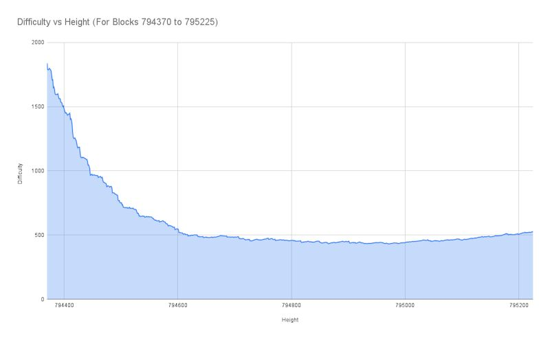
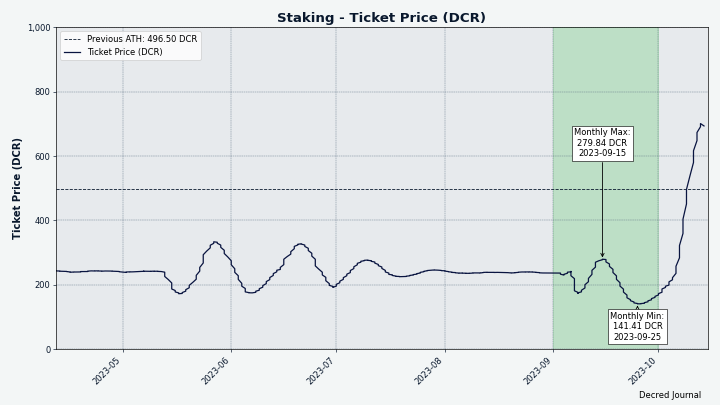
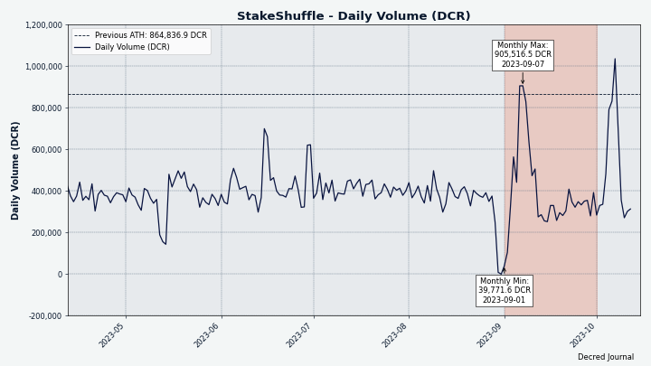
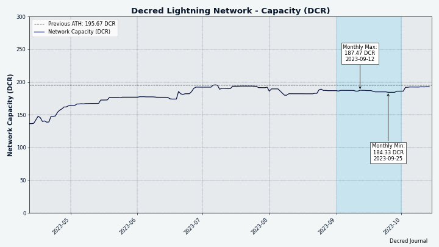
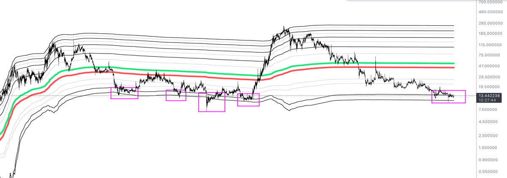
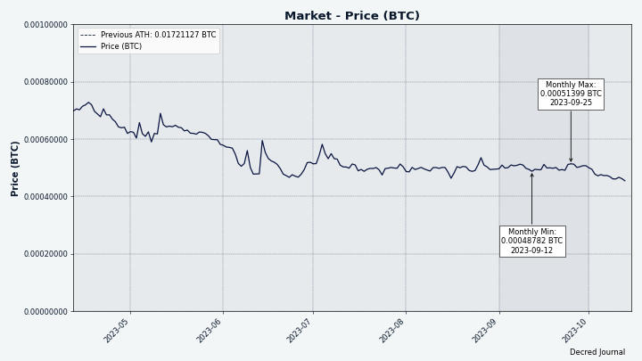

# Decred 月报 – 2023 年 9 月

_图片：@Exitus_

九月亮点：

- Decred 网络已切换到 BLAKE3 算法和 89% 权益证明奖励，但花了 3 天才开始挖掘新区块。

- gominer 和 BzMiner 增加了 Decred GPU 挖矿支持，导致算力爆炸式增长。

- Bison Relay v0.1.9 发布了许多修复和初始移动端设计。

- DCRDEX v0.6.3 已发布，修复了 BTC 钱包和保证金债券维护的问题。 Polygon 集成、交易机器人和其他功能的开发正在稳步推进。

内容:

- [网络升级和服务中断](#network-upgrade-and-service-outage)
- [Decred GPU 挖矿软件](#decred-gpu-mining-software)
- [Bison Relay v0.1.9 发布](#bison-relay-v019-release)
- [DCRDEX v0.6.3 发布](#dcrdex-v063-release)
- [开发进展总结](#development)
- [人员](#people)
- [治理](#governance)
- [挖矿](#mining)
- [网络](#network)
- [生态系统](#ecosystem)
- [外展](#outreach)
- [活动](#events)
- [媒体](#media)
- [市场](#markets)
- [市场相关信息](#relevant-external)

## 网络升级和服务中断

8月29日，共识变更提案[将PoW更改为BLAKE3和ASERT](https://github.com/decred/dcps/blob/master/dcp-0011/dcp-0011.mediawiki)和[将PoW/PoS奖励拆分更改为 1/89](https://github.com/decred/dcps/blob/master/dcp-0012/dcp-0012.mediawiki) 在 Decred 主网第 794,368 号区块上激活。 初始难度值被重置为目标 1.45 TH/s，预计 GPU 算力将在分叉日开始挖矿。 这个假设有历史依据，2016 年 2 月 Decred 推出时，GPU 挖矿就在没有任何公告的情况下开始了。 此外，自 [2023 年 4 月](https://proposals.decred.org/record/a8501bc) 以来，即将转向 BLAKE3 的消息已经公开了大约 5 个月。 然而，GPU 挖矿并没有按预期开始，网络面临着对于 CPU 来说极高的难度。 结果，该链停止生产区块几天。

任何依赖于获取新区块的服务都被暂停，例如：

- 中心化交易所暂时停止充值和提现
- DCRDEX 的 DCR 互换无法开始或完成
- 时间戳服务暂停
- Politeia 无法启动或停止提案投票
- Politeia 投票软件无法正常运行（投票需要技巧）
- LN 通道无法打开或关闭
- Bison Relay 功能受到限制（无法向钱包存款或取款，无法打开/关闭 LN 通道）

24 小时无区块后，矿工面临 dcrd 拒绝在旧区块之上挖矿的问题。 该问题的解决方法是调回系统时钟并在必要时重新生成证书。

区块 [794,369](https://dcrdata.decred.org/block/655d0c998b6f838a63a69991ebfb8dc776ed0234117c7b6cca407fe15c2cb02c) 最终于 9 月 1 日被开采，区块链再次开始运转。 一些 dcrd 节点由于遇到了不尝试获取新块的路径而必须重新启动。 最后一个问题解决后，新的 ASERT 算法调整了难度，并在数小时内恢复了正常的出块速度。

这次 2.9 天的中断创下了新纪录，打破了 [2017 年 4 月](https://twitter.com/decredproject/status/856193098879299584)，挖掘长达 9.6 小时的[区块 127,072](https://dcrdata.decred.org/block/127072)。

## Decred GPU 挖矿软件

GPU 挖矿在硬分叉一周后开始，并迅速取代了 CPU 挖矿。 9 月份公开发布了用于 GPU 挖矿 Decred 的两个软件选项：

- [gominer](https://github.com/decred/gominer) 支持在 OpenCL 和 CUDA 设备上进行 Decred 挖矿，包括 AMD 和 Nvidia GPU。 二进制文件当前不可用，但构建和设置过程[有详细记录](https://github.com/decred/gominer#readme)。

- [BzMiner](https://www.bzminer.com/) 自 17.0.0 版本起支持在 AMD、Nvidia 和 Intel GPU 上挖掘 Decred。 源代码不公开，但 BzMiner 拥有一长串的[功能](https://github.com/bzminer/bzminer)，并且与 gominer 相比可以实现更高的算力。 这些二进制文件可在 [GitHub](https://github.com/bzminer/bzminer/releases) 和 [bzminer.com](https://www.bzminer.com/) 上获取。

如需任何帮助，请加入 Matrix 或 Discord 上的 #pow-mining 聊天。

_图片：在 HiveOS 上运行的 BzMiner GUI_

## Bison Relay v0.1.9 发布

此版本改进了用户体验、密钥交换维护，并修复了 v0.1.8 中报告的错误。

GUI 和文本应用程序中的显着变化：

- 与闲置 21 天的用户自动握手，以保持联系人活跃
- 闲置60天的用户自动退订并踢出群聊
- 排除列表以防止某些用户（例如知名机器人）自动取消订阅

GUI 应用程序亮点：

- 改进了用户帖子列表
- 重置所有旧密钥交换的按钮
- 第一轮移动端UI设计实现（可将窗口宽度减小到500px以下进行测试）
- 修正：卡在设置流程、打开 URL 链接以及未读指示器可见性不正确的问题上

有一个[短视频](https://www.youtube.com/watch?v=Wz0Gn7Kdjeo) 演示了 GUI 应用程序中的新增功能。

文本应用程序亮点：

- 修复了 Simplestore 的各种问题
- 修复了本地页面的浏览问题
- 修复了聊天的 UI 错误

完整的发行说明和下载可以在[发行页面](https://github.com/companyzero/bisonrelay/releases/tag/v0.1.9)上找到。 建议按照 [README](https://github.com/companyzero/bisonrelay/tree/v0.1.9#verifying-binaries) 中的说明验证文件。

_图片：Bison Relay v0.1.9 中改进的通知_

## DCRDEX v0.6.3 发布

此版本包含几个重要的修复和改进。 建议所有用户更新。 独立应用程序的亮点：

- 交易限额随债券水平变化
- 修复了重新扫描内置BTC钱包时出现的常见错误
- 修复了债券在被替换之前可能完全到期的情况

请阅读完整的发行说明[此处](https://github.com/decred/dcrdex/releases/tag/v0.6.3)。

注意：截至撰写本文时，dexc 二进制文件也作为 [core v1.8.1 版本](https://github.com/decred/decred-binaries/releases/tag/v1.8.1) 的一部分提供。 这些二进制文件具有许多优点：它们使用 Decred Release 密钥进行签名，支持更多操作系统和 CPU 架构，并使用更新且更优化的 Go 工具链构建。

## 开发进展总结

除非另有说明，否则下面报告的工作为“合并至核心存储库”状态。这意味着该工作已完成、审查并集成到高级用户可以[构建和运行](https://medium.com/@artikozel/the-decred-node-back-to-the-source-part-one-27d4576e7e1c)的源代码中，但普通用户尚不可用。

### dcrd

_[dcrd](https://github.com/decred/dcrd) 是一个完整的节点实现，为 Decred 在全球的点对点网络提供支持。_

向后移植到 v1.8.1 版本的更改：

- 在“getblock”和“getblockheader”的详细输出中添加了新的[工作哈希证明](https://github.com/decred/dcrd/pull/3192)。
- 更改了 [`getnetworkhashps`](https://github.com/decred/dcrd/pull/3181) 以将 `-1` 视为默认值（向后 120 个块）。 “-1”之前的含义“自上次难度变化以来的块数”不再有意义，因为现在每个块都计算难度，而不是使用旧难度算法每 144 个块计算一次。

更改已合并到未来版本的“master”中：

- 将 Docker 镜像更新为 [Go 1.21.1](https://github.com/decred/dcrd/pull/3183)。
- 改进了“rpcserver”中的内部[错误处理](https://github.com/decred/dcrd/pull/3182)，使代码更干净且更难以滥用。
- 更改了 [`sampleconfig`](https://github.com/decred/dcrd/pull/3185) 包以使用 Go 的嵌入功能。 它允许将示例配置作为单独的文件，更易于使用，同时保留通过代码方便地访问其内容。
- 添加了用于访问“secp256k1/ecdsa”包中签名的[R和S值](https://github.com/decred/dcrd/pull/3188)的函数，这些值在某些计算中可能有用。
-添加了一些[新](https://github.com/decred/dcrd/pull/3190)[测试](https://github.com/decred/dcrd/pull/3191)以将测试覆盖率推至 99.6%。

### dcrwallet

_[dcrwallet](https://github.com/decred/dcrwallet) 是命令行和图形界面钱包应用程序使用的钱包服务器。_

向后移植到 v1.8.1 版本的更改：

- 更新了详细的 [`getblock` 和 `getblockhash`](https://github.com/decred/dcrwallet/pull/2285) 响应以包含新的工作哈希证明。

更改已合并到未来版本的“master”中：

- 更新了 DCP-12 中新区块奖励分割的 [VSP 费用计算](https://github.com/decred/dcrwallet/pull/2281)（权益证明奖励从 80% 增加到 89%）。 这段代码仅由 vspd 服务器使用，因此不需要向后移植。

### Decrediton

_[Decrediton](https://github.com/decred/decrediton) 是一款功能齐全的桌面钱包应用程序，集成了投票、StakeShuffle 混币、闪电网络、DEX 交易等功能。 它在有或没有完整的区块链（SPV 模式）的情况下运行。_

以下所有更改均已包含在 v1.8.1 版本（10 月发布）中。

Ledger集成的进展：

- 添加了[后端函数](https://github.com/decred/decrediton/pull/3869)用于与Ledger交互。 这是使用 [WebUSB](https://github.com/electron/electron/pull/36289) API，它允许基于 Electron 的应用程序访问 USB 设备。
- 为测试网添加了 [Ledger UI](https://github.com/decred/decrediton/pull/3874)。
- 在 [mainnet](https://github.com/decred/decrediton/pull/3906) 上启用 Ledger。 这已在 Linux、Windows 和 macOS 的 Nano X 和 Nano S Plus 设备上进行了测试。
- 回滚 [Electron](https://github.com/decred/decrediton/pull/3912) 至 v21.2.3，因为较新的版本导致 DEX 窗口出现问题。 这需要在未来的版本中进行[调查和修复](https://github.com/decred/decrediton/issues/3921)，因为[Electron v23](https://releases.Electronjs.org/release/v23.0.0)需要 WebUSB 支持，这为 Decrediton 中的 Ledger 集成提供了支持。

其他：

- 将 [DCRDEX 模块](https://github.com/decred/decrediton/pull/3905) 更新至 v0.6.3 并启用其新的“扩展模式”，以保护 Decrediton 的钱包不会在 DEX 窗口中被错误配置。
- 更新了[中文翻译](https://github.com/decred/decrediton/pull/3893)。
- ~8 项更改更新了 Web 依赖项并修复了小错误。

### vspd

_[vspd](https://github.com/decred/vspd) 是投票服务提供商使用的服务器软件。 VSP 代表其用户全天候 24/7 投票，不能窃取资金。_

9 月份的 vspd 工作不断提高了用户、管理员和开发人员的操作质量。

下面列出的所有更改均已包含在 [v1.3.0](https://github.com/decred/vspd/releases/tag/release-v1.3.0) 和 [v1.3.1](https://github.com/decred/vspd/releases/tag/release-v1.3.1)版本，于 9 月发布。

面向用户的变化：

- 在 VSP [主页](https://github.com/decred/vspd/pull/417) 和 [`/vspinfo` 响应](https://github.com/decred/vspd/pull/421) 中添加了单独的过期和错过的选票计数。 此前报告的“已撤销选票”是过期选票和错过选票的总和； 单独列出错过的选票是评估 VSP 可靠性的更好指标，因为过期选票不是 VSP 的错。
- 更新了 [VSP 费用计算](https://github.com/decred/vspd/pull/435) 以考虑 DCP-12 中指定的新区块奖励分割。
- 如果 VSP 在 [testnet 或 simnet](https://github.com/decred/vspd/pull/417) 上运行，则会出现新的黄色顶部横幅。 [调试横幅](https://github.com/decred/vspd/pull/443) 已更改为红色，因为调试模式不应在生产中使用。

VSP 管理员的更改：

- 添加了一个新的管理页面，其中列出了所有已在 VSP 中注册但[错过了投票](https://github.com/decred/vspd/pull/451) 的票证。
- 优化了[投票和撤销票证的发现](https://github.com/decred/vspd/pull/416)，运行速度提高了一倍。 这是通过使用 dcrd 的 `gcs` 包中不同的[匹配函数](https://github.com/decred/dcrd/blob/dc41075594cfdef63e8a64340b4fc5651a56a604/gcs/gcs.go#L304)来实现的，该包是[更好优化](https://github.com/decred/vspd/pull/413#issuecomment-1694228745)用于这项工作。
- 改进了处理[关闭请求](https://github.com/decred/vspd/pull/426)的响应能力，并删除了一些重复的样板代码。
- 改进了在各种操作系统上处理[关闭信号](https://github.com/decred/vspd/pull/438)的兼容性。
- 更改了 Web API，以便在 Web API 缓存未准备就绪时返回[显式错误](https://github.com/decred/vspd/pull/440)。 这将使管理员立即意识到可能的问题。 以前，如果缓存未准备好，则渲染网页时不会显示任何数据，也不会显示任何错误。
- 确保[启动/关闭消息](https://github.com/decred/vspd/pull/427)始终是要记录的第一个/最后一个消息。
- 调整[日志记录](https://github.com/decred/vspd/pull/445)以减少不必要的垃圾邮件。
- 添加了 [v1.3.0](https://github.com/decred/vspd/pull/447) 和 [v1.3.1](https://github.com/decred/vspd/pull/452) 的发行说明 。

内部和开发人员变更：

- 恢复了在 simnet 上运行 [vspd](https://github.com/decred/vspd/pull/419) 的能力，DCRDEX 需要它来测试新的质押功能。
- 通过[更好地使用 dcrd](https://github.com/decred/vspd/pull/422) 进行小型性能优化。
- 未导出一些代码并将其[移动](https://github.com/decred/vspd/pull/428)到[内部](https://github.com/decred/vspd/pull/430)[包](https://github.com/decred/vspd/pull/436)因为它不适合第三方使用。 小型公共 API 接口使开发和维护更加容易。
- 重新设计了组件的[创建、启动](https://github.com/decred/vspd/pull/434)和[停止](https://github.com/decred/vspd/pull/436) 解耦并简化代码。
- 修复了[数据库备份](https://github.com/decred/vspd/pull/439) 仅运行一次而不是定期运行（未发布的错误）。
- 约 20 次提交，进行了较小的改进和代码清理。

_图片：vspd 管理面板中错过的选票_

### gominer

_[gominer](https://github.com/decred/gominer) 是一个 Decred 工作证明挖矿软件，可使用 OpenCL 和 CUDA 设备进行单独和矿池挖矿。_

9 月份 gominer 开发的主要目标是对第一批不公开共享代码并因此开始主导算力的 GPU 矿工做出快速反应。 gominer 的更新允许任何人使用 GPU 进行挖矿。 除了添加 BLAKE3 GPU 挖矿支持之外，我们还努力自动化或记录设置过程，以解决矿工报告的多个痛点。

BLAKE3 GPU挖矿：

- 添加 [通过 OpenCL 进行 BLAKE3 GPU 挖掘](https://github.com/decred/gominer/pull/194) 的支持。 它包括基于中间状态的自定义优化 BLAKE3 OpenCL 内核，用于支持与 OpenCL 和 OpenCL 和 ADL 配合使用的 GPU。 “内核”是用专门的 [OpenCL 内核语言](https://en.wikipedia.org/wiki/OpenCL#OpenCL_kernel_language) 编写的，在 GPU 上运行的程序。 此更改还改进了 CL 设备的发现，随机化随机数以确保每个设备执行不同的工作，并改进了哈希值显示。
- 添加了对 Linux 上 [使用 CUDA 进行 BLAKE3 GPU 挖掘](https://github.com/decred/gominer/pull/195) 的支持。 CUDA 是 GPU 上的高性能计算平台。 OpenCL 内核已调整为可使用 CUDA 工具包进行编译。 与 OpenCL 不同，[CUDA](https://en.wikipedia.org/wiki/CUDA) 是专有的、闭源的，并且仅适用于 Nvidia 卡。 然而，CUDA 允许控制超频和风扇速度，从而有可能显着提高效率。 鉴于电力成本是盈利能力的一个重要因素，这种权衡通常是有意义的。
- 添加了用于在 [Windows](https://github.com/decred/gominer/pull/206) 上构建支持 CUDA 的 gominer 版本的脚本和说明。 在 Windows 上构建支持 CUDA 的 Go 程序比在 Linux 上[更复杂](https://github.com/decred/gominer/blob/7e2fb9e40e5568d4c85636c7c7ef1474eb44cf6c/cuda_builder.go#L5)，但新的构建器竭尽全力 尽可能使该过程自动化。 如果检测到缺少依赖项或环境配置，构建器将打印有关如何解决问题的人类可读指示。 添加了[手动说明](https://github.com/decred/gominer/blob/7e2fb9e40e5568d4c85636c7c7ef1474eb44cf6c/docs/cuda-manual-windows-build.md)作为自动构建器不起作用的后备方案。 此更改还消除了对 GNU Make 的依赖。
- 添加了对 [CUDA 版本早于 10](https://github.com/decred/gominer/pull/216) 的支持。 这使得能够在更多配置上构建 gominer，尽管较旧的 CUDA 版本性能会显着下降。 在构建过程中将[自动检测](https://github.com/decred/gominer/pull/n/commits/a7076d78a46f9b9d9277fb3f92620ed130d5e7e9)安装的CUDA工具包版本和GPU架构，以使用最佳的GPU功能，特别是快速[漏斗转移](https://stackoverflow.com/questions/12767113/funnel-shift-what-is-it)内在的。
- 修复了[自动校准](https://github.com/decred/gominer/pull/218/commits/d3e68cf1e370e94eb50b1e74d5b2446b8e24c4ad)无法释放设备并导致实际挖掘循环失败的问题。

GPU 编程并不是 Decred 开发人员每天都会做的事情，但这个 OpenCL 内核已证明速度相当快。 例如，它在 RTX 3070 上达到 10-12 GH/s，接近 [WhatToMine](https://whattomine.com/gpus/48-nvidia-geforce-rtx-3070) 报告的 12 GH/s IronFish 是另一种基于 BLAKE3 的挖矿算法。 更好的比较需要考虑细节（哈希数据的大小、哈希轮数等），但迄今为止报告的哈希率表明 gominer 足以使 GPU 挖掘更加公平并且可供更多人使用。

自述文件更新：

- 将 Windows OpenCL 构建指令切换为 [MSYS2](https://github.com/decred/gominer/pull/196)。
- 添加了适用于 Linux 的 OpenCL AMD/Nvidia [构建说明](https://github.com/decred/gominer/pull/198)。
- 添加了[配置说明](https://github.com/decred/gominer/pull/199)。
- 添加了[用户报告的哈希率](https://github.com/decred/gominer/pull/201)。

其他变化：

- 改进了[关闭处理](https://github.com/decred/gominer/pull/207)。
- 19 [housekeeping](https://github.com/decred/gominer/pull/210) 并清理提交，包括添加更多的 linter 以防止不良代码进入。
- 修复了[几个](https://github.com/decred/gominer/pull/204)[问题](https://github.com/decred/gominer/pull/205)与[Stratum](https://braiins.com/stratum-v1)协议。

### dcrpool

_[dcrpool](https://github.com/decred/dcrpool) 是用于运行 Decred 矿池的服务器软件。_

与 gominer 类似，自 2021 年夏季 v1.2.0 版本发布以来，dcrpool 开发经历了一段低活跃期后已重新启动。 开发人员将代码库升级到最新的 Go 功能，修复了多个并发和关闭边缘情况，所有这些都是为了添加池化 GPU 挖掘支持而做准备。

升级和改变：

- 内部CPU矿工添加了[BLAKE3支持](https://github.com/decred/dcrpool/pull/341)，用于测试。
- 提高了计算[可能的迭代次数](https://github.com/decred/dcrpool/pull/360)时的准确性。
- 改进了日志消息以跟踪[超时的客户端](https://github.com/decred/dcrpool/pull/376)。
- 改进了[信号处理](https://github.com/decred/dcrpool/pull/381)，以在更多 Unix 变体以及 Windows 上更干净地关闭，以响应用户注销等事件 ，终端被关闭，或者系统关闭。
- 更新了[构建代码](https://github.com/decred/dcrpool/pull/386)以使用Go 1.21和PostgreSQL 16.0。
- 删除了所有 bbolt [数据库升级](https://github.com/decred/dcrpool/pull/391) 并将数据库版本重置为 1。这允许删除不再需要维护的大量代码，给出 开发人员可以在下一个版本发布之前灵活地更改数据库格式，并且可以避免因数据不一致而导致的潜在错误和支持问题。 此更改假设 dcrpool 没有已知的公共部署，并建议标记下一个版本 v2.0.0 以反映数据库格式与上一个主要版本 v1.2.0 不兼容。

修复：

- 更正了[关闭逻辑](https://github.com/decred/dcrpool/pull/351)，以确保在进程因错误而退出时正确关闭日志文件。
- 修复了一些配置[未按预期记录错误](https://github.com/decred/dcrpool/pull/352)的情况，并删除了代码重复。
- 确保所有错误路径上的[数据库已关闭](https://github.com/decred/dcrpool/pull/353)。
- [快速失败](https://github.com/decred/dcrpool/pull/377) 如果 GUI Web 服务器的侦听端口已在使用中。 在此更改之前，如果 GUI 无法正常启动，dcrpool 进程将继续运行，这不是预期的行为。 现在，该过程将快速终止，并允许管理员立即解决任何问题。
- 修复了重复[工作共享ID](https://github.com/decred/dcrpool/pull/390)和[付款ID](https://github.com/decred/dcrpool/pull/392)的边缘情况 可以生成。 这些 ID 中添加了随机数，以确保它们是唯一的。 这修复了快速硬件上的测试失败。
- 并发、取消、关闭逻辑和错误处理方面的约 9 个修复。

重构：

- 删除了用于将 dcrpool 作为 [Windows](https://github.com/decred/dcrpool/pull/342) [服务](https://github.com/decred/dcrpool/pull/349) 运行的未使用代码。
- ~11 承诺清理代码并启用新的 linter。
- 重新设计了应用程序[版本号的处理方式](https://github.com/decred/dcrpool/pull/355)，以使用 dcrd 和 dcrwallet 中更强大的方法。
- 重新设计了多个子系统的生命周期，使其启动和关闭更加可靠、更易于推理，并免受未来意外变化的影响。 子系统是：[矿池集线器](https://github.com/decred/dcrpool/pull/356)、[GUI](https://github.com/decred/dcrpool/pull/370)[Web 服务器](https://github.com/decred/dcrpool/pull/371)、[池端点和客户端](https://github.com/decred/dcrpool/pull/373)和[链状态](https://github.com/decred/dcrpool/pull/378)。 断开连接[池客户端](https://github.com/decred/dcrpool/pull/380)的处理已得到简化。
- 制作了“gui”包[内部](https://github.com/decred/dcrpool/pull/357)。
- ~9 次提交，包括内存管理和并发性方面的小改进。

文档：

- 添加了 PostgreSQL 的最新[测试版本](https://github.com/decred/dcrpool/pull/384) 并更新了创建数据库的最佳实践。
- 更新并简化了[构建和设置说明](https://github.com/decred/dcrpool/pull/385)。

测试代码：

- 从压缩的测试数据存档中读取[以块的形式](https://github.com/decred/dcrpool/pull/348) - 避免不受控制的分配的良好实践。
- 使测试工具更容易在 [Windows](https://github.com/decred/dcrpool/pull/368) 上运行。
- 使[端点测试](https://github.com/decred/dcrpool/pull/387)更加强大。
- 允许[保留测试数据库](https://github.com/decred/dcrpool/pull/389)以便在测试失败后进行检查。
- 删除了与 ASIC 相关的所有代码，这些代码不再能够挖掘 Decred 并且不再受 dcrpool 支持。

### Lightning Network

_[dcrlnd](https://github.com/decred/dcrlnd)是Decred的闪电网络节点软件。 LN 使即时和低成本交易成为可能。_

- 删除了目标 [100 个对等连接](https://github.com/decred/dcrlnd/pull/190) 的自定义配置（[继承](https://github.com/lightningnetwork/lnd/blob/d233f61383f2f950aa06f5b09da5b0e78e784fae/server.go#L1413lnd)。
- 修复了如果未设置“--routing”选项的[启动失败](https://github.com/decred/dcrlnd/pull/191)。
- 针对 [Go 1.21](https://github.com/decred/dcrlnd/pull/192) 进行构建和测试。
- [v0.4.0 版本](https://github.com/decred/dcrlnd/releases/tag/v0.4.0) 已被标记以标记核心软件 v1.8.0 版本中包含的修订版。
  

### DCRDEX

_[DCRDEX](https://github.com/decred/dcrdex) 是一种非托管的、尊重隐私的交易所，用于去信任交易，由原子交换提供支持。_

[v0.6.3 版本](https://github.com/decred/dcrdex/releases/tag/v0.6.3) 中包含 9 月份的更改：

- 添加了[扩展模式](https://github.com/decred/dcrdex/pull/2486)，这是一种限制模式，DCRDEX 不允许更改钱包类型、钱包密码或钱包帐户等设置。 当 DEX 作为 Decrediton 的一部分运行时，这将防止钱包配置错误。

下面列出的工作已合并到未来版本的“master”中。

Decred:

- 添加了极简的[VSP质押GUI](https://github.com/decred/dcrdex/pull/2482)，具有以下功能：选择VSP、查看当前选票价格和投票奖励、购买选票、查看全部- 时间质押统计、查看拥有的票列表、查看和设置投票偏好（共识议程、国库支出和国库密钥）。
- 允许指定 [VSP API](https://github.com/decred/dcrwebapi/blob/) 中未列出的 [自定义 VSP](https://github.com/decred/dcrwebapi/blob/master/docs/api.md)。

Firo:

- 实施了 Firo [区块解析](https://github.com/decred/dcrdex/pull/2488) 以在测试网上启用费用估算。
  
Ethereum:

- 实现了 [WebSocket 订阅](https://github.com/decred/dcrdex/pull/2490)，以便 DEX 服务器可以比轮询更有效地从链数据提供者获取新的块头。 当仍然使用 HTTP 轮询时，对于非本地源，轮询间隔将自动增加。 以前，更改此间隔需要重建服务器。
- 实施了用于[获取余额](https://github.com/decred/dcrdex/pull/2520) ETH 和任意数量代币的智能合约，以大大降低对提供商的请求率。 此外，还添加了响应缓存，以进一步减少块之间对提供者的请求。

Polygon (MATIC):

- 全面更改以完成最初的 [Polygon 支持](https://github.com/decred/dcrdex/pull/2431)：通用化以太坊钱包和服务器后端以重用通用代码，添加 RPC 兼容性测试，添加 Polygon 对测试工具和 Gas 估算的代币支持，在 Polygon 主网上部署了 USDC 互换合约，更新了与代币相关的 UI 代码。 为了方便用户，Polygon 和以太坊钱包将使用相同的种子并派生相同的私钥和地址，如[此处讨论](https://github.com/decred/dcrdex/pull/2431#issuecomment-1650510000)。
- 添加了对封装代币 [WBTC 和 WETH](https://github.com/decred/dcrdex/pull/2522) 的支持，并根据测试结果调整 Gas 费率。

客户端 GUI:

- 改进了[活动订单用户界面](https://github.com/decred/dcrdex/pull/2171)：在一张表中显示实时订单和最近订单，并在悬停订单时显示按钮，以便用户无需执行操作即可执行操作展开行。
- 在多个地方显示[平均交易率](https://github.com/decred/dcrdex/pull/2463)。
- 如果密码已缓存，则在 DEX 服务器上创建帐户时跳过冗余的[密码输入步骤](https://github.com/decred/dcrdex/pull/2542)。

客户端后台：

- 实现了钱包可以发送到 GUI 的[异步通知](https://github.com/decred/dcrdex/pull/2492)。 这将允许解决一些问题并在更多情况下使 GUI 保持最新。
- 允许客户端使用受信任的[证书颁发机构](https://github.com/decred/dcrdex/pull/2513)提供的证书连接到DEX服务器。 以前，必须手动配置服务器证书。
- 优化了[汇率获取](https://github.com/decred/dcrdex/pull/2512)逻辑和超时。
- 修复了意外[债券到期](https://github.com/decred/dcrdex/pull/2460)和取消所有订单的可能性，这是由“奖励等级”概念和对账户交易的错误猜测引起的 层在客户端。

客户端、交易机器人：

- 使用简单的策略实现了[套利机器人](https://github.com/decred/dcrdex/pull/2480)，该策略仅在 DEX 和中心化交易所之间存在套利机会时才下订单（最初支持币安） 。
- 更新了 [做市商 UI](https://github.com/decred/dcrdex/pull/2491)，其中现在包括一个概述页面，其中包含所有配置的机器人和每个机器人的设置页面。 配置存储在 JSON 文件中。 市场页面也进行了更新，不允许用户在做市时手动下订单。
- 修复了做市商机器人稍后在必要的匹配数据可用时[重新平衡](https://github.com/decred/dcrdex/pull/2517)。

文档：

- 更新了内置（又名本机）BTC 钱包的[钱包恢复和重新扫描指南](https://github.com/decred/dcrdex/pull/2473)。
- 为 v0.6.3 添加了[发行说明](https://github.com/decred/dcrdex/pull/2536)。

服务器：

- 在配置文件中允许[禁用市场](https://github.com/decred/dcrdex/pull/2487)。
- 允许服务器运行[不使用 TLS 加密](https://github.com/decred/dcrdex/pull/2515)，例如由 nginx 处理加密的设置。
- 新增[反向隧道](https://github.com/decred/dcrdex/pull/2493)用于获取链上数据服务。 他们可以发起与公共 DEX 服务器的连接并提供 RPC 服务，而不是连接数据提供者的 DEX 服务器。 这允许从无法接受连接的私有节点获取链数据。 与之前使用的 SSH 隧道相比，集成反向隧道具有一些优势，可以实现相同的目标，例如配置简单。 DEX 服务器可以从多个源节点消耗数据以实现冗余。

其他：

- 将[最低 Go 版本](https://github.com/decred/dcrdex/pull/2521) 增加到 1.19。
- 修复了 [Debian](https://github.com/decred/dcrdex/pull/2525) 的桌面构建。
- 添加了用于设置[两个钱包](https://github.com/decred/dcrdex/pull/2535)的脚本，以便在主网和测试网上进行手动测试。 这允许测试更多场景。
- ~11 个较小的更改和修复。

_图片：DCRDEX 中的 Decred 质押 UI_

_图片：DCRDEX 中的多边形集成_

### Cryptopower

_[Cryptopower](https://github.com/crypto-power/cryptopower) 是一款适用于 DCR、BTC 和 LTC 的多币种桌面 GUI 钱包。 它以保护隐私的轻 SPV 模式运行，无需完整的区块链，支持 Decred 质押、混合、投票和其他独特功能。_

下面列出的所有更改已合并到未来版本的“master”中。

新的概述页面：

- 使用[虚拟数据](https://github.com/crypto-power/cryptopower/pull/)实现了新的[主页](https://github.com/crypto-power/cryptopower/pull/65)设计并将功能重新组织为 3 个高级选项卡：概述、钱包和交易。
- 使用[最近交易卡](https://github.com/crypto-power/cryptopower/pull/104)中的真实数据。
- 在[余额卡](https://github.com/crypto-power/cryptopower/pull/115)中使用真实的钱包数据。
- 添加了以美元显示[总资产价值](https://github.com/crypto-power/cryptopower/pull/68/commits/f393b5304359f16df92d385e7f93fcc24567692d)的模式。

去中心化交易所集成：

- 添加了[DEX onboarding](https://github.com/crypto-power/cryptopower/pull/119)的第一步。

面向用户的变化：

- 加载 VSP 列表时显示[加载指示器](https://github.com/crypto-power/cryptopower/pull/73)。
- 当混币器未运行时隐藏[混币进度条](https://github.com/crypto-power/cryptopower/pull/70)。
- 应用程序重新启动时持久的[余额隐藏](https://github.com/crypto-power/cryptopower/pull/81)设置。
- 添加了[接收资金](https://github.com/crypto-power/cryptopower/pull/108)的模式，可以通过单击“接收”按钮从任何地方访问该模式。

面向用户的修复：

- 修复了即时兑换功能的最近订单列表中的[缺少图标](https://github.com/crypto-power/cryptopower/pull/64)。
- 修复了交易概述中列出的[质押交易](https://github.com/crypto-power/cryptopower/pull/92)，而不是质押活动。
- 修复了概览页面上[资产余额卡](https://github.com/crypto-power/cryptopower/pull/95)的宽度。
- 修复了成功创建或恢复钱包后不显示的[主页](https://github.com/crypto-power/cryptopower/pull/105)。
- 修复了美元总余额和通知铃声在[黑暗模式](https://github.com/crypto-power/cryptopower/pull/132)下不可见的问题。
- 修复了将应用程序加载到[概述页面](https://github.com/crypto-power/cryptopower/pull/133)时发生的崩溃。
- 修复了点击[质押交易](https://github.com/crypto-power/cryptopower/pull/136)时的崩溃问题。
  
Decred:

- 修复了[提案投票栏](https://github.com/crypto-power/cryptopower/pull/63) 上显示的是/否票的错误百分比。
- 修复了钱包未同步时质押页面上的[日志垃圾邮件](https://github.com/crypto-power/cryptopower/pull/106)。

Litecoin:

- 修复了每次应用程序重新启动后不必要运行的[地址发现](https://github.com/crypto-power/cryptopower/pull/59)。
  
Android:

- 创建了一个原型 [Kotlin 项目](https://github.com/crypto-power/cryptopower-android)。
- 通过将数据存储在[应用程序的私有目录](https://github.com/crypto-power/cryptopower/pull/116)中，修复了 Android 11+ 上的应用程序启动问题。 作为一个额外的优势，这使得其他应用程序无法访问应用程序文件。

内部和开发人员变更：

- 修复了“instantswap”库中一些[即时交换](https://github.com/crypto-power/instantswap/pull/6)的问题。

_图片：Cryptopower 中的提案投票_

_图片：Crypto Power 使用集中式即时兑换服务的近期交易

_图片：Cryptopower 中的 DCRDEX 页面_

_图片：Cryptopower 即将推出的概述页面的设计（实际实现可能有所不同）_

### Documentation

_[dcrdocs](https://github.com/decred/dcrdocs) 是 Decred [用户文档](https://docs.decred.org/) 的源代码。_

- [更新](https://github.com/decred/dcrdocs/pull/1228) [工作量证明](https://docs.decred.org/mining/overview/) 页面删除了与 ASIC 相关的遗留文档，并添加了有关 BLAKE3 和 CPU 挖掘的信息。
- 更新了[项目历史记录](https://github.com/decred/dcrdocs/pull/1232) 时间线，添加了一些值得注意的事件，例如 Bison Relay 的推出、BLAKE3 的 GPU 挖掘以及区块奖励变化。
- 将 `blake3pow` 和 `changesubsidysplitr2` [提案](https://github.com/decred/dcrdocs/pull/1231) 添加到[共识投票存档](https://docs.decred.org/governance/consensus-rule-voting/consensus-vote-archive/)。

### decred.org

_[dcrweb](https://github.com/decred/dcrweb) 是 [decred.org](https://decred.org/) 网站的源代码。_

- 更新了[新闻稿](https://github.com/decred/dcrweb/pull/1136)格式。
- 更新了[阿拉伯语翻译](https://github.com/decred/dcrweb/pull/1140)。
  
### Bison Relay

_[Bison Relay](https://github.com/companyzero/bisonrelay) 是一个新的社交媒体平台，具有针对审查、监视和广告的强大保护，由 Decred 闪电网络提供支持。_

v0.1.9 版本中 GUI 和文本应用程序的 9 月份更改：

- 显示联系日期[创建和最后一次握手尝试](https://github.com/companyzero/bisonrelay/pull/348)。
- 添加了[忽略列表以自动取消订阅空闲用户](https://github.com/companyzero/bisonrelay/pull/349)。 此列表中的用户即使处于空闲状态，也不会自动取消订阅或从群聊中删除。 默认情况下，它包括众所周知的机器人（Oprah 和 GC 机器人），但可以使用新的配置文件选项“autoremoveignorelist”添加更多用户。
  
v0.1.9 版本中包含的 GUI 应用程序更改：

- 实施了第一轮[移动优化的 UI 设计](https://github.com/companyzero/bisonrelay/pull/334)。 其中包括解锁屏幕、LN 概述、提要帖子、移动抽屉/侧边栏、聊天列表和新图标。 可以通过将窗口宽度减小到 500 像素以下来测试移动布局。
- 更新了[直接和群聊](https://github.com/companyzero/bisonrelay/pull/343)的移动设计，并添加了日期更改指示器。
- 改进了[用户帖子列表](https://github.com/companyzero/bisonrelay/pull/300)。 以前，它只是直接聊天窗口中的文本。 新列表看起来与动态消息类似，并指示帖子是否已下载。 用户菜单已调整为如果未订阅则显示“订阅帖子”项目，如果订阅则显示“列出帖子”和“取消订阅帖子”项目。
- 在“设置”页面添加了一个按钮，尝试与过时的用户[重置所有旧密钥交换](https://github.com/companyzero/bisonrelay/pull/345)。 从服务器获取被视为“过时”的无活动时间段。
- 修复了在关闭所有闪电网络通道并重新启动应用程序后[无法添加闪电网络容量](https://github.com/companyzero/bisonrelay/pull/338)。
- 修复了[新评论指示器](https://github.com/companyzero/bisonrelay/pull/342)在查看帖子时不会消失，修复了新聊天指示器不会出现在新消息上的问题。
- 修复了消息的[不必要的重画](https://github.com/companyzero/bisonrelay/pull/344)。
- 修复了小（移动）屏幕上的[解锁页面](https://github.com/companyzero/bisonrelay/pull/353)崩溃问题。

v0.1.9 版本中包含的 brclient 更改：

- 如果没有运行提示尝试，则创建“/list runningtips”命令[返回错误](https://github.com/companyzero/bisonrelay/pull/347)。
- 修复了与本地[页面和商店](https://github.com/companyzero/bisonrelay/pull/335)交互时的问题。 “/ln payinvoice”命令现在可以理解发票链接中的“lnpay://”前缀。 “订单完成”页面得到增强，可显示订单详细信息和发票的有效期（1 小时）。 如果 LN 发票创建失败，例如，如果卖方没有足够的入站 LN 容量，则将创建一个链上付款地址作为备用地址。

在其他新闻中，@vctt 正在制作一个基于 brclient 的[扑克游戏](https://matrix.to/#/!GHnoHXSgkVasUknRUg:decred.org/$sP-K9yQG-ohkPm4G4XVfyaXBcFq2_pvQ4EbxtdePBgU) 概念验证。 在第二次迭代中，扑克逻辑已[转换为机器人](https://matrix.to/#/!GHnoHXSgkVasUknRUg:decred.org/$fKQ_Emk1kqGH4mbV7aFXddMiSNKFTRa3b7PSiDsWlBw)，这更容易集成到现有客户端中。 代码可以在[此处](https://github.com/companyzero/bisonrelay/compare/master...vctt94:bisonrelay:poker-bot)找到。

_图片：Bison Relay v0.1.9 中移动设计的第一次迭代_

_图片：brclient v0.1.9 中的页面_

_图片：Bison Relay GUI 中的扑克机器人 PoC 游戏_

## 人员

欢迎新的首次贡献者：

- minizilla (development, [dcrd](https://github.com/decred/dcrd/pull/3188))
- omahs (development, [dcrdex](https://github.com/decred/dcrdex/pull/2533))
- Clopas (development, [dcrweb](https://github.com/decred/dcrweb/pull/1139))

截至 10 月 2 日的社区统计数据（与 9 月 2 日相比）：

- [Twitter](https://twitter.com/decredproject) 关注者：53,407 (+101)
- [Reddit](https://www.reddit.com/r/decred/) 订阅者：12,757 (+6)
- [Matrix](https://chat.decred.org/) #普通用户：819 (+14)
- [Discord](https://discord.gg/GJ2GXfz) 用户：1,795 (+134)，已验证发帖人数：744 (+67)
- [Telegram](https://t.me/Decred) 用户：2,321 (+18)
- [YouTube](https://www.youtube.com/decredchannel) 订阅者：4,640 (+0)，观看次数：24 万 (+5.4K)

## 治理

9 月份，新[国库](https://dcrdata.decred.org/treasury) 收到了 8,374 个 DCR，价值 111,000 美元，9 月份的平均汇率为 13.23 美元。

由于管理员审批时间延迟，9 月份没有开采任何国库支出交易，但在10月1日之后上开采了 [国库支出交易](https://dcrdata.decred.org/tx/dad857ec261237d51247d4bfae1a1ffb4348c8a7ed8933b2b877e6cac1d75436) 以 99.9% 的赞成票和 64% 的投票率获得批准，为迄今为止最高。 该 Tspend 涵盖了 7 月和 8 月的大部分账单，旨在缩小已完成工作和已付款之间不断扩大的差距。 它有 53 个输出，范围从 7 DCR 到 1,719 DCR。 7 月份的计费费率为 15.40 美元/DCR，8 月份的计费费率为 13.89 美元/DCR，按照平均 14.65 美元/DCR 计算，这笔付款将涵盖这两个月总计约 123,000 美元的费用。

截至 10 月 5 日，[旧国库](https://dcrdata.decred.org/address/Dcur2mcGjmENx4DhNqDctW5wJCVyT3Qeqkx) 和[新国库](https://dcrdata.decred.org/treasury) 的总余额为 866,862 DCR (11.4 百万美元，价格为 13.20 美元）。

_图片：国库每月余额（美元）； 请注意，这在很大程度上取决于汇率_

两项提案的投票已于 9 月份完成，但投票期间因 DCP-0011 的激活而中断，并且区块链停滞了大约 3 天，等待使用新哈希函数找到新区块，随后 随着 GPU 矿工开始在网络上运行，区块快速生产的时期。 超过 24 小时的延迟导致钱包软件中的某些安全措施被激活，钱包软件确信客户端一定处于离线状态，并且会阻止正常的投票行为。

- 适用于桌面和移动设备的 Cryptopower 多资产 Golang 钱包 [提案](https://proposals.decred.org/record/256efee) 预算为 61,600 美元，以 69.6% 的赞成票和 62% 的投票率获得批准。

- Cake Wallet 集成 [提案](https://proposals.decred.org/record/2f25f2d) 请求 80,000 美元在 [Cake Wallet](https://cakewallet.com/) 中集成基本 DCR 功能，但未能达到法定人数 尽管支持率是 87%，但投票率只有 18%。 Cake Wallet投票是在Cryptopower提案投票超过1天后才被授权并开始的，因此Cake Wallet投票受到投票系统问题的影响更为严重。

本月发布了两项提案，其中一项是 Cake Wallet 集成提案的重复。

- [蛋糕钱包再次集成](https://proposals.decred.org/record/b3bdacb) 又回来了，再次尝试满足法定人数要求。

- @l1ndseymm 的[公共关系提案](https://proposals.decred.org/record/0c04c6f) 的第五次迭代最初要求再一年增加 60,000 美元，然后减少到 48,000 美元。

围绕上述提案的更多事件和细节已在 [Politeia Digest 第 64 期](https://blockcommons.red/politeia-digest/issue064/) 中介绍。

## 挖矿

Decred 挖矿于 8 月 29 日重新启动，当时 ASIC 挖出了最后一个区块，并且该链切换到 BLAKE3 工作量证明。

由于从网络中删除所有 ASIC 算力，因此挖掘难度必须重置为足够低的值，以允许商用硬件挖掘新的 BLAKE3 块。 为了进行比较，ASIC 开采的[最后一个区块](https://dcrdata.decred.org/block/0000000000000000c293d8c67409d05e960447ea25cdaf770e864d995c764ef0)的难度为 35 亿，而下一个区块的难度值为 101,000，即低 35,068 倍。

初始难度值被手动设置为[GPU算力预期](https://matrix.to/#/!TSpuyuYWgkTrgPTcXh:decred.org/$mtTPqh-YoNoXn-Q8-Q8K0390wy28L4XrD8Udx9yDU6U)中的目标约1.45 TH/s算力， 但它并没有立即加入网络，并且在 BLAKE3 激活后只有 CPU 矿工处于活动状态。 单个 CPU 每秒可实现约 5-75 兆哈希（从旧笔记本电脑到高端 CPU）。 假设“平均 CPU”为 20 MH/s，获得 1.45 *terahashes* 将需要大约 72,500 个 CPU。 第一个 BLAKE3 区块（794,368）非常幸运，假设是通过 CPU 找到的，只用了 50 分钟就找到了，但之后链就停滞了。

一个积极的发展是，这次事件激发了许多新老社区成员聚集在一起，推动链条向前发展。 随着人们将任何可用的硬件转换为 Decred 矿工并忍受产生的多余热量，#pow-mining 聊天变得非常繁忙。 设备范围从微型 Raspberry Pi (1 MH/s)、旧笔记本电脑 (2-5 MH/s)、新笔记本电脑和台式机 (10-20 MH/s)、到具有 16 和 32 核的巨大 120 瓦+处理器（ 60-75 兆赫/秒）。

> 我不得不说，我喜欢这将每个人聚集在一起的方式。 我怀念这种协作精神。[[@jazzah](https://matrix.to/#/!TSpuyuYWgkTrgPTcXh:decred.org/$dXjs1Gqsw5jE2v1p9Ly5mwo_JaQXU_KDsrg_FyeI4i0)]

截至 8 月 31 日，大约 25 人报告了总共 550 MH/s，但这（以及任何未报告的哈希率）仍然不够。 9 月初，@grumlin 和 @davecgh 转向[云算力](https://matrix.to/#/!TSpuyuYWgkTrgPTcXh:decred.org/$-Ql5Vva-X-A2ds34OYP0HZZs8O8fsikHIeTH6zlN9yU)并在大约 3 小时内[区块 794,369 ](https://dcrdata.decred.org/block/655d0c998b6f838a63a69991ebfb8dc776ed0234117c7b6cca407fe15c2cb02c)[找到](https://matrix.to/#/!TSpuyuYWgkTrgPTcXh:decred.org/$s5YhsGnMnTGaWnNLHGWD6CSKXYfoTxNklSFeKuS7zb4)。 它的大小为 324 KB，包含这些天累积的 240 笔交易。 由于这么长时间没有挖出任何区块，ASERT算法只需要一个区块即可将挖矿难度从~97,000降低到~1,800，从此CPU可以毫无问题地找到新区块，并且在短短几个小时内恢复了目标出块时间 。

9 月 1 日至 5 日是 CPU 挖矿可行的短暂时期，难度稳定在 500 左右，相应的网络算力保持在 6-10 GH/s 之间，相当于约 300 个 CPU 或仅 1 个中档 GPU。 与 [ASIC 时代](https://proposals.decred.org/record/a8501bc/comments/66) 相比，挖矿地址分配变得更加去中心化。

_图片：CPU时代的挖矿难度_

_图片：截至 9 月 6 日按挖矿地址划分的区块分布_

然而，CPU挖矿的日子并没有持续多久。 开发人员预计 GPU 矿工很快就会出现，因为即使是单个 GPU 的挖矿速度也能达到大约 500 个 CPU 的速度，而且 GPU“农场”非常普遍。 GPU 挖矿的第一个迹象在 9 月 2 日左右被发现，但这并不是确定的，因为他们似乎故意将其保持在合理的否认范围内。 5日得到更可靠的确认后，开发者们火速为[gominer](https://github.com/decred/gominer)添加GPU挖矿支持。

9 月 6 日，区块生产率的显着增加是网络上发生 GPU 挖矿的明显指标。 到 15:00，算力从一天前的约 9 GH/s 增加到约 32 GH/s。 大约一天内，单个地址收集了约 150 个区块的奖励（通常每天开采约 288 个区块）。 第一个 GPU 挖掘 [补丁](https://github.com/decred/gominer/pull/194) 于 14:30 左右合并到 gominer 中，到 15:30 第一个社区成员启动并运行了他们的 GPU。 在 GPU 挖掘可供所有人使用后，算力直线上升，到 18:30 达到约 52 GH/s，到 [~700 GH/s](https://matrix.to/#/!TSpuyuYWgkTrgPTcXh:decred.org/$P9sXHlT3txgllOwHtrWLNVWpXSC10i0Dx9p6mImfMgw) 20:00 之前。 新区块的开采速度高达每小时 100 个（正常速率为 12 个区块/小时）。

到 9 月 7 日下旬，算力达到分叉日的预期水平，大约 1,500 GH/s 或 150 个 GPU（假设像 RTX 3070 这样的 10 GH/s GPU）。 这是对新难度算法的一次很好的测试，该算法是针对这种情况而设计的。 效果很好，ASERT 设法在 9 月 10 日将区块时间恢复到正常，尽管同期哈希率增加到约 3,000 GH/s。 使用旧算法，在最好的情况下需要两周时间。

不久后，gominer 的状况良好，开发人员转而刷新代码库并向 [dcrpool](https://github.com/decred/dcrpool) 添加 BLAKE3 支持。 BzMiner 开发人员@iedoc 发布了 BzMiner v17.0.0，支持 Decred 挖矿，与 gominer 相比，能够从 GPU 中挤出一些额外的千兆哈希值。

_图片：BzMiner v17 管理 8 个 GPU 挖掘 Decred_

9 月剩下的时间并没有那么引人注目，但算力仍在继续增长，并在月底达到约 8,000 GH/s。

_图片：挖矿难度在短短 2 天内增加了 200 倍，并在 9 月剩余时间里又增加了 5 倍_

_图片：平均出块时间连续几天疯狂，但很快稳定下来_

_图片：此图表显示了分叉之前挖矿的中心化程度，只有〜5个唯一的挖矿地址_

_图片：挖矿（去）中心化的另一种观点，每种颜色代表一个唯一的挖矿地址_

## 市场

Decred 的网络升级和相应的技术问题导致多个指标出现波动，如下图所示，但大多数指标到 9 月底或 10 月初已恢复正常。

**全网算力**: 9 月份的 [全网算力](https://dcrdata.decred.org/charts?chart=hashrate&scale=linear&bin=day&axis=time) 以 0 TH/s开启，结束约为 8.8 TH/s，最低 0 TH/s， 峰值 8.8 TH/s。

目前尚无有关 9 月份运营的 DCR 矿池的信息。

**Staking**: [选票价格](https://dcrdata.decred.org/charts?chart=ticket-price&axis=time&visibility=true-true&mode=stepped) 在 141-278 DCR 波动.

[锁定金额](https://dcrdata.decred.org/charts?chart=ticket-pool-value&scale=linear&bin=day&axis=time)为852-982万个DCR，意味着循环供应量的54.9-63.5%[参与](https://dcrdata.decred.org/charts?chart=stake-participation&scale=linear&bin=day&axis=time) 权益证明。

_图片：低购票活动导致锁定的 DCR 和权益参与度下降_

_图：票价下调再次刺激购票_

**VSP**: 截至 10 月 1 日，[15 个列出的 VSP](https://decred.org/vsp/) 总共管理了约 7,550 张 (+650) 现场票，占选票池的 18.0% (+3.5%)。

9 月份涨幅最大的是 [bass.cf](https://vspd.bass.cf/)（+495 票或+54%）、[stakeminer.com](https://vsp.stakeminer.com/) （+357 票或 +107%），以及 [stakey.net](https://stakey.net/)（+336 票或 +128%）。

_图片：VSP 管理的选票_

**节点**: [Decred Mapper](https://nodes.jholdstock.uk/user_agents) 整个月观察到 147 到 159 个 dcrd 节点。 10 月 1 日出现的 153 个节点的版本：v1.8.0 - 89%、v1.7.x - 4%、v1.9.0 开发版本 - 2.6%、v1.8.0 开发版本 - 0.7%、其他 - 4%。

_图片：大多数节点正在运行 dcrd v1.8.0。 2023 年 1 月之前的红色区域表示我们当时拥有的数据不完整。_

[混币](https://dcrdata.decred.org/charts?chart=coin-supply&zoom=jz3q237o-la8vk000&scale=linear&bin=day&axis=time&visibility=true-true-true)的份额在60.7-62.6%之间变化。 每日[混合量](https://dcrdata.decred.org/charts?chart=privacy-participation&bin=day&axis=time) 在 40-**906K** DCR 之间变化，并创下历史新高。

_图片：每日混合 DCR 在链条失速期间下降，但带着复仇回来，标志着新的 ATH_

_图片：混合和未使用的 DCR 总量下降，但很快恢复_

截至 10 月 2 日，Decred 的 [闪电网络](https://ln-map.jholdstock.uk/) 浏览器有 211 个节点 (-2)、429 个通道 (-2)，总容量为 190 DCR (+4) .这些统计数据对于每个节点都是不同的。 例如，@karamble 的节点在 10 月 2 日同一天报告了 213 个节点 (-4)、446 个通道 (-7) 和 191 DCR (-1) 容量。

_图片：Decred 闪电网络容量保持稳定_

_图片：9 月份错过的选票数量增加可能是由于硬分叉后的技术问题_

_图片：由于一段时期的快速区块，每月 DCR 排放量略高于平时_

感谢@bochinchero 提供和改进这些图表。 [dcrsnapshots](https://github.com/bochinchero/dcrsnapshots) 存储库中提供了本 Decred 月报问题中未使用的大约 40 个其他图表； 欢迎大家在社交媒体上分享。

## 生态系统

投票服务提供商：

- 热烈欢迎 [vote.dcr-swiss.ch](https://vote.dcr-swiss.ch/)，一个新的 VSP [列出](https://github.com/decred/dcrwebapi/pull/178)在 VSP API 和 [VSP 页面](https://decred.org/vsp/) 上。 DCR Swiss 的费用低至 0.25%。 在 15 个现有 VSP 中，这是第四低的费用，仅次于 dcrhive.com (0.15%)、dcr.farm (0.15%) 和 vspd.bass.cf (0.2%)。 截至撰写本文时，VSP 报告有 391 票投票，0 票撤销，以及 334 票。

交易所:

- 2017-2019 年以 DCR 进行交易的 Poloniex 用户如果在 2023 年 10 月 31 日之前提交索赔，可能有资格获得赔偿。这是 SEC [诉讼程序](https://www.sec.gov/enforcement/information-for-harmed-investors/poloniex)的结果。有关更多详细信息，请参阅 [Poloniex Fair Fund](https://www.poloniexfairfund.com/) 网站及其 [常见问题解答部分](https://www.poloniexfairfund.com/)。

- KuCoin和Huobi已[重新添加](https://github.com/decred/dcrweb/pull/1139)到[交易所](https://decred.org/exchanges/)页面。 显然，火币从未按计划下架 DCR，而 KuCoin 已修复 [DCR 问题](https://www.kucoin.com/news/en-kucoin-opens-mainnet-dcr-tokens-deposit-and-withdrawal-services-20220924)。

- 据观察，自 9 月 19 日起，[Changelly.com](https://changelly.com/) 不再提供 DCR 交易。 他们的 [系统运行状况](https://pro.changelly.com/system-monitor) 仪表板也没有列出 DCR，即使在维护模式下也是如此。 在回复支持票时，Changelly 回复称，DCR 由于“维护”（可能指 8 月 29 日的硬分叉）而被关闭，并且会在某个时候恢复。

- 根据[推特](https://twitter.com/binance/status/1706944096688885895) 和 [文章](https://www.binance.com)，币安正在将其全部俄罗斯业务出售给 CommEx。 声称的原因是“在俄罗斯运营与币安的合规策略不兼容”。 币安已宣布逐步迁移俄罗斯用户至 CommEx，之后币安可能会取消在俄罗斯的所有交易服务和业务。 目前尚不清楚对 DCR 服务的影响以及 CommEx 是否会列出 DCR。

其他新闻：

- 一个网络钓鱼网站几乎是官方 [decred.org](https://decred.org) 的完美克隆，但添加了“社区空投”，并在 Decred 的 Telegram 频道中进行了简短的广告。 这些消息在发布后几分钟内就被删除。 网站的页面来源表明它的目标是 MetaMask、Coinbase 和其他基于浏览器的钱包的用户。 提醒一下，不要点击任何随机链接，并忽略私信的指示。 Decred 的官方网站是 [decred.org](https://decred.org)，有 Gandi 的证书。 官方社交媒体链接列于 [decred.org/community](https://decred.org/community/)。

加入我们的 [#ecosystem](https://chat.decred.org/#/room/#ecosystem:decred.org) 聊天，获取有关 Decred 服务的更多新闻。

警告：Decred 月报的作者不知道上述任何服务的可信度。 在将您的个人信息或资产委托给任何实体之前，请先进行自己的研究。

## 外展

### Decred Vanguard

Decred Vanguard 是一项基于社区的营销活动，旨在扩大 Decred 的外展范围和社交媒体影响力。

更新：我们成功举办了[meme竞赛](https://twitter.com/exitusdcr/status/1708184512805405096)并发放了[200美元的DCR奖品](https://twitter.com/exitusdcr/status/1708981341033816333) 。 每月 100 美元 DCR 的 Decred Vanguard 奖励的其他获得者是 [@tothemoon](https://twitter.com/P________L)，因为他对 Decred Discord 服务器的贡献，以及 [@PubPete](https://twitter.com/longtermdaily)因为他的高活跃度。

您是模因创造者、艺术家、战略家，还是只是对 Decred 项目充满热情的人？ 我们正在[扩展](https://twitter.com/exitusdcr/status/1704349424003010700)我们的社区驱动的营销计划，我们需要您！

这对你有什么好处？

- 仅参与即可每月赚取 100 美元 DCR。
- 我们将承担您的 X Premium 费用。
- 没有严格的参与规则。 只要有可能，就以自己独特的方式做出贡献。
- 赢得潜在的贡献奖。

感兴趣的？ 在 Twitter/Matrix/Discord 上联系 [@Exitus](https://twitter.com/exitusdcr)。

### Cypherpunk Times

九月份的参与度统计：

- CT上的文章总数：539
- 时事通讯订阅者：110
- 发送的新 CT 帖子和时事通讯：23
- 活跃的社交媒体活动：81
- 已完成的社交媒体活动：18
- 社交媒体帖子：263
- 所有平台和帐户的社交媒体关注者：1,627
- [@decredsociety](https://twitter.com/decredsociety) Twitter：关注者 - 981，推文展示次数 - 17.3K，点赞 - 295，转发 - 89
- [@decredmagazine](https://twitter.com/decredmagazine) Twitter：关注者 - 490，推文展示次数 - 15.6K，点赞 - 464，转发 - 125
- [@cypherpunktimes](https://twitter.com/cypherpunktimes) Twitter：关注者 - 156，推文展示次数 - 22.0K，点赞 - 461，转发 - 151
- 9 月份按项目发布的帖子：通用加密 - 9、Firo - 3、Decred - 10、更新的 Decred 帖子 - 1

### 其它

- 发表第一篇 Decred 文章后，BTC-ECHO 提案计划的下一步是发布 [播客广告脚本](https://proposals.decred.org/record/49e373b/comments/32) 供社区审核，但随后 BTC-ECHO 消失一个多月了。
- [utxostudios 提案](https://proposals.decred.org/record/9e265ad) 已完成； 共创作了14个短视频：2个英文短视频、11个不同语言短视频、1个合辑。 所有内容均已上传至 [Decred 的 YouTube 频道](https://www.youtube.com/playlist?list=PLaMrpvQ0yJ_xm0FgwJ-oO9CWJfplsZD_N) 并镜像 [在 IPFS 上](https://ipfs.io/ipfs/QmZSpS7VdsBoFzDinZgpxL594sWFN597dZHBbpzWhLfKvv/)。

## 活动

**出席:**

@arij 与位于摩洛哥卡萨布兰卡的[国家创新与先进技术研究所](https://www.linkedin.com/company/niiat/) (NIIAT) 签署了合作伙伴协议。 这项为期一年的协议将促进研讨会、研究会议和各种互动活动等合作活动。 该活动的关键主题之一是介绍 [Islah.city](https://islah.city/)，这是一个卡萨布兰卡公民可以识别并协作解决城市挑战的平台。 已经讨论了整合区块链技术和时间戳的潜力。 该活动引起了国家电视新闻频道 Al Aoula 的关注，视频剪辑可在 [Twitter](https://twitter.com/in_insaf/status/1705858291929137232) 和 [YouTube](https://www.youtube.com) 上观看。 com/watch?v=GO5Ky0JXhyU)。 请参阅[完整报告](https://decredcommunity.github.io/events/index/20230923.1)了解更多信息。

## 媒体

**精选文章:**

Decred:

- [加密货币和环境问题：可持续区块链解决方案之路](https://www.cypherpunktimes.com/cryptocurrency-and-environmental-concerns-the-road-to-sustainable-blockchain-solutions/) @tallamericano
- [巴西政府希望对加密货币征收新税](https://www.cypherpunktimes.com/brazilian-government-wants-new-tax-over-crypto/) @Joao
- [发展中国家采用加密货币：有前景的趋势和影响](https://www.cypherpunktimes.com/cryptocurrency-adoption-in-developing-countries-promising-trends-and-implications/) @tallamericano
- [新研究表明大投资者对加密货币持积极看法](https://www.cypherpunktimes.com/new-study-shows-that-big-investors-have-a-positive-perspective-on-cryptocurrencies/)@Joao
- [隐私很重要！功能比较](https://www.cypherpunktimes.com/privacy-matters-a-features-comparison/) @Joao
- 另请参阅以下视频的文字版本

通用加密货币：

- [现货比特币 ETF 之争仍在继续](https://www.cypherpunktimes.com/the-battle-for-a-spot-bitcoin-etf-continues/)  @BlockchainJew
- [SIM 交换攻击：对您的在线安全的日益严重的威胁](https://www.cypherpunktimes.com/sim-swap-attacks-a-forming-threat-to-your-online-security/) @BlockchainJew
- [马克·库班黑客事件的教训](https://www.cypherpunktimes.com/lessons-from-the-mark-cuban-hack-incident/) @Joao
- [探索山寨币：超越比特币和以太坊的有前途的加密货币](https://www.cypherpunktimes.com/exploring-altcoins-promising-cryptocurrencies-beyond-bitcoin-and-ethereum/) @tallamericano
  
**指南**:

- [DCRDEX 中的 AtomicSwap 退款](https://www.youtube.com/watch?v=W9dDnE6AdIs) @phoenixgreen
- [升级 DCRDEX 独立版本](https://www.youtube.com/watch?v=IIJ0SWAuwr8)  @phoenixgreen
- [How-to DCRDEX on Raspberry Pi with Umbrel](https://www.youtube.com/watch?v=hnXic_tVwr0) @karamble 

**视频:**

- [CPU 挖矿、质押和参与 - 市场状况](https://www.youtube.com/watch?v=Z2zL2J9RL-A)，@phoenixgreen @Exitus @Tivra 
- [Decred 消息 - 硬分叉完成！ 现在 CPU/GPU 已被开采 - ASIC 已经过时了！](https://www.youtube.com/watch?v=u1Nts-UKsuY)  @Exitus 
- [Decred unmasked](https://www.youtube.com/playlist?list=PLaMrpvQ0yJ_xm0FgwJ-oO9CWJfplsZD_N) @utxostudios 
- [Decred 的区块链挖矿革命 - 推动区块链向前发展](https://www.youtube.com/watch?v=Ev7XRQ_VrnI) @phoenixgreen 
- [消除加密货币的中心化 - 前进](https://www.youtube.com/watch?v=746-gBoVcCE) @phoenixgreen 

某些视频的音频版本发布在 [Cypherpunk Times](https://podcasters.spotify.com/pod/show/cypherpunktimes) Spotify 播客上。

在 @DecredTV 上查看新的 [Shorts 部分](https://www.youtube.com/channel/UCJ2bYDaPYHpSmJPh_M5dNSg/shorts)！

**翻译:**

- [DCP-11 将 PoW 更改为 BLAKE3 和 ASERT](https://github.com/decred/dcps/blob/master/dcp-0011/dcp-0011.mediawiki) - [中文](https://github.com/DominicTing/articles/blob/master/dcp-0011/dcp-0011.mediawiki)@Dominic
- Decred 月报 6 月至 8 月获得了中文（@Dominic）和波兰语（@kozel）[翻译](https://xaur.github.io/decred-news/)。 谢谢你们，朋友们！

**非英语内容:**

- [Makertronic](https://www.youtube.com/channel/UCsm-K1pBCJiH_g2K3_TbUyg) 创建了在 [Linux 和 Windows](https://www.youtube.com/watch?v=Xsx6uaFA8x4) 上进行 Decred GPU 挖掘的法语教程 和 [HiveOS](https://www.youtube.com/watch?v=sxuBNhYe9G0)（提供英文字幕）。 这些视频的 Decred 内容观看次数相当不错。

- 摩洛哥国家电视新闻频道 Al Aoula 报道 Decred 与国家创新与先进技术研究所 (NIIAT) 之间的[合作伙伴协议](#events) 活动的视频剪辑已在 Abdellatif Belmkadem 的 [YouTube](https://www.youtube.com/watch?v=GO5Ky0JXhyU)和@arij 的 [Twitter](https://twitter.com/in_insaf/status/1705858291929137232)。

**讨论:**

来自@Tivra 的现实检验：

> 这不是“加密”，这是你们中的一些人在 X 上关注的一些垃圾真人秀。加密发生在 GitHub 上，发生在链上，而不是视频上。 您可以控制注意力的去向，这最终是您的责任 [[tweet](https://twitter.com/WasPraxis/status/1706573581168050566)]

**其它**:

- Decred 的 [LinkedIn 页面](https://www.linkedin.com/company/decredproject) 无需再次登录即可可见。
  
**艺术娱乐:**

- [质押 - 值得吗？](https://www.youtube.com/watch?v=ItlHeKohvO4) @Exitus 
- [Decred GPU 挖掘“NeoGen”动画](https://twitter.com/karamblez/status/1699017182502347176) @karamble
- [购买 decred 就像击中靶心](https://www.cypherpunktimes.com/buying-decred-is-like-hitting-the-bullseye/)  @OfficialCryptos
- [无限潜力](https://www.cypherpunktimes.com/unlimited-pottial/)  @OfficialCryptos
- [Stake Decred](https://twitter.com/jz_bz/status/1706546021994570040) @jz 
- [@dearcryptopunk](https://www.tiktok.com/@dearcryptopunk) TikTok 视频 @jp.santanna
- @Tivra 提出了一个名为“UP ONYL”的[革命性范式](https://matrix.to/#/!lDZCzVQjFoJsXMPkvr:decred.org/$-k2e-8QCXjQ04mv7LqYyW2WALIb5wDvX-jRqWrc5Dk4)。

_图片：@lewildbeast 为解决第 794,369 号区块的英雄矿工设计的商品（DCR 奖励需要[更新](https://dcrdata.decred.org/block/794369)）_

图片：@Void_ 对 UP ONLY 范式的解读

## 市场

9 月份，DCR 的交易价格在 USDT 12.33-15.25 和 BTC 0.00048-0.00057 之间。 平均每日价格为 13.23 美元。

_图片：历史 DCR/USD 累积区域，@saender_

_图片：近期 DCR/BTC，数据来自 Coin Metrics_

_图片：近期 DCR/USD，数据来自 Coin Metrics_

_图片：DCRDEX 每月交易量（美元）_

## 相关外部信息

在 Luke Dashjr 编写了一个实现后，围绕比特币和 BIP-300 的驱动链的争论重新燃起。人们正在讨论这种允许灵活创建和使用其他资产的侧链是否会对比特币有利，是否存在技术缺陷，或者允许人们在比特币上创建类似骗局的资产是否是最糟糕的方面。还有关于如何激活软分叉的讨论，已经有一些矿工表示支持。9 月份，一位新玩家加入进来，声称能够在不进行任何软分叉更改的情况下操作与比特币双向挂钩的侧链，但他们尚未给出人们可以理解的解释。

Paxos不小心为一笔比特币交易支付了 19.8 BTC，但 F2Pool 显然退还了 BTC。

Brave 浏览器宣布与 Electric Coin 公司合作，为其钱包添加 Zcash 支持，并在 Filecoin 和星际文件系统（IPFS）的支持下开发“私密和去中心化的消息功能”。

Nouns DAO 每天拍卖一个 NFT 来为国库提供资金，并以这种方式积累了约 5000 万美元的资金，但它经历了一次分叉，其中一半以上的价值通过新引入的退出机制退出。Nouns DAO 由 Nouns NFT 持有者的投票控制，这个社区长期以来一直分裂为一个阵营，该阵营体现了利用该基金推广 Nouns meme 的原始精神，另一个阵营则因无意义的支出金额而感到不安，例如命名一种青蛙物种的费用高达 90,000 美元，并且认为自己有权获得与名词 NFT 数量和投票权成比例的基金份额。作为长期讨论的产物，Nouns DAO 合约 v3 纳入了一种机制，允许 20% 的 NFT 触发为期一周的分叉讨论和投票期。大多数 Nouns 持有者选择退出，他们的资金份额现在转移到一个新的 DAO，除了熟悉的 Nouns DAO 机制之外，该 DAO 还具有 ragequit 机制，这将允许他们进一步退出并索取他们的个人份额如果他们愿意的话，这种平衡。

在以 59% 的票数支持该提案后，Terra Classic 将停止铸造和重铸 USTC，希望使其恢复与美元的平价。由于LUNC价格下跌，人们担心垃圾邮件，因此将最低存款金额提高到500万LUNC的提案获得了93％的支持。

Coinbase 作为以太坊验证者，于 7 月份从 Curve 黑客那里收到了570 ETH MEV 的付款，以优先处理交易，从而使他们能够从攻击中获利。目前 Coinbase 的利润约为 100 万美元，他们似乎不愿意将其返还给受影响方 Alchemix，理由是法律意见表明他们没有义务这样做。

SEC 已达成和解，Stoner Cats NFT 系列和相关网络系列的制作者被罚款100 万美元，并不得不杀死其拥有的所有猫。该案之所以引起关注，是因为名人阿什顿·库彻 (Ashton Kutcher) 和米拉·库尼斯 (Mila Kunis) 宣传了该项目并参与了喜剧系列的创作，800 美元的 NFT 将允许持有者观看该系列。此次代币销售为公司带来了 3,650 ETH（当时为 820 万美元），并且在持有人在二级市场上出售 NFT 的交易中，他们还获得了 2000 万美元的特许权使用费。消息传出后，NFT 的价格大幅上涨，可能是因为人们期望持有者能够获得部分和解金，但 100 万美元在计划中似乎很小。在这种情况下遭受损失的人是那些以 0.3 ETH 左右的历史高价购买 NFT 的人，他们不太可能从任何经济处罚中受益，而最近价格上涨至 0.05 ETH 也算不上什么安慰。

FTX、BlockFi 和 Genesis 正在进行的破产程序中的索赔人的详细信息已被破产服务提供商 Kroll泄露。一名黑客对 Kroll 员工进行了 SIM 交换攻击，并能够访问包含所有索赔人详细信息的文件。这进一步引发了人们的担忧，即破产加密公司索赔流程的参与者正成为诈骗者的目标，他们试图获取索赔人可能阻止交易的任何加密货币。泄露的详细信息使诈骗者能够制作更有说服力的材料，其中引用了受损的信息，一个报​​道的例子提供了一种加快索赔流程或获得更好结果的方法。

商品期货交易委员会 (CFTC) 宣布与三个 DeFi 业务（Opyn、ZeroEx 和 Deridex）达成和解，指控它们提供非法衍生品交易。在配合 CFTC 的调查后，这些公司同意关闭这些服务并支付 10 万至 25 万美元的罚款。

美国商品期货交易委员会 (CFTC)反对任何与政治结果相关的市场，从而阻碍预测市场的发展。这些在 10 多个州被明确禁止，但 CFTC 有着更广泛的反对意见，因为它不想成为“选举警察”来裁决有关合同如何运作的争议。

参议员伊丽莎白·沃伦 (Elizabeth Warren)的《数字资产反洗钱法案》获得了其他 9 名参议员的支持，该法案将打击非托管钱包、扩大《银行保密法》责任以及解决非法使用加密货币的其他措施。

摩根大通旗下的英国大通银行宣布禁止其客户进行加密货币相关交易，从 10 月中旬开始，客户将无法再通过借记卡或银行转账向交易所等加密货币公司进行转账。给出的原因是，这是对越来越多针对英国用户的带有加密组件的诈骗的回应。

英国的在线安全法案已获得议会通过，并有望成为法律。该立法将要求英国监管机构 Ofcom 制定行为准则，详细说明在线消息平台提供商必须如何主动监管这些平台上的非法内容。受到批评的一个具体方面是要求服务提供商筛选加密的私人内容以查找非法活动的证据，从而破坏端到端加密。Signal 和 WhatsApp 均表示，他们将退出英国市场，而不是遵守要求他们破坏加密的新规则。

这就是九月的全部内容。在我们的#journal聊天室中建议下一期的新闻。

这就是九月的全部内容。 在我们的 [#journal](https://chat.decred.org/#/room/#journal:decred.org) 聊天室中建议下一期的新闻。

## 关于月报

这是 Decred 月报的第 63 期。 [此处](https://xaur.github.io/decred-news/) 提供所有问题、镜像和翻译的索引。

来自第三方的大多数信息都是在经过最低限度的健全性检查后直接从源头转发的。 Decred 月报的作者无法验证所有声明。请提防诈骗并自行研究。

感谢（字母顺序）：

- 写作、编辑、出版：bee、bochinchero、Exitus、jz、karamble、kozel、l1ndseymm、phoenixgreen、richardred、zippycorners
- 评论和反馈：davecgh、Dominic、jholdstock
- 标题图片：Exitus
- 资金来源：Decred 利益相关者

## 中文社区

* [推特](https://twitter.com/DecredCN)
* [微信公众号](https://mp.weixin.qq.com/mp/profile_ext?action=home&__biz=Mzg2NTExNzc3MA==&scene=124#wechat_redirect)
* [bilibili频道](https://space.bilibili.com/425519478)  
