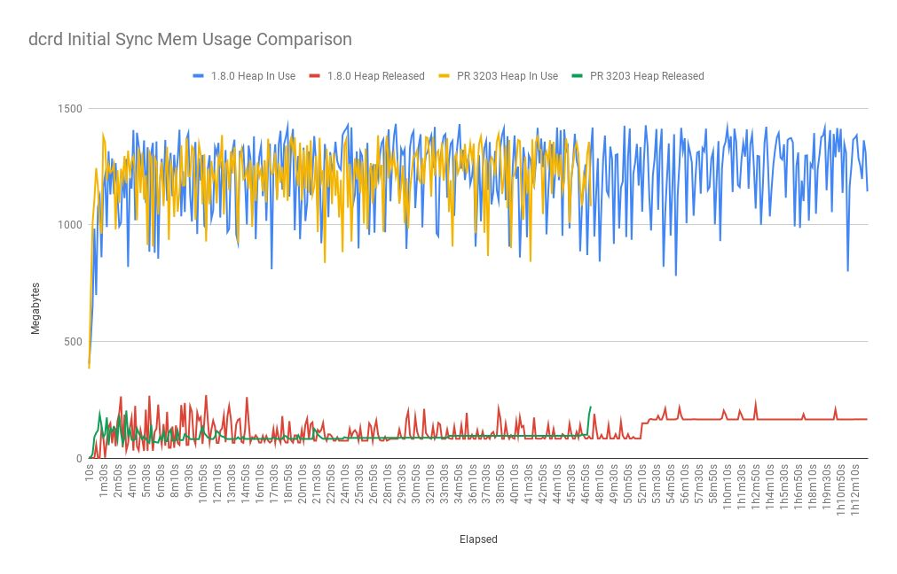
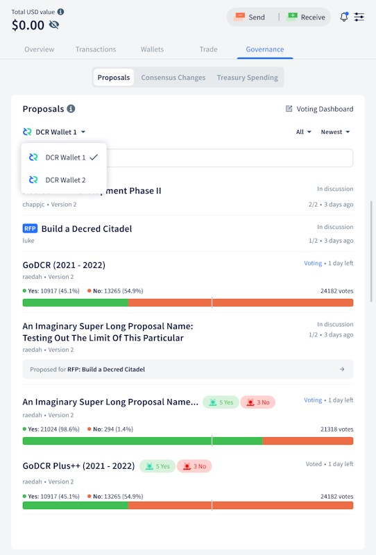
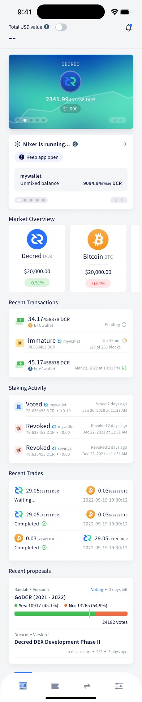
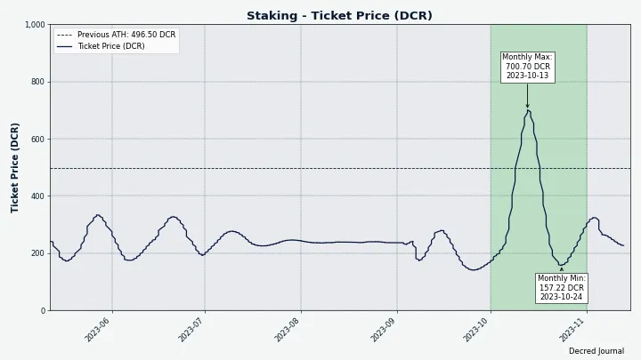
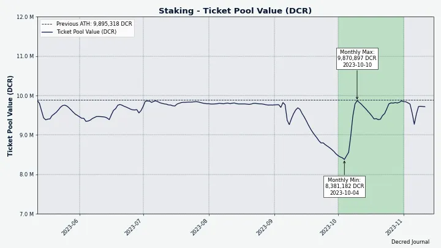
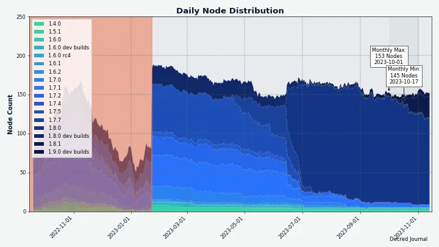

# Decred 月报 – 2023 年 10 月

_图片：@Exitus_

十月亮点：

- 核心软件 v1.8.1 已发布，修复了 VSP 质押和 DCRDEX。

- Cake Wallet 集成预算已获得批准并已开始开发。

- gominer和dcrpool已升级，支持BLAKE3 GPU 的矿池挖矿。

- 已推出三个公共矿池。

- 选票价格创下700 DCR的新纪录。

内容:

- [Core Software v1.8.1 发布](#core-software-v181-release)
- [开发进展总结](#development)
- [人员](#people)
- [治理和财务](#governance-and-finances)
- [网络](#network)
- [生态系统](#ecosystem)
- [外展](#outreach)
- [媒体](#media)
- [市场](#markets)
- [相关外部信息](#relevant-external)

## Core Software v1.8.1 发布

此[版本](https://twitter.com/decredproject/status/1715463325595660307) 包括针对用户与 VSP（投票服务提供商）质押的修复以及针对 DCRDEX 的修复。

- **dcrd**：“getblock”和“getblockheader”命令现在为新的 BLAKE3 哈希添加了一个额外的“powhash”字段。 `getnetworkhashps -1` 更新以返回最后 120 个块的预估哈希率。

- **dcrwallet**：针对 VSP 质押的多项可靠性修复。

- **Decrediton**：捆绑了上述所有更改，修复了许多 DEX 用户报告的“响应缓冲区太短”错误，并更新了阿拉伯语和中文翻译。

- Decrediton 中的 **DCRDEX 模块** 已更新至 v0.6.3：交易限制随债券级别而变化，并包括防止意外危险配置更改的保护、订单处理、债券和 BTC 钱包重新扫描的修复。

完整的发行说明和下载可在[此处](https://github.com/decred/decred-binaries/releases/tag/v1.8.1)获得。 建议[验证文件](https://docs.decred.org/advanced/verifying-binaries/)是否已被修改。

此版本还包含最新的独立 DCRDEX 应用程序二进制文件，与 [dcrdex 存储库中的构建](https://github.com/decred/dcrdex/releases/tag/v0.6.3) 相比，它们具有许多优势：文件已签名 通过 Decred Release key，拥有更多操作系统和 CPU 架构选择，并受益于最新 Go 编译器的优化。 请参阅发布页面末尾的“dexc-xxx”文件。

## 开发紧张总结

除非另有说明，否则下面报告的工作为“合并至核心存储库”状态。这意味着该工作已完成、审查并集成到高级用户可以[构建和运行](https://medium.com/@artikozel/the-decred-node-back-to-the-source-part-one-27d4576e7e1c)的源代码中，但普通用户尚不可用。

### dcrd

_[dcrd](https://github.com/decred/dcrd) 是一个完整的节点实现，为 Decred 在全球的点对点网络提供支持。_

面向用户的变化：

- 添加了对[并发`getdata`请求](https://github.com/decred/dcrd/pull/3203)的支持。 目前，一个节点一次只能处理一个“getdata”请求，这是从非常早期的网络代码继承的行为，但不再相关。 虽然正在为一个“getdata”请求的数据提供服务，但其他本来可以快速处理的消息（例如 ping）可能会延迟很长时间。 此外，理论上，对等节点可能会陷入等待对方的困境。 在实践中，这种情况基本上不会发生，但将来当引入新消息时，例如用于点对点混合的消息，这种情况可能会发生变化。 为了提高整体吞吐量并解决上述问题，“getdata”请求已设为异步，以便可以同时处理其他入站消息。 为了阻止恶意行为，还引入了新的限制。 对有线协议的这一更改计划包含在 v1.9.0 版本中。
- 并发`getdata`请求也恰好将[初始链同步](https://matrix.to/#/!zefvTnlxYHPKvJMThI:decred.org/$mxemr1HGLNlX4eXYPuG9rTVUb15Jg7lWudGK3TQJEG0)时间从约81分钟减少到约47分钟(在 开发者的基准系统）。 在此更改之前，块将分批提供，并且下一批的每个请求都必须等待，直到收到前一批。 由于涉及网络延迟，批次之间的“空闲”时间可能长达约 5 秒。 鉴于有超过 800K 个区块，并且通常以 2,000 个批次提供服务，完整的初始同步将导致 400 多个此类延迟，即约 33 分钟。
- 更新了“dcrutil”包以从“$HOME”环境变量获取[用户的主目录](https://github.com/decred/dcrd/pull/3196)，而不是解析“/etc/passwd”。 这是为了使其与 Flatpak 或 Snap 等包装系统兼容。 这些系统为应用程序提供沙盒环境，不允许二进制文件直接写入主目录。 相反，他们为每个应用程序指定一个单独的目录，并相应地设置“$HOME”。 DCRDEX 桌面应用程序正在进行的[打包工作](https://github.com/decred/dcrdex/issues/2581) 需要进行此更改。

开发者和内部变化：

- 更新了 [Docker 镜像](https://github.com/decred/dcrd/pull/3198) 以使用 Go 1.21.3 进行构建。
- 合并关闭代码以减少[长时间运行的goroutine](https://github.com/decred/dcrd/pull/3199)的数量并使用[`WaitGroup`](https://github.com/decred/dcrd/pull/3200) 更本地化，更容易推理并且更不容易出错。
- 改进了同步管理器中对[对等数据](https://github.com/decred/dcrd/pull/3201)的处理，以简化代码并消除一些难以遇到的极端情况。

[dcrdtest](https://github.com/decred/dcrtest/tree/master/dcrdtest) 集成测试工具：

- 简化的 API 使该包[更广泛有用](https://github.com/decred/dcrtest/pull/17)，不仅在测试中，而且在基准测试和不专门与测试相关的通用代码中。
- 确保即使测试设置失败，[清理代码](https://github.com/decred/dcrtest/pull/18)也始终运行。 这还添加了一个标志来保持数据文件完整，以缓解调试测试失败的情况。

_图片：并发 getdata 请求时初始链同步速度将加快约 40%_

### dcrwallet

_[dcrwallet](https://github.com/decred/dcrwallet) 是命令行和图形界面钱包应用程序使用的钱包服务器。_

- 将 [bbolt](https://github.com/decred/dcrwallet/pull/2290) 数据库更新至 v1.3.8，以避免在 OpenBSD 上使用 `syscall(2)`，因为此 API 将被删除。 [bbolt 补丁](https://github.com/etcd-io/bbolt/pull/404) 由 Decred 开发人员贡献。
- 优化了[初始链同步](https://github.com/decred/dcrwallet/pull/2292)时间和内存使用。

### Decrediton

_[Decrediton](https://github.com/decred/decrediton) 是一款功能齐全的桌面钱包应用程序，集成了投票、StakeShuffle 混币、闪电网络、DEX 交易等功能。 它在有或没有完整的区块链（SPV 模式）的情况下运行。_

合并到`master`中：

- 修复了因 trezor-connect 库更改而导致的 [Trezor 构建](https://github.com/decred/decrediton/pull/3922) 失败。

进行中：

- Decred 开发人员已更新 [补丁](https://github.com/trezor/trezor-firmware/pull/2703)，用于 [用 Trezor 质押 DCR](https://github.com/decred/decrediton/issues/2681)所需的 trezor 固件但它仍然未合并。 它自 2022 年 12 月以来一直在等待，目前尚不清楚何时可以合并。 感谢帮助推动它向前发展。 今天，通过使用自定义固件刷新 Trezor，从技术上讲，可以让 Trezor 质押与 Decrediton 合作，但该设备会显示可怕的红色“不安全，请勿使用！” 警告，因此此方法不适合大多数用户。

### dcrseeder

_[dcrseeder](https://github.com/decred/dcrseeder) 是一个爬虫，用以维护受信任的 Decred 节点列表并帮助新节点发现其第一个对等节点。_

- 更新为使用 [Go 1.21](https://github.com/decred/dcrseeder/pull/59) 进行构建和测试，简化了构建脚本，并添加了更多 linter（linter 自动检查代码是否存在问题）。
- 改进了操作系统发送的[关闭信号](https://github.com/decred/dcrseeder/pull/60)的[处理](https://github.com/decred/dcrseeder/pull/61)， 并添加了日志记录，以便清楚地了解进程关闭的原因。
- 准备[双网络](https://github.com/decred/dcrseeder/pull/62)支持：减少全局状态的使用，简化初始化逻辑，并将关闭任务更改为通过“defer”运行，这更有效 错误证明。
- 添加了对单个 dcrseeder 实例的支持，以同时抓取 [主网和测试网](https://github.com/decred/dcrseeder/pull/63)。 它将在两个不同的端口上运行两个 HTTP 服务器。

### gominer

_[gominer](https://github.com/decred/gominer) 是一个开源的工作量证明 Decred BLAKE3 挖矿软件，用于使用 OpenCL 和 CUDA 设备进行挖矿。_

gominer 已更新为支持通过 Stratum 协议进行矿池挖矿。 以下所有更改均包含在 [v2.0.0 版本](https://github.com/decred/gominer/releases/tag/release-v2.0.0) 中。 它是一个纯源版本，没有二进制文件，但构建过程[有详细记录](https://github.com/decred/gominer#readme)。

- 重新设计了 [nonces](https://github.com/decred/gominer/pull/219) 的处理以允许 Stratum 支持。 挖矿设备需要找到满足难度要求的块头哈希。 [Decred 块头](https://github.com/decred/dcps/blob/master/dcp-0011/dcp-0011.mediawiki#user-content-Proof_of_Work_Hash) 是一个 180 字节的结构，其中大多数字节存储有用数据并且无法改变。为了给矿工提供更改哈希值的方法，块头包含一些称为随机数的特殊字节。 矿工不断“滚动”随机数并重新计算哈希值，直到找到正确的哈希值。 Stratum 是一种流行的协议，可将挖矿工作分发到多个设备，并且它要求随机数的使用方式与单独挖矿不同。
- 纠正了[Stratum和池化挖矿](https://github.com/decred/gominer/pull/220)的多个问题，主要与填充和使用Stratum协议要求的数据结构有关。
- 在单独的挖掘代码中使用[rpcclient](https://github.com/decred/gominer/pull/208)[package](https://github.com/decred/dcrd/tree/645f649907cda2e5510241959d16e61a936d212b/rpcclient)。 此更改删除了重复代码，并切换为通过 WebSocket 通知（而不是轮询）更有效地从 dcrd 获取数据。
- 在单独挖掘模式下添加了对 [getwork](https://github.com/decred/gominer/pull/224) 的初始调用，以立即开始挖掘，而无需等到新的块或交易出现。
- 重新设计了[程序版本](https://github.com/decred/gominer/pull/221)的处理方式，使其更加可靠并与其他 Decred 软件相匹配。 `gominer --version` 的输出现在将包括构建 gominer 的 Git 版本。
- 更新了 [README](https://github.com/decred/gominer/pull/225)，其中包含使用 dcrpool 和其他基于 Stratum 的池运行 gominer 的说明。

### dcrpool

_[dcrpool](https://github.com/decred/dcrpool) 是用于运行 Decred 矿池的服务器软件。_

10 月份的更改重点是添加 BLAKE3 和 gominer 支持：

- 优化了[数据发送给矿工](https://github.com/decred/dcrpool/pull/409)的方式。 一些旧的 ASIC 错误地使用了第二“代交易”字段。 与比特币相比，Decred 的区块头更适合挖矿，并且该字段不应该用于 Decred。 鉴于旧的 ASIC 不再与网络配合使用，因此借此机会停止使用“gentx2”字段，将所有相关信息放入“gentx1”中，这是正确且更高效的。
- 按照 Decred 网络现在的要求，修改了池以与 [BLAKE3](https://github.com/decred/dcrpool/pull/412) 配合使用。
- 添加了 [gominer v2.0.x](https://github.com/decred/dcrpool/pull/413) 作为受支持的挖掘客户端。
- 修复了[数据争用](https://github.com/decred/dcrpool/pull/402)。
- 修复了矿池无法正确跟踪其开采的[区块](https://github.com/decred/dcrpool/pull/416)的错误。 因此，它从未将这些区块中的币库发送给挖矿参与者。

内部和开发人员变更：

- 将最大[区块生成时间](https://github.com/decred/dcrpool/pull/411)限制为每个网络的目标区块时间。 这是正确的 simnet 支持所必需的。
- 使用正则表达式[识别客户端](https://github.com/decred/dcrpool/pull/406)。 这允许支持新版本的挖矿客户端，而无需更新矿池软件。
- 重新设计了[客户端识别](https://github.com/decred/dcrpool/pull/415)逻辑，以更轻松地支持不同的矿工版本。
- 多个较小的内部更改：删除未使用的代码、改进的日志记录、改进的测试代码等。

### DCRDEX

_[DCRDEX](https://github.com/decred/dcrdex) 是一个非托管、尊重隐私的交易所，用于去信任交易，由原子交换提供支持。_

更改向后移植到下一个 v0.6.x 版本和下一个 Decrediton 版本：

- 为 Decrediton 中未加载 DCRDEX 窗口添加了[解决方法](https://github.com/decred/dcrdex/pull/2596)。 Decrediton 中使用的 Electron 版本必须升级才能解锁 Ledger 支持，但较新的 Electron 版本破坏了 DCRDEX 集成。 经过漫长而痛苦的 bug 搜寻发现，Electron v21.3.0 引入了一个奇怪的不存在的语言环境“c”，解决方法是明确不使用它来格式化 DCRDEX 中的数字。

下面列出的工作已合并到未来版本的“master”中。

客户：

- 添加了使用应用程序种子[重置忘记的应用程序密码](https://github.com/decred/dcrdex/pull/2477)的功能。
- 针对订单更改、债券或服务器连接问题等事件添加了[浏览器和桌面通知](https://github.com/decred/dcrdex/pull/2558)。 即使 DEX 窗口未激活，这些通知也会显示。
- 更新了[用户文档](https://github.com/decred/dcrdex/pull/2538)以反映新的DEX客户帐户创建流程。
- 修复了市场视图中[不支持的资产](https://github.com/decred/dcrdex/pull/2548) 的处理。
- 修复了[添加新的 DEX 服务器](https://github.com/decred/dcrdex/pull/2566) 期间的错误。

账户信誉、债券、交易限制：

- 重新设计了[帐户层级](https://github.com/decred/dcrdex/pull/2501)的计算。 “奖励等级”的概念已被删除，因为它没有做任何有用的事情，反而增加了复杂性。 服务器现在将发送客户端之前不知道的分数更改的更新。 这些和其他内部变化将帮助客户更可靠地跟踪其账户分数和等级，并且不会错过债券续订（这可能导致帐户失去交易能力，直到恢复目标等级）。
- 重新设计了[交易限制](https://github.com/decred/dcrdex/pull/2503)以修复某些不合理的[低交易限制](https://github.com/decred/dcrdex/issues/2472) 交易费用低的市场。 *手数*是可以交易的最小代币数量； 它可以保护成功的交易免于支付过高的链上费用（相对于交易金额）。 另一方面，*交易限额*是用户可以放入订单簿的最大金额； 如果交易失败并获得退款，它可以防止损失太多费用。 低费用交易对（例如DCR/LTC）的手数较小，允许的最小交易量也较小，这对用户体验非常有利。 低费用市场的问题在于，由于所使用的公式，其交易限额过低。 该公式已得到改进，允许在此类市场上一次交易更多价值。
- 在设置 UI 上公开了更多[债券信息](https://github.com/decred/dcrdex/pull/2485)，例如当前和目标账户等级以及债券锁定金额。

Decred:

- 添加了 dcrwallet 错误的解决方法，如果钱包在错误的时间关闭，则交易可能[永远不会被标记为已确认](https://github.com/decred/dcrdex/pull/2555)。
- 实施了 [质押统计](https://github.com/decred/dcrdex/issues/2497) 和票价的实时 UI 更新。
- 当内存池中检测到新的未开采交易时，更新 Decred SPV 钱包的[余额](https://github.com/decred/dcrdex/pull/2554)。
  
Bitcoin:

- 添加了对公共[链数据提供商](https://github.com/decred/dcrdex/pull/2547)（又名 RPC 提供商）的支持。、
  
Ethereum:

- 添加了 ETH 钱包的[交易历史记录](https://github.com/decred/dcrdex/pull/2504)的本地存储。 这是必需的，因为以太坊数据提供商不支持查询帐户已进行的交易。 此外，让钱包的交易在本地可用可以整合和优化跟踪未确认交易的代码，并减少对 RPC 提供商的依赖。

Zclassic:

- 后端和 UI 中的初始 [Zclassic 支持](https://github.com/decred/dcrdex/pull/2523)（目前没有屏蔽钱包）。
  
开发者和内部变化：

- 自动更新[缓存破坏者](https://github.com/decred/dcrdex/pull/2557)的繁琐过程。
- 更新了 [loadbot](https://github.com/decred/dcrdex/pull/2420)，以根据代币的实际市场价格开始市场汇率。 如果启用此模式，“鲸鱼”测试程序将尝试将测试市场推向真实价格而不是随机值。 这是[做市商测试框架](https://github.com/decred/dcrdex/issues/2303)的一部分，将用于评估机器人在不同市场条件下的表现。
- 将完成的[蜡烛](https://github.com/decred/dcrdex/pull/2443)存储在数据库中。 计算图表的蜡烛是一项昂贵的操作，并将其结果缓存在数据库中修复了[服务器启动缓慢](https://github.com/decred/dcrdex/pull/2151)。

其他新闻：

- Circle 推出了 [原生 Polygon USDC 代币](https://www.circle.com/blog/what-you-need-to-know-native-usdc-on-polygon-pos) 作为更有效的替代品 USDC 从以太坊“桥接”到 Polygon（称为 USDC.e）。 DEX 开发人员正在考虑[切换](https://github.com/decred/dcrdex/issues/2559)到这个新代币，而 Polygon 尚未出现在任何稳定的 DEX 版本中，以最大程度地减少对最终用户的干扰。
- 打包的以太坊和打包的比特币[可能会登陆](https://matrix.to/#/!SFRQQFIHUUNXARfvew:decred.org/$OjqKljf7nmCrKB7YV4aYkh7Evf_zMzmpXqTFDGrzexQ) 在下一个小版本中。

_图片：DCRDEX 中的债券设置（显示测试金额）_

### Cryptopower

_[Cryptopower](https://github.com/crypto-power/cryptopower) 是一款适用于 DCR、BTC 和 LTC 的多币种桌面 GUI 钱包。 它以保护隐私的轻 SPV 模式运行，无需完整的区块链，支持 Decred 质押、混合、投票和其他独特功能。_

新的概述页面：

- 将真实钱包数据添加到[mixer 卡](https://github.com/crypto-power/cryptopower/pull/118)。
- 实现了 Binance 和 Bittrex 的[汇率](https://github.com/crypto-power/cryptopower/pull/177) 显示。
- 添加了[最近交易](https://github.com/crypto-power/cryptopower/pull/157) 以及所有钱包最近的质押活动。

移动端适配：

- 添加了[底部导航](https://github.com/crypto-power/cryptopower/pull/146)按钮，取代了移动设备上的顶级选项卡。
- 添加了[概述页面](https://github.com/crypto-power/cryptopower/pull/155)的移动布局。

去中心化交易所集成：

- 添加了 DEX 入门[步骤 2](https://github.com/crypto-power/cryptopower/pull/135)（服务器选择）和[步骤 3](https://github.com/crypto-power/cryptopower/pull/199)。

其他：

- 添加了所有资产组合的[美元总价值](https://github.com/crypto-power/cryptopower/pull/131)指标。
- 优化了[布局代码](https://github.com/crypto-power/cryptopower/pull/151)，使应用程序响应更快。
- 添加了可重复使用的[分段选择器](https://github.com/crypto-power/cryptopower/pull/175)小部件。
- 实现了[发送模式](https://github.com/crypto-power/cryptopower/pull/176)，可以通过顶部栏的“发送”按钮从任何页面快速访问。
- 实施了[应用程序入门](https://github.com/crypto-power/cryptopower/pull/189)信息页面。
- 将[治理](https://github.com/crypto-power/cryptopower/pull/184)移至顶级选项卡。
- 在顶级“钱包”选项卡上实施了[钱包选择器](https://github.com/crypto-power/cryptopower/pull/166)的新布局。
- 添加了可重复使用的[隐藏余额](https://github.com/crypto-power/cryptopower/pull/203)小部件。
- 允许从“创建订单”页面[创建新钱包](https://github.com/crypto-power/cryptopower/pull/196)。
- 在[交易选项卡](https://github.com/crypto-power/cryptopower/pull/218)上实施了新的入门布局（[选择](https://github.com/crypto-power/cryptopower/issues /80) CEX 和 DEX 之间的交易)。
- 将[钱包主页](https://github.com/crypto-power/cryptopower/pull/201)上的左侧边栏替换为顶部的选项卡。

修复：

- 修复了[钱包同步](https://github.com/crypto-power/cryptopower/pull/113)在应用程序启动时未启动的问题。
- 修复了[汇率](https://github.com/crypto-power/cryptopower/pull/148)估算。
- 修复了[同步切换](https://github.com/crypto-power/cryptopower/pull/154)的逆逻辑。
- 修复了重新扫描期间导航到[钱包信息](https://github.com/crypto-power/cryptopower/pull/163)页面时发生的崩溃。
- 修复了打开[投票模式](https://github.com/crypto-power/cryptopower/pull/169)时的崩溃问题。
- 修复了无法[取消](https://github.com/crypto-power/cryptopower/pull/185)种子备份步骤和密码输入模式的问题。
- 修复了从“设置”页面导航到[创建订单](https://github.com/crypto-power/cryptopower/pull/186)时发生的崩溃。
- 修复了获取[汇率](https://github.com/crypto-power/cryptopower/pull/202)时的崩溃问题。
- 修复了 4 个与 [仅观察钱包](https://github.com/crypto-power/cryptopower/pull/200) 相关的崩溃。
- 修复了选择没有现有钱包的资产进行交易时，[创建订单](https://github.com/crypto-power/cryptopower/pull/196)页面崩溃的问题。
- 修复了[删除钱包](https://github.com/crypto-power/cryptopower/pull/222)会删除顶栏用户界面的错误。

_图片：Cryptopower 中的 DEX 入门视图_

_图片：Cryptopower 可以使用中心化服务兑换硬币

_图片：Cryptopower 中治理选项卡的更新设计（最终实现可能有所不同）_

_图片：Cryptopower 中“概览”选项卡的移动设计（最终实现可能有所不同）_

### Bison Relay

_[Bison Relay](https://github.com/companyzero/bisonrelay) 是一个新的社交媒体平台，具有针对审查、监视和广告的强大保护，由 Decred 闪电网络提供支持。_

GUI 应用程序更改合并到“master”中：

- 修复了发布新聊天消息时滚动位置[跳转](https://github.com/companyzero/bisonrelay/pull/358)到当天开始的问题。

Android:

- 第一条[测试消息](https://matrix.to/#/!GHnoHXSgkVasUknRUg:decred.org/$Jqn9kojtkwKeCn83jIRsw1JT-hsocBdX4WCrFfmjuWY)已从Android发送。 同步大约需要 10 分钟，并消耗了 10-15% 的电池电量。 [报告](https://matrix.to/#/!GHnoHXSgkVasUknRUg:decred.org/$6Nm8gEMHy1UgaNL-HjM1CCXH69yhNY9O7EJ5rEAVgzc) 在 Android 上安装新的 BR 需要大约 1 GB 空间。

### Cake Wallet 集成

[Cake Wallet](https://cakewallet.com/) 是一款开源、自托管的多资产钱包，支持 XMR、BTC、LTC 等币种，运行在 Android、iOS、macOS 和 Linux 上。

以下是迄今为止的 Decred 集成故事：

- @Tivra 将 Decred 与 Cake Wallet 连接起来，从而与 [Vik Sharma](https://twitter.com/vikrantnyc) 进行了协作[视频直播](https://www.youtube.com/watch?v=0KKsD4ZhZn0) 和 [Justin Ehrenhofer](https://twitter.com/JEhrenhofer) 于 2023 年 8 月。
- 创建了聊天室来讨论代码的集成和实验。 Cake Wallet 由 Dart+Flutter（主要应用程序语言）、C++（门罗币）、Go（以太坊）以及 Kotlin 和 Swift（用于 Android 和 iOS 的本机集成位）的复杂组合构建而成。 设置工作构建环境的过程最好被描述为“构建地狱”，因为它没有完整记录，并且仅针对一个平台进行构建是一项相当大的挑战，而总共有四个目标（Linux、macOS、Android、iOS）。
- 添加了一些 Decred 屏幕作为概念证明，并实现了可运行的 Android 构建。
- 已提交为 Decred 集成提供资金的[提案](https://proposals.decred.org/record/2f25f2d)。 由于 Decred 硬分叉问题，它没有达到法定人数，并于 9 月重新提交。 [第二个提案](https://proposals.decred.org/record/b3bdacb) 于 10 月获得批准。
- 开发人员评估了集成策略，并决定基于 DCRDEX 和 Cryptopower 的 [libwallet](https://github.com/crypto-power/cryptopower/tree/master/libwallet) 的代码创建 Decred 库，并将其编译为 可以从 Dart 代码调用的 C 库。 第二种选择是使用 gomobile 构建库，编写特定于平台的粘合代码（Kotlin 和 Swift），并使用 Dart 的“平台通道”来调用本机代码。 这种方法因比较困难而被放弃。
- Cake Wallet 的代码存储库被分叉为一个[临时存储库](https://github.com/JoeGruffins/cake_wallet)，以便有一个快速迭代的地方，直到准备好向上游提交某些内容。
- 初始 [libwallet](https://github.com/itswisdomagain/libwallet/pull/1) 版本已提交进行代码审查，它是一个简单的库，用于构建 DCR、BTC 和 LTC 的 SPV 钱包应用程序。 计划是使用 Cake Wallet、Cryptopower 以及其他可能的软件中的这个库。
- 初始 [Decred 屏幕](https://github.com/JoeGruffins/cake_wallet/pull/1) 被合并到暂存分支中，以创建一个共享基线来开始开发。

### 其它

[VSP 列表 API](https://github.com/decred/dcrwebapi/blob/master/docs/api.md) 现在公开[错过和过期](https://github.com/decred/dcrwebapi/pull/ 180) 票证单独计数，这样可以更准确地评估 VSP 的可靠性。 错过的次数越少越好，而过期的票证是正常的，并不表示 VSP 存在问题。

@Exitus 组织了一个 Decred 开发者“Ask Me Anyting”（AMA）[Reddit 主题](https://www.reddit.com/r/decred/comments/1700xyi/decred_developer_ask_me_anything_ama_feat_dev/)，收集了 77 条评论，其中一些要点：

- [核心网络开发](https://www.reddit.com/r/decred/comments/1700xyi/decred_developer_ask_me_anything_ama_feat_dev/k44icgy/)中的下一件大事是分散混合过程并创建用于支持 NFT 等事物的构建块 一种真正去中心化的方式。
- @davecgh 暗示要转向让应用程序开发变得更容易。
- 用于优化 [secp256k1](https://github.com/decred/dcrd/tree/master/dcrec/secp256k1) 椭圆曲线操作的 dcrd 软件包[正在使用](https://www.reddit.com/r/decred/comments/1700xyi/decred_developer_ask_me_anything_ama_feat_dev/k4abvjh/) 由以太坊的 INFURA、Nostr、Cosmos SDK、Blockwatch 的 TzGo (Tezos Go SDK)、以太坊 Optimism 等提供。
- [DCRDEX 品牌重塑](https://www.reddit.com/r/decred/comments/1700xyi/decred_developer_ask_me_anything_ama_feat_dev/k46xyg9/) 将安排 v1 版本发布，做市商机器人也将做好准备。 开发人员认识到比特币和以太坊的高额费用抑制了交易活动，并正在研究解决方案。 最近这方面的工作包括在 Polygon 上支持 WBTC 和 WETH 以及使小批量市场变得可行。
- 在[线程](https://www.reddit.com/r/decred/comments/1700xyi/decred_developer_ask_me_anything_ama_feat_dev/)中查看更多有见地的答案。

## 人员

欢迎新的首次贡献者：

- @CPunch（开发者，[Cryptopower](https://github.com/crypto-power/cryptopower/pull/113)）
- @upright39（开发者，[Cryptopower](https://github.com/crypto-power/cryptopower/pull/202)）
- @ZecHub（作家，[Cypherpunk Times](https://www.cypherpunktimes.com/social-media-data-collection-does-it-matter/)）

截至 11 月 2 日的社区统计数据（与 10 月 2 日相比）：

- [Twitter](https://twitter.com/decredproject) 关注：53,475 (+68)
- [Reddit](https://www.reddit.com/r/decred/) 订阅：12,762 (+5)
- [Matrix](https://chat.decred.org/) #一般成员：826 (+7)
- [Discord](https://discord.gg/GJ2GXfz) 会员：1,838 (+43)，已验证发帖人数：762 (+18)
- [Telegram](https://t.me/Decred) 成员：2,297 (-24)
- [YouTube](https://www.youtube.com/decredchannel) 订阅：4,640 (+0)，观看次数：242.4K (+2.4K)
  

## 治理和财务

10 月份，新的[国库](https://dcrdata.decred.org/treasury) 收到了 7,628 个 DCR，价值 9.7 万美元，10 月份的平均汇率为 12.73 美元。 8,412 DCR 用于支付承包商费用，按相同价格计算价值 107,000 美元。

10月初开采的[国库支出tx](https://dcrdata.decred.org/tx/dad857ec261237d51247d4bfae1a1ffb4348c8a7ed8933b2b877e6cac1d75436)已在[上一期](202309.md#governance)中介绍。

截至 11 月 1 日，[旧国库](https://dcrdata.decred.org/address/Dcur2mcGjmENx4DhNqDctW5wJCVyT3Qeqkx) 和[新金库](https://dcrdata.decred.org/treasury) 的总余额为 873K DCR (11.4 百万美元，价格为 13.08 美元）。

_图片：DCR 中的国债流入和流出_

_图片：国库每月余额（美元）； 请注意，这在很大程度上取决于汇率

三项提案于 10 月份完成投票：

- [Cake 钱包再次集成](https://proposals.decred.org/record/b3bdacb)，@JoeGruff 请求 80,000 美元在 [Cake 钱包](https://cakewallet.com/) 中集成基本 DCR 功能，已获得批准 88% 的支持率，59% 的投票率。

- [Decred PR 提案第五阶段](https://proposals.decred.org/record/0c04c6f)，由 @l1ndseymm 提出，要求 5 人团队再投入 48,000 美元进行一年的公共关系工作，但遭到拒绝，支持率为 53%（缺少 60% 的批准门槛）和 55% 的投票率。

- @conniej 提出的 [Odaily 内容提案](https://proposals.decred.org/record/b80040f)，要求 15,000 美元在 6 个月内发表 2 篇赞助文章，相应的社交媒体曝光被拒绝，支持率 30%，投票率 28% 。 该提案在大约 2 个月不活跃后被授权投票。

上述提案没有重大更新，因为它们已在 [Politeia Digest 64](https://blockcommons.red/politeia-digest/issue064/) 中涵盖。

[Cake 钱包集成](https://dcrdata.decred.org/proposal/b3bdacb776732b5b) 和 [Decred PR 第 5 阶段](https://dcrdata.decred.org/proposal/0c04c6fcebac8c58) 提案投票[无法启动](https://matrix.to/#/!qYpAAClAYrHaUIGkLs:decred.org/$uKiSVmR0a3Z1q1-1gLfsaN7JIG-UAmZbZCJ8QoykU2M) 由于[服务器错误](https://matrix.to/#/!ueeciPqvqEsPyPCJkp)。 Cake Wallet 提案的问题在大约 4 天内得到解决。 由于必须找到并手动删除[数据库中的错误数据](https://matrix.to/#/!qYpAACLAYrHaUIGkLs:decred.org/$3d1pE7I1_tsf_jiinZnTEvg7tHGYtFeWS_IaltRcdNA)，Decred PR 提案花了额外一天的时间来修复。

## 网络

**全网算力**：10 月的 [算力](https://dcrdata.decred.org/charts?chart=hashrate&scale=linear&bin=day&axis=time) 以 8.8 TH/s开启，结束约为 12.3 TH/s，谷值 7.1 TH/s，峰值为 13.3 TH/s。

_图片：Decred 算力现在由 GPU 主导并以 terahash 为单位_

截至 11 月 1 日，[开采](https://miningpoolstats.stream/decred) 的 1,000 个区块的分布：[miningandco.com](https://decred.miningandco.com/) 20%，[pooltronic.tech](https: //decred.pooltronic.tech/) 9%、[blake3dcr.com](https://blake3dcr.com/) 3% 和 68% 的区块未被 miningpoolstats.stream 识别。

**质押**：[选票价格](https://dcrdata.decred.org/charts?chart=ticket-price&axis=time&visibility=true-true&mode=stepped)在157-**701** DCR之间变化并创历史新高。

[锁定金额](https://dcrdata.decred.org/charts?chart=ticket-pool-value&scale=linear&bin=day&axis=time)为838-987万个DCR，意味着循环供应量的53.9-63.5%[参与了](https://dcrdata.decred.org/charts?chart=stake-participation&scale=linear&bin=day&axis=time) 权益证明。

_图片：十月第一周购票量相对小幅上升......_

_图片：...引发了有史以来最大的票价波动..._

_图片：...尽管对于总质押 DCR 图表而言，这只是一个修正_

_图片：10 月 4 日，[错过的选票](https://dcrdata.decred.org/charts?chart=missed-votes) 出现了罕见的激增_

**VSP**：[15 个列出的 VSP](https://decred.org/vsp/) 共同管理了约 7,200 (-350) 份实时选票，截至目前占选票池的 16.8% (-1.2%) 11 月 1 日。

10 月份涨幅最大的是 [123.dcr.rocks](https://123.dcr.rocks/)（+395 票 +118%）、[dcr.farm](https://vsp.dcr.farm/)（+107 票或 +63%），以及 [ultravsp.uk](https://ultravsp.uk)（+87 票或 +35%）。

_图片：VSP 管理的选票分布_

_图片：83% 的选票由不需要 VSP 的铁杆个人选民持有_

**节点**：[Decred Mapper](https://nodes.jholdstock.uk/user_agents) 整个月观察到 145 到 153 个 dcrd 节点。 11 月 1 日看到的 155 个节点的版本：v1.8.0 - 77%、v1.8.1 - 15%、v1.7.x - 2%、v1.8.0 开发版本 - 0.6%、其他 - 5.8%。

_图片：15%的节点已升级至v1.8.1。 2023 年 1 月之前的红色区域表示我们当时拥有的数据不完整。_

[混合币](https://dcrdata.decred.org/charts?chart=coin-supply&zoom=jz3q237o-la8vk000&scale=linear&bin=day&axis=time&visibility=true-true-true)的份额在62.0-62.6%之间变化。 每日[混合量](https://dcrdata.decred.org/charts?chart=privacy-participation&bin=day&axis=time) 在 271-**1,036K** DCR 之间变化 - 创下历史新高。

_图片：与质押的 DCR 图表不同，混合和未使用的供应量没有下降_

_图片：月度混合 DCR 创下新纪录_

截至 11 月 1 日，Decred 的 [闪电网络](https://ln-map.jholdstock.uk/) 浏览器有 220 个节点 (+9)、448 个通道 (+19)，总容量为 203 DCR (+13) .这些统计数据对于每个节点都是不同的。

_图：闪电网络锁定的200 DCR重要心理关卡已被打破_

感谢@bochinchero 提供和改进这些图表。 [dcrsnapshots](https://github.com/bochinchero/dcrsnapshots) 存储库中提供了本 Decred 月报中未使用的大约 40 个其他图表； 欢迎大家在社交媒体上分享。

## 生态系统

**矿池**：

- Decred 开发者[早在 2019 年](https://blog.decred.org/2019/09/25/Introducing-Dcrpool/)就发布了一个开源矿池，希望降低启动新矿池的门槛并分散 Decred 的算力。 不幸的是，尽管 dcrpool 已经积极开发了 2 年，但没有出现任何公共矿池。 最近对 BLAKE3 的硬分叉已经[重启](202309.md#mining)Decred 挖矿，为 dcrpool 带来了新的活力。 9 月，gominer [更新](202309.md#gominer) 为所有人解锁 GPU 挖矿，10 月，[gominer](https://github.com/decred/gominer) 和 [dcrpool](https://github.com/decred/dcrpool)已更新以支持池化 BLAKE3 挖矿。 不久之后，“三个”公共矿池启动了。

- [blake3dcr.com](https://blake3dcr.com/) 是硬分叉后第一个[宣布](https://twitter.com/dezryth/status/1712768415214002595) 的矿池。 截至撰写本文时，付款方式为 PPLNS，池费为 0.8%。 如有任何问题，请通过 [Twitter](https://twitter.com/dezryth) 或 Matrix 联系@dezryth。

- [decred.miningandco.com](https://decred.miningandco.com/) 由@sebit27 启动。 截至撰写本文时，付款方式为 PPS，池费为 1.0%。

- [decred.pooltronic.tech](https://decred.pooltronic.tech/) 由@makertronic [宣布](https://twitter.com/makertronicYT/status/1716098122617692530)，他还制作了法语视频教程 [Linux 和 Windows](https://www.youtube.com/watch?v=Xsx6uaFA8x4)、[HiveOS](https://www.youtube.com/watch?v=sxuBNhYe9G0) 和 [BzMiner] 上的 GPU 挖掘 在 Windows 上](https://www.youtube.com/watch?v=T1S7mB2EHw4)。 截至撰写本文时，付款方式为 PPLNS，池费为 1.0%。
  
**Voting Service Providers**:

- [vsp.coinmine.pl](https://vsp.coinmine.pl/) was [renamed](https://github.com/decred/dcrwebapi/pull/179) to [decred.stake.fun](https://decred.stake.fun/) in the [VSP page](https://decred.org/vsp/) and other places that use [VSP API](https://github.com/decred/dcrwebapi/blob/master/docs/api.md) such as Decrediton or Cryptopower. The old domain still works for compatibility. [Stake.Fun](https://stake.fun/) is a crypto staking portal for Decred and Radix coming as a replacement for [CoinMine.pl](https://coinmine.pl/), which was a multi-coin mining pool launched back in 2013. The service is operated by @feeleep (see an [interview](https://medium.com/decred/decred-intriguing-and-extraordinary-an-interview-with-coinmine-pl-mining-pool-operator-5c5592443cb4) from 2018). As of writing the VSP boasts ~29,200 voted tickets, second only to [stakey.net](https://stakey.net/) with ~30,000 voted.

- [123.dcr.rocks](https://123.dcr.rocks/) announced that it is [closing](https://github.com/decred/dcrwebapi/pull/182). New tickets are no longer accepted and the servers will shut down in a few months once all live tickets have been voted. As of writing, there are 280 live tickets or 0.7% of the ticket pool. The VSP worked for 2.5 years since its launch in [May 2021](202105.md#ecosystem) and voted ~23,260 tickets, with 175 or 0.75% tickets revoked. We can't see the exact missed count since it has not upgraded to vspd v1.3.0, but it should be very small and most of "revoked" are likely expired tickets because ~0.5% of all tickets expire [by design](https://docs.decred.org/proof-of-stake/overview/). Thanks to [Frank Braun](https://frankbraun.org/) for running the service!

- As of November 1st, 9 VSPs have upgraded to vspd [v1.3.1](https://github.com/decred/vspd/releases/tag/release-v1.3.1), 4 VSPs run v1.3.0, and 2 VSPs are on v1.2.0 (of which 1 is closing).

**Wallets**:

- Cryptopower was [added](https://github.com/decred/dcrweb/pull/1144) to [decred.org Wallets](https://decred.org/wallets/), the page now lists 4 first party and 6 third party wallet options. For support and general discussion please join the [#cryptopower](https://matrix.to/#/!oxOZZtibVUXxXtdPJS:decred.org) Matrix chat.

**Other news**:

- The [#ecosystem](https://chat.decred.org/#/room/#ecosystem:decred.org) chat (where the above updates are posted first) has been restricted to posting news only while discussion and research has moved to the new [#ecochat](https://chat.decred.org/#/room/#ecochat:decred.org) room. Subscribers can now read the news faster without having to skip casual chat, and enable louder notifications to not miss any posts. This should scale better too now that the room is also available on Discord.

Warning: the authors of the Decred Journal have no idea about the trustworthiness of any of the services above. Please do your own research before trusting your personal information or assets to any entity.

## Outreach

### Decred Vanguard

Decred Vanguard is a community-based marketing effort with the goal of increasing Decred's outreach and social media presence.

Are you a meme creator, artist, strategist, or just someone passionate about the Decred Project? We're expanding our community-driven marketing program, and we want YOU!

What's in it for you?

- Earn $100 in DCR every month just for participating.
- We'll cover the cost of your X Premium.
- No strict rules on participation. Contribute in your own unique way, whenever you can.
- Win potential prizes for contributions.

We are always testing out new giveaways and running meme contests with prizes!

Interested? Contact @Exitus on Twitter/Matrix/Discord.

### Cypherpunk Times

Cypherpunk Times has onboarded ZecHub from the Zcash community, and their first article [Social media data collection, does it matter?](https://www.cypherpunktimes.com/tag/zechub/) is now available.

Engagement stats for October 2023:

- Total number of articles on CT: 565
- Newsletter subscribers: 110
- New CT posts and newsletters sent: 26
- Active social media campaigns: 89
- Completed social media campaigns: 31
- Social media posts: 220
- Social media followers across all platforms and accounts: 1,675
- [@decredsociety](https://twitter.com/decredsociety) Twitter: followers - 985, tweet impressions - 8.4K, likes - 157, retweets - 37
- [@decredmagazine](https://twitter.com/decredmagazine) Twitter: followers - 498, tweet impressions - 16.5K, likes - 413, retweets - 112
- [@cypherpunktimes](https://twitter.com/cypherpunktimes) Twitter: followers - 192, tweet impressions - 24.0K, likes - 271, retweets - 84
- Posts by project for October: ZCash - 1, Firo - 9, Decred - 8, other crypto projects - 3

### Other

- Decred's [logo](https://coinmarketcap.com/currencies/decred/) on CoinMarketCap has been [updated](https://matrix.to/#/!lDZCzVQjFoJsXMPkvr:decred.org/$x6LYvmchy5mT06FVTI2RJxnz-nQQZ0gxtK20GpUBlEA) to be more visible, especially when the icon is shown in small size.
- DCR was [removed](https://matrix.to/#/!lDZCzVQjFoJsXMPkvr:decred.org/$1QpVA7AJ1nygVaB5QspR2lcKNorh_4LM1isW6n-lxiM) from CoinMarketCap's list of [Privacy Tokens](https://coinmarketcap.com/view/privacy/). A request has been made to add it back.
- Decred was added to CoinGecko's [Layer 1](https://www.coingecko.com/en/categories/layer-1) list via an email request.
- A request has been made to add Decred to Privacy Guide's [Cryptocurrency](https://www.privacyguides.org/en/tools/#cryptocurrency) category.
- DCR was [pitched](https://twitter.com/exitusdcr/status/1717347009785397391) to AgoraDesk exchange.
- @Tivra made a [Twitter poll](https://twitter.com/WasPraxis/status/1718001388355981568) asking if Decred should be renamed/rebranded. Results from 229 votes: 25% "Yes, find a better name", 42% "No, too late for that", 32% "Indifferent".

These efforts demonstrate that everyone can contribute something to facilitate an integration, update various websites to present accurate information about the project, create educational content, run surveys, or just tell the world about Decred. Every little bit helps!

## Media

**Selected articles**

General crypto & some Decred:

- [The psychology of crypto investing: Understanding market sentiment](https://www.cypherpunktimes.com/the-psychology-of-crypto-investing-understanding-market-sentiment/) by @tallamericano
- Crypto wallets: Keeping your digital coins safe and secure [Part 1](https://www.cypherpunktimes.com/crypto-wallets-keeping-your-digital-coins-safe-and-secure/), [Part 2](https://www.cypherpunktimes.com/crypto-wallets-keeping-your-digital-coins-safe-and-secure-2-3/), and [Part 3](https://www.cypherpunktimes.com/crypto-wallets-keeping-your-digital-coins-safe-and-secure-3-3/) by @tallamericano
- [Brazilian congress launches a blockchain parliamentary front](https://www.cypherpunktimes.com/bazilian-congress-launches-a-blockchain-parliamentary-front/) by @Joao
- [SocialFi and security](https://www.cypherpunktimes.com/socialfi-and-security/) by @BlockchainJew
- [What is going on with Ethereum?](https://www.cypherpunktimes.com/what-is-going-on-with-ethereum/) by @Joao
- [Social media data collection, does it matter?](https://www.cypherpunktimes.com/social-media-data-collection-does-it-matter/) by @ZecHub - addresses the "I have nothing to hide" mindset
- [U.S. government holds a lot of Bitcoin! Is this a problem?](https://www.cypherpunktimes.com/u-s-government-holds-a-lot-of-bitcoin-is-this-a-problem/) by @Joao
- [Decred vs Siacoin](https://www.cypherpunktimes.com/decred-vs-siacoin/) by @Joao

**Videos**

- [Bison Relay upgrades to version 0.19](https://www.youtube.com/watch?v=Wz0Gn7Kdjeo) by @phoenixgreen - also as a [text post](https://www.cypherpunktimes.com/bison-relay-upgrades-to-version-0-19/)
- [Decred News - Blockchain evolved, BLAKE3 & ASERT, dev updates & DEX road map!](https://www.youtube.com/watch?v=DGgB6YsbDXk) by @Exitus

Q&A Sessions by @phoenixgreen:

- [The best cryptocurrencies to hold when exchanging for Decred](https://www.youtube.com/watch?v=fYCNaY3MKps) - also on [Spotify](https://podcasters.spotify.com/pod/show/cypherpunktimes/episodes/The-best-cryptocurrencies-to-hold-when-exchanging-for-Decred---QA-Sessions-e2aeevt) and as a [text post](https://www.cypherpunktimes.com/the-best-cryptocurrencies-to-hold-when-exchanging-for-decred/)
- [What utility does Decred have?](https://www.youtube.com/watch?v=vUkHWs2bX4s) - also on [Spotify](https://podcasters.spotify.com/pod/show/cypherpunktimes/episodes/What-utility-does-Decred-have----QA-Sessions-e2apn15) and as a [text post](https://www.cypherpunktimes.com/what-utility-does-decred-have/)
- [What's the best way to hold Decred](https://www.youtube.com/watch?v=RjsNn6ZQGGI) - also on [Spotify](https://podcasters.spotify.com/pod/show/cypherpunktimes/episodes/Whats-the-best-way-to-hold-Decred---QA-Sessions-e2b60of) and as a [text post](https://www.cypherpunktimes.com/whats-the-best-way-to-hold-decred-q-a-sessions/)

Live streams:

- [Decred is coming back to mobile - State of the Market](https://www.youtube.com/watch?v=aAklt_V6EY8) by @phoenixgreen and @Exitus feat. @dreacot ([Spotify](https://podcasters.spotify.com/pod/show/cypherpunktimes/episodes/Decred-is-coming-back-to-mobile-e2a5eko))

Shorts:

- [Decred - Switch from ASIC to GPU mining!](https://www.youtube.com/watch?v=q2Efh2Q2AZ4) by @DajanaDcr and @Exitus - also on [TikTok](https://www.tiktok.com/@decred_crypto/video/7285169725930294561)
- [Decred is evolving money. Security, governance, privacy, and a never-ending roadmap](https://www.youtube.com/watch?v=h4xDz0PiyhE) by @DajanaDcr and @Exitus - also on [TikTok](https://www.tiktok.com/@decred_crypto/video/7296103794012638497)

**Audio**

- ["Decred: Navigating the future of blockchain, privacy, and decentralized governance." An insightful conversation with Jake Yocom-Piatt CTO & Project lead for Decred](https://podcasters.spotify.com/pod/show/blockchain-dxb/episodes/Decred-Navigating-the-Future-of-Blockchain--Privacy--and-Decentralized-Governance--An-insightful-conversation-with-Jake-Yocom-Piatt-CTO--Project-lead-for-Decred-e2ad684) by Blockchain DXB feat. @jy-p - secured by @l1ndseymm, also on [Apple Podcasts](https://podcasts.apple.com/us/podcast/decred-navigating-the-future-of-blockchain/id1515214520?i=1000630845282)

**Translations**

- [SocialFi and security](https://www.cypherpunktimes.com/socialfi-and-security/) - in [Chinese](https://github.com/DominicTing/articles/blob/master/SocialFi%20and%20Security.md) by @Dominic
- [The psychology of crypto investing: understanding market sentiment](https://www.cypherpunktimes.com/the-psychology-of-crypto-investing-understanding-market-sentiment/) - in [Chinese](https://github.com/DominicTing/articles/blob/master/RESEARCH%20%26%20ANALYTICS%20The%20Psychology%20of%20Crypto%20Investing:%20Understanding%20Market%20Sentiment.md) @Dominic
- Decred Journal July-August got a total of 3 new [translations](https://xaur.github.io/decred-news/) to Arabic (@arij) and Polish (@kozel). Thank you for your work!

**Non-English content**

- [Decred solo mining with BzMiner on Windows tutorial](https://www.youtube.com/watch?v=T1S7mB2EHw4) by @makertronic (French)
- [Decred BLAKE3 GPU mining](https://www.cryptoprofi.info/?p=14427) article (Russian)

**Discussions**

- [Decred developer "Ask Me Anything" (AMA) feat. dev lead Dave Collins](https://www.reddit.com/r/decred/comments/1700xyi/decred_developer_ask_me_anything_ama_feat_dev/)

**Art and fun**

- [Bison, Lightning work and to the moon](https://twitter.com/real_sussey/status/1708600475560673512) - acrylic painting by @real\_sussey (meme contest winner)
- [Bison Relay v0.1.9 release](https://twitter.com/karamblez/status/1709678998966476853) animation by @karamble
- [Decred hodlers waiting for the inevitable supply shock](https://www.youtube.com/watch?v=v8CpyZcHh-8) by @Exitus
- [Blast from the past](https://www.cypherpunktimes.com/blast-from-the-past/) by @OfficialCryptos
- @Exitus' [meme contest](https://twitter.com/exitusdcr/status/1708184512805405096) collected so many entries that the amount of [winners](https://twitter.com/exitusdcr/status/1708981341033816333) was increased from 3 to 6 and the prize pool was doubled to $200. The most bizarre entries are no longer available for good.

_Image: My parents vs me in 20s by @Andrewke_

_Image: Decred Onyl portfolio by @void_

_Image: Bison, Lightning work and to the moon by @real\_sussey_

## Markets

In October DCR was trading between USDT 11.38-14.08 and BTC 0.00036-0.00051. The average daily rate was $12.73.

_Image: Price performance of DCR, DASH, and ZEC vs USD by @saender_

_Image: Market valuations (USD) based on @bochinchero's [Staked Realized Value](https://bochinchero.medium.com/decred-on-chain-staked-realised-value-444ab5a146d8) model_

_Image: Recent DCR/BTC, data from Coin Metrics_

_Image: Recent DCR/USD, data from Coin Metrics_

_Image: DCRDEX monthly volume in USD_

## Relevant External

The Monero Community Crowdfunding System (CCS) wallet was [drained](https://github.com/monero-project/meta/issues/916) of the entire balance of 2,675 XMR (~ $450,000 USD) by an unknown attacker. The XMR in the wallet had been donated by community members to fund approved projects being completed by other community members, and was administered by developers luigi and fluffypony. As of writing, it is not known how the attacker was able to access the funds. Funds were stolen on Sep 1, but the fact was not discovered until late September.

A long term Bitcoin Core developer has [announced](https://cointelegraph.com/news/bitcoin-core-developer-antoine-riard-steps-back-lightning-network-dilemma) he is stepping away from Lightning Network work after a recent class of "replacement cycling" attacks has been discovered to allow theft of funds from payment channels, with no apparent fix that does not require changes to Bitcoin at the level of the consensus rules. For Antoine Riard this was the final straw, when it became clear that Lightning Network is not on a trajectory to become usable in the way it was originally intended.

THORswap, a decentralized exchange on the THORchain platform, put its front end into [maintenance](https://twitter.com/THORSwap/status/1710162462639575065) mode as a response to funds from the $475M FTX hack being exchanged from ETH to BTC on the platform. Around $120M was exchanged before THORswap went into maintenance mode, but the hacker still managed to [bridge](https://www.theblock.co/post/256127/elliptic-finds-apparent-russian-connection-in-laundering-of-ftx-stolen-funds) funds to THORchain using other venues. Around one week later THORswap [resumed](https://www.theblock.co/post/256301/thorswap-resumes-with-updated-terms-to-exclude-users-from-sanctioned-countries) front end services with a change to the terms of use forbidding users from countries sanctioned by the US, UK or European Union - and an unnamed chain surveillance partner to assist with identifying addresses associated with these jurisdictions.

Thor Technologies (unrelated to THOR chain or swap) and founder David Chin lost their case with the SEC in a [default](https://www.coindesk.com/policy/2023/10/20/sec-scores-default-win-against-thor-token-company-and-founder-david-chin/) judgment. The charges were brought in December 2022 for raising $2.6 million in an unregistered securities offering for the THOR token, which was supposed to have had something to do with the gig economy. Thor Technologies already shut down in April 2019 blaming "regulatory issues".

The New York Attorney General has [brought](https://unchainedcrypto.com/ny-attorney-general-sues-crypto-firms-gemini-genesis-and-dcg-for-over-1-billion-fraud/) a case against Gemini, Genesis and Digital Currency Group (DCG), accusing them of defrauding investors of more than $1 billion. The case centers on the "Gemini Earn" program which allowed customers to lend assets to the companies for a fixed rate of return, and it was promoted as a low-risk investment even though internal investigations from the time found that the financial position of the firms was precarious. The collapse of the program and losses suffered by investors are one of the points of friction in the ongoing dispute between the Winklevoss twins who operate Gemini, and Barry Silbert, the CEO of DCG.

Reddit [announced](https://techcrunch.com/2023/10/17/reddit-is-phasing-out-community-points-blockchain-rewards) the end of its experiment with Community Points (MOON and BRICK tokens for the /r/cryptocurrency and /r/fortnite subreddits), and the prices for the tokens promptly plunged. The reason given for the decision is difficulty and resource costs associated with scaling the system to the rest of the platform's communities. The 3-year experiment started with tokens tradeable on Ethereum, then to reduce costs it was moved to Arbitrum Nova, an Ethereum Layer 2 - but Reddit has decided to abandon the decentralized ledger aspect of any future Community Points alternative.

It was [noted](https://twitter.com/Pledditor/status/1714610041699930439) that 3 of the moderators of /r/cryptocurrency who had early warning of the news used this opportunity to dump their MOONs, causing a 22% drop in price just before the news came out and the price declined 90%. These moderators were [removed](https://www.coindesk.com/markets/2023/10/23/reddit-crypto-community-removes-moderators-accused-of-moon-insider-trading/) by the rest of the mod team, who stated an intent to keep the MOONs token going in some form on the subreddit.

Huobi exchange was hacked for 5,000 ETH (~$8M) but the hacker took Justin Sun's offer of a 5% bounty and a job as a security consultant for [returning](https://twitter.com/justinsuntron/status/1710687727686160676) the funds.

The Wall Street Journal published a series of [articles](https://www.wsj.com/world/middle-east/militants-behind-israel-attack-raised-millions-in-crypto-b9134b7a) about Hamas and Palestinian Islamic Jihad which stated that the organizations were successfully raising millions of dollars worth of cryptocurrency, which was apparently based on a mis-reading of the on chain data. [Chainalysis](https://www.coindesk.com/consensus-magazine/2023/10/19/hamas-crypto-funding-likely-overstated-chainalysis/) and Elliptic have indicated that their reading of the data is very different, with many of the entities caught up in the higher amounts being intermediaries with no direct links to terror funding. Nic Carter has been leading the criticism of the articles, including with a [bounty](https://twitter.com/nic__carter/status/1717622001014067417) program for open source analyses funded with $10,500 initially then increased with further contributions by other funders and supplemented with other bounty [programs](https://twitter.com/ArkhamIntel/status/1719363225827922004). The WSJ have since [rolled back](https://twitter.com/nic__carter/status/1717997939140722758) some of the claims in the original article, but it is not clear if that has diminished the enthusiasm of the 104 Congressional representatives who [signed](https://www.forbes.com/sites/digital-assets/2023/11/08/how-misinformation-on-hamas-and-crypto-fooled-nearly-20-of-congress/) a letter calling for enquiries into crypto fundraising by Hamas on the strength of the original article.

Su Zhu, of Three Arrows Capital infamy, was [arrested](https://techcrunch.com/2023/09/29/three-arrows-capital-co-founder-zhu-arrested-in-singapore-airport-sentenced-four-months-in-prison) while trying to leave Singapore and sentenced to 4 months in prison as a consequence of failing to cooperate with the 3AC bankruptcy process.

NiceHash is ending its service for UK residents, according to [emails](https://www.reddit.com/r/NiceHash/comments/16tl5jg/nicehash_is_leaving_the_uk/) it sent to existing users in late September. Services to block UK users include the hashpower marketplace, mining pools and exchange - the organization cited "recent regulation changes" as the motivating factor but did not give more specific information.

That's all for October. Suggest news for the next issue in our [#journal](https://chat.decred.org/#/room/#journal:decred.org) chat room.

## About

This is issue 64 of Decred Journal. Index of all issues, mirrors, and translations is available [here](https://xaur.github.io/decred-news/).

Most information from third parties is relayed directly from the source after a minimal sanity check. The authors of the Decred Journal cannot verify all claims. Please beware of scams and do your own research.

Credits (alphabetical order):

- writing, editing, publishing: bee, bochinchero, Exitus, jz, karamble, kozel, phoenixgreen, richardred
- reviews and feedback: davecgh
- title image: Exitus
- funding: Decred stakeholders
