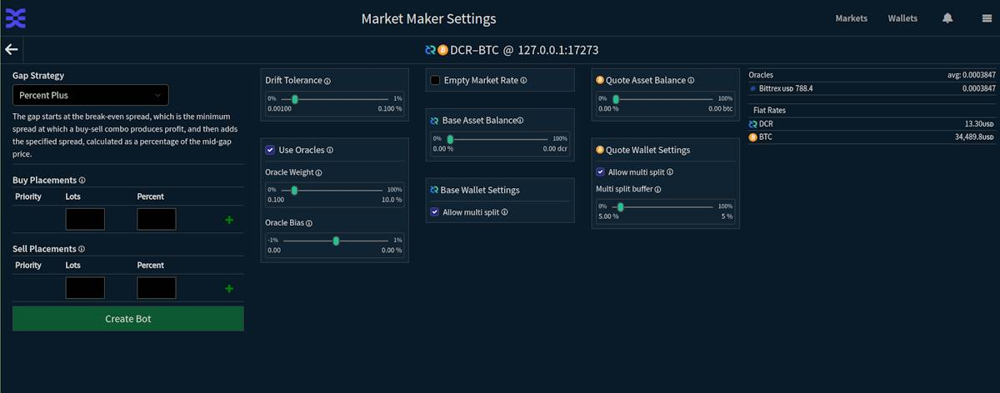
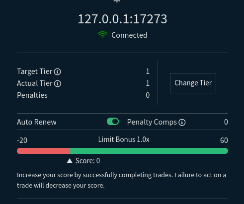
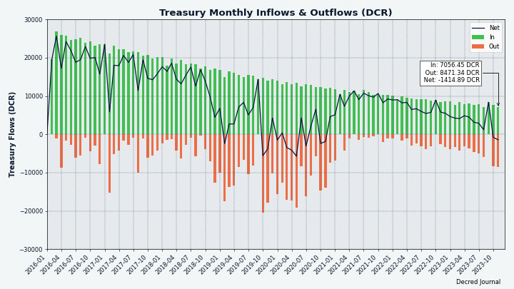
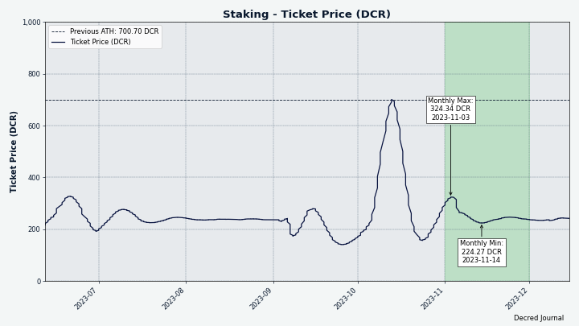
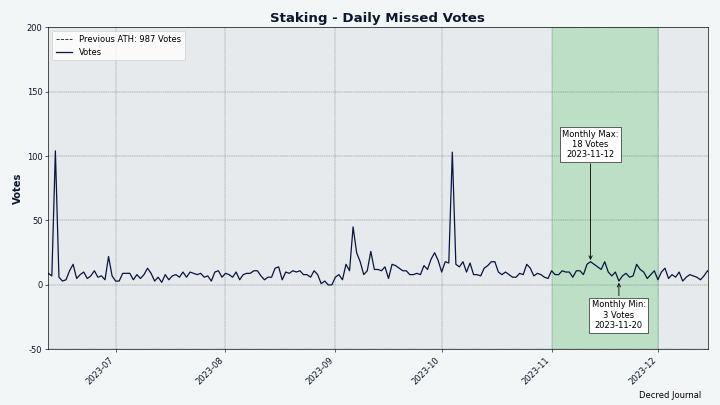
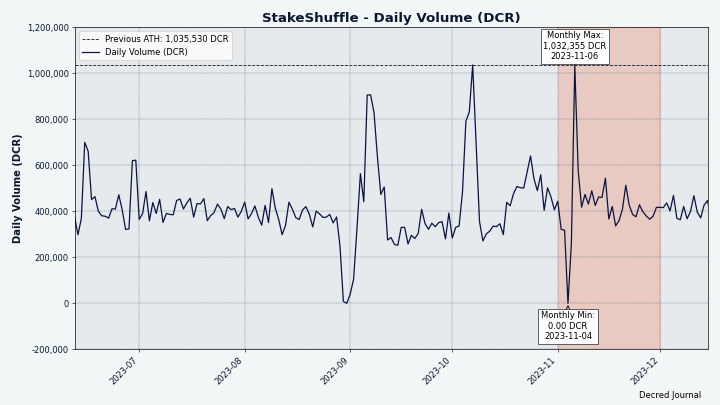
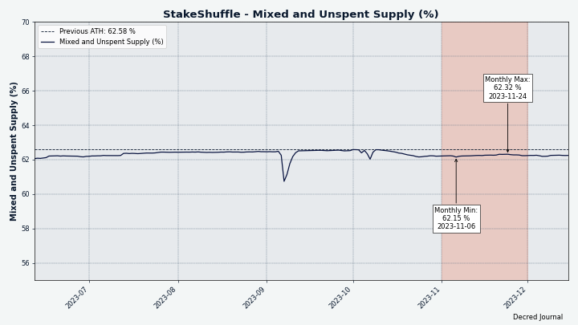

# Decred 月报 – 2023 年 11 月

_图片：@Exitus_

_12 月的时间对我来说是一个很大的挑战，我们很晚才发布这个。 抱歉，久等了！ \[@蜜蜂\]_

11 月亮点：

- 已为 DCRDEX 提出概念证明网状网络设计。

- Cryptopower 的 Android 和 iOS 版本的内部测试已经开始。

- Decred 的闪电网络收到了上游 lnd v0.13 代码库的大规模更新。

- Poloniex 和 HTX 遭到黑客攻击，导致 DCR 提款被禁止数周。 Bittrex宣布关闭并敦促用户退出。
  
内容:

- [开发进展总结](#development)
- [人员](#people)
- [治理和财务](#governance-and-finances)
- [网络](#network)
- [生态系统](#ecosystem)
- [外展](#outreach)
- [活动](#events)
- [媒体](#media)
- [市场](#markets)
- [相关外部信息](#relevant-external)

## 开发进展总结

除非另有说明，否则下面报告的工作为“合并至核心存储库”状态。这意味着该工作已完成、审查并集成到高级用户可以[构建和运行](https://medium.com/@artikozel/the-decred-node-back-to-the-source-part-one-27d4576e7e1c)的源代码中，但普通用户尚不可用。

### dcrd

_[dcrd](https://github.com/decred/dcrd) 是一个完整的节点实现，为 Decred 在全球的点对点网络提供支持。_

开发者和内部变化：

- [修复了一个错误](https://github.com/decred/dcrd/pull/3209)，该错误是在[10 月](202310.md#dcrd) 中提出的。 如果对等方、节点在发送多条消息后断开连接，dcrd 将挂起。 此错误修复允许 dcrd 在对等节点断开连接时优雅地响应。
- 更新了 [Docker 镜像](https://github.com/decred/dcrd/pull/3210) 以使用 Go 1.21.4 进行构建。
- 对等节点不应互相发送“nil”消息。 为了抢先查找和调试可能发生这种情况的情况，dcrd 现在将[如果“nil”消息排队则发生恐慌](https://github.com/decred/dcrd/pull/3213)（“恐慌”意味着 dcrd 将终止并向用户发出问题警告）。 此更改包括一个方便的错误跟踪，以帮助通知开发人员哪位代码导致了恐慌。

进行中：

- 提出了一种新的有线消息，该消息将通过允许 dcrd [批量发送紧凑块过滤器](https://github.com/decred/dcrd/issues/3206) 而不是每个发送一个来加速 SPV 客户端同步堵塞。初始[实现](https://github.com/decred/dcrd/pull/3211) 已提交进行代码审查。

Decred 是作为 [btcsuite 项目](https://blog.companyzero.com/2015) 的一个分支 [启动](https://blog.companyzero.com/2015/03/btcsuite-code-migration-and-btcd-0-10-0-release/)。 当被问到这些年来 dcrd 代码有何不同时，@davecgh 回答道：

> dcrd 比 btcd 有了“显着”改进。我指的不仅仅是 DCR 相对 BTC 的改进。我的意思是几乎全部。 例如 APBF，大大改进的网络代码，链代码允许标头优先语义的整个方式，如何处理整体同步，支持块失效和重新考虑，处理旧链的对等点的方式，更快的加密方式，50 倍（至少） 同步时间的改进，本质上是对底层脚本语义的完全重写（例如 stdscript、stdaddr、正确的版本控制支持等），等等。 [[聊天](hhttps://matrix.to/#/!zefvTnlxYHPKvJMThI:decred.org/$TTnbRmx8LDGfU-0-0phuCKMut55fcdt0sJpMqhU-Hhk)@davecg]

### dcrwallet

_[dcrwallet](https://github.com/decred/dcrwallet) 是命令行和图形界面钱包应用程序使用的钱包服务器。_

本月许多面向用户的变化都集中在优化 [SPV 模式](https://docs.decred.org/wallets/spv/)，这是钱包无需下载完整区块链即可运行的模式。 对于硬件性能有限的钱包来说，这是一个不错的选择，尤其是移动设备。 Decred 的 SPV 模式使用 [高级加密技术](https://github.com/decred/dcps/blob/master/dcp-0005/dcp-0005.mediawiki#simplified-payment-verification-spv) 来启用轻客户端，兼得安全性和去中心化。

[初始 SPV 同步](https://github.com/decred/dcrwallet/issues/2289) 的优化 - SPV 钱包与链同步时启动例程的一部分：

- 提前进行[验证区块难度](https://github.com/decred/dcrwallet/pull/2297)。 这意味着，如果任何区块违反了 PoW 或 PoS 难度的共识，钱包可以更早地忽略这些区块并减少工作量。 这将有助于加快同步时间。 此外，如果钱包确实收到违反难度共识的区块，它现在将[在日志中报告它们](https://github.com/decred/dcrwallet/pull/2294)。
- 仅执行一次[“获取任何缺失的紧凑型过滤器”](https://github.com/decred/dcrwallet/pull/2298)阶段。 过去，这种情况在连接到每个新对等点时都会发生，但现在每次同步只需发生一次，从而减少了重复工作。 “紧凑过滤器”或只是“cfilters”是跟踪块中交易而无需下载整个块的有效方法。
- [在启动时获取新的块头和压缩过滤器一次](https://github.com/decred/dcrwallet/pull/2300)，而不是从每个对等点获取相同的头。 这避免了每个对等方浪费重复的工作，并显着减少初始同步期间使用的资源量（CPU、RAM、带宽、goroutine）。
- 在启动时执行一次[帐户/地址发现和重新扫描块](https://github.com/decred/dcrwallet/pull/2301)，而不是在每个新连接的对等点之后执行。 这使得代码更容易推理。
- [仅请求最佳侧链的 cfilter](https://github.com/decred/dcrwallet/pull/2302)。 这避免了必须为不是（也永远不会成为）主链的侧链执行工作。
- [允许 dcrwallet 小批量获取 cfilters](https://github.com/decred/dcrwallet/pull/2307)。 目前还不会发生功能更改，但这使得代码一旦 dcrd 支持批量 cfilter 请求就可以切换到它们。 dcrd 工作[已在进行中](https://github.com/decred/dcrd/pull/3211)。
- [同时从多个对等点并行获取 cfilters](https://github.com/decred/dcrwallet/pull/2308)。 这会将负载分散到多个对等点上，由于远程对等点资源使用率较低，因此初始同步过程（平均）稍快一些。

其他 SPV 模式优化：

- 无需多次[计算区块哈希值](https://github.com/decred/dcrwallet/pull/2295)。 这会带来更快的同步时间并减少内存使用。 在 SPV 操作期间，计算块哈希所花费的时间减少了约 72%。
- 在 SPV 中连接时，[与落后的对等点断开连接](https://github.com/decred/dcrwallet/pull/2299)。 在初始同步期间，连接到较早区块范围的对等点可能很有用，但由于钱包从其他对等点发现了更多最新区块，该对等点稍后可能会被钱包超越。 如果钱包收到多个新标头后特定对等点没有发送任何标头，则可能意味着落后对等点与网络的连接较差，应断开连接以尝试找到更好的对等点。

开发者和内部变化：

- 如果用户尝试花费包含一个或多个[无效签名](https://github.com/decred/dcrwallet/pull/2274)的多重签名UTXO，则表明交易尚未准备好发送，并返回签名错误。 这是为使用多重签名的高级用户和开发人员改进用户体验的一步，目前这是可能的，但尚未广泛使用。
- 为“chain”包的语义版本控制添加了[单元测试](https://github.com/decred/dcrwallet/pull/2293)。
- 其他代码重构。

### Decrediton

_[Decrediton](https://github.com/decred/decrediton) 是一款功能齐全的桌面钱包应用程序，集成了投票、StakeShuffle 混币、闪电网络、DEX 交易等功能。 它在有或没有完整的区块链（SPV 模式）的情况下运行。_

合并到下一个版本的“master”中：

- 升级到 [Electron v26](https://github.com/decred/decrediton/pull/3928) 以启用新的 Ledger 集成。 这是通过寻找 Electron v21.3.0 中破坏 DCRDEX 窗口的微小突破性更改并为其添加[解决方法](https://github.com/decred/dcrdex/pull/2596) 来实现的。
- Electron 的[较新版本](https://www.Electronjs.org/blog/Electron-23-0) 意味着下一个 Decrediton 版本将不支持 Windows 7/8/8.1。 无论如何，加密货币安全爱好者不会将私钥存储在那些不安全的操作系统上，对吗？
- 增加了一些 Go 和 Web 依赖项。
- 修复了尝试使用错误密码购买选票时不显示的[密码错误](https://github.com/decred/decrediton/pull/3916)。
- 修复了无法从“设置”中的 [SPV 链接](https://github.com/decred/decrediton/pull/3915) 字段删除对等主机的问题。

### vspd

_[vspd](https://github.com/decred/vspd) 是投票服务提供商使用的服务器软件。 VSP 24/7 代表其用户投票，并且不能窃取资金。_

11 月的 [v1.3.2 版本](https://github.com/decred/vspd/releases/tag/release-v1.3.2) 中包含的更改：

- 添加了逻辑，以便在由于引用未知输出而失败时重试广播票证的[父交易](https://github.com/decred/vspd/pull/455)。 丢失的祖交易很可能会通过网络传播并在几秒钟后出现在本地内存池中。
- 恢复为[之前的VSP费用计算](https://github.com/decred/vspd/pull/454)不考虑DCP-12激活的算法。 这解决了 Decrediton 有时无法支付 VSP 费用的问题，因为它计算费用的方式与服务器不同。

### dcrpool

_[dcrpool](https://github.com/decred/dcrpool) 是用于运行 Decred 矿池的服务器软件。_

面向用户的变化：

- 修复了[支付费用计算](https://github.com/decred/dcrpool/pull/427)中的几个错误，这些错误导致在某些情况下支付极高的费用。 相关测试已被重新设计和扩展以测试更多案例。

内部重构（不添加功能或修复错误的更改，但会理清代码，使错误更容易查找和修复，并使代码在将来更容易更改）：

- 从通知处理程序中删除了重复且容易出错的[通道关闭](https://github.com/decred/dcrpool/pull/422)。
- 简化的代码计算[奖励支付](https://github.com/decred/dcrpool/pull/423)。
- 更新了测试以使用更多[现实](https://github.com/decred/dcrpool/pull/426) DCR 金额。

### Lightning Network

_[dcrlnd](https://github.com/decred/dcrlnd) 是 Decred 的闪电网络节点软件。 闪电网络可实现即时低成本交易。_

- dcrlnd 代码库已[同步](https://github.com/decred/dcrlnd/pull/193)，并在 v0.12.1 之间对上游 [lnd](https://github.com/lightningnetwork/lnd) 进行了更改 和 [v0.13.4](https://github.com/lightningnetwork/lnd/releases/tag/v0.13.4-beta)（2021 年 11 月发布）。 170 个上游拉取请求中约有 140 个已被移植，带来 451 个新提交，其中包括大约十几个特定于 Decred 的提交，以适应上游更改并简化未来的移植工作。 可以在[此处](https://github.com/decred/dcrlnd/blob/master/docs/upstream-prs.csv)找到移植和跳过的拉取请求的完整列表。 所有值得注意的更改都记录在 lnd 发行说明中：[v0.13.0](https://github.com/lightningnetwork/lnd/releases/tag/v0.13.0-beta)、[v0.13.1](https://github .com/lightningnetwork/lnd/releases/tag/v0.13.1-beta)、[v0.13.3](https://github.com/lightningnetwork/lnd/releases/tag/v0.13.3-beta) 和 [v0 .13.4](https://github.com/lightningnetwork/lnd/releases/tag/v0.13.4-beta)。 dcrlnd 已经在一些主网集线器上对生产中应用的这些更改进行了测试。
- 更新了几个 [Go 库](https://github.com/decred/dcrlnd/pull/194)。

请注意，虽然 Anchor Outputs 在 lnd v0.13 中成为比特币的默认通道类型，但它们在 Decred 上被[禁用](https://matrix.to/#/!FRpxSOMVXBCUXtQsDk:decred.org/$xOjxggI8ida5REJTWq-90TIG_Wfj-FsjiNl3FH__hJA) LN 主网针对诸如 2023 年 10 月披露的 [替换循环](https://cointelegraph.com/news/bitcoin-core-developer-antoine-riard-steps-back-lightning-network-dilemma) 漏洞等攻击提供了额外的安全性 。

### DCRDEX

_[DCRDEX](https://github.com/decred/dcrdex) 是一个非托管、尊重隐私的交易所，用于去信任交易，由原子交换提供支持。_

用户端变更：

- 在各种情况下禁用[下订单](https://github.com/decred/dcrdex/pull/2534)按钮，例如余额不足。
- 将[注销](https://github.com/decred/dcrdex/pull/2590)按钮移至菜单的末尾。
- 调整[颜色](https://github.com/decred/dcrdex/pull/2601)：在浅色和深色模式下添加了元素背景颜色的一些变化，在活动模态后面添加了轻微的背景透明度，并调低了背景颜色 在浅色模式下使用更柔和的白色。
- 删除了鼠标悬停时的[字体粗细变化效果](https://github.com/decred/dcrdex/pull/2610)，因为它在各种浏览器和字体设置上看起来不一致。
- 将登录流程更改为[不强制用户在服务器上注册](https://github.com/decred/dcrdex/pull/2614)。 本地登录后，用户将被重定向到钱包页面。
- 修复了[质押面板](https://github.com/decred/dcrdex/pull/2586)在钱包创建后不更新的问题。
- 修复了市场视图中创建[缺失钱包](https://github.com/decred/dcrdex/pull/2577)的提示。

桌面应用程序：

- 修复了[外部](https://github.com/decred/dcrdex/pull/2541)[链接](https://github.com/decred/dcrdex/pull/2597)的打开问题； 它们将触发操作系统的默认 URL 处理程序（可能会启动默认浏览器或显示对话框）。
- 修复了 [暗模式](https://github.com/decred/dcrdex/pull/2604) 首选项在 Linux 上不保存的问题。 解决方法是将其保存在 WebView 的本地存储中，而不是保存在 cookie 中，因为在 Linux 版本的 WebView 组件中，cookie 在应用程序启动之间并不持久。

账户交易等级、债券和声誉：

- 在注册和设置视图中公开更多[债券和声誉数据](https://github.com/decred/dcrdex/pull/2575)。 当用户输入等级编号时，新的预览表单将显示实际锁定的债券金额、交易限额及其美元等价物。 市场视图上的交易表格将显示当前交易等级可以使用多少手数。 添加了多个帮助字符串来解释债券、交易等级以及对不良行为的处罚。

做市商机器人：

- 更新了[做市商设置](https://github.com/decred/dcrdex/pull/2587) UI，以具有更具响应性的布局并解释机器人策略（当前有 5 种策略）。
- 添加了结合[做市商和简单套利](https://github.com/decred/dcrdex/pull/2530)的机器人策略。 它基于CEX订单簿，在DEX订单簿上下单，当DEX上有匹配时，立即执行CEX上相反的订单以获取利润。

Decred：

- 添加了[混合资金](https://github.com/decred/dcrdex/pull/2478)的通用基础设施，并实现了 DCR 的低级位（尚无 GUI）。

比特币：

- 存储比特币 SPV 钱包的[交易历史](https://github.com/decred/dcrdex/pull/2550)。 尽管底层 SPV 钱包实现（[Neutrino](https://github.com/lightninglabs/neutrino)）已经存储了交易数据，但使用该存储会导致代码不可靠且令人困惑。 将交易存储在单独的数据库中可以解决这个问题，并且还可以提高准确性，例如区分常规发送和交换交易。

Zcash：

- 将 Zcash 代码提取到自己的[钱包实现](https://github.com/decred/dcrdex/pull/2553)中。 这是将其与比特币代码区分开来所必需的，因为 Zcash 钱包与比特币的钱包非常不同。 这一变化允许 Zcash 钱包默认受到屏蔽，并解决了一些内部问题。

以太坊：

- 在用户界面上显示[代币合约地址](https://github.com/decred/dcrdex/pull/2592)，以便用户可以确定他们正在使用哪种以太坊或Polygon代币。 例如，USDC的ERC-20合约地址是[0xa0b8699...eb48](https://etherscan.io/token/0xa0b86991c6218b36c1d19d4a2e9eb0ce3606eb48)。

内部和开发人员变更：

- 更新了客户端的 [web 依赖项](https://github.com/decred/dcrdex/pull/2584)，修复了 Babel 编译器中的一个严重漏洞。

进行中：

- 名为 [Tatanka](https://github.com/decred/dcrdex/pull/2602) 的概念证明网状网络实现已提交供讨论。 这是针对 2023 年 6 月批准的 [DCRDEX 网格提案](https://proposals.decred.org/record/4d2324b) 所做的工作。建议读者观看[短视频](https://www.youtube.com/watch?v=uZRTLpXXlds) 了解 Tatanka 到底是什么（如果视频在您所在的位置受到限制，请尝试 [Invidious](https://redirect.invidious.io/watch?v=uZRTLpXXlds)）。
- 具有 Schnorr 适配器签名的 [私有原子交换](https://github.com/decred/atomicswap/pull/130) 的实现已提交至 atomicswap 存储库以供审核。 DCRDEX 目前使用的原子交换方法在两条链上留下相同的唯一价值，允许任何人链接买家和卖家的交易。 适配器签名允许用户修复此隐私漏洞，但代价是各方之间需要进行一些额外的链下通信。 然而，由于这种方法依赖于 Taproot（这会引入不小的问题）和 [elliptic -curve cryptography](https://en.wikipedia.org/wiki/Elliptic-curve_cryptography)（因此，如果 Decred 升级到[后量子加密](https://en.wikipedia.org/wiki/Post-quantum_cryptography)此代码将被破坏）。 请注意，“atomicswap”是一个独立于 DCRDEX 项目的命令行工具，但其中首创的代码也可以应用于 DCRDEX。

_图片：DCRDEX 中的做市商设置 UI_

_图片：DCRDEX 将更好地揭示债券数学和交易限制_

_图片：DCRDEX 设置中改进的债券信息_

### Cryptopower

_[Cryptopower](https://github.com/crypto-power/cryptopower) 是一款适用于 DCR、BTC 和 LTC 的多币种桌面 GUI 钱包。 它以保护隐私的轻 SPV 模式运行，无需完整的区块链，支持 Decred 质押、混合、投票和其他独特功能。_

顶层Home子页面的设计实现：

- 实施了新的[交易选项卡](https://github.com/crypto-power/cryptopower/pull/198)，显示所有钱包中的所有交易，并按钱包和交易类型提供可选过滤器。
- 在概览中单击交易时，跳转至[交易详细信息](https://github.com/crypto-power/cryptopower/pull/258)。
- 当在概述中单击提案时，跳转到[提案详细信息](https://github.com/crypto-power/cryptopower/pull/272)。
- 隐藏仅观察的钱包的[发送按钮](https://github.com/crypto-power/cryptopower/pull/302)。

钱包子页面的设计实现：

- 在[钱包信息](https://github.com/crypto-power/cryptopower/pull/247)页面添加了新卡，以显示混音器状态、最近的交易和最近的质押活动。
- 在[钱包设置](https://github.com/crypto-power/cryptopower/pull/228)页面上实现了新的布局。
- 更新了钱包 [Stake](https://github.com/crypto-power/cryptopower/pull/244) 页面部分的布局：一般 Stake 信息、统计数据和票据。

移动端适配：

- 将[钱包选择](https://github.com/crypto-power/cryptopower/pull/226)页面调整为移动布局。

硬币换算：

- 在 [instantswap](https://github.com/crypto-power/instantswap) 中添加了对 [Trocador.app](https://github.com/crypto-power/instantswap/pull/7) 的初步支持。

修复：

- 修复了“概述”选项卡上的[硬币背景](https://github.com/crypto-power/cryptopower/pull/236) 的渲染。
- 修复了[应用程序关闭](https://github.com/crypto-power/cryptopower/pull/259)期间出现的入门页面。
- 修复了在[钱包和概述](https://github.com/crypto-power/cryptopower/pull/263)选项卡之间切换时发生的崩溃。
- 小修复。

内部和开发人员变更：

- 重构以简化[内部API](https://github.com/crypto-power/cryptopower/pull/232)，优化[内存使用](https://github.com/crypto-power/cryptopower/pull/223)，并删除不必要的代码。
- 删除了很多不需要的[监听器帮助程序代码](https://github.com/crypto-power/cryptopower/pull/240)。
- 删除了重复的[应用程序宽度计算](https://github.com/crypto-power/cryptopower/pull/274)。
- 修复了 [linter 错误](https://github.com/crypto-power/cryptopower/pull/241) 并更新了 CI 配置。

移动应用程序构建的私人测试已在 Google Play 商店和 Apple Store (TestFlight) 中设置。 如果您想参与，请在 [#cryptopower](https://chat.decred.org/#/room/#cryptopower:decred.org) Matrix 聊天中提问（请参阅[如何加入 Matrix](https://docs.decred.org/getting-started/joining-matrix-channels/))。

在 Twitter 上关注 [@cryptopowerWlt](https://twitter.com/cryptopowerWlt) 以支持该项目并获取更多更新。

_图片：Cryptopower 中的概述选项卡_

_图片：Cryptopower 中的更新设置_

_图片：Cryptopower 中更新的钱包概述_

_图片：Cryptopower 中的移动布局（正在进行中）_

### Documentation

_[dcrdocs](https://github.com/decred/dcrdocs) 是 Decred [用户文档](https://docs.decred.org/) 的源代码。_

- 更新了几页上的[区块奖励分配和总发行](https://github.com/decred/dcrdocs/pull/1234)数字。
- [DCP-12 部署](https://github.com/decred/dcrdocs/pull/1233) 的固定日期。

### Bison Relay

_[Bison Relay](https://github.com/companyzero/bisonrelay) 是一个新的社交媒体平台，具有针对审查、监视和广告的强大保护，由 Decred 闪电网络提供支持。_

下面列出的工作已合并到下一个版本的“master”中。

GUI 和文本应用程序中的更改：

- 读取保存的聊天记录时过滤[不需要的内容](https://github.com/companyzero/bisonrelay/pull/377)。 以前的内容过滤仅处理新收到的消息。
- 将 Bittrex 替换为 MEXC 作为[汇率](https://github.com/companyzero/bisonrelay/pull/383)的来源。

GUI 应用程序中面向用户的更改：

- 允许用户在新闻源和帖子中[选择文本](https://github.com/companyzero/bisonrelay/pull/379)。
- 修复了聊天室中新创建的群聊[未出现](https://github.com/companyzero/bisonrelay/pull/376)。

GUI应用程序适应移动设备：

- 各种[移动修复和用户体验改进](https://github.com/companyzero/bisonrelay/pull/375)，包括：在某些页面中用“后退”按钮替换“菜单”按钮、字体大小调整、引导调整、溢出修复，以及 Android 构建修复。
- 根据用户反馈增加了聊天中的[间距](https://github.com/companyzero/bisonrelay/pull/378)。

GUI 应用程序中的内部更改：

- 合并[字体大小](https://github.com/companyzero/bisonrelay/pull/346)声明和用法，以根据应用程序运行的操作系统或平台实现一致性和更好地控制字体。

进行中：

- 用户在与 Oprah 机器人交互时报告了各种 [LN 通道问题](https://matrix.to/#/!GHnoHXSgkVasUknRUg:decred.org/$nOaRAKaygrxyyvZkPzJ4jGr5S0MsC7FGYS0iPFRG7pc)。 其中一些问题的根本原因已在 dcrlnd 中找到并正在处理中。

其他：

- Decred 月报档案现已发布在 Bison Relay 上。 请联系@karamble 获取使用说明。

### Cake Wallet 集成

已完成的工作合并到中间[集成树](https://github.com/JoeGruffins/cake_wallet/tree/cw-decred)：

- 添加了 [libwallet 存根](https://github.com/JoeGruffins/cake_wallet/pull/4)，以便在编写真正的 libwallet 时继续使用更高级别的代码。 此外，还删除了早期实验中留下的许多不必要的代码。
- 继续研究从用 Dart/Flutter 编写的 Cake 高级代码调用用 Go 编写的 Decred 代码的最佳方式。
- 三位开发人员配置了构建环境并获得了 Cake Wallet 的工作构建，在 iOS、Android 和 macOS 上显示了虚拟 Decred 视图。 考虑到构建过程的复杂性和混乱性，仅仅获得一个有效的构建就是一个值得注意的里程碑。

Cake Wallet 正在进行中的工作：

- 添加[初始 Decred 屏幕](https://github.com/cake-tech/cake_wallet/pull/1165) 的第一个更改已提交到名为“decred_main”的上游存储库的集成分支。 在添加到 Cake Wallet 的“main”分支之前，工作的 Decred 代码将在该分支中进行测试和完善。
- 集成作为 C 库构建的 [libwallet](https://github.com/JoeGruffins/cake_wallet/pull/8)，包括 Kotlin 和 Swift 中任何必要的粘合代码，以及为各种操作系统和 CPU 架构构建代码。
- 用于构建 Cake 钱包的脚本和操作指南 [在 macOS 上](https://github.com/cake-tech/cake_wallet/pull/1163)。 这记录了很难发现的复杂构建过程中缺失的知识。
  
[libwallet](https://github.com/itswisdomagain/libwallet) 的合并工作：

- 为 DCR、BTC 和 LTC 钱包实现了[基本功能](https://github.com/itswisdomagain/libwallet/pull/1)，包括：创建钱包、创建手表钱包、打开钱包、启动/停止钱包同步 ，设置钱包生日。 它借鉴了 DCRDEX 和 Cryptopower 的一些代码和想法，并构建在用 Go 编写的现有加密货币项目之上，包括：[Decred](https://github.com/decred)、[btcsuite](https://github.com/decred)。 com/btcsuite)、[ltcsuite](https://github.com/ltcsuite)、[Neutrino](https://github.com/lightninglabs/neutrino) 用于 BTC 和 [Neutrino fork](https://github.com/btcsuite)、[Neutrino](https://github.com/lightninglabs/neutrino)。 com/ltcsuite/neutrino）用于 LTC（加上来自 DCRDEX 开发人员的[补丁](https://github.com/dcrlabs/neutrino-ltc)）。
- 用于保存[钱包配置和交易数据]的存储实现(https://github.com/itswisdomagain/libwallet/pull/3)。

libwallet 正在进行中：

- 用于将 libwallet 构建为 [C 库](https://github.com/itswisdomagain/libwallet/pull/2) 的包装层，可以从 Cake Wallet 的高级应用程序代码中调用。
- 用于管理 [钱包同步](https://github.com/itswisdomagain/libwallet/pull/4) 并报告 DCR、BTC 和 LTC 钱包同步进度的软件包。

libwallet 是一个多币种库，为 Decred、比特币和莱特币实现轻量 (SPV) 钱包。 它最初是为了将 Decred 集成到 Cake Wallet 中而创建的，但它有潜力成为构建 Decred 和多币软件的平台。 第二个使用 libwallet 的应用程序可能是 Cryptopower 钱包。 这将类似于 GoDCR 和 Android/iOS Decred 应用程序共享现已停产的 [dcrlibwallet](https://github.com/planetdecred/dcrlibwallet)，但将支持更多资产，而不仅仅是 Decred。 C 互操作层将很快添加，这将允许任何可以[调用 C 代码](https://en.wikipedia.org/wiki/Foreign_function_interface)的编程语言使用 libwallet，从而促进 Decred 与各种现有的集成和新的加密软件（这是 [TinyDecred v2](202206.md#tinywallet) 工作的目标之一）。

与市场上许多现有的应用程序相比，基于 libwallet 构建的钱包应用程序将具有更好的隐私性，市场上通常使用可以跟踪用户资金的中央服务器。 不幸的是，Cake 的比特币钱包就是这样一种情况，因为它依赖于他们的 [Electrum 服务器](https://github.com/cake-tech/cake_wallet/blob/3760285a64405935fafe7aeeb051fd25d850585b/assets/bitcoin_electrum_server_list.yml)，这 [不利于隐私](https://electrum.readthedocs.io/en/latest/faq.html)。 在底层，libwallet 对 Decred 使用 [dcrwallet](https://github.com/decred/dcrwallet)，对比特币使用 [Neutrino](https://github.com/lightninglabs/neutrino)，它们直接连接到完整节点， 私下获取数据而不泄露自有资金和交易。

### 其它

- [timestamply.org](https://timestamply.org/) 界面的阿拉伯语翻译已[提交](https://github.com/decred/dcrtimegui/pull/157) 进行代码审查。

## 人员

欢迎新的首次贡献者：

- @Philip-21 (开发者, [dcrwallet](https://github.com/decred/dcrwallet/pull/2293))

Community stats as of Dec 3 (compared to Nov 2):

- [Twitter](https://twitter.com/decredproject) 粉丝: 53,939 (+464)
- [Reddit](https://www.reddit.com/r/decred/) 订阅: 12,773 (+11)
- [Matrix](https://chat.decred.org/) #general 用户: 833 (+7)
- [Discord](https://discord.gg/GJ2GXfz) 用户: 1,862 (+24), 已验证发布: 769 (+7)
- [Telegram](https://t.me/Decred) 用户: 2,319 (+22)
- [YouTube](https://www.youtube.com/decredchannel) 订阅: 4,660 (+20), 观看量: 244.7K (+2.3K)

## 治理和财务

11 月，新[国库](https://dcrdata.decred.org/treasury) 收到了 7,060 DCR，价值 101,000 美元，11 月的平均汇率为 14.35 美元。 8,471 DCR 用于支付承包商费用，按相同价格计算价值 122,000 美元。

[国库支出tx](https://dcrdata.decred.org/tx/ca24ed5e5d4819ca68b270a78345be07d5a18890b83ada366e970807425e8bfc)以7,346票赞成和57%的投票率获得批准，并于11月21日开采。它有50个产出支付给承包商，范围从 3 DCR 至 1,411 DCR。 大部分 DCR 可能是 9 月份和 10 月份部分工作的报酬。 使用两个月的估计账单汇率 12.98 美元，此 TSpend 中的账单金额约为 11 万美元。

关于这几个月向承包商支付的国库付款的时间和结构的考虑因素之一是保持在 [DCP-7](https://github.com/decred/dcps/blob/master/dcp-0007/dcp-0007.mediawiki)。 随着时间的推移，DCR/美元汇率的下降和区块奖励补贴的下降意味着达到上限首次成为现实的担忧，特别是在旧发票积压的情况下。 在这种情况下，已经提交的 10 月份发票将与 9 月份的发票同时发送以进行付款，而不是再等一个月，这本来是更常见的情况。

截至 12 月 1 日，[旧国库](https://dcrdata.decred.org/address/Dcur2mcGjmENx4DhNqDctW5wJCVyT3Qeqkx) 和[新国库](https://dcrdata.decred.org/treasury) 的合并余额为 871,828 DCR（1,250 万美元） 以14.39 美元计价。

_图片：DCR 中的国债流入和流出_

_图片：财政部每月余额（美元）； 请注意，这在很大程度上取决于汇率_

 11 月没有 Politeia 提案[已提交](https://proposals.decred.org/?tab=under%20review)、[已批准](https://proposals.decred.org/?tab=approved) 或[已拒绝] (https://proposals.decred.org/?tab=rejected)。

据报道，11 月 23 日，一名用户无法注册并提交提案。 显然 Politeia [没有检测到](https://matrix.to/#/!qYpAAClAYrHaUIGkLs:decred.org/$jmqFcgH8De7TuG2Z9FofSxeBfcYPWn5KMjcG-V6d0bk) 注册费付款。 截至12月1日，该问题尚未解决。

## 网络

本节跟踪基础设施的关键健康指标。

### 挖矿

11 月的 [全网算力](https://dcrdata.decred.org/charts?chart=hashrate&scale=linear&bin=day&axis=time) 以 13.7 TH/s开启，以 5.5 TH/s结束，最低 5.0 TH/s，峰值 15.9 TH/s。

_图片：在 GPU 矿工最初涌入后，Decred 算力正在寻求新的平衡_

截至 12 月 3 日，实际[开采](https://miningpoolstats.stream/decred)的 1,000 个区块的分布：[miningandco.com](https://decred.miningandco.com/) 41%，[losmuchachos.digital](https ://losmuchachos.digital/) 8%，[pooltronic.tech](https://decred.pooltronic.tech/) 3.6%，47% 的区块未被 [miningpoolstats.stream](https://miningpoolstats.stream/decred)收录。

_图片：唯一挖矿地址的减少表明它再次变得更加中心化_

### Staking

[票价](https://dcrdata.decred.org/charts?chart=ticket-price&axis=time&visibility=true-true&mode=stepped) 在 224-324 DCR 之间变化。

_图片：票价很快就稳定了_

[锁定金额](https://dcrdata.decred.org/charts?chart=ticket-pool-value&scale=linear&bin=day&axis=time)为927-985万个DCR，这意味着循环供应量的59.4-63.1%[参与](https://dcrdata.decred.org/charts?chart=stake-participation&scale=linear&bin=day&axis=time)权益证明。

_图片：锁定选票的 DCR 保持在其 ATH 附近_

_图片：除此之外，质押 DCR 的百分比间接显示有多少新发行量被重新质押_

### VSP Staking

[14 个列出的 VSP](https://decred.org/vsp/) 总共管理了约 5,850 (-1,350) 现场票，截至 12 月 1 日，占选票池的 14.3% (-2.5%)。 注意：这些 数字不包括 [123.dcr.rocks](https://123.dcr.rocks/) 管理的约 400 张选票，该选票因关闭而被除名。

11 月份唯一上涨的是 [99split.com](https://vspd.99split.com)（+136 张门票或+32%），其他 13 个选票流出。

_图片：VSP 管理的选票分布_

_图片：错过的选票又回到低位_

### 节点

[Decred Mapper](https://nodes.jholdstock.uk/user_agents) 整个月观察到 150 到 158 个 dcrd 节点。 12 月 1 日出现的 147 个节点的版本：v1.8.0 - 67%%、v1.8.1 - 23%、v1.9.0 开发版本 - 3%、v1.7.x - 2%、v1.8.0 - 0.7%、其他 - 3%。

_Image：节点正在升级到 v1.8.1。 2023 年 1 月之前的红色区域表示我们当时拥有的数据不完整。_

### StakeShuffle

[混合币](https://dcrdata.decred.org/charts?chart=coin-supply&zoom=jz3q237o-la8vk000&scale=linear&bin=day&axis=time&visibility=true-true-true)的份额在62.1-62.3%之间变化。 每日 [混合量](https://dcrdata.decred.org/charts?chart=privacy-participation&bin=day&axis=time) 在 0-1,032K DCR 之间变化。

_图片：每日 DCR 混合的第二次大跌和恢复_

_图片：超过 62% 的流通供应更倾向于隐私_

### Lightning Network

截至 12 月 3 日，Decred [LN Explorer](https://ln-map.jholdstock.uk/) 有 220 个节点 (+0)、420 个通道 (-28)，总容量为 206 DCR (+3) ( 与 11 月 1 日相比）。

_图片：闪电网络的一些频道被关闭_

_图片：LN 节点数量保持不变，但容量略有增加_

感谢@bochinchero 提供和改进这些图表。 [dcrsnapshots](https://github.com/bochinchero/dcrsnapshots) 存储库中提供了本 Decred 月报问题中未使用的大约 40 个其他图表； 欢迎大家在社交媒体上分享。

## 生态系统

### 投票服务提供商

- vspd [v1.3.2 版本](https://github.com/decred/vspd/releases/tag/release-v1.3.2) 发布了修复程序，应解决选票状态错误和 VSP 费用支付失败的问题。 截至 12 月 1 日，14 个 VSP 中有 9 个已部署这些修复程序。

- [VSP 列表页面](https://decred.org/vsp/) 已[更新](https://github.com/decred/dcrweb/pull/1148) 以显示所有时间的错过选票统计信息。 截至 12 月 1 日快照，14 个 6 个月至 3 岁之间的活跃 VSP 总共报告了 1,108 个撤销票据，其中 1,101 个[正常]过期(https://docs.decred.org/proof-of-stake/ 概述/），只有 7 人错过了投票。 较低的错过计数表明，与错过率较高的旧 [dcrstakepool](https://github.com/decred/dcrstakepool) 相比，vspd 部署更加可靠。 注意：[bass.cf](https://vspd.bass.cf/) 已被排除在这些数字之外，因为它尚未升级以报告错过的门票。

### 矿池

- [decred.miningandco.com](https://decred.miningandco.com/)已[向所有人开放](https://matrix.to/#/!TSpuyuYWgkTrgPTcXh:decred.org/$H4QA2fDpl1OO6jLnJa6PTAHiEPPSYQYSlomhYzWLrb8)。 我们在[10 月](202310.md#ecosystem) 宣布了它，但错过了它最初是一个私人池。 支持的矿工包括适用于Windows的官方[gominer](https://github.com/decred/gominer)和适用于Linux和HiveOS的gominer的[自定义二进制文件](https://github.com/Gddrig/gominer/releases)。 托管这些二进制文件的 [GitHub 存储库](https://github.com/Gddrig/gominer) 尚不包含源代码，因此请谨慎使用。

### Staking 服务

- [BisonPool](https://twitter.com/BisonPool) [报告](https://twitter.com/BisonPool/status/1724110111503728738) 随着 DCP-10 的激活，收益从每年约 2.8% 上升至 ~7.8%/年，现在 DCP-12 高达 ~8.6%/年。 当前回报显示在他们的[主页](https://bisonpool.org/)上，请注意，它不是固定的，取决于票价。 BisonPool 于 2022 年 7 月由两名 IT 安全爱好者推出，他们自 2018 年起匿名参与 Decred。该服务允许质押和赚取收益低于全票的奖励。 请记住，这是一项完全控制用户资金的托管服务。

### 交易所

- [Poloniex](https://poloniex.com/) 于 11 月 10 日遭到黑客攻击，以太坊资产、Tron 资产和 BTC 预计损失 1.18 亿美元。 由于 [Poloniex](https://twitter.com/Poloniex/status/1722956238160536049)、[Justin Sun](https://twitter.com/justinsuntron/status/1722942733680296246) 或 [Lookonchain tweet](https://twitter.com/lookonchain/status/1722969227915661531) 均未提及 DCR 关于被盗资产，尚不清楚在黑客攻击期间是否有任何 DCR 被盗。 无论如何，DCR 用户都受到了所有提现暂停的影响。 #trading 俱乐部的链上研究人员 [注意到](https://matrix.to/#/!lDZCzVQjFoJsXMPkvr:decred.org/$c4Da_17xYGDPGRlK3JLf91bA2UbhoQvthyfVBCD6vvI) 一笔交易从 [Poloniex 地址](https://dcrdata.decred.org/address/DsTSdjhiCY1z8AeQGWYJ5ryJKRA3eSBGRTj) 到 [Binance](https://dcrdata.decred.org/address/DsSJDWwDZtxjFvh7xvTzkENAtNZEeZsQgG8) 。 人们猜测，可能是 Poloniex 保存了剩余资金，也可能是黑客在币安上清算了这些资金。

- Poloniex 从黑客攻击中恢复的速度很慢。 交易于次日[恢复](https://support.poloniex.com/hc/en-us/articles/18996694952983)，但截至 11 月 30 日尚未启用提款，其[支持 Twitter](https:///twitter.com/PoloSupport)一直保持沉默。 与此同时，也不乏促销、炒作，甚至上币[tweets](https://twitter.com/Poloniex)。 由于提款和跨交易所套利不起作用，DCR 价格与其他市场相比大幅下跌。

- 根据官方[支持文章](https://www.htx.com/support/en-us/detail/104954980569005)和[PeckShield](https://twitter.com/PeckShieldAlert/status/1727290028064436539)。 [Justin Sun](https://twitter.com/justinsuntron/status/1727304656622326180) 和 [HTX](https://www.htx.com/support/en-us/detail/104954980569005) 承诺全额补偿用户 的损失。 DCR 并未被提及为被盗资产，并且很可能从未集成到 HECO 链桥中。 然而，DCR 用户因所有提款暂停而受到打击。

- 与 Poloniex 相比，HTX 的恢复速度更快。 截至 11 月 30 日，BTC、ETH、TRX 等近百种资产（包括 USDT 和 USDC）的提现均已恢复，但根据官方更新和 HTX 上的 DCR/USDT 滑点来看，DCR 就没那么幸运了。

- [Bittrex Global](https://bittrexglobal.com/) 宣布他们正在[结束运营](https://twitter.com/BittrexGlobal/status/1726652430673121310)。 所有交易活动将于 12 月 4 日结束，届时客户将只能提款。 任何剩余的美元将[自动转换为 USDT](https://twitter.com/BittrexGlobal/status/1729897531448987831)。 对于 Bittrex 来说，这是糟糕的一年：[2900 万美元](https://www.reuters.com/business/finance/crypto-exchange-bittrex-fined-53-mln-by-us-treasury-dept-2022-10-11/) 于 2022 年 10 月罚款，不得不逐步结束 [美国 由于不受欢迎的监管和经济环境，于 2023 年 3 月停止运营](202303.md#ecosystem)，[美国 SEC 指控](202304.md#relevant-external) 于 4 月因违反证券规定，以及[破产](202305.md)于五月提交。

- Bittrex的DCR提现已暂停9天（根据[此地址](https://dcrdata.decred.org/address/DsbvnccsFTAP7FQV7g3SgGfyoXNcPL2Y1fm)），导致DCR价格下跌。

- [KuCoin](https://www.kucoin.com/) 宣布 DCR/USDT 交易对将于11月24日推出，同时DCR/ETH交易对将关闭。其他8种硬币也进行了同样的更改。

- [Changelly](https://github.com/decred/dcrweb/pull/1153) 已从 [decred.org Exchanges](https://decred.org/exchanges/) 页面中删除。

- [MEXC.com](https://www.mexc.com/exchange/DCR_USDT) 和 [XT.com](https://www.xt.com/) 已经过测试：DCR 交易可通过 VPN 进行，无需了解您的客户。 DCR 提款正在 MEXC 上运行，需要帮助来测试 XT 的提款。

- [Trocador](https://trocador.app/) [已推出](https://twitter.com/TrocadorApp/status/1722987823664410844) 新的[预付费虚拟卡](https://trocador.app/en/prepaidcards/) 可以用加密货币购买并用作普通信用卡。 DCR 的测试运行发现了一些问题：后端错误（开发人员修复了它）、带有卡详细信息的自动电子邮件不起作用（支持请求解决了它）、它适用于 Google Pay，但不适用于非接触式 NFC 支付，并且有 使用该服务大约需要 8% 的加价。 尽管存在这些问题，它仍然有效，并允许发送 DCR 并获得可用于购买现实世界物品的预付费 VISA 卡。

### 其他新闻

- Decred Vanguard 开始积极测试和寻求 Decred 的新集成，请查看他们的报告[如下](#decred-vanguard)。

- 任何人都可以帮助提高 Decred 在加密生态系统中的影响力。 即使是像向交易所/钱包/服务/影响者发送电子邮件或推文这样的小事情也可以产生影响。

加入我们的 [#ecosystem](https://chat.decred.org/#/room/#ecosystem:decred.org) 聊天室的 100 多名成员，获取有关 Decred 服务的详细新闻。 [#ecochat](https://chat.decred.org/#/room/#ecochat:decred.org) 工作组也欢迎可以帮助测试提款的志愿者。

警告：Decred 月报的作者不知道上述任何服务的可信度。 在将您的个人信息或资产委托给任何实体之前，请先进行自己的研究。

## 外展

### Decred Vanguard

更新：

- 举办 [Meme 竞赛](https://twitter.com/exitusdcr/status/1719412415375241610)，奖励 100 美元的 DCR。
- 尝试与加密货币交易所联系 [Kraken](https://www.kraken.com/)、[CEX.IO](https://cex.io/) 和 [M2](https://www.m2.com/en_AE/) 获取上市指导。
- 为 [TradeOgre.com](https://tradeogre.com/) 提交了列表[申请](https://twitter.com/exitusdcr/status/1723075248709370337)。
- 测试了山寨币交易所 [MEXC.com](https://www.mexc.com/exchange/DCR_USDT) 和 [XT.com](https://www.xt.com/) 以确保存款和取款工作正常。
- 测试了使用 $DCR 购买的 Trocador [预付卡](https://trocador.app/en/prepaidcards/)。
- 与 Trocador 讨论了可能的合作伙伴关系。 这导致 Cryptopower [集成](https://github.com/crypto-power/cryptopower/pull/257) Trocador 的交换服务进入他们的钱包，使他们有资格成为合作伙伴，从而在 Trocador 的主[网站](https://trocador.app/en/)。
- 与 [BTCPay 服务器](https://docs.btcpayserver.org/) 开发人员交谈并[确认](https://matrix.to/#/!zefvTnlxYHPKvJMThI:decred.org/$zRag-ReHSe8Ot8onMz-MPW7lMsS4DJssxWzlLAcFD3Y) 如果做得正确的话，他们愿意合并山寨币集成。
- 联系思想领袖 [Justin Bons](https://twitter.com/Justin_Bons) 进行对话。
- 在 [Cake Wallet](https://twitter.com/cakewallet/status/1724849595195253163) Twitter 空间上谈论 Decred DAO 的工作。
- 对社区最喜欢的[营销努力](https://twitter.com/exitusdcr/status/1729192850544587079)进行了一项民意调查。 有影响力的合作最受欢迎，占 46%。 共投出 106 票。
- 轻松进入即可完成 [100 美元 Decred 赠品](https://twitter.com/exitusdcr/status/1729571096230252835)。 低门槛的赠品总是会获得更多的点赞、浏览和转发。

Decred Vanguard 是一项基于社区的营销活动，旨在扩大 Decred 的外展范围和社交媒体影响力。

您是模因创造者、艺术家、战略家，还是只是对 Decred 项目充满热情的人？ 我们正在扩大我们的社区驱动的营销计划，我们需要您！

这对你有什么好处？

- 仅参与即可每月赚取 100 美元 DCR。
- 我们将承担您的 X Premium 费用。
- 没有严格的参与规则。 只要有可能，就以自己独特的方式做出贡献。
- 赢得潜在的贡献奖。

我们一直在测试新的赠品并举办有奖模因竞赛！

感兴趣的？ 在 Twitter/Matrix/Discord 上联系@Exitus。

### Cypherpunk Times

11 月参与度统计：

- CT上的文章总数：588
- 时事通讯订阅者：112
- 发送的新 CT 帖子和时事通讯：23
- 所有平台和帐户的社交媒体关注者：1,181
- [@decredsociety](https://twitter.com/decredsociety) Twitter：关注者 - 985，帖子 - 16，推文展示次数 - 17.1K，点赞 - 350，转发 - 51，评论 - 51
- [@cypherpunktimes](https://twitter.com/cypherpunktimes) Twitter：关注者 - 196，帖子 - 154，推文展示次数 - 19.3K，点赞 - 439，转发 - 107，评论 - 88
- 11 月份按项目发布的帖子：Firo - 5、Decred - 7、其他加密项目/新闻 - 11

## 活动

**出席：**

- @arij 受邀参加 LBANK Labs 组织的一次大型会议，重点关注[摩洛哥的投资动态和区块链生态系统的出现](https://decredcommunity.github.io/events/index/20231121.1)，她在会上参与了 作为 Decred 代表参加网络会议并建立了宝贵的联系。

## 媒体

### 文章

Decred:

- [Decred重回正轨！ 我们能期待什么？](https://www.cypherpunktimes.com/decred-back-on-tracks-what-can-we-hope-for/)  @Joao
- [Decred 与 Polygon：去中心化与创新！](https://www.cypherpunktimes.com/decred-vs-polygon-decentralized-and/)  @Joao
- 请参阅下面视频部分中的配套文字帖子

通用加密货币：

- [《Cypherpunk Times》月度综述（2023 年 10 月版）](https://www.cypherpunktimes.com/cypherpunktimes-monthly-roundup-october-2023-edition/) @tallamericano
- 熊市忧郁：在加密货币低迷中生存和繁荣 [第 1 部分](https://www.cypherpunktimes.com/bear-market-blues-surviving-and-thriving-in-cryptocurrency-downturns/) 和 [第 2 部分] （https://www.cypherpunktimes.com/bear-market-blues-surviving-and-thriving-in-cryptocurrency-downturns-2-2/）@tallamericano
- [回顾 10 月份主要加密诈骗和黑客攻击](https://www.cypherpunktimes.com/reviewing-major-crypto-scams-and-hacks-in-october/) @BlockchainJew
- [一年后：FTX 的 Sam Bankman 受到谴责](https://www.cypherpunktimes.com/one-year-after-sam-bankman-from-ftx-is-condemned/)  @Joao
- [CEX 视图](https://www.cypherpunktimes.com/cex-in-view/) by @BlockchainJew
- 浏览交易所列表丛林：有关如何列出您的加密货币的综合指南 [第 1 部分](https://www.cypherpunktimes.com/navigating-the-exchange-listings-jungle-a-comprehensive-guide-on-how-to-get-your-cryptocurrency-listed-1-2/) @tallamericano
- [加密货币视野：揭开本周的数字戏剧](https://www.cypherpunktimes.com/crypto-in-view-unraveling-the-weeks-digital-drama/) by @BlockchainJew

### 视频

- [Decred 新闻 - 版本 1.8.1，Reddit 上的开发 AMA，新票价 ATH，大量更新！](https://www.youtube.com/watch?v=pRQSH3tO5xk) @Exitus
- [扩展区块链：为什么 Decred 选择使用闪电网络扩展 - 前进](https://www.youtube.com/watch?v=xWgjrKW1e1o) @phoenixgreen 
- [新的工作范式 - 为 Decred DAO 工作 - 前进](https://www.youtube.com/watch?v=1z0Q-jcRcHI)  @phoenixgreen 
- [如何安全地存储和备份你的 Decred - 问答环节](https://www.youtube.com/watch?v=fYCNaY3MKps)  @phoenixgreen
- [Decred 区块是如何构建的？ - 问答环节](https://www.youtube.com/watch?v=8DNSrEicKx0)  @phoenixgreen 

直播：

- [Decred 开发者评论 - 市场状况](https://www.youtube.com/watch?v=mdtTVqEFewE)，@phoenixgreen 和 @Exitus，讨论 [Decred 开发者 AMA](https://www.reddit.com/r/decred/comments/1700xyi/decred_developer_ask_me_anything_ama_feat_dev/)以及社区提出的问题

短视频：

- [Decred - 将隐私与可审计供应相结合的加密货币](https://www.youtube.com/watch?v=A7hHQuN9VX0)，@DajanaDcr 和 @Exitus

### 音频

- @Exitus 概述了 Decred DAO/Treasury 以及承包商如何在 Cake Wallet 的 [Twitter Space](https://twitter.com/cakewallet/status/1724849595195253163) 致力于加密货币领域的早期贡献。
- 检查 Spotify 上的 [Cypherpunk Times](https://podcasters.spotify.com/pod/show/cypherpunktimes) 播客，了解 Decred 视频的音频版本。

### 非英语内容
- 关于 [Timestamply](https://www.youtube.com/watch?v=xvsoded_XsU) 的视频，作者：[@arij](https://twitter.com/in_insaf/status/1728829464237514971)
- Decred 月报 9 月总共获得了 3 个新的阿拉伯语 (@arij)、中文 (@Dominic) 和波兰语 (@kozel) [翻译](https://xaur.github.io/decred-news/)。 谢谢朋友们！

### 随机的

- @kozel 在 [Decred Treasury](https://twitter.com/decredproject/status/1722177861803483579) 和 [TSpend 投票](https://twitter.com/decredproject/status/1723269730113323485) 上发布的教育推文
- 每月 [Random + Trader](https://www.reddit.com/r/decred/comments/17lahax/monthly_random_trader_talk/) 团体讨论看涨论文和想法
- 来自 @h3la1 的智力挑战：[提出一个好的 Decred 稳定币想法](https://twitter.com/h3la1/status/1729116883889348704) 并赢得 1 个 DCR
- 首次 [DCRDEX 体验](https://twitter.com/longtermdaily/status/1720895569529364900) @pubpete

> 我从未计划使用#DCRDEX，因为我不需要，但随着时间的推移，我意识到它增加了价值。 直到我用来购买 #Decred 的唯一交易所 (@BittrexExchange) 停止在美国运营......这才真正击中了我！ 这不是想要，而是需要！ [[@longtermdaily](https://twitter.com/longtermdaily/status/1720895569529364900)]

### 艺术和娱乐

- [创造的支柱](https://www.cypherpunktimes.com/pillars-of-creation/)  @OfficialCryptos
- @Exitus 的 [meme 竞赛](https://twitter.com/exitusdcr/status/1719412415375241610) 的一些获奖者：[@Atonito](https://twitter.com/exitusdcr/status/1720511478694822066)、[@CahyadieDika ](https://twitter.com/exitusdcr/status/1720504961635660253)，[@MANCASTVZX](https://twitter.com/exitusdcr/status/1720411076527903070)，[@wumudidi](https://twitter.com/wumudidi/status/1719539682999255443)

_图片：被困的比特币用户正在寻找治疗方法，作者：[@yourkingroyal](https://twitter.com/yourkingroyal/status/1720035878318248374)_

_图片：[@wumudidi](https://twitter.com/wumudidi/status/1719539682999255443) 杯子上的旧 Decred Moon Fuel 艺术_

## 市场

11 月，DCR 在币安上的交易价格为 USDT 12.33-16.50 、 BTC 0.00036-0.00046。 使用 Coin Metrics 的加权每日收盘数据，价格范围为 13.11-15.50 美元，BTC 0.00037-0.00043。 计算得出的承包商付款的平均每日价格为 14.35 美元。

[The Rational Investor](https://www.therationalinvestor.com/) 的 Brian Beamish 做了[DCR 技术分析](https://www.youtube.com/watch?v=l1wZCgi8Zv8&t=1h15m10s)（跳转至 1:15:10）。

_图片：近期 DCR/BTC，数据来自 Coin Metrics_

_图片：历史 DCR/BTC，数据来自 Coin Metrics_

_图片：近期 DCR/USD，数据来自 Coin Metrics_

_图片：DCRDEX 每月交易量（美元）_

_图片：“比很多人意识到的更好的长期图表”作者：[@cburniske](https://twitter.com/cburniske/status/1729243261460734172)_

## 相关外部信息

比特币矿池 f2pool承认审查来自 OFAC 批准地址的交易。这种行为是由比特币开发者 0xB10C 通过分析本应包含在 f2pool 中但没有包含在内的交易而发现的。最初，f2pool 否认了这一行为，但他们随后承认了这一点，并表示将暂停该行为，直到建立社区共识，但此后他们删除了有关此行为的各种帖子。

门罗币链侦探 Moonstone Research分析了攻击者进行的交易，该攻击者耗尽了社区众筹系统（CCS）钱包的资金，并发现了一些交易，他们相当确定这些交易代表攻击者向交易所或交易对手发送资金。这在社区中引起了一些争议，因为门罗币以其隐私而闻名，但这是隐私的“最坏情况”，钱包的私钥和元数据已与调查人员共享，而攻击者似乎进行了一笔不寻常的交易（使用 Monerujo 的“PocketChange”功能）和其他一些失误（扫钱包）使调查人员的工作变得更加容易。

对于新的 Monero CCS 系统设计有多种建议，该系统可以避免在某些可成为目标的核心成员的控制下拥有大量 XMR 的陷阱。其中之一是“密码朋克提案”，一旦项目获得融资许可，人们可以直接向项目所有者的钱包捐款，从而消除托管人的角色，从而消除资金的集中监督和释放。

Fluffypony提议解散“门罗币核心团队”，转而成立 6 个工作组，其成员由社区共识决定，切换日期为 2024 年 1 月 1 日。该提议部分是由 CCS 基金最近的问题推动的，但核心团队是总的来说，也被认为拥有过多的控制权，并且某些角色，例如与服务提供商打交道的角色，要求“担任这些特定角色的个人不要粗鲁，并对他们所打交道的个人表现出热情、理解和友好”那些服务提供商”。他建议的工作组涉及普通捐赠基金、社区众筹系统、知识产权持有、服务器和 CDN 托管、Git 维护以及社区频道审核。该提案呼吁决定采用草拟投票共识机制来选择工作组成员，但规定只有具有多年贡献的参与者才应考虑成为工作组成员。

Cosmos 创始人 Jae Kwon 呼吁进行链分叉硬分叉，因为社区违背了他的意愿，批准了减少 ATOM 发行量的提案。将发行率从每年 14% 降至 10% 的提议以 41.1% 的参与投票权和 31.9% 的反对票获得通过——这一改变的理由是 Cosmos Hub 为安全付出了太多代价。Kwon 的链分割提案将形成一条拥有自己代币的新链，但也允许以某种方式使用原始 ATOM 代币。这也可能会化解社区中围绕“Cosmos 2.0”计划被否决的一些紧张局势，该计划获得了大量支持，但领导层认为风险太大。

Aragon 协会宣布打算解散，将该组织持有的 95% 资产返还给 ANT 代币持有者，并保留 5% 用于偿付债务。在 2024 年 11 月 2 日之前，ANT 持有者将能够以每 ANT 0.0025376 ETH 的价格将 ANT 兑换为 ETH，届时任何无人认领的资金将恢复到新成立的“阿拉贡盾”，在那里它们将被用于一些松散定义的延续产品开发。尽管 Aragon 的软件工具被 Lido 和 Curve 等成功的 DAO 使用，但团队认为不可能从这种使用中为 ANT 持有者带来任何价值，并且他们承认像“Aragon Court”这样的企业是不可行的。

一些 ANT 代币持有者对 Aragon 协会的计划并不满意，特别是为 Aragon Shield 保留 1100 万美元加上一年后所有无人认领的资金，他们支持通过“高度重视”向 Aragon 协会索取更多资金的提议。有条件拨款”给 Patagon Management LLC，一家专门从事此类追回资金法律行动的贸易公司。

一款假冒的“Ledger Live”应用程序进入了微软应用程序商店，结果无论是谁发布了它，都会收到 38 笔价值 58.8 万美元的交易，因为它窃取了那些认为自己正在使用正确的 Ledger Live 软件访问其硬件钱包的人的 BTC 。

KyberSwap 遭到黑客攻击，并敦促用户在可能的情况下提取资金，但攻击者通过执行一系列复杂的操作，允许他们利用漏洞操纵价格，从而获得了约 5500 万美元的用户资金。KyberSwap 团队提供 10% 的赏金来返还资金，攻击者在链上消息中回复称，在他们休息的几个小时内就会开始否定。前端运行的机器人能够加入该漏洞并在攻击者之前获得 570 万美元的用户资金，机器人的运营商将以10% 的赏金返还资金。

两个月内发生了四起针对交易所和孙宇晨运营的桥梁的重大黑客攻击。HTX 交易所（原火币网）遭受两次黑客攻击，损失达 800 万美元和 3000 万美元，而 Poloniex 则因私钥泄露而损失 1 亿美元。HTX 的 HECO Chain 桥用于在交易所和各个链之间转移资金，是另一个受害者，有 8700 万美元流入可疑地址。

LBRY Inc. 在美国证券交易委员会 (SEC) 起诉其破产后即将倒闭，其所有资产将被出售以偿还债权人。Odysee 将继续使用 LBRY 网络提供视频共享服务，从某些方面来看，该网络是使用率最高的 Web3 平台之一，每月拥有 530 万独立用户。

SEC起诉Kraken 非法经营证券交易所，因为它们未能注册，类似于 6 月份针对 Coinbase 和 Binance 提起的案件。

SafeMoon 的首席执行官和首席技术官在一项欺诈调查中被美国司法部逮捕，指控称他们误导投资者，花费 2 亿美元购买奢侈品，同时告诉他们这些产品被锁定在流动性池中。美国证券交易委员会对 SFM 代币未注册和价格被操纵等证券违规指控层出不穷，指控公布后，该代币暴跌。

SBF 审判最终对七项指控作出有罪判决，并将于 2024 年宣判，SBF 面临最高 115 年监禁。是否追究政治捐款因素的问题将在晚些时候提出——剧透警告，他们决定不揭露该犯罪的程度以及所有参与媒体审查的政客，12 月。

FTX 破产顾问一直在向 FBI 办公室提供客户交易数据的访问权限。

中国法院确认NFT 作为财产受到法律保护，并发表评论澄清了之前的一些矛盾。NFT被视为兼具使用价值和交换价值，其稀缺性意味着其符合网络虚拟财产的特征。承认 NFT 的产权意味着人们可以因盗窃它们而受到起诉。

美联储正在追查《比特币杂志》，因为他们嘲笑其 FedNow 服务，称其侵犯了其版权和商标。《比特币》杂志发表了一份公开答复，拒绝遵守规定，将这件带有美联储商标的违规 T 恤从他们的商店中下架。

Bittrex Global 终于结束了运营并停止了交易。自从他们宣布截止日期以来，提取 DCR 时出现了间歇性问题，并且 DCR 货币对开始表现异常，流动性较低，并且有些人担心人们是否能够提取他们在那里购买的任何 DCR。

Bored Ape Yacht Club 年度 ApeFest 的参加者受到了紫外线照射，超过 20 名距离紫外线太近的人报告眼睛出现严重疼痛和烧灼感，这可能是由光角膜炎或角膜晒伤引起的。

这就是十一月的全部内容。 在我们的 [#journal](https://chat.decred.org/#/room/#journal:decred.org) 聊天室中建议下一期的月报。

## 关于月报

这是 Decred 月报的第 65 期。 [此处](https://xaur.github.io/decred-news/) 提供所有问题、镜像和翻译的索引。

来自第三方的大多数信息都是在经过最低限度的健全性检查后直接从源头转发的。 Decred 月报的作者无法验证所有声明。请提防诈骗并自行研究。

感谢（字母顺序）：

- 写作、编辑、出版：bee、bochinchero、Exitus、jz、karamble、kozel、phoenixgreen、richardred、zippycorners
- 标题图片：Exitus
- 资金来源：Decred 利益相关者

## 中文社区

* [推特](https://twitter.com/DecredCN)
* [微信公众号](https://mp.weixin.qq.com/mp/profile_ext?action=home&__biz=Mzg2NTExNzc3MA==&scene=124#wechat_redirect)
* [bilibili频道](https://space.bilibili.com/425519478)  
