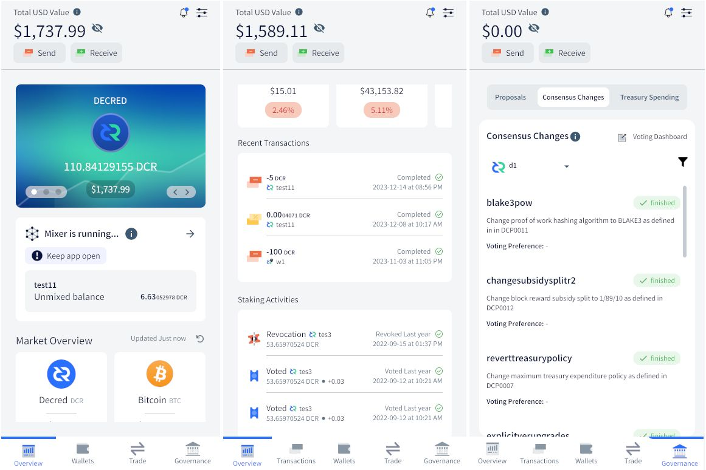
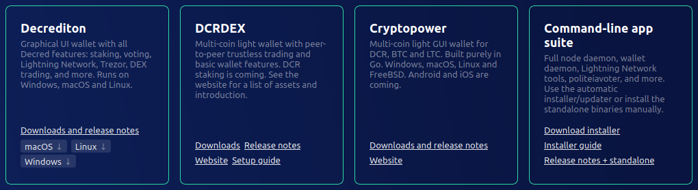
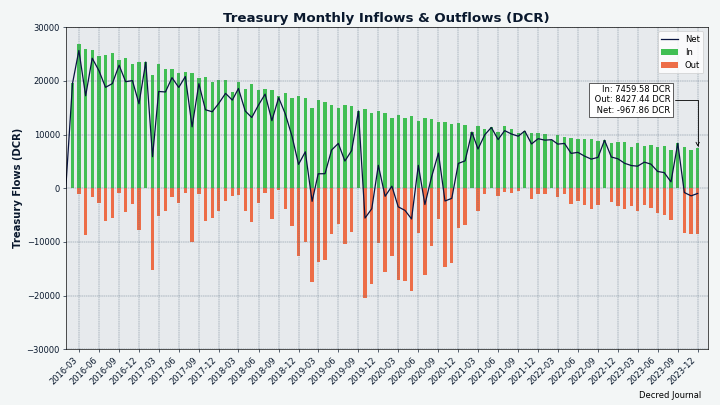
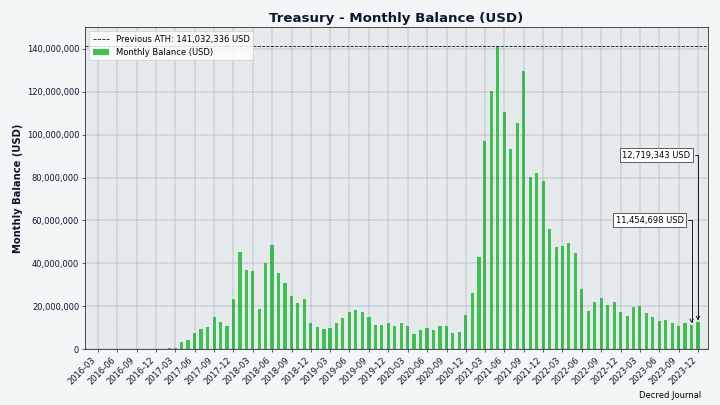

# Decred 月报 – 2023 年 12 月

_图片：@Exitus_

*亲爱的读者，很抱歉花了这么长时间才完成十二月的月报。近几个月来，抽时间为《华尔街日报》工作是一个巨大的挑战。我们正在讨论对 月报 进行彻底改革以优化我们的工作。我希望本期仍然能为您提供独特且有用的信息。阅读愉快！-- @bee*

12 月亮点：

- 两项提案已获得批准，即在 2024 年继续执行 Bug 赏金计划和视频内容创建。

- 两个新的矿池已经启动，但数据表明挖矿再次变得更加集中。

- 钱包应用程序和 Bison Relay 正在为下一个版本进行完善，Cake 集成正在进行中。

内容:

- [开发进展总结](#development)
- [人员](#people)
- [治理和财务](#governance-and-finances)
- [网络](#network)
- [生态系统](#ecosystem)
- [外展](#outreach)
- [媒体](#media)
- [市场](#markets)
- [相关外部信息](#relevant-external)

## 开发进展总结

除非另有说明，否则下面报告的工作为“合并至核心存储库”状态。这意味着该工作已完成、审查并集成到高级用户可以[构建和运行](https://medium.com/@artikozel/the-decred-node-back-to-the-source-part-one-27d4576e7e1c)的源代码中，但普通用户尚不可用。

### dcrd

_[dcrd](https://github.com/decred/dcrd) 是一个完整的节点实现，为 Decred 在全球的点对点网络提供支持。_

开发者和内部变化：

- 更新了 [Docker 镜像](https://github.com/decred/dcrd/pull/3214) 使用 Go 1.21.5 进行构建。
- 在 `wire` 包中将 `cfilter` 版本 1 消息标记为 [已弃用](https://github.com/decred/dcrd/pull/3205)。 这只是一般清理，因为 V1 `cfilter` 已经无效。 自 [DCP-5](https://github.com/decred/dcps/blob/master) 以来，V2 `cfilter` 已成为[标准](https://github.com/decred/dcrd/pull/1906)于 2020 年 1 月激活。

进行中：

- 将 [P2P 混合信息](https://github.com/decred/dcrd/pull/3066) 引入 `wire` 协议

### dcrwallet

_[dcrwallet](https://github.com/decred/dcrwallet) 是命令行和图形界面钱包应用程序使用的钱包服务器。_

面向用户的变化：

- 仅在钱包完全同步后[请求阻止通知](https://github.com/decred/dcrwallet/pull/2310)。 这解决了钱包可能会在底层 dcrd 实例完全同步之前尝试查看区块的竞争问题。 当 dcrwallet 在 dcrd 之后很快启动时（例如，从 Decrediton 内部），可能会发生这种情况。 结果将是错过交易通知并且钱包余额错误，需要重新扫描才能修复。
- 当钱包在 SPV 模式下同步时，[并行处理标头批次](https://github.com/decred/dcrwallet/pull/2311)。 在现实世界中进行测试时，这使得同步速度平均提高了 32%。
- 当钱包处于 SPV 模式并且初始同步已经完成时，[从每个新连接的对等点请求标头](https://github.com/decred/dcrwallet/pull/2316)。 当本地客户端离线一段时间（例如，由于网络连接间歇性）时，通过确保立即请求所有新标头，而不是等到宣布新块，可以加快初始同步后的重新同步速度 开始追赶过程。
- 修复了一个错误，即如果从种子恢复后这些交易位于提示块中，则恢复的钱包将[错过发现交易](https://github.com/decred/dcrwallet/pull/2319)。 这是一个相当罕见的错误，因为恢复后链中有更多块（常见情况）可以防止该问题出现。 该错误可能只会影响自动化开发测试，尽管重新扫描也可以为可能遇到该错误的任何用户解决该问题。

内部和开发人员变更：

- 将修剪程序修改为[修剪部分侧链](https://github.com/decred/dcrwallet/pull/2309)，而不是修剪整个树。 这还没有功能变化，但将来将允许 SPV 客户端异步处理链。
- 尽可能使用 Go 1.19 [原子类型](https://github.com/decred/dcrwallet/pull/2312)。 这些类型仅允许通过提供的方法进行访问，从而防止误用，并保证正确使用，即使变量在结构布局中重新组织也是如此。
- 如果对等方向钱包提供了一个新块，确保该块在主链或侧链中具有[已知的祖块](https://github.com/decred/dcrwallet/pull/2315)。 如果不存在已知的祖块，这意味着钱包错过了一些块并且应该重新同步块头。 以前，钱包只寻找主链中的祖块，而不是所有侧链。 这导致“getHeaders”不必要地频繁运行，特别是对于使用侧链模拟大型重组的开发人员而言。
- 修复 gRPC 记录器，该记录器在记录消息参数时无法[正确删除前缀](https://github.com/decred/dcrwallet/pull/2313)。 

进行中：

- 添加[集成测试](https://github.com/decred/dcrwallet/pull/2318)，在已知会导致丢失交易的各种场景下恢复钱包的正确行为。 这些测试利用即将推出的[自动化和测试框架](https://github.com/decred/dcrtest/pull/20)，通过其 JSON-RPC 和 gRPC 接口操作 dcrwallet 二进制文件。
- 添加[批量获取紧凑型过滤器](https://github.com/decred/dcrwallet/pull/2314)以进一步[加速SPV模式下的同步](https://github.com/decred/dcrwallet/issues/2289)。 此更改取决于相关的[dcrd 中的更改](https://github.com/decred/dcrd/pull/3211)，使完整节点能够向轻 SPV 客户端提供批量数据。

### vspd

_[vspd](https://github.com/decred/vspd) 是投票服务提供商使用的服务器软件。 VSP 24/7 代表其用户投票，并且不能窃取资金。_

- [添加文档](https://github.com/decred/vspd/pull/458)，了解新的 VSP 管理员如何在 Decrediton 和 [decred.org/vsp](https://decred.org/vsp)上列出其 VSP。 该文档并不针对普通用户，因此也已从 [docs.decred.org](https://docs.decred.org) 中删除。

### dcrpool

_[dcrpool](https://github.com/decred/dcrpool) 是用于运行 Decred 矿池的服务器软件。_

- 在矿池账户页面显示已连接矿工的[IP和端口](https://github.com/decred/dcrpool/pull/428)。 这使得区分客户变得更容易。
- 如果 dcrd 的 `GetTxOut` 方法找不到给定交易的输出，则允许 dcrpool [优雅地处理错误](https://github.com/decred/dcrpool/pull/431)。

### Lightning Network

_[dcrlnd](https://github.com/decred/dcrlnd) 是 Decred 的闪电网络节点软件。 闪电网络可实现即时低成本交易。_

- 添加了自动关闭[一段时间内未重新建立](https://github.com/decred/dcrlnd/pull/196)的通道。 通常，通过“重建”通道来保持健康。 如果通道对等点在线一段时间但没有发送消息来重新建立通道，则此类通道很可能被强制关闭，因为远程对等点可能已失去使用该通道的能力（例如 ，由于在数据丢失后恢复节点而未使用 [SCB 备份文件](https://docs.decred.org/lightning-network/backups/))。 默认情况下，如果通道的远程交易对手连续72小时在线而没有重新建立通道，通道将自动关闭。 这应该是在集线器（24/7 在线）和临时节点（每天可能仅在线一两个小时）上过快关闭通道之间的合理折衷。 添加了集成测试来判断正确的行为。

### cspp

_[cspp](https://github.com/decred/cspp) 是一个使用 CoinShuffle++ 协议的协调混币服务器。 它是非托管的，即从不持有任何资金。 CSPP 是 Decred 隐私系统 StakeShuffle 的一部分。_

- 更新了 [C 头文件](https://github.com/decred/cspp/pull/98) 以支持 [第三个主要版本](https://flintlib.org/doc/history.html#flint-3-0-0)的快速数学库“flint”（2023 年 10 月发布）。较新版本的“flint”可能会为 CSPP 服务器提供更高性能和其他改进。

### DCRDEX

_[DCRDEX](https://github.com/decred/dcrdex) 是一个非托管、尊重隐私的交易所，用于去信任交易，由原子交换提供支持。_

更改向后移植到下一个 v0.6.x 版本：

- 修复了服务器断开连接后交易可能[卡住](https://github.com/decred/dcrdex/pull/2622)的错误。受影响市场的完整列表尚不清楚，但已知该漏洞影响了 LTC/DCR 市场，但没有影响 DCR/BTC 市场。

做市商机器人：

- 实现了初级[CEX管理功能](https://github.com/decred/dcrdex/pull/2568)：存款、取款和余额跟踪。 自动重新平衡已添加到简单的套利策略中，机器人可以向 CEX 发起存款和取款，以维持配置的余额。 币安是第一个支持此功能的 CEX。
- 修改了 Binance 代码以跟踪 1,000 个[订单簿条目](https://github.com/decred/dcrdex/pull/2627)，而不是 20 个。
  
一般客户变更：

- 在 DEX 设置视图中添加了[过期未退款债券](https://github.com/decred/dcrdex/pull/2626) 的显示。 当债券到期时，可以退还以收回资金。
- 较小的用户界面修复。

其他：

- 更新了 [dex.decred.org 页脚](https://github.com/decred/dexweb/pull/39) 以显示更多支持的资产。

正在进行中的亮点：

- 切换到 [Polygon 上的原生 USDC](https://github.com/decred/dcrdex/pull/2629)。
- 用于创建独立的 [Windows 桌面应用程序](https://github.com/decred/dcrdex/pull/2635) 及其安装程序的构建环境。
- @buck54321 在 Twitter 上询问 [哪些货币和功能](https://twitter.com/blockchainbuck/status/1732515860156199038) 社区希望看到未来开发，以及 [哪些 USDC 对](https://twitter .com/blockchainbuck/status/1734048766850683051）是最受欢迎的。

### Cryptopower

_[Cryptopower](https://github.com/crypto-power/cryptopower) 是一款适用于 DCR、BTC 和 LTC 的多币种桌面 GUI 钱包。 它以保护隐私的轻 SPV 模式运行，无需完整的区块链，支持 Decred 质押、混合、投票和其他独特功能。_

新实现的 UI 元素：

- [管理钱包账户](https://github.com/crypto-power/cryptopower/pull/260)页面。
- [帮助页面](https://github.com/crypto-power/cryptopower/pull/219) 帮助用户在首次启动应用程序后进行初始配置。
- 概述页面上的动画[滑动更新](https://github.com/crypto-power/cryptopower/pull/256)。
- 更新了[治理页面](https://github.com/crypto-power/cryptopower/pull/221)的UI设计（提案、共识、财务）。
- 在交易页面添加了[“所有钱包”过滤器](https://github.com/crypto-power/cryptopower/pull/313)。
- 在[发送页面](https://github.com/crypto-power/cryptopower/pull/310)添加了高级选项，包括在一笔交易中发送给多个地址的能力。

交易：

- 通过 [Trocador](https://github.com/crypto-power/cryptopower/pull/257) 实现硬币转换（交换）。
- 添加了首次访问 DCRDEX 和 CEX 功能时显示的[介绍页面](https://github.com/crypto-power/cryptopower/pull/224)。
- 单击概览上的最近交易时打开[交易详细信息](https://github.com/crypto-power/cryptopower/pull/300)。
- 添加了[交易历史](https://github.com/crypto-power/cryptopower/pull/333)页面。

去中心化交易：

- 为 DCRDEX 主页实现了 [UI 布局](https://github.com/crypto-power/cryptopower/pull/208)，基础 DEX [逻辑](https://github.com/crypto-power/cryptopower/pull/238)，以及从 DCR 钱包[购买信用债券](https://github.com/crypto-power/cryptopower/pull/269)的能力。

隐私：

- 更新了[隐私页面](https://github.com/crypto-power/cryptopower/pull/248)。 默认情况下，混币将关闭，不会创建与混币相关的帐户，并且允许从“默认”帐户发送。

移动 UI 实现，以下页面已针对移动屏幕进行更新/修复：

- 通用[标题](https://github.com/crypto-power/cryptopower/pull/311)，钱包名称和余额显示在所有钱包的子页面上。
- 更新了[混币选项卡](https://github.com/crypto-power/cryptopower/pull/316)和[最近交易](https://github.com/crypto-power/cryptopower/pull/339) 在概览页面上。
- [治理](https://github.com/crypto-power/cryptopower/pull/317) 布局。
- [StakeShuffle](https://github.com/crypto-power/cryptopower/pull/330) 页面。
- [CEX 交易](https://github.com/crypto-power/cryptopower/pull/323)（即时交易）布局。
- [常规设置和钱包设置](https://github.com/crypto-power/cryptopower/pull/324)页面。
- [交易](https://github.com/crypto-power/cryptopower/pull/327) 页面（应用程序范围、钱包范围、交易详细信息）。
- [质押](https://github.com/crypto-power/cryptopower/pull/335)页面。
- 钱包[账户](https://github.com/crypto-power/cryptopower/pull/336)页面。
- 钱包[信息](https://github.com/crypto-power/cryptopower/pull/332)（概述）页面。
- [应用程序入门](https://github.com/crypto-power/cryptopower/pull/342) 页面。
- 钱包[创建/恢复](https://github.com/crypto-power/cryptopower/pull/352)页面，钱包[备份](https://github.com/crypto-power/cryptopower/pull/350) ）页。
- [发送](https://github.com/crypto-power/cryptopower/pull/347) 和 [接收](https://github.com/crypto-power/cryptopower/pull/346) 页面和快速访问 情态动词。

修复：

- 修复了在未创建 DCR 钱包的情况下访问 [国库页面](https://github.com/crypto-power/cryptopower/pull/235) 时出现的错误。
- 修复了桌面模式下显示的[移动 UI 元素](https://github.com/crypto-power/cryptopower/pull/298)。
- 修复了恢复 Decred 钱包后访问 [质押页面](https://github.com/crypto-power/cryptopower/pull/328) 时的崩溃问题。
- 修复了查询即时兑换订单时的请求[速率限制](https://github.com/crypto-power/cryptopower/pull/323)错误。
- 其它小的用户界面修复。

内部和开发人员变更：

- 重构以删除[不必要的接口](https://github.com/crypto-power/cryptopower/pull/235)。
- [为 Android 和 iOS 构建](https://github.com/crypto-power/cryptopower/pull/299) 的记录说明。

其它：

- Android 和 iOS 应用程序的测试版本已提交至 Google Play Store 和 Apple TestFlight。

_图片：Cryptopower 将支持通过隐私友好的 [Trocador.app](https://trocador.app/) 进行交易_

_图片：Cryptopower 正在为 DCRDEX 上的交易添加轻量级 UI_

_图片：Cryptopower 为移动屏幕做好准备_

### Cake Wallet Integration

进行中：

- 将 [libwallet](https://github.com/JoeGruffins/cake_wallet/pull/8) 集成到 Cake Wallet 的构建过程中。
- 已[创建](https://github.com/JoeGruffins/cake_wallet/tree/onlydecred)删除了大多数其他代币的代码分支，以加快开发过程。
- 讨论如何从 Cake 的 Dart 代码调用 Go 代码。 到目前为止的计划是使用简单的 [JSON 字符串](https://github.com/itswisdomagain/libwallet/pull/6) 连接各层。
- 讨论 libwallet 应该为 Cake 和 Cryptopower 提供哪些 API。
- 添加[初始 Decred 屏幕](https://github.com/cake-tech/cake_wallet/pull/1165) 的第一个更改已合并到上游集成分支中。 该分支是在将 Decred 代码添加到 Cake Wallet 的“main”分支之前测试和完善 Decred 代码的中间位置。

### decred.org

_[dcrweb](https://github.com/decred/dcrweb) 是 [decred.org](https://decred.org/) 网站的源代码。_

- 改进了[钱包页面](https://github.com/decred/dcrweb/pull/1152)上的链接和文本，以帮助用户从四个钱包选项中进行选择。
- 更新了[葡萄牙语翻译](https://github.com/decred/dcrweb/pull/1160)。

_图片：四种钱包选择反映了正在进行的大量开发，但用户需要指导才能找到最适合他们的_

### Bison Relay

_[Bison Relay](https://github.com/companyzero/bisonrelay) 是一个新的社交媒体平台，具有无审查、监视和广告的功能，由 Decred 闪电网络提供支持。_

下面列出的工作已合并到下一个版本的“master”中。

GUI 和文本应用程序中的更改：

- 添加了[更改群聊所有者](https://github.com/companyzero/bisonrelay/pull/391)的命令。

GUI 应用程序中的更改：

- 添加了一个按钮[重置所有密钥交换](https://github.com/companyzero/bisonrelay/pull/388) (KX)。
- 添加了一个直接从新闻源中[订阅帖子](https://github.com/companyzero/bisonrelay/pull/382)的按钮（节省了几次点击）。
- 在用户菜单中添加了[传递 KX 重置](https://github.com/companyzero/bisonrelay/pull/390) 命令。
- 修复了缺失的[取消订阅帖子](https://github.com/companyzero/bisonrelay/pull/382)菜单项。

基于文本的应用程序（brclient）：

- 在“/invite”元命令下对各种[邀请处理](https://github.com/companyzero/bisonrelay/pull/386)子命令进行分组。
- 修复了隐藏客户端自己的消息的客户端消息[过滤](https://github.com/companyzero/bisonrelay/pull/393)。

内部和开发人员变更：

- 更新到最新的 [dcrlnd](https://github.com/companyzero/bisonrelay/pull/392) 并改进了启动过程中 dcrlnd 准备情况的跟踪。

### 其它

- 更新了 [Bug Bounty 网站](https://bounty.decred.org/)，仅显示前 5 位参与者，并链接到包含完整列表的单独页面。
- 修复了 [DCRDEX 版本](https://github.com/decred/umbrel-app-store/pull/10) 并在 Decred 的自定义 [Umbrel 应用商店](https://github.com/decred/umbrel) 中固定哈希 -应用商店）。

## 人员

截至 1 月 14 日 * 的社区统计数据（与 12 月 3 日相比）：

- [Twitter](https://twitter.com/decredproject) 关注：54,595 (+656)
- [Reddit](https://www.reddit.com/r/decred/) 订阅：12,768 (-5)
- [Matrix](https://chat.decred.org/) #普通用户：842 (+9)
- [Discord](https://discord.gg/GJ2GXfz) 会员：1,924 (+62)，已验证发帖人数：772 (+3)
- [Telegram](https://t.me/Decred) 成员：2,327 (+8)
- [YouTube](https://www.youtube.com/decredchannel) 订阅：4,670 (+10)，观看次数：247.1K (+2.4K) \*\*

\* 由于快照拍摄于 1 月 14 日（YouTube 为 1 月 9 日），增量代表约 1.5 个月，而不是通常的 1 个月。

\*\* Decred 的 [YouTube 频道](https://www.youtube.com/channel/UCJ2bYDaPYHpSmJPh_M5dNSg) 现在有超过 300 个视频！

## 治理和财务

12 月，新[国库](https://dcrdata.decred.org/treasury) 收到了 7,467 个 DCR，价值 11.9 万美元，按 12 月的平均汇率 15.89 美元计算。 8,427 DCR 用于支付承包商费用，按相同价格计算价值 134,000 美元。

[国库交易](https://dcrdata.decred.org/tx/bbe950023801d9a9a082b15374cb5b30385172431dec0961207b2adb7197e82d)以 99.5% 的赞成票和 58% 的投票率获得批准，并于 12 月 19 日开采。它有 29 个产出进行支付承包商，范围从 7.5 DCR 至 2,182 DCR。 大部分 DCR 可能是 10 月和 11 月工作的报酬。 估计两个月的平均账单汇率为 13.54 美元，此 TSpend 中的账单金额约为 11.4 万美元。

截至 1 月 1 日，[旧版](https://dcrdata.decred.org/address/Dcur2mcGjmENx4DhNqDctW5wJCVyT3Qeqkx) 和[新金库](https://dcrdata.decred.org/treasury) 的总余额为 870.9K DCR (15.7 百万美元，价格为 17.98 美元）。

_图片：DCR 中的国债流入和流出_

_图片：财政部每月余额（美元）； 请注意，这在很大程度上取决于汇率_

12 月提交并批准了两项提案：

- [Bug Bounty Program 2024](https://proposals.decred.org/record/a1fd5dd) @jholdstock 请求预算为 105,000 美元，其中 100,000 美元用于奖励金，5,000 美元用于管理费用。 实际上，之前的迭代只使用了所请求预算的一小部分。该提案报告称，过去 18 个月的支出为 415 美元的赏金费用和 1,750 美元的运营费用。 自 2019 年启动以来，该计划总共花费了约 11,000 美元。该提案已获得 98% 的赞成率和 74% 的极高投票率批准。

- [Decred Video Content 2024](https://proposals.decred.org/record/49cf2e1) @phoenixgreen 请求为 2024 年视频内容的创建和传播提供 71,000 美元的预算。该提案已获得 85% 的批准 和 64% 的投票率。

一位提案作者报告了购买 [提案积分](https://matrix.to/#/!qYpAAClAYrHaUIGkLs:decred.org/$elsLkiZbjOz5Pyx42S6e3HPk_4gnkoVpK8J_-qNhqJM) 时出现的问题，但该问题在几天内得到了解决。 11 月未检测到注册费的问题[持续](https://matrix.to/#/!qYpAAClAYrHaUIGkLs:decred.org/$5SiSLy_z6wCTEhGzKif9rgGjKo-kOPMNBROt3i_dRqs) 在 12 月仍然存在，目前尚不清楚它是否只影响一个不幸的新人帐户或其他可能的帐户。

有关本月提案的更多详细信息，请参阅 [Politeia Digest 第 65 期](https://www.cypherpunktimes.com/politeia-digest-september-27-december-12-2023/)。

PD 的发布工作流程已重新设计，以提高覆盖范围和参与度：主要发布渠道现在是 [Cypherpunk Times](https://www.cypherpunktimes.com/politeia-digest-september-27-december-12-2023/) (主链接发布在 Twitter 和其他地方），Medium 版本现已发布在 [Decred 的主要出版物](https://medium.com/decred/politeia-digest-65-september-27-december-12-2023-984c12c31091) （而不是鲜为人知的 [Politeia Digest](https://medium.com/politeia-digest) 出版物）和配套的 [Twitter 帖子](https://twitter.com/decredproject/status/1737514771954471033) 现在正在 制作的目的是让您无需离开 Twitter 即可观看精彩片段。

## Network

This section tracks key health metrics of the Decred infrastructure.

### Mining

December's [hashrate](https://dcrdata.decred.org/charts?chart=hashrate&scale=linear&bin=day&axis=time) opened at ~5.5 TH/s and closed ~10.2 TH/s, bottoming at 3.8 TH/s and peaking at 11.6 TH/s throughout the month.

_Image: Decred hashrate is seeking a new equilibrium after the initial influx of GPU miners_

Distribution of 1,000 blocks actually [mined](https://miningpoolstats.stream/decred) by Jan 7: [miningandco.com](https://decred.miningandco.com/) 26%, [pooltronic.tech](https://decred.pooltronic.tech/) 21%, [gopool.cash](https://dcr.gopool.cash/) 2.7%, [losmuchachos.digital](https://losmuchachos.digital/) 1.3%, and 49% of blocks were not identified by [miningpoolstats.stream](https://miningpoolstats.stream/decred).

_Image: The decline of unique mining addresses suggests it is getting more centralized again_

### Staking

[Ticket price](https://dcrdata.decred.org/charts?chart=ticket-price&axis=time&visibility=true-true&mode=stepped) varied between 234-243 DCR.

_Image: Ticket price has been very stable in December_

The [locked amount](https://dcrdata.decred.org/charts?chart=ticket-pool-value&scale=linear&bin=day&axis=time) was 9.74-9.82 million DCR, meaning that 62.0-62.6% of the circulating supply [participated](https://dcrdata.decred.org/charts?chart=stake-participation&scale=linear&bin=day&axis=time) in proof of stake.

_Image: DCR locked in tickets is staying near its ATH_

### VSP Staking

The [14 listed VSPs](https://decred.org/vsp/) collectively managed ~5,750 (-100) live tickets, which was 14.0% of the ticket pool (-0.3%) as of Jan 1.

The biggest gainers of December were [vote.dcr-swiss.ch](https://vote.dcr-swiss.ch) (+290 tickets or +105%) and [vsp.stakeminer.com](https://vsp.stakeminer.com/) (+67 tickets or +11%).

_Image: Distribution of tickets managed by VSPs_

_Image: [Solo voters](https://docs.decred.org/advanced/solo-proof-of-stake-voting/) continue to dominate, only 14% of tickets use VSPs_

_Image: VSPs are better at not missing tickets than solo voters_

### Nodes

[Decred Mapper](https://nodes.jholdstock.uk/user_agents) observed between 141 and 151 dcrd nodes throughout the month. Versions of 145 nodes seen on Jan 1: v1.8.0 - 65%, v1.8.1 - 27%, v1.9.0 dev builds - 3%, v1.7.x - 2%, other - 3.4%.

_Image: Nodes are slowly upgrading to v1.8.1. The red area before Jan 2023 indicates incomplete data we had at that time._

### StakeShuffle

The share of [mixed coins](https://dcrdata.decred.org/charts?chart=coin-supply&zoom=jz3q237o-la8vk000&scale=linear&bin=day&axis=time&visibility=true-true-true) varied between 62.2-62.3%. Daily [mix volume](https://dcrdata.decred.org/charts?chart=privacy-participation&bin=day&axis=time) varied between 346-541K DCR.

_Image: 62% of circulating supply opts in to protect privacy and fungibility_

### Lightning Network

Decred's [Lightning Network](https://ln-map.jholdstock.uk/) explorer saw 220 nodes (+0), 415 channels (-5) with a total capacity of 202 DCR (-4), as of Jan 8. Mind that these stats are different for each LN node.

_Image: The Decred Lightning Network capacity remains around 200 DCR_

## Ecosystem

### Mining Pools

- [losmuchachos.digital](https://losmuchachos.digital/) has been launched, it is a Germany based DCR mining pool supporting the PPLNS payment model with a pool fee of 3%.

- [dcr.gopool.cash](https://dcr.gopool.cash/) has been spotted. [MiningPoolStats](https://miningpoolstats.stream/decred) reports that the Brazil based pool uses the PPLNS model with a fee of 1%. DCR is one of the [15 coins](https://miningpoolstats.stream/gopool.cash_pools) supported by the pool.

- There are (at least) 5 public mining pools now, all running [dcrpool](https://github.com/decred/dcrpool) software.

### Exchanges

- All trading activity on Bittrex Global has been [terminated](https://twitter.com/BittrexGlobal/status/1731736725393699094) according to the shutdown plan published on [November 20th](https://twitter.com/BittrexGlobal/status/1726652430673121310). If our interpretation of chain activity is correct, the amount held at Bittrex when the trading stopped (December 4th) was [~17.5K DCR](https://dcrdata.decred.org/tx/d44e9f656bc3f376ff5814b9088b6c6de2718569d532b0dae1d7aec0e0e8f51b), and it looks like withdrawals have been working smoothly.

- [MEXC](https://www.mexc.com/) has been [added](https://github.com/decred/dcrweb/pull/1158) to [decred.org Exchanges](https://decred.org/exchanges/) list after DCR withdrawals were [confirmed](https://github.com/decred/dcrweb/issues/1157) to work. The exchange works over VPNs and allows some trading without KYC. MEXC added spot DCR/USDT market back in [June 2019](https://twitter.com/MEXC_Official/status/1143851087167758337) and 5x leveraged DCR/USDT pair in [December 2020](https://twitter.com/MEXC_Official/status/1334707659900035075), but there was little community feedback to confirm it is working.

- MEXC attracted some controversy after several users reported [seizure of funds](https://cointelegraph.com/news/traders-report-frozen-assets-account-blocks-mexc), account freezing, and withdrawals getting blocked. MEXC denied all claims in their [response](https://twitter.com/MEXC_Official/status/1738767532004434018). Two common patterns in the reports were very profitable leveraged trading and large withdrawals, both getting flagged as "abnormal" activity by MEXC. We cannot verify if the reports are true, but it's a good reminder to always do your own research and be very careful when dealing with custodial services.

- DCR withdrawals on Poloniex and HTX continued to be suspended for a total of about 1.5 months and have not been fixed in December, based on the information published on their [support](https://support.poloniex.com/hc/en-us/) [sites](https://www.htx.com/support/en-us/) and one user report in the #trading channel. All withdrawals, including DCR, were suspended in November in response to the [two hacks](202311.md#ecosystem) on these exchanges.

- Indian financial authorities announced the decision to [block URLs of 9 offshore exchanges](https://www.coindesk.com/policy/2023/12/29/indias-local-crypto-and-web3-advocacy-body-asked-for-action-against-offshore-entities-source/) for not complying with local AML regulations. If the block will be implemented, accessing DCR markets on Binance, KuCoin, and other exchanges from India will become more difficult.

### Wallets

- Users of hardware wallet [Ledger](https://www.ledger.com/) fell victim to a [supply chain attack](https://www.ledger.com/blog/security-incident-report) on December 14th. A compromised [npmjs.com](https://www.npmjs.com/) account of a former Ledger employee was used by an attacker to upload a malicious version of the Ledger Connect Kit library used by many DApps, which tricked EVM DApp users into signing transactions that drain their wallets. The vulnerability was patched quickly, but it took around ~5 hours for the fix to propagate. The exploit was limited to third party DApps which use the library, it did not affect the integrity of Ledger hardware or Ledger Live. Ledger [tweeted](https://twitter.com/Ledger/status/1737457365526470665) that around $600K worth of assets has been affected and promised to make victims whole if they [claim](https://support.ledger.com/hc/en-us/articles/15580506579101) refunds (this process requires ID verification). To the best of our knowledge, no DCR wallets were affected by the exploit.

- [Guarda](https://guarda.com/) has been [removed](https://github.com/decred/dcrweb/pull/1161) from the list of known-to-work [wallets at decred.org](https://decred.org/wallets/) after several users [complained](https://www.reddit.com/r/decred/comments/18s54fm/help_importing_a_private_key/) that DCR was not working for 3 months. Timing suggests Guarda's DCR wallet stopped working around September 2023 because they failed to upgrade to Decred [v1.8.0](https://github.com/decred/decred-binaries/releases/tag/v1.8.0) (released June 13th, 2023) and missed the hardfork (completed [September 1st](https://dcrdata.decred.org/block/794369), 2023). A person from Guarda [confirmed](https://www.reddit.com/r/decred/comments/18s54fm/help_importing_a_private_key/kf9n3pj/) that DCR is still considered a supported asset, but they're working on "some issues post-Decred's network upgrade". Until that is fixed, Guarda users can [export the private key](https://www.reddit.com/r/decred/comments/18s54fm/help_importing_a_private_key/kfbw3f6/) and import it in another wallet like dcrwallet or Exodus.

### Other news

- Crypto lending service [CoinRabbit.io](https://coinrabbit.io/) has [added](https://twitter.com/CoinRabbitLoans/status/1739750163579625829) DCR as a collateral asset.

Join our [#ecosystem](https://chat.decred.org/#/room/#ecosystem:decred.org) chat to get more news about Decred services.

Warning: the authors of the Decred Journal have no idea about the trustworthiness of any of the services above. Please do your own research before trusting your personal information or assets to any entity.

## Outreach

### Decred Vanguard

Vanguard ran two different DCR giveaways in an attempt to spread outreach: A [Meme Contest](https://twitter.com/exitusdcr/status/1730263344668352982) and a [New Year's giveaway](https://twitter.com/exitusdcr/status/1740456118462345249).

Other notable activities:

- Reached out via Twitter/e-mail to [Alchemy Pay](https://alchemypay.org/) for Decred integration, it is a service that performs crypto purchases with fiat payment cards.
- Applied and reached out to [Biconomy](https://biconomy.com/), a Canada based exchange with a US license.
- Applied to [Crypto.com](https://crypto.com/) for a listing.

The [2023 proposal](https://proposals.decred.org/record/0a1b782) concluded on December 31st. A [new proposal for 2024](https://proposals.decred.org/record/d658f9a) was developed that includes contributor tiers, funds for ads on X, increased discretionary funds for things like giveaways and other experimentation, while keeping things from the first proposal like DAO funded tools.

### Cypherpunk Times

The content creation process at [Cypherpunk Times](https://www.cypherpunktimes.com/) is undergoing changes to become more open to the community. The public [#writers](https://matrix.to/#/!NkCFEoJGXyDMwLfgMb:decred.org/) chat is now being actively used to plan and review upcoming articles, or discuss the overall direction and operation of the site. The process of selecting and creating content is being standardized and documented to guide existing and future authors.

Engagement stats for December:

- Total number of articles on CT: 606
- Newsletter subscribers: 114
- New CT posts and newsletters sent: 18
- Social media followers across all platforms and accounts: 1,206
- [@decredsociety](https://twitter.com/decredsociety) Twitter: followers - 1,007, posts - 48, tweet impressions - 47.9K, likes - 992, retweets - 136
- [@cypherpunktimes](https://twitter.com/cypherpunktimes) Twitter: followers - 199, posts - 47, tweet impressions - 13.5K, likes - 230, retweets - 53
- Posts by project for December: Zcash - 1, Decred - 9, Other crypto news - 4

## Media

### Articles

Decred:

- [Cypherpunk talk with Michael from the Zcash community!](https://www.cypherpunktimes.com/cypherpunk-talk-with-ernesto-from-the-dash-community-2/) by @Joao
- [Decred vs Polkadot: Overcoming challenges](https://www.cypherpunktimes.com/decred-vs-polkadot-2/) by @Joao

General crypto articles on Cypherpunk Times:

- [Cypherpunk Times Monthly Roundup (November 2023 edition)](https://www.cypherpunktimes.com/cypherpunk-times-monthly-roundup-october-2023-edition/) by @tallamericano
- [Navigating the exchange listings jungle: A comprehensive guide on how to get your cryptocurrency listed (2/2)](https://www.cypherpunktimes.com/navigating-the-exchange-listings-jungle-a-comprehensive-guide-on-how-to-get-your-cryptocurrency-listed-2-2/) by @tallamericano
- [Crypto in view: Bitcoin community split and a recap of the week's crypto events](https://www.cypherpunktimes.com/crypto-in-view-bitcoin-community-split-and-a-recap-of-the-weeks-crypto-events/) by @BlockchainJew
- [Bull market? Maybe, but you have to prepare!](https://www.cypherpunktimes.com/bull-market-maybe-but-you-have-to-prepare/) by @Joao
- [Cryptocurrency unveiled: Analysing core principles, distortions, and impact (1/2)](https://www.cypherpunktimes.com/cryptocurrency-unveiled-analyzing-core-principles-distortions-and-impact-1-2/) by @tallamericano
- [Cryptocurrency unveiled: Analysing core principles, distortions, and impact (2/2)](https://www.cypherpunktimes.com/cryptocurrency-unveiled-analysing-core-principles-distortions-and-impact-2-2/) by @tallamericano
- [More than 300 memecoins emerge after Elon Musk curses advertisers](https://www.cypherpunktimes.com/more-than-300-memecoins-emerge-after-elon-musk-curses-advertisers/) by @Joao
- [How is the crypto community preparing for a spot Bitcoin ETF?](https://www.cypherpunktimes.com/how-is-the-crypto-community-preparing-for-a-spot-bitcoin-etf/) by @BlockchainJew

### Videos

- [Decred - Money Evolved: Development and community updates](https://www.youtube.com/watch?v=O-rOgtYkh6A) by @Exitus
- [Building a decentralized workforce - Moving Forward](https://www.youtube.com/watch?v=MKWYViZPn-g) by @phoenixgreen - also as a [text post](https://www.cypherpunktimes.com/building-a-decentralised-workforce/)
- [Non-custodial staking - Moving Forward](https://www.youtube.com/watch?v=1iXN0A_ugdY) - also as a [text post](https://www.cypherpunktimes.com/non-custodial-staking-moving-forward/)
- [DECRED (DCR) - GPU mining - BLAKE3 - A step-by-step guide](https://www.youtube.com/watch?v=VnMMRrYBN0o) by HashOnTube

Live streams:

- [2023 the year of encroachment - State of the Market](https://www.youtube.com/watch?v=yiU1gkoyct4) by @phoenixgreen and @Exitus feat. @h3la1

### Audio

- [2024 - The year crypto goes fully mainstream?](https://twitter.com/i/spaces/1ypJdkebzbjGW) - Twitter Space hosted by @Tivra talking about ETFs, AI, working in crypto, delisting and DEXes, and more.

### Non-English content

- [Peer-to-peer transactions on Decredition](https://www.youtube.com/watch?v=RZz-yPziXwQ) - a 10-minute guide by @arij (Arabic)
- Decred Journal October got a total of 3 new [translations](https://xaur.github.io/decred-news/) to Arabic (@arij), Chinese (@Dominic) and Polish (@kozel). Thank you guys for translating DJ for so long!

### Random

- [DCR highlights pitch](https://twitter.com/exitusdcr/status/1732126308467949844) by @Exitus
- [DCRDEX pitch/update](https://twitter.com/blockchainbuck/status/1731832017627517229) by @buck54321

> Custodial wallets will require KYC/AML in the U.S. Full node wallets are not feasible for normal users for $BTC or $ETH. Others are questionable too. Decred DEX has struck a balance, using SPV technology to reduce 100s of GBs to < 4GB for BTC, with good privacy and sync times.
> 
> For $ETH, there's a no-privacy culture based on infrastructure providers (infura etc.). We've improved upon this slightly by enabling multiple infrastructure providers simultaneously. Full information about wallet activity would require collaboration between providers.
> 
> Our $DCR, $LTC, and $BCH wallets are also SPV, so good privacy and sync times there too. #Polygon has a multi-provider wallet like $ETH. All other wallets are full node, which is fine, since they are not Bitcoin, though $ZEC full node is still challenging.
> 
> Financial self-sovereignty MUST be an option for everybody. Decred DEX is battling to keep it possible. We've still got work to do, but is any other project sticking to blockchain principles like Decred DEX?
> 
> Did I mention that our wallet has new privacy options? We've added #Decred mixing, fully integrated with trading so that swap redemptions are re-mixed, adding to the (already huge) anonymity set. #Zcash is going shielded-by-default too, unified addresses and all. [@blockchainbuck on [Twitter](https://twitter.com/blockchainbuck/status/1731832017627517229)]

### Art and Fun

- Someone has made an [Ordinals inscription](https://ordinals.com/inscription/3ea12f3785e8026bd5a4bb30cbc7d7c3ebecebac4658b116225bb3424eb86d41i0) of the Decred Technical Brief on the Bitcoin chain
- An unhinged [Twitter thread](https://twitter.com/LukeDashjr/status/1736490182688297135) with LukeDashjr about Bitcoin's high fees and Decred's (lack of) a governance solution
- [Decred the fluid blockchain](https://www.cypherpunktimes.com/decred-the-fluid-blockchain/) by @OfficialCryptos

## Markets

In December DCR was trading between USDT 14.12-26.50 and BTC 0.0032-0.00063 on Binance. Using the weighed daily close data from Coin Metrics the price ranges were USD 14.40-22.66 and BTC 0.00033-0.00052. The average daily rate as calculated for contractor payments was $15.89.

_Image: Recent DCR/BTC, data from Coin Metrics_

_Image: Recent DCR/USD, data from Coin Metrics_

_Image: DCRDEX monthly volume in USD_

_Image: Market valuations (USD) based on @bochinchero's [Staked Realized Value](https://bochinchero.medium.com/decred-on-chain-staked-realised-value-444ab5a146d8) model_

_Image: 3rd attempt to leave the perfect accumulation zone, by @saender_

## Relevant External

Ledger's Connect Kit library, used heavily by DeFi applications like SushiSwap, Balancer and Zapper to allow users to interact with their wallets, was hacked when a staff member's credentials were compromised and malicious code was introduced to the GitHub repository. This allowed the hacker to [steal](https://www.coindesk.com/business/2023/12/14/ledger-exploit-drained-484k-upended-defi-former-staffer-linked-to-malicious-code/) $484K from users who accessed their wallets during the critical 2-hour period before the red flag was raised and many of the DeFi protocols using the library paused operations amid a general [panic](https://twitter.com/udiWertheimer/status/1735308883160100996) about the safety of any Ethereum transaction made on the day of the attack.

As of Jan 1 2024 new regulations come into [effect](https://www.paulhastings.com/insights/client-alerts/digital-asset-reporting-is-here) which treat digital assets as cash in the sense that receiving more than $10,000 "in one transaction (or a series of related transactions)" will mandate reporting the transaction event and the identity of the sender to the IRS on a Form 8300. This was a provision of the Infrastructure Investment and Jobs Act ("Infrastructure Act") that was passed in 2021, and it is widely seen as presenting a [problematic](https://cointelegraph.com/news/irs-rules-10k-crypto-transactions-2024) increase in the level of admin work involved in receiving cryptocurrency as a business.

Tether has started [freezing](https://www.theblock.co/post/266872/tether-freezes-all-ofac-sanctioned-wallets-in-proactive-security-measure) the assets held by wallet addresses sanctioned by OFAC, and has also blacklisted the contract address for Tornado Cash. Tether has also been happily "[onboarding](https://www.theblock.co/post/267973/tether-weve-onboarded-fbi-secret-service-to-our-platform)" the US Secret Service and FBI to their platform, while bragging about the 435 million USDT it has so far frozen at law enforcement's behest.

Binance has been [running](https://www.ft.com/content/47fe6542-d000-4051-86d9-feb0055697da) half-day courses in France that introduce people to blockchain concepts and software like Metamask, and get them to sign up to Binance to receive their "NFT diploma", and in some of the poorer regions which they have targeted attendees are being forced to sign up for this "education" as part of a state-sponsored retraining effort. This is one of the outcomes of French PM Macron's relatively welcoming attitude towards the company which saw Binance pledge to invest 100 million euros in the country's burgeoning crypto scene in 2021, as detailed in [this article](https://www.ft.com/content/47fe6542-d000-4051-86d9-feb0055697da).

That's all for December. Thank you for reading!

## About

This is issue 66 of Decred Journal. Index of all issues, mirrors, and translations is available [here](https://xaur.github.io/decred-news/).

Most information from third parties is relayed directly from the source after a minimal sanity check. The authors of the Decred Journal cannot verify all claims. Please beware of scams and do your own research.

Credits (alphabetical order):

- writing, editing, publishing: bee, bochinchero, Exitus, jz, kozel, phoenixgreen, richardred, zippycorners
- title image: Exitus
- funding: Decred stakeholders
