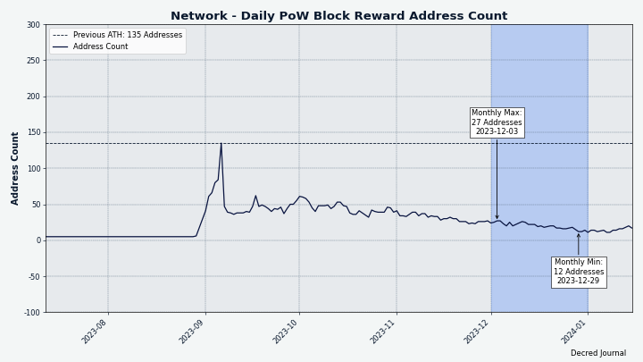
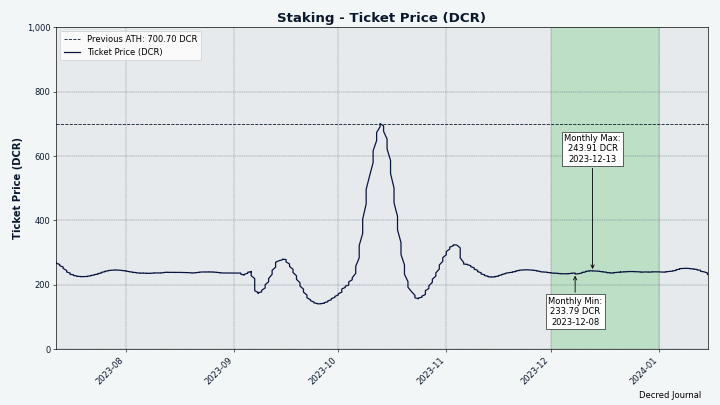
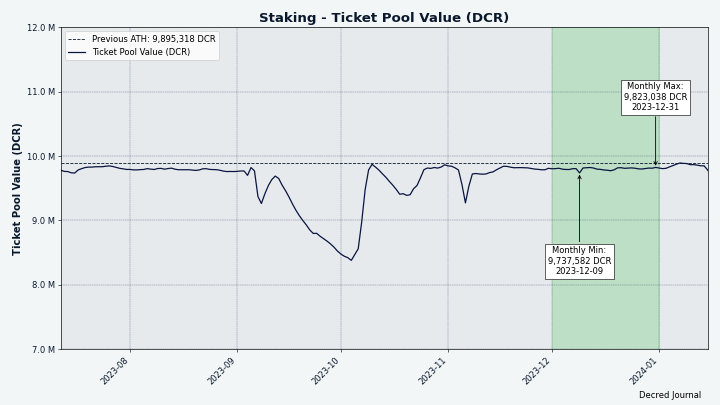
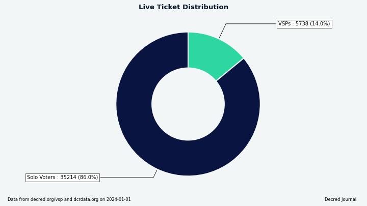
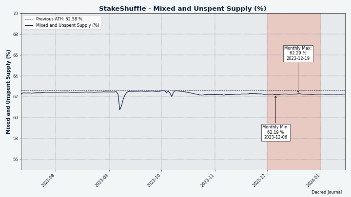
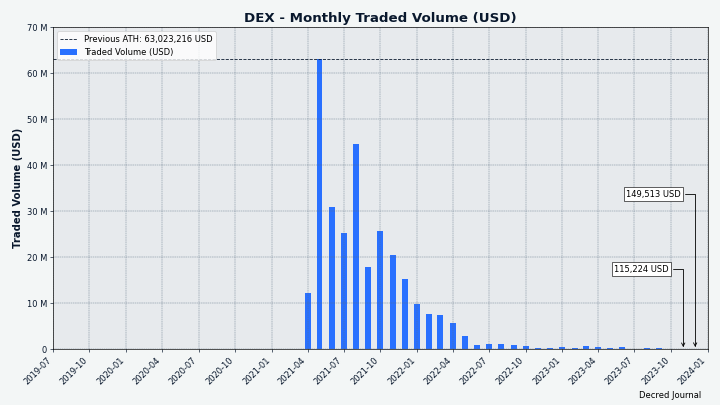
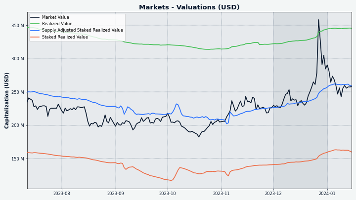

# Decred 月报 – 2023 年 12 月

_图片：@Exitus_

*亲爱的读者，很抱歉花了这么长时间才完成十二月的月报。近几个月来，抽时间为《华尔街日报》工作是一个巨大的挑战。我们正在讨论对 月报 进行彻底改革以优化我们的工作。我希望本期仍然能为您提供独特且有用的信息。阅读愉快！-- @bee*

12 月亮点：

- 两项提案已获得批准，即在 2024 年继续执行 Bug 赏金计划和视频内容创建。

- 两个新的矿池已经启动，但数据表明挖矿再次变得更加集中。

- 钱包应用程序和 Bison Relay 正在为下一个版本进行完善，Cake 集成正在进行中。

内容:

- [开发进展总结](#development)
- [人员](#people)
- [治理和财务](#governance-and-finances)
- [网络](#network)
- [生态系统](#ecosystem)
- [外展](#outreach)
- [媒体](#media)
- [市场](#markets)
- [相关外部信息](#relevant-external)

## 开发进展总结

除非另有说明，否则下面报告的工作为“合并至核心存储库”状态。这意味着该工作已完成、审查并集成到高级用户可以[构建和运行](https://medium.com/@artikozel/the-decred-node-back-to-the-source-part-one-27d4576e7e1c)的源代码中，但普通用户尚不可用。

### dcrd

_[dcrd](https://github.com/decred/dcrd) 是一个完整的节点实现，为 Decred 在全球的点对点网络提供支持。_

开发者和内部变化：

- 更新了 [Docker 镜像](https://github.com/decred/dcrd/pull/3214) 使用 Go 1.21.5 进行构建。
- 在 `wire` 包中将 `cfilter` 版本 1 消息标记为 [已弃用](https://github.com/decred/dcrd/pull/3205)。 这只是一般清理，因为 V1 `cfilter` 已经无效。 自 [DCP-5](https://github.com/decred/dcps/blob/master) 以来，V2 `cfilter` 已成为[标准](https://github.com/decred/dcrd/pull/1906)于 2020 年 1 月激活。

进行中：

- 将 [P2P 混合信息](https://github.com/decred/dcrd/pull/3066) 引入 `wire` 协议

### dcrwallet

_[dcrwallet](https://github.com/decred/dcrwallet) 是命令行和图形界面钱包应用程序使用的钱包服务器。_

面向用户的变化：

- 仅在钱包完全同步后[请求阻止通知](https://github.com/decred/dcrwallet/pull/2310)。 这解决了钱包可能会在底层 dcrd 实例完全同步之前尝试查看区块的竞争问题。 当 dcrwallet 在 dcrd 之后很快启动时（例如，从 Decrediton 内部），可能会发生这种情况。 结果将是错过交易通知并且钱包余额错误，需要重新扫描才能修复。
- 当钱包在 SPV 模式下同步时，[并行处理标头批次](https://github.com/decred/dcrwallet/pull/2311)。 在现实世界中进行测试时，这使得同步速度平均提高了 32%。
- 当钱包处于 SPV 模式并且初始同步已经完成时，[从每个新连接的对等点请求标头](https://github.com/decred/dcrwallet/pull/2316)。 当本地客户端离线一段时间（例如，由于网络连接间歇性）时，通过确保立即请求所有新标头，而不是等到宣布新块，可以加快初始同步后的重新同步速度 开始追赶过程。
- 修复了一个错误，即如果从种子恢复后这些交易位于提示块中，则恢复的钱包将[错过发现交易](https://github.com/decred/dcrwallet/pull/2319)。 这是一个相当罕见的错误，因为恢复后链中有更多块（常见情况）可以防止该问题出现。 该错误可能只会影响自动化开发测试，尽管重新扫描也可以为可能遇到该错误的任何用户解决该问题。

内部和开发人员变更：

- 将修剪程序修改为[修剪部分侧链](https://github.com/decred/dcrwallet/pull/2309)，而不是修剪整个树。 这还没有功能变化，但将来将允许 SPV 客户端异步处理链。
- 尽可能使用 Go 1.19 [原子类型](https://github.com/decred/dcrwallet/pull/2312)。 这些类型仅允许通过提供的方法进行访问，从而防止误用，并保证正确使用，即使变量在结构布局中重新组织也是如此。
- 如果对等方向钱包提供了一个新块，确保该块在主链或侧链中具有[已知的祖块](https://github.com/decred/dcrwallet/pull/2315)。 如果不存在已知的祖块，这意味着钱包错过了一些块并且应该重新同步块头。 以前，钱包只寻找主链中的祖块，而不是所有侧链。 这导致“getHeaders”不必要地频繁运行，特别是对于使用侧链模拟大型重组的开发人员而言。
- 修复 gRPC 记录器，该记录器在记录消息参数时无法[正确删除前缀](https://github.com/decred/dcrwallet/pull/2313)。 

进行中：

- 添加[集成测试](https://github.com/decred/dcrwallet/pull/2318)，在已知会导致丢失交易的各种场景下恢复钱包的正确行为。 这些测试利用即将推出的[自动化和测试框架](https://github.com/decred/dcrtest/pull/20)，通过其 JSON-RPC 和 gRPC 接口操作 dcrwallet 二进制文件。
- 添加[批量获取紧凑型过滤器](https://github.com/decred/dcrwallet/pull/2314)以进一步[加速SPV模式下的同步](https://github.com/decred/dcrwallet/issues/2289)。 此更改取决于相关的[dcrd 中的更改](https://github.com/decred/dcrd/pull/3211)，使完整节点能够向轻 SPV 客户端提供批量数据。

### vspd

_[vspd](https://github.com/decred/vspd) 是投票服务提供商使用的服务器软件。 VSP 24/7 代表其用户投票，并且不能窃取资金。_

- [添加文档](https://github.com/decred/vspd/pull/458)，了解新的 VSP 管理员如何在 Decrediton 和 [decred.org/vsp](https://decred.org/vsp)上列出其 VSP。 该文档并不针对普通用户，因此也已从 [docs.decred.org](https://docs.decred.org) 中删除。

### dcrpool

_[dcrpool](https://github.com/decred/dcrpool) 是用于运行 Decred 矿池的服务器软件。_

- 在矿池账户页面显示已连接矿工的[IP和端口](https://github.com/decred/dcrpool/pull/428)。 这使得区分客户变得更容易。
- 如果 dcrd 的 `GetTxOut` 方法找不到给定交易的输出，则允许 dcrpool [优雅地处理错误](https://github.com/decred/dcrpool/pull/431)。

### Lightning Network

_[dcrlnd](https://github.com/decred/dcrlnd) 是 Decred 的闪电网络节点软件。 闪电网络可实现即时低成本交易。_

- 添加了自动关闭[一段时间内未重新建立](https://github.com/decred/dcrlnd/pull/196)的通道。 通常，通过“重建”通道来保持健康。 如果通道对等点在线一段时间但没有发送消息来重新建立通道，则此类通道很可能被强制关闭，因为远程对等点可能已失去使用该通道的能力（例如 ，由于在数据丢失后恢复节点而未使用 [SCB 备份文件](https://docs.decred.org/lightning-network/backups/))。 默认情况下，如果通道的远程交易对手连续72小时在线而没有重新建立通道，通道将自动关闭。 这应该是在集线器（24/7 在线）和临时节点（每天可能仅在线一两个小时）上过快关闭通道之间的合理折衷。 添加了集成测试来判断正确的行为。

### cspp

_[cspp](https://github.com/decred/cspp) 是一个使用 CoinShuffle++ 协议的协调混币服务器。 它是非托管的，即从不持有任何资金。 CSPP 是 Decred 隐私系统 StakeShuffle 的一部分。_

- 更新了 [C 头文件](https://github.com/decred/cspp/pull/98) 以支持 [第三个主要版本](https://flintlib.org/doc/history.html#flint-3-0-0)的快速数学库“flint”（2023 年 10 月发布）。较新版本的“flint”可能会为 CSPP 服务器提供更高性能和其他改进。

### DCRDEX

_[DCRDEX](https://github.com/decred/dcrdex) 是一个非托管、尊重隐私的交易所，用于去信任交易，由原子交换提供支持。_

更改向后移植到下一个 v0.6.x 版本：

- 修复了服务器断开连接后交易可能[卡住](https://github.com/decred/dcrdex/pull/2622)的错误。受影响市场的完整列表尚不清楚，但已知该漏洞影响了 LTC/DCR 市场，但没有影响 DCR/BTC 市场。

做市商机器人：

- 实现了初级[CEX管理功能](https://github.com/decred/dcrdex/pull/2568)：存款、取款和余额跟踪。 自动重新平衡已添加到简单的套利策略中，机器人可以向 CEX 发起存款和取款，以维持配置的余额。 币安是第一个支持此功能的 CEX。
- 修改了 Binance 代码以跟踪 1,000 个[订单簿条目](https://github.com/decred/dcrdex/pull/2627)，而不是 20 个。
  
一般客户变更：

- 在 DEX 设置视图中添加了[过期未退款债券](https://github.com/decred/dcrdex/pull/2626) 的显示。 当债券到期时，可以退还以收回资金。
- 较小的用户界面修复。

其他：

- 更新了 [dex.decred.org 页脚](https://github.com/decred/dexweb/pull/39) 以显示更多支持的资产。

正在进行中的亮点：

- 切换到 [Polygon 上的原生 USDC](https://github.com/decred/dcrdex/pull/2629)。
- 用于创建独立的 [Windows 桌面应用程序](https://github.com/decred/dcrdex/pull/2635) 及其安装程序的构建环境。
- @buck54321 在 Twitter 上询问 [哪些货币和功能](https://twitter.com/blockchainbuck/status/1732515860156199038) 社区希望看到未来开发，以及 [哪些 USDC 对](https://twitter .com/blockchainbuck/status/1734048766850683051）是最受欢迎的。

### Cryptopower

_[Cryptopower](https://github.com/crypto-power/cryptopower) 是一款适用于 DCR、BTC 和 LTC 的多币种桌面 GUI 钱包。 它以保护隐私的轻 SPV 模式运行，无需完整的区块链，支持 Decred 质押、混合、投票和其他独特功能。_

新实现的 UI 元素：

- [管理钱包账户](https://github.com/crypto-power/cryptopower/pull/260)页面。
- [帮助页面](https://github.com/crypto-power/cryptopower/pull/219) 帮助用户在首次启动应用程序后进行初始配置。
- 概述页面上的动画[滑动更新](https://github.com/crypto-power/cryptopower/pull/256)。
- 更新了[治理页面](https://github.com/crypto-power/cryptopower/pull/221)的UI设计（提案、共识、财务）。
- 在交易页面添加了[“所有钱包”过滤器](https://github.com/crypto-power/cryptopower/pull/313)。
- 在[发送页面](https://github.com/crypto-power/cryptopower/pull/310)添加了高级选项，包括在一笔交易中发送给多个地址的能力。

交易：

- 通过 [Trocador](https://github.com/crypto-power/cryptopower/pull/257) 实现硬币转换（交换）。
- 添加了首次访问 DCRDEX 和 CEX 功能时显示的[介绍页面](https://github.com/crypto-power/cryptopower/pull/224)。
- 单击概览上的最近交易时打开[交易详细信息](https://github.com/crypto-power/cryptopower/pull/300)。
- 添加了[交易历史](https://github.com/crypto-power/cryptopower/pull/333)页面。

去中心化交易：

- 为 DCRDEX 主页实现了 [UI 布局](https://github.com/crypto-power/cryptopower/pull/208)，基础 DEX [逻辑](https://github.com/crypto-power/cryptopower/pull/238)，以及从 DCR 钱包[购买信用债券](https://github.com/crypto-power/cryptopower/pull/269)的能力。

隐私：

- 更新了[隐私页面](https://github.com/crypto-power/cryptopower/pull/248)。 默认情况下，混币将关闭，不会创建与混币相关的帐户，并且允许从“默认”帐户发送。

移动 UI 实现，以下页面已针对移动屏幕进行更新/修复：

- 通用[标题](https://github.com/crypto-power/cryptopower/pull/311)，钱包名称和余额显示在所有钱包的子页面上。
- 更新了[混币选项卡](https://github.com/crypto-power/cryptopower/pull/316)和[最近交易](https://github.com/crypto-power/cryptopower/pull/339) 在概览页面上。
- [治理](https://github.com/crypto-power/cryptopower/pull/317) 布局。
- [StakeShuffle](https://github.com/crypto-power/cryptopower/pull/330) 页面。
- [CEX 交易](https://github.com/crypto-power/cryptopower/pull/323)（即时交易）布局。
- [常规设置和钱包设置](https://github.com/crypto-power/cryptopower/pull/324)页面。
- [交易](https://github.com/crypto-power/cryptopower/pull/327) 页面（应用程序范围、钱包范围、交易详细信息）。
- [质押](https://github.com/crypto-power/cryptopower/pull/335)页面。
- 钱包[账户](https://github.com/crypto-power/cryptopower/pull/336)页面。
- 钱包[信息](https://github.com/crypto-power/cryptopower/pull/332)（概述）页面。
- [应用程序入门](https://github.com/crypto-power/cryptopower/pull/342) 页面。
- 钱包[创建/恢复](https://github.com/crypto-power/cryptopower/pull/352)页面，钱包[备份](https://github.com/crypto-power/cryptopower/pull/350) ）页。
- [发送](https://github.com/crypto-power/cryptopower/pull/347) 和 [接收](https://github.com/crypto-power/cryptopower/pull/346) 页面和快速访问 情态动词。

修复：

- 修复了在未创建 DCR 钱包的情况下访问 [国库页面](https://github.com/crypto-power/cryptopower/pull/235) 时出现的错误。
- 修复了桌面模式下显示的[移动 UI 元素](https://github.com/crypto-power/cryptopower/pull/298)。
- 修复了恢复 Decred 钱包后访问 [质押页面](https://github.com/crypto-power/cryptopower/pull/328) 时的崩溃问题。
- 修复了查询即时兑换订单时的请求[速率限制](https://github.com/crypto-power/cryptopower/pull/323)错误。
- 其它小的用户界面修复。

内部和开发人员变更：

- 重构以删除[不必要的接口](https://github.com/crypto-power/cryptopower/pull/235)。
- [为 Android 和 iOS 构建](https://github.com/crypto-power/cryptopower/pull/299) 的记录说明。

其它：

- Android 和 iOS 应用程序的测试版本已提交至 Google Play Store 和 Apple TestFlight。

_图片：Cryptopower 将支持通过隐私友好的 [Trocador.app](https://trocador.app/) 进行交易_

_图片：Cryptopower 正在为 DCRDEX 上的交易添加轻量级 UI_

_图片：Cryptopower 为移动屏幕做好准备_

### Cake Wallet Integration

进行中：

- 将 [libwallet](https://github.com/JoeGruffins/cake_wallet/pull/8) 集成到 Cake Wallet 的构建过程中。
- 已[创建](https://github.com/JoeGruffins/cake_wallet/tree/onlydecred)删除了大多数其他代币的代码分支，以加快开发过程。
- 讨论如何从 Cake 的 Dart 代码调用 Go 代码。 到目前为止的计划是使用简单的 [JSON 字符串](https://github.com/itswisdomagain/libwallet/pull/6) 连接各层。
- 讨论 libwallet 应该为 Cake 和 Cryptopower 提供哪些 API。
- 添加[初始 Decred 屏幕](https://github.com/cake-tech/cake_wallet/pull/1165) 的第一个更改已合并到上游集成分支中。 该分支是在将 Decred 代码添加到 Cake Wallet 的“main”分支之前测试和完善 Decred 代码的中间位置。

### decred.org

_[dcrweb](https://github.com/decred/dcrweb) 是 [decred.org](https://decred.org/) 网站的源代码。_

- 改进了[钱包页面](https://github.com/decred/dcrweb/pull/1152)上的链接和文本，以帮助用户从四个钱包选项中进行选择。
- 更新了[葡萄牙语翻译](https://github.com/decred/dcrweb/pull/1160)。

_图片：四种钱包选择反映了正在进行的大量开发，但用户需要指导才能找到最适合他们的_

### Bison Relay

_[Bison Relay](https://github.com/companyzero/bisonrelay) 是一个新的社交媒体平台，具有无审查、监视和广告的功能，由 Decred 闪电网络提供支持。_

下面列出的工作已合并到下一个版本的“master”中。

GUI 和文本应用程序中的更改：

- 添加了[更改群聊所有者](https://github.com/companyzero/bisonrelay/pull/391)的命令。

GUI 应用程序中的更改：

- 添加了一个按钮[重置所有密钥交换](https://github.com/companyzero/bisonrelay/pull/388) (KX)。
- 添加了一个直接从新闻源中[订阅帖子](https://github.com/companyzero/bisonrelay/pull/382)的按钮（节省了几次点击）。
- 在用户菜单中添加了[传递 KX 重置](https://github.com/companyzero/bisonrelay/pull/390) 命令。
- 修复了缺失的[取消订阅帖子](https://github.com/companyzero/bisonrelay/pull/382)菜单项。

基于文本的应用程序（brclient）：

- 在“/invite”元命令下对各种[邀请处理](https://github.com/companyzero/bisonrelay/pull/386)子命令进行分组。
- 修复了隐藏客户端自己的消息的客户端消息[过滤](https://github.com/companyzero/bisonrelay/pull/393)。

内部和开发人员变更：

- 更新到最新的 [dcrlnd](https://github.com/companyzero/bisonrelay/pull/392) 并改进了启动过程中 dcrlnd 准备情况的跟踪。

### 其它

- 更新了 [Bug Bounty 网站](https://bounty.decred.org/)，仅显示前 5 位参与者，并链接到包含完整列表的单独页面。
- 修复了 [DCRDEX 版本](https://github.com/decred/umbrel-app-store/pull/10) 并在 Decred 的自定义 [Umbrel 应用商店](https://github.com/decred/umbrel) 中固定哈希 -应用商店）。

## 人员

截至 1 月 14 日 * 的社区统计数据（与 12 月 3 日相比）：

- [Twitter](https://twitter.com/decredproject) 关注：54,595 (+656)
- [Reddit](https://www.reddit.com/r/decred/) 订阅：12,768 (-5)
- [Matrix](https://chat.decred.org/) #普通用户：842 (+9)
- [Discord](https://discord.gg/GJ2GXfz) 会员：1,924 (+62)，已验证发帖人数：772 (+3)
- [Telegram](https://t.me/Decred) 成员：2,327 (+8)
- [YouTube](https://www.youtube.com/decredchannel) 订阅：4,670 (+10)，观看次数：247.1K (+2.4K) \*\*

\* 由于快照拍摄于 1 月 14 日（YouTube 为 1 月 9 日），增量代表约 1.5 个月，而不是通常的 1 个月。

\*\* Decred 的 [YouTube 频道](https://www.youtube.com/channel/UCJ2bYDaPYHpSmJPh_M5dNSg) 现在有超过 300 个视频！

## 治理和财务

12 月，新[国库](https://dcrdata.decred.org/treasury) 收到了 7,467 个 DCR，价值 11.9 万美元，按 12 月的平均汇率 15.89 美元计算。 8,427 DCR 用于支付承包商费用，按相同价格计算价值 134,000 美元。

[国库交易](https://dcrdata.decred.org/tx/bbe950023801d9a9a082b15374cb5b30385172431dec0961207b2adb7197e82d)以 99.5% 的赞成票和 58% 的投票率获得批准，并于 12 月 19 日开采。它有 29 个产出进行支付承包商，范围从 7.5 DCR 至 2,182 DCR。 大部分 DCR 可能是 10 月和 11 月工作的报酬。 估计两个月的平均账单汇率为 13.54 美元，此 TSpend 中的账单金额约为 11.4 万美元。

截至 1 月 1 日，[旧版](https://dcrdata.decred.org/address/Dcur2mcGjmENx4DhNqDctW5wJCVyT3Qeqkx) 和[新金库](https://dcrdata.decred.org/treasury) 的总余额为 870.9K DCR (15.7 百万美元，价格为 17.98 美元）。

_图片：DCR 中的国债流入和流出_

_图片：财政部每月余额（美元）； 请注意，这在很大程度上取决于汇率_

12 月提交并批准了两项提案：

- [Bug Bounty Program 2024](https://proposals.decred.org/record/a1fd5dd) @jholdstock 请求预算为 105,000 美元，其中 100,000 美元用于奖励金，5,000 美元用于管理费用。 实际上，之前的迭代只使用了所请求预算的一小部分。该提案报告称，过去 18 个月的支出为 415 美元的赏金费用和 1,750 美元的运营费用。 自 2019 年启动以来，该计划总共花费了约 11,000 美元。该提案已获得 98% 的赞成率和 74% 的极高投票率批准。

- [Decred Video Content 2024](https://proposals.decred.org/record/49cf2e1) @phoenixgreen 请求为 2024 年视频内容的创建和传播提供 71,000 美元的预算。该提案已获得 85% 的批准 和 64% 的投票率。

一位提案作者报告了购买 [提案积分](https://matrix.to/#/!qYpAAClAYrHaUIGkLs:decred.org/$elsLkiZbjOz5Pyx42S6e3HPk_4gnkoVpK8J_-qNhqJM) 时出现的问题，但该问题在几天内得到了解决。 11 月未检测到注册费的问题[持续](https://matrix.to/#/!qYpAAClAYrHaUIGkLs:decred.org/$5SiSLy_z6wCTEhGzKif9rgGjKo-kOPMNBROt3i_dRqs) 在 12 月仍然存在，目前尚不清楚它是否只影响一个不幸的新人帐户或其他可能的帐户。

有关本月提案的更多详细信息，请参阅 [Politeia Digest 第 65 期](https://www.cypherpunktimes.com/politeia-digest-september-27-december-12-2023/)。

PD 的发布工作流程已重新设计，以提高覆盖范围和参与度：主要发布渠道现在是 [Cypherpunk Times](https://www.cypherpunktimes.com/politeia-digest-september-27-december-12-2023/) (主链接发布在 Twitter 和其他地方），Medium 版本现已发布在 [Decred 的主要出版物](https://medium.com/decred/politeia-digest-65-september-27-december-12-2023-984c12c31091) （而不是鲜为人知的 [Politeia Digest](https://medium.com/politeia-digest) 出版物）和配套的 [Twitter 帖子](https://twitter.com/decredproject/status/1737514771954471033) 现在正在 制作的目的是让您无需离开 Twitter 即可观看精彩片段。

## 网络

本节跟踪 Decred 基础设施的关键健康指标。

### Mining

12 月的 [全网算力](https://dcrdata.decred.org/charts?chart=hashrate&scale=linear&bin=day&axis=time) 以 5.5 TH/s开启，结束约为 10.2 TH/s，最低 3.8 TH/s，达到峰值为 11.6 TH/s。

_图片：在 GPU 矿工最初涌入后，Decred 算力正在寻求新的平衡_

截至 1 月 7 日，实际[开采](https://miningpoolstats.stream/decred) 的 1,000 个区块的分布：[miningandco.com](https://decred.miningandco.com/) 26%，[pooltronic.tech](https ://decred.pooltronic.tech/) 21%, [gopool.cash](https://dcr.gopool.cash/) 2.7%, [losmuchachos.digital](https://losmuchachos.digital/) 1.3% ，并且 49% 的区块未被 [miningpoolstats.stream](https://miningpoolstats.stream/decred) 识别。

_图片：唯一挖矿地址的减少表明它再次变得更加中心化_

### Staking

[选票价格](https://dcrdata.decred.org/charts?chart=ticket-price&axis=time&visibility=true-true&mode=stepped) 在 234-243 DCR 之间变化。

_图：12月票价一直很稳定_

[锁定金额](https://dcrdata.decred.org/charts?chart=ticket-pool-value&scale=linear&bin=day&axis=time)为974-982万个DCR，这意味着循环供应量的62.0-62.6%[参与](https://dcrdata.decred.org/charts?chart=stake-participation&scale=linear&bin=day&axis=time) 的权益证明。

_图片：锁定门票的 DCR 保持在其 ATH 附近_

### VSP Staking

截至 1 月 1 日，[14 个列出的 VSP](https://decred.org/vsp/) 总共管理了约 5,750 张 (-100) 现场选票，占选票池的 14.0% (-0.3%)。

12 月份涨幅最大的是 [vote.dcr-swiss.ch](https://vote.dcr-swiss.ch)（+290 票或+105%）和 [vsp.stakeminer.com](https://vsp.stakeminer.com/)（+67 票或+11%）。

_图片：VSP 管理的选票分布_

_图片：[solo投票者](https://docs.decred.org/advanced/solo-proof-of-stake-voting/) 继续占据主导地位，只有 14% 的选票使用 VSP_

_图片：VSP 比solo选民更擅长不错过选票_

### 节点

[Decred Mapper](https://nodes.jholdstock.uk/user_agents) 整个月观察到 141 到 151 个 dcrd 节点。 1 月 1 日出现的 145 个节点的版本：v1.8.0 - 65%、v1.8.1 - 27%、v1.9.0 开发版本 - 3%、v1.7.x - 2%、其他 - 3.4%。

_图片：节点正在慢慢升级到v1.8.1。 2023 年 1 月之前的红色区域表示我们当时拥有的数据不完整。_

### StakeShuffle

[混币](https://dcrdata.decred.org/charts?chart=coin-supply&zoom=jz3q237o-la8vk000&scale=linear&bin=day&axis=time&visibility=true-true-true)的份额在62.2-62.3%之间变化。 每日 [混合量](https://dcrdata.decred.org/charts?chart=privacy-participation&bin=day&axis=time) 在 346-541K DCR 之间变化。

_图片：62% 的流通供应选择保护隐私和可互换性_

### 闪电网络

截至 1 月 8 日，Decred 的 [闪电网络](https://ln-map.jholdstock.uk/) 浏览器有 220 个节点 (+0)、415 个通道 (-5)，总容量为 202 DCR (-4) . 请注意，每个 LN 节点的这些统计数据都是不同的。

_图片：Decred 闪电网络容量保持在 200 DCR 左右_

## 生态系统

### 矿池

- [losmuchachos.digital](https://losmuchachos.digital/)已上线，是一家德国DCR矿池，支持PPLNS支付模式，矿池费用为3%。

- [dcr.gopool.cash](https://dcr.gopool.cash/) 已被发现。 [MiningPoolStats](https://miningpoolstats.stream/decred) 报告称，巴西矿池使用 PPLNS 模型，费用为 1%。 DCR 是矿池支持的 [15 种币](https://miningpoolstats.stream/gopool.cash_pools) 之一。

- 现在有（至少）5 个公共矿池，全部运行 [dcrpool](https://github.com/decred/dcrpool) 软件。

### 交易所

- 根据[11月20日](https://twitter.com/BittrexGlobal/status)发布的关闭计划，Bittrex Global上的所有交易活动已终止。 如果我们对链活动的解释是正确的，那么交易停止时（12 月 4 日）Bittrex 持有的金额为 [~17.5K DCR](https://dcrdata.decred.org/tx/d44e9f656bc3f376ff5814b9088b6c6de2718569d532b0dae1d7aec0e0e8f51b)，看起来像是提款功能顺利。

- [MEXC](https://www.mexc.com/) 已[添加](https://github.com/decred/dcrweb/pull/1158) 到 [decred.org 交易所](https://decred.org/exchanges/)DCR 提款后的列表已[确认](https://github.com/decred/dcrweb/issues/1157) 正常工作。 该交易所通过 VPN 运行，并且允许进行一些无需 KYC 的交易。 MEXC 于 [2019 年 6 月](https://twitter.com/MEXC_Official/status/1143851087167758337) 增加了现货 DCR/USDT 市场，并于 [2020 年 12 月](https://twitter.com/MEXC_Official) 增加了 5 倍杠杆 DCR/USDT 货币对，但几乎没有社区反馈来确认它是否有效。

- 在一些用户报告[资金扣押](https://cointelegraph.com/news/traders-report-frozen-assets-account-blocks-mexc)、账户冻结和提款被阻止后，MEXC 引起了一些争议。 MEXC 在其[回复](https://twitter.com/MEXC_Official/status/1738767532004434018) 中否认了所有说法。 报告中的两种常见模式是利润丰厚的杠杆交易和大额提款，两者都被 MEXC 标记为“异常”活动。 我们无法验证这些报告是否属实，但这是一个很好的提醒，请务必进行自己的研究，并在处理托管服务时要非常小心。

- 根据其[support](https://support.poloniex.com/hc/en)上发布的信息，Poloniex和HTX的DCR提现继续暂停，总计约1.5个月，并且在12月尚未修复 [站点](https://www.htx.com/support/en-us/) 以及 #trading 频道中的一份用户报告。 为了应对这些交易所的[两次黑客攻击](202311.md#ecosystem)，包括 DCR 在内的所有提款均于 11 月暂停。

- 印度金融当局宣布决定[屏蔽 9 个离岸交易所的 URL](https://www.coindesk.com/policy/2023/12/29/indias-local-crypto-and-web3-advocacy-body-asked-for-action-against-offshore-entities-source/)不遵守当地反洗钱法规。 如果该区块实施，从印度进入 Binance、KuCoin 和其他交易所的 DCR 市场将变得更加困难。

### 钱包

- 12 月，硬件钱包 [Ledger](https://www.ledger.com/) 用户成为 [供应链攻击](https://www.ledger.com/blog/security-incident-report) 的受害者。 攻击者利用前 Ledger 员工的受损 [npmjs.com](https://www.npmjs.com/) 帐户上传许多 DApp 使用的 Ledger Connect Kit 库的恶意版本，从而欺骗了 EVM DApp 用户签署交易会耗尽他们的钱包。 该漏洞很快得到了修补，但修复传播大约需要 5 个小时。 该漏洞仅限于使用该库的第三方 DApp，它不会影响 Ledger 硬件或 Ledger Live 的完整性。 Ledger [tweet](https://twitter.com/Ledger/status/1737457365526470665) 表示，价值约 60 万美元的资产受到影响，并承诺受害者[索赔](https://support.ledger.com/hc/en-us/articles/15580506579101)退款（此过程需要身份验证）。 据我们所知，没有任何 DCR 钱包受到该漏洞的影响。

### 其它新闻

- 加密借贷服务 [CoinRabbit.io](https://coinrabbit.io/) 已[添加](https://twitter.com/CoinRabbitLoans/status/1739750163579625829) DCR 作为抵押资产。

加入我们的 [#ecosystem](https://chat.decred.org/#/room/#ecosystem:decred.org) 聊天，获取有关 Decred 服务的更多新闻。

警告：Decred 月报的作者不知道上述任何服务的可信度。 在将您的个人信息或资产委托给任何实体之前，请先进行自己的研究。

## 外展

### Decred Vanguard

Vanguard 举办了两项不同的 DCR 赠品活动，试图扩大影响范围：[Meme 竞赛](https://twitter.com/exitusdcr/status/1730263344668352982) 和 [新年赠品](https://twitter.com/exitusdcr/status/1740456118462345249)。

其他值得注意的活动：

- 通过 Twitter/电子邮件联系 [Alchemy Pay](https://alchemypay.org/) 进行 Decred 集成，这是一项使用法定支付卡执行加密货币购买的服务。
- 申请并联系了 [Biconomy](https://biconomy.com/)，这是一家拥有美国许可证的加拿大交易所。
- 向 [Crypto.com](https://crypto.com/) 申请列出。

[2023 年提案](https://proposals.decred.org/record/0a1b782) 于 12 月 31 日结束。 制定了 [2024 年新提案](https://proposals.decred.org/record/d658f9a)，其中包括贡献者等级、X 上的广告资金、增加用于赠品和其他实验等的可自由支配资金，同时防止事情发生 第一个提案是 DAO 资助的工具。

### Cypherpunk Times

[Cypherpunk Times](https://www.cypherpunktimes.com/) 的内容创建流程正在发生变化，以便对社区更加开放。 公共 [#writers](https://matrix.to/#/!NkCFEoJGXyDMwLfgMb:decred.org/) 聊天现在被积极用于计划和审查即将发表的文章，或讨论网站的总体方向和运营。 选择和创建内容的过程正在标准化并记录下来，以指导现有和未来的作者。

12 月参与度统计：

- CT上的文章总数：606
- 时事通讯订阅者：114
- 发送的新 CT 帖子和时事通讯：18
- 所有平台和帐户的社交媒体关注者：1,206
- [@decredsociety](https://twitter.com/decredsociety) Twitter：关注者 - 1,007，帖子 - 48，推文展示次数 - 47.9K，点赞 - 992，转发 - 136
- [@cypherpunktimes](https://twitter.com/cypherpunktimes) Twitter：关注者 - 199，帖子 - 47，推文展示次数 - 13.5K，点赞 - 230，转发 - 53
- 12 月份按项目发布的帖子：Zcash - 1、Decred - 9、其他加密新闻 - 4

## 媒体

### 文章

Decred:

- [Cypherpunk 与 Zcash 社区的 Michael 交谈！](https://www.cypherpunktimes.com/cypherpunk-talk-with-ernesto-from-the-dash-community-2/) @Joao
- [Decred vs Polkadot：克服挑战](https://www.cypherpunktimes.com/decred-vs-polkadot-2/) @Joao

Cypherpunk Times 上的一般加密货币文章：

- [《Cypherpunk Times》月度综述（2023 年 11 月版）](https://www.cypherpunktimes.com/cypherpunk-times-monthly-roundup-october-2023-edition/) @tallamericano
- [浏览交易所列表丛林：如何列出您的加密货币的综合指南 (2/2)](https://www.cypherpunktimes.com/navigating-the-exchange-listings-jungle-a-compressive-guide -on-how-to-get-your-cryptocurrency-listed-2-2/) @tallamericano
- [加密货币视野：比特币社区分裂和本周加密事件回顾](https://www.cypherpunktimes.com/crypto-in-view-bitcoin-community-split-and-a-recap-of-the -weeks-crypto-events/) @BlockchainJew
- [牛市？ 也许吧，但你必须做好准备！](https://www.cypherpunktimes.com/bull-market-maybe-but-you-have-to-prepare/) @Joao
- [加密货币揭秘：分析核心原理、扭曲和影响（1/2）](https://www.cypherpunktimes.com/cryptocurrency-unveiled-analyzing-core-principles-Distortions-and-impact-1-2/) @tallamericano
- [加密货币揭秘：分析核心原理、扭曲和影响 (2/2)](https://www.cypherpunktimes.com/cryptocurrency-unveiled-analysing-core-principles-Distortions-and-impact-2-2/) @tallamericano
- [Elon Musk 诅咒广告商后出现了超过 300 个 memecoin](https://www.cypherpunktimes.com/more-than-300-memecoins-emerge-after-elon-musk-curses-advertisers/) @Joao
- [加密货币社区如何准备现货比特币 ETF？](https://www.cypherpunktimes.com/how-is-the-crypto-community-preparing-for-a-spot-bitcoin-etf/) @BlockchainJew

### 视频

- [Decred - 金钱进化：开发和社区更新](https://www.youtube.com/watch?v=O-rOgtYkh6A)  @Exitus
- [建立去中心化的劳动力队伍 - 前进](https://www.youtube.com/watch?v=MKWYViZPn-g)  @phoenixgreen 
- [非托管质押 - 前进](https://www.youtube.com/watch?v=1iXN0A_ugdY) 
- [DECRED (DCR) - GPU 挖矿 - BLAKE3 - 分步指南](https://www.youtube.com/watch?v=VnMMRrYBN0o)  HashOnTube

直播：

- [2023 年侵占之年 - 市场状况](https://www.youtube.com/watch?v=yiU1gkoyct4) @phoenixgreen @Exitus @h3la1

### 音频

- [2024 年 - 加密货币完全成为主流的一年？](https://twitter.com/i/spaces/1ypJdkebzbjGW) - 由 @Tivra 主持的 Twitter Space 谈论 ETF、人工智能、加密货币工作、退市和 DEX 等 。

### 非英语内容

- [Decredition 上的点对点交易](https://www.youtube.com/watch?v=RZz-yPziXwQ)   @arij 的 10 分钟指南（阿拉伯语）
- Decred 月报 10 月份总共获得了 3 个新的阿拉伯语 (@arij)、中文 (@Dominic) 和波兰语 (@kozel) [翻译](https://xaur.github.io/decred-news/)。 谢谢你们这么久以来翻译月报！

### 其它

- [DCR 亮点推介](https://twitter.com/exitusdcr/status/1732126308467949844)  @Exitus
- [DCRDEX 推介/更新](https://twitter.com/blockchainbuck/status/1731832017627517229) @buck54321

> 在美国，托管钱包将需要 KYC/AML。对于普通用户来说，全节点钱包对于 BTC 或 ETH 来说是不可行的。 Decred DEX 解决了这一问题，使用 SPV 技术将 BTC 的 100 GB 减少到 < 4GB，同时具有良好的隐私性和同步时间。
>
> 对于 $ETH，存在基于基础设施提供商（infura 等）的无隐私文化。 我们通过同时启用多个基础设施提供商对此做了一些改进。 有关钱包活动的完整信息需要提供商之间的协作。
>
> 我们的 $DCR、$LTC 和 $BCH 钱包也是 SPV，因此也具有良好的隐私性和同步时间。 #Polygon 有一个多提供商钱包，例如 $ETH。 所有其他钱包都是全节点，这很好，因为它们不是比特币，尽管 $ZEC 全节点仍然具有挑战性。
>
> 财务自主权必须成为每个人的选择。 Decred DEX 正在努力使其成为可能。 我们还有工作要做，但还有其他项目像 Decred DEX 一样遵循区块链原则吗？
>
> 我有没有提到我们的钱包有新的隐私选项？ 我们添加了 #Decred 混合，与交易完全集成，以便重新混合掉期赎回，增加（已经很大的）匿名集。 #Zcash 也将默认受到屏蔽，统一地址等等。 [@blockchainbuck [Twitter](https://twitter.com/blockchainbuck/status/1731832017627517229)]

### 艺术娱乐

- 有人在比特币链上制作了 Decred 技术简介的 [Ordinals 铭文](https://ordinals.com/inscription/3ea12f3785e8026bd5a4bb30cbc7d7c3ebecebac4658b116225bb3424eb86d41i0)
- LukeDashjr 的一个精神错乱的 [Twitter 帖子](https://twitter.com/LukeDashjr/status/1736490182688297135) 关于比特币的高额费用和 Decred（缺乏）治理解决方案
- [Decred 流体区块链](https://www.cypherpunktimes.com/decred-the-fluid-blockchain/)  @OfficialCryptos

## 市场

12 月，DCR 在币安上的交易价格为 USDT 14.12-26.50 、 BTC 0.0032-0.00063。 使用 Coin Metrics 的加权每日收盘数据，价格范围为 14.40-22.66 美元，BTC 0.00033-0.00052。 计算得出的承包商付款平均每日费率为 15.89 美元。

_图片：近期 DCR/BTC，数据来自 Coin Metrics_

_图片：近期 DCR/USD，数据来自 Coin Metrics_

_图片：DCRDEX 每月交易量（美元）_

_图片：基于@bochinchero 的[质押已实现价值](https://bochinchero.medium.com/decred-on-chain-staked-realized-value-444ab5a146d8) 模型的市场估值（美元）_

_图片：第三次尝试离开完美积累区，作者：@saender_

## 相关外部信息

Ledger 的 Connect Kit 库被 SushiSwap、Balancer 和 Zapper 等 DeFi 应用程序大量使用，以允许用户与钱包进行交互，但当工作人员的凭据被泄露并且恶意代码被引入 GitHub 存储库时，该库遭到了黑客攻击。这使得黑客能够在危险信号出现之前的关键 2 小时内从访问其钱包的用户那里窃取48.4 万美元，并且由于对任何以太坊交易的安全性普遍感到恐慌，许多使用该库的 DeFi 协议暂停了操作袭击当天。

自 2024 年 1 月 1 日起，新法规将数字资产视为现金，即“在一次交易（或一系列相关交易）”中接收超过 10,000 美元的交易将强制要求向以下人员报告交易事件和发送者的身份：美国国税局 (IRS) 的 8300 表格。这是 2021 年通过的《基础设施投资和就业法案》（“基础设施法案”）的一项条款，人们普遍认为，该法案在接收加密货币时涉及的管理工作水平增加带来了问题作为一项业务。

Tether 已开始冻结OFAC 制裁的钱包地址持有的资产，并将 Tornado Cash 的合约地址列入黑名单。Tether 也很高兴地让美国特勤局和 FBI 加入他们的平台，同时吹嘘迄今为止已根据执法部门的要求冻结了 4.35 亿美元 USDT。

币安一直在法国举办半天课程，向人们介绍区块链概念和 Metamask 等软件，并让他们注册币安以获得“NFT 文凭”，在一些他们瞄准的贫困地区，被迫报名参加这种“教育”，作为国家资助的再培训工作的一部分。这是法国总理马克龙对该公司相对欢迎态度的结果之一，币安承诺在 2021 年向该国蓬勃发展的加密货币领域投资 1 亿欧元，如本文所述。

这就是 12 月的全部内容。感谢您的阅读！

## 关于月报

这是 Decred 月报的第 66 期。 [此处](https://xaur.github.io/decred-news/) 提供所有问题、镜像和翻译的索引。

来自第三方的大多数信息都是在经过最低限度的健全性检查后直接从源头转发的。 Decred 月报的作者无法验证所有声明。请提防诈骗并自行研究。

感谢（字母顺序）：

- 写作、编辑、出版：bee、bochinchero、Exitus、jz、kozel、phoenixgreen、richardred、zippycorners
- 标题图片：Exitus
- 资金来源：Decred 利益相关者

## 中文社区

* [推特](https://twitter.com/DecredCN)
* [微信公众号](https://mp.weixin.qq.com/mp/profile_ext?action=home&__biz=Mzg2NTExNzc3MA==&scene=124#wechat_redirect)
* [bilibili频道](https://space.bilibili.com/425519478)  
